# SAFe Audit Report — Iteration 6.5 (Day 10)

## Jairosoft Portfolio — JIT Operation Team

| Field | Value |
|---|---|
| **Date** | March 18, 2026 |
| **Auditor** | Claude (AI Agile Consultant) |
| **Framework** | SAFe 6.0 |
| **Organization** | dev.azure.com/jairo |
| **Project** | Jairosoft Portfolio |
| **Team** | JIT Operation Team |
| **Product Owner** | Armelita |
| **Iteration** | Iteration 6.5 (Mar 9 – Mar 22, 2026) |
| **Iteration Day** | Day 10 of 14 (71% elapsed) |
| **Report Type** | Follow-Up Audit & Sprint Health Check |
| **Previous Audit** | AUDIT_2026-03-17_0800.md (Iter 6.5 Day 9, Score: 79/100) |
| **Board URL** | [ADO Board](https://dev.azure.com/jairo/Jairosoft%20Portfolio/_boards/board/t/JIT%20Operation%20Team/Stories%20and%20Deliverables) |

---

## 1. Executive Summary

This report audits **Iteration 6.5** at **Day 10 of 14** (71% elapsed). Today marks a **significant acceleration** in sprint execution.

**Changes since last audit (Day 9, March 17):**

- **4 Training items closed by Teofilo** today: #200345, #200347, #200348, #200349 (+8 SP)
- **Training titles updated** with specific CSS COC module topics — a direct remediation of Finding 11
- **#200350 moved to "Enrollment"** state — new workflow state observed
- **#201003 gained 2 new child tasks** (#201285, #201286) — armelita expanding compliance audit breakdown
- **SP completed jumped from 13 → 21** (24% → 39%) — strongest single-day burn in the sprint

**Health Score: 82/100** (+3 from 79, continuing strong upward trend)

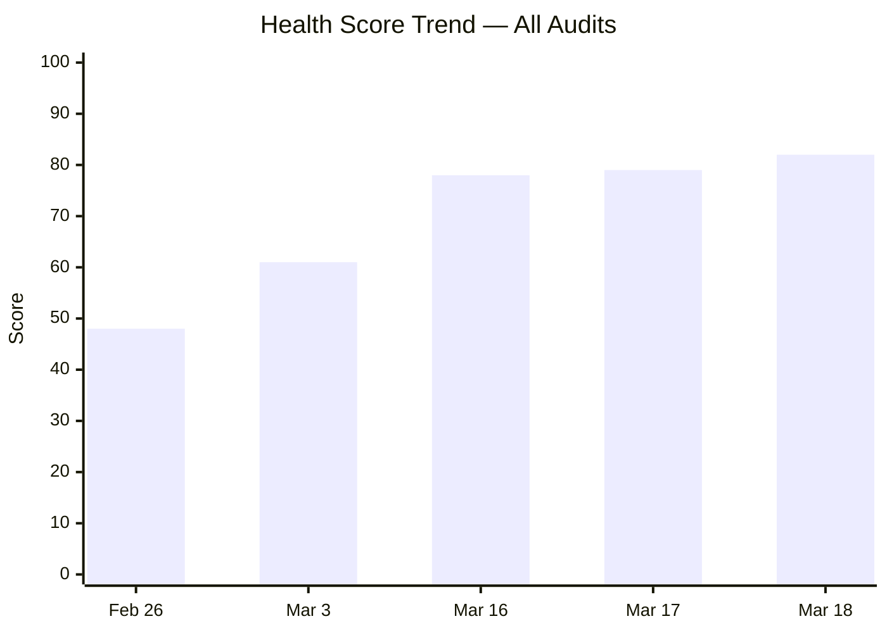

---

## 2. Iteration Snapshot — Delta Analysis

| Metric | Mar 17 (Day 9) | Mar 18 (Day 10) | Delta |
|---|---|---|---|
| Total Work Items | 25 | 25 | — |
| Total Story Points | 54 SP | 54 SP | — |
| Closed Items | 7 | **11** | **+4** |
| SP Completed | 13 SP (24%) | **21 SP (39%)** | **+8 SP (+15%)** |
| Active Items | 8 | **7** | -1 |
| Validation | 1 | 1 | — |
| Enrollment | 0 | **1** | +1 (new state) |
| Ready | 1 | 1 | — |
| New Items | 8 | **4** | **-4** (moved to Closed) |

### State Distribution

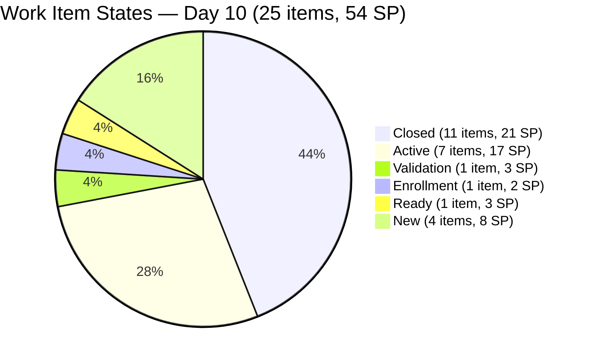

### SP Burndown — Actual vs Ideal

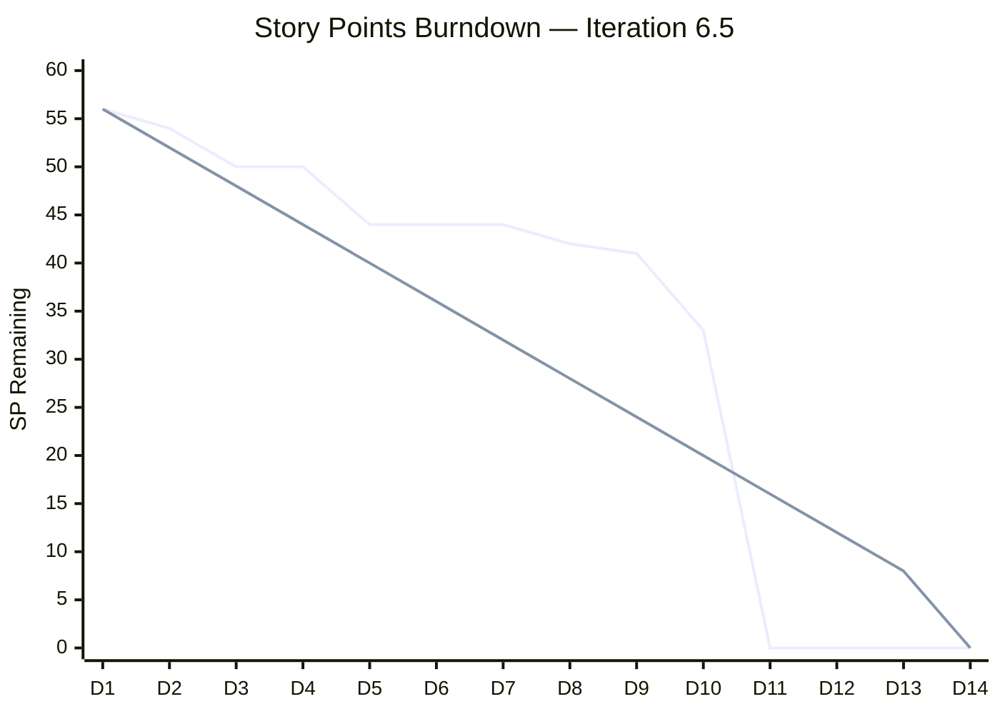

> The team is closing the gap to the ideal burndown. The Day 10 acceleration (8 SP) is the strongest single-day burn of the sprint.

### Iteration Timeline

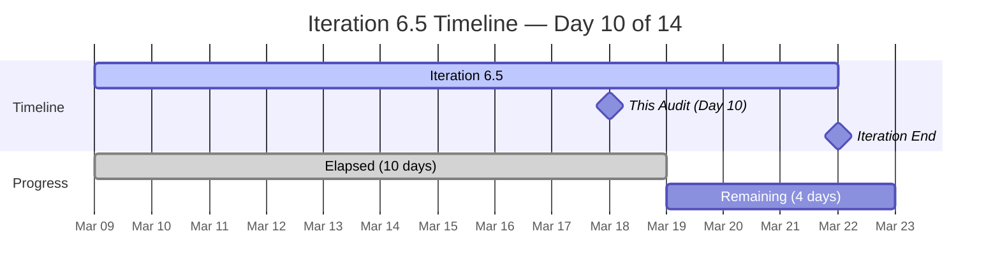

---

## 3. Sprint Goal Probability

### Day-by-Day Tracker

| Day | Date | SP Closed Today | Cumulative SP | SP Remaining | Velocity (SP/day) | Probability |
|---|---|---|---|---|---|---|
| 1 | Mar 9 | 0 | 0 | 56 | 0.0 | 50% |
| 2 | Mar 10 | 2 | 2 | 54 | 1.0 | 52% |
| 3 | Mar 11 | 4 | 6 | 50 | 2.0 | 57% |
| 4 | Mar 12 | 0 | 6 | 50 | 1.5 | 54% |
| 5 | Mar 13 | 6 | 12 | 44 | 2.4 | 65% |
| 6 | Mar 14 | 0 | 12 | 44 | 2.0 | 62% |
| 7 | Mar 15 | 0 | 12 | 44 | 1.7 | 60% |
| 8 | Mar 16 | 0 | 12 | 42 | 1.5 | 62% |
| 9 | Mar 17 | 1 | 13 | 41 | 1.4 | 68% |
| **10** | **Mar 18** | **8** | **21** | **33** | **2.1** | **75%** |

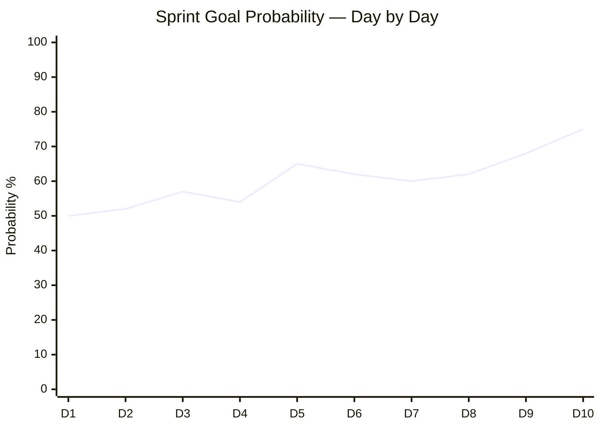

### Remaining Work Analysis

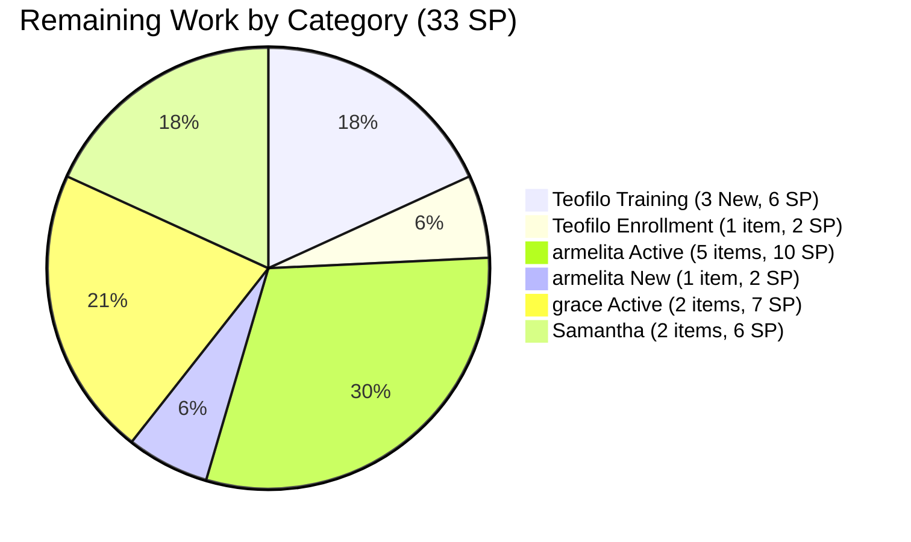

**Assessment: MODERATE-HIGH (75%).** Of the 33 SP remaining, Teofilo's 3 daily training sessions (6 SP) will auto-close over the next 3 days. The Enrollment item (#200350, 2 SP) is in progress. Real risk items: armelita's 5 Active + 1 New stories (12 SP), grace's 2 stories (7 SP), and Samantha's 2 items (6 SP). Projected completion: **35–40 SP of 54 SP (65–74%)**.

---

## 4. Team Capacity & Workload

| Member | Capacity | Items | SP | Closed | Open SP | % Complete |
|---|---|---|---|---|---|---|
| Teofilo Limpag | 4 hrs/day (Training) | 14 | 28 SP | **10** | 8 SP | **71%** |
| armelita | 6 hrs/day (Documentation) | 7 | 13 SP | 1 | 12 SP | 8% |
| grace | 2 hrs/day (Dev + Doc) | 2 | 7 SP | 0 | 7 SP | 0% |
| Samantha Babael | 4 hrs/day (Doc + Training) | 2 | 6 SP | 0 | 6 SP | 0% |
| **TOTAL** | **16 hrs/day** | **25** | **54 SP** | **11** | **33 SP** | **39%** |

```mermaid
xychart-beta
    title "Member Completion — Closed vs Open SP"
    x-axis ["Teofilo", "armelita", "grace", "Samantha"]
    y-axis "Story Points" 0 --> 30
    bar [20, 1, 0, 0]
    bar [8, 12, 7, 6]
```

> **Observation:** Teofilo is at 71% completion — outstanding execution. armelita, grace, and Samantha all have 0% or near-0% closure rates with 4 days remaining. This is the sprint's primary risk.

---

## 5. Today's Changes — Detailed

### Closures (4 items, +8 SP)

| ID | Previous Title | Updated Title | SP | Closed |
|---|---|---|---|---|
| **#200345** | March 13 Training CSS Batch 2 | **1.5-2 Conduct Test on the Installed Computer System** | 2 | Mar 18, 01:34 |
| **#200347** | March 14 Training CSS Batch 2 | **1.5-3 Document Testing Using Accomplishment Report** | 2 | Mar 18, 01:35 |
| **#200348** | March 16 Training CSS Batch 2 | **1.3-3 Device Drivers Installation and Configuration** | 2 | Mar 18, 01:36 |
| **#200349** | March 17 Training CSS Batch 2 | **1.4-1 Application Software** | 2 | Mar 18, 01:36 |

> **Finding 11 remediation in progress:** Teofilo has renamed training items with specific CSS COC module numbers and topics (e.g., "1.5-2 Conduct Test", "1.3-3 Device Drivers"). This is a direct improvement to the copy-paste title pattern flagged in previous audits.

### State Transitions

| ID | Title | Previous State | Current State |
|---|---|---|---|
| #200350 | 1.4-2 Preparing Application Software Discussion and Training | New | **Enrollment** |

> "Enrollment" is a new workflow state not seen before in this iteration. This may indicate pre-training preparation (students enrolling for the session). Worth monitoring whether this state is used consistently.

### New Child Tasks Added

| Parent | New Task ID | Notes |
|---|---|---|
| #201003 CSS NC II Compliance Audit | #201285, #201286 | armelita expanding the compliance audit task breakdown — positive sign of active work |

---

## 6. Finding Remediation Status (13 Findings Total)

### Original 10 Findings from Iter 6.4

| # | Finding | Severity | Status | Change Today |
|---|---|---|---|---|
| F1 | Zero Capacity Members | CRITICAL | **FIXED** | — |
| F2 | Severe Workload Imbalance | CRITICAL | **PARTIALLY FIXED** | Teofilo now 71% complete; others 0% |
| F3 | No SAFe User Story Format | CRITICAL | **PARTIALLY FIXED** | — (9 of 25 = 36%) |
| F4 | Minimal Acceptance Criteria | MAJOR | **PARTIALLY FIXED** | — (12 of 25 = 48%) |
| F5 | Stale Features | MAJOR | **PARTIALLY FIXED** | — |
| F6 | Orphan Story #199246 | MAJOR | **RESOLVED** | — |
| F7 | Descriptions Duplicate Titles | MAJOR | **PARTIALLY FIXED** | Training titles now include topics |
| F8 | No Tags Used | MINOR | **NOT FIXED** | Only 2 of 25 tagged |
| F9 | Task Titles Duplicate Parent | MINOR | **IMPROVED** | — |
| F10 | Single Activity Type | MINOR | **PARTIALLY FIXED** | — |

### New Findings from Iter 6.5

| # | Finding | Severity | Status | Change Today |
|---|---|---|---|---|
| F11 | Training Copy-Paste Pattern | MINOR | **IMPROVING** | **Titles now include CSS COC module topics** |
| F12 | 3 Features Lack PI Objective | MINOR | NOT FIXED | — |
| F13 | AreaPath Inconsistency | MINOR | NOT FIXED | — |

### New Finding — Day 10

#### Finding 14 — OBSERVATION — Non-Training Members at 0% Completion

| Severity | Category | Affected |
|---|---|---|
| **OBSERVATION** | Sprint Execution | armelita (8%), grace (0%), Samantha (0%) |

With 71% of the sprint elapsed, armelita has closed only 1 of 7 items (8%), while grace and Samantha have closed 0 items each. Combined, they hold 25 SP (46% of sprint total) with 4 working days remaining. All of armelita's 5 Active items have SAFe format and excellent AC, suggesting they are well-defined — the bottleneck may be external dependencies (TESDA responses, payment processing, marketing approvals).

**Recommendation:** armelita should prioritize closing the items with fewest external dependencies first. Samantha's #199221 (ChatGPT Courseware) is in Validation — push to close. #198630 (Markdown Training) in Ready should be activated.

---

## 7. DoR (Definition of Ready) Compliance

| Criterion | Compliant Items | % | Notes |
|---|---|---|---|
| SAFe User Story format | 9 of 25 | 36% | All armelita + grace items comply |
| Acceptance Criteria defined | 25 of 25 | 100% | All items have AC (quality varies) |
| AC quality: Structured multi-point | 12 of 25 | 48% | Training items have minimal AC |
| Story Points estimated | 25 of 25 | 100% | All items have SP |
| Assigned to team member | 25 of 25 | 100% | All assigned |
| Child tasks created | 25 of 25 | 100% | All have task breakdown |
| Tags applied | 2 of 25 | 8% | Only SAFe Course tags on grace's items |
| Parent Feature linked | 25 of 25 | 100% | All items have parent Features |
| Feature → PI Objective traced | 22 of 25 | 88% | 3 Features orphaned |

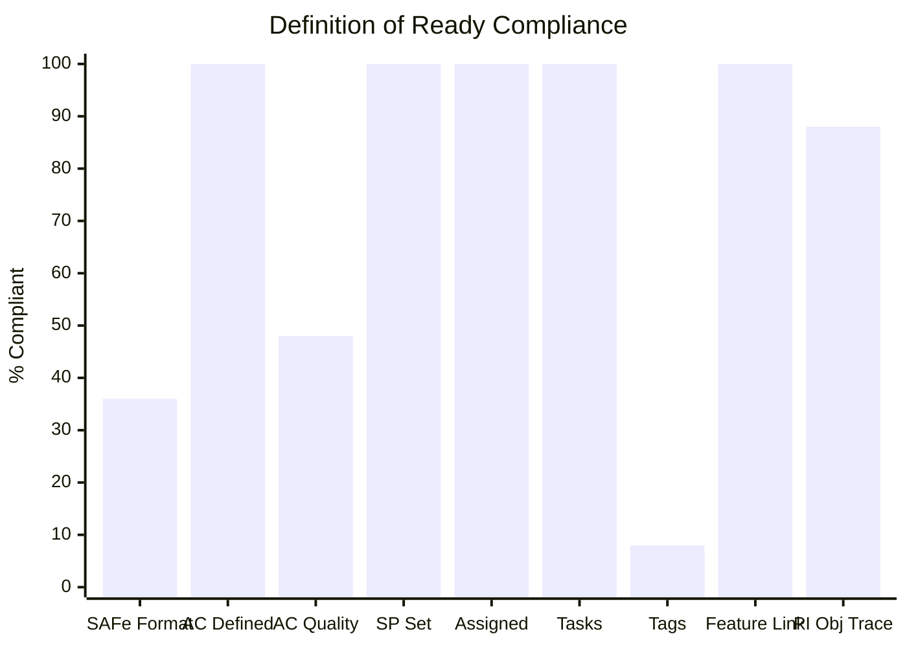

---

## 8. Work Item Inventory (25 Items)

### By State

| ID | Type | Title | State | Assigned | SP | Closed Date |
|---|---|---|---|---|---|---|
| #200337 | Enabler | Prepare COC 1 LO2 Learning Materials | Closed | Teofilo | 2 | Mar 11 |
| #200341 | Training | March 9 Training CSS Batch 2 | Closed | Teofilo | 2 | Mar 10 |
| #200342 | Training | March 10 Training CSS Batch 2 | Closed | Teofilo | 2 | Mar 11 |
| #200343 | Training | March 11 - BIOS Configuration | Closed | Teofilo | 2 | Mar 13 |
| #200344 | Training | March 12 Training CSS Batch 2 | Closed | Teofilo | 2 | Mar 13 |
| #200354 | Enabler | Prepare COC 1 LO3 Learning Materials | Closed | Teofilo | 2 | Mar 13 |
| #200602 | User Story | Team Deployment of UM-Digos Interns | Closed | armelita | 1 | Mar 17 |
| **#200345** | **Training** | **1.5-2 Conduct Test on Installed System** | **Closed** | **Teofilo** | **2** | **Mar 18** |
| **#200347** | **Training** | **1.5-3 Document Testing via Accomplishment Report** | **Closed** | **Teofilo** | **2** | **Mar 18** |
| **#200348** | **Training** | **1.3-3 Device Drivers Installation** | **Closed** | **Teofilo** | **2** | **Mar 18** |
| **#200349** | **Training** | **1.4-1 Application Software** | **Closed** | **Teofilo** | **2** | **Mar 18** |
| #200326 | User Story | TESDA Microcredential Program | Active | grace | 4 | — |
| #199768 | User Story | Resubmission of EBET Leading SAFe | Active | grace | 3 | — |
| #200582 | User Story | T2 MIS Enrollment | Active | armelita | 2 | — |
| #200590 | User Story | CSS NC II Batch 2 Marketing | Active | armelita | 2 | — |
| #200593 | User Story | AC Resubmission Result | Active | armelita | 1 | — |
| #200597 | User Story | CSS NC II AC Registration Fee | Active | armelita | 2 | — |
| #201003 | User Story | CSS NC II Compliance Audit | Active | armelita | 3 | — |
| #199221 | Courseware | ChatGPT Courseware | Validation | Samantha | 3 | — |
| #200350 | Training | 1.4-2 Application Software Discussion | Enrollment | Teofilo | 2 | — |
| #198630 | Training | Markdown Training for Employees | Ready | Samantha | 3 | — |
| #200351 | Training | March 19 Training CSS Batch 2 | New | Teofilo | 2 | — |
| #200352 | Training | March 20 Training CSS Batch 2 | New | Teofilo | 2 | — |
| #200353 | Training | March 21 Training CSS Batch 2 | New | Teofilo | 2 | — |
| #200607 | User Story | Bubble MCC Marketing Activities | New | armelita | 2 | — |

### State Flow

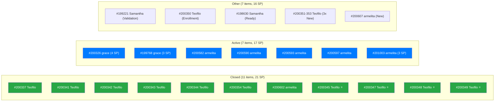

---

## 9. Risk Register

| Risk | Severity | Trend | Mitigation |
|---|---|---|---|
| armelita 5 Active items (10 SP) in 4 days | **High** | ↑ Worsening | Prioritize items with fewest external deps |
| Samantha 0% closed (6 SP) | **Medium** | Stable | #199221 in Validation — push to close |
| grace 0% closed (7 SP) | **Medium** | Stable | Both items Active with good AC; may be blocked by TESDA |
| Tags still not adopted (2 of 25) | Low | Stable | Quick win for next iteration |
| 3 Features lack PI Objective | Low | Stable | Suggested parents identified |
| New "Enrollment" state (#200350) | Low | New | Monitor if consistently used |

---

## 10. Recommended Actions (Remaining 4 Days)

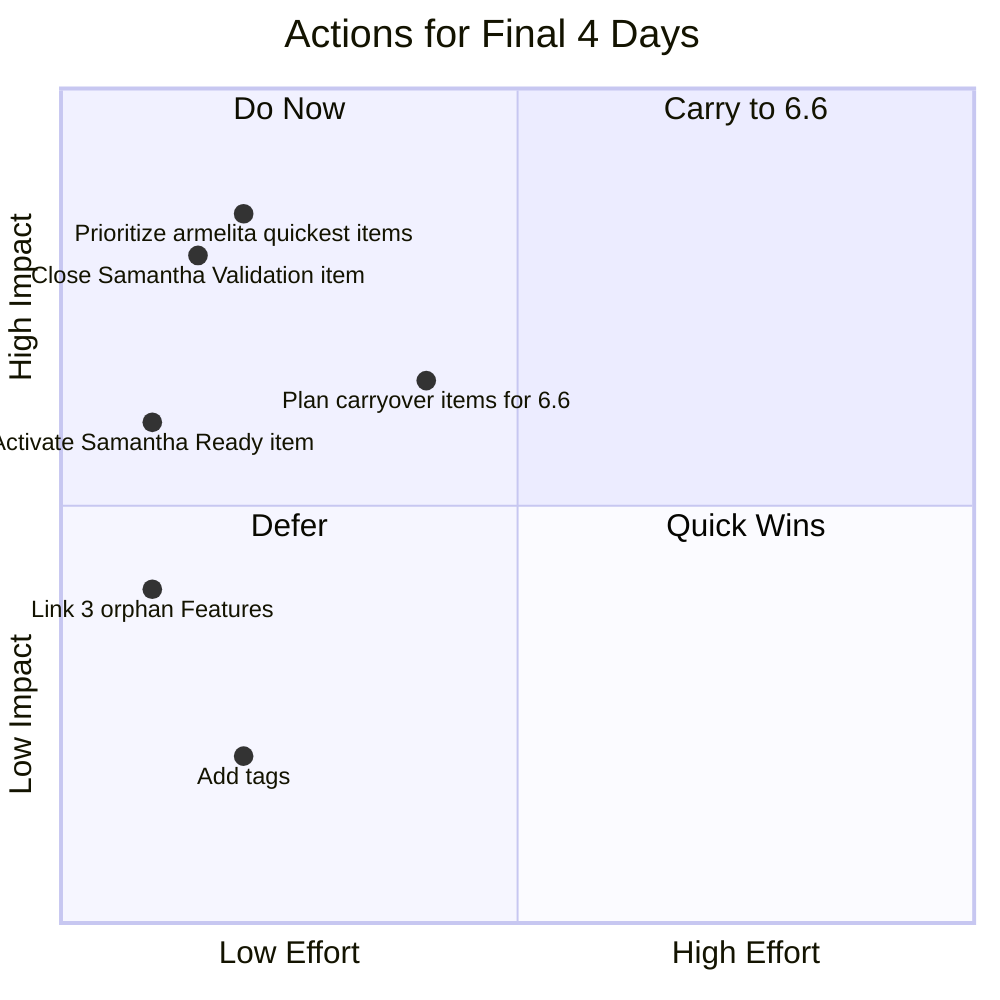

| Priority | Action | Owner | Effort | Impact |
|---|---|---|---|---|
| 1 | **Close #199221 ChatGPT Courseware** (Validation → Closed) | Samantha | 1 day | 3 SP + unblocks capacity |
| 2 | **Close #200593 AC Resubmission Result** (1 SP, likely quick) | armelita | Low | Quick SP + momentum |
| 3 | **Activate #198630 Markdown Training** (Ready → Active) | Samantha | 1 day | Gets 2nd item moving |
| 4 | **Focus #200582 and #200590** (MIS Enrollment + Marketing) | armelita | 2 days | 4 SP if both close |
| 5 | **Plan carryover** for #200607, grace's items if blocked | All | End of sprint | Clean handoff to 6.6 |

---

## 11. Health Score

| Dimension | Weight | Previous (D9) | Current (D10) | Delta | Notes |
|---|---|---|---|---|---|
| Iteration Planning | 20% | 9 | **9** | — | Capacity stable, well-loaded |
| Work Item Quality | 20% | 6 | **6** | — | Training titles improved but AC still minimal |
| Team Structure | 15% | 8 | **8** | — | All members active |
| Task Management | 15% | 9 | **9** | — | All items have tasks; #201003 expanded |
| Backlog Health | 15% | 8 | **9** | +1 | 39% done at Day 10; strong acceleration |
| Process Compliance | 15% | 7 | **7** | — | Training titles improving (F11) |

**Overall Health Score: 82/100** (was 79/100, **+3 points**)

Calculated: (9×0.20) + (6×0.20) + (8×0.15) + (9×0.15) + (9×0.15) + (7×0.15) = 1.80 + 1.20 + 1.20 + 1.35 + 1.35 + 1.05 = **7.95 × 10 ≈ 82/100**

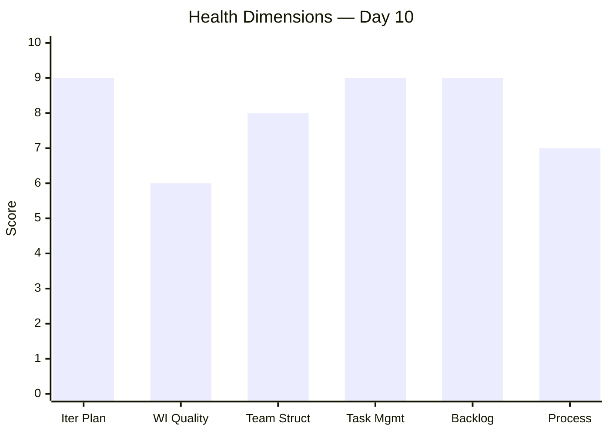

---

## 12. Conclusion

Day 10 marks the **strongest execution day** in Iteration 6.5, with Teofilo closing 4 items (8 SP) in a single batch. Total completed SP jumped from 13 to 21 (39%), and the sprint goal probability rose to 75%.

**Key positive developments:**

- Teofilo is at **71% completion** (20 of 28 SP) — outstanding individual performance
- Training item titles now include **specific CSS COC module topics** (Finding 11 being remediated)
- armelita expanded #201003 with 2 new child tasks, signaling active compliance audit work
- The "Enrollment" state for #200350 suggests the team is adopting more nuanced workflow states

**Key risks for the final 4 days:**

- armelita, grace, and Samantha collectively hold 25 SP with very few closures so far
- External dependencies (TESDA, payment processing) may block armelita's items
- Samantha's 2 items have been in Validation/Ready without movement

The health score has risen from **48 → 61 → 78 → 79 → 82** across five audits, a **+34 point improvement** from the baseline. The team's SAFe maturity continues to grow.

**Recommended next audit: March 22, 2026 (Sprint End / Pre-Retrospective)**

---

*Report generated: March 18, 2026 | SAFe 6.0 Framework | Jairosoft Portfolio — JIT Operation Team*
*Audit History: Feb 26 (48), Mar 3 (61), Mar 16 (78), Mar 17 (79), Mar 18 (82)*
*Iteration 6.5: Mar 9 – Mar 22, 2026 | Day 10 of 14 | Health Score: 82/100*
