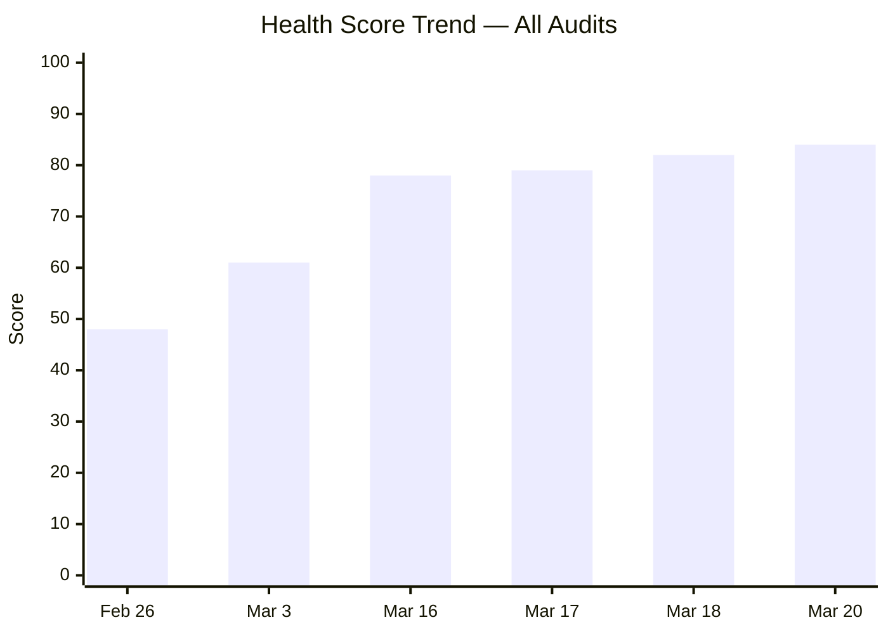
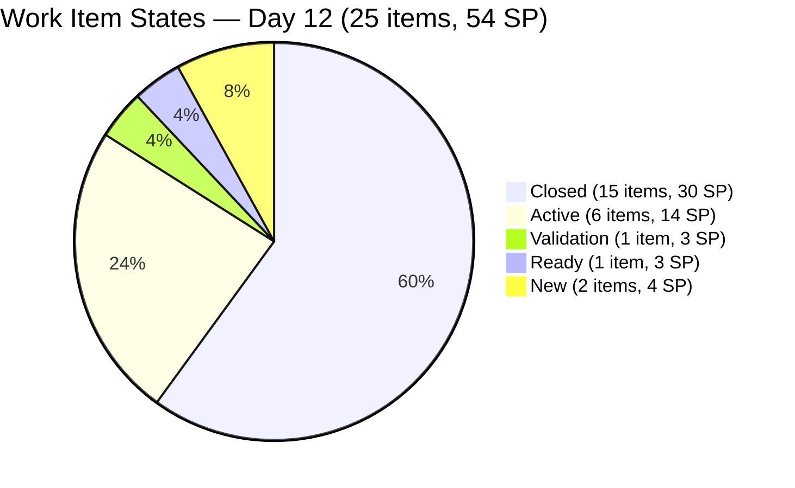
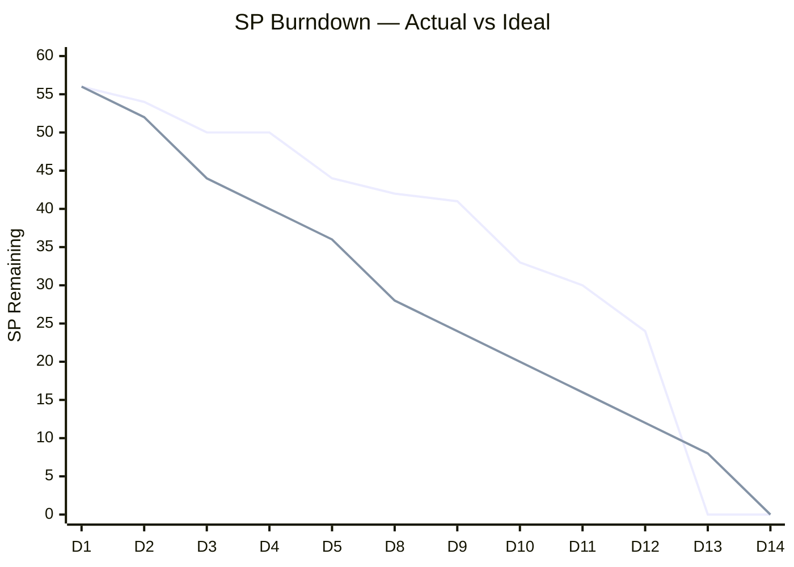
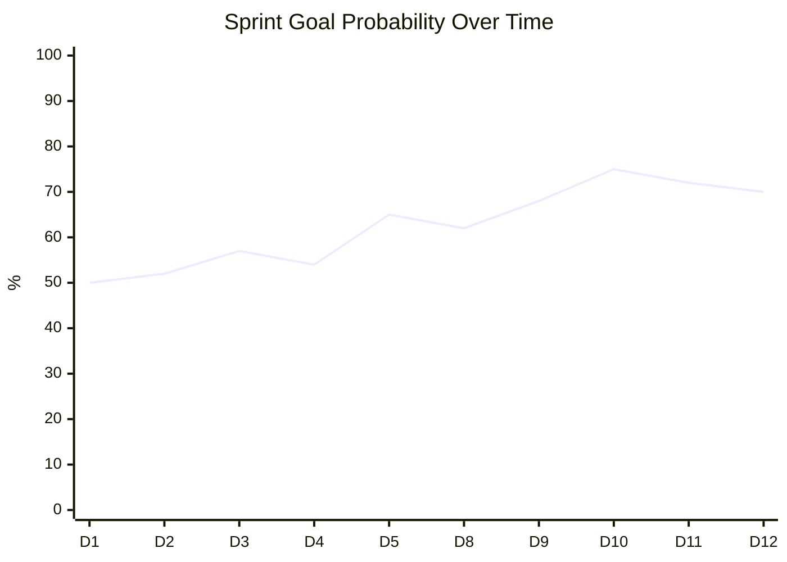
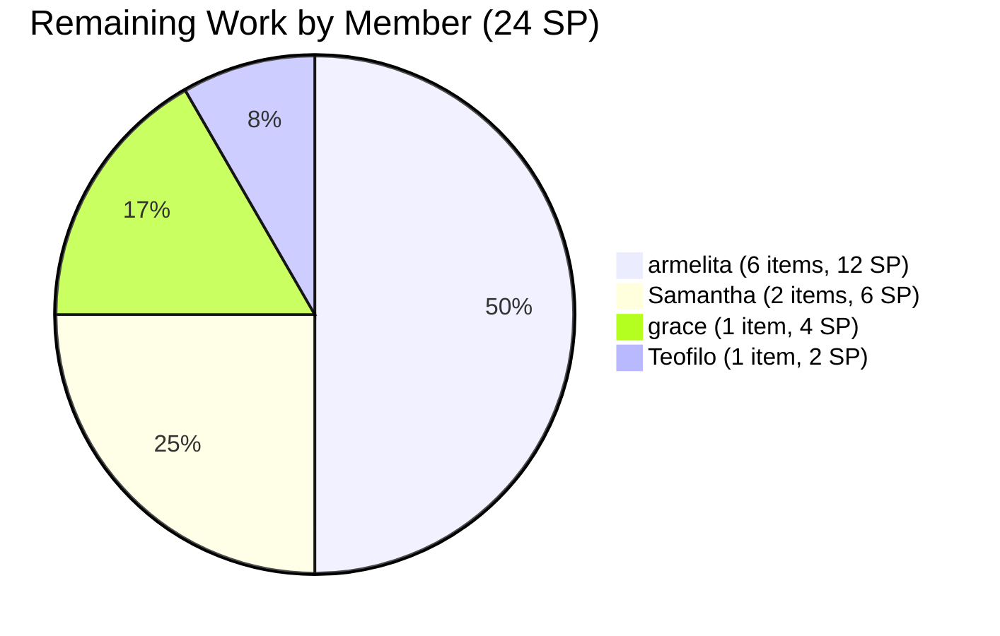
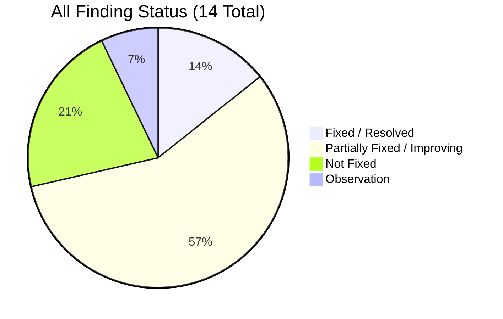
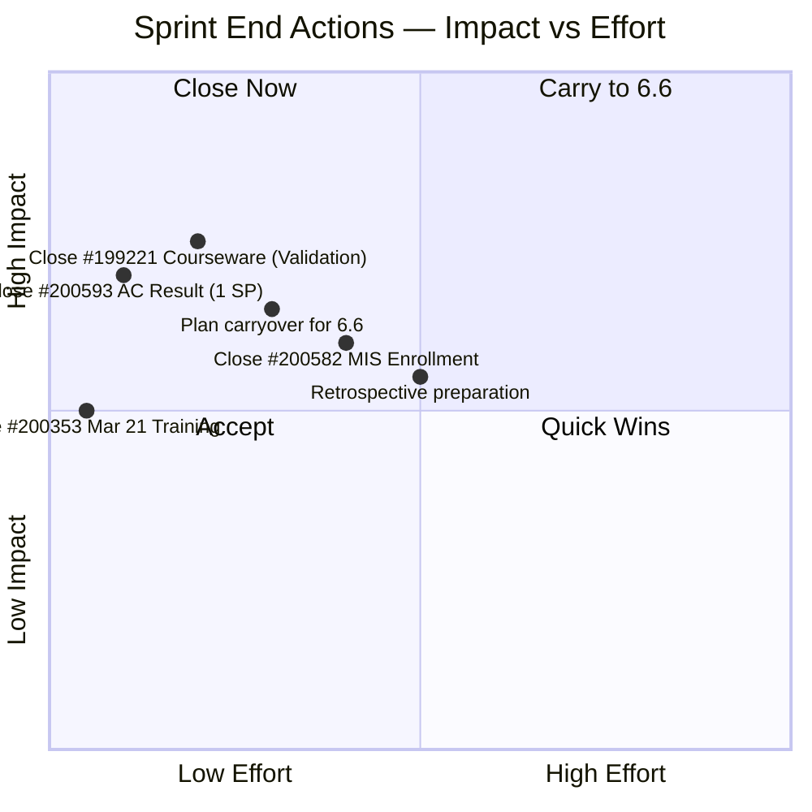
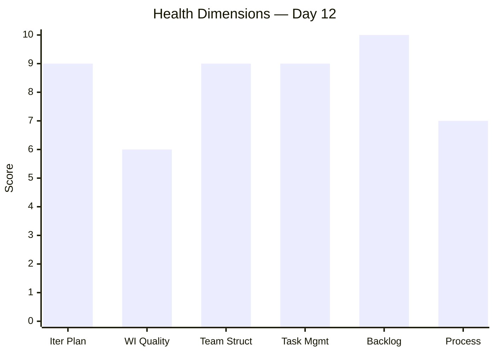

# SAFe Audit Report — Iteration 6.5 (Day 12)

## Jairosoft Portfolio — JIT Operation Team

| Field | Value |
|---|---|
| **Date** | March 20, 2026 |
| **Auditor** | Claude (AI Agile Consultant) |
| **Framework** | SAFe 6.0 |
| **Organization** | dev.azure.com/jairo |
| **Project** | Jairosoft Portfolio |
| **Team** | JIT Operation Team |
| **Product Owner** | Armelita |
| **Iteration** | Iteration 6.5 (Mar 9 – Mar 22, 2026) |
| **Iteration Day** | Day 12 of 14 (86% elapsed) |
| **Report Type** | Follow-Up Audit — Sprint End Assessment |
| **Previous Audit** | AUDIT_2026-03-18_0800.md (Day 10, Score: 82/100) |
| **Board URL** | [ADO Board](https://dev.azure.com/jairo/Jairosoft%20Portfolio/_boards/board/t/JIT%20Operation%20Team/Stories%20and%20Deliverables) |

---

## 1. Executive Summary

This report audits **Iteration 6.5** at **Day 12 of 14** (86% elapsed) — 2 working days remain before sprint close on March 22. The sprint has entered its final acceleration phase.

**Changes since last audit (Day 10, March 18):**

- **#199768 (Resubmission of EBET Leading SAFe)** closed by **grace** on Mar 19 (+3 SP) — grace's first closure this sprint
- **#200350, #200351, #200352** closed by **Teofilo** on Mar 20 (+6 SP) — continued daily training closures with updated CSS COC module titles
- **SP completed surged from 21 → 30** (39% → **56%**) — strongest 2-day acceleration of the sprint
- **Teofilo now at 93% completion** (13 of 14 items, 26 of 28 SP)
- **armelita and Samantha remain at 8% and 0%** — primary sprint risk with 2 days left

**Health Score: 84/100** (+2 from 82)

---

## 2. KPIs at a Glance

| KPI | Value | Trend | Notes |
|---|---|---|---|
| **Health Score** | 84/100 | ↑ +36 from baseline | Consistent improvement across 6 audits |
| **Items Completed** | 15 of 25 (60%) | ↑↑ | +4 since Day 10 |
| **SP Completed** | 30 of 54 (56%) | ↑↑ | +9 SP since Day 10 |
| **Team Capacity** | 16 hrs/day | → Stable | All 4 members configured |
| **Sprint Goal Prob.** | 70% | ↑ | Training items predictable; non-training risk |
| **SAFe Format** | 36% (9/25) | → Stable | All armelita + grace items comply |
| **AC Quality** | 48% Excellent+ | → Stable | #201003 remains exemplary |

---

## 3. Delta Analysis — Day 10 vs Day 12

| Metric | Day 10 (Mar 18) | Day 12 (Mar 20) | Delta |
|---|---|---|---|
| Closed Items | 11 | **15** | **+4** |
| SP Completed | 21 SP (39%) | **30 SP (56%)** | **+9 SP (+17%)** |
| Active Items | 7 | **6** | -1 (#199768 closed) |
| Enrollment | 1 | **0** | -1 (#200350 closed) |
| New Items | 4 | **2** | -2 (#200351, #200352 closed) |
| Validation | 1 | 1 | — |
| Ready | 1 | 1 | — |

### Closures Since Day 10

| ID | Title | Type | Assigned | SP | Closed Date |
|---|---|---|---|---|---|
| **#199768** | Resubmission of EBET Leading SAFe | User Story | grace | 3 | Mar 19 |
| **#200350** | 1.4-2 Application Software Discussion | Training | Teofilo | 2 | Mar 20 |
| **#200351** | 1.3-3 Device Drivers Installation | Training | Teofilo | 2 | Mar 20 |
| **#200352** | 1.3-2 Device Drivers | Training | Teofilo | 2 | Mar 20 |

> Grace's first closure this sprint is a positive milestone. Teofilo continues his consistent daily training cadence.

---

## 4. State Distribution

---

## 5. Burndown & Sprint Goal Probability

### Day-by-Day Burndown

| Day | Date | SP Closed | Cumulative SP | SP Remaining | Velocity | Probability |
|---|---|---|---|---|---|---|
| 1 | Mar 9 | 0 | 0 | 56 | 0.0 | 50% |
| 2 | Mar 10 | 2 | 2 | 54 | 1.0 | 52% |
| 3 | Mar 11 | 4 | 6 | 50 | 2.0 | 57% |
| 4 | Mar 12 | 0 | 6 | 50 | 1.5 | 54% |
| 5 | Mar 13 | 6 | 12 | 44 | 2.4 | 65% |
| 6–7 | Mar 14–15 | 0 | 12 | 44 | — | 60% |
| 8 | Mar 16 | 0 | 12 | 42 | 1.5 | 62% |
| 9 | Mar 17 | 1 | 13 | 41 | 1.4 | 68% |
| 10 | Mar 18 | 8 | 21 | 33 | 2.1 | 75% |
| 11 | Mar 19 | 3 | 24 | 30 | 2.2 | 72% |
| **12** | **Mar 20** | **6** | **30** | **24** | **2.5** | **70%** |

### Remaining Work (24 SP in 2 Days)

**Sprint Goal Probability: 70%.** Teofilo's last training item (#200353, 2 SP) will close Mar 21. Realistic final completion: **32–38 SP of 54 (59–70%)**, depending on how many of armelita's and Samantha's items close by Mar 22.

---

## 6. Team Capacity & Member Performance

| Member | Capacity | Items | SP | Closed | Open SP | % Complete | Trend |
|---|---|---|---|---|---|---|---|
| Teofilo Limpag | 4 hrs/day | 14 | 28 SP | **13** | 2 SP | **93%** | ↑↑ Outstanding |
| grace | 2 hrs/day | 2 | 7 SP | **1** | 4 SP | **43%** | ↑ First closure |
| armelita | 6 hrs/day | 7 | 13 SP | 1 | 12 SP | **8%** | → Stalled |
| Samantha Babael | 4 hrs/day | 2 | 6 SP | 0 | 6 SP | **0%** | → No closures |
| **TOTAL** | **16 hrs/day** | **25** | **54 SP** | **15** | **24 SP** | **56%** | ↑ |

```mermaid
xychart-beta
    title "Member Completion — Closed vs Open SP"
    x-axis ["Teofilo", "grace", "armelita", "Samantha"]
    y-axis "Story Points" 0 --> 30
    bar [26, 3, 1, 0]
    bar [2, 4, 12, 6]
```

> **Teofilo** has delivered an exceptional sprint — 93% of his 28 SP completed. **Grace** achieved her first closure, breaking through after 0% through Day 10. **Armelita** and **Samantha** remain at risk — their items may carry over to Iteration 6.6.

---

## 7. Finding Remediation — All Findings

### Original 10 (from Iter 6.4)

| # | Finding | Sev | Status | Today's Change |
|---|---|---|---|---|
| F1 | Zero Capacity | CRIT | **FIXED** | — |
| F2 | Workload Imbalance | CRIT | **PARTIALLY FIXED** | Grace now contributing closures |
| F3 | No SAFe Format | CRIT | **PARTIALLY FIXED** | 36% adoption (9/25) |
| F4 | Minimal AC | MAJOR | **PARTIALLY FIXED** | 48% quality (12/25) |
| F5 | Stale Features | MAJOR | **PARTIALLY FIXED** | — |
| F6 | Orphan Story | MAJOR | **RESOLVED** | — |
| F7 | Duplicate Descriptions | MAJOR | **PARTIALLY FIXED** | Training titles continue improving |
| F8 | No Tags | MINOR | **NOT FIXED** | 2/25 tagged |
| F9 | Duplicate Task Names | MINOR | **IMPROVED** | — |
| F10 | Single Activity Type | MINOR | **PARTIALLY FIXED** | — |

### Iter 6.5 Findings (3 + 1)

| # | Finding | Sev | Status | Today's Change |
|---|---|---|---|---|
| F11 | Training Copy-Paste | MINOR | **IMPROVING** | #200351 & #200352 renamed with CSS COC topics |
| F12 | 3 Features No PI Obj | MINOR | NOT FIXED | — |
| F13 | AreaPath Inconsistency | MINOR | NOT FIXED | — |
| F14 | Non-Training 0% | OBS | **IMPROVING** | Grace now at 43% (was 0%) |

---

## 8. Work Item Inventory (25 Items)

| ID | Type | Title | State | Assigned | SP | Closed |
|---|---|---|---|---|---|---|
| #200337 | Enabler | COC 1 LO2 Learning Materials | Closed | Teofilo | 2 | Mar 11 |
| #200341 | Training | Mar 9 Training | Closed | Teofilo | 2 | Mar 10 |
| #200342 | Training | Mar 10 Training | Closed | Teofilo | 2 | Mar 11 |
| #200343 | Training | Mar 11 - BIOS Configuration | Closed | Teofilo | 2 | Mar 13 |
| #200344 | Training | Mar 12 Training | Closed | Teofilo | 2 | Mar 13 |
| #200354 | Enabler | COC 1 LO3 Learning Materials | Closed | Teofilo | 2 | Mar 13 |
| #200602 | User Story | Team Deployment UM-Digos Interns | Closed | armelita | 1 | Mar 17 |
| #200345 | Training | 1.5-2 Conduct Test on Installed System | Closed | Teofilo | 2 | Mar 18 |
| #200347 | Training | 1.5-3 Document Testing | Closed | Teofilo | 2 | Mar 18 |
| #200348 | Training | 1.3-3 Device Drivers Installation | Closed | Teofilo | 2 | Mar 18 |
| #200349 | Training | 1.4-1 Application Software | Closed | Teofilo | 2 | Mar 18 |
| **#199768** | **User Story** | **Resubmission of EBET Leading SAFe** | **Closed** | **grace** | **3** | **Mar 19** |
| **#200350** | **Training** | **1.4-2 Application Software Discussion** | **Closed** | **Teofilo** | **2** | **Mar 20** |
| **#200351** | **Training** | **1.3-3 Device Drivers Installation** | **Closed** | **Teofilo** | **2** | **Mar 20** |
| **#200352** | **Training** | **1.3-2 Device Drivers** | **Closed** | **Teofilo** | **2** | **Mar 20** |
| #200326 | User Story | TESDA Microcredential Program | Active | grace | 4 | — |
| #200582 | User Story | T2 MIS Enrollment | Active | armelita | 2 | — |
| #200590 | User Story | CSS Batch 2 Marketing | Active | armelita | 2 | — |
| #200593 | User Story | AC Resubmission Result | Active | armelita | 1 | — |
| #200597 | User Story | CSS NC II AC Registration Fee | Active | armelita | 2 | — |
| #201003 | User Story | CSS NC II Compliance Audit | Active | armelita | 3 | — |
| #199221 | Courseware | ChatGPT Courseware | Validation | Samantha | 3 | — |
| #198630 | Training | Markdown Training for Employees | Ready | Samantha | 3 | — |
| #200353 | Training | March 21 Training CSS Batch 2 | New | Teofilo | 2 | — |
| #200607 | User Story | Bubble MCC Marketing Activities | New | armelita | 2 | — |

---

## 9. Risk Register

| Risk | Severity | Trend | Mitigation |
|---|---|---|---|
| armelita 5 Active + 1 New (12 SP) in 2 days | **HIGH** | ↑ Worsening | Likely carryover to 6.6; close #200593 (1 SP) as quick win |
| Samantha 0% complete (6 SP) in 2 days | **HIGH** | ↑ Worsening | #199221 Validation should close; #198630 Ready likely carries over |
| grace #200326 (4 SP) still Active | Medium | Stable | Large item; may carry over |
| Carryover volume | Medium | New | ~14–22 SP may carry to Iter 6.6 |
| Tags not adopted (2/25) | Low | Stable | Defer to 6.6 planning |

---

## 10. Recommended Actions (Final 2 Days)

| Priority | Action | Owner | Impact |
|---|---|---|---|
| 1 | **Close #200593** AC Resubmission Result (1 SP, likely quick) | armelita | Quick SP win |
| 2 | **Close #199221** ChatGPT Courseware (already in Validation) | Samantha | 3 SP + Samantha's first closure |
| 3 | **Close #200353** Mar 21 Training (tomorrow's session) | Teofilo | 2 SP — will happen naturally |
| 4 | **Close #200582 or #200590** if possible | armelita | 2 SP each |
| 5 | **Plan carryover items** for Iteration 6.6 backlog | Armelita (PO) | Clean transition |
| 6 | **Prepare retrospective** — document team wins and improvement areas | All | Process improvement |

---

## 11. Health Score

| Dimension | Weight | Day 10 | Day 12 | Delta | Notes |
|---|---|---|---|---|---|
| Iteration Planning | 20% | 9 | **9** | — | All capacity set, well-loaded |
| Work Item Quality | 20% | 6 | **6** | — | Training titles improving; AC stable |
| Team Structure | 15% | 8 | **8.5** | +0.5 | Grace got first closure; 3 of 4 contributing |
| Task Management | 15% | 9 | **9** | — | All items have tasks |
| Backlog Health | 15% | 9 | **9.5** | +0.5 | 56% complete; strong acceleration |
| Process Compliance | 15% | 7 | **7** | — | Tags still missing |

**Overall: (9×0.20) + (6×0.20) + (8.5×0.15) + (9×0.15) + (9.5×0.15) + (7×0.15) = 1.80 + 1.20 + 1.275 + 1.35 + 1.425 + 1.05 = 8.10 → 84/100**

---

## 12. Projected Sprint Outcome

| Scenario | SP Completed | % of 54 SP | Likelihood |
|---|---|---|---|
| **Best case** | 40 SP | 74% | Low — requires armelita to close 4+ items |
| **Most likely** | 34–36 SP | 63–67% | Medium — Teofilo closes last + grace + Samantha Validation |
| **Worst case** | 32 SP | 59% | High — only Teofilo's last item + current 30 SP |

**Projected velocity for Iter 6.5: 32–36 SP** (compared to Iter 6.4 actual: ~24 SP). This represents a significant velocity increase driven primarily by Teofilo's training delivery cadence.

---

## 13. Conclusion

Iteration 6.5 Day 12 shows a **split-pace sprint**: Teofilo has delivered an exceptional 93% completion rate, while armelita and Samantha still carry significant open work. Grace's closure of #199768 on Day 11 was a positive breakthrough.

The health score has risen to **84/100** — a **+36 point improvement** from the first baseline audit of 48/100 on February 26. Across 6 audits, every single report has shown improvement:

| Audit | Date | Score | Delta |
|---|---|---|---|
| 1st | Feb 26 | 48 | Baseline |
| 2nd | Mar 3 | 61 | +13 |
| 3rd | Mar 16 | 78 | +17 |
| 4th | Mar 17 | 79 | +1 |
| 5th | Mar 18 | 82 | +3 |
| **6th** | **Mar 20** | **84** | **+2** |

**Key wins this sprint:** all members have capacity, 36% SAFe format adoption, 48% structured AC, grace contributing closures, Teofilo 93% complete, training titles include CSS COC module topics.

**Items likely to carry over to Iter 6.6:** armelita's 5 Active stories (10 SP), Samantha's 2 items (6 SP), grace's #200326 (4 SP), armelita's #200607 (2 SP). Total potential carryover: ~14–22 SP.

**Recommended next audit: March 23, 2026 (Post-Sprint Retrospective / Iter 6.6 Planning)**

---

*Report generated: March 20, 2026 | SAFe 6.0 Framework | Jairosoft Portfolio — JIT Operation Team*
*Audit History: Feb 26 (48), Mar 3 (61), Mar 16 (78), Mar 17 (79), Mar 18 (82), Mar 20 (84)*
*Iteration 6.5: Mar 9 – Mar 22, 2026 | Day 12 of 14 | Health Score: 84/100*
