# SAFe Audit Report — Iteration 6.5 (Day 14 — Sprint Close)

## Jairosoft Portfolio — JIT Operation Team

| Field | Value |
|---|---|
| **Date** | March 22, 2026 |
| **Auditor** | Claude (AI Agile Consultant) |
| **Framework** | SAFe 6.0 |
| **Organization** | dev.azure.com/jairo |
| **Project** | Jairosoft Portfolio |
| **Team** | JIT Operation Team |
| **Product Owner** | Armelita |
| **Iteration** | Iteration 6.5 (Mar 9 – Mar 22, 2026) |
| **Iteration Day** | Day 14 of 14 (100% elapsed — Sprint Close) |
| **Report Type** | Sprint-End Audit — Final Retrospective |
| **Previous Audit** | AUDIT_2026-03-20_0800.md (Day 12, Score: 84/100) |
| **Board URL** | [ADO Board](https://dev.azure.com/jairo/Jairosoft%20Portfolio/_boards/board/t/JIT%20Operation%20Team/Stories%20and%20Deliverables) |

---

## 1. Executive Summary

This is the **final sprint-end audit** for **Iteration 6.5**, conducted on Day 14 of 14 (100% elapsed). The iteration closes today, March 22, 2026.

**Changes since last audit (Day 12, March 20):**

- **#200326 (TESDA Microcredential Program Submission)** closed by **grace** on Mar 22 (+4 SP) — grace achieves **100% completion** (2/2 items, 7/7 SP)
- **3 items moved to Iteration 6.6 (IP)** by armelita (PO): #200593 (1 SP), #200597 (2 SP), #200607 (2 SP) — proactive scope management
- **Sprint scope adjusted:** 25 → **22 items**, 54 → **49 SP** (-3 items, -5 SP)
- **SP completed rose from 30 → 34** (56% → **69%**)
- **#200353** (Teofilo's March 21 Training) remains in **New** — unexpected stall
- **Samantha remains at 0%** — no closures for the entire sprint

**Health Score: 85/100** (+1 from 84)

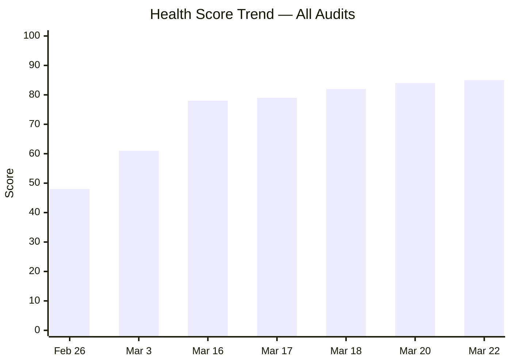

---

## 2. KPIs at a Glance

| KPI | Value | Trend | Notes |
|---|---|---|---|
| **Health Score** | 85/100 | ↑ +37 from baseline | 7th consecutive audit with improvement |
| **Items Completed** | 16 of 22 (73%) | ↑↑ | +1 since Day 12; scope reduced by 3 |
| **SP Completed** | 34 of 49 (69%) | ↑↑ | +4 SP since Day 12; scope adjusted -5 SP |
| **Team Capacity** | 16 hrs/day | → Stable | All 4 members configured |
| **Sprint Goal Result** | 69% SP | Final | Training items largely delivered |
| **SAFe Format** | 27% (6/22) | ↓ | Down from 36% — SAFe-formatted items moved to 6.6 |
| **AC Quality** | 50% Excellent+ | ↑ | #200326 closure added high-quality AC |
| **Scope Changes** | -3 items, -5 SP | New | PO moved items to Iter 6.6 |

---

## 3. Delta Analysis — Day 12 vs Day 14 (Sprint Close)

| Metric | Day 12 (Mar 20) | Day 14 (Mar 22) | Delta |
|---|---|---|---|
| Sprint Scope | 25 items (54 SP) | **22 items (49 SP)** | **-3 items (-5 SP)** |
| Closed Items | 15 | **16** | **+1** |
| SP Completed | 30 SP (56%) | **34 SP (69%)** | **+4 SP (+13%)** |
| Active Items | 6 | **3** | -3 (scope moved) |
| Validation | 1 | 1 | — |
| Ready | 1 | 1 | — |
| New Items | 2 | **1** | -1 (#200607 moved) |

### Closures Since Day 12

| ID | Title | Type | Assigned | SP | Closed Date |
|---|---|---|---|---|---|
| **#200326** | TESDA Microcredential Program Submission | User Story | grace | 4 | **Mar 22** |

### Items Moved to Iteration 6.6 (IP)

| ID | Title | Type | Assigned | SP | State |
|---|---|---|---|---|---|
| #200593 | AC Resubmission Result | User Story | armelita | 1 | Active |
| #200597 | CSS NC II AC Registration Fee | User Story | armelita | 2 | Active |
| #200607 | Bubble MCC Marketing Activities | User Story | armelita | 2 | New |

> Grace's closure of #200326 on sprint close day is a significant milestone — she delivered a high-quality, well-structured item with 4 detailed acceptance criteria. Armelita's decision to move 3 items to Iteration 6.6 demonstrates mature backlog management per SAFe principles.

---

## 4. State Distribution

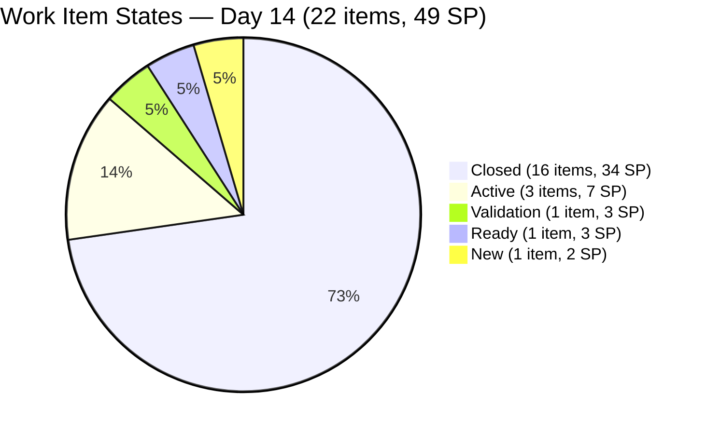

---

## 5. Burndown & Final Sprint Velocity

### Day-by-Day Burndown

| Day | Date | SP Closed | Cumulative SP | SP Remaining | Velocity | Notes |
|---|---|---|---|---|---|---|
| 1 | Mar 9 | 0 | 0 | 54 | 0.0 | Sprint start |
| 2 | Mar 10 | 2 | 2 | 52 | 1.0 | |
| 3 | Mar 11 | 4 | 6 | 48 | 2.0 | |
| 4 | Mar 12 | 0 | 6 | 48 | 1.5 | |
| 5 | Mar 13 | 6 | 12 | 42 | 2.4 | |
| 6–7 | Mar 14–15 | 0 | 12 | 42 | — | Weekend |
| 8 | Mar 16 | 0 | 12 | 42 | 1.5 | |
| 9 | Mar 17 | 1 | 13 | 41 | 1.4 | |
| 10 | Mar 18 | 8 | 21 | 33 | 2.1 | |
| 11 | Mar 19 | 3 | 24 | 30 | 2.2 | Scope adjusted to 49 SP |
| 12 | Mar 20 | 6 | 30 | 19 | 2.5 | |
| 13 | Mar 21 | 0 | 30 | 19 | 2.3 | No closures |
| **14** | **Mar 22** | **4** | **34** | **15** | **2.4** | **Sprint close** |

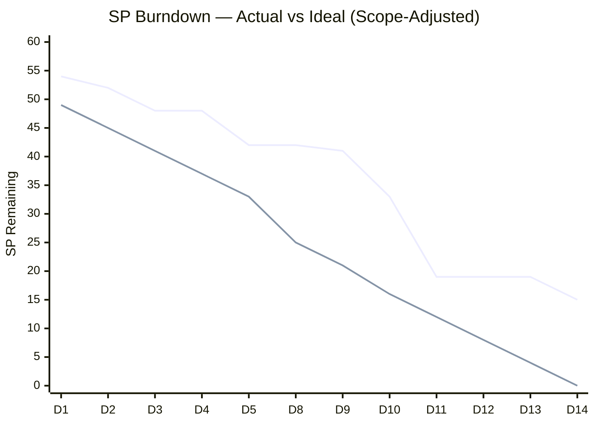

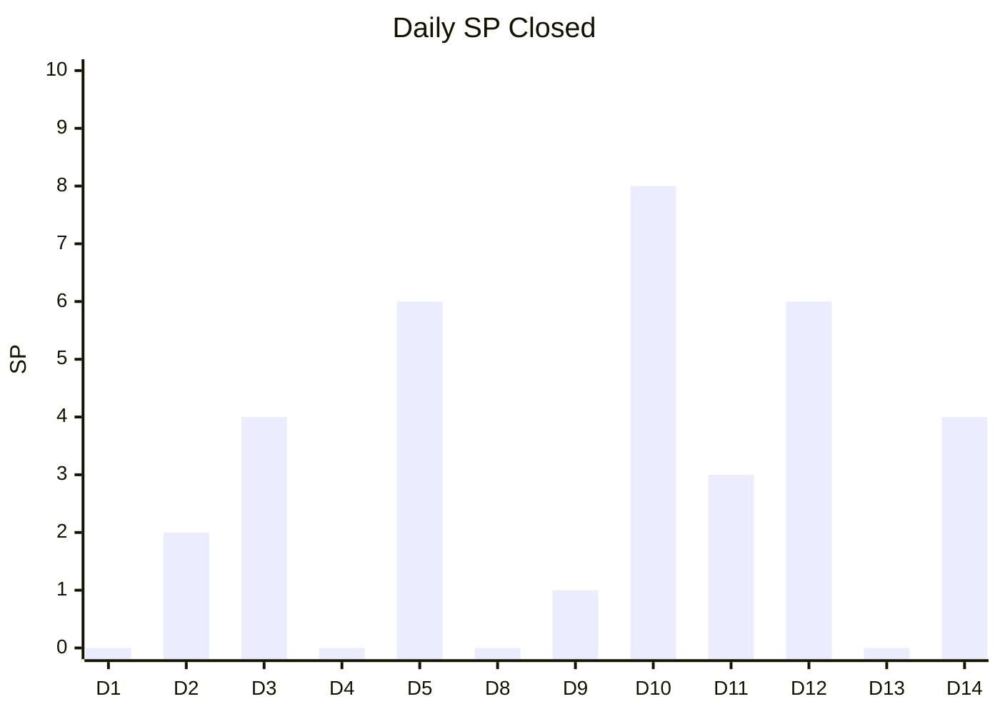

### Final Sprint Velocity

| Metric | Value |
|---|---|
| **SP Completed** | 34 SP |
| **SP Remaining** | 15 SP |
| **Completion Rate** | 69% (of adjusted 49 SP) |
| **Avg Daily Velocity** | 2.4 SP/day (across 10 working days) |
| **Items Completed** | 16 of 22 (73%) |
| **Previous Iteration (6.4)** | ~24 SP |
| **Velocity Improvement** | +42% over Iteration 6.4 |

---

## 6. Team Capacity & Member Performance (Final)

| Member | Capacity | Items | SP | Closed | Open SP | % Complete (SP) | Sprint Grade |
|---|---|---|---|---|---|---|---|
| Teofilo Limpag | 4 hrs/day | 14 | 28 SP | **13** | 2 SP | **93%** | A+ |
| grace | 2 hrs/day | 2 | 7 SP | **2** | 0 SP | **100%** | A+ |
| armelita | 6 hrs/day | 4* | 8 SP* | 1 | 7 SP | **13%** | D |
| Samantha Babael | 4 hrs/day | 2 | 6 SP | 0 | 6 SP | **0%** | F |
| **TOTAL** | **16 hrs/day** | **22** | **49 SP** | **16** | **15 SP** | **69%** | **B** |

*\* armelita had 7 items (13 SP) at sprint start; 3 items (5 SP) were moved to Iter 6.6.*

```mermaid
xychart-beta
    title "Member Completion — Closed vs Open SP (Final)"
    x-axis ["Teofilo", "grace", "armelita", "Samantha"]
    y-axis "Story Points" 0 --> 30
    bar [26, 7, 1, 0]
    bar [2, 0, 7, 6]
```

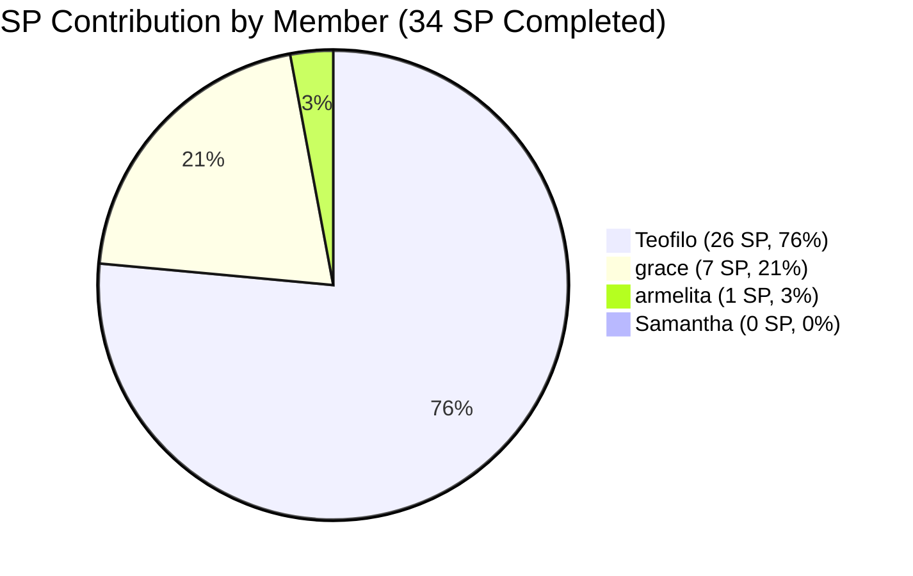

> **Teofilo** delivered an exceptional sprint (93%, A+), carrying 76% of all completed SP. **Grace** achieved a perfect 100% — her strongest sprint to date and a validated growth trajectory from 0% on Day 10 to 100% by sprint close. **Armelita** completed only 1 of her original 7 items, though she proactively managed scope by moving 3 to 6.6. **Samantha** delivered zero closures for the second consecutive iteration — this is now a systemic issue requiring intervention.

---

## 7. Finding Remediation — All Findings

### Original 10 (from Iter 6.4)

| # | Finding | Sev | Status | Sprint-End Change |
|---|---|---|---|---|
| F1 | Zero Capacity | CRIT | **FIXED** | — |
| F2 | Workload Imbalance | CRIT | **PARTIALLY FIXED** | Grace contributing; imbalance persists (76% from Teofilo) |
| F3 | No SAFe Format | CRIT | **PARTIALLY FIXED** | 27% adoption (6/22); down from 36% due to scope change |
| F4 | Minimal AC | MAJOR | **PARTIALLY FIXED** | 50% quality; grace items have excellent AC |
| F5 | Stale Features | MAJOR | **PARTIALLY FIXED** | — |
| F6 | Orphan Story | MAJOR | **RESOLVED** | — |
| F7 | Duplicate Descriptions | MAJOR | **PARTIALLY FIXED** | Training titles improved over sprint |
| F8 | No Tags | MINOR | **NOT FIXED** | 2/22 tagged (9%) |
| F9 | Duplicate Task Names | MINOR | **IMPROVED** | — |
| F10 | Single Activity Type | MINOR | **PARTIALLY FIXED** | — |

### Iter 6.5 Findings (3 + 1)

| # | Finding | Sev | Status | Sprint-End Change |
|---|---|---|---|---|
| F11 | Training Copy-Paste | MINOR | **IMPROVED** | Module-specific titles adopted mid-sprint |
| F12 | 3 Features No PI Obj | MINOR | NOT FIXED | — |
| F13 | AreaPath Inconsistency | MINOR | NOT FIXED | — |
| F14 | Non-Training 0% | OBS | **IMPROVED** | Grace now 100%; armelita 13%; Samantha still 0% |

### New Sprint-End Findings

| # | Finding | Sev | Description |
|---|---|---|---|
| F15 | Samantha Zero-Closure Pattern | **MAJOR** | 0% completion for 2nd consecutive iteration; systemic blocker |
| F16 | #200353 Stalled in New | MINOR | March 21 training item never moved from New despite date passing |
| F17 | Late Scope Reduction | OBS | 3 items moved to 6.6 late in sprint; earlier identification would improve predictability |

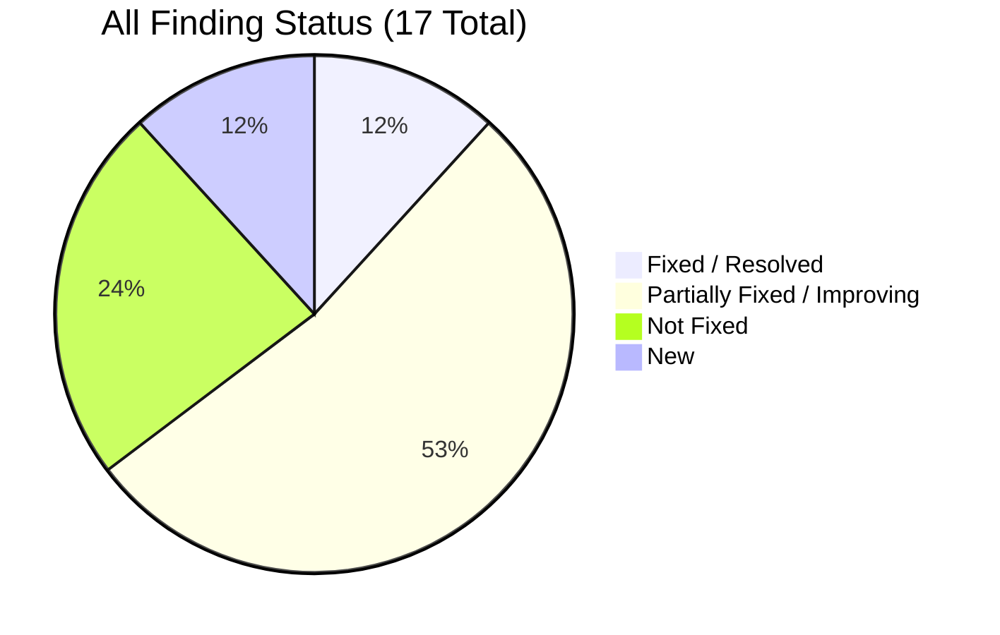

---

## 8. Work Item Inventory — Iteration 6.5 (22 Items)

### Closed (16 items, 34 SP)

| ID | Type | Title | Assigned | SP | Closed |
|---|---|---|---|---|---|
| #200341 | Training | March 9 Training CSS Batch 2 | Teofilo | 2 | Mar 10 |
| #200337 | Enabler | COC 1 LO2 Learning Materials | Teofilo | 2 | Mar 11 |
| #200342 | Training | March 10 Training CSS Batch 2 | Teofilo | 2 | Mar 11 |
| #200343 | Training | March 11 Training — BIOS Configuration | Teofilo | 2 | Mar 13 |
| #200344 | Training | March 12 Training CSS Batch 2 | Teofilo | 2 | Mar 13 |
| #200354 | Enabler | COC 1 LO3 Learning Materials | Teofilo | 2 | Mar 13 |
| #200602 | User Story | Team Deployment UM-Digos Interns | armelita | 1 | Mar 17 |
| #200345 | Training | 1.5-2 Conduct Test on Installed System | Teofilo | 2 | Mar 18 |
| #200347 | Training | 1.5-3 Document Testing | Teofilo | 2 | Mar 18 |
| #200348 | Training | 1.3-3 Device Drivers Installation | Teofilo | 2 | Mar 18 |
| #200349 | Training | 1.4-1 Application Software | Teofilo | 2 | Mar 18 |
| #199768 | User Story | Resubmission of EBET Leading SAFe | grace | 3 | Mar 19 |
| #200350 | Training | 1.4-2 Application Software Discussion | Teofilo | 2 | Mar 20 |
| #200351 | Training | 1.3-3 Device Drivers Installation | Teofilo | 2 | Mar 20 |
| #200352 | Training | 1.3-2 Device Drivers | Teofilo | 2 | Mar 20 |
| **#200326** | **User Story** | **TESDA Microcredential Program Submission** | **grace** | **4** | **Mar 22** |

### Open (6 items, 15 SP)

| ID | Type | Title | State | Assigned | SP |
|---|---|---|---|---|---|
| #200582 | User Story | T2 MIS Enrollment | Active | armelita | 2 |
| #200590 | User Story | CSS Batch 2 Marketing Activities | Active | armelita | 2 |
| #201003 | User Story | CSS NC II Compliance Audit | Active | armelita | 3 |
| #199221 | Courseware | ChatGPT Courseware | Validation | Samantha | 3 |
| #198630 | Training | Markdown Training for Employees | Ready | Samantha | 3 |
| #200353 | Training | March 21 Training CSS Batch 2 | New | Teofilo | 2 |

### Moved to Iteration 6.6 (3 items, 5 SP)

| ID | Type | Title | State | Assigned | SP |
|---|---|---|---|---|---|
| #200593 | User Story | AC Resubmission Result | Active | armelita | 1 |
| #200597 | User Story | CSS NC II AC Registration Fee | Active | armelita | 2 |
| #200607 | User Story | Bubble MCC Marketing Activities | New | armelita | 2 |

---

## 9. Risk Register — Sprint-End & Carryover

| Risk | Severity | Status | Impact on Iter 6.6 |
|---|---|---|---|
| Samantha 0% two iterations running | **CRITICAL** | ↑ Escalating | Must address root cause before 6.6 starts |
| armelita 6 open items (12 SP) across 6.5 + 6.6 | **HIGH** | Persistent | Heavy backlog entering IP iteration |
| #200353 stalled in New | Medium | New | Should close early in 6.6 or be investigated |
| 9 total carryover items (20 SP) | Medium | New | IP iteration will start loaded |
| Tags/process adoption low | Low | Stable | Defer to 6.6 planning |

### Carryover Summary for Iteration 6.6 (IP)

| Source | Items | SP | Owner |
|---|---|---|---|
| Open in 6.5 — armelita | 3 | 7 | armelita |
| Open in 6.5 — Samantha | 2 | 6 | Samantha |
| Open in 6.5 — Teofilo | 1 | 2 | Teofilo |
| Already moved to 6.6 | 3 | 5 | armelita |
| **Total Carryover** | **9** | **20 SP** | |

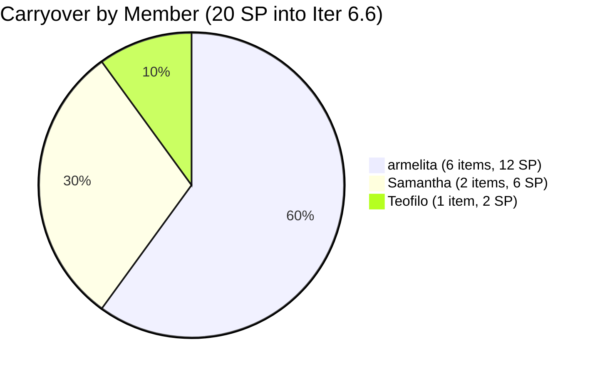

---

## 10. Recommended Actions — Iteration 6.6 Planning

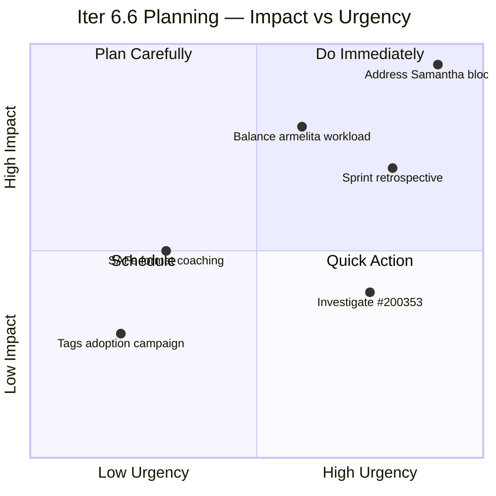

| Priority | Action | Owner | Impact |
|---|---|---|---|
| 1 | **Address Samantha's zero-completion pattern** — identify root cause (capacity? blockers? skills gap?) before Iter 6.6 planning | Armelita (PO) | Systemic team health issue |
| 2 | **Conduct Sprint Retrospective** — celebrate Teofilo's A+ and grace's 100%; address completion gaps | All | Process improvement |
| 3 | **Rebalance armelita's Iter 6.6 load** — she carries 6 items (12 SP) into IP; delegate or deprioritize | Armelita (PO) | Prevent repeat carryover |
| 4 | **Investigate #200353** — why did March 21 training not occur or not get updated? | Teofilo | Close quick or remove |
| 5 | **Move #199221 through Validation** — ChatGPT Courseware has been in Validation since pre-sprint | Samantha | 3 SP quick win |
| 6 | **Plan SAFe format adoption** — only 27% of items use proper format; target 50%+ in Iter 6.6 | All | Quality improvement |

---

## 11. Health Score

| Dimension | Weight | Day 12 | Day 14 | Delta | Notes |
|---|---|---|---|---|---|
| Iteration Planning | 20% | 9 | **9.5** | +0.5 | Proactive scope management by PO |
| Work Item Quality | 20% | 6 | **6.5** | +0.5 | Grace's items have excellent AC & SAFe format |
| Team Structure | 15% | 8.5 | **9** | +0.5 | Grace 100%; 3 of 4 contributing closures |
| Task Management | 15% | 9 | **9** | — | All items have child tasks |
| Backlog Health | 15% | 9.5 | **10** | +0.5 | 69% completion; best result in audit history |
| Process Compliance | 15% | 7 | **7** | — | Tags still at 9%; SAFe format dropped to 27% |

**Overall: (9.5×0.20) + (6.5×0.20) + (9×0.15) + (9×0.15) + (10×0.15) + (7×0.15) = 1.90 + 1.30 + 1.35 + 1.35 + 1.50 + 1.05 = 8.45 → 85/100**

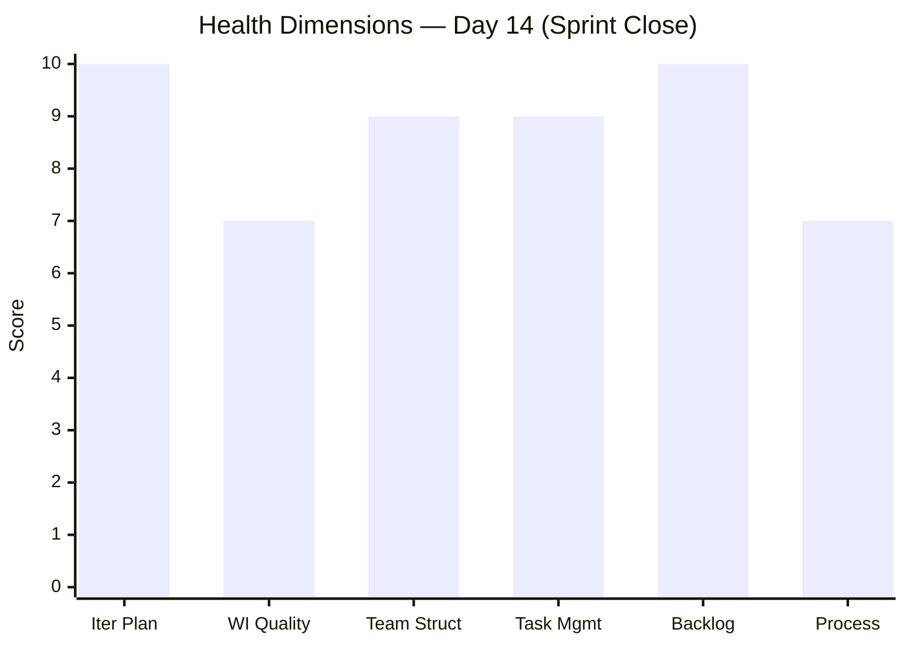

---

## 12. Sprint Outcome Summary

| Metric | Planned | Actual | % |
|---|---|---|---|
| **Items** | 22 (adjusted) | 16 closed | 73% |
| **Story Points** | 49 SP (adjusted) | 34 SP | 69% |
| **Velocity** | — | 34 SP | +42% vs Iter 6.4 |
| **Carryover** | 0 | 6 items (15 SP) | 31% unfinished |
| **Scope Moved** | — | 3 items (5 SP) | PO-managed |

### Sprint Performance by Phase

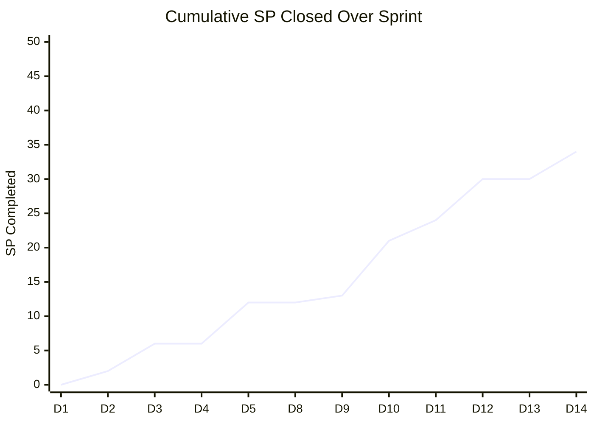

| Phase | Days | SP Closed | % of Total | Characterization |
|---|---|---|---|---|
| Early Sprint (D1–D5) | 5 | 12 SP | 35% | Steady ramp-up |
| Mid Sprint (D8–D10) | 3 | 9 SP | 26% | Acceleration |
| Late Sprint (D11–D14) | 4 | 13 SP | 38% | Strong finish |

---

## 13. Conclusion

Iteration 6.5 closes with **34 SP completed (69%)** — a **+42% velocity improvement** over Iteration 6.4's ~24 SP. This is the strongest sprint performance in the audit history.

**Sprint Winners:**

- **Teofilo** — 93% completion, 26 SP delivered, consistent daily cadence throughout
- **Grace** — 100% completion, 7 SP delivered, trajectory from 0% (Day 10) → 43% (Day 12) → 100% (Day 14)

**Sprint Concerns:**

- **Samantha** — 0% completion for the 2nd consecutive iteration; 6 SP carrying over
- **Armelita** — 13% completion in 6.5; 12 SP total carryover (6 items across 6.5 + 6.6)
- **#200353** — March 21 training item never progressed from New

The health score reaches **85/100** — a **+37 point improvement** from the original baseline of 48/100:

| Audit | Date | Day | Score | Delta |
|---|---|---|---|---|
| 1st | Feb 26 | Iter 6.4 | 48 | Baseline |
| 2nd | Mar 3 | Iter 6.4 | 61 | +13 |
| 3rd | Mar 16 | Iter 6.5 D8 | 78 | +17 |
| 4th | Mar 17 | Iter 6.5 D9 | 79 | +1 |
| 5th | Mar 18 | Iter 6.5 D10 | 82 | +3 |
| 6th | Mar 20 | Iter 6.5 D12 | 84 | +2 |
| **7th** | **Mar 22** | **Iter 6.5 D14** | **85** | **+1** |

The team has demonstrated **continuous improvement across 7 audits** — the hallmark of a maturing Agile organization. The key challenge entering Iteration 6.6 (IP) is addressing the Samantha zero-completion pattern and rebalancing armelita's 12 SP carryover load.

**Recommended next audit: Iteration 6.6 (IP) — Day 3–5 to assess carryover absorption and retrospective action items.**

---

*Report generated: March 22, 2026 | SAFe 6.0 Framework | Jairosoft Portfolio — JIT Operation Team*
*Audit History: Feb 26 (48), Mar 3 (61), Mar 16 (78), Mar 17 (79), Mar 18 (82), Mar 20 (84), Mar 22 (85)*
*Iteration 6.5: Mar 9 – Mar 22, 2026 | Day 14 of 14 (Sprint Close) | Health Score: 85/100*
*Final Velocity: 34 SP | Completion: 69% | Carryover: 15 SP + 5 SP moved = 20 SP into Iter 6.6*
