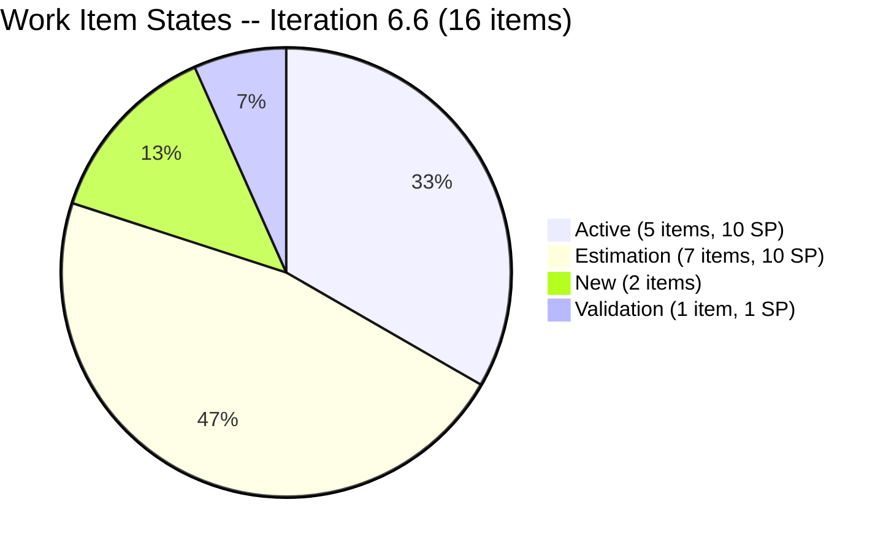
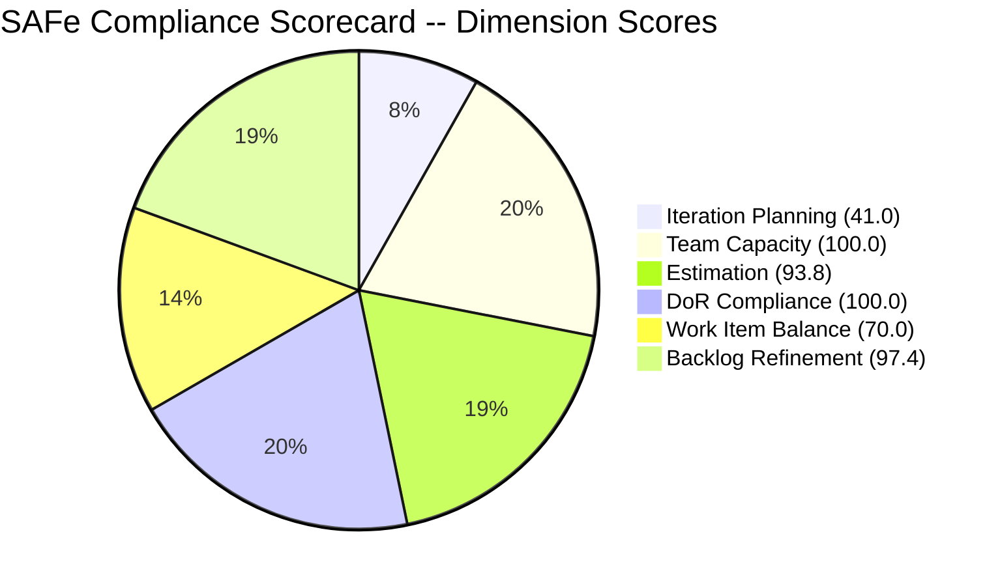

# SAFe Audit Report -- Iteration 6.6 (IP) Day 3

## Audit Metadata

| Field | Value |
|---|---|
| **Project** | Jairosoft Portfolio |
| **Team** | JIT Operation Team |
| **Workspace Folder** | `ado_jit` |
| **Current Iteration** | Iteration 6.6 (IP) |
| **Iteration Start** | March 23, 2026 |
| **Iteration Finish** | April 5, 2026 |
| **Iteration Day** | Day 3 of 14 (21% elapsed) |
| **Audit Date** | March 25, 2026 (UTC) |
| **Auditor** | Claude (AI Agile Consultant) |
| **Framework** | SAFe 6.0 |
| **Scoring Rubric** | ADO SAFe v1 (six-dimension deterministic) |
| **Previous Audit** | AUDIT_2026-03-22_2329.md (Iteration 6.5 Sprint Close, Score: 85/100 custom) |
| **Overall Score** | **83.7 / 100** |
| **Risk Band** | **Low Risk** |
| **Board URL** | [ADO Board](https://dev.azure.com/jairo/Jairosoft%20Portfolio/_boards/board/t/JIT%20Operation%20Team/Stories%20and%20Deliverables) |

---

## Executive Summary

This is the **first audit of Iteration 6.6 (IP)**, conducted on Day 3 of 14. Iteration 6.6 is the Innovation and Planning (IP) iteration that follows the strong close of Iteration 6.5 (34 SP completed, 69% burn rate).

**Key observations:**

- **16 root-level items** are planned for Iteration 6.6 with **26 Story Points** estimated across 15 of them (1 item unestimated)
- **Armelita carries the majority of the sprint load**: 12 items (75%) assigned to her, including 3 carryover items from Iteration 6.5
- **Grace has 4 new items** (all User Stories) -- a significant increase from her 2 items in Iteration 6.5
- **Samantha has 1 item** (#201377 Spike, in Validation state) -- her first item to reach an advanced state in the audit history
- **Teofilo has zero items** assigned in this iteration despite having 6 hrs/day capacity configured
- **All 4 team members** have capacity configured (total 15 hrs/day), but only 3 have assigned work
- The backlog is well-refined: 38 of 39 visible items were touched within the last 45 days
- **DoR compliance is 100%** -- every current iteration item has Description (>= 30 chars) and Acceptance Criteria (>= 20 chars)

**Overall Score: 83.7/100 (Low Risk)**

---

## Previous Audit Delta

| Metric | Iter 6.5 Close (Mar 22) | Iter 6.6 Day 3 (Mar 25) | Notes |
|---|---|---|---|
| **Scoring Rubric** | Custom weighted (6 dimensions, 0-10 scale) | ADO SAFe v1 (6 dimensions, 0-100 scale) | Not directly comparable |
| **Previous Score** | 85/100 | 83.7/100 | Different rubric; new baseline |
| **Iteration Items** | 22 (adjusted from 25) | 16 | IP iteration, lighter load |
| **Story Points** | 49 SP (adjusted) | 26 SP (15 estimated, 1 unestimated) | Scope reset |
| **Team Members with Work** | 4 | 3 | Teofilo has 0 items |
| **Samantha Status** | 0% completion (2nd consecutive) | 1 item in Validation | First advancement observed |
| **Carryover Items** | 9 items (20 SP) predicted | 3 items absorbed (#200593, #200597, #200607) | 6 items redirected to PI 7 or remain in backlog |

**Rubric transition note:** This is the first audit using the standardized ADO SAFe v1 deterministic rubric. The previous audit used a custom weighted scoring model. The scores are not directly comparable but are both presented for continuity.

---

## Current Iteration Snapshot

### Sprint Scope

| Metric | Value |
|---|---|
| **Root items in iteration** | 16 |
| **Total Story Points (estimated)** | 26 SP |
| **Unestimated items** | 1 (#201522 -- Lead Tracking & Follow-up) |
| **Items by state** | Active: 5, Estimation: 7, New: 2, Validation: 1, Blocked: 1 (not in iteration) |
| **Iteration type** | IP (Innovation & Planning) |

### State Distribution

| State | Count | SP | Items |
|---|---|---|---|
| **Active** | 5 | 10 SP | #200607, #201429, #201433, #201493, #201504 |
| **Estimation** | 7 | 10 SP | #200264, #200566, #200589, #200593, #200597, #200604, #201442 |
| **New** | 2 | 2 SP + 1 unestimated | #201514, #201522 |
| **Validation** | 1 | 1 SP | #201377 |
| **Closed** | 0 | 0 SP | -- |

### Team Capacity

| Member | Capacity/Day | Activity | Days Off | Items | SP | % of Sprint Load |
|---|---|---|---|---|---|---|
| **armelita** | 6 hrs | Documentation | 1 (Mar 24) | 12 | 18 SP | 75% |
| **grace** | 2 hrs | Documentation | 0 | 4 | 8 SP | 25% (by SP) |
| **Samantha Babael** | 1 hr | Documentation | 0 | 1 | 1 SP | 6% |
| **Teofilo Limpag** | 6 hrs | Training | 0 | 0 | 0 SP | 0% |
| **TOTAL** | **15 hrs/day** | -- | **1** | **16** (unique) | **26 SP** | -- |

> Note: Item #201377 is assigned to Samantha. Teofilo has 6 hrs/day capacity allocated but zero items in this iteration, representing 40% of team capacity going unused.

---

## Work Item Analysis

### Full Inventory -- Iteration 6.6 (16 Items)

| ID | Type | Title | State | Assigned | SP | Changed |
|---|---|---|---|---|---|---|
| #200264 | User Story | St. Mary Bansalan Interns Final Demo and Awarding | Estimation | armelita | 2 | Mar 23 |
| #200566 | User Story | [TESDA Compliance] Additional Trainer Application - Samantha | Estimation | armelita | 1 | Mar 24 |
| #200589 | User Story | CSS NC II Batch 2 Enrollment Report | Estimation | armelita | 1 | Mar 24 |
| #200593 | User Story | AC Resubmission Result | Estimation | armelita | 1 | Mar 24 |
| #200597 | User Story | CSS NC II AC Registration Fee | Estimation | armelita | 2 | Mar 24 |
| #200604 | User Story | Python Inquiries | Estimation | armelita | 2 | Mar 24 |
| #200607 | User Story | Bubble MCC Marketing Activities | Active | armelita | 2 | Mar 24 |
| #200611 | User Story | [Onboarding] UM Matina Interns | Estimation | armelita | 1 | Mar 24 |
| #201377 | Spike | Prepare Certificate for Interns | Validation | Samantha | 1 | Mar 25 |
| #201429 | User Story | TESDA Action Catalog | Active | armelita | 2 | Mar 24 |
| #201433 | User Story | T2 MIS Employment Report | Active | armelita | 2 | Mar 24 |
| #201442 | User Story | Market CSS NC II April 2026 Class | Estimation | armelita | 3 | Mar 24 |
| #201493 | User Story | TESDA SM Microcredential Program Submission | Active | grace | 2 | Mar 24 |
| #201504 | User Story | School Engagement & Flyering | Active | grace | 2 | Mar 24 |
| #201514 | User Story | "Free Discovery Day" Event | New | grace | 2 | Mar 23 |
| #201522 | User Story | Lead Tracking & Follow-up | New | grace | -- | Mar 23 |

### Carryover from Iteration 6.5

Three items were moved to Iteration 6.6 during Iteration 6.5 and remain in the sprint:

| ID | Title | State | SP | Origin |
|---|---|---|---|---|
| #200593 | AC Resubmission Result | Estimation | 1 | Moved from 6.5 by PO |
| #200597 | CSS NC II AC Registration Fee | Estimation | 2 | Moved from 6.5 by PO |
| #200607 | Bubble MCC Marketing Activities | Active | 2 | Moved from 6.5 by PO |

### Backlog Items Not in Current Iteration (23 items)

The remaining 23 items on the Stories and Deliverables backlog are distributed across future iterations and the root backlog:

| Iteration Path | Count | Key Items |
|---|---|---|
| PI 7 / Iteration 7.1 | 7 | Intern awarding ceremonies, SK Buhangin, CSS NC II Certificates |
| PI 7 / Iteration 7.5 | 1 | UM Digos Interns Final Demo |
| 2026-PI6 (root) | 4 | Prompt Eng'g MCC, Sitecore MCC, ODOO OpenCat, SAFe AI Native Foundation |
| Jairosoft Portfolio (root) | 9 | Courseware development (SAFe MC, Python, Data Wrangling, Rust, etc.) |
| Iteration 6.5 (past) | 1 | #198630 Markdown Training (Blocked) |
| PI 4 / Iteration 4.1 (old) | 1 | #192303 Submit application (159 days stale) |

---

## SAFe Compliance Scorecard

| # | Dimension | Score | Evidence | Notes |
|---|---|---|---|---|
| 1 | **Iteration Planning** | **41.0** | 16 of 39 visible backlog items assigned to current iteration | Low ratio is expected for an IP iteration; 23 items are in future iterations or backlog parking |
| 2 | **Team Capacity** | **100.0** | 3/3 contributors with work have capacity configured | armelita 6h, grace 2h, Samantha 1h; Teofilo has capacity but no assigned work |
| 3 | **Estimation** | **93.8** | 15 of 16 items have Story Points > 0 | #201522 (Lead Tracking & Follow-up) is unestimated |
| 4 | **DoR Compliance** | **100.0** | 16/16 items have Description >= 30 nws chars and AC >= 20 nws chars | Strong SAFe format adoption across the board |
| 5 | **Work Item Balance** | **70.0** | User Story: 15, Spike: 1 | -30 penalty: dominant type (User Story) at 93.8% > 60% threshold |
| 6 | **Backlog Refinement** | **97.4** | 38/39 items fresh (< 45 days); 1 item stale > 90 days (2.6%); 0 untouched in iteration | Only #192303 is stale (159 days); no penalties triggered |
| | **Overall** | **83.7** | Average of 6 dimensions | **Low Risk** (>= 80) |

---

## Dimension Findings

### 1. Iteration Planning (41.0/100)

The 41.0 score reflects that only 16 of 39 visible backlog items are assigned to the current iteration. This is structurally expected for an IP iteration, where the team focuses on a lighter delivery load while completing innovation, planning, and retrospective activities. The 23 non-current items are properly distributed to future PI 7 iterations and backlog staging areas.

**Assessment:** Score is artificially low due to IP iteration context. The planning itself appears intentional and well-organized.

### 2. Team Capacity (100.0/100)

All three team members with assigned work (armelita, grace, Samantha) have capacity configured with at least one activity. However, Teofilo Limpag has 6 hrs/day capacity configured but zero items assigned. This means 40% of total team capacity (6 of 15 hrs/day) is allocated but unused.

**Assessment:** The rubric scores 100 because all contributors with work have capacity. The Teofilo gap is a planning concern but does not affect the formula.

### 3. Estimation (93.8/100)

15 of 16 items have Story Points assigned. The single unestimated item is #201522 (Lead Tracking & Follow-up, assigned to grace, state: New). This item was created on March 23 and has not yet been estimated.

**Assessment:** Near-perfect estimation. One quick action needed.

### 4. DoR Compliance (100.0/100)

Every item in the current iteration has both a Description with >= 30 non-whitespace characters and Acceptance Criteria with >= 20 non-whitespace characters. This is a significant improvement from Iteration 6.5, where SAFe format adoption was only 27%.

**Assessment:** Outstanding. The team has fully adopted structured work item authoring.

### 5. Work Item Balance (70.0/100)

The -30 penalty is triggered because User Story items represent 93.8% (15/16) of the iteration backlog. While having User Stories is positive (no -40 penalty for missing them), the concentration is high. Only 1 Spike exists. No Enablers, Training, or Courseware items are in the sprint.

**Assessment:** The IP iteration is compliance- and marketing-heavy, naturally skewing toward User Stories. The lack of Training items is notable given this team's primary domain.

### 6. Backlog Refinement (97.4/100)

The backlog is exceptionally well-maintained. 38 of 39 items (97.4%) were updated within the last 45 days. Only #192303 ("Submit application", grace, Iteration 4.1) is stale at 159 days since last change. No items exceed the 180-day threshold, and zero current iteration items are untouched.

**Assessment:** Best refinement score possible given one legacy item. The team should address #192303.

---

## Risks and Bottlenecks

| # | Risk | Severity | Evidence | Recommended Action |
|---|---|---|---|---|
| R1 | **Armelita overloaded at 75% of sprint** | HIGH | 12 of 16 items (18 SP) assigned to armelita with 6 hrs/day | Redistribute 3-4 items to Teofilo or grace |
| R2 | **Teofilo has zero work items** | HIGH | 6 hrs/day capacity configured but 0 items assigned | Assign training or enabler work immediately |
| R3 | **7 items still in Estimation state** | MEDIUM | 44% of sprint (7/16) not yet promoted to Active/Ready | Move to Active within Day 4-5 to avoid mid-sprint bottleneck |
| R4 | **Samantha capacity at 1 hr/day** | MEDIUM | Only 1 item, 1 SP; historical 0% completion pattern | Validate the Spike item (#201377) promptly; small capacity may be intentional |
| R5 | **#201522 unestimated** | LOW | User Story without Story Points; state: New | Estimate during next backlog refinement |
| R6 | **#192303 stale at 159 days** | LOW | "Submit application" in Iteration 4.1, unchanged since Oct 2025 | Close, archive, or move to appropriate iteration |
| R7 | **#198630 Markdown Training blocked** | MEDIUM | Samantha's carryover item from 6.5 now in Blocked state (Iter 6.5 path) | Resolve blocker or formally remove from backlog |

---

## Prioritized Recommendations

| Priority | Action | Owner | Dimension Impact | Expected Improvement |
|---|---|---|---|---|
| **1** | **Assign work to Teofilo** -- He has 6 hrs/day (40% of team capacity) with zero items. Reassign 3-4 of armelita's Estimation items or add Training/Enabler work. | Armelita (PO) | Work Item Balance, Iteration Planning | Reduces R1 and R2; improves type diversity |
| **2** | **Promote Estimation items to Active** -- 7 items (44%) are still in Estimation. By Day 5, all should be in Active or Ready. | Armelita (PO) | Process velocity | Prevents mid-sprint planning drag |
| **3** | **Estimate #201522 (Lead Tracking & Follow-up)** -- Only unestimated item. | grace | Estimation | Score would rise to 100.0 |
| **4** | **Validate and close #201377 (Samantha's Spike)** -- This is Samantha's first item to reach Validation in audit history. Closing it breaks her zero-completion pattern. | Samantha / Armelita | Team credibility | Addresses F15 from prior audit |
| **5** | **Resolve #198630 Markdown Training blocker** -- Item is Blocked, still on Iteration 6.5 path. Either unblock and move to 6.6, or defer to PI 7. | Samantha / Armelita | Backlog hygiene | Reduces blocked item risk |
| **6** | **Address stale item #192303** -- 159 days since last change. Close or move to a relevant iteration. | grace / Armelita | Backlog Refinement | Prevents crossing 180-day penalty threshold |
| **7** | **Add Enabler/Training items for type diversity** -- IP iteration should include innovation spikes or training. Consider adding 1-2 Training or Enabler items. | All | Work Item Balance | Could improve from 70.0 toward 100.0 |

---

## Evidence Gaps and Limitations

| # | Gap | Impact | Mitigation |
|---|---|---|---|
| G1 | **First audit under ADO SAFe v1 rubric** | Scores are not directly comparable to prior audit history (custom weighted model) | Both scores presented in delta section for continuity; this audit establishes a new baseline |
| G2 | **Iteration Planning score structurally low for IP iterations** | The formula divides current iteration items by total backlog, which penalizes lighter IP iterations | Noted in Dimension Findings; the planning is intentional, not deficient |
| G3 | **Work Item Balance penalizes User Story concentration** | IP iterations naturally skew toward administrative/compliance User Stories | Penalty is formulaic; the team's item selection is reasonable for an IP iteration |
| G4 | **#198630 (Markdown Training) in Blocked state on Iteration 6.5 path** | Visible on backlog but not counted as current iteration item; its blocked status is not captured in the scorecard | Documented in Risks; recommend resolving the blocker |
| G5 | **No work item revision history inspected** | Did not audit individual item state transitions or history for this Day 3 report | Acceptable for early-iteration audit; revision analysis is more valuable at mid-sprint |

---

*Report generated: March 25, 2026 (UTC) | SAFe 6.0 Framework | ADO SAFe v1 Rubric*
*Jairosoft Portfolio -- JIT Operation Team | Iteration 6.6 (IP): Mar 23 -- Apr 5, 2026*
*Overall Score: 83.7/100 (Low Risk) | Day 3 of 14 (21% elapsed)*
*Previous: AUDIT_2026-03-22_2329.md (Iter 6.5 Close, 85/100 custom rubric)*
