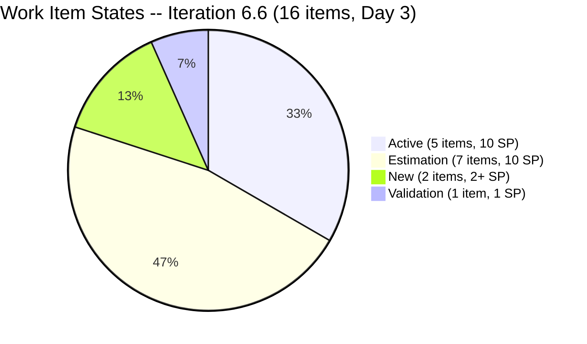
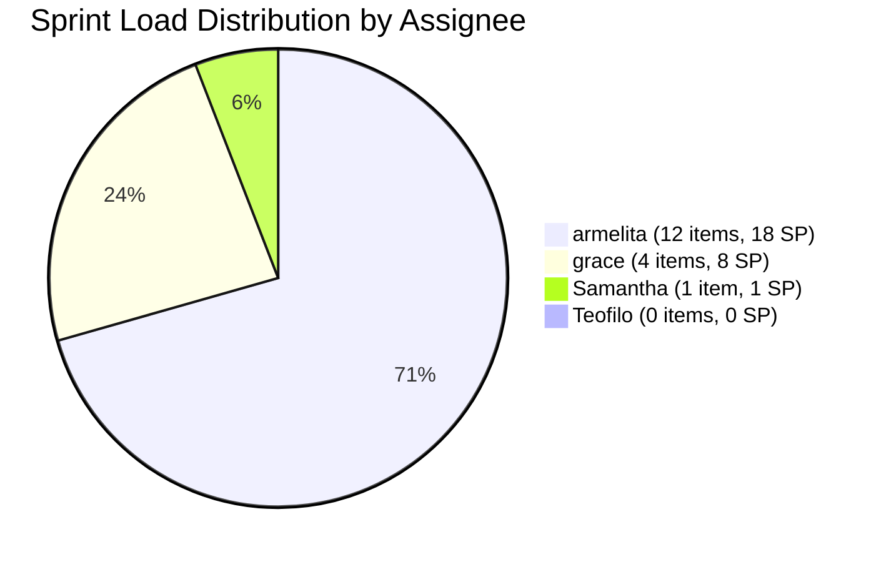
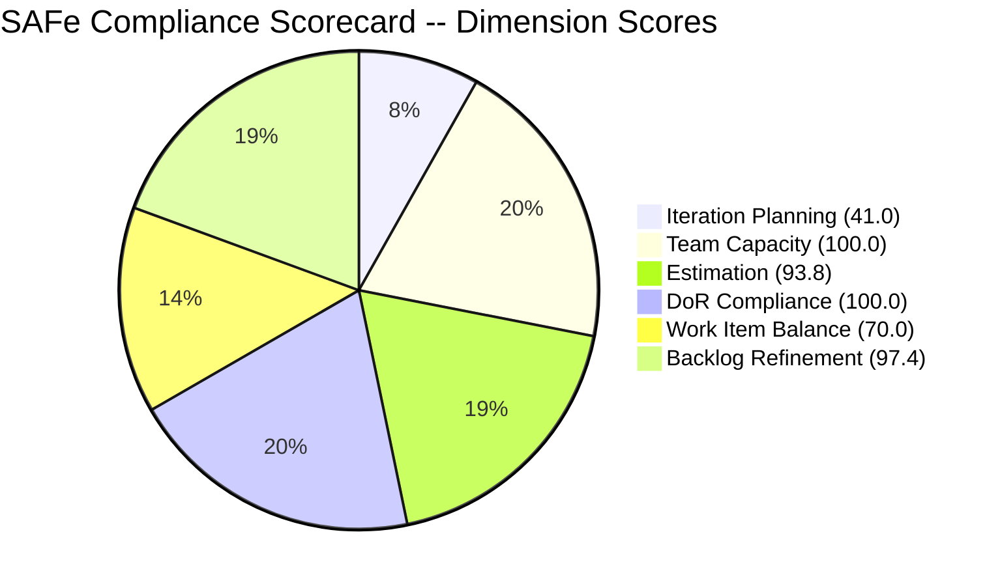
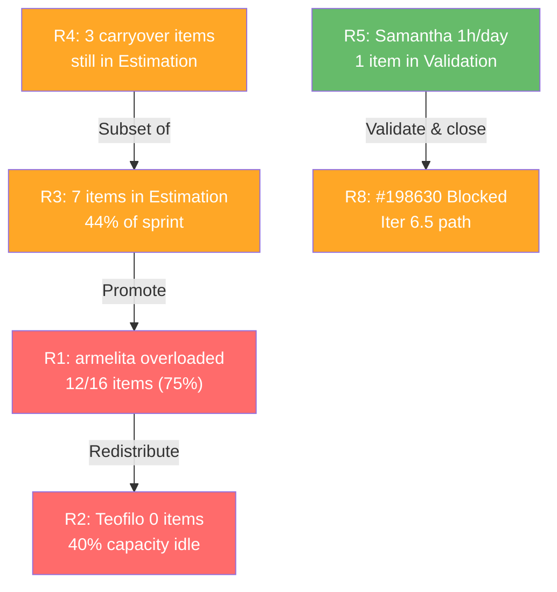

# SAFe Audit Report -- Iteration 6.6 (IP) Day 3 (Evening)

## 1. Audit Metadata

| Field | Value |
|---|---|
| **Project** | Jairosoft Portfolio |
| **Team** | JIT Operation Team |
| **Team ID** | `66cdeb09-df38-4c3e-9418-0ed0d68c39f2` |
| **Workspace Folder** | `ado_jit` |
| **Current Iteration** | Iteration 6.6 (IP) |
| **Iteration Path** | `Jairosoft Portfolio\2026-PI6\Iteration 6.6 (IP)` |
| **Iteration Start** | March 23, 2026 |
| **Iteration Finish** | April 5, 2026 |
| **Iteration Day** | Day 3 of 14 (21% elapsed) |
| **Audit Date** | March 25, 2026 09:48 UTC |
| **Auditor** | Claude (AI EngProd Consultant) |
| **Framework** | SAFe 6.0 |
| **Scoring Rubric** | ADO SAFe v1 (six-dimension deterministic) |
| **Previous Audit** | AUDIT_2026-03-25_0849.md (Iteration 6.6 IP Day 3, Score: 83.7/100) |
| **Overall Score** | **83.7 / 100** |
| **Risk Band** | **Low Risk** |
| **Board URL** | [ADO Board](https://dev.azure.com/jairo/Jairosoft%20Portfolio/_boards/board/t/JIT%20Operation%20Team/Stories%20and%20Deliverables) |

---

## 2. Executive Summary

This is the **second audit of Iteration 6.6 (IP)**, conducted later on Day 3 of 14. Iteration 6.6 is the Innovation and Planning (IP) iteration following the strong close of Iteration 6.5 (34 SP completed, 69% burn rate).

**Key observations:**

- **16 root-level items** are planned for Iteration 6.6 with **26 Story Points** estimated across 15 of them (1 item unestimated)
- **Armelita carries the majority of the sprint load**: 12 items (75%) assigned to her, representing 18 SP
- **Grace has 4 items** (all User Stories, 8 SP) -- a significant increase from Iteration 6.5
- **Samantha has 1 item** (#201377 Spike, now in Validation state with today's update) -- her first item to reach an advanced state
- **Teofilo has zero items** assigned despite having 6 hrs/day capacity configured
- **All 4 team members** have capacity configured (total 15 hrs/day), but only 3 have assigned work
- The backlog is well-refined: 38 of 39 visible items were touched within the last 45 days
- **DoR compliance is 100%** -- every current iteration item has adequate Description and Acceptance Criteria
- **#201377 was updated today** (Mar 25) -- Samantha's Spike moved to Validation state, the most significant intra-day change since the prior audit

**Overall Score: 83.7/100 (Low Risk)** -- unchanged from the earlier Day 3 audit.

---

## 3. Previous Audit Delta

| Metric | Prior Audit (Mar 25, 08:49 UTC) | This Audit (Mar 25, 09:48 UTC) | Delta |
|---|---|---|---|
| **Overall Score** | 83.7/100 | 83.7/100 | No change |
| **Risk Band** | Low Risk | Low Risk | No change |
| **Iteration Items** | 16 | 16 | Stable |
| **Story Points** | 26 SP (15 estimated, 1 unestimated) | 26 SP (15 estimated, 1 unestimated) | Stable |
| **Team Members with Work** | 3 (armelita, grace, Samantha) | 3 (armelita, grace, Samantha) | Stable |
| **Teofilo Status** | 0 items, 6h capacity | 0 items, 6h capacity | No change |
| **#201377 (Samantha)** | Validation (changed Mar 25) | Validation (changed Mar 25, 07:34 UTC) | Confirmed active today |
| **Visible Backlog** | 39 items | 39 items | Stable |

**Intra-day change summary:** The only observable change since the prior audit is the confirmed timestamp on #201377 (Samantha's Spike), which was updated at 07:34 UTC today to Validation state. No new items were added, no items were closed, and no scope changes occurred.

---

## 4. Current Iteration Snapshot

### Sprint Scope

| Metric | Value |
|---|---|
| **Root items in iteration** | 16 |
| **Total Story Points (estimated)** | 26 SP |
| **Unestimated items** | 1 (#201522 -- Lead Tracking & Follow-up) |
| **Items by state** | Active: 5, Estimation: 7, New: 2, Validation: 1 |
| **Closed items** | 0 |
| **Iteration type** | IP (Innovation & Planning) |

### State Distribution

| State | Count | SP | Items |
|---|---|---|---|
| **Active** | 5 | 10 SP | #200607, #201429, #201433, #201493, #201504 |
| **Estimation** | 7 | 10 SP | #200264, #200566, #200589, #200593, #200597, #200604, #201442 |
| **New** | 2 | 2 SP + 1 unest. | #201514, #201522 |
| **Validation** | 1 | 1 SP | #201377 |
| **Closed** | 0 | 0 SP | -- |

### Team Capacity

| Member | Capacity/Day | Activity | Days Off | Items | SP | % of Sprint Load |
|---|---|---|---|---|---|---|
| **armelita** | 6 hrs | Documentation | 1 (Mar 24) | 12 | 18 SP | 75% |
| **grace** | 2 hrs | Documentation | 0 | 4 | 8 SP | 25% (by SP) |
| **Samantha Babael** | 1 hr | Documentation | 0 | 1 | 1 SP | 6% |
| **Teofilo Limpag** | 6 hrs | Training | 0 | 0 | 0 SP | 0% |
| **TOTAL** | **15 hrs/day** | -- | **1** | **16** (unique) | **26 SP** | -- |

> Teofilo has 6 hrs/day (40% of team capacity) with zero assigned items, representing the largest capacity gap in this iteration.

---

## 5. Work Item Analysis

### Full Inventory -- Iteration 6.6 (16 Items)

| ID | Type | Title | State | Assigned | SP | Changed |
|---|---|---|---|---|---|---|
| #200264 | User Story | St. Mary Bansalan Interns Final Demo and Awarding | Estimation | armelita | 2 | Mar 23 |
| #200566 | User Story | [TESDA Compliance] Additional Trainer Application - Samantha | Estimation | armelita | 1 | Mar 24 |
| #200589 | User Story | CSS NC II Batch 2 Enrollment Report | Estimation | armelita | 1 | Mar 24 |
| #200593 | User Story | AC Resubmission Result | Estimation | armelita | 1 | Mar 24 |
| #200597 | User Story | CSS NC II AC Registration Fee | Estimation | armelita | 2 | Mar 24 |
| #200604 | User Story | Python Inquiries | Estimation | armelita | 2 | Mar 24 |
| #200607 | User Story | Bubble MCC Marketing Activities | Active | armelita | 2 | Mar 24 |
| #200611 | User Story | [Onboarding] UM Matina Interns | Estimation | armelita | 1 | Mar 24 |
| #201377 | Spike | Prepare Certificate for Interns | Validation | Samantha | 1 | **Mar 25** |
| #201429 | User Story | TESDA Action Catalog | Active | armelita | 2 | Mar 24 |
| #201433 | User Story | T2 MIS Employment Report | Active | armelita | 2 | Mar 24 |
| #201442 | User Story | Market CSS NC II April 2026 Class | Estimation | armelita | 3 | Mar 24 |
| #201493 | User Story | TESDA SM Microcredential Program Submission | Active | grace | 2 | Mar 24 |
| #201504 | User Story | School Engagement & Flyering | Active | grace | 2 | Mar 24 |
| #201514 | User Story | "Free Discovery Day" Event | New | grace | 2 | Mar 23 |
| #201522 | User Story | Lead Tracking & Follow-up | New | grace | -- | Mar 23 |

### Carryover from Iteration 6.5

Three items carried over from Iteration 6.5 remain in the sprint:

| ID | Title | State | SP | Origin |
|---|---|---|---|---|
| #200593 | AC Resubmission Result | Estimation | 1 | Carried from 6.5 |
| #200597 | CSS NC II AC Registration Fee | Estimation | 2 | Carried from 6.5 |
| #200607 | Bubble MCC Marketing Activities | Active | 2 | Carried from 6.5 |

### Backlog Items Not in Current Iteration (23 items)

| Iteration Path | Count | Key Items |
|---|---|---|
| PI 7 / Iteration 7.1 | 7 | Intern awarding ceremonies, SK Buhangin, CSS NC II Certificates |
| PI 7 / Iteration 7.5 | 1 | UM Digos Interns Final Demo |
| 2026-PI6 (root) | 4 | Prompt Eng'g MCC, Sitecore MCC, ODOO OpenCat, SAFe AI Native Foundation |
| Jairosoft Portfolio (root) | 9 | Courseware development (SAFe MC, Python, Data Wrangling, Rust, etc.) |
| Iteration 6.5 (past) | 1 | #198630 Markdown Training (Blocked) |
| PI 4 / Iteration 4.1 (old) | 1 | #192303 Submit application (159 days stale) |

---

## 6. SAFe Compliance Scorecard

| # | Dimension | Score | Evidence | Notes |
|---|---|---|---|---|
| 1 | **Iteration Planning** | **41.0** | 16 of 39 visible backlog items assigned to current iteration | Expected for IP iteration; 23 items in future iterations or backlog staging |
| 2 | **Team Capacity** | **100.0** | 3/3 contributors with work have capacity configured | armelita 6h, grace 2h, Samantha 1h; Teofilo has capacity but no work |
| 3 | **Estimation** | **93.8** | 15 of 16 items have Story Points > 0 | #201522 (Lead Tracking & Follow-up) remains unestimated |
| 4 | **DoR Compliance** | **100.0** | 16/16 items have Description >= 30 nws chars and AC >= 20 nws chars | Full SAFe format adoption |
| 5 | **Work Item Balance** | **70.0** | User Story: 15, Spike: 1 | -30 penalty: dominant type (User Story) at 93.8% > 60% threshold |
| 6 | **Backlog Refinement** | **97.4** | 38/39 items fresh (< 45 days); 1 item stale > 90 days (2.6%); 0 untouched in iteration | Only #192303 is stale (159 days); no penalty thresholds triggered |
| | **Overall** | **83.7** | Average of 6 dimensions | **Low Risk** (>= 80) |

### Score Computation Detail

| Dimension | Formula | Calculation | Result |
|---|---|---|---|
| Iteration Planning | current / visible * 100 | 16 / 39 * 100 | 41.0 |
| Team Capacity | with_capacity / with_work * 100 | 3 / 3 * 100 | 100.0 |
| Estimation | estimated / point_eligible * 100 | 15 / 16 * 100 | 93.8 |
| DoR Compliance | dor_compliant / current * 100 | 16 / 16 * 100 | 100.0 |
| Work Item Balance | 100 - penalties (no US: -40, dominant>60%: -30, spike>40%: -20) | 100 - 30 | 70.0 |
| Backlog Refinement | base(fresh/visible*100) - penalties | 97.4 - 0 | 97.4 |
| **Overall** | **average(all 6)** | **(41.0+100.0+93.8+100.0+70.0+97.4)/6** | **83.7** |

---

## 7. Dimension Findings

### 7.1 Iteration Planning (41.0/100)

The 41.0 score reflects that only 16 of 39 visible backlog items are assigned to the current iteration. This is structurally expected for an IP iteration, where the team takes a lighter delivery load to focus on innovation, retrospectives, and PI 7 preparation. The 23 non-current items are properly distributed across future PI 7 iterations and backlog staging areas.

**Assessment:** Score is artificially low due to IP iteration structure. The planning itself is intentional and well-organized. No change since the earlier audit.

### 7.2 Team Capacity (100.0/100)

All three team members with assigned work (armelita, grace, Samantha) have capacity configured with at least one activity. Teofilo Limpag has 6 hrs/day capacity configured but zero items assigned, representing 40% of total team capacity going unused.

**Assessment:** Formula-perfect score. The Teofilo gap is a material planning concern but does not affect the deterministic score. This was flagged in the prior audit as well.

### 7.3 Estimation (93.8/100)

15 of 16 items have Story Points assigned. The single unestimated item is #201522 (Lead Tracking & Follow-up, assigned to grace, state: New). This item was created on March 23 and remains unestimated since the prior audit.

**Assessment:** Near-perfect. One quick estimation action needed for #201522 to reach 100.0.

### 7.4 DoR Compliance (100.0/100)

Every item in the current iteration has both a Description with >= 30 non-whitespace characters and Acceptance Criteria with >= 20 non-whitespace characters. This demonstrates strong and sustained SAFe format adoption.

**Assessment:** Outstanding. Maintained at 100% across both Day 3 audits.

### 7.5 Work Item Balance (70.0/100)

The -30 penalty is triggered because User Story items represent 93.8% (15/16) of the iteration backlog, exceeding the 60% concentration threshold. While having User Stories is positive (no -40 penalty for missing them), the concentration is very high. Only 1 Spike exists. No Training, Enabler, or Courseware items are in the sprint.

**Assessment:** The IP iteration is compliance- and marketing-heavy, naturally skewing toward User Stories. The absence of Training items is notable given the team's primary domain. Adding 1-2 Training or Enabler items would reduce the penalty.

### 7.6 Backlog Refinement (97.4/100)

38 of 39 backlog items (97.4%) were updated within the last 45 days. Only #192303 ("Submit application", grace, Iteration 4.1) is stale at 159 days since last change. It does not yet trigger the 180-day penalty but is approaching that threshold. Zero current iteration items are untouched (all have ChangedDate on or after March 23).

**Assessment:** Excellent refinement. The team should address #192303 before it crosses the 180-day boundary (around April 16, 2026).

---

## 8. Risks and Bottlenecks

| # | Risk | Severity | Evidence | Recommended Action |
|---|---|---|---|---|
| R1 | **Armelita overloaded at 75% of sprint** | HIGH | 12 of 16 items (18 SP) assigned to armelita with 6 hrs/day | Redistribute 3-4 Estimation items to Teofilo or grace |
| R2 | **Teofilo has zero work items** | HIGH | 6 hrs/day capacity configured but 0 items assigned (40% of team capacity idle) | Assign training or enabler work immediately |
| R3 | **7 items still in Estimation state** | MEDIUM | 44% of sprint (7/16) not yet promoted to Active | Move to Active within Day 4-5 to prevent mid-sprint bottleneck |
| R4 | **3 carryover items still in Estimation** | MEDIUM | #200593, #200597 carried from 6.5, both remain in Estimation | Prioritize advancement -- these have been in the backlog across iterations |
| R5 | **Samantha capacity at 1 hr/day** | LOW | Only 1 item (1 SP); historical zero-completion pattern | Validate and close #201377 promptly to break the pattern |
| R6 | **#201522 unestimated** | LOW | User Story without Story Points; state: New | Estimate during next backlog refinement |
| R7 | **#192303 stale at 159 days** | LOW | "Submit application" in Iteration 4.1, unchanged since Oct 2025 | Close, archive, or move; approaching 180-day penalty threshold |
| R8 | **#198630 Markdown Training blocked** | MEDIUM | Samantha's carryover item from 6.5, Blocked state, still on Iteration 6.5 path | Resolve blocker or formally remove from backlog |

---

## 9. Prioritized Recommendations

| Priority | Action | Owner | Dimension Impact | Expected Improvement |
|---|---|---|---|---|
| **1** | **Assign work to Teofilo** -- He has 6 hrs/day (40% of team capacity) with zero items. Reassign 3-4 of armelita's Estimation items or add Training/Enabler work. | Armelita (PO) | Work Item Balance, Iteration Planning | Reduces R1 and R2; improves type diversity if Training items are added |
| **2** | **Promote Estimation items to Active** -- 7 items (44%) are still in Estimation. By Day 5, all should be Active or beyond. | Armelita (PO) | Process velocity | Prevents mid-sprint planning drag (R3) |
| **3** | **Estimate #201522 (Lead Tracking & Follow-up)** -- Only unestimated item. Quick action. | grace | Estimation | Score rises from 93.8 to 100.0 |
| **4** | **Validate and close #201377 (Samantha's Spike)** -- In Validation state since today. Closing it breaks Samantha's zero-completion pattern. | Samantha / Armelita | Team credibility | Addresses historical concern; demonstrates throughput |
| **5** | **Resolve #198630 Markdown Training blocker** -- Item is Blocked on Iteration 6.5 path. Either unblock and move to 6.6 or defer to PI 7. | Samantha / Armelita | Backlog hygiene | Reduces blocked item risk (R8) |
| **6** | **Address stale item #192303** -- 159 days since last change. Will cross 180-day penalty threshold on Apr 16. | grace / Armelita | Backlog Refinement | Prevents score degradation |
| **7** | **Add Enabler/Training items for type diversity** -- IP iteration should include innovation spikes or training items. Consider adding 1-2 Training or Enabler items. | All | Work Item Balance | Could improve from 70.0 toward 100.0 |

---

## 10. Evidence Gaps and Limitations

| # | Gap | Impact | Mitigation |
|---|---|---|---|
| G1 | **Second same-day audit** | Limited new signal since AUDIT_2026-03-25_0849.md was produced ~1 hour earlier | Both audits use the same rubric; this report confirms stability and documents intra-day changes |
| G2 | **Iteration Planning score structurally low for IP iterations** | Formula divides current items by total visible backlog, penalizing lighter IP iterations | Noted in findings; planning is intentional, not deficient |
| G3 | **Work Item Balance penalizes User Story concentration** | IP iterations naturally skew toward administrative/compliance User Stories | Penalty is formulaic; the team's item selection is reasonable for an IP iteration |
| G4 | **#198630 (Markdown Training) in Blocked state on Iteration 6.5 path** | Visible on backlog but not counted as current iteration item; blocked status is not captured in scorecard | Documented in Risks; recommend resolving the blocker |
| G5 | **No work item revision history inspected** | Did not audit individual item state transitions for this Day 3 report | Acceptable for early-iteration audit; revision analysis is more valuable at mid-sprint |
| G6 | **Teofilo capacity not reflected in score** | Team Capacity formula only checks contributors with work; idle capacity is not penalized | Documented as R2; Teofilo's idle 40% is a significant operational risk even though the score is 100.0 |

---

*Report generated: March 25, 2026 09:48 UTC | SAFe 6.0 Framework | ADO SAFe v1 Rubric*
*Jairosoft Portfolio -- JIT Operation Team | Iteration 6.6 (IP): Mar 23 -- Apr 5, 2026*
*Overall Score: 83.7/100 (Low Risk) | Day 3 of 14 (21% elapsed)*
*Previous: AUDIT_2026-03-25_0849.md (Same-day prior audit, 83.7/100)*
