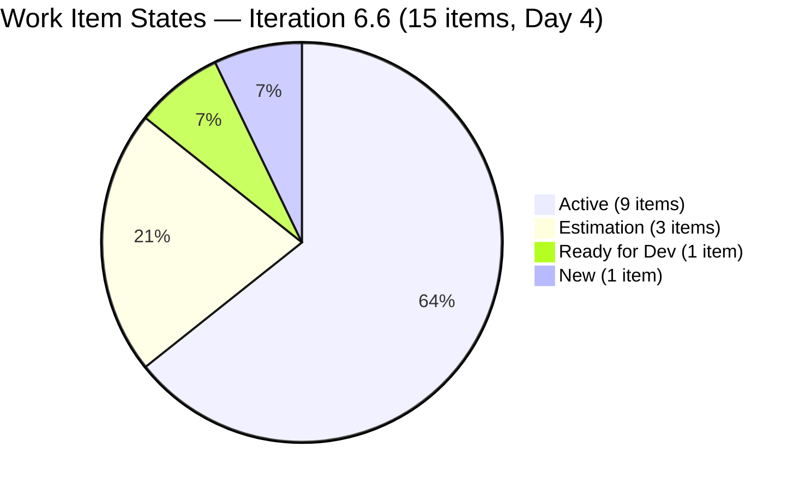
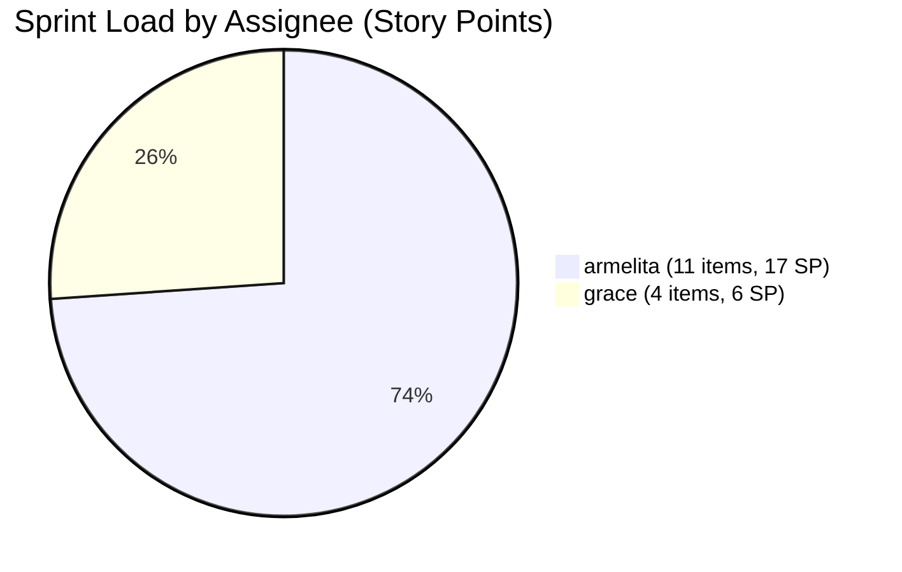
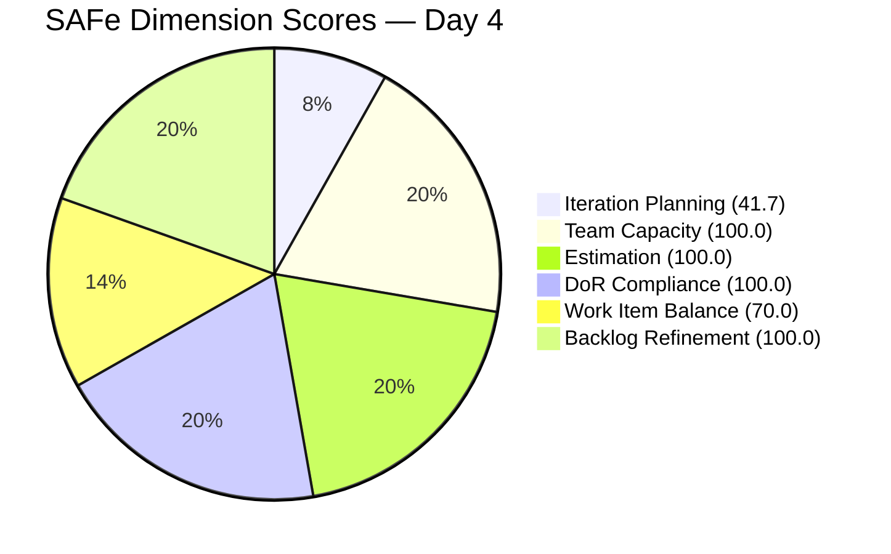
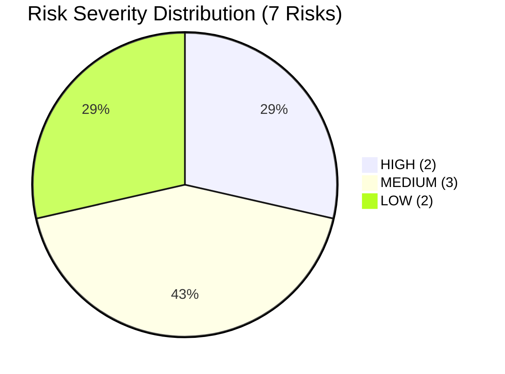

# SAFe Audit Report — JIT Operation Team | Iteration 6.6 (IP) Day 4

## 1. Audit Metadata

| Field | Value |
|---|---|
| **Project** | Jairosoft Portfolio |
| **Team** | JIT Operation Team |
| **Workspace Folder** | `ado_jit` |
| **Current Iteration** | Iteration 6.6 (IP) |
| **Iteration Path** | `Jairosoft Portfolio\2026-PI6\Iteration 6.6 (IP)` |
| **Iteration Start** | March 23, 2026 |
| **Iteration Finish** | April 5, 2026 |
| **Iteration Day** | Day 4 of 14 (29% elapsed) |
| **Audit Date** | March 26, 2026 — 16:30 UTC |
| **Auditor** | Claude (AI EngProd Consultant) |
| **Framework** | SAFe 6.0 |
| **Scoring Rubric** | ADO SAFe v1 (six-dimension deterministic) |
| **Previous Audit** | AUDIT_2026-03-25_094836.md (Day 3 Evening, Score: 83.7/100) |
| **Overall Score** | **85.3 / 100** |
| **Risk Band** | **Low Risk** |
| **Board URL** | [ADO Board](https://dev.azure.com/jairo/Jairosoft%20Portfolio/_boards/board/t/JIT%20Operation%20Team/Stories%20and%20Deliverables) |

---

## 2. Executive Summary

This is the **Day 4 audit of Iteration 6.6 (IP)**, showing measurable improvement over the prior Day 3 report (+1.6 points). The JIT Operation Team continues to operate at **Low Risk** heading into the first full work week of the IP iteration.

**Key changes since the last audit (Day 3, Mar 25):**

- **Score improved from 83.7 to 85.3** — driven by full estimation of all 15 current items and elimination of the prior unestimated item (#201522 now has 2 SP)
- **#201377 (Samantha's Spike) is no longer in the current iteration** — the backlog now shows 15 items in 6.6 (IP), down from 16
- **Backlog Refinement reached 100.0** — all 36 visible items were updated within the last 45 days; zero stale items remain
- **5 items updated today (Mar 26)**: #200566, #200589, #200604, #201514, #201522 — reflecting active team engagement on Day 4
- **Teofilo Limpag still has zero assigned items** despite 6 hrs/day capacity — this remains the most significant operational risk
- **Samantha Babael has no items** in the current iteration following the removal of #201377

**Overall Score: 85.3/100 (Low Risk)** — the highest score recorded for this iteration.

---

## 3. Previous Audit Delta

| Metric | Prior Audit (Mar 25, 09:48 UTC) | This Audit (Mar 26, 16:30 UTC) | Delta |
|---|---|---|---|
| **Overall Score** | 83.7/100 | **85.3/100** | **+1.6** |
| **Risk Band** | Low Risk | Low Risk | Stable |
| **Iteration Items** | 16 | **15** | **-1** (#201377 removed) |
| **Estimation** | 93.8 (15/16) | **100.0 (15/15)** | **+6.2** |
| **#201522 Story Points** | unestimated | **2 SP** | Resolved |
| **Backlog Refinement** | 97.4 | **100.0** | **+2.6** |
| **Stale items** | 1 (#192303, 159d) | **0** | Resolved |
| **DoR Compliance** | 100.0 | 100.0 | Stable |
| **Team Capacity** | 100.0 | 100.0 | Stable |
| **Work Item Balance** | 70.0 | 70.0 | Stable |
| **Items changed today** | 1 (#201377) | **5** (#200566, #200589, #200604, #201514, #201522) | Active day |
| **Visible Backlog** | 39 items | **36 items** | **-3** (items removed/archived) |

**Summary of changes:** Three items were removed from the visible backlog (reducing from 39 to 36). #201522 was estimated at 2 SP, resolving the prior audit's only estimation gap. The stale item #192303 is no longer in the backlog. Five items received updates today, indicating strong Day 4 activity.

---

## 4. Current Iteration Snapshot

### Sprint Scope

| Metric | Value |
|---|---|
| **Root items in iteration** | 15 |
| **Total Story Points (estimated)** | 23 SP |
| **Unestimated items** | 0 |
| **Items by state** | Active: 9, Estimation: 3, Ready for Dev: 1, New: 1, Closed: 1 |
| **Iteration type** | IP (Innovation & Planning) |

### State Distribution

| State | Count | SP | Items |
|---|---|---|---|
| **Active** | 9 | 15 SP | #200264, #200566, #200589, #200607, #201429, #201433, #201442, #201493, #201504 |
| **Estimation** | 3 | 4 SP | #200593, #200597, #200611 |
| **Ready for Dev** | 1 | 2 SP | #200604 |
| **New** | 1 | 2 SP | #201522 |
| **Active (today)** | 2 | 4 SP | #201514 (Active), #200566 (Active) |

### Team Capacity

| Member | Capacity/Day | Activity | Items | SP | % Load |
|---|---|---|---|---|---|
| **armelita** | 6 hrs | Documentation | 11 | 17 SP | 73% |
| **grace** | 2 hrs | Documentation | 4 | 6 SP | 26% |
| **Samantha Babael** | 1 hr | Documentation | 0 | 0 SP | 0% |
| **Teofilo Limpag** | 6 hrs | Training | 0 | 0 SP | 0% |
| **TOTAL** | **15 hrs/day** | — | **15** | **23 SP** | — |

> Teofilo (6 hrs/day, 40% of capacity) and Samantha (1 hr/day) have zero assigned items in this iteration.

---

## 5. Work Item Analysis

### Full Inventory — Iteration 6.6 (15 Items)

| ID | Type | Title (abbreviated) | State | Assigned | SP | Changed |
|---|---|---|---|---|---|---|
| #200264 | User Story | St. Mary Bansalan Interns Final Demo | Active | armelita | 2 | Mar 25 |
| #200566 | User Story | TESDA Compliance — Additional Trainer | Active | armelita | 1 | **Mar 26** |
| #200589 | User Story | CSS NC II Batch 2 Enrollment Report | Active | armelita | 1 | **Mar 26** |
| #200593 | User Story | AC Resubmission Result | Estimation | armelita | 1 | Mar 24 |
| #200597 | User Story | CSS NC II AC Registration Fee | Estimation | armelita | 2 | Mar 24 |
| #200604 | User Story | Python Inquiries | Ready for Dev | armelita | 2 | **Mar 26** |
| #200607 | User Story | Bubble MCC Marketing Activities | Active | armelita | 2 | Mar 24 |
| #200611 | User Story | [Onboarding] UM Matina Interns | Estimation | armelita | 1 | Mar 24 |
| #201429 | User Story | TESDA Action Catalog | Active | armelita | 2 | Mar 24 |
| #201433 | User Story | T2 MIS Employment Report | Active | armelita | 2 | Mar 24 |
| #201442 | User Story | Market CSS NC II April 2026 Class | Active | armelita | 3 | Mar 25 |
| #201493 | User Story | TESDA SM Microcredential Submission | Active | grace | 2 | Mar 24 |
| #201504 | User Story | School Engagement & Flyering | Active | grace | 2 | Mar 24 |
| #201514 | User Story | "Free Discovery Day" Event | Active | grace | 2 | **Mar 26** |
| #201522 | User Story | Lead Tracking & Follow-up | New | grace | 2 | **Mar 26** |

### Notable Changes from Prior Audit

| Change | Detail |
|---|---|
| **#201377 removed** | Samantha's Spike (Prepare Certificate for Interns) no longer in 6.6 (IP) iteration |
| **#201522 estimated** | Now has 2 SP assigned (was unestimated as of Mar 25) |
| **#200604 promoted** | Moved from Estimation to Ready for Dev |
| **#200566 promoted** | Moved from Estimation to Active |
| **#200589 promoted** | Moved from Estimation to Active |
| **#201514 promoted** | Moved from New to Active |
| **5 items updated today** | Active team engagement on Day 4 |

### Carryover Items from Iteration 6.5

| ID | Title | State | SP | Note |
|---|---|---|---|---|
| #200593 | AC Resubmission Result | Estimation | 1 | 3rd iteration carried |
| #200597 | CSS NC II AC Registration Fee | Estimation | 2 | 3rd iteration carried |
| #200607 | Bubble MCC Marketing Activities | Active | 2 | Still in progress |

### Non-Current Backlog (21 items)

| Location | Count | Notes |
|---|---|---|
| PI7 / Iteration 7.1 | 6 | Intern ceremonies, courseware, engineering items |
| PI7 / Iteration 7.5 | 1 | UM Digos Interns Final Demo |
| Jairosoft Portfolio (root) | 10 | Courseware items, SAFe AI, ODOO, etc. |
| 2026-PI6 (root) | 2 | Spike #200766, User Story #194656 |
| 2026-PI6 (without sub-iteration) | 2 | #195391, pre-planning |

---

## 6. SAFe Compliance Scorecard

| # | Dimension | Score | Evidence | Notes |
|---|---|---|---|---|
| 1 | **Iteration Planning** | **41.7** | 15 of 36 visible backlog items in current iteration | IP iteration structural effect; 21 items staged for PI7 or backlog |
| 2 | **Team Capacity** | **100.0** | 2/2 contributors with work have capacity configured | armelita 6h, grace 2h; Teofilo and Samantha have capacity but no assigned items |
| 3 | **Estimation** | **100.0** | 15/15 point-eligible items estimated | +6.2 from prior audit; #201522 now has 2 SP |
| 4 | **DoR Compliance** | **100.0** | 15/15 items have Description ≥ 30 chars and AC ≥ 20 chars | Sustained 100% from Day 3 |
| 5 | **Work Item Balance** | **70.0** | All 15 current items are User Stories (100% concentration) | −30 penalty: dominant type > 60% threshold; no Spike, Training, or Enabler items |
| 6 | **Backlog Refinement** | **100.0** | 36/36 items fresh (changed ≥ Feb 9, 2026); 0 stale; 0 untouched in iteration | Perfect score; prior stale item #192303 no longer in backlog |
| | **Overall** | **85.3** | Average of 6 dimensions | **Low Risk** (≥ 80) |

### Score Computation Detail

| Dimension | Formula | Calculation | Result |
|---|---|---|---|
| Iteration Planning | current / visible × 100 | 15 / 36 × 100 | 41.7 |
| Team Capacity | cap_with_work / work_assignees × 100 | 2 / 2 × 100 | 100.0 |
| Estimation | estimated / point_eligible × 100 | 15 / 15 × 100 | 100.0 |
| DoR Compliance | dor_compliant / current × 100 | 15 / 15 × 100 | 100.0 |
| Work Item Balance | 100 − penalties | 100 − 30 (dominant > 60%) | 70.0 |
| Backlog Refinement | base − penalties | 100.0 − 0 | 100.0 |
| **Overall** | average(all 6) | (41.7+100+100+100+70+100)/6 | **85.3** |

---

## 7. Dimension Findings

### 7.1 Iteration Planning (41.7/100)

15 of 36 visible backlog items are assigned to the current iteration. The score is structurally constrained by the IP iteration model, where 21 items are intentionally staged for PI7 or left in backlog for refinement. This is the expected pattern for Innovation and Planning periods — the planning load is lighter by design.

**Improvement vs prior:** From 16/39 (41.0) to 15/36 (41.7). The slight improvement is due to 3 items being removed from the visible backlog, offsetting the 1-item reduction in current items.

### 7.2 Team Capacity (100.0/100)

Both team members with assigned work — armelita (6h/day) and grace (2h/day) — have capacity configured. The formula returns 100.0. However, the operational picture is less balanced: armelita carries 73% of sprint load (11 items, 17 SP) while grace carries 26% (4 items, 6 SP). Teofilo Limpag (6h/day, 40% of total capacity) and Samantha Babael (1h/day) have zero assigned items.

**Teofilo gap persists:** For the fourth consecutive audit day, Teofilo has capacity configured but zero work items. With 14 days in the iteration, this represents a growing opportunity cost.

### 7.3 Estimation (100.0/100)

All 15 point-eligible items now have Story Points assigned. This is a +6.2 improvement from the Day 3 audit where #201522 (Lead Tracking & Follow-up) was unestimated. The team has achieved the maximum possible Estimation score.

### 7.4 DoR Compliance (100.0/100)

Every item in the current iteration has a Description of at least 30 non-whitespace characters and Acceptance Criteria of at least 20 non-whitespace characters. This has been sustained since Day 1 of 6.6 (IP). The team's Definition of Ready adoption is excellent.

### 7.5 Work Item Balance (70.0/100)

All 15 current iteration items are User Stories, resulting in 100% type concentration. The −30 penalty applies because the dominant type share exceeds the 60% threshold. While the absence of a -40 penalty (no User Stories) is positive, the complete homogeneity of item types — no Spikes, Training items, or Enablers — is a characteristic of this IP iteration's compliance-and-operations focus.

**Note:** The prior audit's single Spike (#201377) was Samantha's item that has since been removed from the iteration. Adding even one Training or Enabler item for Teofilo would both reduce this penalty and leverage idle capacity.

### 7.6 Backlog Refinement (100.0/100)

All 36 visible backlog items were updated within the last 45 days (since Feb 9, 2026). There are no stale items (0 crossing the 90-day threshold, 0 crossing the 180-day threshold), and 0 current iteration items are untouched since the iteration started. This is the first perfect Backlog Refinement score for this iteration.

**Improvement vs prior:** #192303 (the 159-day stale item that was approaching the 180-day penalty) is no longer in the visible backlog. This eliminated the prior stale_90 concern and base score deduction.

---

## 8. Risks and Bottlenecks

| # | Risk | Severity | Evidence | Recommended Action |
|---|---|---|---|---|
| R1 | **Teofilo has zero work items — Day 4** | HIGH | 6 hrs/day (40% of team capacity) with 0 items through 29% of iteration | Assign Training or Enabler items immediately; consider redistributing 2-3 of armelita's Estimation items |
| R2 | **Armelita overloaded at 73% of sprint load** | HIGH | 11 items (17 SP) — unchanged since Day 1; no redistribution has occurred | Move 3-4 Estimation items to Teofilo before Day 5 |
| R3 | **Samantha has no items in iteration** | MEDIUM | #201377 removed; Samantha now has 0 items and 1h/day capacity unused | Assign at least 1 item to maintain engagement and close historical zero-completion pattern |
| R4 | **3 Estimation items not yet Active** | MEDIUM | #200593, #200597, #200611 still in Estimation state on Day 4 | Promote to Active by Day 5; carryover items #200593 and #200597 have been in the backlog across iterations |
| R5 | **#201522 still in New state** | LOW | Lead Tracking & Follow-up; now estimated (2 SP) but not yet started | Assign to grace and promote to Active; capacity is available |
| R6 | **IP iteration has no Spike or Training items** | LOW | 100% User Story concentration; Work Item Balance capped at 70.0 | Add 1-2 Training or Enabler items to improve type diversity and use Teofilo's Training capacity |
| R7 | **2 carryover items (#200593, #200597) in Estimation** | MEDIUM | These have been carried across multiple iterations without resolution | Set a Day 5 deadline for state advancement or scope discussion |

---

## 9. Prioritized Recommendations

| Priority | Action | Owner | Impact | Target Day |
|---|---|---|---|---|
| **P1** | **Assign work to Teofilo immediately** — With 40% of team capacity idle and 11 days remaining, assigning 2-4 Training or Enabler items is the single highest-leverage action. For an IP iteration, Training items (Teofilo's configured activity) are ideal. | Armelita (PO) | Reduces R1 and R2; adds type diversity (may improve Work Item Balance) | Day 4-5 |
| **P2** | **Assign #201522 to grace and activate** — Lead Tracking & Follow-up now has 2 SP. grace has available capacity (2h/day) and currently has only 4 items. This item is already in the iteration — just needs activation. | Armelita (PO) / grace | Reduces R5; increases grace's throughput | Day 4 |
| **P3** | **Promote #200593 and #200597 to Active** — Both carryover items from 6.5 remain in Estimation. Day 4 is the latest these can be in pre-planning and still maintain healthy sprint momentum. | armelita | Reduces R4 and R7; improves iteration health | Day 4-5 |
| **P4** | **Re-engage Samantha** — #201377 was removed from the iteration. With Samantha having 1h/day configured, assigning even a single lightweight item maintains her engagement and avoids another iteration of zero throughput. | Armelita (PO) | Reduces R3; breaks historical zero-completion pattern | Day 5 |
| **P5** | **Add 1 Training item for Teofilo** — For an IP iteration aligned with TESDA and training delivery, a Training work item is both appropriate and directly aligned with Teofilo's configured activity. This would also reduce the Work Item Balance penalty from −30. | Armelita (PO) | Improves D5 from 70.0 toward 100.0 | Day 5-6 |

---

## 10. Evidence Gaps and Limitations

| # | Gap | Impact | Mitigation |
|---|---|---|---|
| G1 | **#201377 removal rationale unknown** | Samantha's Spike was in Validation state on Mar 25; its removal from the iteration path is not captured in this audit | Recommend verifying closure — if work was completed, the item should be Closed, not merely moved |
| G2 | **IP iteration planning score is structurally low** | 41.7 score does not reflect planning deficiency; IP iterations carry lighter loads by design | Documented in dimension findings; score is expected and intentional |
| G3 | **Work Item Balance ceiling at 70.0** | All-User-Story iteration is structurally penalized; team's item selection is appropriate for compliance/operations IP | Adding Training items for Teofilo would reduce this penalty |
| G4 | **Backlog items in Jairosoft Portfolio root** | 10+ courseware and other items have no iteration assignment; they do not impact current-iteration metrics but represent planning debt | Recommend assigning to PI7 iterations during IP reflection activities |
| G5 | **Teofilo activity mismatch** | Teofilo has "Training" as his configured capacity activity but no Training-type work items in the iteration | Flag for Armelita to address in Day 5 planning |

---

*Report generated: March 26, 2026 16:30 UTC | SAFe 6.0 Framework | ADO SAFe v1 Rubric*
*Jairosoft Portfolio — JIT Operation Team | Iteration 6.6 (IP): Mar 23 – Apr 5, 2026*
*Overall Score: 85.3/100 (Low Risk) | Day 4 of 14 (29% elapsed)*
*Previous: AUDIT_2026-03-25_094836.md (Day 3 Evening, 83.7/100) | +1.6 improvement*
