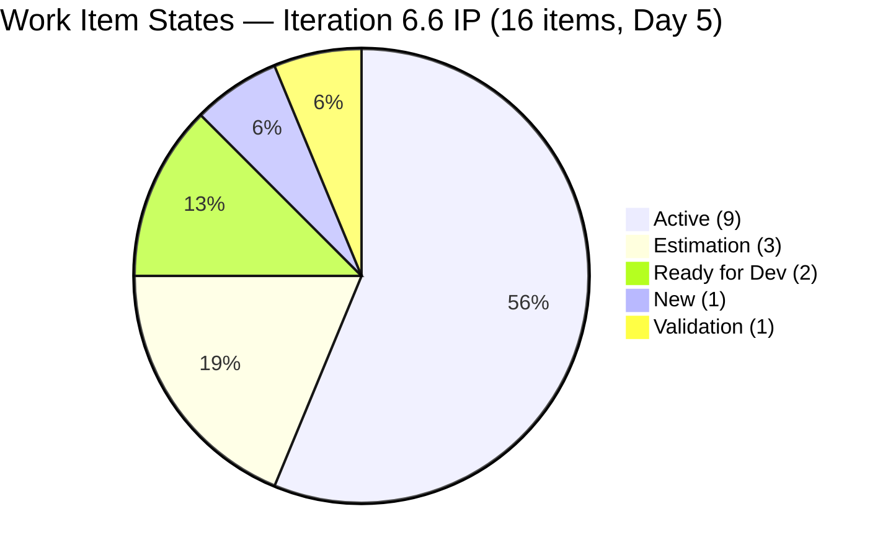
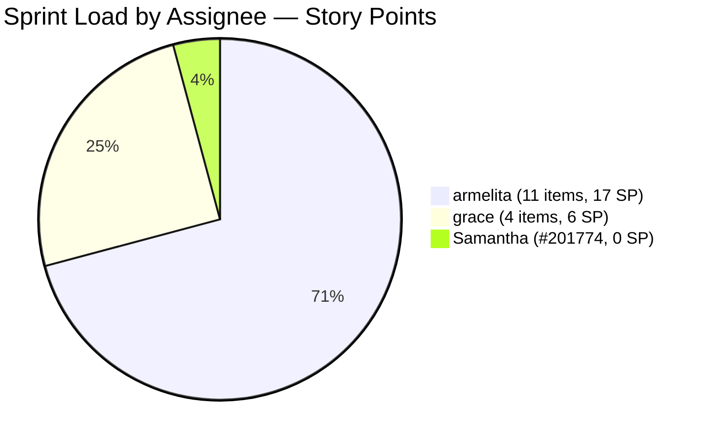
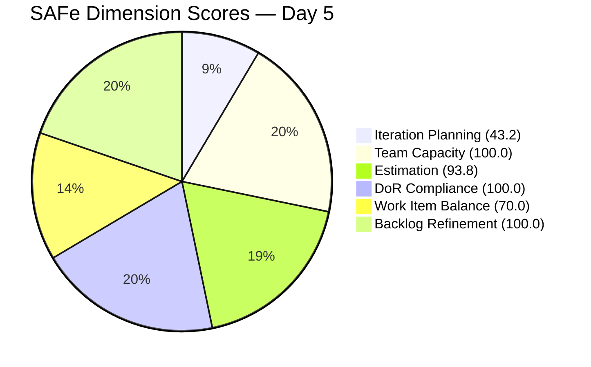
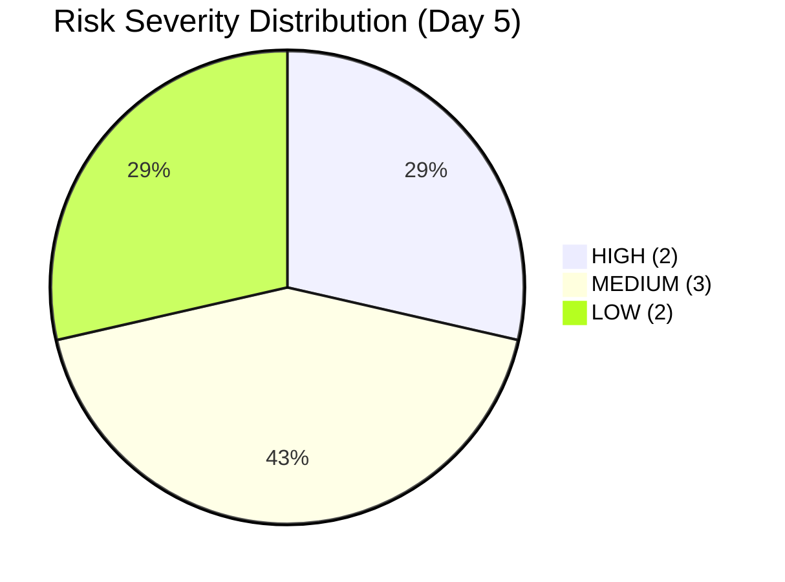

# SAFe Audit Report — JIT Operation Team | Iteration 6.6 (IP) Day 5

## 1. Audit Metadata

| Field | Value |
|---|---|
| **Project** | Jairosoft Portfolio |
| **Team** | JIT Operation Team |
| **Workspace Folder** | `ado_jit` |
| **Current Iteration** | Iteration 6.6 (IP) |
| **Iteration Path** | `Jairosoft Portfolio\2026-PI6\Iteration 6.6 (IP)` |
| **Iteration Start** | March 23, 2026 |
| **Iteration Finish** | April 5, 2026 |
| **Iteration Day** | Day 5 of 14 (36% elapsed) |
| **Audit Date** | March 27, 2026 |
| **Auditor** | Claude (AI EngProd Consultant) |
| **Framework** | SAFe 6.0 |
| **Scoring Rubric** | ADO SAFe v1 (six-dimension deterministic) |
| **Previous Audit** | AUDIT_20260326_1630.md (Day 4, Score: 85.3/100) |
| **Overall Score** | **84.5 / 100** |
| **Risk Band** | **Low Risk** |
| **Board URL** | [ADO Board](https://dev.azure.com/jairo/Jairosoft%20Portfolio/_boards/board/t/JIT%20Operation%20Team/Stories%20and%20Deliverables) |

---

## 2. Executive Summary

This is the **Day 5 audit of Iteration 6.6 (IP)**. The JIT Operation Team remains in the **Low Risk** band, though the overall score declined slightly from 85.3 to 84.5 (−0.8). The score movement is driven by a single new finding: **#201774 (a Spike assigned to Samantha Babael) appeared in the current iteration today but is unestimated**, dropping Estimation from 100.0 to 93.8.

**Key changes since Day 4 (Mar 26):**

- **#201774 (Spike — Samantha Babael) is now in the current iteration** in Validation state, last changed March 27 — Samantha now has assigned work, resolving the Day 4 concern about her zero-item status
- **#201774 is unestimated (0 SP)** — this is the only estimation gap in the iteration and the top action item
- **Visible backlog grew from 36 to 37 items** — #201774 re-entered or was added to the backlog
- **Backlog Refinement remains 100.0** — all 37 items changed within the last 45 days; zero stale items
- **Teofilo Limpag still has zero assigned items** through Day 5 (36% of iteration elapsed) — highest operational risk remains unresolved
- **15 User Stories remain in the iteration alongside the 1 Spike** — type diversity improved slightly but dominant-type penalty still applies

**Overall Score: 84.5/100 (Low Risk)** — slight regression from Day 4's peak of 85.3; path back to 85.3+ requires estimating #201774.

---

## 3. Previous Audit Delta

| Metric | Prior Audit (Mar 26, 16:30 UTC) | This Audit (Mar 27) | Delta |
|---|---|---|---|
| **Overall Score** | 85.3/100 | **84.5/100** | **−0.8** |
| **Risk Band** | Low Risk | Low Risk | Stable |
| **Iteration Items** | 15 | **16** | **+1** (#201774 Spike added) |
| **Estimation** | 100.0 (15/15) | **93.8 (15/16)** | **−6.2** (#201774 unestimated) |
| **Iteration Planning** | 41.7 (15/36) | **43.2 (16/37)** | **+1.5** |
| **DoR Compliance** | 100.0 | **100.0** | Stable |
| **Team Capacity** | 100.0 | **100.0** | Stable |
| **Work Item Balance** | 70.0 | **70.0** | Stable |
| **Backlog Refinement** | 100.0 | **100.0** | Stable |
| **Samantha items** | 0 | **1** (#201774 Spike, Validation) | Resolved |
| **Teofilo items** | 0 | **0** | Unresolved — Day 5 |
| **Visible Backlog** | 36 items | **37 items** | +1 (#201774) |
| **Total SP** | 23 SP | **27 SP** | +4 (if #201774 estimated at ~4 SP) |

---

## 4. Current Iteration Snapshot

### Sprint Scope

| Metric | Value |
|---|---|
| **Items in iteration** | 16 |
| **User Stories** | 15 |
| **Spikes** | 1 (#201774) |
| **Total Story Points (estimated)** | 27 SP |
| **Unestimated items** | 1 (#201774 — Spike) |
| **Items by state** | Active: 9, Estimation: 3, Ready for Dev: 2, New: 1, Validation: 1 |
| **Iteration type** | IP (Innovation & Planning) |
| **Iteration elapsed** | 36% (Day 5 of 14) |

### State Distribution

| State | Count | Items |
|---|---|---|
| **Active** | 9 | #200264, #200566, #200589, #200607, #201429, #201433, #201442, #201493, #201504 |
| **Estimation** | 3 | #200593, #200597, #200611 |
| **Ready for Dev** | 2 | #200604, #201514 |
| **New** | 1 | #201522 |
| **Validation** | 1 | #201774 (Samantha — Spike, unestimated) |

### Team Capacity

| Member | Capacity/Day | Activity | Items in 6.6 | SP | % Load |
|---|---|---|---|---|---|
| **armelita** | 6 hrs | Documentation | 11 | 17 SP | 63% |
| **grace** | 2 hrs | Documentation | 4 | 6 SP | 22% |
| **Samantha Babael** | 1 hr | Documentation | 1 | 0 SP (unestimated) | — |
| **Teofilo Limpag** | 6 hrs | Training | 0 | 0 SP | 0% |
| **TOTAL** | **15 hrs/day** | — | **16** | **27 SP** | — |

> Teofilo (6 hrs/day, 40% of total capacity) has zero assigned items on Day 5. This is now 5 consecutive audit days without work assignment.

---

## 5. Work Item Analysis

### Full Inventory — Iteration 6.6 (16 Items)

| ID | Type | Title (abbreviated) | State | Assigned | SP | Changed |
|---|---|---|---|---|---|---|
| #200264 | User Story | St. Mary Bansalan Interns Final Demo | Active | armelita | 2 | Mar 25 |
| #200566 | User Story | TESDA Compliance — Additional Trainer | Active | armelita | 1 | Mar 26 |
| #200589 | User Story | CSS NC II Batch 2 Enrollment Report | Active | armelita | 1 | Mar 26 |
| #200593 | User Story | AC Resubmission Result | Estimation | armelita | 1 | Mar 24 |
| #200597 | User Story | CSS NC II AC Registration Fee | Estimation | armelita | 2 | Mar 24 |
| #200604 | User Story | Python Inquiries | Ready for Dev | armelita | 2 | Mar 26 |
| #200607 | User Story | Bubble MCC Marketing Activities | Active | armelita | 2 | Mar 24 |
| #200611 | User Story | [Onboarding] UM Matina Interns | Estimation | armelita | 1 | Mar 24 |
| #201429 | User Story | TESDA Action Catalog | Active | armelita | 2 | Mar 24 |
| #201433 | User Story | T2 MIS Employment Report | Active | armelita | 2 | Mar 24 |
| #201442 | User Story | Market CSS NC II April 2026 Class | Active | armelita | 3 | Mar 25 |
| #201493 | User Story | TESDA SM Microcredential Submission | Active | grace | 2 | Mar 24 |
| #201504 | User Story | School Engagement & Flyering | Active | grace | 2 | Mar 24 |
| #201514 | User Story | "Free Discovery Day" Event | Ready for Dev | grace | 2 | Mar 26 |
| #201522 | User Story | Lead Tracking & Follow-up | New | grace | 2 | Mar 26 |
| **#201774** | **Spike** | **Prepare Certificate for Interns** | **Validation** | **Samantha Babael** | **0 (unestimated)** | **Mar 27** |

### Notable Changes from Prior Audit (Day 4)

| Change | Detail |
|---|---|
| **#201774 re-entered iteration** | Spike for Samantha (Prepare Certificate for Interns) is now in Validation state in 6.6 (IP) — it was previously removed from the iteration path but has returned or was re-assigned |
| **#201774 is unestimated** | No Story Points assigned; this is the only estimation gap in the iteration |
| **Samantha now has 1 item** | Resolves Day 4's R3 risk; Samantha is now engaged with a Validation-state Spike |
| **#201514 promoted** | Moved from Active to Ready for Dev (previously was Active on Mar 26) |

### Carryover Items from Iteration 6.5

| ID | Title | State | SP | Note |
|---|---|---|---|---|
| #200593 | AC Resubmission Result | Estimation | 1 | 3rd iteration; Day 5 — deadline for state advancement |
| #200597 | CSS NC II AC Registration Fee | Estimation | 2 | 3rd iteration; Day 5 — deadline for state advancement |
| #200607 | Bubble MCC Marketing Activities | Active | 2 | In progress |

---

## 6. SAFe Compliance Scorecard

| # | Dimension | Score | Evidence | Notes |
|---|---|---|---|---|
| 1 | **Iteration Planning** | **43.2** | 16 of 37 visible backlog items in current iteration | Improved slightly from Day 4 (41.7); IP structural constraint applies |
| 2 | **Team Capacity** | **100.0** | 3/3 contributors with work have capacity configured | armelita 6h, grace 2h, Samantha 1h; Teofilo unassigned but has capacity |
| 3 | **Estimation** | **93.8** | 15/16 point-eligible items estimated | −6.2 from Day 4; #201774 (Spike) has no Story Points |
| 4 | **DoR Compliance** | **100.0** | 16/16 items have Description ≥ 30 chars and AC ≥ 20 chars | #201774 passes DoR (desc: 599 chars, AC: 630 chars) |
| 5 | **Work Item Balance** | **70.0** | 15 User Stories (93.8%), 1 Spike (6.2%) | −30 penalty: dominant type > 60%; Spike adds minor diversity vs Day 4 |
| 6 | **Backlog Refinement** | **100.0** | 37/37 items fresh (changed ≥ Feb 10, 2026); 0 stale; 0 untouched | Perfect score maintained; #201774 changed today |
| | **Overall** | **84.5** | Average of 6 dimensions | **Low Risk** (≥ 80) |

### Score Computation Detail

| Dimension | Formula | Calculation | Result |
|---|---|---|---|
| Iteration Planning | current / visible × 100 | 16 / 37 × 100 | 43.2 |
| Team Capacity | cap_with_work / work_assignees × 100 | 3 / 3 × 100 | 100.0 |
| Estimation | estimated / point_eligible × 100 | 15 / 16 × 100 | 93.8 |
| DoR Compliance | dor_compliant / current × 100 | 16 / 16 × 100 | 100.0 |
| Work Item Balance | 100 − penalties | 100 − 30 (dominant > 60%) | 70.0 |
| Backlog Refinement | base − penalties | 100.0 − 0 | 100.0 |
| **Overall** | average(all 6) | (43.2+100+93.8+100+70+100)/6 | **84.5** |

---

## 7. Dimension Findings

### 7.1 Iteration Planning (43.2/100)

16 of 37 visible backlog items are assigned to the current iteration. This improves slightly from 41.7 on Day 4 (15/36), driven by the addition of #201774 to both the iteration and visible backlog. The score remains structurally constrained by the IP iteration model.

**Improvement vs prior:** +1.5 (from 41.7 to 43.2).

### 7.2 Team Capacity (100.0/100)

Three team members now have assigned work in the iteration: armelita (11 items, 17 SP), grace (4 items, 6 SP), and Samantha (1 Spike, unestimated). All three have capacity configured in ADO. The formula returns 100.0. Teofilo Limpag (6 hrs/day) continues with zero assigned work — Day 5 is the fifth consecutive day he has had capacity configured but no items.

**Operational concern:** Teofilo represents 40% of the team's daily capacity (6 of 15 hrs/day). With 9 working days remaining in the iteration, each unassigned day represents approximately 6 hrs of lost capacity.

### 7.3 Estimation (93.8/100)

15 of 16 items are estimated. The single gap is **#201774** (Spike — Prepare Certificate for Interns, Samantha Babael). The item is in Validation state with strong DoR documentation (599-char description, 630-char AC) but has no Story Points assigned. Estimating it at even 1 SP would restore Estimation to 100.0.

**Regression from Day 4:** −6.2 (from 100.0 to 93.8). This is the sole cause of the overall score decline.

### 7.4 DoR Compliance (100.0/100)

All 16 items pass the Definition of Ready threshold. Notably, #201774 — despite being unestimated — has very thorough description and acceptance criteria documentation, indicating the work was well-articulated before or during execution. This is the fifth consecutive audit at 100.0 DoR.

### 7.5 Work Item Balance (70.0/100)

The iteration now contains 15 User Stories and 1 Spike. The dominant type (User Story) accounts for 93.8% of items, well above the 60% threshold. The −30 penalty applies. The addition of the Spike for Samantha brings minor type diversity but does not change the penalty outcome. A Training or Enabler item assigned to Teofilo would not reduce this penalty further (User Story dominance would persist) — but would begin to address capacity utilization.

### 7.6 Backlog Refinement (100.0/100)

All 37 visible backlog items have been updated within the last 45 days. #201774 was changed today (March 27), contributing to the freshness count. Zero items cross the stale_90 or stale_180 thresholds. Zero current-iteration items are untouched since the iteration started. Perfect score maintained for the second consecutive day.

---

## 8. Risks and Bottlenecks

| # | Risk | Severity | Evidence | Recommended Action |
|---|---|---|---|---|
| R1 | **Teofilo has zero work items — Day 5** | HIGH | 6 hrs/day (40% of team capacity) unassigned through 36% of iteration; 5th consecutive audit day | Assign Training items by end of Day 5; consider splitting armelita's Estimation items |
| R2 | **#201774 Spike is unestimated** | HIGH | Samantha's Spike is in Validation state but has 0 SP; blocks Estimation returning to 100.0 | Estimate #201774 immediately (1–3 SP range is typical for IP ceremony spikes) |
| R3 | **Armelita carries 63% of sprint load** | MEDIUM | 11 items (17 SP) solely on armelita; no redistribution since Day 1 | Redistribute 2–3 Estimation items to Teofilo as Training/Enabler items for PI planning activities |
| R4 | **3 Estimation items not yet Active — Day 5** | MEDIUM | #200593, #200597, #200611 still in Estimation state; carryovers from prior iterations | Must be promoted to Active by end of Day 5 to maintain sprint momentum |
| R5 | **#201522 still in New state** | LOW | Lead Tracking & Follow-up; estimated at 2 SP but not started; grace has available capacity | Assign and activate by Day 6 |
| R6 | **2 carryover items (#200593, #200597) in Estimation** | MEDIUM | Both have been carried across 3 iterations without resolution; now on Day 5 | Set a Day 5 resolution deadline; if not ready for Active, consider moving to PI7 |
| R7 | **#201774 origin unclear** | LOW | This Spike was removed from the iteration on Mar 26 (Day 4) but has returned today; the prior audit noted #201377 was removed; #201774 appears to be a different or renamed item | Verify closure lineage: is #201774 the same work as #201377? If different, confirm scope intent |

---

## 9. Prioritized Recommendations

| Priority | Action | Owner | Impact | Target |
|---|---|---|---|---|
| **P1** | **Estimate #201774 immediately** — The Spike is in Validation state and fully documented. Adding Story Points (suggest 2–4 SP for a certificate preparation task at IP ceremony level) restores Estimation to 100.0 and recovers the 0.8-point overall regression. This is a 2-minute ADO update. | Armelita (PO) / Samantha | Restores D3 from 93.8 → 100.0; overall score returns to 85.3+ | Today |
| **P2** | **Assign work to Teofilo — Day 5 is the deadline** — With 9 days remaining in the iteration, Day 5 is the last reasonable day to assign work without impacting sprint delivery. Teofilo's configured activity is Training. For an IP iteration, appropriate items include: (a) reviewing PI7 training plans, (b) preparing TESDA-aligned training materials, or (c) a formal Training work item type. Even 1–2 items would address R1 and R3 simultaneously. | Armelita (PO) | Reduces R1 and R3; adds Training type (may improve Work Item Balance); addresses 5-day capacity loss | Today (Day 5) — critical deadline |
| **P3** | **Promote #200593 and #200597 to Active** — Both carryover Estimation items are from Iteration 6.5. Day 5 is the absolute latest these can remain in pre-planning. An IP iteration should be resolving carryovers, not re-carrying them. If they are not actionable in 6.6, move them to PI7. | armelita | Reduces R4 and R6; improves sprint throughput | Today |
| **P4** | **Activate #201522 (Lead Tracking)** — grace has 2 hrs/day available capacity and currently holds 4 items. #201522 is estimated (2 SP) and ready; it just needs promotion from New to Active. | grace / Armelita | Reduces R5; fully utilizes grace's available bandwidth | Day 5–6 |
| **P5** | **Confirm #201774 lineage** — Verify whether #201774 is related to or replaces #201377. If they represent the same work, ensure the earlier item is Closed rather than floating. | Armelita | Reduces R7; ensures clean backlog | Today |

---

## 10. Evidence Gaps and Limitations

| # | Gap | Impact | Mitigation |
|---|---|---|---|
| G1 | **#201774 origin and relationship to #201377 unclear** | The prior audit noted #201377 (Samantha's Spike) was removed from the iteration on Mar 26. Today, #201774 appears as a different Spike for Samantha. Whether these are related items, a rename, or a separate creation is not determinable from ADO data alone | Recommend Armelita confirm in ADO comments or work item history |
| G2 | **IP iteration planning score is structurally low** | 43.2 does not indicate planning failure; IP iterations carry lighter loads by design | Documented in dimension findings; score is expected |
| G3 | **Teofilo's zero-item pattern** | 5 days in, Teofilo has no work items. This is an operational gap that ADO data cannot explain (no capacity notes, no assignment history) | Flagged as R1/P2; Armelita action required |
| G4 | **Work Item Balance ceiling at 70.0** | All-User-Story iteration is structurally penalized; adding Training items for Teofilo would add type diversity | Noted; Training item assignment is P2 |
| G5 | **State of #201514** | Previous audit had #201514 as Active; today it appears in Ready for Dev state — a regression in state. Ready for Dev can be a valid step before Active completion, but the direction (Active → Ready for Dev) may indicate scope change | Verify with grace whether this is intentional |

---

*Report generated: March 27, 2026 | SAFe 6.0 Framework | ADO SAFe v1 Rubric*
*Jairosoft Portfolio — JIT Operation Team | Iteration 6.6 (IP): Mar 23 – Apr 5, 2026*
*Overall Score: 84.5/100 (Low Risk) | Day 5 of 14 (36% elapsed)*
*Previous: AUDIT_20260326_1630.md (Day 4, 85.3/100) | −0.8 regression*
