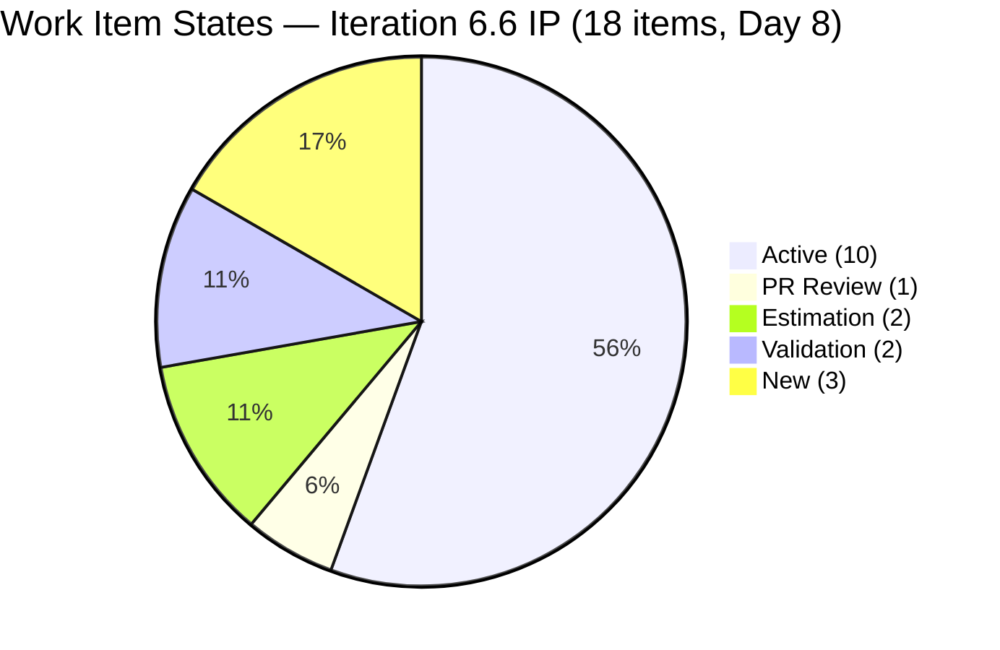
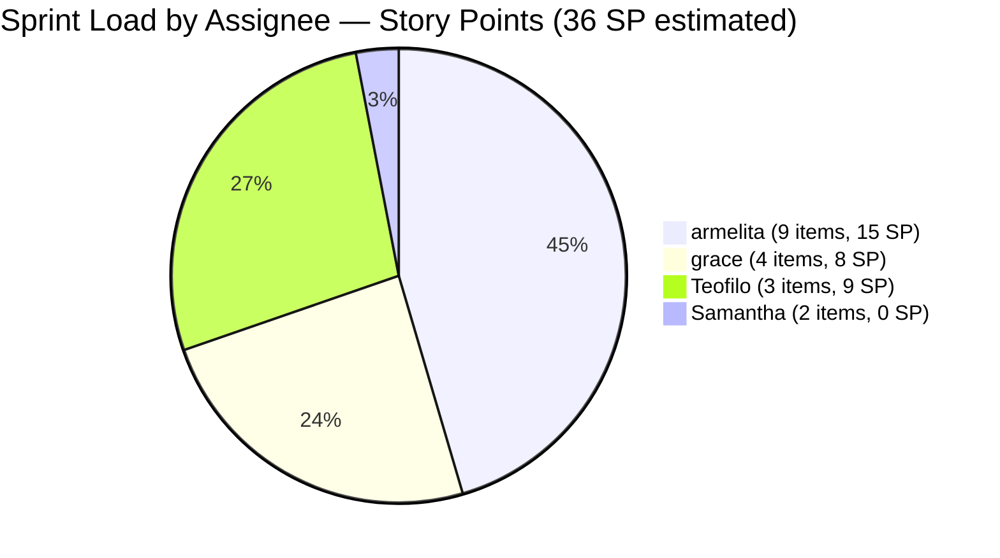
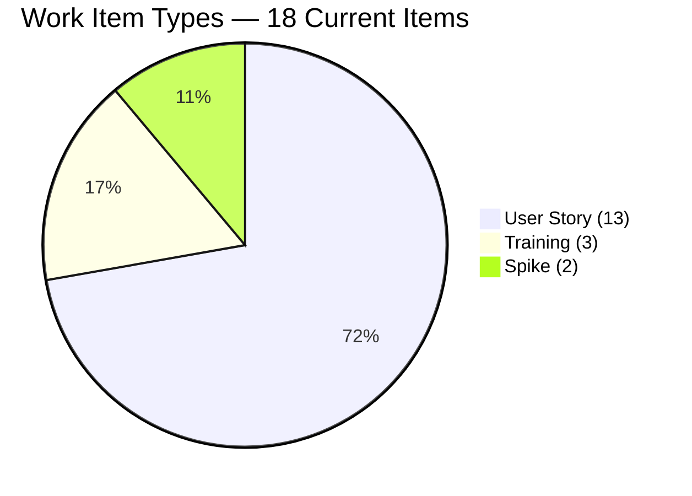
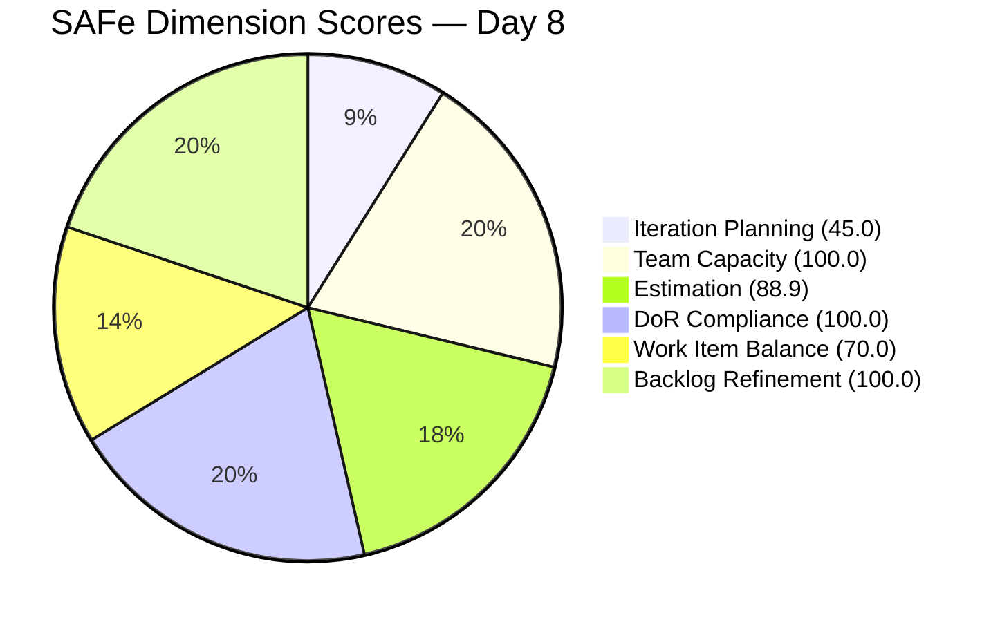
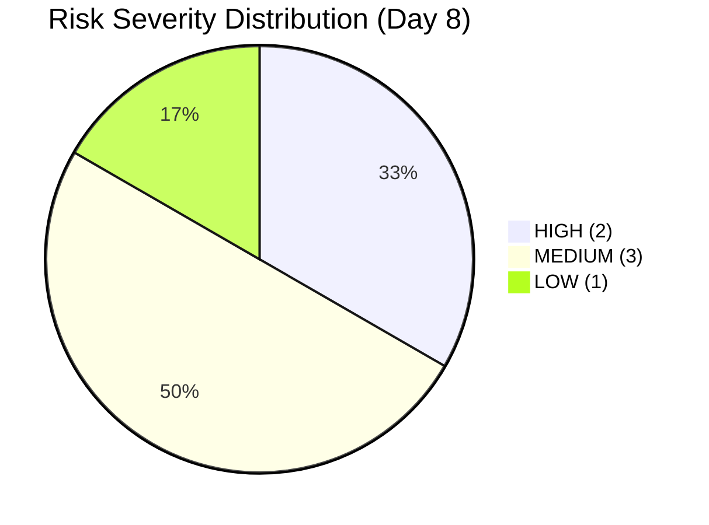

# SAFe Audit Report — JIT Operation Team | Iteration 6.6 (IP) Day 8

## 1. Audit Metadata

| Field | Value |
|---|---|
| **Project** | Jairosoft Portfolio |
| **Project ID** | `666bb99a-6acd-4999-bb34-efd0e4ea90dc` |
| **Team** | JIT Operation Team |
| **Team ID** | `b25e3129-6272-4e54-a3ff-f1ef3c8eeb2c` |
| **Workspace Folder** | `ado_jit` |
| **Current Iteration** | Iteration 6.6 (IP) |
| **Iteration Path** | `Jairosoft Portfolio\2026-PI6\Iteration 6.6 (IP)` |
| **Iteration ID** | `1df8c8f8-f0ed-4ee1-9244-cdd5c88b3c4a` |
| **Iteration Start** | March 23, 2026 |
| **Iteration Finish** | April 5, 2026 |
| **Iteration Day** | Day 8 of 14 (57% elapsed) |
| **Audit Date** | March 30, 2026 — 09:00 UTC |
| **Auditor** | AI EngProd Consultant |
| **Framework** | SAFe 6.0 |
| **Scoring Rubric** | ADO SAFe v1 (six-dimension deterministic) |
| **Previous Audit** | AUDIT_20260327_0701.md (Day 5, Score: 84.5/100) |
| **Overall Score** | **84.0 / 100** |
| **Risk Band** | **Low Risk** |
| **Board URL** | [ADO Board](https://dev.azure.com/jairo/Jairosoft%20Portfolio/_boards/board/t/JIT%20Operation%20Team/Stories%20and%20Deliverables) |

---

## 2. Executive Summary

This is the **Day 8 audit of Iteration 6.6 (IP)**. The JIT Operation Team remains in the **Low Risk** band. The overall score declined slightly from 84.5 to **84.0 (-0.5)**, driven by the addition of a second unestimated Spike (#201899) which further reduces the Estimation dimension.

**Significant positive developments since Day 5:**

- **Teofilo Limpag now has 3 assigned items** (#201857, #201864, #201865 — all Training type, 3 SP each, 9 SP total). This resolves the highest-severity risk from the Day 5 audit (R1: Teofilo zero-work for 5 consecutive days). He now carries 9 SP / 3 items.
- **Work Item type diversity improved** — the iteration now contains 13 User Stories, 2 Spikes, and 3 Training items (three distinct types vs. two on Day 5).
- **#201522 (Lead Tracking) advanced from New to Active** — resolves Day 5's R5 risk.
- **#200611 (UM Matina Interns) advanced from Estimation to Active** — positive state progression.
- **#201493 (TESDA SM Microcredential) advanced to PR Review** — first item nearing completion.
- **#200604 (Python Inquiries) moved out of Iteration 6.6 to PI7\7.1** — scope reduction.
- **#200264 (St. Mary Bansalan) no longer on backlog** — likely closed.
- **#201899 (Spike — Prepare UIC Interns Certificates) added** for Samantha, unestimated.

**The iteration expanded from 16 to 18 items and from 27 SP to 36 SP estimated (plus 2 unestimated Spikes).** Visible backlog grew from 37 to 40 items.

**Overall Score: 84.0/100 (Low Risk)** — slight regression from Day 5's 84.5 due to second unestimated Spike; Teofilo's activation and state progressions are strongly positive.

---

## 3. Previous Audit Delta

| Metric | Prior Audit (Mar 27, Day 5) | This Audit (Mar 30, Day 8) | Delta |
|---|---|---|---|
| **Overall Score** | 84.5/100 | **84.0/100** | **-0.5** |
| **Risk Band** | Low Risk | Low Risk | Stable |
| **Iteration Items** | 16 | **18** | **+2 net** (+5 added, -2 removed, -1 closed) |
| **Visible Backlog** | 37 | **40** | **+3** |
| **Iteration Planning** | 43.2 (16/37) | **45.0 (18/40)** | **+1.8** |
| **Team Capacity** | 100.0 (3/3) | **100.0 (4/4)** | Stable (Teofilo now counted) |
| **Estimation** | 93.8 (15/16) | **88.9 (16/18)** | **-4.9** (2 unestimated Spikes now) |
| **DoR Compliance** | 100.0 (16/16) | **100.0 (18/18)** | Stable |
| **Work Item Balance** | 70.0 | **70.0** | Stable (dominant type still > 60%) |
| **Backlog Refinement** | 100.0 | **100.0** | Stable |
| **Teofilo items** | 0 | **3** (Training) | **Resolved** |
| **Samantha items** | 1 | **2** (2 Spikes) | +1 (#201899) |
| **Total SP (estimated)** | 27 | **36** | **+9 SP** |

---

## 4. Current Iteration Snapshot

### Sprint Scope

| Metric | Value |
|---|---|
| **Items in iteration** | 18 |
| **User Stories** | 13 |
| **Spikes** | 2 (#201774, #201899) |
| **Training** | 3 (#201857, #201864, #201865) |
| **Total Story Points (estimated)** | 36 SP |
| **Unestimated items** | 2 (#201774, #201899 — both Spikes, 0 SP) |
| **Iteration type** | IP (Innovation & Planning) |
| **Iteration elapsed** | 57% (Day 8 of 14) |

### State Distribution

| State | Count | Items |
|---|---|---|
| **Active** | 9 | #200566, #200589, #200607, #201429, #201433, #201442, #201504, #201514, #201522 |
| **Active (Training)** | 1 | #201864 |
| **PR Review** | 1 | #201493 |
| **Estimation** | 2 | #200593, #200597 |
| **Validation** | 2 | #201774, #201899 |
| **New** | 2 | #201857, #201865 |
| **Active (Onboarding)** | 1 | #200611 |

### Team Capacity

| Member | Capacity/Day | Activity | Items in 6.6 | SP | % Load |
|---|---|---|---|---|---|
| **armelita** | 6 hrs | Documentation | 9 | 15 SP | 41.7% |
| **grace** | 2 hrs | Documentation | 4 | 8 SP | 22.2% |
| **Samantha Babael** | 1 hr | Documentation | 2 | 0 SP (unestimated) | 11.1% |
| **Teofilo Limpag** | 6 hrs | Training | 3 | 9 SP | 25.0% |
| **TOTAL** | **15 hrs/day** | — | **18** | **36 SP** | — |

> Teofilo now carries 3 Training items (9 SP) — resolved from 0 items on Day 5. His 40% capacity share now has commensurate work.

---

## 5. Work Item Analysis

### Full Inventory — Iteration 6.6 (18 Items)

| ID | Type | Title (abbreviated) | State | Assigned | SP | Changed |
|---|---|---|---|---|---|---|
| #200566 | User Story | TESDA Compliance — Additional Trainer | Active | armelita | 1 | Mar 26 |
| #200589 | User Story | CSS NC II Batch 2 Enrollment Report | Active | armelita | 1 | Mar 26 |
| #200593 | User Story | AC Resubmission Result | Estimation | armelita | 1 | Mar 24 |
| #200597 | User Story | CSS NC II AC Registration Fee | Estimation | armelita | 2 | Mar 24 |
| #200607 | User Story | Bubble MCC Marketing Activities | Active | armelita | 2 | Mar 24 |
| #200611 | User Story | [Onboarding] UM Matina Interns | Active | armelita | 1 | Mar 29 |
| #201429 | User Story | TESDA Action Catalog | Active | armelita | 2 | Mar 24 |
| #201433 | User Story | T2 MIS Employment Report | Active | armelita | 2 | Mar 24 |
| #201442 | User Story | Market CSS NC II April 2026 Class | Active | armelita | 3 | Mar 25 |
| #201493 | User Story | TESDA SM Microcredential Submission | **PR Review** | grace | 2 | **Mar 30** |
| #201504 | User Story | School Engagement & Flyering | Active | grace | 2 | Mar 24 |
| #201514 | User Story | "Free Discovery Day" Event | Active | grace | 2 | Mar 26 |
| #201522 | User Story | Lead Tracking & Follow-up | Active | grace | 2 | Mar 29 |
| #201774 | Spike | Social Media Post for St. Mary's Interns | Validation | Samantha | **0** | Mar 27 |
| #201899 | Spike | Prepare UIC Interns Certificates | Validation | Samantha | **0** | **Mar 30** |
| #201857 | Training | 2.1-1 Network Design Discussion | New | Teofilo | 3 | **Mar 30** |
| #201864 | Training | 2.4-2 Computer Networks Safe Operation | **Active** | Teofilo | 3 | **Mar 30** |
| #201865 | Training | 2.4-3 Prepare/Complete Reports | New | Teofilo | 3 | **Mar 30** |

### Notable Changes from Prior Audit (Day 5)

| Change | Detail |
|---|---|
| **Teofilo assigned 3 Training items** | #201857, #201864, #201865 — all 3 SP each, created Mar 30. Resolves Day 5's R1 (zero-item risk). |
| **#201899 (Spike) added** | Second Spike for Samantha (Prepare UIC Interns Certificates), Validation state, unestimated. |
| **#201493 advanced to PR Review** | First item nearing completion this sprint. Changed today (Mar 30). |
| **#201522 activated** | Moved from New to Active (Mar 29). Resolves Day 5's R5. |
| **#200611 activated** | Moved from Estimation to Active (Mar 29). |
| **#201514 activated** | Moved from Ready for Dev to Active (Mar 26). |
| **#200604 moved to PI7** | Python Inquiries relocated from Iteration 6.6 to PI7\7.1 (scope reduction). |
| **#200264 removed** | St. Mary Bansalan Interns Final Demo no longer on backlog (likely closed). |
| **#200593, #200597 still in Estimation** | Carryover items remain in Estimation state — now Day 8, 3rd iteration. |

### Work Item Type Distribution

| Type | Count | Share | SP |
|---|---|---|---|
| User Story | 13 | 72.2% | 23 SP |
| Training | 3 | 16.7% | 9 SP |
| Spike | 2 | 11.1% | 0 SP |
| **Total** | **18** | **100%** | **36 SP** (estimated) |

### DoR Compliance Assessment

All 18 items pass DoR:

- All descriptions exceed 30 non-whitespace characters (minimum: 92 chars for #201433)
- All acceptance criteria exceed 20 non-whitespace characters (minimum: 41 chars for #200589)
- New Training items (#201857, #201864, #201865) all have extensive documentation (300+ char descriptions, 500+ char AC)
- New Spike #201899 passes with 281-char description and 327-char AC

### Freshness Assessment

| Metric | Value | Status |
|---|---|---|
| Fresh (< 45 days, after Feb 13) | 40/40 (100%) | Base = 100.0 |
| Stale-90 (before Dec 30, 2025) | 0 | No penalty |
| Stale-180 (before Oct 2, 2025) | 0 | No penalty |
| Untouched current items | 0/18 (0%) | No penalty |

---

## 6. SAFe Compliance Scorecard

| # | Dimension | Score | Evidence | Notes |
|---|---|---|---|---|
| 1 | **Iteration Planning** | **45.0** | 18 of 40 visible backlog items in current iteration | Improved from 43.2 (Day 5); IP structural constraint |
| 2 | **Team Capacity** | **100.0** | 4/4 contributors with work have capacity configured | All 4 team members now have assigned items |
| 3 | **Estimation** | **88.9** | 16/18 point-eligible items estimated | -4.9 from Day 5; #201774 and #201899 both unestimated |
| 4 | **DoR Compliance** | **100.0** | 18/18 items have Description >= 30 chars and AC >= 20 chars | All new items pass DoR |
| 5 | **Work Item Balance** | **70.0** | User Story 72.2% > 60% -> -30 | Type diversity improved (3 types) but dominant type still > 60% |
| 6 | **Backlog Refinement** | **100.0** | 40/40 fresh; 0 stale; 0/18 untouched | Perfect score maintained |
| | **Overall** | **84.0** | Average of 6 dimensions | **Low Risk** (>= 80) |

### Score Computation Detail

| Dimension | Formula | Calculation | Result |
|---|---|---|---|
| Iteration Planning | current / visible x 100 | 18 / 40 x 100 | 45.0 |
| Team Capacity | cap_with_work / work_assignees x 100 | 4 / 4 x 100 | 100.0 |
| Estimation | estimated / point_eligible x 100 | 16 / 18 x 100 | 88.9 |
| DoR Compliance | dor_compliant / current x 100 | 18 / 18 x 100 | 100.0 |
| Work Item Balance | 100 - penalties | 100 - 30 (dominant > 60%) | 70.0 |
| Backlog Refinement | base - penalties | 100.0 - 0 | 100.0 |
| **Overall** | average(all 6) | (45.0+100+88.9+100+70+100)/6 | **84.0** |

### Score History — Iteration 6.6 (IP)

| Audit | Date | Day | Score | Band | Key Change |
|---|---|---|---|---|---|
| Day 4 | Mar 26 (1630) | Day 4 | 85.3 | Low Risk | First audit this iteration |
| Day 5 | Mar 27 (0701) | Day 5 | 84.5 | Low Risk | #201774 Spike unestimated |
| **Day 8** | **Mar 30 (0900)** | **Day 8** | **84.0** | **Low Risk** | **Teofilo activated; 2nd unestimated Spike** |

---

## 7. Dimension Findings

### 7.1 Iteration Planning (45.0/100)

18 of 40 visible backlog items are in the current iteration. This improved from 43.2 on Day 5 (16/37). The backlog grew by 3 items (new Training items for Teofilo and Spike for Samantha) while the iteration gained 2 net items. The score remains structurally constrained by the IP iteration model, where a large portion of the backlog intentionally sits in future iterations or PI-level paths.

**Improvement path:** This dimension is structurally limited for IP iterations and does not indicate planning failure.

### 7.2 Team Capacity (100.0/100)

All four team members with assigned work now have capacity configured. The critical change is **Teofilo Limpag now has 3 items** (9 SP in Training). This means 4/4 contributors with work have capacity, up from 3/3 on Day 5. The formula denominator changed but the score remains 100.0.

**Key improvement:** Teofilo's activation resolves the highest-severity risk from the past 5 audit days.

### 7.3 Estimation (88.9/100)

16 of 18 items are estimated. The two gaps are both Spikes assigned to Samantha:

- **#201774** (Social Media Post for St. Mary's Interns) — 0 SP, Validation state, Day 8
- **#201899** (Prepare UIC Interns Certificates) — 0 SP, Validation state, added today

Both Spikes are in Validation state with thorough DoR documentation. Adding even 1 SP to each would restore Estimation to 100.0 and raise the overall score by 1.9 points to 85.9.

**Regression from Day 5:** -4.9 (93.8 to 88.9). The second unestimated Spike deepened this gap.

### 7.4 DoR Compliance (100.0/100)

All 18 items pass DoR. The new Training items (#201857, #201864, #201865) have extensive documentation with 300+ character descriptions and 500+ character acceptance criteria. #201899 also passes with 281-char description and 327-char AC. This is the third consecutive audit at 100.0 DoR.

### 7.5 Work Item Balance (70.0/100)

The iteration now contains three work item types: 13 User Stories (72.2%), 3 Training (16.7%), and 2 Spikes (11.1%). This is improved type diversity compared to Day 5 (15 User Stories + 1 Spike). However, the dominant type (User Story at 72.2%) still exceeds the 60% threshold, so the -30 penalty persists. The penalty would be removed only if User Stories dropped to 60% or below (would require 10 or fewer User Stories out of 18 total, or adding 4+ non-User-Story items).

### 7.6 Backlog Refinement (100.0/100)

All 40 visible backlog items have been updated within the last 45 days. Zero stale items at any threshold. Zero untouched current items (all 18 current items changed on or after March 23). Perfect score maintained for the third consecutive audit.

---

## 8. Risks and Bottlenecks

| # | Risk | Severity | Evidence | Recommended Action |
|---|---|---|---|---|
| R1 | **2 unestimated Spikes (#201774, #201899)** | HIGH | Both Samantha's Spikes have 0 SP; Estimation at 88.9 (was 100.0 on Day 4) | Estimate both immediately; even 1-2 SP each restores Estimation to 100.0 |
| R2 | **#200593, #200597 still in Estimation — 3rd iteration** | HIGH | Both carryover items have been in Estimation state since before Day 4. Now Day 8 of their 3rd iteration. | Promote to Active today or move to PI7. These cannot carry into a 4th iteration. |
| R3 | **Armelita carries 50% of items (9/18)** | MEDIUM | 9 items / 15 SP on armelita at 6 h/day. Teofilo's activation reduced this from 69% (Day 5) to 50% — improved but still concentrated. | Monitor; redistribution has begun via Teofilo's Training items. |
| R4 | **Samantha's Spikes both unestimated and in Validation** | MEDIUM | 2 items in Validation state with 0 SP. Both have strong DoR documentation but no SP. At 1 h/day capacity, Samantha's throughput is limited. | Estimate and close these Spikes; Validation state suggests they may be near completion. |
| R5 | **#201857, #201865 (Training) still in New state** | LOW | 2 of Teofilo's 3 items are New; only #201864 is Active. Created today so this is expected. | Monitor; activate by Day 9. |
| R6 | **No items closed yet in Iteration 6.6** | MEDIUM | Day 8 (57% elapsed) with 0 closures. #201493 in PR Review is closest. #200264 may have been closed/removed but is no longer in backlog. | Push #201493 through PR Review to Closed as first completion signal. |

---

## 9. Prioritized Recommendations

| Priority | Action | Owner | Impact | Target |
|---|---|---|---|---|
| **P1** | **Estimate #201774 and #201899 immediately** — Both Spikes are in Validation state with full DoR documentation. Adding 1-3 SP to each restores Estimation from 88.9 to 100.0 and raises overall from 84.0 to 85.9. This is a 2-minute ADO update per item. | Armelita (PO) | D3: 88.9 -> 100.0; Overall: 84.0 -> 85.9 | Today |
| **P2** | **Resolve #200593 and #200597 — 3rd iteration deadline** — Both have been in Estimation state across 3 iterations. Day 8 of Iteration 6.6 is the absolute last day these should remain in pre-planning. Promote to Active if actionable; move to PI7 backlog if not. | armelita | Reduces R2; clears chronic carryover pattern | Today |
| **P3** | **Close #201493 (TESDA SM Microcredential)** — This item advanced to PR Review today and is the closest to completion. Closing it would be the first Closed item in Iteration 6.6 and demonstrate sprint throughput. | grace | First closure signal; reduces R6 | Today-Day 9 |
| **P4** | **Activate #201857 and #201865 (Training)** — Teofilo's two New items should be promoted to Active. #201864 is already Active. All three were created today so New state is expected, but activation should follow promptly. | Teofilo / Armelita | Reduces R5; establishes Training delivery momentum | Day 9 |
| **P5** | **Confirm #200264 closure** — St. Mary Bansalan Interns Final Demo was in the Day 5 inventory but is no longer on the backlog. Confirm it was properly Closed (not just removed from the board). | Armelita | Clean backlog hygiene | Day 9 |

---

## 10. Evidence Gaps and Limitations

| # | Gap | Impact | Mitigation |
|---|---|---|---|
| G1 | **#200264 disposition unknown** | Item was in Day 5 inventory (Active, 2 SP) but no longer appears on the backlog. Cannot confirm if it was Closed, Removed, or moved. | Verify via work item history; if Closed, credit as sprint completion. |
| G2 | **IP iteration planning score structurally low** | 45.0 does not indicate planning failure; IP iterations carry lighter iteration loads by design. | Documented; score is expected for IP structure. |
| G3 | **Samantha's 1 h/day capacity vs. 2 items** | With only 1 h/day, carrying 2 unestimated Spikes in Validation raises questions about throughput capacity. | Spikes may be documentation-level tasks completable within 1 h/day. |
| G4 | **#200604 iteration reassignment** | Python Inquiries moved from Iteration 6.6 to PI7\7.1 on Mar 29. This is mid-sprint scope reduction without documented reason. | Verify this was an intentional planning decision, not scope escape. |
| G5 | **Work Item Balance ceiling at 70.0** | Dominant type (User Story 72.2%) exceeds 60%. Adding Training items for Teofilo improved diversity but not enough to remove penalty. | Would need 4+ additional non-User-Story items or removal of 3+ User Stories. |
| G6 | **No closed items at 57% elapsed** | Zero closures through Day 8 means all sprint throughput is backloaded. #201493 in PR Review is the nearest completion. | Monitor; burst delivery pattern may apply (similar to HR team). |

---

*Report generated: March 30, 2026 09:00 UTC | SAFe 6.0 Framework | ADO SAFe v1 Rubric*
*Jairosoft Portfolio — JIT Operation Team | Iteration 6.6 (IP): Mar 23 - Apr 5, 2026*
*Overall Score: 84.0/100 (Low Risk) | Day 8 of 14 (57% elapsed)*
*Previous: AUDIT_20260327_0701.md (Day 5, 84.5/100) | -0.5 regression*
*Key improvement: Teofilo activated with 3 Training items (9 SP); #201493 nearing completion*
