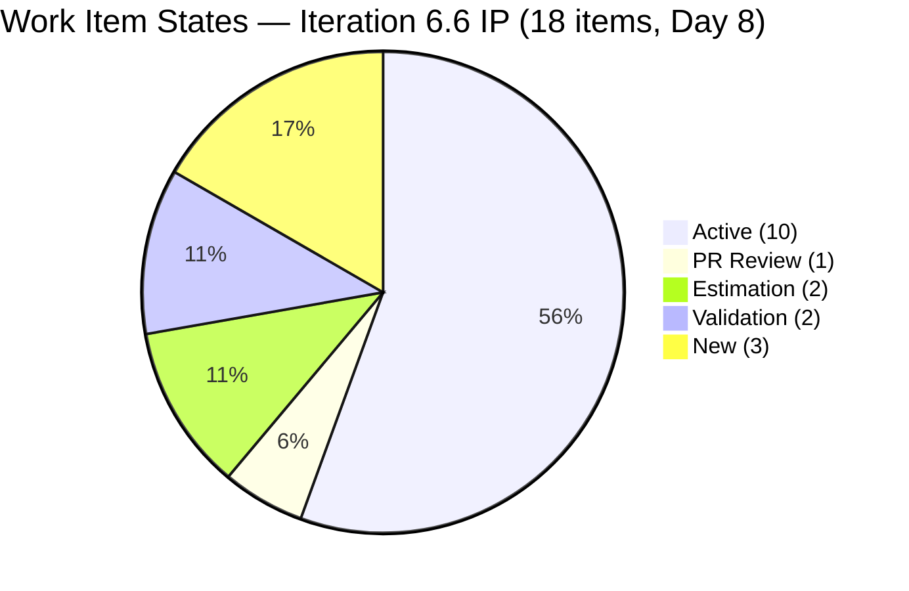
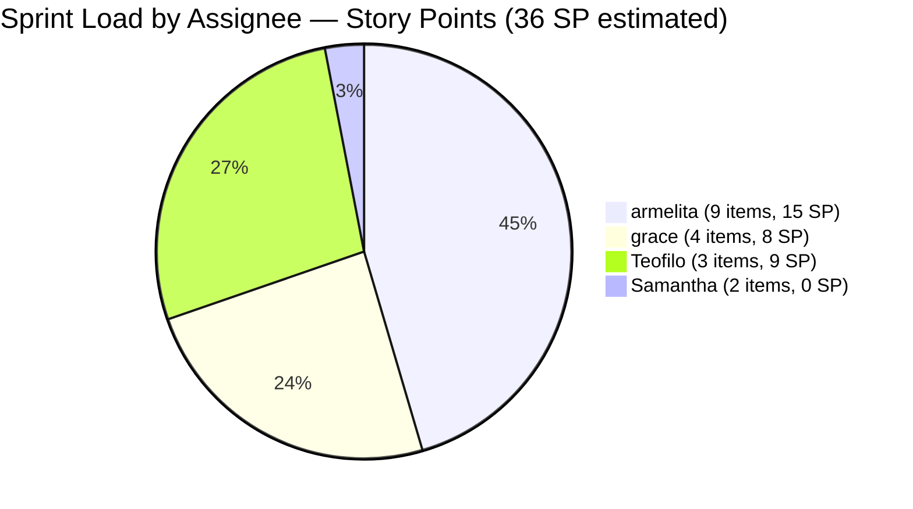
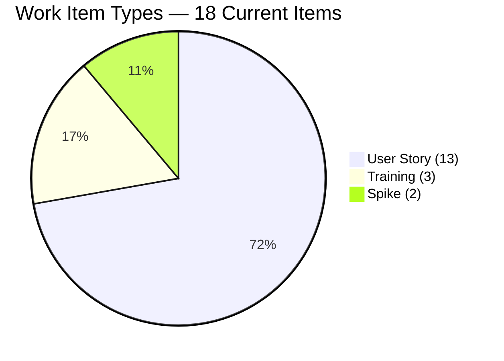
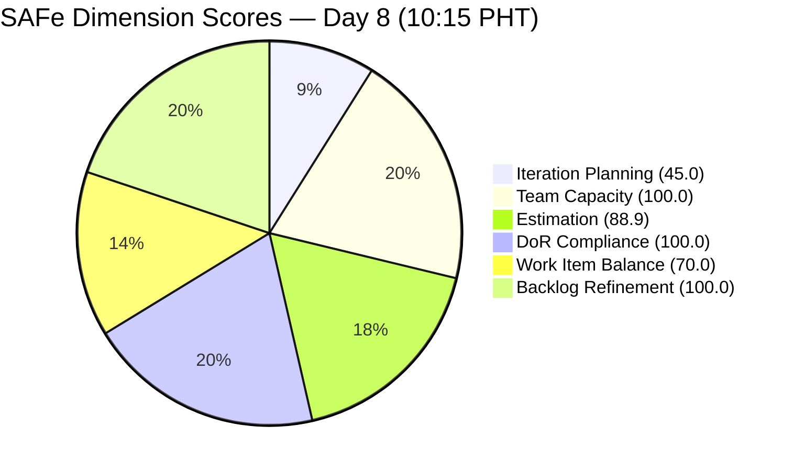
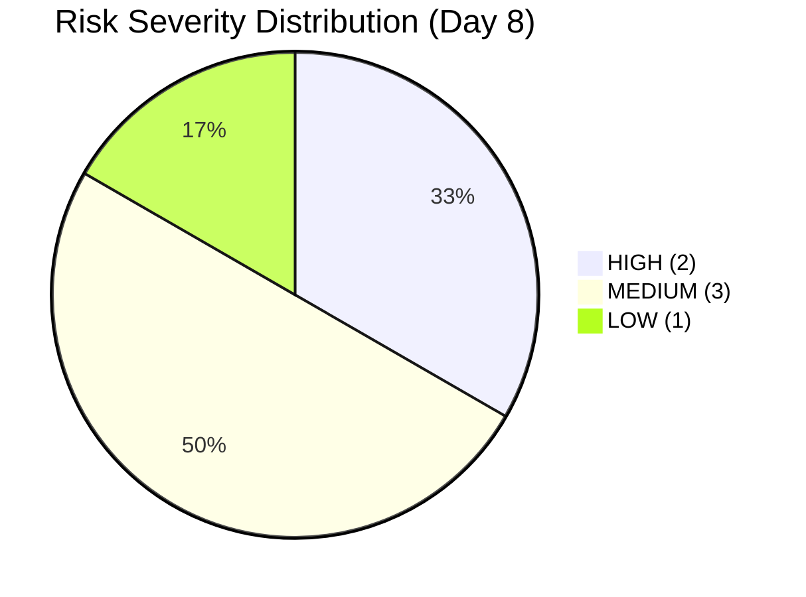

# SAFe Audit Report — JIT Operation Team | Iteration 6.6 (IP) Day 8

## 1. Audit Metadata

| Field | Value |
|---|---|
| **Project** | Jairosoft Portfolio |
| **Project ID** | `666bb99a-6acd-4999-bb34-efd0e4ea90dc` |
| **Team** | JIT Operation Team |
| **Team ID** | `b25e3129-6272-4e54-a3ff-f1ef3c8eeb2c` |
| **Workspace Folder** | `ado_jit` |
| **Current Iteration** | Iteration 6.6 (IP) |
| **Iteration Path** | `Jairosoft Portfolio\2026-PI6\Iteration 6.6 (IP)` |
| **Iteration ID** | `1df8c8f8-f0ed-4ee1-9244-cdd5c88b3c4a` |
| **Iteration Start** | March 23, 2026 |
| **Iteration Finish** | April 5, 2026 |
| **Iteration Day** | Day 8 of 14 (57% elapsed) |
| **Audit Date** | March 30, 2026 — 10:15 PHT |
| **Auditor** | AI EngProd Consultant |
| **Framework** | SAFe 6.0 |
| **Scoring Rubric** | ADO SAFe v1 (six-dimension deterministic) |
| **Previous Audit** | AUDIT_20260330_0900.md (Day 8, Score: 84.0/100) |
| **Overall Score** | **84.0 / 100** |
| **Risk Band** | **Low Risk** |
| **Board URL** | [ADO Board](https://dev.azure.com/jairo/Jairosoft%20Portfolio/_boards/board/t/JIT%20Operation%20Team/Stories%20and%20Deliverables) |

---

## 2. Executive Summary

This is the **fourth audit of Iteration 6.6 (IP)** and the second on Day 8. The JIT Operation Team remains at **84.0/100 (Low Risk)**, unchanged from the 09:00 audit earlier today.

**No material changes since the 09:00 audit.** The iteration scope, state distribution, and backlog composition are identical. Minor timestamp updates were observed on several items (#201493 updated at 10:14 UTC, #201899 at 08:55 UTC, Training items #201857/#201864/#201865 between 03:33-04:14 UTC), but no state transitions occurred.

**Key status:** The team is at 57% sprint elapsed with zero closures. #201493 (TESDA SM Microcredential) in PR Review remains the closest item to completion. The two unestimated Spikes (#201774, #201899) continue to suppress the Estimation dimension.

---

## 3. Previous Audit Delta

**Previous:** AUDIT_20260330_0900 — Iteration 6.6 (IP) Day 8, 09:00 UTC

| Metric | Prior (09:00) | **This Audit (10:15 PHT)** | Delta |
|---|---|---|---|
| **Overall Score** | 84.0 | **84.0** | No change |
| **Risk Band** | Low Risk | Low Risk | Stable |
| **Iteration Items** | 18 | **18** | 0 |
| **Visible Backlog** | 40 | **40** | 0 |
| **Items Active** | 10 | **10** | 0 |
| **Items PR Review** | 1 | **1** | 0 |
| **Items Estimation** | 2 | **2** | 0 |
| **Items Validation** | 2 | **2** | 0 |
| **Items New** | 3 | **3** | 0 |
| **Items Closed** | 0 | **0** | 0 |
| **Total SP** | 36 | **36** | 0 |
| **All 6 Dimensions** | Identical | **Identical** | 0 |

**Summary:** No board activity between the two Day 8 audits. All items, states, assignments, and story points remain identical.

---

## 4. Current Iteration Snapshot

### Sprint Scope

| Metric | Value |
|---|---|
| **Items in iteration** | 18 |
| **User Stories** | 13 |
| **Spikes** | 2 (#201774, #201899) |
| **Training** | 3 (#201857, #201864, #201865) |
| **Total Story Points (estimated)** | 36 SP |
| **Unestimated items** | 2 (#201774, #201899 — both Spikes, 0 SP) |
| **Iteration type** | IP (Innovation & Planning) |
| **Iteration elapsed** | 57% (Day 8 of 14) |

### State Distribution

| State | Count | Items |
|---|---|---|
| **Active** | 10 | #200566, #200589, #200607, #200611, #201429, #201433, #201442, #201504, #201514, #201522 |
| **Active (Training)** | 1 | #201864 |
| **PR Review** | 1 | #201493 |
| **Estimation** | 2 | #200593, #200597 |
| **Validation** | 2 | #201774, #201899 |
| **New** | 3 | #201857, #201865 (Training), plus included in Active count above for #200611 |

> Note: #200611 is Active (Onboarding state). Active total includes it. #201864 is Active (Training). The 10 Active count above includes both.

### Team Capacity

| Member | Capacity/Day | Activity | Items in 6.6 | SP | % Load |
|---|---|---|---|---|---|
| **armelita** | 6 hrs | Documentation | 9 | 15 SP | 41.7% |
| **grace** | 2 hrs | Documentation | 4 | 8 SP | 22.2% |
| **Samantha Babael** | 1 hr | Documentation | 2 | 0 SP (unestimated) | 11.1% |
| **Teofilo Limpag** | 6 hrs | Training | 3 | 9 SP | 25.0% |
| **TOTAL** | **15 hrs/day** | — | **18** | **36 SP** | — |

---

## 5. Work Item Analysis

### Full Inventory — Iteration 6.6 (18 Items)

| ID | Type | Title (abbreviated) | State | Assigned | SP | Changed |
|---|---|---|---|---|---|---|
| #200566 | User Story | TESDA Compliance — Additional Trainer | Active | armelita | 1 | Mar 26 |
| #200589 | User Story | CSS NC II Batch 2 Enrollment Report | Active | armelita | 1 | Mar 26 |
| #200593 | User Story | AC Resubmission Result | Estimation | armelita | 1 | Mar 24 |
| #200597 | User Story | CSS NC II AC Registration Fee | Estimation | armelita | 2 | Mar 24 |
| #200607 | User Story | Bubble MCC Marketing Activities | Active | armelita | 2 | Mar 24 |
| #200611 | User Story | [Onboarding] UM Matina Interns | Active | armelita | 1 | Mar 29 |
| #201429 | User Story | TESDA Action Catalog | Active | armelita | 2 | Mar 24 |
| #201433 | User Story | T2 MIS Employment Report | Active | armelita | 2 | Mar 24 |
| #201442 | User Story | Market CSS NC II April 2026 Class | Active | armelita | 3 | Mar 25 |
| #201493 | User Story | TESDA SM Microcredential Submission | **PR Review** | grace | 2 | **Mar 30** |
| #201504 | User Story | School Engagement & Flyering | Active | grace | 2 | Mar 24 |
| #201514 | User Story | "Free Discovery Day" Event | Active | grace | 2 | Mar 26 |
| #201522 | User Story | Lead Tracking & Follow-up | Active | grace | 2 | Mar 29 |
| #201774 | Spike | Social Media Post for St. Mary's Interns | Validation | Samantha | **0** | Mar 27 |
| #201899 | Spike | Prepare UIC Interns Certificates | Validation | Samantha | **0** | Mar 30 |
| #201857 | Training | 2.1-1 Network Design Discussion | New | Teofilo | 3 | Mar 30 |
| #201864 | Training | 2.4-2 Computer Networks Safe Operation | **Active** | Teofilo | 3 | Mar 30 |
| #201865 | Training | 2.4-3 Prepare/Complete Reports | New | Teofilo | 3 | Mar 30 |

### Work Item Type Distribution

| Type | Count | Share | SP |
|---|---|---|---|
| User Story | 13 | 72.2% | 23 SP |
| Training | 3 | 16.7% | 9 SP |
| Spike | 2 | 11.1% | 0 SP |
| **Total** | **18** | **100%** | **36 SP** (estimated) |

### DoR Compliance Assessment

All 18 items pass DoR:

- All descriptions exceed 30 non-whitespace characters
- All acceptance criteria exceed 20 non-whitespace characters
- No changes since prior audit

### Freshness Assessment

| Metric | Value | Status |
|---|---|---|
| Fresh (< 45 days, after Feb 13) | 40/40 (100%) | Base = 100.0 |
| Stale-90 (before Dec 30, 2025) | 0 | No penalty |
| Stale-180 (before Oct 2, 2025) | 0 | No penalty |
| Untouched current items | 0/18 (0%) | No penalty |

---

## 6. SAFe Compliance Scorecard

| # | Dimension | Score | Evidence | Notes |
|---|---|---|---|---|
| 1 | **Iteration Planning** | **45.0** | 18 of 40 visible backlog items in current iteration | IP structural constraint |
| 2 | **Team Capacity** | **100.0** | 4/4 contributors with work have capacity configured | All members active |
| 3 | **Estimation** | **88.9** | 16/18 point-eligible items estimated | #201774, #201899 both unestimated |
| 4 | **DoR Compliance** | **100.0** | 18/18 items pass Description >= 30 AND AC >= 20 | Stable |
| 5 | **Work Item Balance** | **70.0** | User Story 72.2% > 60% -> -30 | 3 types present but dominant still > 60% |
| 6 | **Backlog Refinement** | **100.0** | 40/40 fresh; 0 stale; 0/18 untouched | Perfect |
| | **Overall** | **84.0** | Average of 6 dimensions | **Low Risk** (>= 80) |

### Score Computation Detail

| Dimension | Formula | Calculation | Result |
|---|---|---|---|
| Iteration Planning | current / visible x 100 | 18 / 40 x 100 | 45.0 |
| Team Capacity | cap_with_work / work_assignees x 100 | 4 / 4 x 100 | 100.0 |
| Estimation | estimated / point_eligible x 100 | 16 / 18 x 100 | 88.9 |
| DoR Compliance | dor_compliant / current x 100 | 18 / 18 x 100 | 100.0 |
| Work Item Balance | 100 - penalties | 100 - 30 (dominant > 60%) | 70.0 |
| Backlog Refinement | base - penalties | 100.0 - 0 | 100.0 |
| **Overall** | average(all 6) | (45.0+100+88.9+100+70+100)/6 | **84.0** |

### Score History — Iteration 6.6 (IP)

| Audit | Date | Day | Score | Band | Key Change |
|---|---|---|---|---|---|
| Day 4 | Mar 26 (1630) | Day 4 | 85.3 | Low Risk | First audit this iteration |
| Day 5 | Mar 27 (0701) | Day 5 | 84.5 | Low Risk | #201774 Spike unestimated |
| Day 8 (AM) | Mar 30 (0900) | Day 8 | 84.0 | Low Risk | Teofilo activated; 2nd unestimated Spike |
| **Day 8 (PM)** | **Mar 30 (1015)** | **Day 8** | **84.0** | **Low Risk** | **No changes since AM audit** |

---

## 7. Dimension Findings

### 7.1 Iteration Planning (45.0/100)

18 of 40 visible backlog items are in the current iteration. Unchanged from the 09:00 audit. This score is structurally constrained by the IP iteration model — the large non-current backlog (22 items across PI6 root, PI7, and Portfolio root) is intentional future planning, not a planning failure.

### 7.2 Team Capacity (100.0/100)

All four team members with assigned work have capacity configured. Armelita (6h), Grace (2h), Samantha (1h), Teofilo (6h) = 15 h/day total. No changes.

### 7.3 Estimation (88.9/100)

16 of 18 items estimated. The two gaps remain #201774 and #201899 (both Spikes assigned to Samantha, both in Validation state). Adding 1+ SP to each would restore this dimension to 100.0 and raise the overall score to 85.9. This remains the single highest-leverage improvement available.

### 7.4 DoR Compliance (100.0/100)

All 18 items pass DoR. Fourth consecutive audit at 100.0.

### 7.5 Work Item Balance (70.0/100)

Three work item types present (User Story 72.2%, Training 16.7%, Spike 11.1%). Dominant type still exceeds 60%, so the -30 penalty applies. No change possible without adding 4+ non-User-Story items or removing 3+ User Stories.

### 7.6 Backlog Refinement (100.0/100)

All 40 visible items fresh (changed within 45 days). Zero stale items. Zero untouched current items. Perfect score for the fourth consecutive audit.

---

## 8. Risks and Bottlenecks

| # | Risk | Severity | Evidence | Recommended Action |
|---|---|---|---|---|
| R1 | **2 unestimated Spikes (#201774, #201899)** | HIGH | Both Samantha's Spikes 0 SP; Estimation at 88.9 | Estimate both today; 2-minute fix per item |
| R2 | **#200593, #200597 in Estimation — 3rd iteration** | HIGH | Both stuck in Estimation since before Iter 6.5. Day 8 now. | Promote to Active or move to PI7 today |
| R3 | **Zero closures at 57% elapsed** | MEDIUM | No items closed through Day 8. #201493 in PR Review is closest. | Push #201493 to Closed as first sprint completion |
| R4 | **Armelita carries 50% of items (9/18)** | MEDIUM | 9 items / 15 SP at 6 h/day. Concentration risk. | Monitor; redistribution via Teofilo's Training helped |
| R5 | **#201857, #201865 (Training) still New** | LOW | 2 of Teofilo's 3 items are New. Created Mar 30 so expected. | Activate by Day 9 |
| R6 | **Samantha's 2 Spikes in Validation with 0 SP** | MEDIUM | Both items in Validation with no SP at 1 h/day capacity | Close or estimate; Validation suggests near-completion |

---

## 9. Prioritized Recommendations

All recommendations from the 09:00 audit remain valid and unactioned:

| Priority | Action | Owner | Impact | Target |
|---|---|---|---|---|
| **P1** | **Estimate #201774 and #201899** — Add 1-3 SP to each Spike. Restores Estimation to 100.0, raises overall from 84.0 to 85.9. | Armelita (PO) | D3: +11.1; Overall: +1.9 | Today |
| **P2** | **Resolve #200593 and #200597** — Promote to Active or move to PI7. These items have been in Estimation across 3 iterations. | armelita | Clears chronic carryover | Today |
| **P3** | **Close #201493 (TESDA SM Microcredential)** — In PR Review since today. First closure signal needed. | grace | Demonstrates throughput | Today-Day 9 |
| **P4** | **Activate #201857 and #201865 (Training)** — Teofilo's two remaining New items. | Teofilo / Armelita | Establishes Training momentum | Day 9 |
| **P5** | **Close or estimate Samantha's Spikes** — Both in Validation; determine if they are complete. | Samantha / Armelita | Reduces R4 and R6 | Day 9 |

---

## 10. Evidence Gaps and Limitations

| # | Gap | Impact | Mitigation |
|---|---|---|---|
| G1 | **IP iteration planning score structurally low** | 45.0 does not indicate planning failure; IP iterations carry lighter loads by design | Documented; expected for IP structure |
| G2 | **Samantha's 1 h/day capacity vs. 2 unestimated items** | Throughput and estimation accuracy unclear | Spikes may be documentation-level tasks |
| G3 | **#200604 iteration reassignment** | Python Inquiries moved to PI7\7.1 (scope reduction) without documented reason | Verify intentional planning decision |
| G4 | **Work Item Balance ceiling at 70.0** | Dominant type 72.2% > 60% is structurally constrained | Would need significant type rebalancing |
| G5 | **Zero closures at 57% elapsed** | All throughput backloaded; no velocity signal yet | #201493 in PR Review is nearest completion |
| G6 | **No material delta from 09:00 audit** | This audit confirms stability but adds limited new insight | Next meaningful audit should be Day 9 or later |

---

*Report generated: March 30, 2026 10:15 PHT | SAFe 6.0 Framework | ADO SAFe v1 Rubric*
*Jairosoft Portfolio — JIT Operation Team | Iteration 6.6 (IP): Mar 23 - Apr 5, 2026*
*Overall Score: 84.0/100 (Low Risk) | Day 8 of 14 (57% elapsed)*
*Previous: AUDIT_20260330_0900.md (Day 8, 84.0/100) | No change*
*No board activity between AM and PM audits; all prior recommendations remain unactioned*
