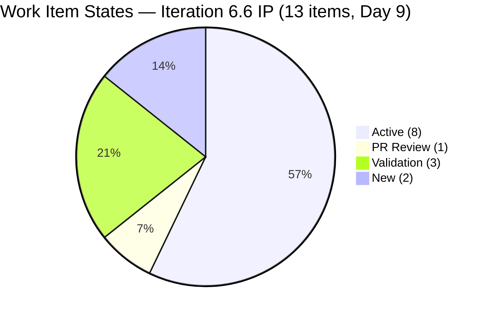
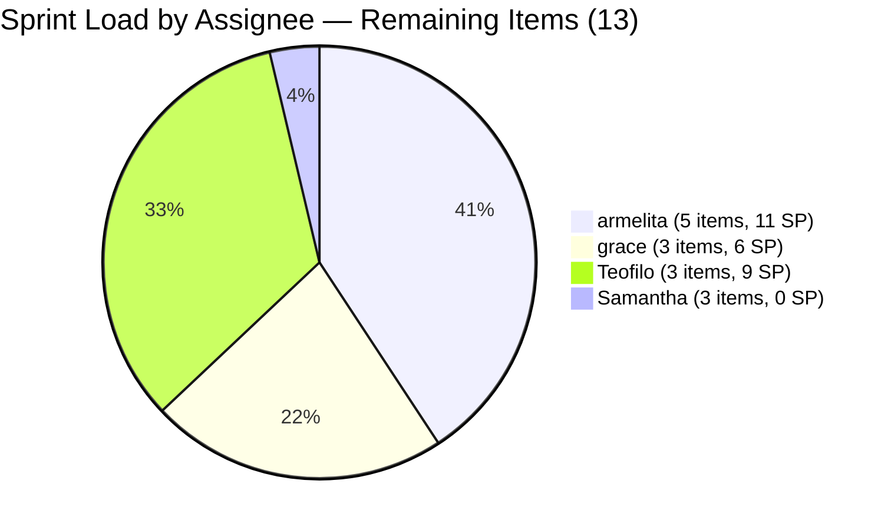
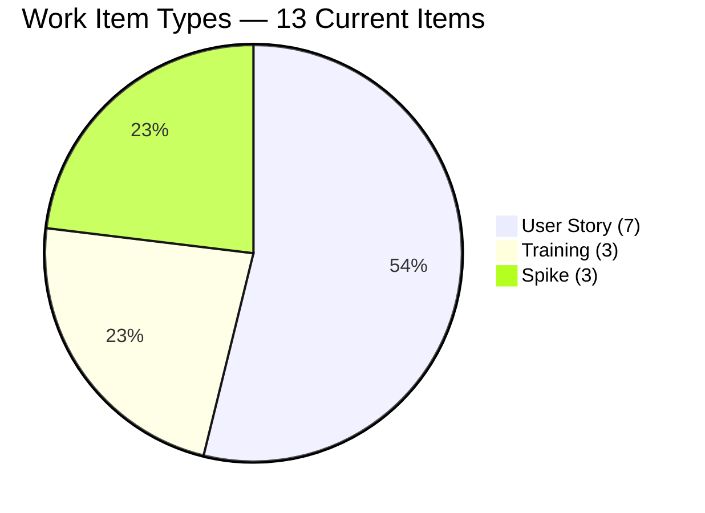
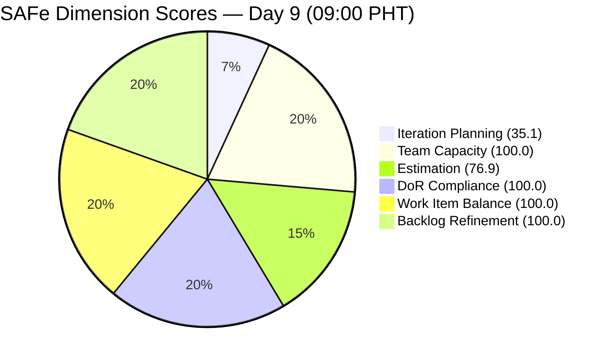
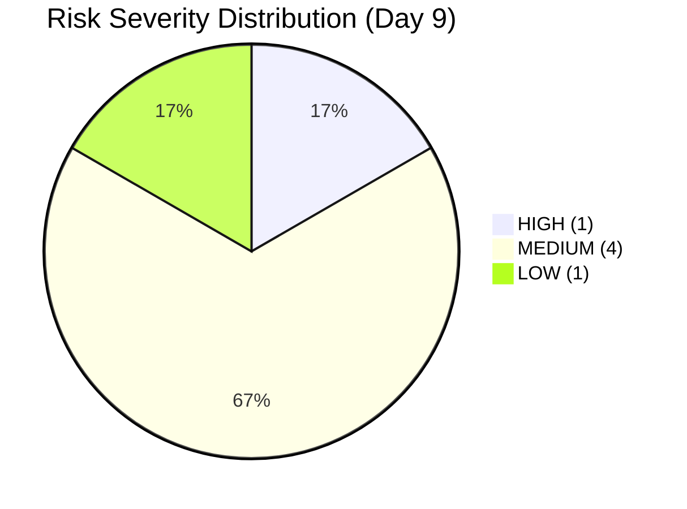

# SAFe Audit Report — JIT Operation Team | Iteration 6.6 (IP) Day 9

## 1. Audit Metadata

| Field | Value |
|---|---|
| **Project** | Jairosoft Portfolio |
| **Project ID** | `666bb99a-6acd-4999-bb34-efd0e4ea90dc` |
| **Team** | JIT Operation Team |
| **Team ID** | `b25e3129-6272-4e54-a3ff-f1ef3c8eeb2c` |
| **Workspace Folder** | `ado_jit` |
| **Current Iteration** | Iteration 6.6 (IP) |
| **Iteration Path** | `Jairosoft Portfolio\2026-PI6\Iteration 6.6 (IP)` |
| **Iteration ID** | `1df8c8f8-f0ed-4ee1-9244-cdd5c88b3c4a` |
| **Iteration Start** | March 23, 2026 |
| **Iteration Finish** | April 5, 2026 |
| **Iteration Day** | Day 9 of 14 (64% elapsed) |
| **Audit Date** | March 31, 2026 — 09:00 PHT |
| **Auditor** | AI EngProd Consultant |
| **Framework** | SAFe 6.0 |
| **Scoring Rubric** | ADO SAFe v1 (six-dimension deterministic) |
| **Previous Audit** | AUDIT_20260330_1015.md (Day 8, Score: 84.0/100) |
| **Overall Score** | **85.3 / 100** |
| **Risk Band** | **Low Risk** |
| **Board URL** | [ADO Board](https://dev.azure.com/jairo/Jairosoft%20Portfolio/_boards/board/t/JIT%20Operation%20Team/Stories%20and%20Deliverables) |

---

## 2. Executive Summary

This is the **fifth audit of Iteration 6.6 (IP)** and the first on Day 9. The JIT Operation Team score has **improved from 84.0 to 85.3/100 (Low Risk)**, the highest score in the Iteration 6.6 series so far.

**Significant overnight activity has transformed the board.** Four items have been **Closed**: #200566 (TESDA Compliance - Additional Trainer), #200589 (CSS NC II Enrollment Report), #200611 (UM Matina Intern Onboarding), and #201493 (TESDA SM Microcredential Submission). These represent the first closures of the sprint, burning **5 SP** and removing them from the backlog. Two items (#200593 AC Resubmission, #200597 CSS NC II AC Registration Fee) were **moved to Iteration 7.1**, reducing the current iteration scope. One **new item was added**: #202008 (UIC Interns Social Media Post, Spike, 0 SP, assigned to Samantha).

The Work Item Balance dimension has **jumped from 70.0 to 100.0** because the dominant type (User Story) share dropped from 72.2% to 53.8%, now below the 60% threshold. However, Estimation declined from 88.9 to 76.9 due to an additional unestimated Spike, and the visible backlog shrank from 40 to 37 items (3 closed items removed).

---

## 3. Previous Audit Delta

**Previous:** AUDIT_20260330_1015 — Iteration 6.6 (IP) Day 8, 10:15 PHT

| Metric | Prior (Day 8) | **This Audit (Day 9)** | Delta |
|---|---|---|---|
| **Overall Score** | 84.0 | **85.3** | **+1.3** |
| **Risk Band** | Low Risk | Low Risk | Stable |
| **Visible Backlog** | 40 | **37** | -3 (closures removed) |
| **Iteration Items** | 18 | **13** | -5 (4 closed, 2 moved to 7.1, 1 new added) |
| **Items Active** | 10 | **8** | -2 (closures) |
| **Items PR Review** | 1 | **1** | 0 (different item: #201522 now) |
| **Items Estimation** | 2 | **0** | -2 (moved to 7.1) |
| **Items Validation** | 2 | **3** | +1 (#202008 new Spike) |
| **Items New** | 3 | **2** | -1 |
| **Items Closed** | 0 | **4** (removed from backlog) | +4 |
| **Total SP (current)** | 36 | **28** | -8 (5 burned, 3 moved out) |
| **Iteration Planning** | 45.0 | **35.1** | -9.9 |
| **Estimation** | 88.9 | **76.9** | -12.0 |
| **Work Item Balance** | 70.0 | **100.0** | **+30.0** |
| **All other dims** | Unchanged | Unchanged | 0 |

**Key changes:**
1. **#200566 (TESDA Compliance - Additional Trainer, 1 SP, armelita)** — **CLOSED** Mar 31. First closure in the sprint.
2. **#200589 (CSS NC II Enrollment Report, 1 SP, armelita)** — **CLOSED** Mar 31.
3. **#200611 (UM Matina Intern Onboarding, 1 SP, armelita)** — **CLOSED** Mar 31.
4. **#201493 (TESDA SM Microcredential Submission, 2 SP, grace)** — **CLOSED** Mar 31. Was in PR Review.
5. **#200593 (AC Resubmission Result, 1 SP, armelita)** — **Moved to PI7\Iteration 7.1.** Was in Estimation for 3+ iterations.
6. **#200597 (CSS NC II AC Registration Fee, 2 SP, armelita)** — **Moved to PI7\Iteration 7.1.** Was in Estimation for 3+ iterations.
7. **#202008 (UIC Interns Social Media Post, Spike, 0 SP, Samantha)** — **NEW item** added to Iteration 6.6.
8. **#201522 (Lead Tracking & Follow-up)** — State changed from **Active to PR Review** (Mar 31).

---

## 4. Current Iteration Snapshot

### Sprint Scope

| Metric | Value |
|---|---|
| **Items in iteration** | 13 |
| **User Stories** | 7 |
| **Spikes** | 3 (#201774, #201899, #202008) |
| **Training** | 3 (#201857, #201864, #201865) |
| **Total Story Points (estimated)** | 28 SP |
| **Unestimated items** | 3 (#201774, #201899, #202008 — all Spikes, 0 SP) |
| **Items Closed (burned, out of backlog)** | 4 (5 SP) |
| **Iteration type** | IP (Innovation & Planning) |
| **Iteration elapsed** | 64% (Day 9 of 14) |

### State Distribution

| State | Count | Items |
|---|---|---|
| **Active** | 7 | #200607, #201429, #201433, #201442, #201504, #201514, #201864 |
| **PR Review** | 1 | #201522 |
| **Validation** | 3 | #201774, #201899, #202008 |
| **New** | 2 | #201857, #201865 |

### Team Capacity

| Member | Capacity/Day | Activity | Items in 6.6 | SP | Status |
|---|---|---|---|---|---|
| **armelita** | 6 hrs | Documentation | 5 | 11 SP | 3 closed today; 5 remaining |
| **grace** | 2 hrs | Documentation | 3 | 6 SP | 1 closed today; 3 remaining |
| **Samantha Babael** | 1 hr | Documentation | 3 | 0 SP (unestimated) | All Spikes in Validation |
| **Teofilo Limpag** | 6 hrs | Training | 3 | 9 SP | 1 Active, 2 New |
| **TOTAL** | **15 hrs/day** | -- | **13** | **28 SP** | |

---

## 5. Work Item Analysis

### Full Inventory — Iteration 6.6 (13 Active Backlog Items)

| ID | Type | Title (abbreviated) | State | Assigned | SP | Changed |
|---|---|---|---|---|---|---|
| #200607 | User Story | Bubble MCC Marketing Activities | Active | armelita | 2 | Mar 24 |
| #201429 | User Story | TESDA Action Catalog | Active | armelita | 2 | Mar 24 |
| #201433 | User Story | T2 MIS Employment Report | Active | armelita | 2 | Mar 24 |
| #201442 | User Story | Market CSS NC II April 2026 Class | Active | armelita | 3 | Mar 25 |
| #201504 | User Story | School Engagement & Flyering | Active | grace | 2 | Mar 24 |
| #201514 | User Story | "Free Discovery Day" Event | Active | grace | 2 | Mar 26 |
| #201522 | User Story | Lead Tracking & Follow-up | **PR Review** | grace | 2 | **Mar 31** |
| #201774 | Spike | Social Media Post for St. Mary's Interns | Validation | Samantha | **0** | Mar 27 |
| #201899 | Spike | Prepare UIC Interns Certificates | Validation | Samantha | **0** | Mar 31 |
| #202008 | Spike | UIC Interns Social Media Post | Validation | Samantha | **0** | Mar 31 |
| #201857 | Training | 2.1-1 Network Design Discussion | New | Teofilo | 3 | Mar 30 |
| #201864 | Training | 2.4-2 Computer Networks Safe Operation | **Active** | Teofilo | 3 | Mar 30 |
| #201865 | Training | 2.4-3 Prepare/Complete Reports | New | Teofilo | 3 | Mar 30 |

### Items Closed Today (Removed from Backlog)

| ID | Type | Title | SP | Assigned | Changed |
|---|---|---|---|---|---|
| #200566 | User Story | TESDA Compliance - Additional Trainer | 1 | armelita | Mar 31 |
| #200589 | User Story | CSS NC II Enrollment Report | 1 | armelita | Mar 31 |
| #200611 | User Story | UM Matina Intern Onboarding | 1 | armelita | Mar 31 |
| #201493 | User Story | TESDA SM Microcredential Submission | 2 | grace | Mar 31 |
| **Total** | | | **5 SP** | | |

### Items Moved Out of Iteration 6.6

| ID | Type | Title | SP | New Iteration | Reason |
|---|---|---|---|---|---|
| #200593 | User Story | AC Resubmission Result | 1 | PI7\Iter 7.1 | Was in Estimation for 3+ iterations |
| #200597 | User Story | CSS NC II AC Registration Fee | 2 | PI7\Iter 7.1 | Was in Estimation for 3+ iterations |

### Work Item Type Distribution

| Type | Count | Share | SP |
|---|---|---|---|
| User Story | 7 | 53.8% | 19 SP |
| Training | 3 | 23.1% | 9 SP |
| Spike | 3 | 23.1% | 0 SP |
| **Total** | **13** | **100%** | **28 SP** (estimated) |

### DoR Compliance Assessment

All 13 items pass DoR:
- All descriptions exceed 30 non-whitespace characters (minimum: 92 chars on #201433)
- All acceptance criteria exceed 20 non-whitespace characters (minimum: 63 chars on #201433)

### Freshness Assessment

| Metric | Value | Status |
|---|---|---|
| Fresh (< 45 days, after Feb 14) | 37/37 (100%) | Base = 100.0 |
| Stale-90 (before Dec 31, 2025) | 0 | No penalty |
| Stale-180 (before Oct 3, 2025) | 0 | No penalty |
| Untouched current items | 0/13 (0%) | No penalty |

---

## 6. SAFe Compliance Scorecard

| # | Dimension | Score | Evidence | Notes |
|---|---|---|---|---|
| 1 | **Iteration Planning** | **35.1** | 13 of 37 visible backlog items in current iteration | Down from 45.0; backlog and current both shrank |
| 2 | **Team Capacity** | **100.0** | 4/4 contributors with work have capacity configured | All members active |
| 3 | **Estimation** | **76.9** | 10/13 point-eligible items estimated | 3 Spikes unestimated (#201774, #201899, #202008) |
| 4 | **DoR Compliance** | **100.0** | 13/13 items pass Description >= 30 AND AC >= 20 | Stable |
| 5 | **Work Item Balance** | **100.0** | User Story 53.8% <= 60%; has User Story; spike 23.1% <= 40% | **Up from 70.0** — type rebalancing achieved |
| 6 | **Backlog Refinement** | **100.0** | 37/37 fresh; 0 stale; 0/13 untouched | Perfect — unchanged |
| | **Overall** | **85.3** | Average of 6 dimensions | **Low Risk** (>= 80) |

### Score Computation Detail

| Dimension | Formula | Calculation | Result |
|---|---|---|---|
| Iteration Planning | current / visible x 100 | 13 / 37 x 100 | 35.1 |
| Team Capacity | cap_with_work / work_assignees x 100 | 4 / 4 x 100 | 100.0 |
| Estimation | estimated / point_eligible x 100 | 10 / 13 x 100 | 76.9 |
| DoR Compliance | dor_compliant / current x 100 | 13 / 13 x 100 | 100.0 |
| Work Item Balance | 100 - penalties | 100 - 0 (dominant 53.8% <= 60%) | 100.0 |
| Backlog Refinement | base - penalties | 100.0 - 0 | 100.0 |
| **Overall** | average(all 6) | (35.1+100+76.9+100+100+100)/6 | **85.3** |

### Score History — Iteration 6.6 (IP)

| Audit | Date | Day | Score | Band | Key Change |
|---|---|---|---|---|---|
| Day 4 | Mar 26 (1630) | Day 4 | 85.3 | Low Risk | First audit this iteration |
| Day 5 | Mar 27 (0701) | Day 5 | 84.5 | Low Risk | #201774 Spike unestimated |
| Day 8 (AM) | Mar 30 (0900) | Day 8 | 84.0 | Low Risk | Teofilo activated; 2nd unestimated Spike |
| Day 8 (PM) | Mar 30 (1015) | Day 8 | 84.0 | Low Risk | No changes since AM audit |
| **Day 9** | **Mar 31 (0900)** | **Day 9** | **85.3** | **Low Risk** | **4 closures; 2 items moved to 7.1; WIB jumps to 100** |

---

## 7. Dimension Findings

### 7.1 Iteration Planning (35.1/100) — DOWN FROM 45.0

13 of 37 visible backlog items are in the current iteration, down from 18/40. The drop is driven by: (a) 4 items closed and removed from both backlog and iteration count, (b) 2 items moved to PI7\7.1, and (c) 1 new item added. The visible backlog also shrank by 3 (closures not replaced). This score remains structurally constrained by the IP iteration model — the large non-current backlog includes Coursewares, PI7 items, and portfolio-level planning items that are intentionally not in the current sprint.

### 7.2 Team Capacity (100.0/100) — FULL

All four team members with assigned work have capacity configured. Armelita (6h), Grace (2h), Samantha (1h), Teofilo (6h) = 15 h/day total. Armelita's Mar 24 day-off has passed. No remaining days off configured.

### 7.3 Estimation (76.9/100) — DOWN FROM 88.9

10 of 13 items estimated. Three gaps: #201774, #201899, and #202008 (all Spikes assigned to Samantha, all in Validation state with 0 SP). The addition of #202008 (new unestimated Spike) further degraded this dimension. **Estimating all 3 Spikes would restore this to 100.0 and raise overall from 85.3 to 89.2.** This remains the single highest-leverage improvement available.

### 7.4 DoR Compliance (100.0/100) — FULL

All 13 items pass DoR. Fifth consecutive audit at 100.0.

### 7.5 Work Item Balance (100.0/100) — UP FROM 70.0

Three work item types present: User Story (53.8%), Training (23.1%), Spike (23.1%). The dominant type share dropped below 60% for the first time due to closures reducing the User Story count from 13 to 7 while Spikes and Training counts held steady. **This is the first time Work Item Balance has reached 100.0 in the Iteration 6.6 series.**

### 7.6 Backlog Refinement (100.0/100) — PERFECT

All 37 visible items fresh (changed within 45 days). Zero stale items. Zero untouched current items. Perfect score for the fifth consecutive audit.

---

## 8. Risks and Bottlenecks

| # | Risk | Severity | Evidence | Recommended Action |
|---|---|---|---|---|
| R1 | **3 unestimated Spikes (#201774, #201899, #202008)** | HIGH | All Samantha's Spikes 0 SP; Estimation at 76.9 | Estimate all 3 today; highest-leverage fix |
| R2 | **Zero items fully closed in backlog view** | MEDIUM | 4 items closed but removed from backlog; 0 remaining items at Closed state | Continue pushing items through pipeline |
| R3 | **#201857, #201865 (Training) still New** | MEDIUM | 2 of Teofilo's 3 items are New on Day 9. | Activate both today |
| R4 | **Armelita carries 5 items (11 SP) at 6 h/day** | MEDIUM | Largest individual load with 5 working days left | Monitor; she closed 3 items overnight |
| R5 | **Iteration Planning structurally low (35.1)** | LOW (Structural) | IP iteration; large non-current backlog by design | Not actionable without scope inflation |
| R6 | **Samantha's 3 Spikes in Validation with 0 SP** | MEDIUM | All items in Validation suggesting near-completion | Close or estimate; confirm completion status |

---

## 9. Prioritized Recommendations

| Priority | Action | Owner | Impact | Target |
|---|---|---|---|---|
| **P1** | **Estimate #201774, #201899, and #202008** — Add 1-3 SP to each Spike. Restores Estimation to 100.0, raises overall from 85.3 to 89.2. | Armelita (PO) | D3: +23.1; Overall: +3.9 | Today |
| **P2** | **Close Samantha's Validation Spikes** — All 3 in Validation; verify if they are complete. | Samantha / Armelita | Clears Validation queue | Today |
| **P3** | **Close #201522 (Lead Tracking)** — In PR Review. Grace's next closure candidate. | grace | Demonstrates continued throughput | Today-Day 10 |
| **P4** | **Activate #201857 and #201865 (Training)** — Teofilo's two remaining New items. | Teofilo / Armelita | Eliminates all "New" items | Today |
| **P5** | **Continue closing armelita's Active items** — 4 Active User Stories (200607, 201429, 201433, 201442) totaling 9 SP. | armelita | Sprint completion progress | Days 9-11 |

---

## 10. Evidence Gaps and Limitations

| # | Gap | Impact | Mitigation |
|---|---|---|---|
| G1 | **IP iteration planning score structurally low** | 35.1 does not indicate planning failure; IP iterations carry lighter loads by design | Documented; expected for IP structure |
| G2 | **Samantha's 1 h/day capacity vs. 3 unestimated Spikes** | Throughput and estimation accuracy unclear | Spikes may be documentation-level tasks |
| G3 | **#200593 and #200597 moved to PI7 without documented reason** | Chronic Estimation-state items removed from scope | Confirmed as intentional de-commit; resolves prior R2 risk |
| G4 | **#202008 new item added mid-sprint** | Scope change; unestimated | IP iteration allows flexibility; estimate to score properly |
| G5 | **Closed items not visible in backlog** | Cannot track burn from backlog alone | Confirmed 4 closures via direct work item query |

---

*Report generated: March 31, 2026 09:00 PHT | SAFe 6.0 Framework | ADO SAFe v1 Rubric*
*Jairosoft Portfolio — JIT Operation Team | Iteration 6.6 (IP): Mar 23 - Apr 5, 2026*
*Overall Score: 85.3/100 (Low Risk) | Day 9 of 14 (64% elapsed)*
*Previous: AUDIT_20260330_1015.md (Day 8, 84.0/100) | +1.3 improvement*
*4 closures (5 SP burned); 2 items moved to PI7; Work Item Balance reaches 100 for the first time*
