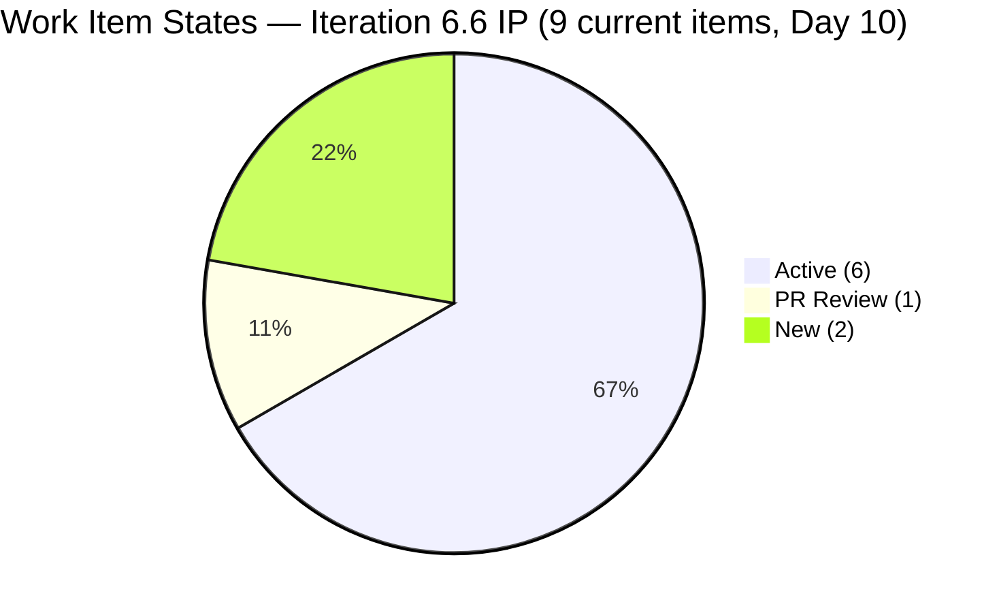
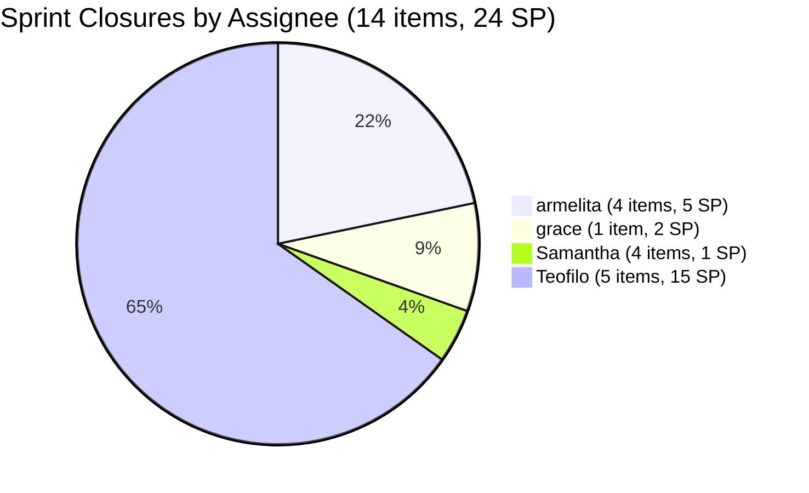
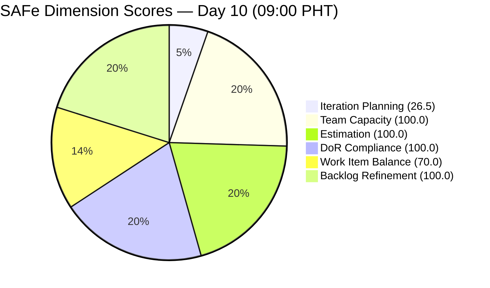
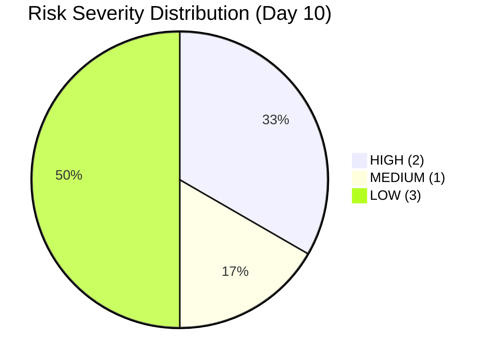

# SAFe Audit Report — JIT Operation Team | Iteration 6.6 (IP) Day 10

## 1. Audit Metadata

| Field | Value |
|---|---|
| **Project** | Jairosoft Portfolio |
| **Project ID** | `666bb99a-6acd-4999-bb34-efd0e4ea90dc` |
| **Team** | JIT Operation Team |
| **Team ID** | `b25e3129-6272-4e54-a3ff-f1ef3c8eeb2c` |
| **Workspace Folder** | `ado_jit` |
| **Current Iteration** | Iteration 6.6 (IP) |
| **Iteration Path** | `Jairosoft Portfolio\2026-PI6\Iteration 6.6 (IP)` |
| **Iteration ID** | `1df8c8f8-f0ed-4ee1-9244-cdd5c88b3c4a` |
| **Iteration Start** | March 23, 2026 |
| **Iteration Finish** | April 5, 2026 |
| **Iteration Day** | Day 10 of 14 (71% elapsed) |
| **Audit Date** | April 1, 2026 — 09:00 PHT |
| **Auditor** | AI EngProd Consultant |
| **Framework** | SAFe 6.0 |
| **Scoring Rubric** | ADO SAFe v1 (six-dimension deterministic) |
| **Previous Audit** | AUDIT_20260331_0900.md (Day 9, Score: 85.3/100) |
| **Overall Score** | **82.8 / 100** |
| **Risk Band** | **Low Risk** |
| **Board URL** | [ADO Board](https://dev.azure.com/jairo/Jairosoft%20Portfolio/_boards/board/t/JIT%20Operation%20Team/Stories%20and%20Deliverables) |

---

## 2. Executive Summary

This is the **sixth audit of Iteration 6.6 (IP)** and the first on Day 10. The JIT Operation Team score has **decreased from 85.3 to 82.8/100 (Low Risk)**, driven by a significant wave of closures that removed items from the backlog and shifted type balance.

**Massive overnight activity.** A total of **14 additional items have been closed** in the iteration (bringing the sprint total to at least 14 closures), including all 3 of Samantha's Spikes (#201774, #201899, #202008), the St. Mary Bansalan Interns Demo (#200264), and 5 of Teofilo's Training modules (#201859, #201860, #201861, #201862, #201863). Additionally, #201433 (T2 MIS Employment Report) was **moved to PI7\Iteration 7.1** and is no longer a current iteration item.

The remaining **9 items on the backlog** in Iteration 6.6 consist of 6 User Stories and 3 Training items. The 3 Spikes that were dragging down the Estimation score are now Closed. However, the removal of Spikes from the current backlog has pushed the dominant User Story share to 66.7%, re-triggering the -30 Work Item Balance penalty (down from 100.0 to 70.0).

---

## 3. Previous Audit Delta

**Previous:** AUDIT_20260331_0900 — Iteration 6.6 (IP) Day 9, 09:00 PHT

| Metric | Prior (Day 9) | **This Audit (Day 10)** | Delta |
|---|---|---|---|
| **Overall Score** | 85.3 | **82.8** | **-2.5** |
| **Risk Band** | Low Risk | Low Risk | Stable |
| **Visible Backlog** | 37 | **34** | -3 (closures removed) |
| **Iteration Items (on backlog)** | 13 | **9** | -4 (3 Spikes closed, 1 moved to 7.1) |
| **Items Active** | 8 | **6** | -2 |
| **Items PR Review** | 1 | **1** | Stable (#201522) |
| **Items New** | 2 | **2** | Stable (#201857, #201865) |
| **Items Closed (iteration total)** | 4 | **14+** | +10 more closures |
| **Total SP (current on backlog)** | 28 | **22** | -6 |
| **Iteration Planning** | 35.1 | **26.5** | -8.6 |
| **Estimation** | 76.9 | **100.0** | +23.1 |
| **Work Item Balance** | 100.0 | **70.0** | -30.0 |

**Key changes:**
1. **#201774 (Social Media Post St. Mary's Interns, Spike, 0 SP, Samantha)** — **CLOSED** Apr 1. Removed from backlog.
2. **#201899 (Prepare UIC Interns Certificates, Spike, 0 SP, Samantha)** — **CLOSED** Apr 1. Removed from backlog.
3. **#202008 (UIC Interns Social Media Post, Spike, 0 SP, Samantha)** — **CLOSED** Apr 1. Removed from backlog.
4. **#201433 (T2 MIS Employment Report, 2 SP, armelita)** — **Moved to PI7\Iteration 7.1.** No longer current.
5. **#200264 (St. Mary Bansalan Interns Final Demo, 2 SP, armelita)** — **CLOSED** (confirmed in iteration). Previously untracked.
6. **#201377 (Prepare Certificate for Interns, Spike, 1 SP, Samantha)** — **CLOSED** Mar 26 (confirmed in iteration).
7. **#201859 (2.1-1 Network Design, Training, 3 SP, Teofilo)** — **CLOSED** Mar 30.
8. **#201860 (2.1-2 Network Materials, Training, 3 SP, Teofilo)** — **CLOSED** Mar 30.
9. **#201861 (2.2-1 Network Configuration, Training, 3 SP, Teofilo)** — **CLOSED** Mar 30.
10. **#201862 (2.3-1 Router/WiFi Config, Training, 3 SP, Teofilo)** — **CLOSED** Mar 30.
11. **#201863 (2.4-1 Manufacturer Instructions, Training, 3 SP, Teofilo)** — **CLOSED** Mar 30.

---

## 4. Current Iteration Snapshot

### Sprint Scope

| Metric | Value |
|---|---|
| **Items in iteration (on backlog)** | 9 |
| **User Stories** | 6 |
| **Training** | 3 |
| **Spikes** | 0 (all 3 closed) |
| **Total Story Points (current)** | 22 SP |
| **Unestimated items** | 0 |
| **Items Closed (iteration total)** | 14+ |
| **SP Closed (cumulative)** | 28+ SP |
| **Iteration type** | IP (Innovation & Planning) |
| **Iteration elapsed** | 71% (Day 10 of 14) |

### State Distribution

| State | Count | Items |
|---|---|---|
| **Active** | 6 | #200607, #201429, #201442, #201504, #201514, #201864 |
| **PR Review** | 1 | #201522 |
| **New** | 2 | #201857, #201865 |

### Team Capacity

| Member | Capacity/Day | Activity | Items in 6.6 | SP | Status |
|---|---|---|---|---|---|
| **armelita** | 6 hrs | Documentation | 3 | 7 SP | 3 Active |
| **grace** | 2 hrs | Documentation | 3 | 6 SP | 2 Active, 1 PR Review |
| **Teofilo Limpag** | 6 hrs | Training | 3 | 9 SP | 1 Active, 2 New |
| **Samantha Babael** | 1 hr | Documentation | 0 | 0 SP | All 3 Spikes closed |
| **TOTAL** | **15 hrs/day** | -- | **9** | **22 SP** | |

> Samantha has no remaining items in the iteration. Her 3 Spikes are all Closed.

### Full Inventory — Iteration 6.6 (9 Current Backlog Items)

| ID | Type | Title (abbreviated) | State | Assigned | SP | Changed |
|---|---|---|---|---|---|---|
| #200607 | User Story | Bubble MCC Marketing Activities | Active | armelita | 2 | Mar 24 |
| #201429 | User Story | TESDA Action Catalog | Active | armelita | 2 | Mar 24 |
| #201442 | User Story | Market CSS NC II April 2026 Class | Active | armelita | 3 | Mar 25 |
| #201504 | User Story | School Engagement & Flyering | Active | grace | 2 | Mar 24 |
| #201514 | User Story | "Free Discovery Day" Event | Active | grace | 2 | Mar 26 |
| #201522 | User Story | Lead Tracking & Follow-up | PR Review | grace | 2 | Mar 31 |
| #201857 | Training | 2.1-1 Network Design Discussion | New | Teofilo | 3 | Mar 30 |
| #201864 | Training | 2.4-2 Computer Networks Safe Operation | Active | Teofilo | 3 | Mar 30 |
| #201865 | Training | 2.4-3 Prepare/Complete Reports | New | Teofilo | 3 | Mar 30 |

### Items Closed in Iteration 6.6 (Removed from Backlog)

| ID | Type | Title | SP | Assigned | Closed |
|---|---|---|---|---|---|
| #200264 | User Story | St. Mary Bansalan Interns Final Demo | 2 | armelita | Mar 29 |
| #200566 | User Story | TESDA Compliance Additional Trainer | 1 | armelita | Mar 31 |
| #200589 | User Story | CSS NC II Enrollment Report | 1 | armelita | Mar 31 |
| #200611 | User Story | UM Matina Intern Onboarding | 1 | armelita | Mar 31 |
| #201377 | Spike | Prepare Certificate for Interns | 1 | Samantha | Mar 26 |
| #201493 | User Story | TESDA SM Microcredential Submission | 2 | grace | Mar 31 |
| #201774 | Spike | Social Media Post St. Mary's Interns | 0 | Samantha | Apr 1 |
| #201899 | Spike | Prepare UIC Interns Certificates | 0 | Samantha | Apr 1 |
| #202008 | Spike | UIC Interns Social Media Post | 0 | Samantha | Apr 1 |
| #201859 | Training | 2.1-1 Network Design | 3 | Teofilo | Mar 30 |
| #201860 | Training | 2.1-2 Network Materials | 3 | Teofilo | Mar 30 |
| #201861 | Training | 2.2-1 Network Configuration | 3 | Teofilo | Mar 30 |
| #201862 | Training | 2.3-1 Router/WiFi Config | 3 | Teofilo | Mar 30 |
| #201863 | Training | 2.4-1 Manufacturer Instructions | 3 | Teofilo | Mar 30 |
| **Total** | | | **24 SP** | | |

---

## 5. Work Item Analysis

### Work Item Type Distribution (9 Current Items)

| Type | Count | Share | SP |
|---|---|---|---|
| User Story | 6 | 66.7% | 13 SP |
| Training | 3 | 33.3% | 9 SP |
| Spike | 0 | 0% | 0 SP |
| **Total** | **9** | **100%** | **22 SP** |

### DoR Compliance Assessment

All 9 items pass DoR:
- All descriptions exceed 30 non-whitespace characters (minimum: 92 chars on #201429)
- All acceptance criteria exceed 20 non-whitespace characters (minimum: 63 chars on #201429)

### Freshness Assessment

| Metric | Value | Status |
|---|---|---|
| Fresh (< 45 days, after Feb 15) | 34/34 (100%) | Base = 100.0 |
| Stale-90 (before Jan 1, 2026) | 0 | No penalty |
| Stale-180 (before Oct 4, 2025) | 0 | No penalty |
| Untouched current items | 0/9 (0%) | No penalty |

---

## 6. SAFe Compliance Scorecard

| # | Dimension | Score | Evidence | Notes |
|---|---|---|---|---|
| 1 | **Iteration Planning** | **26.5** | 9 of 34 visible backlog items in current iteration | Down from 35.1; closures shrank current set faster |
| 2 | **Team Capacity** | **100.0** | 3/3 contributors with work have capacity configured | Samantha has capacity but no remaining work |
| 3 | **Estimation** | **100.0** | 9/9 items estimated | Up from 76.9 — all unestimated Spikes now Closed |
| 4 | **DoR Compliance** | **100.0** | 9/9 items pass Description >= 30 AND AC >= 20 | Stable |
| 5 | **Work Item Balance** | **70.0** | User Story 66.7% > 60% -> -30 | Down from 100.0 — Spike closures shifted balance |
| 6 | **Backlog Refinement** | **100.0** | 34/34 fresh; 0 stale; 0/9 untouched | Perfect — unchanged |
| | **Overall** | **82.8** | Average of 6 dimensions | **Low Risk** (>= 80) |

### Score Computation Detail

| Dimension | Formula | Calculation | Result |
|---|---|---|---|
| Iteration Planning | current / visible x 100 | 9 / 34 x 100 | 26.5 |
| Team Capacity | cap_with_work / work_assignees x 100 | 3 / 3 x 100 | 100.0 |
| Estimation | estimated / point_eligible x 100 | 9 / 9 x 100 | 100.0 |
| DoR Compliance | dor_compliant / current x 100 | 9 / 9 x 100 | 100.0 |
| Work Item Balance | 100 - penalties | 100 - 30 (US 66.7% > 60%) | 70.0 |
| Backlog Refinement | base - penalties | 100.0 - 0 | 100.0 |
| **Overall** | average(all 6) | (26.5+100+100+100+70+100)/6 | **82.8** |

### Score History — Iteration 6.6 (IP)

| Audit | Date | Day | Score | Band | Key Change |
|---|---|---|---|---|---|
| Day 4 | Mar 26 (1630) | Day 4 | 85.3 | Low Risk | First audit this iteration |
| Day 5 | Mar 27 (0701) | Day 5 | 84.5 | Low Risk | #201774 Spike unestimated |
| Day 8 (AM) | Mar 30 (0900) | Day 8 | 84.0 | Low Risk | Teofilo activated; 2nd unestimated Spike |
| Day 8 (PM) | Mar 30 (1015) | Day 8 | 84.0 | Low Risk | No changes since AM audit |
| Day 9 | Mar 31 (0900) | Day 9 | 85.3 | Low Risk | 4 closures; 2 items moved to 7.1; WIB to 100 |
| **Day 10** | **Apr 1 (0900)** | **Day 10** | **82.8** | **Low Risk** | **14 closures total; Spikes closed; WIB back to 70** |

---

## 7. Dimension Findings

### 7.1 Iteration Planning (26.5/100) — DOWN FROM 35.1

9 of 34 visible backlog items are in the current iteration, down from 13/37. The continued decline is driven by closures removing items from the iteration count without the visible backlog shrinking proportionally (34 vs 37 — only 3 fewer because most closed items were already off the backlog from the prior day's closures). The #201433 move to PI7\7.1 further reduced the current count. This dimension remains structurally constrained by the IP iteration model.

### 7.2 Team Capacity (100.0/100) — FULL

Three contributors with current iteration work (armelita 6h, grace 2h, Teofilo 6h) all have capacity configured. Samantha (1h) has capacity but no remaining current items — her 3 Spikes are all Closed. The formula uses contributors_with_current_work as the denominator, so Samantha is excluded.

### 7.3 Estimation (100.0/100) — UP FROM 76.9 (RESTORED)

All 9 current items have Story Points > 0. The three previously unestimated Spikes (#201774, #201899, #202008) are now Closed and off the backlog, eliminating the estimation gap. **This is the first time Estimation has reached 100.0 in the Iteration 6.6 series.**

### 7.4 DoR Compliance (100.0/100) — FULL

All 9 items pass DoR. Sixth consecutive audit at 100.0.

### 7.5 Work Item Balance (70.0/100) — DOWN FROM 100.0

Two work item types remain: User Story (66.7%) and Training (33.3%). The User Story dominant share now exceeds 60%, re-triggering the -30 penalty. This reversal was caused by all 3 Spikes being Closed and removed from the backlog, shifting the type ratio. **The team successfully completed all Spikes but is penalized for doing so.** No User Story absence penalty (User Stories present). No spike penalty (0% spike share).

### 7.6 Backlog Refinement (100.0/100) — PERFECT

All 34 visible items fresh (changed within 45 days). Zero stale items. Zero untouched current items. Perfect score for the sixth consecutive audit.

---

## 8. Risks and Bottlenecks

| # | Risk | Severity | Evidence | Recommended Action |
|---|---|---|---|---|
| R1 | **#201857, #201865 (Training) still New** | HIGH | 2 of Teofilo's 3 items are New on Day 10. Only 4 working days remain. | Activate both today |
| R2 | **Armelita's 3 Active items unchanged since Mar 24-25** | HIGH | #200607, #201429 (Mar 24), #201442 (Mar 25) have not been updated in 7 days | Verify progress; update state |
| R3 | **Grace's 2 Active items unchanged since Mar 24-26** | MEDIUM | #201504 (Mar 24), #201514 (Mar 26) — no recent updates | Verify progress; push toward PR Review |
| R4 | **Iteration Planning structurally low (26.5)** | LOW (Structural) | IP iteration; large non-current backlog by design | Not actionable without scope inflation |
| R5 | **Samantha idle for remainder of sprint** | LOW | All 3 Spikes completed; no remaining items | Assign new work or document as capacity available |
| R6 | **#201433 moved to PI7 mid-sprint** | LOW | Was Active in 6.6; now in 7.1 | Confirmed as intentional de-commit |

---

## 9. Prioritized Recommendations

| Priority | Action | Owner | Impact | Target |
|---|---|---|---|---|
| **P1** | **Activate #201857 and #201865 (Training)** — Teofilo's two New items. Only 4 days left. | Teofilo / Armelita | Eliminates "New" items from Day 10+ | Today |
| **P2** | **Update armelita's Active items** — #200607, #201429, #201442 unchanged for 7 days. Verify progress and update state. | armelita | Removes stale-risk; demonstrates progress | Today |
| **P3** | **Close #201522 (Lead Tracking)** — In PR Review since Mar 31. Grace's next closure candidate. | grace | Demonstrates continued throughput | Today-Day 11 |
| **P4** | **Push #201504 and #201514 toward PR Review** — Grace's 2 Active items unchanged since Mar 24-26. | grace | Sprint completion progress | Day 10-11 |
| **P5** | **Assign Samantha new work or document capacity** — All her Spikes are done. 1 h/day available. | Armelita (PO) | Utilizes available capacity | Today |

---

## 10. Evidence Gaps and Limitations

| # | Gap | Impact | Mitigation |
|---|---|---|---|
| G1 | **IP iteration planning score structurally low** | 26.5 does not indicate planning failure; IP iterations carry lighter loads by design | Documented; expected for IP structure |
| G2 | **Closed items not visible in backlog** | 14 closures confirmed via iteration API + direct queries | Cross-referenced iteration and backlog APIs |
| G3 | **#201433 moved to PI7 mid-sprint** | Scope change reduces current count | Confirmed as intentional de-commit |
| G4 | **Work Item Balance penalizes successful Spike completion** | Closing Spikes removed them from type mix, triggering dominant-type penalty | Structural rubric limitation when items burn down |
| G5 | **Armelita's items unchanged for 7 days** | Cannot determine if work is progressing without state updates | Recommend daily state updates |
| G6 | **Samantha's Spikes had 0 SP at closure** | SP burned for Spikes = 0; not reflected in burndown | Spikes were unestimated throughout; now closed |

---

*Report generated: April 1, 2026 09:00 PHT | SAFe 6.0 Framework | ADO SAFe v1 Rubric*
*Jairosoft Portfolio — JIT Operation Team | Iteration 6.6 (IP): Mar 23 - Apr 5, 2026*
*Overall Score: 82.8/100 (Low Risk) | Day 10 of 14 (71% elapsed)*
*Previous: AUDIT_20260331_0900.md (Day 9, 85.3/100) | -2.5 decrease*
*14 items closed in iteration (24 SP); 9 items remaining (22 SP); Estimation restored to 100; WIB drops to 70*
