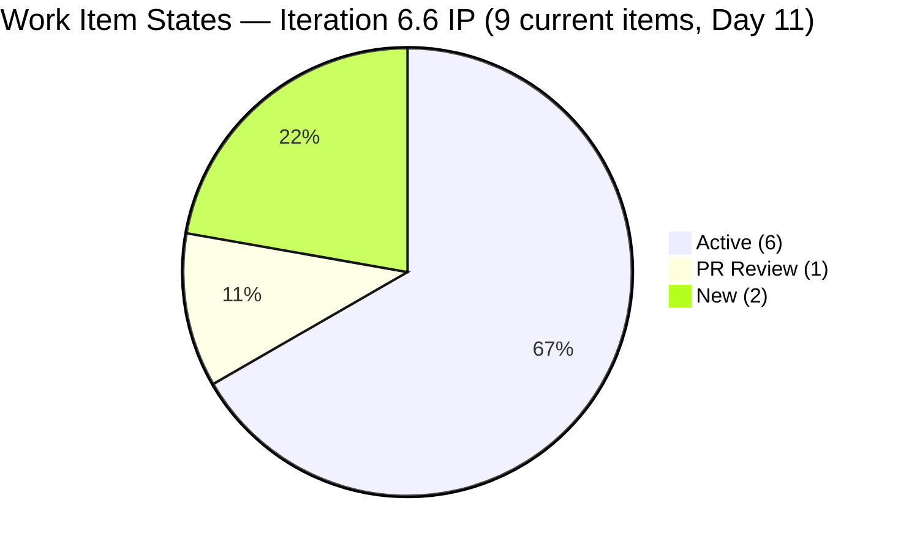
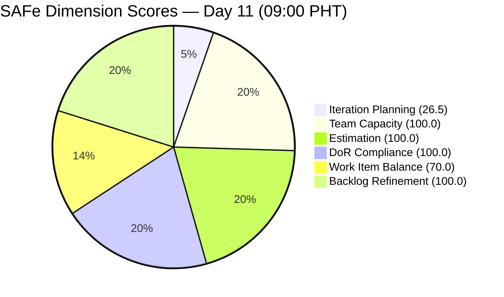
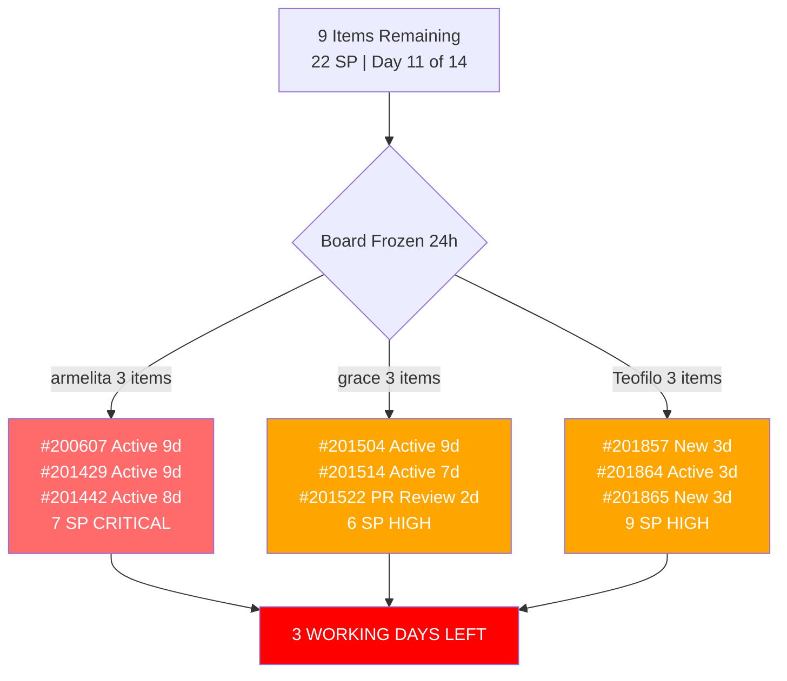

# SAFe Audit Report — JIT Operation Team | Iteration 6.6 (IP) Day 11

## 1. Audit Metadata

| Field | Value |
|---|---|
| **Project** | Jairosoft Portfolio |
| **Project ID** | `666bb99a-6acd-4999-bb34-efd0e4ea90dc` |
| **Team** | JIT Operation Team |
| **Team ID** | `b25e3129-6272-4e54-a3ff-f1ef3c8eeb2c` |
| **Workspace Folder** | `ado_jit` |
| **Current Iteration** | Iteration 6.6 (IP) |
| **Iteration Path** | `Jairosoft Portfolio\2026-PI6\Iteration 6.6 (IP)` |
| **Iteration ID** | `1df8c8f8-f0ed-4ee1-9244-cdd5c88b3c4a` |
| **Iteration Start** | March 23, 2026 |
| **Iteration Finish** | April 5, 2026 |
| **Iteration Day** | Day 11 of 14 (79% elapsed) |
| **Audit Date** | April 2, 2026 — 09:00 PHT |
| **Auditor** | AI EngProd Consultant |
| **Framework** | SAFe 6.0 |
| **Scoring Rubric** | ADO SAFe v1 (six-dimension deterministic) |
| **Previous Audit** | AUDIT_20260401_0900.md (Day 10, Score: 82.8/100) |
| **Overall Score** | **82.8 / 100** |
| **Risk Band** | **Low Risk** |
| **Board URL** | [ADO Board](https://dev.azure.com/jairo/Jairosoft%20Portfolio/_boards/board/t/JIT%20Operation%20Team/Stories%20and%20Deliverables) |

---

## 2. Executive Summary

This is the **seventh audit of Iteration 6.6 (IP)** and the first on Day 11. The JIT Operation Team score is **unchanged at 82.8/100 (Low Risk)** — identical to the Day 10 audit.

**No changes detected on the board since the previous audit.** The same 9 items remain in the current iteration with the same states: 6 Active, 1 PR Review (#201522), and 2 New (#201857, #201865). No items were closed, created, or updated in the last 24 hours. The 14 items previously closed in the iteration remain off the backlog.

**The primary concern is stagnation.** With only 3 working days remaining, armelita's 3 Active items have now been unchanged for **8-9 days** (last updated Mar 24-25), Grace's 2 Active items are unchanged for **7-9 days** (last updated Mar 24-26), and Teofilo's 2 New items (#201857, #201865) have sat in New state since Mar 30 — now **3 days without activation**. Only #201522 (PR Review, Mar 31) and #201864 (Active, Mar 30) show recent activity.

---

## 3. Previous Audit Delta

**Previous:** AUDIT_20260401_0900 — Iteration 6.6 (IP) Day 10, 09:00 PHT

| Metric | Prior (Day 10) | **This Audit (Day 11)** | Delta |
|---|---|---|---|
| **Overall Score** | 82.8 | **82.8** | **0.0** |
| **Risk Band** | Low Risk | Low Risk | Stable |
| **Visible Backlog** | 34 | **34** | 0 |
| **Iteration Items (on backlog)** | 9 | **9** | 0 |
| **Items Active** | 6 | **6** | 0 |
| **Items PR Review** | 1 | **1** | 0 |
| **Items New** | 2 | **2** | 0 |
| **Total SP (current on backlog)** | 22 | **22** | 0 |
| **All 6 dimensions** | Same | **Same** | 0 |

**Key changes:** None. The board is completely unchanged from the previous audit. No items were created, moved, updated, or closed in the last 24 hours.

---

## 4. Current Iteration Snapshot

### Sprint Scope

| Metric | Value |
|---|---|
| **Items in iteration (on backlog)** | 9 |
| **User Stories** | 6 |
| **Training** | 3 |
| **Spikes** | 0 (all 3 closed previously) |
| **Total Story Points (current)** | 22 SP |
| **Unestimated items** | 0 |
| **Items Closed (iteration total)** | 14 (24 SP) |
| **Iteration type** | IP (Innovation & Planning) |
| **Iteration elapsed** | 79% (Day 11 of 14) |

### State Distribution

| State | Count | Items |
|---|---|---|
| **Active** | 6 | #200607, #201429, #201442, #201504, #201514, #201864 |
| **PR Review** | 1 | #201522 |
| **New** | 2 | #201857, #201865 |

### Team Capacity

| Member | Capacity/Day | Activity | Items in 6.6 | SP | Status | Days Stale |
|---|---|---|---|---|---|---|
| **armelita** | 6 hrs | Documentation | 3 | 7 SP | 3 Active | **8-9 days** |
| **grace** | 2 hrs | Documentation | 3 | 6 SP | 2 Active, 1 PR Review | **2-9 days** |
| **Teofilo Limpag** | 6 hrs | Training | 3 | 9 SP | 1 Active, 2 New | **3 days** |
| **Samantha Babael** | 1 hr | Documentation | 0 | 0 SP | All 3 Spikes closed | Idle |
| **TOTAL** | **15 hrs/day** | -- | **9** | **22 SP** | | |

> Samantha has no remaining items in the iteration. Her 3 Spikes are all Closed.

### Full Inventory — Iteration 6.6 (9 Current Backlog Items)

| ID | Type | Title (abbreviated) | State | Assigned | SP | Changed | Days Stale |
|---|---|---|---|---|---|---|---|
| #200607 | User Story | Bubble MCC Marketing Activities | Active | armelita | 2 | Mar 24 | **9** |
| #201429 | User Story | TESDA Action Catalog | Active | armelita | 2 | Mar 24 | **9** |
| #201442 | User Story | Market CSS NC II April 2026 Class | Active | armelita | 3 | Mar 25 | **8** |
| #201504 | User Story | School Engagement & Flyering | Active | grace | 2 | Mar 24 | **9** |
| #201514 | User Story | "Free Discovery Day" Event | Active | grace | 2 | Mar 26 | **7** |
| #201522 | User Story | Lead Tracking & Follow-up | PR Review | grace | 2 | Mar 31 | **2** |
| #201857 | Training | 2.1-1 Network Design Discussion | New | Teofilo | 3 | Mar 30 | **3** |
| #201864 | Training | 2.4-2 Computer Networks Safe Operation | Active | Teofilo | 3 | Mar 30 | **3** |
| #201865 | Training | 2.4-3 Prepare/Complete Reports | New | Teofilo | 3 | Mar 30 | **3** |

### Items Closed in Iteration 6.6 (Removed from Backlog — 14 items, 24 SP)

| ID | Type | Title | SP | Assigned | Closed |
|---|---|---|---|---|---|
| #200264 | User Story | St. Mary Bansalan Interns Final Demo | 2 | armelita | Mar 29 |
| #200566 | User Story | TESDA Compliance Additional Trainer | 1 | armelita | Mar 31 |
| #200589 | User Story | CSS NC II Enrollment Report | 1 | armelita | Mar 31 |
| #200611 | User Story | UM Matina Intern Onboarding | 1 | armelita | Mar 31 |
| #201377 | Spike | Prepare Certificate for Interns | 1 | Samantha | Mar 26 |
| #201493 | User Story | TESDA SM Microcredential Submission | 2 | grace | Mar 31 |
| #201774 | Spike | Social Media Post St. Mary's Interns | 0 | Samantha | Apr 1 |
| #201899 | Spike | Prepare UIC Interns Certificates | 0 | Samantha | Apr 1 |
| #202008 | Spike | UIC Interns Social Media Post | 0 | Samantha | Apr 1 |
| #201859 | Training | 2.1-1 Network Design | 3 | Teofilo | Mar 30 |
| #201860 | Training | 2.1-2 Network Materials | 3 | Teofilo | Mar 30 |
| #201861 | Training | 2.2-1 Network Configuration | 3 | Teofilo | Mar 30 |
| #201862 | Training | 2.3-1 Router/WiFi Config | 3 | Teofilo | Mar 30 |
| #201863 | Training | 2.4-1 Manufacturer Instructions | 3 | Teofilo | Mar 30 |
| **Total** | | | **24 SP** | | |

---

## 5. Work Item Analysis

### Work Item Type Distribution (9 Current Items)

| Type | Count | Share | SP |
|---|---|---|---|
| User Story | 6 | 66.7% | 13 SP |
| Training | 3 | 33.3% | 9 SP |
| Spike | 0 | 0% | 0 SP |
| **Total** | **9** | **100%** | **22 SP** |

### DoR Compliance Assessment

All 9 items pass DoR:

- All descriptions exceed 30 non-whitespace characters
- All acceptance criteria exceed 20 non-whitespace characters

**Note:** Item #193239 (SAFe AI Native Foundation Courseware) on the broader backlog is missing Description and Acceptance Criteria but is not in the current iteration.

### Freshness Assessment (All 34 Visible Backlog Items)

| Metric | Value | Status |
|---|---|---|
| Fresh (< 45 days, after Feb 16) | 34/34 (100%) | Base = 100.0 |
| Stale-90 (before Jan 2, 2026) | 0 | No penalty |
| Stale-180 (before Oct 5, 2025) | 0 | No penalty |
| Untouched current items (changed before Mar 23) | 0/9 (0%) | No penalty |

---

## 6. SAFe Compliance Scorecard

| # | Dimension | Score | Evidence | Notes |
|---|---|---|---|---|
| 1 | **Iteration Planning** | **26.5** | 9 of 34 visible backlog items in current iteration | Unchanged from Day 10 |
| 2 | **Team Capacity** | **100.0** | 3/3 contributors with work have capacity configured | Unchanged |
| 3 | **Estimation** | **100.0** | 9/9 items estimated | Unchanged |
| 4 | **DoR Compliance** | **100.0** | 9/9 items pass Description >= 30 AND AC >= 20 | Unchanged |
| 5 | **Work Item Balance** | **70.0** | User Story 66.7% > 60% -> -30 | Unchanged |
| 6 | **Backlog Refinement** | **100.0** | 34/34 fresh; 0 stale; 0/9 untouched | Unchanged |
| | **Overall** | **82.8** | Average of 6 dimensions | **Low Risk** (>= 80) |

### Score Computation Detail

| Dimension | Formula | Calculation | Result |
|---|---|---|---|
| Iteration Planning | current / visible x 100 | 9 / 34 x 100 | 26.5 |
| Team Capacity | cap_with_work / work_assignees x 100 | 3 / 3 x 100 | 100.0 |
| Estimation | estimated / point_eligible x 100 | 9 / 9 x 100 | 100.0 |
| DoR Compliance | dor_compliant / current x 100 | 9 / 9 x 100 | 100.0 |
| Work Item Balance | 100 - penalties | 100 - 30 (US 66.7% > 60%) | 70.0 |
| Backlog Refinement | base - penalties | 100.0 - 0 | 100.0 |
| **Overall** | average(all 6) | (26.5+100+100+100+70+100)/6 | **82.8** |

### Score History — Iteration 6.6 (IP)

| Audit | Date | Day | Score | Band | Key Change |
|---|---|---|---|---|---|
| Day 4 | Mar 26 (1630) | Day 4 | 85.3 | Low Risk | First audit this iteration |
| Day 5 | Mar 27 (0701) | Day 5 | 84.5 | Low Risk | #201774 Spike unestimated |
| Day 8 (AM) | Mar 30 (0900) | Day 8 | 84.0 | Low Risk | Teofilo activated; 2nd unestimated Spike |
| Day 8 (PM) | Mar 30 (1015) | Day 8 | 84.0 | Low Risk | No changes since AM audit |
| Day 9 | Mar 31 (0900) | Day 9 | 85.3 | Low Risk | 4 closures; 2 items moved to 7.1; WIB to 100 |
| Day 10 | Apr 1 (0900) | Day 10 | 82.8 | Low Risk | 14 closures total; Spikes closed; WIB back to 70 |
| **Day 11** | **Apr 2 (0900)** | **Day 11** | **82.8** | **Low Risk** | **No changes; board frozen 24h** |

---

## 7. Dimension Findings

### 7.1 Iteration Planning (26.5/100) — UNCHANGED

9 of 34 visible backlog items are in the current iteration. Identical to Day 10. This dimension remains structurally constrained by the IP iteration model with a large non-current backlog of Courseware, Training, and future-iteration items.

### 7.2 Team Capacity (100.0/100) — FULL

Three contributors with current iteration work (armelita 6h, grace 2h, Teofilo 6h) all have capacity configured. Samantha (1h) has capacity but no remaining current items. Unchanged.

### 7.3 Estimation (100.0/100) — FULL

All 9 current items have Story Points > 0. Unchanged since Day 10 when the unestimated Spikes were closed.

### 7.4 DoR Compliance (100.0/100) — FULL

All 9 items pass DoR. Seventh consecutive audit at 100.0.

### 7.5 Work Item Balance (70.0/100) — PENALIZED

User Story dominant share at 66.7% > 60% continues to trigger the -30 penalty. Unchanged. The only way to resolve this within the sprint would be closing User Stories to shift the ratio, which would happen naturally as items complete.

### 7.6 Backlog Refinement (100.0/100) — PERFECT

All 34 visible items fresh. Zero stale items. Zero untouched current items. Perfect score for the seventh consecutive audit.

---

## 8. Risks and Bottlenecks

| # | Risk | Severity | Evidence | Recommended Action |
|---|---|---|---|---|
| R1 | **Armelita's 3 Active items unchanged 8-9 days** | **CRITICAL** | #200607 (Mar 24), #201429 (Mar 24), #201442 (Mar 25) — no updates in 8-9 days; only 3 working days remain | Verify progress TODAY; update state or escalate |
| R2 | **#201857, #201865 (Training) still New — 3 days** | **HIGH** | 2 of Teofilo's 3 items are New since Mar 30. Only 3 working days remain. | Activate both TODAY |
| R3 | **Grace's 2 Active items unchanged 7-9 days** | **HIGH** | #201504 (Mar 24), #201514 (Mar 26) — no recent updates | Verify progress; push toward PR Review or Close |
| R4 | **Board frozen 24h — zero activity** | **HIGH** | No changes across any items since Apr 1 | Investigate team availability |
| R5 | **Iteration Planning structurally low (26.5)** | LOW (Structural) | IP iteration; large non-current backlog by design | Not actionable without scope inflation |
| R6 | **Samantha idle for remainder of sprint** | LOW | All 3 Spikes completed; no remaining items | Assign new work or document as capacity available |

---

## 9. Prioritized Recommendations

| Priority | Action | Owner | Impact | Target |
|---|---|---|---|---|
| **P0** | **Verify armelita's 3 Active items — 8-9 days stale.** These have the longest stagnation in the sprint. Determine if work is progressing offline or if items are blocked. | armelita / PO | Prevents sprint failure on 7 SP | **TODAY** |
| **P1** | **Activate #201857 and #201865 (Training)** — Teofilo's two New items. 3 days in New state with only 3 working days left. | Teofilo | Eliminates "New" items; demonstrates progress | **TODAY** |
| **P2** | **Close #201522 (Lead Tracking)** — In PR Review since Mar 31 (2 days). Grace's next closure candidate. | grace | Demonstrates continued throughput | **TODAY** |
| **P3** | **Push #201504 and #201514 toward completion** — Grace's 2 Active items unchanged for 7-9 days. | grace | Sprint completion progress | Day 11-12 |
| **P4** | **Assign Samantha new work or begin PI7 prep** — All her Spikes are done. 1 h/day available. | Armelita (PO) | Utilizes available capacity | Today |
| **P5** | **Begin PI7 planning** — IP iteration ends in 3 days. Use remaining time for PI7 iteration assignment and goal-setting. | Armelita (PO) | Smooth PI transition | Day 11-14 |

---

## 10. Evidence Gaps and Limitations

| # | Gap | Impact | Mitigation |
|---|---|---|---|
| G1 | **IP iteration planning score structurally low** | 26.5 does not indicate planning failure; IP iterations carry lighter loads by design | Documented; expected for IP structure |
| G2 | **Closed items not visible in backlog** | 14 closures confirmed via prior audit and iteration API | Cross-referenced with Day 10 audit data |
| G3 | **Work Item Balance penalizes successful Spike completion** | Closing Spikes removed them from type mix, triggering dominant-type penalty | Structural rubric limitation when items burn down |
| G4 | **Armelita's items unchanged 8-9 days** | Cannot determine if work is progressing without state updates | Recommend daily state updates |
| G5 | **Board frozen 24h** | Cannot determine team availability or if work is progressing offline | Zero ADO activity since Apr 1 |
| G6 | **#193239 missing Description and AC** | DoR non-compliant on broader backlog (not in current iteration) | Flag for backlog grooming |

---

*Report generated: April 2, 2026 09:00 PHT | SAFe 6.0 Framework | ADO SAFe v1 Rubric*
*Jairosoft Portfolio — JIT Operation Team | Iteration 6.6 (IP): Mar 23 - Apr 5, 2026*
*Overall Score: 82.8/100 (Low Risk) | Day 11 of 14 (79% elapsed)*
*Previous: AUDIT_20260401_0900.md (Day 10, 82.8/100) | 0.0 change*
*Board frozen 24h — no activity since April 1; 9 items remaining (22 SP); armelita 3 items stale 8-9 days (CRITICAL)*
