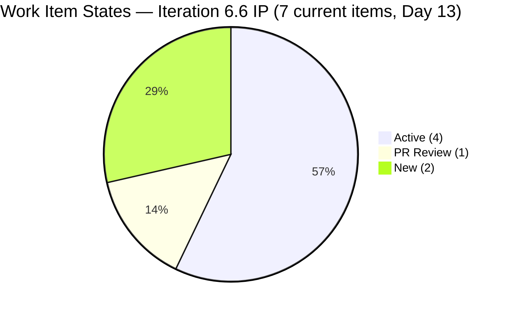
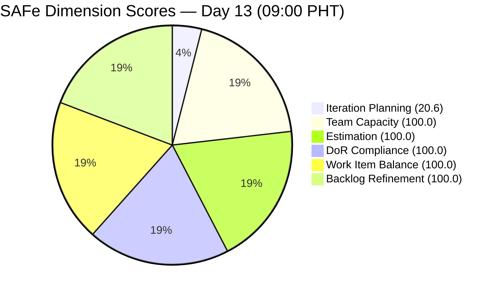
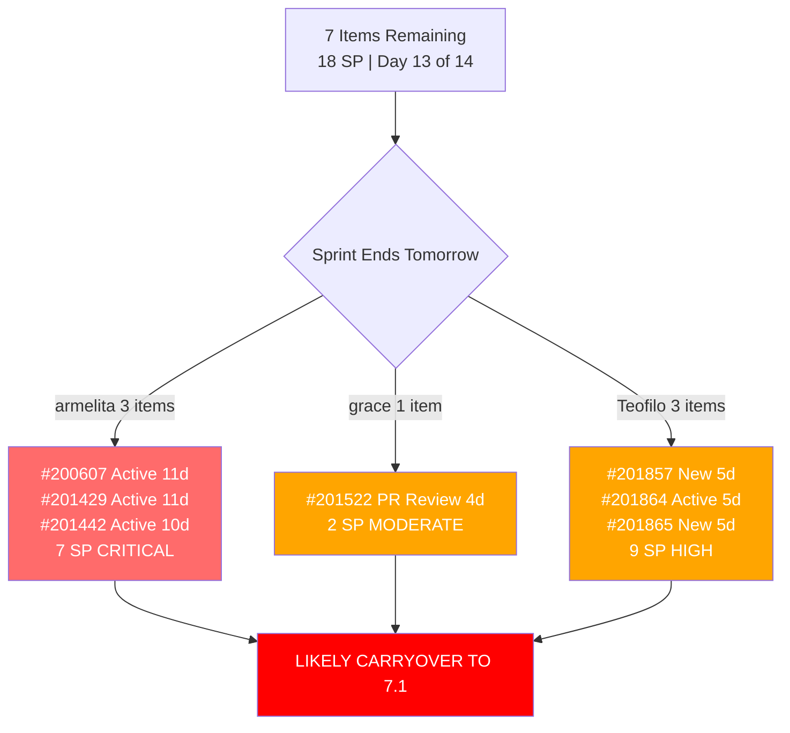

# SAFe Audit Report — JIT Operation Team | Iteration 6.6 (IP) Day 13

## 1. Audit Metadata

| Field | Value |
|---|---|
| **Project** | Jairosoft Portfolio |
| **Project ID** | `666bb99a-6acd-4999-bb34-efd0e4ea90dc` |
| **Team** | JIT Operation Team |
| **Team ID** | `b25e3129-6272-4e54-a3ff-f1ef3c8eeb2c` |
| **Workspace Folder** | `ado_jit` |
| **Current Iteration** | Iteration 6.6 (IP) |
| **Iteration Path** | `Jairosoft Portfolio\2026-PI6\Iteration 6.6 (IP)` |
| **Iteration ID** | `1df8c8f8-f0ed-4ee1-9244-cdd5c88b3c4a` |
| **Iteration Start** | March 23, 2026 |
| **Iteration Finish** | April 5, 2026 |
| **Iteration Day** | Day 13 of 14 (93% elapsed) |
| **Audit Date** | April 4, 2026 — 09:00 PHT |
| **Auditor** | AI EngProd Consultant |
| **Framework** | SAFe 6.0 |
| **Scoring Rubric** | ADO SAFe v1 (six-dimension deterministic) |
| **Previous Audit** | AUDIT_20260402_0900.md (Day 11, Score: 82.8/100) |
| **Overall Score** | **86.8 / 100** |
| **Risk Band** | **Low Risk** |
| **Board URL** | [ADO Board](https://dev.azure.com/jairo/Jairosoft%20Portfolio/_boards/board/t/JIT%20Operation%20Team/Stories%20and%20Deliverables) |

---

## 2. Executive Summary

This is the **ninth audit of Iteration 6.6 (IP)** and the first on Day 13. The JIT Operation Team score is **86.8/100 (Low Risk)**, up **+4.0 points** from the Day 11 audit (82.8).

**Two items were moved out of the current iteration to PI7 Iteration 7.1 on April 3:**

- **#201504** (School Engagement & Flyering, grace, 2 SP) — moved to Iteration 7.1, state remains Active
- **#201514** ("Free Discovery Day" Event, grace, 2 SP) — moved to Iteration 7.1, state remains Active

This reduces the current iteration from 9 to **7 items (18 SP)**. The score increase comes from an improved **Work Item Balance** dimension: User Story share dropped from 66.7% to 57.1% (below the 60% penalty threshold), gaining 30 points on that dimension. Iteration Planning dropped slightly from 26.5 to 20.6 as the ratio worsened (7/34 vs 9/34).

The remaining 7 items show continued stagnation: armelita's 3 items are now **11 days stale** (unchanged since Mar 24-25), Teofilo's 2 New items are **5 days stale**, and only #201522 (PR Review) showed recent activity before Mar 31. The IP iteration ends tomorrow.

---

## 3. Previous Audit Delta

**Previous:** AUDIT_20260402_0900 — Iteration 6.6 (IP) Day 11, 09:00 PHT

| Metric | Prior (Day 11) | **This Audit (Day 13)** | Delta |
|---|---|---|---|
| **Overall Score** | 82.8 | **86.8** | **+4.0** |
| **Risk Band** | Low Risk | Low Risk | Stable |
| **Visible Backlog** | 34 | **34** | 0 |
| **Iteration Items (on backlog)** | 9 | **7** | **-2** |
| **Items Active** | 6 | **4** | **-2** |
| **Items PR Review** | 1 | **1** | 0 |
| **Items New** | 2 | **2** | 0 |
| **Total SP (current on backlog)** | 22 | **18** | **-4** |
| **Iteration Planning** | 26.5 | **20.6** | **-5.9** |
| **Work Item Balance** | 70.0 | **100.0** | **+30.0** |
| **All other dimensions** | Same | **Same** | 0 |

**Key changes:**

1. **#201504 and #201514 moved to Iteration 7.1** (April 3) — grace's 2 Active items de-committed from 6.6 IP to PI7. Both items were updated on Apr 3 (changed from 6.6 to 7.1).
2. **Work Item Balance improved** — User Story share dropped from 66.7% (6/9) to 57.1% (4/7), removing the -30 dominant type penalty.
3. **Iteration Planning worsened** — ratio dropped from 9/34 to 7/34.
4. **No items closed** — zero closures since the last audit.

---

## 4. Current Iteration Snapshot

### Sprint Scope

| Metric | Value |
|---|---|
| **Items in iteration (on backlog)** | 7 |
| **User Stories** | 4 |
| **Training** | 3 |
| **Spikes** | 0 (all 3 closed previously) |
| **Total Story Points (current)** | 18 SP |
| **Unestimated items** | 0 |
| **Items Closed (iteration total)** | 14 (24 SP) |
| **Items De-committed (this audit)** | 2 (4 SP) — #201504, #201514 to 7.1 |
| **Iteration type** | IP (Innovation & Planning) |
| **Iteration elapsed** | 93% (Day 13 of 14) |

### State Distribution

| State | Count | Items |
|---|---|---|
| **Active** | 4 | #200607, #201429, #201442, #201864 |
| **PR Review** | 1 | #201522 |
| **New** | 2 | #201857, #201865 |

### Team Capacity

| Member | Capacity/Day | Activity | Items in 6.6 | SP | Status | Days Stale |
|---|---|---|---|---|---|---|
| **armelita** | 6 hrs | Documentation | 3 | 7 SP | 3 Active | **11 days** |
| **grace** | 2 hrs | Documentation | 1 | 2 SP | 1 PR Review | **4 days** |
| **Teofilo Limpag** | 6 hrs | Training | 3 | 9 SP | 1 Active, 2 New | **5 days** |
| **Samantha Babael** | 1 hr | Documentation | 0 | 0 SP | All 3 Spikes closed | Idle |
| **TOTAL** | **15 hrs/day** | -- | **7** | **18 SP** | | |

> Grace's workload reduced from 3 to 1 item in the current iteration after de-commitment of #201504 and #201514.
> Samantha has no remaining items in the iteration. Her 3 Spikes are all Closed.

### Full Inventory — Iteration 6.6 (7 Current Backlog Items)

| ID | Type | Title (abbreviated) | State | Assigned | SP | Changed | Days Stale |
|---|---|---|---|---|---|---|---|
| #200607 | User Story | Bubble MCC Marketing Activities | Active | armelita | 2 | Mar 24 | **11** |
| #201429 | User Story | TESDA Action Catalog | Active | armelita | 2 | Mar 24 | **11** |
| #201442 | User Story | Market CSS NC II April 2026 Class | Active | armelita | 3 | Mar 25 | **10** |
| #201522 | User Story | Lead Tracking & Follow-up | PR Review | grace | 2 | Mar 31 | **4** |
| #201857 | Training | 2.1-1 Network Design Discussion | New | Teofilo | 3 | Mar 30 | **5** |
| #201864 | Training | 2.4-2 Computer Networks Safe Operation | Active | Teofilo | 3 | Mar 30 | **5** |
| #201865 | Training | 2.4-3 Prepare/Complete Reports | New | Teofilo | 3 | Mar 30 | **5** |

### Items De-committed to PI7 Iteration 7.1 (Apr 3)

| ID | Type | Title | SP | Assigned | New Iteration |
|---|---|---|---|---|---|
| #201504 | User Story | School Engagement & Flyering | 2 | grace | Iteration 7.1 |
| #201514 | User Story | "Free Discovery Day" Event | 2 | grace | Iteration 7.1 |

### Items Closed in Iteration 6.6 (Removed from Backlog — 14 items, 24 SP)

| ID | Type | Title | SP | Assigned | Closed |
|---|---|---|---|---|---|
| #200264 | User Story | St. Mary Bansalan Interns Final Demo | 2 | armelita | Mar 29 |
| #200566 | User Story | TESDA Compliance Additional Trainer | 1 | armelita | Mar 31 |
| #200589 | User Story | CSS NC II Enrollment Report | 1 | armelita | Mar 31 |
| #200611 | User Story | UM Matina Intern Onboarding | 1 | armelita | Mar 31 |
| #201377 | Spike | Prepare Certificate for Interns | 1 | Samantha | Mar 26 |
| #201493 | User Story | TESDA SM Microcredential Submission | 2 | grace | Mar 31 |
| #201774 | Spike | Social Media Post St. Mary's Interns | 0 | Samantha | Apr 1 |
| #201899 | Spike | Prepare UIC Interns Certificates | 0 | Samantha | Apr 1 |
| #202008 | Spike | UIC Interns Social Media Post | 0 | Samantha | Apr 1 |
| #201859 | Training | 2.1-1 Network Design | 3 | Teofilo | Mar 30 |
| #201860 | Training | 2.1-2 Network Materials | 3 | Teofilo | Mar 30 |
| #201861 | Training | 2.2-1 Network Configuration | 3 | Teofilo | Mar 30 |
| #201862 | Training | 2.3-1 Router/WiFi Config | 3 | Teofilo | Mar 30 |
| #201863 | Training | 2.4-1 Manufacturer Instructions | 3 | Teofilo | Mar 30 |
| **Total** | | | **24 SP** | | |

---

## 5. Work Item Analysis

### Work Item Type Distribution (7 Current Items)

| Type | Count | Share | SP |
|---|---|---|---|
| User Story | 4 | 57.1% | 9 SP |
| Training | 3 | 42.9% | 9 SP |
| Spike | 0 | 0% | 0 SP |
| **Total** | **7** | **100%** | **18 SP** |

### DoR Compliance Assessment

All 7 items pass DoR:

- All descriptions exceed 30 non-whitespace characters
- All acceptance criteria exceed 20 non-whitespace characters

**Note:** Item #193239 (SAFe AI Native Foundation Courseware) on the broader backlog is missing Description and Acceptance Criteria but is not in the current iteration.

### Freshness Assessment (All 34 Visible Backlog Items)

| Metric | Value | Status |
|---|---|---|
| Fresh (< 45 days, after Feb 18) | 34/34 (100%) | Base = 100.0 |
| Stale-90 (before Jan 4, 2026) | 0 | No penalty |
| Stale-180 (before Oct 7, 2025) | 0 | No penalty |
| Untouched current items (changed before Mar 23) | 0/7 (0%) | No penalty |

---

## 6. SAFe Compliance Scorecard

| # | Dimension | Score | Evidence | Notes |
|---|---|---|---|---|
| 1 | **Iteration Planning** | **20.6** | 7 of 34 visible backlog items in current iteration | Down from 26.5 (2 items de-committed) |
| 2 | **Team Capacity** | **100.0** | 3/3 contributors with work have capacity configured | Unchanged |
| 3 | **Estimation** | **100.0** | 7/7 items estimated | Unchanged |
| 4 | **DoR Compliance** | **100.0** | 7/7 items pass Description >= 30 AND AC >= 20 | Unchanged |
| 5 | **Work Item Balance** | **100.0** | User Story 57.1% <= 60%; no penalties | **Up from 70.0** (+30) |
| 6 | **Backlog Refinement** | **100.0** | 34/34 fresh; 0 stale; 0/7 untouched | Unchanged |
| | **Overall** | **86.8** | Average of 6 dimensions | **Low Risk** (>= 80) — **Up +4.0** |

### Score Computation Detail

| Dimension | Formula | Calculation | Result |
|---|---|---|---|
| Iteration Planning | current / visible x 100 | 7 / 34 x 100 | 20.6 |
| Team Capacity | cap_with_work / work_assignees x 100 | 3 / 3 x 100 | 100.0 |
| Estimation | estimated / point_eligible x 100 | 7 / 7 x 100 | 100.0 |
| DoR Compliance | dor_compliant / current x 100 | 7 / 7 x 100 | 100.0 |
| Work Item Balance | 100 - penalties | 100 - 0 (US 57.1% <= 60%) | 100.0 |
| Backlog Refinement | base - penalties | 100.0 - 0 | 100.0 |
| **Overall** | average(all 6) | (20.6+100+100+100+100+100)/6 | **86.8** |

### Score History — Iteration 6.6 (IP)

| Audit | Date | Day | Score | Band | Key Change |
|---|---|---|---|---|---|
| Day 4 | Mar 26 (1630) | Day 4 | 85.3 | Low Risk | First audit this iteration |
| Day 5 | Mar 27 (0701) | Day 5 | 84.5 | Low Risk | #201774 Spike unestimated |
| Day 8 (AM) | Mar 30 (0900) | Day 8 | 84.0 | Low Risk | Teofilo activated; 2nd unestimated Spike |
| Day 8 (PM) | Mar 30 (1015) | Day 8 | 84.0 | Low Risk | No changes since AM audit |
| Day 9 | Mar 31 (0900) | Day 9 | 85.3 | Low Risk | 4 closures; 2 items moved to 7.1; WIB to 100 |
| Day 10 | Apr 1 (0900) | Day 10 | 82.8 | Low Risk | 14 closures total; Spikes closed; WIB back to 70 |
| Day 11 | Apr 2 (0900) | Day 11 | 82.8 | Low Risk | No changes; board frozen 24h |
| **Day 13** | **Apr 4 (0900)** | **Day 13** | **86.8** | **Low Risk** | **2 items de-committed to 7.1; WIB to 100** |

---

## 7. Dimension Findings

### 7.1 Iteration Planning (20.6/100) — DOWN (-5.9)

7 of 34 visible backlog items are in the current iteration, down from 9/34. The de-commitment of #201504 and #201514 to PI7 reduced this ratio further. This dimension remains structurally constrained by the IP iteration model with a large non-current backlog of Courseware, Training, and PI7 items.

### 7.2 Team Capacity (100.0/100) — FULL

Three contributors with current iteration work (armelita 6h, grace 2h, Teofilo 6h) all have capacity configured. Unchanged. Grace's current iteration workload reduced from 3 to 1 item.

### 7.3 Estimation (100.0/100) — FULL

All 7 current items have Story Points > 0. Unchanged.

### 7.4 DoR Compliance (100.0/100) — FULL

All 7 items pass DoR. Ninth consecutive audit at 100.0.

### 7.5 Work Item Balance (100.0/100) — IMPROVED (+30)

User Story share dropped from 66.7% (6/9) to 57.1% (4/7) after de-commitment of 2 User Stories. This removed the -30 dominant type penalty. The type mix is now more balanced between User Story (57.1%) and Training (42.9%). **Series high for this dimension.**

### 7.6 Backlog Refinement (100.0/100) — PERFECT

All 34 visible items fresh. Zero stale items. Zero untouched current items. Perfect score for the ninth consecutive audit.

---

## 8. Risks and Bottlenecks

| # | Risk | Severity | Evidence | Recommended Action |
|---|---|---|---|---|
| R1 | **Armelita's 3 Active items unchanged 10-11 days** | **CRITICAL** | #200607 (Mar 24), #201429 (Mar 24), #201442 (Mar 25) — no updates in 10-11 days; iteration ends tomorrow | Close or carry to 7.1 TODAY |
| R2 | **#201857, #201865 (Training) still New — 5 days** | **HIGH** | 2 of Teofilo's 3 items are New since Mar 30. Iteration ends tomorrow. | Move to Active or de-commit to 7.1 |
| R3 | **#201522 (PR Review) unchanged 4 days** | **MODERATE** | grace's last remaining current item; in PR Review since Mar 31 | Close TODAY if review is complete |
| R4 | **7 items likely to carry over** | **HIGH** | With iteration ending tomorrow and no closures in 3+ days, all 7 items will likely carry | Plan carryover to 7.1 |
| R5 | **Iteration Planning structurally low (20.6)** | LOW (Structural) | IP iteration; large non-current backlog by design | Not actionable without scope inflation |
| R6 | **Samantha idle for remainder of sprint** | LOW | All 3 Spikes completed; no remaining items | Capacity available for PI7 prep |

---

## 9. Prioritized Recommendations

| Priority | Action | Owner | Impact | Target |
|---|---|---|---|---|
| **P0** | **Close #201522 (Lead Tracking) TODAY** — in PR Review for 4 days. Grace's only remaining current item. If review is complete, close it. | grace | Demonstrates throughput before sprint end | **TODAY** |
| **P1** | **De-commit or close armelita's 3 items** — 10-11 days stale with sprint ending tomorrow. If work is not complete, move to 7.1. If complete, update state and close. | armelita | Resolves the longest stagnation in the sprint | **TODAY** |
| **P2** | **Resolve Teofilo's 2 New items** — #201857 and #201865 should be activated or de-committed to 7.1. Cannot remain in New at sprint end. | Teofilo | Eliminates New items at sprint close | **TODAY** |
| **P3** | **Plan carryover to 7.1** — All 7 remaining items should be triaged: close if done, carry to 7.1 if not. | Armelita (PO) | Clean sprint close | **TODAY** |
| **P4** | **Celebrate de-commitment discipline** — Moving #201504 and #201514 to PI7 proactively shows good IP planning behavior. | Team | Positive reinforcement | Retrospective |
| **P5** | **Begin PI7 planning for Iteration 7.1** — Define sprint goal, assign items, review capacity. | Armelita (PO) | Smooth PI transition | **Monday** |

---

## 10. Evidence Gaps and Limitations

| # | Gap | Impact | Mitigation |
|---|---|---|---|
| G1 | **IP iteration planning score structurally low** | 20.6 does not indicate planning failure; IP iterations carry lighter loads by design | Documented; expected for IP structure |
| G2 | **Closed items not visible in backlog** | 14 closures confirmed via prior audit and iteration API | Cross-referenced with Day 11 audit data |
| G3 | **Armelita's items unchanged 10-11 days** | Cannot determine if work is progressing without state updates | Recommend daily state updates |
| G4 | **De-committed items counted as positive WIB change** | Score improvement (+4.0) partly driven by de-commitment, not delivery | Documented; WIB formula is ratio-based |
| G5 | **#193239 missing Description and AC** | DoR non-compliant on broader backlog (not in current iteration) | Flag for backlog grooming |
| G6 | **No iteration goal documented** | Cannot verify sprint goal via API | Structural gap across all audits |

---

*Report generated: April 4, 2026 09:00 PHT | SAFe 6.0 Framework | ADO SAFe v1 Rubric*
*Jairosoft Portfolio — JIT Operation Team | Iteration 6.6 (IP): Mar 23 - Apr 5, 2026*
*Overall Score: 86.8/100 (Low Risk) | Day 13 of 14 (93% elapsed)*
*Previous: AUDIT_20260402_0900.md (Day 11, 82.8/100) | +4.0 change*
*2 items de-committed to PI7 7.1 (Apr 3); 7 items remain (18 SP); armelita 3 items stale 10-11 days (CRITICAL)*
*Sprint ends tomorrow — all 7 remaining items likely to carry over to Iteration 7.1*
