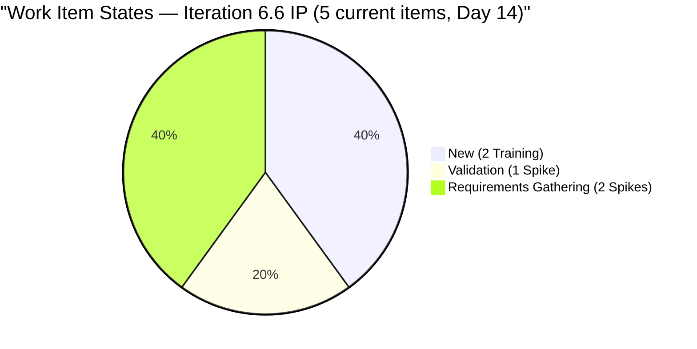
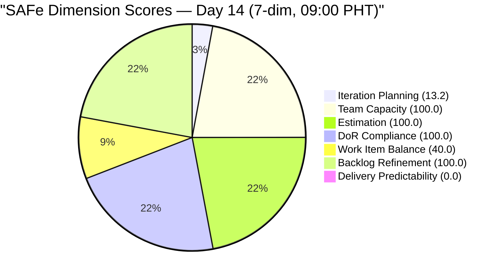
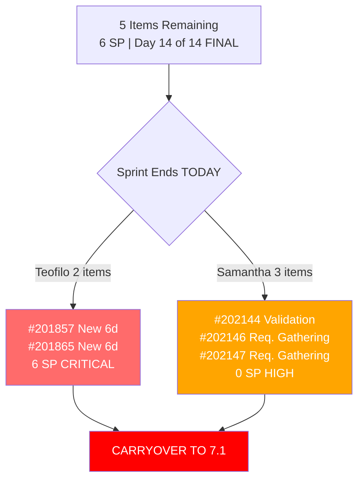

# SAFe Audit Report — JIT Operation Team | Iteration 6.6 (IP) Day 14 (FINAL)

## 1. Audit Metadata

| Field | Value |
|---|---|
| **Project** | Jairosoft Portfolio |
| **Project ID** | `666bb99a-6acd-4999-bb34-efd0e4ea90dc` |
| **Team** | JIT Operation Team |
| **Team ID** | `b25e3129-6272-4e54-a3ff-f1ef3c8eeb2c` |
| **Workspace Folder** | `ado_jit` |
| **Current Iteration** | Iteration 6.6 (IP) |
| **Iteration Path** | `Jairosoft Portfolio\2026-PI6\Iteration 6.6 (IP)` |
| **Iteration ID** | `1df8c8f8-f0ed-4ee1-9244-cdd5c88b3c4a` |
| **Iteration Start** | March 23, 2026 |
| **Iteration Finish** | April 5, 2026 |
| **Iteration Day** | Day 14 of 14 (**100% elapsed — final day**) |
| **Audit Date** | April 5, 2026 — 09:00 PHT |
| **Auditor** | AI EngProd Consultant |
| **Framework** | SAFe 6.0 |
| **Scoring Rubric** | ADO SAFe v1 (seven-dimension deterministic scoring) |
| **Previous Audit** | AUDIT_20260404_0900.md (Day 13, Score: 86.8/100, 6-dim) |
| **Overall Score** | **64.7 / 100** |
| **Risk Band** | **Moderate Risk** |
| **Board URL** | [ADO Board](https://dev.azure.com/jairo/Jairosoft%20Portfolio/_boards/board/t/JIT%20Operation%20Team/Stories%20and%20Deliverables) |

---

## 2. Executive Summary

This is the **tenth and final audit of Iteration 6.6 (IP)** on the last sprint day. The JIT Operation Team score is **64.7/100 (Moderate Risk)**, down **-22.1 points** from the Day 13 audit (86.8/100, 6-dimension rubric).

The score drop is driven by two factors:
1. **Rubric change from 6 to 7 dimensions** — the new Delivery Predictability dimension scores 0.0 (no closed items among the 5 remaining current items), which pulls the average down significantly.
2. **Board changes since Day 13** — the current iteration now has **5 items** (down from 7). Two items from the previous audit (#200607 Bubble MCC Marketing and #201429 TESDA Action Catalog — armelita's Active items) are no longer on the backlog in 6.6 IP. Three new Spikes were added by Samantha (#202144, #202146, #202147) in various non-closed states. Grace's #201522 (PR Review) and armelita's #201442 are also no longer visible on the current backlog.

The backlog grew from 34 to **38 visible items** with significant PI7 planning activity: 18 items are now in Iteration 7.1, and new items have been assigned to 7.2, 7.4, and 7.5.

---

## 3. Previous Audit Delta

**Previous:** AUDIT_20260404_0900 — Iteration 6.6 (IP) Day 13, 09:00 PHT

| Metric | Prior (Day 13, 6-dim) | **This Audit (Day 14, 7-dim)** | Delta |
|---|---|---|---|
| **Overall Score** | 86.8 | **64.7** | **-22.1** |
| **Risk Band** | Low Risk | **Moderate Risk** | Downgraded |
| **Visible Backlog** | 34 | **38** | **+4** |
| **Iteration Items (on backlog)** | 7 | **5** | **-2** |
| **Items Active** | 4 | **0** | **-4** |
| **Items New** | 2 | **2** | 0 |
| **Items Validation** | 0 | **1** | **+1** |
| **Items Req. Gathering** | 0 | **2** | **+2** |
| **Total SP (current on backlog)** | 18 | **6** | **-12** |
| **Iteration Planning** | 20.6 | **13.2** | **-7.4** |
| **Work Item Balance** | 100.0 | **40.0** | **-60.0** |
| **Delivery Predictability** | N/A | **0.0** | New dimension |

**Key changes:**
1. **5 items removed from current iteration backlog view** — armelita's 3 items (#200607, #201429, #201442) and grace's #201522 likely closed or moved. #201864 (Teofilo, Active) also removed.
2. **3 new Spikes added by Samantha** (#202144 Validation, #202146 Req. Gathering, #202147 Req. Gathering) — all in 6.6 IP, all unestimated (no SP).
3. **Backlog grew to 38** — new PI7 items added for 7.1, 7.4, 7.5.
4. **Score drop of 22.1 points** — primarily due to 7-dim rubric adding DP=0, and WIB dropping from 100 to 40 (no User Stories in current, spike share 60%).

---

## 4. Current Iteration Snapshot

### Sprint Scope

| Metric | Value |
|---|---|
| **Items in iteration (on backlog)** | 5 |
| **Training** | 2 |
| **Spike** | 3 |
| **User Story** | 0 |
| **Total Story Points (point-eligible current)** | 6 SP (Training items only) |
| **Unestimated items (Spikes)** | 3 |
| **Items Closed (iteration total, from prior audits)** | 14+ (24 SP) |
| **Iteration type** | IP (Innovation & Planning) |
| **Iteration elapsed** | 100% (Day 14 of 14 — final day) |

### State Distribution

| State | Count | Items |
|---|---|---|
| **New** | 2 | #201857, #201865 (Training, Teofilo) |
| **Validation** | 1 | #202144 (Spike, Samantha) |
| **Requirements Gathering** | 2 | #202146, #202147 (Spike, Samantha) |

### Team Capacity

| Member | Capacity/Day | Activity | Items in 6.6 | SP | Status |
|---|---|---|---|---|---|
| **Teofilo Limpag** | 6 hrs | Training | 2 | 6 SP | 2 New (6 days stale) |
| **Samantha Babael** | 1 hr | Documentation | 3 | 0 SP | 1 Validation, 2 Req. Gathering |
| **armelita** | 6 hrs | Documentation | 0 | 0 SP | Items removed from backlog |
| **grace** | 2 hrs | Documentation | 0 | 0 SP | Items removed from backlog |
| **TOTAL** | **15 hrs/day** | -- | **5** | **6 SP** | |

### Full Inventory — Iteration 6.6 IP (5 Current Backlog Items)

| ID | Type | Title (abbreviated) | State | Assigned | SP | Changed |
|---|---|---|---|---|---|---|
| #201857 | Training | 2.1-1 Network Design Discussion | New | Teofilo | 3 | Mar 30 |
| #201865 | Training | 2.4-3 Prepare/Complete Reports | New | Teofilo | 3 | Mar 30 |
| #202144 | Spike | eLMS Setup & Configuration for CSS NC II | Validation | Samantha | N/A | Apr 6 |
| #202146 | Spike | Develop eLMS Course Content | Req. Gathering | Samantha | N/A | Apr 6 |
| #202147 | Spike | eLMS Platform Testing & Quality Check | Req. Gathering | Samantha | N/A | Apr 6 |

---

## 5. Work Item Analysis

### Work Item Type Distribution (5 Current Items)

| Type | Count | Share | SP |
|---|---|---|---|
| Training | 2 | 40.0% | 6 SP |
| Spike | 3 | 60.0% | 0 SP |
| User Story | 0 | 0% | 0 SP |
| **Total** | **5** | **100%** | **6 SP** |

### DoR Compliance Assessment

All 5 items pass DoR:
- #201857: Description 304 NW chars, AC 521 NW chars
- #201865: Description 352 NW chars, AC 660 NW chars
- #202144: Description 251 NW chars, AC 303 NW chars
- #202146: Description 274 NW chars, AC 536 NW chars
- #202147: Description 256 NW chars, AC 530 NW chars

### Freshness Assessment (All 38 Visible Backlog Items)

| Metric | Value | Status |
|---|---|---|
| Fresh (< 45 days, after Feb 19) | 38/38 (100%) | Base = 100.0 |
| Stale-90 (before Jan 5, 2026) | 0 | No penalty |
| Stale-180 (before Oct 7, 2025) | 0 | No penalty |
| Untouched current items (changed before Mar 23) | 0/5 (0%) | No penalty |

---

## 6. SAFe Compliance Scorecard

| # | Dimension | Score | Evidence | Notes |
|---|---|---|---|---|
| 1 | **Iteration Planning** | **13.2** | 5 of 38 visible backlog items in current iteration | Down from 20.6 (items removed, backlog grew) |
| 2 | **Team Capacity** | **100.0** | 2/2 contributors with current work have capacity | Teofilo 6h, Samantha 1h |
| 3 | **Estimation** | **100.0** | 2/2 point-eligible items estimated (Training only) | Spikes excluded from point-eligible |
| 4 | **DoR Compliance** | **100.0** | 5/5 items pass Desc >= 30 AND AC >= 20 | All items well-documented |
| 5 | **Work Item Balance** | **40.0** | 100 - 40 (no US) - 20 (spike 60%) | No User Stories; spike share at threshold |
| 6 | **Backlog Refinement** | **100.0** | 38/38 fresh; 0 stale; 0/5 untouched | Perfect freshness |
| 7 | **Delivery Predictability** | **0.0** | 0/6 committed SP closed | 0 items in Closed/Done state |
| | **Overall** | **64.7** | Average of 7 dimensions | **Moderate Risk** (60-79.9) |

### Score Computation Detail

| Dimension | Formula | Calculation | Result |
|---|---|---|---|
| Iteration Planning | current / visible x 100 | 5 / 38 x 100 | 13.2 |
| Team Capacity | cap_with_work / work_assignees x 100 | 2 / 2 x 100 | 100.0 |
| Estimation | estimated / point_eligible x 100 | 2 / 2 x 100 | 100.0 |
| DoR Compliance | dor_compliant / current x 100 | 5 / 5 x 100 | 100.0 |
| Work Item Balance | 100 - penalties | 100 - 40 (no US) - 20 (spike 60%) | 40.0 |
| Backlog Refinement | base - penalties | 100.0 - 0 | 100.0 |
| Delivery Predictability | closed_SP / committed_SP x 100 | 0 / 6 x 100 | 0.0 |
| **Overall** | average(all 7) | (13.2+100+100+100+40+100+0)/7 | **64.7** |

### Score History — Iteration 6.6 (IP)

| Audit | Date | Day | Score | Rubric | Band | Key Change |
|---|---|---|---|---|---|---|
| Day 4 | Mar 26 (1630) | Day 4 | 85.3 | 6-dim | Low Risk | First audit this iteration |
| Day 5 | Mar 27 (0701) | Day 5 | 84.5 | 6-dim | Low Risk | Spike unestimated |
| Day 8 (AM) | Mar 30 (0900) | Day 8 | 84.0 | 6-dim | Low Risk | Teofilo activated |
| Day 8 (PM) | Mar 30 (1015) | Day 8 | 84.0 | 6-dim | Low Risk | No changes |
| Day 9 | Mar 31 (0900) | Day 9 | 85.3 | 6-dim | Low Risk | 4 closures; WIB to 100 |
| Day 10 | Apr 1 (0900) | Day 10 | 82.8 | 6-dim | Low Risk | 14 closures total |
| Day 11 | Apr 2 (0900) | Day 11 | 82.8 | 6-dim | Low Risk | Board frozen |
| Day 13 | Apr 4 (0900) | Day 13 | 86.8 | 6-dim | Low Risk | 2 de-committed; WIB to 100 |
| **Day 14** | **Apr 5 (0900)** | **Day 14** | **64.7** | **7-dim** | **Moderate** | **3 new Spikes; 7-dim rubric; DP=0** |

---

## 7. Dimension Findings

### 7.1 Iteration Planning (13.2/100) — DOWN (-7.4)

5 of 38 visible backlog items are in the current iteration, down from 7/34. Several items were removed from the 6.6 IP backlog (likely closed or moved), while 3 new Spikes were added. The backlog grew by 4 items due to PI7 planning additions. This dimension remains structurally low for IP iterations with large non-current backlogs.

### 7.2 Team Capacity (100.0/100) — FULL

Two contributors with current iteration work (Teofilo 6h Training, Samantha 1h Documentation) both have capacity configured. Armelita and grace no longer have items in the current iteration.

### 7.3 Estimation (100.0/100) — FULL

Both point-eligible items (Training type: #201857, #201865) have Story Points > 0 (3 SP each). Spikes (#202144, #202146, #202147) do not expose Story Points and are excluded from this dimension.

### 7.4 DoR Compliance (100.0/100) — FULL

All 5 current items pass DoR with substantial documentation. Minimum description is 251 non-whitespace chars (#202144), minimum AC is 303 non-whitespace chars (#202144). Tenth consecutive audit at 100.0.

### 7.5 Work Item Balance (40.0/100) — DROPPED (-60.0)

Two penalties apply:
- **-40**: No User Story items in the current iteration (only Training and Spike)
- **-20**: Spike share at 60% (3/5 items), which equals the >40% threshold

This is the lowest WIB score in the iteration series. The removal of User Stories from the current backlog and addition of 3 Spikes significantly shifted the type distribution.

### 7.6 Backlog Refinement (100.0/100) — PERFECT

All 38 visible items are fresh. Zero stale items. Zero untouched current items (Teofilo's items changed Mar 30, Samantha's Apr 6). Perfect score for the tenth consecutive audit.

### 7.7 Delivery Predictability (0.0/100) — ZERO

committed_story_points = 6 SP (from 2 Training items). closed_story_points = 0 SP (no items in Closed/Done state among the 5 current items). Score = 0/6 x 100 = 0.0.

**Context:** The iteration previously closed 14 items (24 SP), but those are no longer on the backlog. The 5 remaining items were never completed. Teofilo's 2 Training items have been in New state since Mar 30 (6 days). Samantha's 3 Spikes were just added today. This is a genuine delivery gap for the remaining items, not purely a scoring artifact.

---

## 8. Risks and Bottlenecks

| # | Risk | Severity | Evidence | Recommended Action |
|---|---|---|---|---|
| R1 | **Teofilo's 2 Training items still New — 6 days** | **CRITICAL** | #201857, #201865 unchanged since Mar 30; iteration ends today | Carry to 7.1 — cannot close today |
| R2 | **3 new Spikes added on final day** | **HIGH** | #202144, #202146, #202147 added by Samantha today; cannot complete in 0 days | Carry to 7.1 or close as discovery |
| R3 | **0% delivery predictability on remaining items** | **HIGH** | 0/6 committed SP closed; 5/5 items incomplete | All 5 items will carry over |
| R4 | **Work Item Balance severely penalized** | **MODERATE** | No User Stories in current iteration; spike-heavy | Structural issue at sprint close |
| R5 | **Iteration Planning structurally low (13.2)** | LOW (Structural) | IP iteration; large non-current backlog | Expected for IP structure |

---

## 9. Prioritized Recommendations

| Priority | Action | Owner | Impact | Target |
|---|---|---|---|---|
| **P0** | **Carry Teofilo's 2 Training items to 7.1** — #201857 and #201865 have been New for 6 days. Move to Iteration 7.1 for completion. | Armelita (PO) | Clean sprint close | **TODAY** |
| **P1** | **Resolve Samantha's 3 Spikes** — #202144 (Validation), #202146, #202147 (Req. Gathering) were just added today. Decide: close as completed discovery, or carry to 7.1. | Armelita (PO) | Removes ambiguity | **TODAY** |
| **P2** | **Plan Iteration 7.1 sprint goal** — With 18+ items already in 7.1, define a clear sprint goal and prioritize. | Armelita (PO) | Smooth PI transition | **Monday** |
| **P3** | **Celebrate iteration delivery** — 14+ items closed (24+ SP) during 6.6 IP despite IP being planning-focused. Strong throughput. | Team | Positive reinforcement | Retrospective |
| **P4** | **Address WIB diversity** — Ensure 7.1 has User Stories alongside Training and Spikes for better type balance. | Armelita (PO) | Score improvement | **Monday** |

---

## 10. Evidence Gaps and Limitations

| # | Gap | Impact | Mitigation |
|---|---|---|---|
| G1 | **Rubric change from 6-dim to 7-dim** | Score drops 22.1 points; not directly comparable to prior audits | Documented in score history with rubric column |
| G2 | **Closed items removed from backlog** | 14+ closures (24+ SP) not visible; DP cannot credit prior delivery | Cross-referenced with Day 13 audit |
| G3 | **Items disappeared from current backlog** | armelita's 3 items and grace's 1 item no longer in 6.6 IP | Likely closed or moved to 7.1; state change not captured |
| G4 | **3 Spikes added on final day** | Cannot determine if work was done earlier and just tracked now | Spikes may represent completed research |
| G5 | **IP iteration planning score structurally low** | 13.2 does not indicate planning failure; IP iterations carry lighter loads | Documented; expected for IP structure |
| G6 | **#193239 missing Description and AC** | DoR non-compliant on broader backlog (not in current iteration) | Flag for backlog grooming |
| G7 | **No iteration goal documented** | Cannot verify sprint goal via API | Structural gap across all audits |

---

*Report generated: April 5, 2026 09:00 PHT | SAFe 6.0 Framework | ADO SAFe v1 (seven-dimension deterministic scoring)*
*Jairosoft Portfolio — JIT Operation Team | Iteration 6.6 (IP): Mar 23 - Apr 5, 2026*
*Overall Score: 64.7/100 (Moderate Risk) | Day 14 of 14 (FINAL DAY)*
*Previous: AUDIT_20260404_0900.md (Day 13, 86.8/100, 6-dim) | -22.1 change (rubric + board changes)*
*5 items remain (6 SP): Teofilo 2 Training (New 6d), Samantha 3 Spikes (added today)*
*All 5 items expected to carry over to Iteration 7.1 | PI7 planning underway (18+ items in 7.1)*
