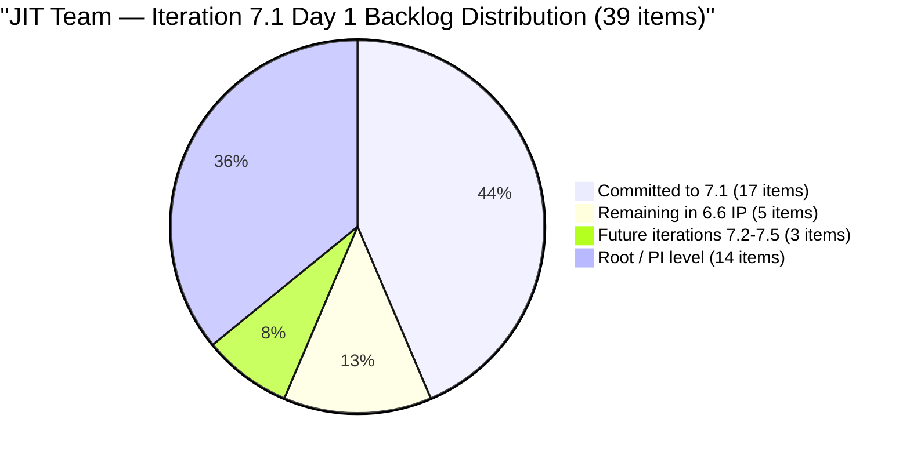
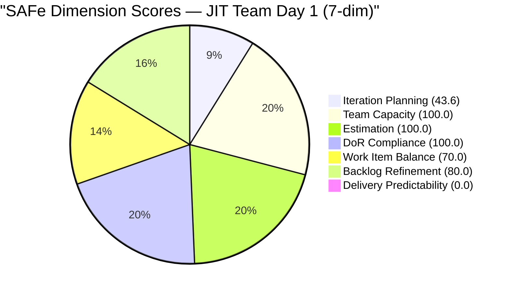
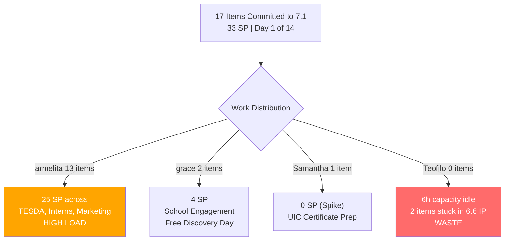

# SAFe Audit Report — JIT Operation Team | Iteration 7.1 Day 1

## 1. Audit Metadata

| Field | Value |
|-------|-------|
| **Project** | Jairosoft Portfolio |
| **Project ID** | `666bb99a-6acd-4999-bb34-efd0e4ea90dc` |
| **Team** | JIT Operation Team |
| **Team ID** | `b25e3129-6272-4e54-a3ff-f1ef3c8eeb2c` |
| **Workspace Folder** | `ado_jit` |
| **Board URL** | [Stories and Deliverables](https://dev.azure.com/jairo/Jairosoft%20Portfolio/_boards/board/t/JIT%20Operation%20Team/Stories%20and%20Deliverables) |
| **Current Iteration** | Iteration 7.1 |
| **Iteration Path** | `Jairosoft Portfolio\2026-PI7\Iteration 7.1` |
| **Iteration ID** | `6079f2b6-2f7c-4b10-adfd-93071eb965f7` |
| **Iteration Start** | April 6, 2026 |
| **Iteration Finish** | April 19, 2026 |
| **Sprint Day** | Day 1 of 14 (Monday, Apr 6 — **first day**) |
| **Audit Date** | April 6, 2026 — 09:00 PHT |
| **Previous Audit** | `AUDIT_20260405_0900.md` (Iteration 6.6 IP Day 14 Final, Score 64.7/100) |
| **Overall Score** | **70.5 / 100 (Moderate Risk)** |
| **Scoring Rubric** | ADO SAFe v1 (seven-dimension deterministic scoring) |
| **Auditor** | AI EngProd Consultant |
| **Framework** | SAFe 6.0 |

> **Scope note:** This audit covers only the JIT Operation Team board in Jairosoft Portfolio. No other boards, teams, projects, or repositories were analyzed.

---

## 2. Executive Summary

This is the **first audit of Iteration 7.1** — the opening sprint of PI7 for the JIT Operation Team. Today is Sprint Day 1 of 14.

The score improves from **64.7 to 70.5/100 (Moderate Risk)**, a gain of **+5.8 points**. The improvement is driven by increased iteration planning (43.6 vs 13.2) with **17 items committed to 7.1** from a 39-item backlog, and improved Backlog Refinement (80.0 vs 100.0 prior, now with untouched penalty).

The team shows strong PI7 planning:

- **17 items (33 SP)** committed to Iteration 7.1 across 3 contributors
- **Armelita leads with 13 items** (25 SP), Grace has 2 items (4 SP), Samantha has 1 Spike
- **All 4 team members** have capacity configured
- **100% estimation, DoR compliance, and team capacity**

The backlog has grown to **39 visible items**, up from 38 in the prior audit. Five items remain in the completed 6.6 IP iteration and 22 items sit at root/PI level. The **untouched current items** penalty (-20) affects Backlog Refinement, as 10 of 17 items were last changed before the iteration start date.



---

## 3. Previous Audit Delta

**Previous:** AUDIT_20260405_0900 — Iteration 6.6 (IP) Day 14 Final, 09:00 PHT

| Metric | 6.6 IP Day 14 (Apr 5) | **7.1 Day 1 (Apr 6)** | Delta |
|--------|----------------------|----------------------|-------|
| Iteration | 6.6 (IP) Final | **7.1** | New PI, new iteration |
| Visible Backlog | 38 | **39** | **+1** |
| Current Iteration Items | 5 | **17** | **+12** |
| Committed SP | 6 | **33** | **+27** |
| Contributors with work | 2 | **3** | **+1** |
| Overall Score | 64.7 (Moderate) | **70.5 (Moderate)** | **+5.8** |
| Iteration Planning | 13.2 | **43.6** | **+30.4** |
| Team Capacity | 100.0 | **100.0** | 0 |
| Estimation | 100.0 | **100.0** | 0 |
| DoR Compliance | 100.0 | **100.0** | 0 |
| Work Item Balance | 40.0 | **70.0** | **+30.0** |
| Backlog Refinement | 100.0 | **80.0** | **-20.0** |
| Delivery Predictability | 0.0 | **0.0** | 0 (Day 1) |

**Key changes:**

1. **New PI / iteration started** — PI7 Iteration 7.1 replaces 6.6 IP
2. **17 items committed** vs 5 in prior iteration — substantial sprint planning
3. **Work Item Balance improved** — User Stories present (no -40), dominant type penalty only (-30)
4. **Backlog Refinement dropped** — 10/17 current items untouched (changed before Apr 6) triggers -20
5. **1 new item added** — #202352 (TESDA SAFe for Teams) by Grace

---

## 4. Current Iteration Snapshot

### 4.1 Sprint Scope

| Metric | Value |
|--------|-------|
| Iteration | Iteration 7.1 |
| Date Range | April 6 - April 19, 2026 (14 days) |
| Sprint Day | Day 1 of 14 (**0% elapsed**) |
| Items Committed | 17 |
| Items Closed | 0 |
| Story Points Committed | 33 SP |
| SP Burned | 0 SP |
| Sprint Status | **JUST STARTED** |

### 4.2 Team Capacity

| Member | Capacity/Day | Activity | Items in 7.1 | SP | Days Off |
|--------|-------------|----------|---------------|-----|----------|
| **armelita** | 6 hrs | Documentation | 13 | 25 SP | 0 |
| **grace** | 1 hr | Documentation | 2 | 4 SP | 0 |
| **Samantha Babael** | 1 hr | Documentation | 1 | 0 SP | 0 |
| **Teofilo Limpag** | 6 hrs | Training | 0 | 0 SP | 0 |
| **TOTAL** | **14 hrs/day** | | **17** | **33 SP** | |

> **Note:** Teofilo has capacity (6 hrs/day) but no items in 7.1. His 2 Training items (#201857, #201865) remain in 6.6 IP.

### 4.3 State Distribution

| State | Count | Items | SP |
|-------|-------|-------|-----|
| New | 7 | #199092, #200770, #202194, #202203, #202206, #202219, #202237 | 18 SP |
| Active | 3 | #201433, #201504, #201514 | 6 SP |
| Estimation | 2 | #200593, #200597 | 3 SP |
| Ready for Dev | 3 | #197617, #198615, #200604 | 5 SP |
| Grooming | 1 | #202189 | 2 SP |
| Validation | 1 | #202145 (Spike) | 0 SP |

### 4.4 Full Inventory — Iteration 7.1 (17 Current Items)

| # | ID | Type | Title (abbreviated) | State | Assigned | SP | Changed |
|---|---|---|---|---|---|---|---|
| 1 | 201433 | User Story | T2 MIS Employment Report | Active | armelita | 2 | Apr 1 |
| 2 | 200593 | User Story | AC Resubmission Result | Estimation | armelita | 1 | Mar 31 |
| 3 | 200597 | User Story | CSS NC II AC Registration Fee | Estimation | armelita | 2 | Mar 31 |
| 4 | 197617 | User Story | SK Buhangin Partnership | Ready for Dev | armelita | 1 | Mar 24 |
| 5 | 198615 | User Story | Awarding of CSS NC II Certificates | Ready for Dev | armelita | 2 | Mar 24 |
| 6 | 199092 | User Story | TESDA Career Guidance Semestral Report | New | armelita | 2 | Mar 24 |
| 7 | 200604 | User Story | Python Inquiries | Ready for Dev | armelita | 2 | Mar 29 |
| 8 | 200770 | User Story | Cor Jesu Interns Final Demo & Certificates | New | armelita | 2 | Mar 17 |
| 9 | 202189 | User Story | UIC Interns Final Demo - Computer Eng'g | Grooming | armelita | 2 | Apr 6 |
| 10 | 202194 | User Story | UM Main BSIT/BSMMA Onboarding | New | armelita | 2 | Apr 6 |
| 11 | 202203 | User Story | MMCM Interns Onboarding | New | armelita | 2 | Apr 6 |
| 12 | 202206 | User Story | Additional Trainer - Sam Approval Status | New | armelita | 3 | Apr 6 |
| 13 | 202219 | User Story | Market CSS NC II April 2026 Class | New | armelita | 3 | Apr 6 |
| 14 | 202237 | User Story | Market Bubble MCC April 2026 Class | New | armelita | 3 | Apr 6 |
| 15 | 201504 | User Story | School Engagement & Flyering | Active | grace | 2 | Apr 3 |
| 16 | 201514 | User Story | "Free Discovery Day" Event | Active | grace | 2 | Apr 3 |
| 17 | 202145 | Spike | Prepare Certificate for UIC Intern | Validation | Samantha | N/A | Apr 6 |
| | **Total** | | | | | **33 SP** | |

---

## 5. Work Item Analysis

### 5.1 Work Item Type Distribution (17 Current Items)

| Type | Count | Share | SP |
|------|-------|-------|-----|
| User Story | 16 | 94.1% | 33 SP |
| Spike | 1 | 5.9% | 0 SP |
| **Total** | **17** | **100%** | **33 SP** |

### 5.2 DoR Compliance Assessment

All 17 current items pass DoR thresholds:

- All have Description >= 30 non-whitespace characters
- All have Acceptance Criteria >= 20 non-whitespace characters

### 5.3 Freshness Assessment (All 39 Visible Backlog Items)

| Metric | Value | Status |
|--------|-------|--------|
| Fresh (< 45 days, after Feb 19) | 39/39 (100%) | Base = 100.0 |
| Stale-90 (before Jan 6, 2026) | 0 | No penalty |
| Stale-180 (before Oct 8, 2025) | 0 | No penalty |
| Untouched current items (changed before Apr 6) | 10/17 (58.8%) | **-20 penalty (> 30%)** |

**Untouched items (changed before iteration start):**

1. #197617 — Mar 24 (13 days before iteration)
2. #198615 — Mar 24
3. #199092 — Mar 24
4. #200593 — Mar 31
5. #200597 — Mar 31
6. #200604 — Mar 29
7. #200770 — Mar 17 (20 days before iteration)
8. #201433 — Apr 1
9. #201504 — Apr 3
10. #201514 — Apr 3

---

## 6. SAFe Compliance Scorecard

| # | Dimension | Score | Formula | Evidence | Notes |
|---|-----------|-------|---------|----------|-------|
| 1 | **Iteration Planning** | **43.6** | 17/39 x 100 | 17 of 39 visible items in current iteration | 22 items non-current |
| 2 | **Team Capacity** | **100.0** | 3/3 x 100 | 3 contributors with work have capacity | armelita 6h, grace 1h, Samantha 1h |
| 3 | **Estimation** | **100.0** | 16/16 x 100 | All 16 point-eligible items estimated | Spike excluded |
| 4 | **DoR Compliance** | **100.0** | 17/17 x 100 | All items pass Desc >= 30 AND AC >= 20 | Strong documentation |
| 5 | **Work Item Balance** | **70.0** | 100 - 30 | US present (no -40); dominant 94.1% > 60% (-30) | Spike at 5.9% (no -20) |
| 6 | **Backlog Refinement** | **80.0** | 100.0 - 20 | 39/39 fresh; 0 stale; 10/17 untouched (-20) | Untouched items penalty |
| 7 | **Delivery Predictability** | **0.0** | 0/33 x 100 | 0 of 33 committed SP closed | **early-sprint — low delivery expected** |
| | **Overall** | **70.5** | (43.6+100+100+100+70+80+0)/7 | **Moderate Risk (60-79.9)** | Day 1 — DP will improve |

### Score Computation Detail

```
Iteration Planning:       round(17/39 x 100, 1)   = 43.6
Team Capacity:            round(3/3 x 100, 1)      = 100.0
Estimation:               round(16/16 x 100, 1)    = 100.0
DoR Compliance:           round(17/17 x 100, 1)    = 100.0
Work Item Balance:        100 - 30 (dominant > 60%) = 70.0
  User Story present: no -40 penalty
  dominant_type_share = 16/17 = 94.1% > 60%: -30
  spike_share = 1/17 = 5.9%: no -20 (not > 40%)
Backlog Refinement:       base = round(39/39 x 100, 1) = 100.0
  stale_90: 0/39 = 0% -> no penalty
  stale_180: 0 -> no penalty
  untouched: 10/17 = 58.8% > 30%: -20
  Result: 100.0 - 20 = 80.0
Delivery Predictability:  round(0/33 x 100, 1) = 0.0

Overall: (43.6 + 100.0 + 100.0 + 100.0 + 70.0 + 80.0 + 0.0) / 7
       = 493.6 / 7
       = 70.5 (Moderate Risk)
```

### Score History — Last 5 Audits + Current

| Audit | Date | Iteration | Day | Score | Rubric | Band | Key Change |
|-------|------|-----------|-----|-------|--------|------|------------|
| Day 10 | Apr 1 | 6.6 IP | 10 | 82.8 | 6-dim | Low | 14 closures total |
| Day 11 | Apr 2 | 6.6 IP | 11 | 82.8 | 6-dim | Low | Board frozen |
| Day 13 | Apr 4 | 6.6 IP | 13 | 86.8 | 6-dim | Low | De-committed; WIB 100 |
| Day 14 | Apr 5 | 6.6 IP | 14 | 64.7 | 7-dim | Moderate | 7-dim rubric; DP=0 |
| **Day 1** | **Apr 6** | **7.1** | **1** | **70.5** | **7-dim** | **Moderate** | **PI7 launch; 17 items committed** |



---

## 7. Dimension Findings

### 7.1 Iteration Planning (43.6/100) — IMPROVED (+30.4)

17 of 39 visible backlog items are committed to Iteration 7.1. This is a significant improvement from 13.2 (5/38) in the prior audit. However, the large non-current backlog (22 items at root/PI level, 5 in 6.6 IP, 3 in future iterations) dilutes the ratio. The team would benefit from grooming or removing stale backlog items.

### 7.2 Team Capacity (100.0/100) — FULL

Three contributors with current iteration work all have capacity configured: armelita (6h Documentation), grace (1h Documentation), Samantha (1h Documentation). **Teofilo has 6h capacity but zero items in 7.1** — his 2 Training items remain stuck in 6.6 IP.

### 7.3 Estimation (100.0/100) — FULL

All 16 point-eligible items (User Stories) have Story Points > 0 (range 1-3 SP, total 33 SP). The single Spike (#202145) is excluded from this dimension as expected.

### 7.4 DoR Compliance (100.0/100) — FULL

All 17 current items pass DoR with substantial documentation. This continues the strong DoR discipline seen throughout the 6.6 IP series. **Note:** #193239 (SAFe AI Native Foundation Courseware) at root level is missing Description and AC — not in current iteration but should be addressed during backlog grooming.

### 7.5 Work Item Balance (70.0/100) — IMPROVED (+30.0)

The sprint composition shifted from spike-heavy (60% Spikes in 6.6 IP final) to User Story-dominant (94.1%). User Stories are present (no -40 penalty). The -30 penalty applies because a single type exceeds 60%. Adding more Spikes or Training items would help — Teofilo's Training items could contribute if moved to 7.1.

### 7.6 Backlog Refinement (80.0/100) — DROPPED (-20.0)

Base freshness is perfect (39/39 items fresh). However, **10 of 17 current items (58.8%) were last changed before the iteration start date** (Apr 6), triggering the -20 untouched penalty. These are carry-over or pre-planned items that need active grooming/updating now that the sprint has started.

### 7.7 Delivery Predictability (0.0/100) — EARLY-SPRINT — LOW DELIVERY EXPECTED

0 of 33 committed SP are closed. 3 items are Active, 3 Ready for Dev, 2 Estimation, 1 Grooming, 1 Validation, and 7 New. This is expected on Day 1. The team should focus on moving Active items toward closure this week.

---

## 8. Risks and Bottlenecks

| # | Risk | Severity | Evidence | Recommended Action |
|---|------|----------|----------|-------------------|
| R1 | **Armelita overloaded — 13 items, 25 SP** | **HIGH** | 76% of sprint work on one person at 6 h/day | Prioritize; consider deferring lower-priority items |
| R2 | **Teofilo has 0 items in 7.1 but 6h capacity** | **HIGH** | 2 Training items stuck in 6.6 IP (#201857, #201865) | Move to 7.1 or close; assign new work |
| R3 | **10/17 items untouched since before sprint start** | **MODERATE** | 58.8% untouched triggers -20 Backlog Refinement penalty | Update/groom items to confirm sprint readiness |
| R4 | **5 items still in completed 6.6 IP** | **MODERATE** | #201857, #201865 (Teofilo), #202144, #202146, #202147 (Samantha) | Move to 7.1 or close as done |
| R5 | **Large non-current backlog (22 items)** | **MODERATE** | 14 items at root, 5 in 6.6 IP, 3 in future iterations | Groom; archive or schedule |
| R6 | **#193239 missing Description and AC** | LOW | DoR non-compliant on broader backlog | Add Desc/AC during grooming |
| R7 | **No iteration goal documented** | HIGH | Absent across all audits | Define sprint goal for 7.1 |



---

## 9. Prioritized Recommendations

| Priority | Action | Owner | Impact | Target |
|----------|--------|-------|--------|--------|
| **P0** | **Move Teofilo's 2 Training items to 7.1** — #201857 and #201865 have been in 6.6 IP since Day 8. Assign to 7.1 so Teofilo's 6h capacity is utilized. | Armelita (PO) | Unlocks 6 SP + WIB diversity | **TODAY** |
| **P0** | **Resolve Samantha's 3 remaining 6.6 IP Spikes** — #202144 (Validation), #202146, #202147 (Req. Gathering). Close as complete or move to 7.1. | Armelita (PO) | Cleans up 6.6 IP | **TODAY** |
| **P1** | **Define Iteration 7.1 sprint goal** — With 17 items across TESDA compliance, intern programs, and marketing, a clear sprint goal is needed. | Armelita (PO) | Aligns team effort | **TODAY** |
| **P1** | **Update untouched items** — 10 items changed before sprint start. Review and update to confirm current readiness. | Team | Removes -20 BR penalty | **This week** |
| **P2** | **Prioritize armelita's 13 items** — Rank by business value. Identify items that can be deferred to 7.2 if overloaded. | Armelita (PO) | Manages capacity risk | **This week** |
| **P3** | **Groom non-current backlog** — 14 items at root level need iteration assignment or archival. Fix #193239 DoR. | Team | Improves Iteration Planning | **Week 1-2** |

---

## 10. Evidence Gaps and Limitations

| # | Gap | Impact | Mitigation |
|---|-----|--------|------------|
| G1 | **Delivery Predictability = 0.0 (Day 1)** | Score suppressed; expected on sprint start | Will improve as items close |
| G2 | **ADO project is Jairosoft Portfolio, not FINOPS** | Different from other ado_* teams | Documented; queries use correct project |
| G3 | **Teofilo's items in 6.6 IP not visible as current** | Capacity waste not reflected in scoring | Flagged in R2; move items to 7.1 |
| G4 | **#193239 missing Description and AC** | DoR non-compliant on backlog (not current) | Flagged for grooming |
| G5 | **No iteration goal documented** | Cannot verify sprint goal via API | Structural gap across all audits |
| G6 | **5 items remain in completed 6.6 IP** | These items appear stale/orphaned | Need PO decision: close or carry forward |
| G7 | **#202352 has no Description or AC** | DoR non-compliant; at PI6 root level | New item; needs grooming |

---

*Report generated: April 6, 2026 09:00 PHT | SAFe 6.0 Framework | ADO SAFe v1 (seven-dimension deterministic scoring)*
*Jairosoft Portfolio — JIT Operation Team | Iteration 7.1: Apr 6 - Apr 19, 2026*
*Overall Score: 70.5/100 (Moderate Risk) | Day 1 of 14*
*Previous: AUDIT_20260405_0900.md (Day 14, 64.7/100, 7-dim) | +5.8 change*
*PI7 LAUNCH: 17 items committed (33 SP) across 3 contributors | armelita leads with 13 items (25 SP)*
*Key actions: Move Teofilo's items to 7.1, resolve 6.6 IP orphans, define sprint goal*
