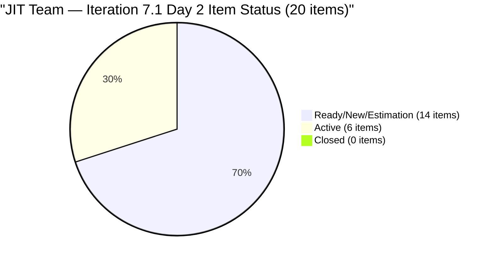
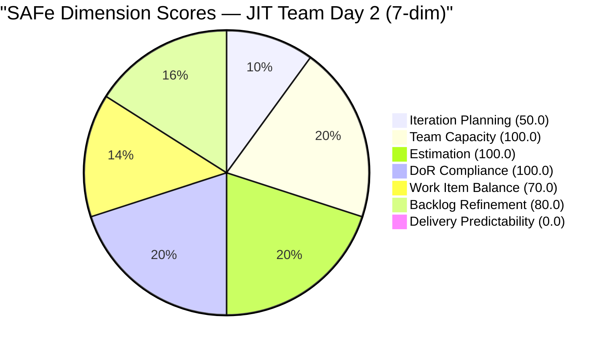
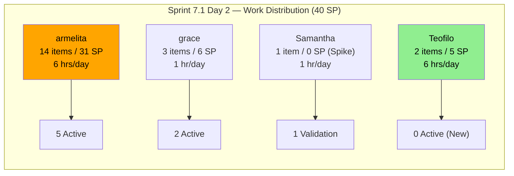
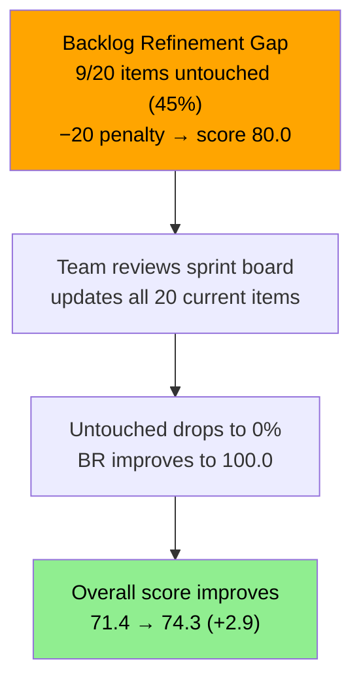

# SAFe Audit Report — JIT Operation Team | Iteration 7.1 Day 2

## 1. Audit Metadata

| Field | Value |
|-------|-------|
| **Project** | Jairosoft Portfolio |
| **Project ID** | `666bb99a-6acd-4999-bb34-efd0e4ea90dc` |
| **Team** | JIT Operation Team |
| **Team ID** | `b25e3129-6272-4e54-a3ff-f1ef3c8eeb2c` |
| **Workspace Folder** | `ado_jit` |
| **Board URL** | [Stories and Deliverables](https://dev.azure.com/jairo/Jairosoft%20Portfolio/_boards/board/t/JIT%20Operation%20Team/Stories%20and%20Deliverables) |
| **Current Iteration** | Iteration 7.1 |
| **Iteration Path** | `Jairosoft Portfolio\2026-PI7\Iteration 7.1` |
| **Iteration ID** | `6079f2b6-2f7c-4b10-adfd-93071eb965f7` |
| **Iteration Start** | April 6, 2026 |
| **Iteration Finish** | April 19, 2026 |
| **Sprint Day** | Day 2 of 14 (Tuesday, Apr 7) |
| **Audit Date** | April 7, 2026 — 09:00 PHT |
| **Previous Audit** | `AUDIT_20260406_0900.md` (Iteration 7.1 Day 1, Score 70.5/100 Moderate Risk) |
| **Overall Score** | **71.4 / 100 (Moderate Risk)** |
| **Scoring Rubric** | ADO SAFe v1 (seven-dimension deterministic scoring) |
| **Auditor** | AI EngProd Consultant |
| **Framework** | SAFe 6.0 |

> **Scope note:** This audit covers only the JIT Operation Team board in Jairosoft Portfolio. No other boards, teams, projects, or repositories were analyzed.

---

## 2. Executive Summary

This is the **second audit of Iteration 7.1** — Sprint Day 2 of 14. The score improves from **70.5 to 71.4/100 (Moderate Risk)**, a gain of **+0.9 points**.

The key development since Day 1 is that **Teofilo Limpag is now fully engaged in the sprint** — his training items have been assigned to Iteration 7.1 (#201865 moved from 6.6 IP, #202385 new item added), resolving the capacity-waste risk flagged yesterday. Additionally, **grace gained a third item** (#202450 TESDA Microcredential Program Submission), and **3 more items became Active** (AC Resubmission, UIC Interns, UM Main BSIT), bringing the Active count to 6.

The backlog grew from 39 to **40 items**, and the sprint scope expanded from 17 to **20 items (40 SP)** — a substantial increase that improves Iteration Planning from 43.6 to 50.0. All 4 team members now have work assigned in 7.1.

Areas of concern:
- **Untouched items penalty persists** — 9 of 20 items (45%) were last changed before sprint start
- **Large non-current backlog** — 20 items outside 7.1 (10 at root, 7 in PI6/6.6 IP, 3 in future iterations)
- **No closures yet** — Delivery Predictability remains at 0.0 on Day 2



---

## 3. Previous Audit Delta

**Previous:** AUDIT_20260406_0900 — Iteration 7.1 Day 1, 09:00 PHT

| Metric | 7.1 Day 1 (Apr 6) | **7.1 Day 2 (Apr 7)** | Delta |
|--------|-------------------|----------------------|-------|
| Iteration | 7.1 Day 1 | **7.1 Day 2** | +1 day |
| Visible Backlog | 39 | **40** | **+1** |
| Current Iteration Items | 17 | **20** | **+3** |
| Committed SP | 33 | **40** | **+7** |
| Items Active | 3 | **6** | **+3** |
| Items Closed | 0 | **0** | 0 |
| Contributors with Work | 3 | **4** | **+1** (Teofilo now active) |
| Untouched Items | 10/17 (58.8%) | **9/20 (45.0%)** | -1 item / -13.8 ppt |
| Overall Score | 70.5 (Moderate) | **71.4 (Moderate)** | **+0.9** |
| Iteration Planning | 43.6 | **50.0** | **+6.4** |
| Team Capacity | 100.0 | **100.0** | 0 |
| Estimation | 100.0 | **100.0** | 0 |
| DoR Compliance | 100.0 | **100.0** | 0 |
| Work Item Balance | 70.0 | **70.0** | 0 |
| Backlog Refinement | 80.0 | **80.0** | 0 |
| Delivery Predictability | 0.0 | **0.0** | 0 (Day 2) |

**Key changes since Day 1:**
1. **Teofilo's items now in 7.1** — #201865 moved from 6.6 IP; #202385 (new Training) added; Teofilo no longer has zero items
2. **3 new items added to 7.1** — #201865, #202385 (Teofilo), #202450 (grace new US)
3. **3 more items moved to Active** — #200593, #202189, #202194 now in-progress
4. **Iteration Planning improves** — 20/40 = 50.0 vs 17/39 = 43.6

---

## 4. Current Iteration Snapshot

### 4.1 Sprint Scope

| Metric | Value |
|--------|-------|
| Iteration | Iteration 7.1 |
| Date Range | April 6 - April 19, 2026 (14 days) |
| Sprint Day | Day 2 of 14 (~7% elapsed) |
| Items Committed | 20 |
| Items Active | 6 |
| Items Closed | 0 |
| Story Points Committed | 40 SP |
| SP Burned | 0 SP |
| Sprint Status | **IN PROGRESS — Early Stage** |

### 4.2 Team Capacity

| Member | Capacity/Day | Activity | Items in 7.1 | SP | Days Off |
|--------|-------------|----------|---------------|-----|----------|
| **armelita** | 6 hrs | Documentation | 14 | 31 SP | 0 |
| **grace** | 1 hr | Documentation | 3 | 6 SP | 0 |
| **Samantha Babael** | 1 hr | Documentation | 1 | 0 SP | 0 |
| **Teofilo Limpag** | 6 hrs | Training | 2 | 5 SP | 0 |
| **TOTAL** | **14 hrs/day** | | **20** | **40 SP** | 0 |

**Capacity assessment:** 14 h/day × 14 working days = 196 hrs total sprint capacity. At 40 SP committed, this is well within capacity on aggregate. However, **armelita carries 31 SP (77.5% of total work)** — a significant concentration risk given her 6 h/day limit (6 h × 14 days = 84 hrs available; 31 SP is manageable but loaded).

### 4.3 Current Iteration Items — Full Inventory (20 Items)

| #   | ID        | Type       | Title                                       | State                   | Assigned | SP        | Changed   | Untouched?  |
| --- | --------- | ---------- | ------------------------------------------- | ----------------------- | -------- | --------- | --------- | ----------- |
| 1   | 201433    | User Story | T2 MIS Employment Report                    | Active                  | armelita | 2         | Apr 1     | Yes         |
| 2   | 200593    | User Story | AC Resubmission Result                      | **Active**              | armelita | 1         | **Apr 7** | No          |
| 3   | 200597    | User Story | CSS NC II AC Registration Fee               | Estimation              | armelita | 2         | Mar 31    | Yes         |
| 4   | 197617    | User Story | SK Buhangin Partnership                     | Ready for Dev           | armelita | 1         | Mar 24    | Yes         |
| 5   | 198615    | User Story | Awarding of CSS NC II Certificates          | Ready for Dev           | armelita | 2         | Mar 24    | Yes         |
| 6   | 199092    | User Story | TESDA Career Guidance Semestral Report      | New                     | armelita | 2         | Mar 24    | Yes         |
| 7   | 200604    | User Story | Python Inquiries                            | Ready for Dev           | armelita | 2         | Mar 29    | Yes         |
| 8   | 200770    | User Story | Cor Jesu Interns Final Demo & Certificates  | New                     | armelita | 2         | Mar 17    | Yes         |
| 9   | 202189    | User Story | UIC Interns Final Demo — Computer Eng'g     | **Active**              | armelita | 2         | **Apr 7** | No          |
| 10  | 202194    | User Story | UM Main BSIT/BSMMA Onboarding               | **Active**              | armelita | 2         | **Apr 7** | No          |
| 11  | 202203    | User Story | MMCM Interns Onboarding                     | New                     | armelita | 2         | Apr 6     | No          |
| 12  | 202206    | User Story | Additional Trainer - Sam Approval Status    | New                     | armelita | 3         | Apr 6     | No          |
| 13  | 202219    | User Story | Market CSS NC II April 2026 Class           | New                     | armelita | 3         | Apr 6     | No          |
| 14  | 202237    | User Story | Market Bubble MCC April 2026 Class          | New                     | armelita | 3         | Apr 6     | No          |
| 15  | 201504    | User Story | School Engagement & Flyering                | Active                  | grace    | 2         | Apr 3     | Yes         |
| 16  | 201514    | User Story | "Free Discovery Day" Event                  | Active                  | grace    | 2         | Apr 3     | Yes         |
| 17  | 202450    | User Story | TESDA Microcredential Program Submission    | Ready for Dev           | grace    | 2         | **Apr 7** | No (New)    |
| 18  | 202145    | Spike      | Prepare Certificate for UIC Intern          | Validation              | Samantha | —         | Apr 6     | No          |
| 19  | 201865    | Training   | 2.4-3 Prepare/Complete Reports per Criteria | New                     | Teofilo  | 3         | **Apr 7** | No          |
| 20  | 202385    | Training   | Assessment COC 2 — Setup Computer Network   | New                     | Teofilo  | 2         | **Apr 7** | No (New)    |
|     | **Total** |            |                                             | **6 Active / 14 Other** |          | **40 SP** |           | 9 untouched |

### 4.4 Non-Current Backlog Items (20 items)

| Category                         | Count | Items                                                                                    |
| -------------------------------- | ----- | ---------------------------------------------------------------------------------------- |
| Root (JP) — Coursewares/Training | 10    | #186107, #188707, #188716, #188717, #188720, #188995, #193054, #193239, #193480, #193944 |
| PI6 root                         | 3     | #194656, #195391, #200766                                                                |
| 6.6 IP (orphaned)                | 4     | #201857, #202144, #202146, #202147                                                       |
| Iteration 7.4                    | 2     | #200767, #200768                                                                         |
| Iteration 7.5                    | 1     | #200771                                                                                  |

> Note: #201857 (Training) remains in 6.6 IP — Teofilo's other training item not yet moved. #202144, #202146, #202147 are Spikes still in 6.6 IP.

---

## 5. Work Item Analysis

### 5.1 Work Item Type Distribution (Current Iteration — 20 items)

| Type | Count | Share | SP |
|------|-------|-------|-----|
| User Story | 17 | 85.0% | 35 SP |
| Training | 2 | 10.0% | 5 SP |
| Spike | 1 | 5.0% | — |
| **Total** | **20** | **100%** | **40 SP** |

The sprint composition has improved since Day 1: Training items (Teofilo's) add diversity alongside User Stories and one Spike, reducing dependency on a single type.

### 5.2 State Distribution (Current Iteration)

| State | Count | SP |
|-------|-------|----|
| Active | 6 | 12 SP |
| New | 6 | 13 SP |
| Ready for Dev | 4 | 7 SP |
| Estimation | 1 | 2 SP |
| Validation | 1 | — |
| Grooming | 0 | — |
| **Total** | **20** | **40 SP** |

6 items in Active state (30% of sprint) on Day 2 signals healthy sprint engagement. Notably, 3 items became Active since the Day 1 audit.

### 5.3 DoR Compliance Assessment

All 20 current iteration items pass DoR thresholds:
- All have Description content >= 30 non-whitespace characters
- All have Acceptance Criteria >= 20 non-whitespace characters
- DoR compliance = 20/20 = 100%

Non-current items of concern: #193239 (SAFe AI Native Foundation Courseware) at root — identified in prior audits as missing Description and AC. Needs grooming before sprint assignment.

### 5.4 Freshness Assessment (All 40 Visible Backlog Items)

Reference dates (relative to Apr 7, 2026):
- **Fresh threshold:** Feb 21, 2026 (45 days prior)
- **Stale-90 threshold:** Jan 7, 2026 (90 days prior)
- **Stale-180 threshold:** Jul 11, 2025 (180 days prior)

| Metric | Value | Status |
|--------|-------|--------|
| Fresh (changed after Feb 21) | 40/40 (100%) | Base = 100.0 |
| Stale-90 (changed before Jan 7) | 0/40 (0%) | No penalty |
| Stale-180 (changed before Jul 11, 2025) | 0/40 (0%) | No penalty |
| Untouched current items (changed before Apr 6) | 9/20 (45.0%) | **−20 penalty (> 30%)** |

The 9 untouched items (changed before iteration start April 6) are: #197617, #198615, #199092, #200597, #200604, #200770, #201433, #201504, #201514. These are carry-over or pre-planned items that should be reviewed and updated to confirm sprint readiness.

---

## 6. SAFe Compliance Scorecard

| #   | Dimension                   | Score     | Formula     | Evidence                                      | Notes                                      |
| --- | --------------------------- | --------- | ----------- | --------------------------------------------- | ------------------------------------------ |
| 1   | **Iteration Planning**      | **50.0**  | 20/40 × 100 | 20 of 40 visible items in 7.1                 | +6.4 vs Day 1; 20 non-current items remain |
| 2   | **Team Capacity**           | **100.0** | 4/4 × 100   | All 4 contributors with work have capacity    | Teofilo now active in sprint               |
| 3   | **Estimation**              | **100.0** | 19/19 × 100 | All 19 point-eligible items have SP > 0       | Spike excluded; Training items counted     |
| 4   | **DoR Compliance**          | **100.0** | 20/20 × 100 | All pass Desc ≥ 30 AND AC ≥ 20 chars          | Consistent DoR discipline                  |
| 5   | **Work Item Balance**       | **70.0**  | 100 − 30    | US present (no −40); dominant 85% > 60% (−30) | Training+Spike add diversity (no −20)      |
| 6   | **Backlog Refinement**      | **80.0**  | 100.0 − 20  | 40/40 fresh; 0 stale; 9/20 untouched (−20)    | Untouched penalty persists                 |
| 7   | **Delivery Predictability** | **0.0**   | 0/40 × 100  | 0 of 40 committed SP closed                   | Day 2 — no closures yet; expected          |
|     | **Overall**                 | **71.4**  | 500.0 / 7   | **Moderate Risk (60–79.9)**                   | +0.9 vs Day 1                              |

### Score Computation Detail

```
Iteration Planning:       round(20/40 × 100, 1)        = 50.0
Team Capacity:            round(4/4 × 100, 1)           = 100.0
Estimation:               round(19/19 × 100, 1)         = 100.0
  (point_eligible = 20 items − 1 Spike = 19; all 19 have SP > 0)
DoR Compliance:           round(20/20 × 100, 1)         = 100.0
Work Item Balance:
  User Story present: no −40 penalty
  dominant_type = 17/20 = 85.0% > 60%: −30
  spike_share = 1/20 = 5.0%: no −20 (not > 40%)
  Result: 100 − 30                                      = 70.0
Backlog Refinement:
  base = round(40/40 × 100, 1)                         = 100.0
  stale_90: 0/40 = 0% → no penalty
  stale_180: 0 → no penalty
  untouched: 9/20 = 45.0% > 30%: −20
  Result: 100.0 − 20                                   = 80.0
Delivery Predictability:  round(0/40 × 100, 1)          = 0.0

Overall: (50.0 + 100.0 + 100.0 + 100.0 + 70.0 + 80.0 + 0.0) / 7
       = 500.0 / 7
       = 71.4 (Moderate Risk)
```

### Score Trend — Last 5 Audits

| Audit Date | Iteration | Day | Score | Band | Key Event |
|------------|-----------|-----|-------|------|-----------|
| Apr 4 | 6.6 IP | Day 13 | 86.8 | Low | De-committed; 6-dim rubric |
| Apr 5 | 6.6 IP | Day 14 | 64.7 | Moderate | 7-dim rubric applied |
| Apr 6 | 7.1 | Day 1 | 70.5 | Moderate | PI7 launch; 17 items committed |
| **Apr 7** | **7.1** | **Day 2** | **71.4** | **Moderate** | **Teofilo engaged; 20 items in sprint** |





---

## 7. Dimension Findings

### 7.1 Iteration Planning (50.0/100) — IMPROVED (+6.4)

20 of 40 visible backlog items are committed to Iteration 7.1 — exactly 50% coverage. This is a significant improvement from 43.6 on Day 1, driven by Teofilo's items moving into the sprint (#201865 from 6.6 IP, #202385 newly created) and grace's new item (#202450). The remaining 20 non-current items are distributed across: 10 Courseware items at root (long-term assets), 3 items in PI6, 4 orphaned Spikes in 6.6 IP, and 3 items in future iterations (7.4, 7.5). The root-level Coursewares are the largest contributor to the low planning score.

**Path to Low Risk:** Moving from 50.0 to 80.0 would require assigning 12 more items to 7.1 (32/40). This is not realistic for a single sprint, but archiving or grooming out completed/invalid Courseware items would improve the denominator.

### 7.2 Team Capacity (100.0/100) — FULL

All 4 contributors with current iteration work have capacity configured: armelita (6h Documentation), grace (1h Documentation), Samantha (1h Documentation), Teofilo (6h Training). Teofilo's prior idle-capacity risk is now resolved. **Note: armelita's 14-item load (31 SP) remains a concentration risk** — she carries 77.5% of sprint work on 6 h/day.

### 7.3 Estimation (100.0/100) — FULL

All 19 point-eligible items (User Stories + Training) have Story Points > 0. The single Spike (#202145) is excluded. Committed SP total = 40 (up from 33 yesterday). Range: 1–3 SP per item.

### 7.4 DoR Compliance (100.0/100) — FULL

All 20 current items have well-formed Description and Acceptance Criteria. DoR discipline has been consistent throughout PI7. However, #193239 at root backlog level still lacks Description and AC — flagged for grooming.

### 7.5 Work Item Balance (70.0/100) — STABLE

Sprint composition: 17 User Stories (85%), 2 Training (10%), 1 Spike (5%). User Stories are present (no −40). The dominant type (User Story, 85%) exceeds 60% — the −30 penalty applies. Spike share at 5% is well below the 40% threshold (no −20). The addition of Training items (Teofilo) improves diversity but not enough to lift this score. To improve: add more Training items (Teofilo has capacity) or reclassify research-heavy items as Spikes.

### 7.6 Backlog Refinement (80.0/100) — STABLE

All 40 items are fresh (changed within 45 days of Apr 7). No stale-90 or stale-180 items. The persistent issue is **9 of 20 current items (45%) last changed before the sprint start (Apr 6)**. These are mostly carry-over items from prior iterations that haven't been groomed since being assigned. The team should do a quick sprint board review to update these items and confirm their current readiness status. Touching all 20 current items would drop untouched from 45% to 0% and remove the −20 penalty, improving Backlog Refinement to 100.0 and the overall score to 74.3.

### 7.7 Delivery Predictability (0.0/100) — EARLY SPRINT

0 of 40 committed SP are closed. Six items are in Active state. This is expected on Day 2 of a 14-day sprint. Based on historical patterns (JIT team had significant closures in the second half of 6.6 IP), closures are likely to occur in the Apr 13–19 window. The 3 items in Active state since Day 1 (201433, 201504, 201514) are the most likely candidates for early closure.

**Projection:** If 50% of SP close by Day 7, the overall score would rise to ~86 (Low Risk). Full burn would yield 100.0 on DP, pushing overall to ~86.

---

## 8. Risks and Bottlenecks

| # | Risk | Severity | Status | Mitigation |
|---|------|----------|--------|------------|
| R1 | **armelita overloaded — 14 items, 31 SP** | High | Increased from Day 1 (13→14 items) | Prioritize top 8–10 items; defer lower-priority to 7.2 |
| R2 | **9 of 20 items untouched since before sprint start** | Moderate | Improved (10→9), penalty persists | Team review: update items to confirm readiness; removes −20 BR penalty |
| R3 | **4 items orphaned in 6.6 IP** | Moderate | Partially resolved (#201865 moved) | Close #202144, #202146, #202147 (Samantha Spikes); move #201857 if still valid |
| R4 | **Large non-current Courseware backlog (10 items at root)** | Moderate | Unchanged | Long-term asset management; assign to future PIs or archive completed ones |
| R5 | **Teofilo's items newly added — no Active yet** | Low | New (items added Apr 7) | Expected on Day 2; Teofilo should begin Training items |
| R6 | **No iteration goal documented** | High | Unchanged across all audits | Define sprint goal for 7.1 |
| R7 | **5 items still in 6.6 IP or PI6** | Moderate | Decreased (partially resolved) | Decision needed: close, move to 7.1, or assign to 7.2 |



---

## 9. Prioritized Recommendations

### P0 — Urgent (Today)

1. **Touch/update all 9 untouched current items.** A quick review of items #197617, #198615, #199092, #200597, #200604, #200770, #201433, #201504, #201514 (even minor description updates or state transitions) would drop the untouched rate below 30% and recover +20 points in Backlog Refinement, lifting overall score from 71.4 to 74.3.

2. **Define Iteration 7.1 sprint goal.** Still absent across all PI7 audits. Suggested: *"Advance TESDA compliance, complete intern program closures, launch PI7 marketing campaigns, and complete assessment COC items."*

### P1 — This Week

3. **Resolve 6.6 IP orphaned items.** Close Samantha's Spikes (#202144, #202146, #202147) as complete or carry forward. Verify whether #201857 should stay in 6.6 IP or move to 7.1.

4. **Start Teofilo's Training items.** #201865 and #202385 are both New — Teofilo should move them to Active and begin work. His 6h/day capacity is underutilized.

5. **Prioritize armelita's 14-item list.** With 31 SP assigned, she is at capacity. Identify 2–3 items that could be deferred to 7.2 if sprint progress falls behind.

### P2 — This Sprint

6. **Groom root-level Coursewares.** 10 Courseware items at root level remain unscheduled. Assign to future PI7 iterations or archive if superseded. This will improve Iteration Planning numerator ratio.

7. **Establish PI7 objectives.** Link sprint work to PI objectives for strategic alignment visibility.

### P3 — Structural

8. **Groom #193239 (SAFe AI Native Foundation Courseware)** — add Description and AC before scheduling in any sprint.

---

## 10. Evidence Gaps and Limitations

| # | Gap | Impact | Notes |
|---|-----|--------|-------|
| G1 | **Delivery Predictability = 0.0 (Day 2)** | Score suppressed; expected | Will improve as items close; first closures expected Week 2 |
| G2 | **ADO project is Jairosoft Portfolio (not FINOPS)** | Different project context | Documented; queries use correct project ID |
| G3 | **#193239 missing Description and AC (at root)** | DoR non-compliant on backlog | Not in current iteration; flagged for grooming |
| G4 | **4 orphaned items in 6.6 IP** | Appear as unresolved debt | Samantha's Spikes and one Training item need PO decision |
| G5 | **No iteration goal documented** | Cannot verify sprint goal via API | Absent across all PI6/PI7 audits |
| G6 | **Committed SP increased from 33→40 within Day 1** | Scope change mid-sprint entry | Items added are valid new work (Teofilo/grace); not scope creep |
| G7 | **Armelita's 14-item load** | Capacity model may underestimate actual complexity | Each item is 1–3 SP; aggregate is feasible but high concentration |

---

*Report generated: April 7, 2026 09:00 PHT | SAFe 6.0 Framework | ADO SAFe v1 (seven-dimension deterministic scoring)*
*Jairosoft Portfolio — JIT Operation Team | Iteration 7.1: Apr 6 – Apr 19, 2026*
*Overall Score: 71.4/100 (Moderate Risk) | Day 2 of 14*
*Previous: AUDIT_20260406_0900.md (Day 1, 70.5/100, Moderate Risk) | +0.9 change*
*Sprint: 20 items committed (40 SP) across 4 contributors | 6 Active, 0 Closed*
*Key improvements: Teofilo now in sprint (2 items/5 SP), Planning 43.6→50.0, Active items 3→6*
