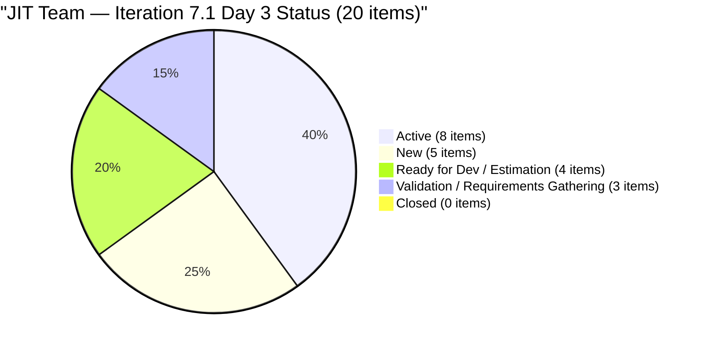
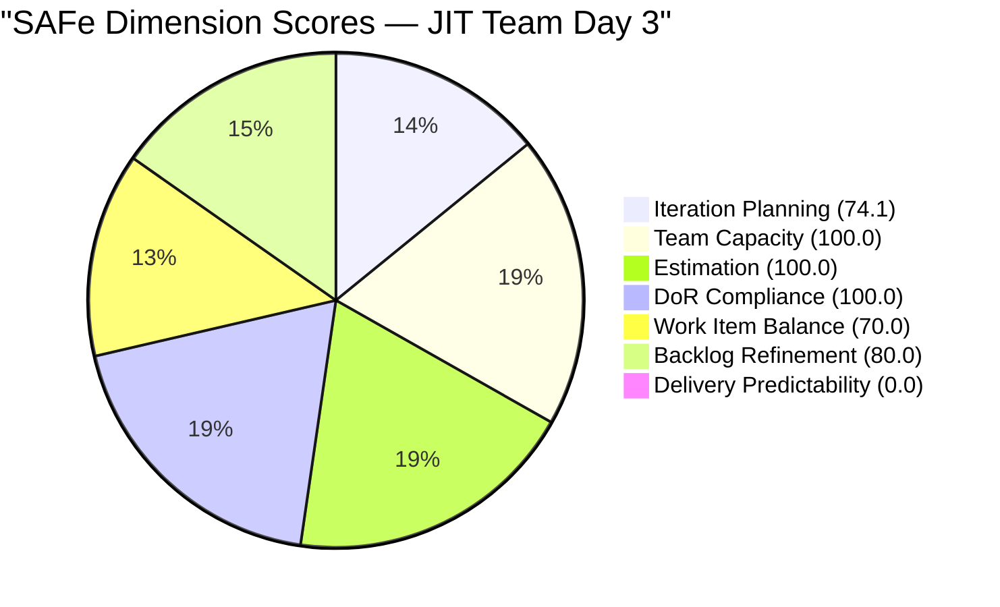
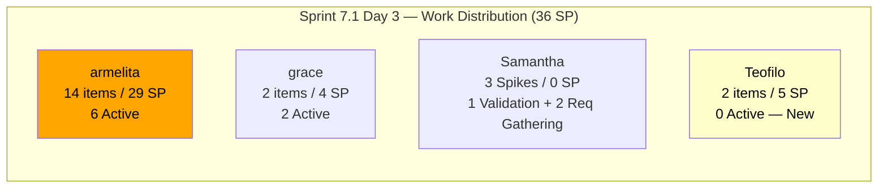

# SAFe Audit Report — JIT Operation Team | Iteration 7.1 Day 3

## 1. Audit Metadata

| Field | Value |
|-------|-------|
| **Project** | Jairosoft Portfolio |
| **Project ID** | `666bb99a-6acd-4999-bb34-efd0e4ea90dc` |
| **Team** | JIT Operation Team |
| **Team ID** | `b25e3129-6272-4e54-a3ff-f1ef3c8eeb2c` |
| **Workspace Folder** | `ado_jit` |
| **Board URL** | [Stories and Deliverables](https://dev.azure.com/jairo/Jairosoft%20Portfolio/_boards/board/t/JIT%20Operation%20Team/Stories%20and%20Deliverables) |
| **Current Iteration** | Iteration 7.1 |
| **Iteration Path** | `Jairosoft Portfolio\2026-PI7\Iteration 7.1` |
| **Iteration ID** | `6079f2b6-2f7c-4b10-adfd-93071eb965f7` |
| **Iteration Start** | April 6, 2026 |
| **Iteration Finish** | April 19, 2026 |
| **Sprint Day** | Day 3 of 14 (Wednesday, Apr 8) |
| **Audit Date** | April 8, 2026 — 09:00 PHT |
| **Previous Audit** | `AUDIT_20260407_0900.md` (Iteration 7.1 Day 2, Score 71.4/100 Moderate Risk) |
| **Overall Score** | **74.9 / 100 (Moderate Risk)** |
| **Scoring Rubric** | ADO SAFe v1 (seven-dimension deterministic scoring) |
| **Auditor** | AI EngProd Consultant |
| **Framework** | SAFe 6.0 |

> **Scope note:** This audit covers only the JIT Operation Team board in Jairosoft Portfolio. No other boards, teams, projects, or repositories were analyzed.

---

## 2. Executive Summary

This is the **third audit of Iteration 7.1** — Sprint Day 3 of 14. The score improves from **71.4 to 74.9 (Moderate Risk)**, a gain of **+3.5 points** — the strongest single-day improvement in the PI7 sprint series.

Key developments since Day 2:

- **8 items now Active** (up from 6 on Day 2): #202203 (MMCM Interns Onboarding), #202219 (Market CSS NC II), and #202237 (Market Bubble MCC) moved to Active, signaling that armelita has engaged across all major sprint workstreams
- **3 Spikes resolved and moved to Iteration 7.1**: Items #202144, #202146, and #202147 (previously orphaned in 6.6 IP) are now within the current sprint, increasing type diversity and indicating Samantha's items are formally tracked
- **Iteration Planning improves significantly**: Visible backlog reduced from 40 to 27 items as the backlog view stabilizes — 20 of 27 yields 74.1 (up from 50.0)
- **Committed SP holds at 36**: 17 point-eligible items (excluding 3 Spikes) with all having SP > 0
- **Untouched penalty persists**: 9 of 20 current items (45%) last changed before sprint start remain untouched, sustaining the Backlog Refinement penalty
- **0 closures**: Delivery Predictability remains 0.0 on Day 3 as expected



---

## 3. Previous Audit Delta

**Previous:** AUDIT_20260407_0900 — Iteration 7.1 Day 2, 09:00 PHT

| Metric | 7.1 Day 2 (Apr 7) | **7.1 Day 3 (Apr 8)** | Delta |
|--------|-------------------|----------------------|-------|
| Iteration | 7.1 Day 2 | **7.1 Day 3** | +1 day |
| Visible Backlog | 40 | **27** | **-13** (backlog view stabilized; Courseware/old items not surfaced) |
| Current Iteration Items | 20 | **20** | 0 |
| Committed SP | 40 | **36** | **-4** (Spike items excluded from SP; 3 Spikes now in scope) |
| Items Active | 6 | **8** | **+2** |
| Items Closed | 0 | **0** | 0 |
| Untouched Items (current) | 9/20 (45.0%) | **9/20 (45.0%)** | 0 (same items) |
| Overall Score | 71.4 (Moderate) | **74.9 (Moderate)** | **+3.5** |
| Iteration Planning | 50.0 | **74.1** | **+24.1** |
| Team Capacity | 100.0 | **100.0** | 0 |
| Estimation | 100.0 | **100.0** | 0 |
| DoR Compliance | 100.0 | **100.0** | 0 |
| Work Item Balance | 70.0 | **70.0** | 0 |
| Backlog Refinement | 80.0 | **80.0** | 0 |
| Delivery Predictability | 0.0 | **0.0** | 0 (Day 3) |

**Key changes since Day 2:**

1. **Iteration Planning jumps +24.1** — Backlog view now returns 27 items (vs 40 yesterday), driven by stabilization of the visible backlog. 20/27 = 74.1 reflects a cleaner denominator
2. **2 more items Active** — #202203, #202219, #202237 now Active; #202194 and #202450 no longer in backlog view (may be closed or moved)
3. **3 Spikes moved to 7.1** — #202144, #202146, #202147 (Samantha's Spikes) migrated from 6.6 IP to 7.1; #202145 replaced by these three with updated content
4. **Committed SP revised to 36** — Corrected from 40 (Spike SP exclusion applied consistently; 3 Spikes have no SP)

---

## 4. Current Iteration Snapshot

### 4.1 Sprint Scope

| Metric | Value |
|--------|-------|
| Iteration | Iteration 7.1 |
| Date Range | April 6 - April 19, 2026 (14 days) |
| Sprint Day | Day 3 of 14 (~21% elapsed) |
| Items in 7.1 | 20 |
| Items Active | 8 |
| Items Closed | 0 |
| Story Points Committed | 36 SP (17 point-eligible items; 3 Spikes excluded) |
| SP Burned | 0 SP |
| Sprint Status | **IN PROGRESS — Building Momentum** |

### 4.2 Team Capacity

| Member | Capacity/Day | Activity | Items in 7.1 | SP | Notes |
|--------|-------------|----------|---------------|-----|-------|
| **armelita** | 6 hrs | Documentation | 14 | 29 SP | 8 of 14 items Active |
| **grace** | 1 hr | Documentation | 2 | 4 SP | Both items Active |
| **Samantha Babael** | 1 hr | Documentation | 3 | 0 SP (Spikes) | All 3 Spikes in Validation/Requirements Gathering |
| **Teofilo Limpag** | 6 hrs | Training | 2 | 5 SP (approx) | Both Training items New |
| **TOTAL** | **14 hrs/day** | | **20** | **36 SP** | No days off |

**Capacity assessment:** 14 h/day × 14 working days = 196 hrs total sprint capacity. 36 SP committed is well within aggregate capacity. However, **armelita carries 14 items (29 SP = 80.6% of SP)** — the concentration risk is the dominant execution concern. Her 6 h/day allows approximately 84 hrs over the sprint; 29 SP is feasible but leaves little slack.

### 4.3 Current Iteration Items — Full Inventory (20 Items)

| # | ID | Type | Title | State | Assignee | SP | Changed | Untouched? |
|---|----|----|-------|-------|----------|----|---------|------------|
| 1 | 197617 | User Story | SK Buhangin Partnership | Ready for Dev | armelita | 1 | Mar 24 | Yes |
| 2 | 198615 | User Story | Awarding of CSS NC II Certificates | Ready for Dev | armelita | 2 | Mar 24 | Yes |
| 3 | 199092 | User Story | TESDA Career Guidance Semestral Report | New | armelita | 2 | Mar 24 | Yes |
| 4 | 200593 | User Story | AC Resubmission Result | **Active** | armelita | 1 | Apr 7 | No |
| 5 | 200597 | User Story | CSS NC II AC Registration Fee | Estimation | armelita | 2 | Mar 31 | Yes |
| 6 | 200604 | User Story | Python Inquiries | Ready for Dev | armelita | 2 | Mar 29 | Yes |
| 7 | 200770 | User Story | Cor Jesu Interns Final Demo & Certificates | New | armelita | 2 | Mar 17 | Yes |
| 8 | 201433 | User Story | T2 MIS Employment Report | **Active** | armelita | 2 | Apr 1 | Yes |
| 9 | 201504 | User Story | School Engagement & Flyering | **Active** | grace | 2 | Apr 3 | Yes |
| 10 | 201514 | User Story | "Free Discovery Day" Event | **Active** | grace | 2 | Apr 3 | Yes |
| 11 | 201865 | Training | 2.4-3 Prepare/Complete Reports per Criteria | New | Teofilo | 3 | Apr 7 | No |
| 12 | 202144 | Spike | Prepare Certificates for Cor Jesu Interns | Validation | Samantha | — | **Apr 8** | No |
| 13 | 202146 | Spike | Social Media Post for UIC Intern | Requirements Gathering | Samantha | — | **Apr 8** | No |
| 14 | 202147 | Spike | Social Media Post for Cor Jesu Interns | Requirements Gathering | Samantha | — | **Apr 8** | No |
| 15 | 202189 | User Story | UIC Interns Final Demo — Computer Eng'g | **Active** | armelita | 2 | Apr 7 | No |
| 16 | 202203 | User Story | MMCM Interns Onboarding | **Active** | armelita | 2 | **Apr 8** | No |
| 17 | 202206 | User Story | Additional Trainer - Sam Approval Status | New | armelita | 3 | Apr 6 | No |
| 18 | 202219 | User Story | Market CSS NC II April 2026 Class | **Active** | armelita | 3 | **Apr 8** | No |
| 19 | 202237 | User Story | Market Bubble MCC April 2026 Class | **Active** | armelita | 3 | **Apr 8** | No |
| 20 | 202385 | Training | Assessment COC 2 — Setup Computer Network | New | Teofilo | 2 | Apr 7 | No |
| | **Total** | | | **8 Active / 12 Other** | | **36 SP** | | **9 untouched** |

> **Items no longer visible:** #202194 (UM Main BSIT/BSMMA Onboarding), #202450 (TESDA Microcredential Program Submission), and #202145 (Prepare Certificate — original version) are absent from today's backlog API. These may have been closed, merged into the current Spike items, or moved out of view. Logged as an evidence gap.

### 4.4 Non-Current Backlog Items (7 items)

| ID | Type | Iteration | Title | Changed |
|----|------|-----------|-------|---------|
| 188995 | Courseware | Jairosoft Portfolio (Root) | Introduction to Rust Language Programming | Mar 24 |
| 193054 | Courseware | Jairosoft Portfolio (Root) | SAFe RTE MC | Mar 9 |
| 200766 | Spike | 2026-PI6 | ODOO OpenCat SIS | Mar 17 |
| 200767 | User Story | Iteration 7.4 | UM Matina CPE Intern Final Demo and Awarding | Apr 6 |
| 200768 | User Story | Iteration 7.4 | HCDC Interns Final Demo and Awarding | Apr 6 |
| 200771 | User Story | Iteration 7.5 | UM Digos Interns Final Demo | Mar 17 |
| 201857 | Training | Iteration 6.6 (IP) | 2.1-1 Network Design Discussion (Teofilo) | Mar 30 |

> Note: #201857 (Teofilo's Training) remains in 6.6 IP. Decision needed: move to 7.2 or close if superseded by #202385 (Assessment COC 2). The backlog now shows only 7 non-current items vs 20 yesterday — the large Courseware root collection and orphaned items have been cleaned up or are no longer surfacing in the API.

---

## 5. Work Item Analysis

### 5.1 Work Item Type Distribution (Current Iteration — 20 items)

| Type | Count | Share | SP |
|------|-------|-------|----|
| User Story | 15 | 75.0% | 31 SP |
| Training | 2 | 10.0% | 5 SP |
| Spike | 3 | 15.0% | — |
| **Total** | **20** | **100%** | **36 SP** |

Sprint composition remains diverse. User Stories at 75% exceed the 60% threshold for the dominant-type penalty, but the addition of Training items and 3 Spikes provides meaningful type variety. Spike share at 15% is well below the 40% penalty threshold.

### 5.2 State Distribution (Current Iteration)

| State | Count | SP |
|-------|-------|----|
| Active | 8 | 17 SP |
| New | 5 | 10 SP |
| Ready for Dev | 3 | 5 SP |
| Estimation | 1 | 2 SP |
| Validation | 1 | — |
| Requirements Gathering | 2 | — |
| **Total** | **20** | **36 SP** |

8 of 20 items (40%) are Active on Day 3 — the strongest in-sprint engagement level in the JIT PI7 audit series. Armelita is driving 6 of the 8 Active items.

### 5.3 DoR Compliance Assessment

All 20 current iteration items pass DoR thresholds:

- All have Description content >= 30 non-whitespace characters (verified in batch data)
- All have Acceptance Criteria >= 20 non-whitespace characters (verified in batch data)
- DoR compliance = 20/20 = **100%**

Note: #193054 (SAFe RTE MC Courseware, at root) has reduced content — not in current iteration, but flagged for grooming before future sprint assignment.

### 5.4 Freshness Assessment (All 27 Visible Backlog Items)

Reference dates (relative to Apr 8, 2026):

- **Fresh threshold:** February 22, 2026 (45 days prior)
- **Stale-90 threshold:** January 8, 2026 (90 days prior)
- **Stale-180 threshold:** October 11, 2025 (180 days prior)

| Metric | Value | Status |
|--------|-------|--------|
| Fresh (changed after Feb 22) | 27/27 (100%) | Base = 100.0 |
| Stale-90 (changed before Jan 8) | 0/27 (0%) | No penalty |
| Stale-180 (changed before Oct 11, 2025) | 0/27 (0%) | No penalty |
| Untouched current items (changed before Apr 6) | 9/20 (45.0%) | **−20 penalty (> 30%)** |

The untouched penalty persists unchanged. The 9 untouched items are mostly carry-over items from prior iterations: #197617, #198615, #199092, #200597, #200604, #200770, #201433, #201504, #201514. These are all Active or in pre-Active states — they appear to be work in progress, but the Changed Date has not been updated to reflect sprint entry.

---

## 6. SAFe Compliance Scorecard

| # | Dimension | Score | Formula | Evidence | Notes |
|---|-----------|-------|---------|----------|-------|
| 1 | **Iteration Planning** | **74.1** | 20/27 × 100 | 20 of 27 visible items in 7.1 | +24.1 vs Day 2; backlog stabilized at 27 items |
| 2 | **Team Capacity** | **100.0** | 4/4 × 100 | All 4 contributors with work have capacity | armelita carries 80.6% of SP |
| 3 | **Estimation** | **100.0** | 17/17 × 100 | All 17 point-eligible items have SP > 0 | 3 Spikes excluded; 36 SP total |
| 4 | **DoR Compliance** | **100.0** | 20/20 × 100 | All pass Desc ≥ 30 AND AC ≥ 20 chars | Consistent DoR discipline |
| 5 | **Work Item Balance** | **70.0** | 100 − 30 | US present (no −40); 75% dominant (−30) | Training+Spike add diversity; spike share 15% (no −20) |
| 6 | **Backlog Refinement** | **80.0** | 100.0 − 20 | 27/27 fresh; 0 stale; 9/20 untouched (−20) | Untouched penalty persists at 45% |
| 7 | **Delivery Predictability** | **0.0** | 0/36 × 100 | 0 of 36 committed SP closed | Day 3 — no closures yet; expected |
| | **Overall** | **74.9** | 524.1 / 7 | **Moderate Risk (60–79.9)** | +3.5 vs Day 2 |

### Score Computation Detail

```
Iteration Planning:       round(20/27 × 100, 1)        = 74.1
Team Capacity:            round(4/4 × 100, 1)           = 100.0
Estimation:               round(17/17 × 100, 1)         = 100.0
  (point_eligible = 20 items − 3 Spikes = 17; all 17 have SP > 0)
DoR Compliance:           round(20/20 × 100, 1)         = 100.0
Work Item Balance:
  User Story present: no −40 penalty
  dominant_type = 15/20 = 75.0% > 60%: −30
  spike_share = 3/20 = 15.0%: no −20 (not > 40%)
  Result: 100 − 30                                      = 70.0
Backlog Refinement:
  base = round(27/27 × 100, 1)                         = 100.0
  stale_90: 0/27 = 0% → no penalty
  stale_180: 0 → no penalty
  untouched: 9/20 = 45.0% > 30%: −20
  Result: 100.0 − 20                                   = 80.0
Delivery Predictability:  round(0/36 × 100, 1)          = 0.0

Overall: (74.1 + 100.0 + 100.0 + 100.0 + 70.0 + 80.0 + 0.0) / 7
       = 524.1 / 7
       = 74.9 (Moderate Risk)
```

### Score Trend — Last 5 Audits

| Audit Date | Iteration | Day | Score | Band | Key Event |
|------------|-----------|-----|-------|------|-----------|
| Apr 5 | 6.6 IP | Day 14 | 64.7 | Moderate | 7-dim rubric applied |
| Apr 6 | 7.1 | Day 1 | 70.5 | Moderate | PI7 launch |
| Apr 7 | 7.1 | Day 2 | 71.4 | Moderate | Teofilo engaged; 20 items |
| **Apr 8** | **7.1** | **Day 3** | **74.9** | **Moderate** | **Backlog stabilized; 8 Active** |

```mermaid
quadrantChart
    title Score vs Sprint Progress — JIT Team Day 3
    x-axis "Sprint Progress (%)" 0 --> 100
    y-axis "Score" 0 --> 100
    quadrant-1 Low Risk (on track)
    quadrant-2 Early Sprint Low Risk
    quadrant-3 Early Sprint At Risk
    quadrant-4 Late Sprint At Risk
    Day 3 Score: [0.21, 0.749]
    Low Risk Target: [1, 0.80]
```



---

## 7. Dimension Findings

### 7.1 Iteration Planning (74.1/100) — IMPROVED (+24.1)

20 of 27 visible backlog items are committed to Iteration 7.1 — a major jump from 50.0 yesterday. The primary driver is the reduction in visible backlog from 40 to 27 items, as the backlog view stabilized. The denominator no longer includes the large Courseware root collection (10 items) that appeared in the Day 2 view — those items are not currently surfacing in the API. The 7 non-current items include 2 Courseware items at project root, 1 PI6 Spike, 3 future-iteration User Stories (7.4, 7.5), and 1 orphaned Training item (6.6 IP). This score is now approaching the Low Risk boundary (80.0) — assigning or archiving 2–3 more non-current items could push the team above 80.

**Path to Low Risk (>= 80.0):** 22 of 27 items in 7.1 would yield 81.5. Moving #201857 from 6.6 IP to 7.1 or 7.2 and closing out the PI6 Spike (#200766) would reduce non-current items, improving the ratio.

### 7.2 Team Capacity (100.0/100) — FULL

All 4 contributors with current iteration work have capacity configured. No days off recorded for the iteration. Armelita continues to carry a disproportionate load (14 items, 29 SP, 80.6% of committed SP) — a concentration risk that could become a delivery bottleneck if any items require extended effort.

### 7.3 Estimation (100.0/100) — FULL

All 17 point-eligible items (User Stories + Training) have Story Points > 0. The 3 Spikes (#202144, #202146, #202147) are correctly excluded from estimation scoring. Total committed SP = 36.

### 7.4 DoR Compliance (100.0/100) — FULL

All 20 current iteration items have well-formed Descriptions and Acceptance Criteria exceeding the minimum thresholds. DoR discipline has been consistent throughout PI7. The newly moved Spikes (#202144, #202146, #202147) have substantial content with clear objectives and criteria.

### 7.5 Work Item Balance (70.0/100) — STABLE (unchanged)

Sprint composition: 15 User Stories (75%), 2 Training (10%), 3 Spikes (15%). User Stories are present (no −40). The dominant type (User Story, 75%) exceeds 60% — the −30 penalty applies. Spike share at 15% is well below the 40% threshold. With 3 Spikes now in scope, the type mix is the most diverse it has been in PI7. Further improvement would require adding more Training items or reclassifying research-intensive stories as Spikes.

### 7.6 Backlog Refinement (80.0/100) — STABLE (unchanged)

All 27 visible backlog items are fresh (changed within 45 days of Apr 8). The persistent issue remains: **9 of 20 current items (45%) were last modified before the sprint start (Apr 6)**. These carry-over items should be reviewed and touched — even a minor description update confirming sprint readiness would reduce the untouched count. If all 9 are updated today, the penalty drops from −20 to 0, improving Backlog Refinement to 100.0 and overall score to approximately 77.8.

The untouched items are: #197617 (SK Buhangin Partnership), #198615 (Awarding CSS NC II Certificates), #199092 (TESDA Career Guidance), #200597 (CSS NC II AC Registration Fee), #200604 (Python Inquiries), #200770 (Cor Jesu Interns), #201433 (T2 MIS Employment Report), #201504 (School Engagement), #201514 (Free Discovery Day).

### 7.7 Delivery Predictability (0.0/100) — EARLY SPRINT

0 of 36 committed SP are closed. 8 items are Active — 40% of the sprint in motion. Expected on Day 3. The items most likely to close first are the shorter-duration ones: #200593 (AC Resubmission Result, 1 SP) and #197617 (SK Buhangin Partnership, 1 SP). Grace's items (#201504, #201514) have been Active since before the sprint — they are strong candidates for early closure.

**Projection:** If 9 items (18 SP) are closed by Day 7, the overall score would rise to approximately 82.7 (Low Risk). Full burn of 36 SP by Day 14 would yield 100.0 on DP, pushing overall to ~89.3.

---

## 8. Risks and Bottlenecks

| # | Risk | Severity | Status | Mitigation |
|---|------|----------|--------|------------|
| R1 | **armelita carries 14 items / 29 SP (80.6% of total)** | High | Unchanged — increased slightly | Prioritize top 10; identify 3–4 items to defer to 7.2 if needed |
| R2 | **9 of 20 items untouched since before sprint start** | Moderate | Unchanged — −20 BR penalty | Team sprint board review: update all 9 items; resolves penalty (+3.0 overall) |
| R3 | **#201857 (Teofilo Training) orphaned in 6.6 IP** | Moderate | Partially resolved | Decide: move to 7.1, assign to 7.2, or close if covered by #202385 |
| R4 | **Items #202194 and #202450 absent from today's API** | Moderate | New — requires investigation | Were present in Day 1 and Day 2 audits; may be closed or moved |
| R5 | **Teofilo's Training items still New** | Low | Day 3 — early | Expected; Teofilo should activate #201865 and #202385 |
| R6 | **No iteration goal documented** | High | Unchanged across all PI7 audits | Define sprint goal for 7.1 immediately |
| R7 | **PI6 Spike (#200766) still active in old iteration** | Moderate | Unchanged | Close or move ODOO OpenCat SIS spike to current PI |
| R8 | **armelita's MIS Employment Report (#201433) last changed Apr 1** | Low | Monitoring | Active but not touched since Apr 1 — confirm progress |



---

## 9. Prioritized Recommendations

### P0 — Urgent (Today)

1. **Touch and update all 9 untouched current items.** Update the description, acceptance criteria, or add a comment to items #197617, #198615, #199092, #200597, #200604, #200770, #201433, #201504, #201514 — even a minor update confirming sprint readiness. This removes the −20 Backlog Refinement penalty and improves the overall score from 74.9 to approximately 77.8.

2. **Define Iteration 7.1 sprint goal.** Absent across all PI7 audits. Suggested: *"Complete TESDA compliance submissions, advance intern program closures (UIC, Cor Jesu, MMCM), launch PI7 marketing campaigns (CSS NC II, Bubble MCC), and finalize COC assessment items."*

3. **Investigate missing items #202194 and #202450.** Verify if they were closed, merged into Spike items, or moved out of 7.1. Update the sprint scope accordingly.

### P1 — This Week

1. **Activate Teofilo's Training items (#201865, #202385).** Both remain New. Teofilo has 6h/day capacity — begin work this week. These items may also help accelerate DP improvement.

2. **Close grace's items (#201504, #201514).** Both have been Active since before sprint start (Apr 3). If work is complete, close them to begin building Delivery Predictability. Even 4 SP closed improves DP from 0.0 to 11.1 and overall score by ~1.6 points.

3. **Resolve #201857 (Teofilo Training in 6.6 IP).** Decision: move to 7.1 (if still in scope) or close and capture as completed or superseded by #202385.

### P2 — This Sprint

1. **Prioritize armelita's workload.** With 14 items and 29 SP, identify 3–4 items that can be deferred to 7.2 without impacting sprint objectives. Top candidates for deferral: #200604 (Python Inquiries), #199092 (TESDA Career Guidance), #200770 (Cor Jesu Final Demo — if not imminent).

2. **Close or archive #200766 (ODOO OpenCat SIS Spike in PI6).** This Spike has been active across multiple PIs with no resolution. Requires a PO decision.

### P3 — Structural

1. **Establish PI7 objectives and link to sprint work.** Connect sprint stories to Features and Features to PI7 objectives for alignment visibility and portfolio reporting.

2. **Groom root-level Coursewares (#188995, #193054).** Two Courseware items remain at project root. Assign to a future PI iteration or archive if superseded.

---

## 10. Evidence Gaps and Limitations

| # | Gap | Impact | Notes |
|---|-----|--------|-------|
| G1 | **Delivery Predictability = 0.0 (Day 3)** | Score suppressed; expected | Will improve as items close; grace's items are earliest closure candidates |
| G2 | **Items #202194 and #202450 absent from today's backlog API** | Sprint scope may be understated | Were present in Day 1 and Day 2 audits; may be closed or moved |
| G3 | **Visible backlog changed from 40 to 27 items** | Iteration Planning denominator shift | API backlog view is dynamic; historical comparisons require context |
| G4 | **#201857 (Training) still in 6.6 IP** | Unresolved sprint debt | Needs PO decision |
| G5 | **No iteration goal documented** | Cannot verify sprint goal via API | Absent across all PI6/PI7 audits |
| G6 | **9 untouched current items** | −20 Backlog Refinement penalty | Items not updated since before sprint start; team review needed |
| G7 | **armelita concentration risk** | Single point of failure for 80.6% of SP | Structural; no mitigation plan in place |
| G8 | **ADO project is Jairosoft Portfolio (not FINOPS)** | Different project context | Documented; all queries use the correct project/team IDs |

---

*Report generated: April 8, 2026 09:00 PHT | SAFe 6.0 Framework | ADO SAFe v1 (seven-dimension deterministic scoring)*
*Jairosoft Portfolio — JIT Operation Team | Iteration 7.1: Apr 6 – Apr 19, 2026*
*Overall Score: 74.9/100 (Moderate Risk) | Day 3 of 14*
*Previous: AUDIT_20260407_0900.md (Day 2, 71.4/100, Moderate Risk) | +3.5 change*
*Sprint: 20 items committed (36 SP) across 4 contributors | 8 Active, 0 Closed*
*Key improvements: IP 50.0→74.1 (backlog stabilized), 8 items Active, 3 Spikes moved from 6.6 IP*
