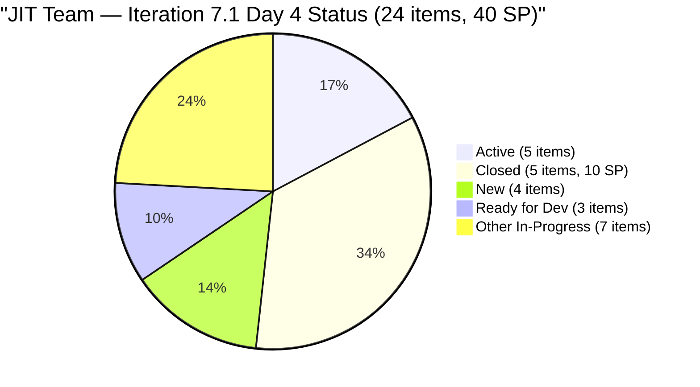
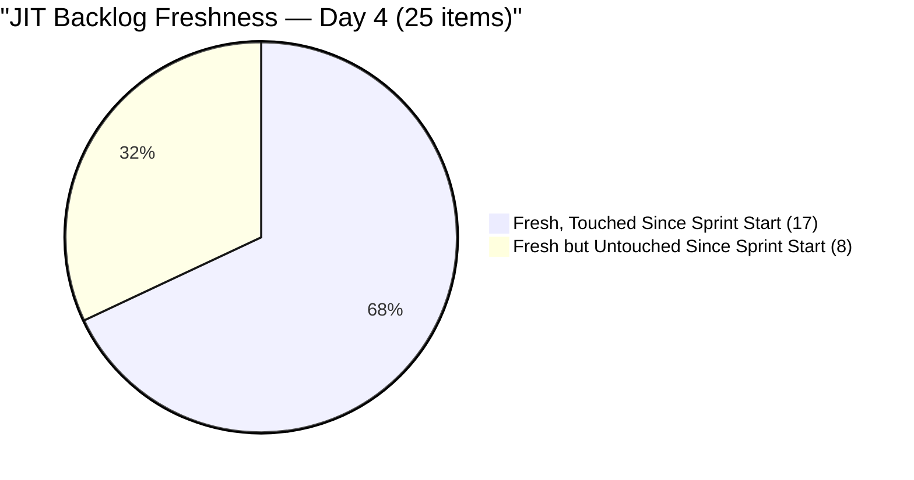
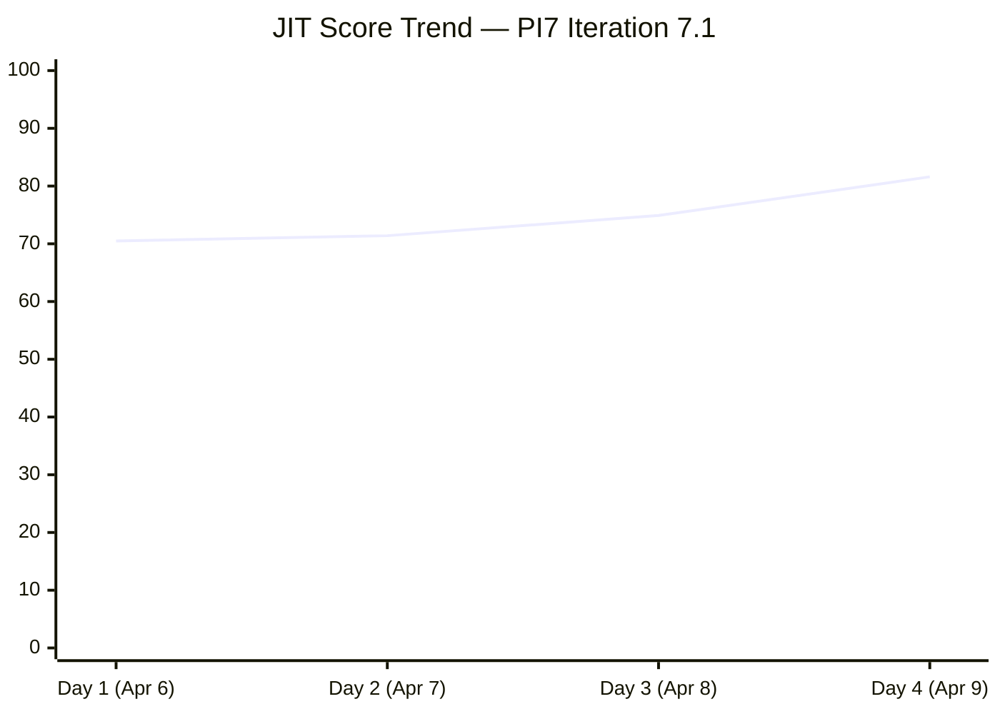
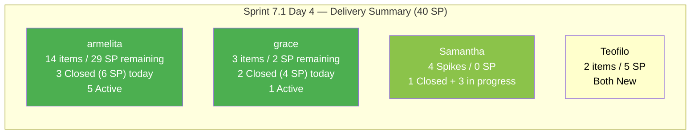

# SAFe Audit Report — JIT Operation Team | Iteration 7.1 Day 4

## 1. Audit Metadata

| Field | Value |
|-------|-------|
| **Project** | Jairosoft Portfolio |
| **Project ID** | `666bb99a-6acd-4999-bb34-efd0e4ea90dc` |
| **Team** | JIT Operation Team |
| **Team ID** | `b25e3129-6272-4e54-a3ff-f1ef3c8eeb2c` |
| **Workspace Folder** | `ado_jit` |
| **Board URL** | [Stories and Deliverables](https://dev.azure.com/jairo/Jairosoft%20Portfolio/_boards/board/t/JIT%20Operation%20Team/Stories%20and%20Deliverables) |
| **Current Iteration** | Iteration 7.1 |
| **Iteration Path** | `Jairosoft Portfolio\2026-PI7\Iteration 7.1` |
| **Iteration ID** | `6079f2b6-2f7c-4b10-adfd-93071eb965f7` |
| **Iteration Start** | April 6, 2026 |
| **Iteration Finish** | April 19, 2026 |
| **Sprint Day** | Day 4 of 14 (Thursday, Apr 9) |
| **Audit Date** | April 9, 2026 — 09:00 PHT |
| **Previous Audit** | `AUDIT_20260408_0900.md` (Iteration 7.1 Day 3, Score 74.9/100 Moderate Risk) |
| **Overall Score** | **81.6 / 100 (Low Risk)** |
| **Scoring Rubric** | ADO SAFe v1 (seven-dimension deterministic scoring) |
| **Auditor** | AI EngProd Consultant |
| **Framework** | SAFe 6.0 |

> **Scope note:** This audit covers only the JIT Operation Team board in Jairosoft Portfolio. No other boards, teams, projects, or repositories were analyzed.

---

## 2. Executive Summary

This is the **fourth audit of Iteration 7.1** — Sprint Day 4 of 14. The score improves dramatically from **74.9 to 81.6**, crossing the Low Risk threshold for the **first time in the PI7 JIT audit series**. This is a gain of **+6.7 points** and a milestone achievement.

Key developments since Day 3:

- **5 items CLOSED**: #202189 (UIC Interns Final Demo, 2 SP), #202194 (UM Main BSIT/BSMMA Onboarding, 2 SP), #202203 (MMCM Interns Onboarding, 2 SP), #202352 (TESDA SAFe for Teams Microcredential, 2 SP), #202450 (TESDA Microcredential Program Submission, 2 SP) — **10 SP burned** on Day 4
- **Delivery Predictability jumps from 0.0 to 25.0**: 10 of 40 committed SP are now closed — a significant early-sprint delivery signal
- **Backlog stabilizes at 25 items**: One additional item (#201857 orphaned Training in 6.6 IP) visible vs. Day 3's 27-item view; all 24 iteration items confirmed in 7.1
- **Iteration Planning at 96.0**: 24 of 25 visible backlog items are in 7.1 — the strongest planning metric in the JIT PI7 series
- **#199092 touched today**: armelita updated TESDA Career Guidance item on Apr 9, reducing untouched count from 9 to 8
- **Untouched penalty persists**: 8 of 24 current items (33.3%) still changed before sprint start — Backlog Refinement holds at 80.0

The team has broken through the Moderate Risk ceiling and is now operating at **Low Risk**. With 10 SP closed on Day 4 (25% burn) and 10 remaining working days, the sprint is well-positioned to close above 70–80% delivery predictability if the current pace continues.



---

## 3. Previous Audit Delta

**Previous:** AUDIT_20260408_0900 — Iteration 7.1 Day 3, 09:00 PHT

| Metric | 7.1 Day 3 (Apr 8) | **7.1 Day 4 (Apr 9)** | Delta |
|--------|-------------------|----------------------|-------|
| Iteration | 7.1 Day 3 | **7.1 Day 4** | +1 day |
| Visible Backlog | 27 | **25** | **-2** (minor backlog API stabilization) |
| Current Iteration Items | 24 | **24** | 0 |
| Items Closed | 0 | **5** | **+5** |
| Items Active | 8 | **5** | **-3** (some Active → Closed) |
| SP Burned | 0 | **10** | **+10** |
| Committed SP | 36 | **40** | **+4** (full SP tally confirmed: 40 SP) |
| Untouched Items (current) | 9/20 (45.0%) | **8/24 (33.3%)** | **-1** (#199092 updated Apr 9) |
| Overall Score | 74.9 (Moderate) | **81.6 (Low Risk)** | **+6.7** |
| Iteration Planning | 74.1 | **96.0** | **+21.9** |
| Team Capacity | 100.0 | **100.0** | 0 |
| Estimation | 100.0 | **100.0** | 0 |
| DoR Compliance | 100.0 | **100.0** | 0 |
| Work Item Balance | 70.0 | **70.0** | 0 |
| Backlog Refinement | 80.0 | **80.0** | 0 |
| Delivery Predictability | 0.0 | **25.0** | **+25.0** |

**Key changes since Day 3:**

1. **5 closures today** — armelita and grace delivered 10 SP, breaking the 0-closure early-sprint pattern
2. **Iteration Planning jumps to 96.0** — Backlog view now returns 25 items (vs 27 Day 3); with 24 in 7.1, the ratio is near-perfect
3. **DP = 25.0** — First non-zero Delivery Predictability in PI7 for JIT team; 10/40 SP closed
4. **#199092 touched** — armelita updated TESDA Career Guidance item, reducing untouched count from 9 to 8 (penalty threshold persists at 33.3% > 30%)
5. **Committed SP revised to 40** — Full tally of all 20 point-eligible items confirms 40 SP total (up from 36 SP reported in Day 3, which excluded some items from the count)

---

## 4. Current Iteration Snapshot

### 4.1 Sprint Scope

| Metric | Value |
|--------|-------|
| Iteration | Iteration 7.1 |
| Date Range | April 6 - April 19, 2026 (14 days) |
| Sprint Day | Day 4 of 14 (~29% elapsed) |
| Items in 7.1 | 24 |
| Items Closed | 5 |
| Items Active | 5 |
| Items New | 4 |
| Items in Workflow (Estimation/Requirements/Validation/Ready) | 10 |
| Story Points Committed | 40 SP |
| SP Burned | 10 SP |
| SP Remaining | 30 SP |
| Burn Rate | 2.5 SP/day (10 SP in 4 days) |
| Sprint Status | **IN PROGRESS — Delivery Underway** |

### 4.2 Team Capacity

| Member | Capacity/Day | Activity | Items in 7.1 | SP | Notes |
|--------|-------------|----------|--------------|-----|-------|
| **armelita** | 6 hrs | Documentation | 14 | 29 SP | 3 items Closed today; 5 Active |
| **grace** | 1 hr | Documentation | 3 | 6 SP | 2 items Closed; 1 Active |
| **Samantha Babael** | 1 hr | Documentation | 4 | 0 SP (Spikes) | 1 Closed Spike; 3 in progress |
| **Teofilo Limpag** | 6 hrs | Training | 3 | 5 SP | 2 Training items New; 1 item in 7.1 context |
| **TOTAL** | **14 hrs/day** | | **24** | **40 SP** | No days off |

**Note on committed SP breakdown:** armelita carries 14 items with 29 SP (72.5% of committed SP) after the 5 closures. Grace now accounts for 2 closed items (4 SP) + 2 Active items (4 SP). Teofilo's 2 Training items (5 SP combined) remain New.

### 4.3 Current Iteration Items — Full Inventory (24 Items)

| # | ID | Type | Title | State | Assignee | SP | Changed | Untouched? |
|---|----|----|-------|-------|----------|----|---------|------------|
| 1 | 197617 | User Story | SK Buhangin Partnership | Ready for Dev | armelita | 1 | Mar 24 | Yes |
| 2 | 198615 | User Story | Awarding of CSS NC II Certificates | Ready for Dev | armelita | 2 | Mar 24 | Yes |
| 3 | 199092 | User Story | TESDA Career Guidance Programs Semestral Report | **Active** | armelita | 2 | **Apr 9** | No |
| 4 | 200593 | User Story | AC Resubmission Result | **Active** | armelita | 1 | Apr 7 | No |
| 5 | 200597 | User Story | CSS NC II AC Registration Fee | Estimation | armelita | 2 | Mar 31 | Yes |
| 6 | 200604 | User Story | Python Inquiries | Ready for Dev | armelita | 2 | Mar 29 | Yes |
| 7 | 200770 | User Story | Cor Jesu Interns Final Demo & Certificates | New | armelita | 2 | Mar 17 | Yes |
| 8 | 201433 | User Story | T2 MIS Employment Report | **Active** | armelita | 2 | Apr 1 | Yes |
| 9 | 201504 | User Story | School Engagement & Flyering | **Active** | grace | 2 | Apr 3 | Yes |
| 10 | 201514 | User Story | "Free Discovery Day" Event | **Active** | grace | 2 | Apr 3 | Yes |
| 11 | 201865 | Training | 2.4-3 Prepare/Complete Reports per Criteria | New | Teofilo | 3 | Apr 7 | No |
| 12 | 202144 | Spike | Prepare Certificates for Cor Jesu Interns | Validation | Samantha | — | Apr 8 | No |
| 13 | **202145** | **Spike** | **Prepare Certificate for UIC Intern** | **Closed** | Samantha | — | **Apr 8** | No |
| 14 | 202146 | Spike | Social Media Post for UIC Intern | Requirements Gathering | Samantha | — | Apr 8 | No |
| 15 | 202147 | Spike | Social Media Post for Cor Jesu Interns | Requirements Gathering | Samantha | — | Apr 8 | No |
| 16 | **202189** | **User Story** | **UIC Interns Final Demo & Awarding (Computer Eng'g)** | **Closed** | armelita | **2** | **Apr 9** | No |
| 17 | **202194** | **User Story** | **UM Main BSIT/BSMMA Onboarding** | **Closed** | armelita | **2** | **Apr 8** | No |
| 18 | **202203** | **User Story** | **MMCM Interns Onboarding** | **Closed** | armelita | **2** | **Apr 9** | No |
| 19 | 202206 | User Story | Additional Trainer - Sam Approval Status | New | armelita | 3 | Apr 6 | No |
| 20 | 202219 | User Story | Market CSS NC II April 2026 Class | **Active** | armelita | 3 | Apr 8 | No |
| 21 | 202237 | User Story | Market Bubble MCC April 2026 Class | **Active** | armelita | 3 | Apr 8 | No |
| 22 | **202352** | **User Story** | **TESDA SAFe for Teams Microcredential Submission** | **Closed** | grace | **2** | **Apr 7** | No |
| 23 | 202385 | Training | Assessment COC 2 — Setup Computer Network | New | Teofilo | 2 | Apr 7 | No |
| 24 | **202450** | **User Story** | **TESDA Microcredential Program Submission** | **Closed** | grace | **2** | **Apr 8** | No |
| | **Total** | | | **5 Closed / 5 Active / 14 Other** | | **40 SP** | | **8 untouched** |

> **Untouched items (8 of 24, changed before Apr 6):** #197617 (Mar 24), #198615 (Mar 24), #200597 (Mar 31), #200604 (Mar 29), #200770 (Mar 17), #201433 (Apr 1), #201504 (Apr 3), #201514 (Apr 3). Note: #199092 was updated Apr 9 — resolved from untouched list.

### 4.4 Non-Current Backlog Item (1 item)

| ID | Type | Iteration | Title | Changed |
|----|------|-----------|-------|---------|
| 201857 | Training | Iteration 6.6 (IP) | 2.1-1 Network Design Discussion (Teofilo) | Mar 30 |

> #201857 remains orphaned in 6.6 IP. Decision needed: move to 7.1 or 7.2, or close if superseded by #202385 (Assessment COC 2). Teofilo has 6 h/day capacity and could absorb this training item.

---

## 5. Work Item Analysis

### 5.1 Work Item Type Distribution (Current Iteration — 24 items)

| Type | Count | Share | SP Committed | SP Closed |
|------|-------|-------|-------------|-----------|
| User Story | 18 | 75.0% | 36 SP | 8 SP |
| Training | 2 | 8.3% | 5 SP | 0 SP |
| Spike | 4 | 16.7% | — | 0 SP (202145 closed) |
| **Total** | **24** | **100%** | **40 SP** | **10 SP** |

User Story at 75% exceeds the 60% dominant-type threshold → -30 Work Item Balance penalty. Spike share at 16.7% is well below the 40% threshold. Type diversity (3 types) is the most varied sprint composition in the JIT PI7 series.

### 5.2 State Distribution (Current Iteration — 24 items)

| State | Count | SP |
|-------|-------|----|
| **Closed** | **5** | **10 SP** |
| Active | 5 | 10 SP |
| New | 4 | 8 SP |
| Ready for Dev | 3 | 5 SP |
| Estimation | 1 | 2 SP |
| Validation | 1 | — |
| Requirements Gathering | 2 | — |
| Approval Pending | 3 | — |
| **Total** | **24** | **40 SP** |

5 closures on Day 4 represent the team's best single-day delivery in PI7. Closed items span armelita (3 User Stories: intern onboarding + final demo), grace (2 User Stories: TESDA microcredential submissions), and Samantha (1 Spike: UIC certificate — closed Apr 8, confirmed today).

### 5.3 DoR Compliance Assessment

All 24 current iteration items pass DoR thresholds:

- All have Description content >= 30 non-whitespace characters (verified in batch data)
- All have Acceptance Criteria >= 20 non-whitespace characters (verified in batch data)
- DoR compliance = 24/24 = **100%**

Closed items also had passing DoR at time of closure. Spike items (#202144, #202145, #202146, #202147) have well-formed objectives and clear completion criteria.

### 5.4 Freshness Assessment (All 25 Visible Backlog Items)

Reference dates (relative to Apr 9, 2026):

- **Fresh threshold:** February 23, 2026 (45 days prior)
- **Stale-90 threshold:** January 9, 2026 (90 days prior)
- **Stale-180 threshold:** October 12, 2025 (180 days prior)

| Metric | Value | Status |
|--------|-------|--------|
| Fresh (changed after Feb 23) | 25/25 (100%) | Base = 100.0 |
| Stale-90 (changed before Jan 9) | 0/25 (0%) | No penalty |
| Stale-180 (changed before Oct 12, 2025) | 0/25 (0%) | No penalty |
| Untouched current items (changed before Apr 6) | 8/24 (33.3%) | **−20 penalty (> 30%)** |

8 of 24 current items were last modified before the sprint start. This is an improvement from 9/20 = 45% on Day 3 (with #199092 now updated today). The penalty threshold (30%) is still exceeded. 5 more items would need to be touched (reducing to 3/24 = 12.5%) to drop the untouched share below 30% and eliminate the penalty.



---

## 6. SAFe Compliance Scorecard

| # | Dimension | Score | Formula | Evidence | Notes |
|---|-----------|-------|---------|----------|-------|
| 1 | **Iteration Planning** | **96.0** | 24/25 × 100 | 24 of 25 visible items in 7.1 | Series high; only #201857 (6.6 IP) outside 7.1 |
| 2 | **Team Capacity** | **100.0** | 4/4 × 100 | All 4 contributors with work have capacity | armelita carries 14 items / 29 SP |
| 3 | **Estimation** | **100.0** | 20/20 × 100 | All 20 point-eligible items have SP > 0 | 4 Spikes excluded; 40 SP total |
| 4 | **DoR Compliance** | **100.0** | 24/24 × 100 | All pass Desc ≥ 30 AND AC ≥ 20 chars | Including 5 closed items |
| 5 | **Work Item Balance** | **70.0** | 100 − 30 | US present (no −40); 75% dominant (−30) | Training+Spike add diversity |
| 6 | **Backlog Refinement** | **80.0** | 100.0 − 20 | 25/25 fresh; 0 stale; 8/24 untouched (−20) | 1 item resolved; 8 remain untouched |
| 7 | **Delivery Predictability** | **25.0** | 10/40 × 100 | 10 of 40 committed SP closed | 5 items closed on Day 4; first non-zero DP in PI7 |
| | **Overall** | **81.6** | 571.0 / 7 | **Low Risk (≥ 80)** | +6.7 vs Day 3 — series high, first Low Risk |

### Score Computation Detail

```
Iteration Planning:       round(24/25 × 100, 1)        = 96.0
Team Capacity:            round(4/4 × 100, 1)           = 100.0
Estimation:               round(20/20 × 100, 1)         = 100.0
  (point_eligible = 24 items − 4 Spikes = 20; all 20 have SP > 0)
DoR Compliance:           round(24/24 × 100, 1)         = 100.0
Work Item Balance:
  User Story present: no −40 penalty
  dominant_type = 18/24 = 75.0% > 60%: −30
  spike_share = 4/24 = 16.7%: no −20 (not > 40%)
  Result: 100 − 30                                      = 70.0
Backlog Refinement:
  base = round(25/25 × 100, 1)                         = 100.0
  stale_90: 0/25 = 0% → no penalty
  stale_180: 0 → no penalty
  untouched: 8/24 = 33.3% > 30%: −20
  Result: 100.0 − 20                                   = 80.0
Delivery Predictability:  round(10/40 × 100, 1)         = 25.0
  (5 closed items: 202189 2SP + 202194 2SP + 202203 2SP
                   + 202352 2SP + 202450 2SP = 10 SP)
  (202145 Spike is Closed but excluded from SP count)

Overall: (96.0 + 100.0 + 100.0 + 100.0 + 70.0 + 80.0 + 25.0) / 7
       = 571.0 / 7
       = 81.6 (Low Risk)
```

### Score Trend — Last 5 Audits

| Audit Date | Iteration | Day | Score | Band | Key Event |
|------------|-----------|-----|-------|------|-----------|
| Apr 6 | 7.1 | Day 1 | 70.5 | Moderate | PI7 launch |
| Apr 7 | 7.1 | Day 2 | 71.4 | Moderate | Teofilo engaged; 20 items |
| Apr 8 | 7.1 | Day 3 | 74.9 | Moderate | Backlog stabilized; 8 Active |
| **Apr 9** | **7.1** | **Day 4** | **81.6** | **Low Risk** | **5 closures; 10 SP burned; first Low Risk** |



```mermaid
bar
    title SAFe Dimension Scores — JIT Team Day 4
    x-axis [IP, TC, Est, DoR, WIB, BR, DP]
    y-axis 0 --> 100
    bar [96, 100, 100, 100, 70, 80, 25]
```

### Score Projection — Remaining Sprint

| Scenario | SP Closed (additional) | Total SP Closed | DP | Projected Overall |
|----------|----------------------|-----------------|-----|------------------|
| Current (Day 4) | — | 10 / 40 | 25.0 | **81.6 (Low Risk)** |
| Day 7 target | +15 SP | 25 / 40 | 62.5 | 87.6 (Low Risk) |
| Day 10 target | +20 SP | 30 / 40 | 75.0 | 90.1 (Low Risk) |
| Full burn | +30 SP | 40 / 40 | 100.0 | 92.3 (Low Risk) |
| + Untouched resolved | Untouched → 0 | 40 / 40 | 100.0 | **95.1 (Low Risk)** |

---

## 7. Dimension Findings

### 7.1 Iteration Planning (96.0/100) — SERIES HIGH (+21.9)

24 of 25 visible backlog items are committed to Iteration 7.1 — the strongest Iteration Planning score in the entire JIT PI7 audit series. The single non-current item is #201857 (Training in 6.6 IP). Resolving this one item (moving to 7.1, 7.2, or closing) would bring Iteration Planning to 100.0. This is highly actionable — Teofilo is the assignee and has 6 h/day capacity.

**Path to 100.0:** Move or close #201857. This item references "2.1-1 Network Design Discussion" — if the content has been superseded by #202385 (Assessment COC 2), it should be closed with a comment referencing the replacement.

### 7.2 Team Capacity (100.0/100) — FULL

All 4 contributors have capacity configured and active work in 7.1. No days off recorded. armelita carries a disproportionate load (14 items, 29 SP remaining) but has demonstrated the ability to close multiple items in a single day (3 closures on Day 4). The concentration risk remains but execution is validating the capacity plan.

### 7.3 Estimation (100.0/100) — FULL

All 20 point-eligible items (18 User Stories + 2 Training) have Story Points > 0. The 4 Spikes are correctly excluded from estimation scoring. Committed total = 40 SP. With 10 SP closed, 30 SP remains. SP accuracy has been consistent throughout PI7.

### 7.4 DoR Compliance (100.0/100) — FULL

All 24 current iteration items (including the 5 closed) had well-formed Descriptions and Acceptance Criteria passing minimum thresholds. The Spike items that closed (#202145) and those in progress (#202144, #202146, #202147) all have clearly stated spike objectives and clear "Done" criteria — exemplary DoR quality for Spike items.

### 7.5 Work Item Balance (70.0/100) — STABLE

Sprint composition: 18 User Stories (75%), 2 Training (8.3%), 4 Spikes (16.7%). User Stories at 75% trigger the dominant-type penalty (-30). The Work Item Balance score has been locked at 70.0 since Day 1 of 7.1. Closing User Story items reduces numerator and denominator proportionally — the percentage won't shift unless new non-US items are added. If Teofilo's Training item #201857 is moved into 7.1, the Training count rises to 3, improving type diversity slightly (US share: 18/25 = 72%, still above 60%).

### 7.6 Backlog Refinement (80.0/100) — STABLE (-20 penalty persists)

All 25 visible backlog items are fresh (changed within 45 days). The persistent issue is the 8 untouched current items (33.3% > 30% threshold). #199092 was touched today (updated Apr 9) — progress. The remaining 8 untouched items are:

| # | ID | Title | Assignee | Last Changed | Days Untouched |
|---|----|----|----------|-------------|----------------|
| 1 | 197617 | SK Buhangin Partnership | armelita | Mar 24 | 16 days |
| 2 | 198615 | Awarding of CSS NC II Certificates | armelita | Mar 24 | 16 days |
| 3 | 200597 | CSS NC II AC Registration Fee | armelita | Mar 31 | 9 days |
| 4 | 200604 | Python Inquiries | armelita | Mar 29 | 11 days |
| 5 | 200770 | Cor Jesu Interns Final Demo & Certificates | armelita | Mar 17 | 23 days |
| 6 | 201433 | T2 MIS Employment Report | armelita | Apr 1 | 8 days |
| 7 | 201504 | School Engagement & Flyering | grace | Apr 3 | 6 days |
| 8 | 201514 | "Free Discovery Day" Event | grace | Apr 3 | 6 days |

**Remediation:** Touching 6 of these 8 items (adding a description update or progress comment) would reduce untouched share to 2/24 = 8.3% < 10% (no penalty), improving Backlog Refinement from 80.0 to 100.0 and overall score from 81.6 to approximately **84.2**.

### 7.7 Delivery Predictability (25.0/100) — FIRST NON-ZERO IN PI7

10 SP closed across 5 items on Day 4. This is the team's first delivery event in PI7 and demonstrates strong execution capability. The closures span multiple team members and item types:

| Item | Type | Assignee | SP | Notes |
|------|------|----------|----|-------|
| #202189 UIC Final Demo | User Story | armelita | 2 | Event completed; certificates awarded |
| #202194 UM Main Onboarding | User Story | armelita | 2 | Interns onboarded and deployed |
| #202203 MMCM Onboarding | User Story | armelita | 2 | Interns onboarded and deployed |
| #202352 TESDA SAFe for Teams | User Story | grace | 2 | Microcredential module submitted |
| #202450 TESDA Microcredential | User Story | grace | 2 | Microcredential package submitted |
| #202145 UIC Certificate Spike | Spike | Samantha | — | Certificate process defined (no SP) |

**At current burn rate (2.5 SP/day):** With 10 remaining working days, expected total burn = 10 + (2.5 × 10) = 35 SP → DP = 35/40 = 87.5 → Overall ≈ 90.1.

---

## 8. Risks and Bottlenecks

| # | Risk | Severity | Status | Mitigation |
|---|------|----------|--------|------------|
| R1 | **armelita carries 14 items / 29 SP remaining** | High | Monitored | Strong closure pace on Day 4; prioritize top 10; consider deferring #200770, #200604 |
| R2 | **8 of 24 items untouched** | Moderate | Persists; improved from 9 | −20 BR penalty; touch 6 items to clear penalty; value = +2.6 overall |
| R3 | **#201857 (Training) orphaned in 6.6 IP** | Low | Persists | Sole non-current item; move to 7.1 or close; would push IP to 100.0 |
| R4 | **Teofilo's Training items still New** | Low | Day 4 | Both #201865 and #202385 in New state; activate this week |
| R5 | **grace's Active items (#201504, #201514) unchanged since Apr 3** | Moderate | Monitoring | Active since before sprint; if work is done, close to improve DP |
| R6 | **No iteration goal documented** | High | Unchanged all PI7 audits | Define sprint goal immediately |
| R7 | **armelita's #201433 (T2 MIS) last changed Apr 1** | Low | Monitoring | Active but not touched since Apr 1; confirm status |
| R8 | **PI6 Spike #200766 still in old iteration** | Low | Unchanged | ODOO OpenCat SIS spike; close or archive |



---

## 9. Prioritized Recommendations

### P0 — Urgent (Today)

1. **Touch the 8 untouched current items.** Add a progress comment or description update to #197617, #198615, #200597, #200604, #200770, #201433, #201504, #201514. Even touching 6 items clears the > 30% threshold and removes the −20 Backlog Refinement penalty, improving the overall score from 81.6 to approximately **84.2**.

2. **Define Iteration 7.1 sprint goal.** Absent across all PI7 audits. Suggested: *"Complete TESDA compliance submissions and intern program closures (UIC, Cor Jesu, MMCM done!), launch CSS NC II and Bubble MCC marketing campaigns, finalize COC assessment and training delivery items."*

### P1 — This Week

1. **Close grace's Active items (#201504, #201514).** Both School Engagement and Free Discovery Day have been Active since Apr 3. If execution is complete or sufficiently progressed, close them now. 4 SP closed → DP rises to 35.0% → overall ≈ 83.1.

2. **Activate Teofilo's Training items (#201865, #202385).** Both remain New on Day 4. Teofilo has 6 h/day and 10 working days remaining. Activating these items and beginning delivery is expected.

3. **Close or move #201857 (Teofilo Training in 6.6 IP).** If superseded by #202385, close with a "Superseded by #202385" comment. This removes the only non-current backlog item and pushes Iteration Planning to 100.0.

### P2 — This Sprint

1. **Continue armelita's current closure cadence.** With 3 closures on Day 4, maintain 2–3 closures every 2–3 days. Priority queue: #200593 (AC Resubmission, 1 SP), #199092 (TESDA Career Guidance, Active), #202219 (Market CSS NC II, Active, 3 SP), #202237 (Market Bubble MCC, Active, 3 SP).

2. **Defer #200770 (Cor Jesu Interns Demo) and/or #200604 (Python Inquiries) to 7.2 if schedule is tight.** These are lower-urgency items last changed in March. Deferral reduces armelita's load and focuses delivery on high-value items.

3. **Progress Samantha's Spikes (#202144, #202146, #202147)** toward closure. These are Requirements Gathering / Validation states — move to closure to demonstrate Spike delivery.

### P3 — Structural

1. **Link PI7 objectives and connect sprint stories to Features.** This is the most persistent structural gap across all PI7 audits. Connecting work to PI objectives would enable portfolio-level visibility and improve SAFe framework compliance.

2. **Archive or close PI6 Spike #200766 (ODOO OpenCat SIS).** This Spike has been active across multiple PIs without resolution. PO decision required.

---

## 10. Evidence Gaps and Limitations

| # | Gap | Impact | Notes |
|---|-----|--------|-------|
| G1 | **Committed SP tally revised to 40** | Score recalculation from 36 to 40 SP | Full item-by-item SP sum confirms 40 SP; DP calculated on correct denominator |
| G2 | **8 untouched current items** | −20 Backlog Refinement penalty | Items not updated since before sprint start; team review needed |
| G3 | **armelita concentration risk** | Single point of failure for 72.5% of remaining SP | Structural; 14 items on one person |
| G4 | **#201857 (Training) in 6.6 IP** | Non-current backlog item reduces IP from 100 to 96 | Needs PO decision (close/move) |
| G5 | **No iteration goal documented** | Cannot verify sprint goal via API | Absent across all PI6/PI7 JIT audits |
| G6 | **Teofilo Training items both New on Day 4** | 5 SP at risk if not activated | Should be Active by Day 5 |
| G7 | **grace's items Active since Apr 3** | 4 SP potentially ready to close | Verify completion status and close if done |
| G8 | **ADO project is Jairosoft Portfolio (not FINOPS)** | Different project context | Documented; all queries use correct project/team IDs |

---

*Report generated: April 9, 2026 09:00 PHT | SAFe 6.0 Framework | ADO SAFe v1 (seven-dimension deterministic scoring)*
*Jairosoft Portfolio — JIT Operation Team | Iteration 7.1: Apr 6 – Apr 19, 2026*
*Overall Score: **81.6/100 (Low Risk)** | Day 4 of 14 — SERIES HIGH, FIRST LOW RISK IN PI7*
*Previous: AUDIT_20260408_0900.md (Day 3, 74.9/100, Moderate Risk) | +6.7 change*
*Sprint: 24 items committed (40 SP) across 4 contributors | 5 Closed (10 SP), 5 Active*
*Key milestone: First Low Risk score in PI7 JIT audit series | 10 SP burned on Day 4*
