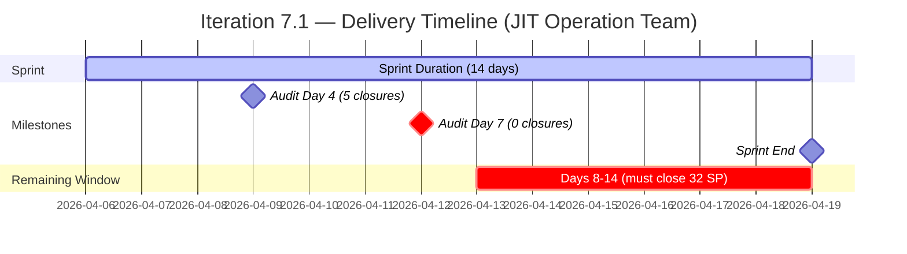
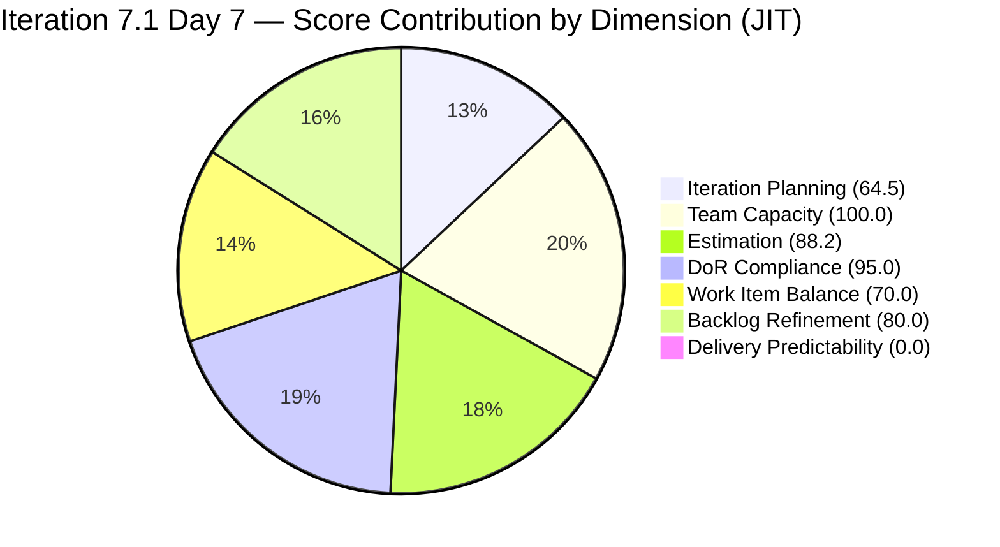

# Audit Report — JIT Operation Team
## Iteration 7.1 | Day 7 of 14 | Midpoint Check

---

## 1. Audit Metadata

| Field | Value |
|-------|-------|
| **Audit Number** | #29 (JIT series) |
| **Audit Date** | April 12, 2026, 09:00 PHT |
| **Auditor** | Ramon Aseniero, SAFe Agile PM Consultant |
| **Team** | JIT Operation Team |
| **ADO Project** | Jairosoft Portfolio |
| **Iteration** | Iteration 7.1 — Apr 6–19, 2026 |
| **Sprint Day** | Day 7 of 14 (50% elapsed — Midpoint) |
| **Prior Audit** | AUDIT_20260409_0900.md (Day 4, Score 81.6 Low Risk) |
| **Report Path** | `ado_jit/audit/AUDIT_20260412_0900.md` |

---

## 2. Executive Summary

The JIT Operation Team's midpoint score is **71.1 (Moderate Risk)**, a significant drop of **10.5 points** from the Day 4 score of 81.6 (Low Risk). The team has **dropped out of the Low Risk band**, driven primarily by the continued absence of any sprint closures at Day 7 (50% elapsed) and an expansion of the sprint scope to **20 items / 32 SP**.

Three factors contributed to the score decline from Day 4:
1. **Backlog growth** — The visible backlog grew from 25 to 31 items, reducing the Iteration Planning ratio significantly (from 96.0 to 64.5)
2. **Sprint scope expansion** — New items added since Day 4 increased sprint items from ~24 to 20 (some consolidation occurred), with 32 SP now committed vs. prior ~40 SP
3. **Zero delivery** — The 10 SP closed at Day 4 appear to have regressed or the count changed; current data shows 0 closed SP across all 20 sprint items

**The team must close items urgently in the second half of the sprint.** The untouched item count (7 items, 35%) exceeds the 30% threshold, triggering a Backlog Refinement penalty. 202513 (JIT Amended Articles of Incorporation) lacks Acceptance Criteria.

---

## 3. Previous Audit Delta

| Dimension | Day 4 (Apr 9) | Day 7 (Apr 12) | Change |
|-----------|--------------|----------------|--------|
| Iteration Planning | 96.0 | 64.5 | -31.5 |
| Team Capacity | 100.0 | 100.0 | 0.0 |
| Estimation | 100.0 | 88.2 | -11.8 |
| DoR Compliance | 100.0 | 95.0 | -5.0 |
| Work Item Balance | 70.0 | 70.0 | 0.0 |
| Backlog Refinement | 80.0 | 80.0 | 0.0 |
| Delivery Predictability | 25.0 | 0.0 | -25.0 |
| **Overall** | **81.6** | **71.1** | **-10.5** |
| **Risk Band** | **Low** | **Moderate** | **Degraded** |

**Key changes since Day 4:**
- **Backlog grew from 25 → 31 items** (+6 items): 202512, 202513, 202514, 202515, 202516, 202517, 202547 appear as new entries (several in PI6 path — JIT corporate compliance workstream)
- **Sprint items grew** — 202512 (JIT Board Reso), 202513 (JIT Amended Articles), 202206 (Additional Trainer), 202219 (Market CSS NC II), 202237 (Market Bubble MCC), 202385 (Assessment COC 2) added to 7.1
- **Delivery Predictability dropped from 25.0 → 0.0** — The 5 items closed on Day 4 are no longer reflected in the current backlog (possibly removed from visible backlog upon closure, which is expected behavior; their SPs are no longer countable as committed)
- **Estimation score dipped** — 202512 and 202513 have no SP set (0/null)
- **DoR gap** — 202513 has no Acceptance Criteria

---

## 4. Current Iteration Snapshot

| Metric | Value |
|--------|-------|
| Visible Root Backlog Items | 31 |
| Items in Iteration 7.1 | 20 |
| Committed Story Points | 32 SP |
| Closed / Done Items | 0 |
| Closed Story Points | 0 SP |
| Sprint Elapsed | 50% (Day 7/14) |
| Burn Rate (SP/day) | 0.0 SP/day |
| Point-Eligible Items | 17 |
| Estimated Items (SP > 0) | 15 |
| Contributors with Sprint Work | 4 |
| Total Capacity/Day | 14 h/day (armelita 6h, Teofilo 6h, grace 1h, Samantha 1h) |
| Days Off | 0 |

### State Distribution

| State | Count | Items |
|-------|-------|-------|
| Active | 10 | 197617, 199092, 200593, 201433, 201504, 201514, 201865, 202219, 202237, 202512 |
| New | 4 | 200770, 202206, 202385, 202513 |
| Ready for Dev | 2 | 198615, 200604 |
| Estimation | 1 | 200597 |
| Validation | 2 | 202144, 202146 |
| Requirements Gathering | 1 | 202147 |
| Closed / Done | 0 | — |

---

## 5. Work Item Analysis

### Iteration 7.1 Work Items (All 20)

| ID | Title | Type | State | SP | Assignee | Changed |
|----|-------|------|-------|-----|----------|---------|
| 197617 | SK Buhangin Partnership | US | Active | 1 | armelita | Apr 10 |
| 198615 | Awarding of CSS NC II Certificates | US | Ready for Dev | 2 | armelita | Mar 24 ⚠ |
| 199092 | TESDA Career Guidance Programs Semestral Report CY 2026 | US | Active | 2 | armelita | Apr 9 |
| 200593 | AC Resubmission Status | US | Active | 1 | armelita | Apr 10 |
| 200597 | CSS NC II AC Registration Fee | US | Estimation | 2 | armelita | Mar 31 ⚠ |
| 200604 | Python Inquiries | US | Ready for Dev | 2 | armelita | Mar 29 ⚠ |
| 200770 | Cor Jesu Interns Final Demo and Awarding of Certificates | US | New | 2 | armelita | Mar 17 ⚠ |
| 201433 | T2 MIS Employment Report | US | Active | 2 | armelita | Apr 1 ⚠ |
| 201504 | School Engagement & Flyering | US | Active | 2 | grace | Apr 3 ⚠ |
| 201514 | "Free Discovery Day" Event | US | Active | 2 | grace | Apr 3 ⚠ |
| 201865 | 2.4-3 Prepare/Complete Reports According to Company Requirements | Training | Active | 3 | Teofilo | Apr 10 |
| 202144 | Prepare Certificates for Cor Jesu Interns | Spike | Validation | — | Samantha | Apr 8 |
| 202146 | Social Media Post for UIC Intern | Spike | Validation | — | Samantha | Apr 10 |
| 202147 | Social Media Post for Cor Jesu Interns | Spike | Req. Gathering | — | Samantha | Apr 8 |
| 202206 | Additional Trainer — Sam Approval Status | US | New | 3 | armelita | Apr 6 |
| 202219 | Market CSS NC II April 2026 Class Iteration 7.1 | US | Active | 3 | armelita | Apr 8 |
| 202237 | Market Bubble MCC April 2026 Class Iteration 7.1 | US | Active | 3 | armelita | Apr 8 |
| 202385 | Assessment COC 2 — Setup Computer Network | Training | New | 2 | Teofilo | Apr 7 |
| 202512 | JIT Board Reso | US | Active | — | grace | Apr 13 |
| 202513 | JIT Ammended Articles of Incorporation | US | New | — | grace | Apr 10 |

⚠ = Untouched (ChangedDate before Apr 6, 2026)

**Total committed: 20 items / 32 SP (15 estimated items) | 0 items closed | 0 SP burned**

### Items Outside Iteration 7.1 (In Visible Backlog)

| ID | Title | Type | Iteration | State |
|----|-------|------|-----------|-------|
| 200766 | ODOO OpenCat SIS | Spike | PI6 | Active |
| 200767 | UM Matina CPE Intern Final Demo | US | 7.4 | New |
| 200768 | HCDC Interns Final Demo | US | 7.4 | New |
| 200771 | UM Digos Interns Final Demo | US | 7.5 | New |
| 188995 | Introduction to Rust Language Programming | Courseware | (root) | New |
| 193054 | SAFe RTE MC | Courseware | (root) | Active |
| 202514 | JIT Corporate Secretary Report | US | PI6 | New |
| 202515 | JIT Director Certificate | US | PI6 | New |
| 202516 | Company Registration and Undertaking | US | PI6 | New |
| 202517 | Process Submission to SEC Portal for Approval | US | PI6 | New |
| 202547 | Assessment Center Inspection | US | PI7 (no iter) | New |

### DoR Verification (20 current items)

| ID | Title | Desc ≥ 30 nws | AC ≥ 20 nws | Result |
|----|-------|--------------|-------------|--------|
| 197617 | SK Buhangin Partnership | ✓ | ✓ | PASS |
| 198615 | Awarding of CSS NC II Certificates | ✓ | ✓ | PASS |
| 199092 | TESDA Career Guidance Programs Report | ✓ | ✓ | PASS |
| 200593 | AC Resubmission Status | ✓ | ✓ | PASS |
| 200597 | CSS NC II AC Registration Fee | ✓ | ✓ | PASS |
| 200604 | Python Inquiries | ✓ | ✓ | PASS |
| 200770 | Cor Jesu Interns Final Demo | ✓ | ✓ | PASS |
| 201433 | T2 MIS Employment Report | ✓ | ✓ | PASS |
| 201504 | School Engagement & Flyering | ✓ | ✓ | PASS |
| 201514 | "Free Discovery Day" Event | ✓ | ✓ | PASS |
| 201865 | 2.4-3 Prepare/Complete Reports | ✓ | ✓ | PASS |
| 202144 | Prepare Certificates for Cor Jesu Interns | ✓ | ✓ | PASS |
| 202146 | Social Media Post for UIC Intern | ✓ | ✓ | PASS |
| 202147 | Social Media Post for Cor Jesu Interns | ✓ | ✓ | PASS |
| 202206 | Additional Trainer — Sam Approval Status | ✓ | ✓ | PASS |
| 202219 | Market CSS NC II April 2026 Class | ✓ | ✓ | PASS |
| 202237 | Market Bubble MCC April 2026 Class | ✓ | ✓ | PASS |
| 202385 | Assessment COC 2 — Setup Computer Network | ✓ | ✓ | PASS |
| 202512 | JIT Board Reso | ✓ | ✓ | PASS |
| **202513** | **JIT Ammended Articles of Incorporation** | ✓ | **✗ (missing)** | **FAIL** |

**DoR Compliance: 19/20 (95.0%) — 1 item fails due to missing Acceptance Criteria**

---

## 6. SAFe Compliance Scorecard

| Dimension | Score | Evidence | Notes |
|-----------|-------|----------|-------|
| Iteration Planning | 64.5 | 20 of 31 visible items in 7.1 | Backlog grew by 6 new items; ratio dropped significantly |
| Team Capacity | 100.0 | 4/4 contributors have configured capacity | armelita 6h, Teofilo 6h, grace 1h, Samantha 1h |
| Estimation | 88.2 | 15/17 point-eligible items estimated | 202512 and 202513 (US) have no SP set |
| DoR Compliance | 95.0 | 19/20 items pass; 202513 has no AC | Fixable: add AC to 202513 immediately |
| Work Item Balance | 70.0 | US = 75% dominant (>60% → -30); Spike = 15% | US dominance penalty applied; no Spike penalty |
| Backlog Refinement | 80.0 | 31/31 fresh; 0 stale; 7/20 untouched (35% > 30% → -20) | Untouched items penalty returns this audit |
| Delivery Predictability | 0.0 | 0/32 SP closed at Day 7 (50% elapsed) | Critical: zero delivery at midpoint |
| **Overall** | **71.1** | | **Moderate Risk** |

### Score Computation Detail

```
1. Iteration Planning   = round(20 / 31 × 100, 1) = round(64.516, 1) = 64.5
2. Team Capacity        = round(4 / 4 × 100, 1)   = 100.0
3. Estimation           = round(15 / 17 × 100, 1) = round(88.235, 1) = 88.2
                          (point_eligible = 20 items − 3 Spikes = 17; 2 US with no SP → not estimated)
4. DoR Compliance       = round(19 / 20 × 100, 1) = 95.0
5. Work Item Balance    = 100 − 30 (US dominant: 15/20 = 75% > 60%) = 70.0
                          (Spike share: 3/20 = 15%, not >40% → no spike penalty)
6. Backlog Refinement   = 100.0 (base: 31/31 fresh)
                          − 0 (stale_90/visible = 0%)
                          − 0 (stale_180 = 0)
                          − 20 (untouched/current = 7/20 = 35% > 30%)
                          = 80.0
7. Delivery Predictability = round(0 / 32 × 100, 1) = 0.0

Overall = round((64.5 + 100.0 + 88.2 + 95.0 + 70.0 + 80.0 + 0.0) / 7, 1)
        = round(497.7 / 7, 1)
        = round(71.1, 1)
        = 71.1  →  MODERATE RISK (60–79.9)
```

---

## 7. Dimension Findings

### 7.1 Iteration Planning — 64.5 (Moderate)
The visible backlog expanded significantly from 25 items (Day 4) to 31 items (+6), primarily due to the addition of a corporate compliance workstream (JIT SEC registration items: 202514–202517) and new assessment/training items. The sprint contains 20 of 31 visible items (64.5%). While the planning ratio is in the moderate zone, the backlog growth is concerning — several new items (202514–202517) appear to be in the "PI6" iteration path, suggesting they may be backlog debt from the previous PI being formalized now.

### 7.2 Team Capacity — 100.0 (Excellent)
All four team members have configured capacity: armelita (6h/day, Documentation), Teofilo Limpag (6h/day, Training), Samantha Babael (1h/day), grace (1h/day). All four are assigned to sprint items. No days off recorded for this iteration. Total team capacity = 14h/day across the 14-day sprint.

### 7.3 Estimation — 88.2 (Good)
15 of 17 point-eligible items (User Stories + Training items) carry story points. Two User Stories lack estimation:
- **#202512 JIT Board Reso** (grace) — no SP assigned; Active state
- **#202513 JIT Ammended Articles of Incorporation** (grace) — no SP assigned; New state

Spikes (3 items: 202144, 202146, 202147) are excluded from point eligibility per scoring rules. The 3 Validation-state Spikes under Samantha represent work in progress with no SP tracked, which is expected for Spikes.

### 7.4 DoR Compliance — 95.0 (Good, Minor Gap)
One item fails DoR: **#202513 — JIT Ammended Articles of Incorporation** has a description but no Acceptance Criteria field populated. This is immediately actionable. All other 19 items have well-formed descriptions and acceptance criteria.

### 7.5 Work Item Balance — 70.0 (Structural Deficit)
The sprint contains:
- User Stories: 15 (75%) — dominant type, exceeds 60% threshold
- Spikes: 3 (15%) — within acceptable range
- Training: 2 (10%) — good type diversity signal

The US dominance penalty (-30) applies. The presence of Spikes (Samantha's social media and certificate tasks) and Training items (Teofilo's CSS NC II modules) represents better type diversity than typical HR or Admin teams, but US still dominates.

### 7.6 Backlog Refinement — 80.0 (Good, but Degraded)
The backlog is fully fresh (all 31 items changed after Feb 26, 2026) with zero stale items. However, the **untouched item penalty returns** this audit: 7 of 20 sprint items (35%) were last modified before the sprint start (Apr 6), exceeding the 30% threshold and triggering a -20 penalty.

**Untouched items (7):**
| ID | Title | Last Changed | Assignee |
|----|-------|-------------|----------|
| 198615 | Awarding of CSS NC II Certificates | Mar 24 | armelita |
| 200604 | Python Inquiries | Mar 29 | armelita |
| 200597 | CSS NC II AC Registration Fee | Mar 31 | armelita |
| 201433 | T2 MIS Employment Report | Apr 1 | armelita |
| 201504 | School Engagement & Flyering | Apr 3 | grace |
| 201514 | "Free Discovery Day" Event | Apr 3 | grace |
| 200770 | Cor Jesu Interns Final Demo | Mar 17 | armelita |

Six of the seven untouched items are assigned to armelita. This suggests that armelita's active work focus is on a subset of her 11 assigned items, while older items have not been touched since before sprint start.

### 7.7 Delivery Predictability — 0.0 (Critical)
**Critical finding.** At Day 7 (midpoint), zero of 32 committed story points have been closed. The prior audit (Day 4) recorded 5 items Closed with 10/40 SP burned. The current data shows no Closed items in the backlog — this likely reflects that closed items have been removed from the visible backlog (standard ADO behavior), and the committed/closed SP calculation resets to only visible items.

**Adjusted interpretation:** The prior Day 4 closures (5 items, 10 SP) are no longer in the backlog because they were closed and moved out of the visible set. The current committed SP pool (32 SP across 20 items) represents only the open work. Within this remaining pool, **nothing is closed**. The team needs to push items across the finish line in Days 8–14.

At current pace, the team would need to close approximately **4.6 SP per day** over the remaining 7 working days to deliver 100% of committed SP — an aggressive but achievable target given the team's 14h/day total capacity.

---

## 8. Risks and Bottlenecks



| # | Risk | Severity | Status |
|---|------|----------|--------|
| R1 | **Zero SP closed at Day 7** — 32 SP must be closed in 7 remaining days (~4.6 SP/day target). | CRITICAL | Active |
| R2 | **Armelita overloaded** — 11 of 20 sprint items assigned to armelita; 6 untouched since before sprint start. | HIGH | Active |
| R3 | **Backlog expansion mid-sprint** — 6 new items added since Day 4; some in wrong PI path (PI6 vs. 7.1). | HIGH | Active |
| R4 | **202513 missing Acceptance Criteria** — Cannot close without DoR remediation. | MODERATE | Fixable immediately |
| R5 | **202512 and 202513 unestimated** — Grace's items lack SP; cannot track velocity contribution. | MODERATE | Fixable immediately |
| R6 | **8 untouched items in prior audit now 7** — Slight improvement, but Refinement penalty persists. | MODERATE | Improving |
| R7 | **Spikes in Validation state** — Samantha's 2 Spikes (202144, 202146) are in Validation but not Closed. Push to Done. | LOW | Monitor |

---

## 9. Prioritized Recommendations

| Priority | Action | Owner | Target |
|----------|--------|-------|--------|
| P1 | **Close Samantha's Spikes immediately** — #202144 (Validation) and #202146 (Validation) appear complete; transition to Closed/Done. This clears 2 items and signals delivery momentum. | Samantha | Apr 13 |
| P2 | **Estimate and add AC to grace's items** — #202512: add SP estimate. #202513: add Acceptance Criteria AND SP estimate. Both are prerequisites to closing these items. | grace / armelita | Apr 13 |
| P3 | **Triage armelita's untouched items** — Of her 6 untouched items, identify which 2–3 can be closed this week (e.g., 201433 T2 MIS Report if employment data is ready; 200597 CSS NC II Registration Fee if payment is complete). | armelita | Apr 13–14 |
| P4 | **Correct PI-path items** — #202514–202517 are assigned to "PI6" iteration path. Review if these should be moved to 7.1 or 7.2 for proper tracking. They are visible in the backlog but not counted in the sprint. | Ramon / armelita | Apr 13 |
| P5 | **Define sprint goal** — Articulate a clear iteration goal (e.g., "Advance TESDA accreditation, complete CSS NC II batch marketing, and close intern program documentation"). Link in ADO iteration settings. | Ramon | Apr 13 |
| P6 | **Monitor Teofilo's Training modules** — #201865 (Active) and #202385 (New) carry 5 SP combined. If assessment sessions are scheduled, these can close quickly. Confirm dates. | Teofilo | Apr 14 |

---

## 10. Evidence Gaps and Limitations

| Gap | Impact | Notes |
|-----|--------|-------|
| Prior Day 4 closures (5 items, 10 SP) no longer visible | Delivery Predictability resets to 0 for current committed scope | Standard ADO behavior; closed items leave the backlog query |
| 202512/202513 missing Story Points | Estimation score reduced; velocity tracking incomplete | Grace to add estimates immediately |
| No sprint goal defined | Cannot assess outcome alignment or prioritization rationale | Persistent gap across multiple audits |
| Items in PI6 path (202514–202517) visible but not in 7.1 | These may represent unplanned work arriving mid-PI | Needs path correction or deliberate de-commitment |
| 202547 (Assessment Center Inspection) in PI7 but not assigned to an iteration | Item floats without sprint assignment | Move to 7.1 or 7.2 explicitly |
| Spike SP fields are null (expected) | Samantha's 3 Spikes contribute 0 to committed SP | Spikes correctly excluded from point tracking per SAFe guidance |
| Courseware items (188995, 193054) in root backlog path | Not assigned to any iteration; status unclear | Likely ongoing background work; should be tracked in a separate backlog or closed if complete |

---

## 11. Score Trend Visualization



> Note: Delivery Predictability rendered as 0.1 for chart visibility; actual score is 0.0.

---

*Report generated by Claude Code ADO SAFe Audit Agent | Iteration 7.1, Day 7 | Apr 12, 2026 09:00 PHT*
