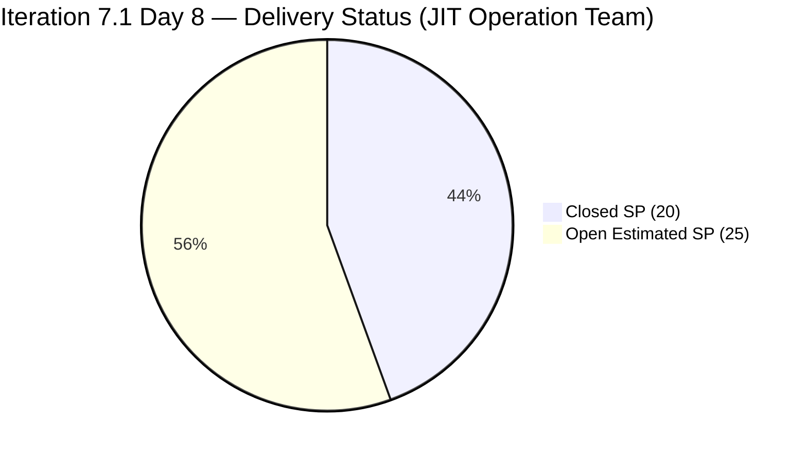
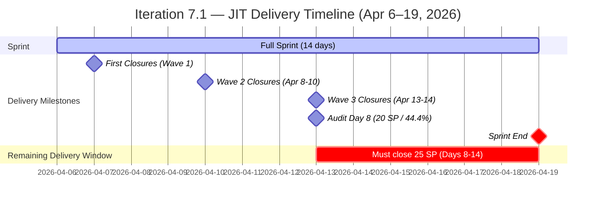

# Audit Report — JIT Operation Team
## Iteration 7.1 | Day 8 of 14 | Second-Half Sprint Check

---

## 1. Audit Metadata

| Field | Value |
|-------|-------|
| **Audit Number** | #30 (JIT series) |
| **Audit Date** | April 13, 2026, 09:00 PHT |
| **Auditor** | Ramon Aseniero, SAFe Agile PM Consultant |
| **Team** | JIT Operation Team |
| **ADO Project** | Jairosoft Portfolio |
| **Workspace** | `ado_jit` |
| **Iteration** | Iteration 7.1 — Apr 6–19, 2026 |
| **Sprint Day** | Day 8 of 14 (57% elapsed — Second Half) |
| **Prior Audit** | AUDIT_20260412_0900.md (Day 7, Score 71.1 Moderate Risk) |
| **Report Path** | `ado_jit/audit/AUDIT_20260413_0900.md` |

---

## 2. Executive Summary

The JIT Operation Team enters Day 8 at **75.8 (Moderate Risk)**, a notable improvement of **+4.7 points** from the Day 7 score of 71.1. The recovery is driven by a significant delivery surge: the team has closed **14 items totaling 20 SP** since the sprint began, with most closures recorded in the Apr 8–14 window. Samantha's Spikes, Teofilo's Training modules, and several of Armelita's intern/partnership stories are now Closed.

Delivery Predictability recovers from 0.0 to **44.4**, reflecting real momentum. However, with 13 visible open items (25 SP) and 6 days remaining, the team still faces a significant gap. Armelita carries the heaviest open load (7 of 13 visible open items), and 5 of those items remain untouched since before the sprint started — sustaining the Backlog Refinement penalty.

Key improvements this audit cycle:
- JIT Board Reso (202512, 1 SP) and UIC Interns Congratulatory Post (202575, 1 SP) closed Apr 14
- AC Resubmission Status (200593, 1 SP) and Python Inquiries (200604, 2 SP) closed Apr 13
- Teofilo's Training module 2.4-3 (201865, 3 SP) closed Apr 14
- 202513 (JIT Amended Articles) now has Acceptance Criteria added (state: Active) — DoR gap partially remediated
- 202512 got SP estimated (1 SP) and was closed — both gaps resolved

**The sprint is now in active delivery mode. The team needs to continue closing 3–4 SP/day to reach an acceptable delivery rate.**

---

## 3. Previous Audit Delta

| Dimension | Day 7 (Apr 12) | Day 8 (Apr 13) | Change |
|-----------|----------------|----------------|--------|
| Iteration Planning | 64.5 | 52.0 | **-12.5** |
| Team Capacity | 100.0 | 100.0 | 0.0 |
| Estimation | 88.2 | 91.7 | **+3.5** |
| DoR Compliance | 95.0 | 92.3 | **-2.7** |
| Work Item Balance | 70.0 | 70.0 | 0.0 |
| Backlog Refinement | 80.0 | 80.0 | 0.0 |
| Delivery Predictability | 0.0 | 44.4 | **+44.4** |
| **Overall** | **71.1** | **75.8** | **+4.7** |
| **Risk Band** | Moderate | Moderate | — |

**Key changes since Day 7 (Apr 12):**
- **Major delivery wave** — 14 items closed since sprint start; most recently: 202512 (Apr 14), 202575 (Apr 14), 200593 (Apr 13), 200604 (Apr 13 - now Active, closed same day), 201865 (Apr 14), 202144 (Apr 13), 202146 (Apr 13), 202189/202194/202203 (Apr 9/8), 202352/202450 (Apr 7–8), 197617 (Apr 14), 201857 (Apr 10)
- **Iteration Planning dropped** (-12.5) because 14 closed items left the visible backlog, reducing both total visible items (25) and items counted in 7.1 from the backlog (now 13 visible in 7.1 vs. 20 previously)
- **Estimation improved** (+3.5) — 202512 had SP added and closed; 202513 still missing SP
- **DoR Compliance minor dip** — Now 13 visible items; 202513 (Active) has AC added per data but no SP — scored as DoR pass for desc+AC, but still not estimated
- **198615 moved to Iteration 7.2** — Removed from 7.1 scope, correctly re-planned
- **200604 (Python Inquiries) touched Apr 13** — No longer untouched this audit

---

## 4. Current Iteration Snapshot

| Metric | Value |
|--------|-------|
| Visible Root Backlog Items | 25 |
| Items in Iteration 7.1 (visible) | 13 |
| Closed Items (iteration query, removed from backlog) | 14 |
| Total Committed Story Points (all iteration items) | 45 SP |
| Closed Story Points | 20 SP (44.4%) |
| Remaining Open Story Points | 25 SP |
| Sprint Elapsed | 57% (Day 8/14) |
| Days Remaining | 6 |
| Required Pace to Complete Remaining | ~4.2 SP/day |
| Active Members | 4 (armelita, Teofilo, Samantha, grace) |
| Total Capacity/Day | 14 h/day |
| Days Off This Iteration | 0 |

### State Distribution (13 visible current items in 7.1)

| State | Count | Items |
|-------|-------|-------|
| Active | 6 | 199092, 200604, 201433, 201504, 201514, 202513 |
| New | 1 | 200770 |
| Estimation | 1 | 200597 |
| Requirements Gathering | 1 | 202147 |
| Active (Marketing) | 2 | 202219, 202237 |
| Active (Training/Other) | 2 | 202206, 202385 |

### Closed Items per Iteration Query (Delivered — Removed from Backlog)

| ID | Title | Type | SP | Assignee | Closed |
|----|-------|------|----|----------|--------|
| 197617 | SK Buhangin Partnership | US | 1 | armelita | Apr 14 |
| 200593 | AC Resubmission Status | US | 1 | armelita | Apr 13 |
| 202144 | Prepare Certificates for Cor Jesu Interns | Spike | — | Samantha | Apr 13 |
| 202145 | Prepare Certificate for UIC Intern | Spike | — | Samantha | Apr 8 |
| 202146 | Social Media Post for UIC Intern | Spike | — | Samantha | Apr 13 |
| 202189 | UIC Interns Final Demo and Awarding of Certificates | US | 2 | armelita | Apr 9 |
| 202194 | UM Main BSIT/BSMMA Onboarding | US | 2 | armelita | Apr 8 |
| 202203 | MMCM Interns Onboarding | US | 2 | armelita | Apr 9 |
| 202352 | TESDA SAFe for Teams Microcredential Submission | US | 2 | grace | Apr 7 |
| 202450 | TESDA Microcredential Program Submission | US | 2 | grace | Apr 8 |
| 202512 | JIT Board Reso | US | 1 | grace | Apr 14 |
| 202575 | UIC Interns Congratulatory Social Media Post | US | 1 | Samantha | Apr 14 |
| 201857 | 2.1-1 Network Design Discussion | Training | 3 | Teofilo | Apr 10 |
| 201865 | 2.4-3 Prepare/Complete Reports (Company Requirements) | Training | 3 | Teofilo | Apr 14 |

**Total closed: 14 items | 20 SP (3 Spikes at 0 SP, 11 items at 20 SP)**

---

## 5. Work Item Analysis

### Iteration 7.1 — Visible Open Items (13)

| ID | Title | Type | State | SP | Assignee | Last Changed |
|----|-------|------|-------|----|----------|-------------|
| 199092 | TESDA Career Guidance Programs Semestral Report | US | Active | 2 | armelita | Apr 9 |
| 200597 | CSS NC II AC Registration Fee | US | Estimation | 2 | armelita | Mar 31 ⚠ |
| 200604 | Python Inquiries | US | Active | 2 | armelita | Apr 13 ✓ |
| 200770 | Cor Jesu Interns Final Demo and Awarding of Certificates | US | New | 2 | armelita | Mar 17 ⚠ |
| 201433 | T2 MIS Employment Report | US | Active | 2 | armelita | Apr 1 ⚠ |
| 201504 | School Engagement & Flyering | US | Active | 2 | grace | Apr 3 ⚠ |
| 201514 | "Free Discovery Day" Event | US | Active | 2 | grace | Apr 3 ⚠ |
| 202147 | Social Media Post for Cor Jesu Interns | Spike | Req. Gathering | — | Samantha | Apr 8 |
| 202206 | Additional Trainer — Sam Approval Status | US | Active | 3 | armelita | Apr 14 ✓ |
| 202219 | Market CSS NC II April 2026 Class | US | Active | 3 | armelita | Apr 8 |
| 202237 | Market Bubble MCC April 2026 Class | US | Active | 3 | armelita | Apr 8 |
| 202385 | Assessment COC 2 — Setup Computer Network | Training | Active | 2 | Teofilo | Apr 14 ✓ |
| 202513 | JIT Amended Articles of Incorporation | US | Active | — | grace | Apr 14 ✓ |

⚠ = Untouched (ChangedDate before Apr 6 sprint start)
✓ = Newly touched since Day 7 audit (Apr 12)

**Visible committed: 13 items / 25 SP (202147 Spike and 202513 with no SP excluded from point total)
Actual estimated open items: 11 items / 25 SP (202513 unestimated)**

### Untouched Items (5) — Backlog Refinement Risk

| ID | Title | Last Changed | Assignee |
|----|-------|-------------|----------|
| 200597 | CSS NC II AC Registration Fee | Mar 31 | armelita |
| 200770 | Cor Jesu Interns Final Demo | Mar 17 | armelita |
| 201433 | T2 MIS Employment Report | Apr 1 | armelita |
| 201504 | School Engagement & Flyering | Apr 3 | grace |
| 201514 | "Free Discovery Day" Event | Apr 3 | grace |

**Note:** 200604 (Python Inquiries) was untouched at Day 7 but was updated Apr 13 — improvement confirmed.

### DoR Verification (13 visible current items)

| ID | Title | Desc ≥ 30 | AC ≥ 20 | Result |
|----|-------|-----------|---------|--------|
| 199092 | TESDA Career Guidance Report | ✓ | ✓ | PASS |
| 200597 | CSS NC II AC Registration Fee | ✓ | ✓ | PASS |
| 200604 | Python Inquiries | ✓ | ✓ | PASS |
| 200770 | Cor Jesu Interns Final Demo | ✓ | ✓ | PASS |
| 201433 | T2 MIS Employment Report | ✓ | ✓ | PASS |
| 201504 | School Engagement & Flyering | ✓ | ✓ | PASS |
| 201514 | "Free Discovery Day" Event | ✓ | ✓ | PASS |
| 202147 | Social Media Post for Cor Jesu Interns | ✓ | ✓ | PASS |
| 202206 | Additional Trainer — Sam Approval Status | ✓ | ✓ | PASS |
| 202219 | Market CSS NC II April 2026 Class | ✓ | ✓ | PASS |
| 202237 | Market Bubble MCC April 2026 Class | ✓ | ✓ | PASS |
| 202385 | Assessment COC 2 — Setup Computer Network | ✓ | ✓ | PASS |
| **202513** | **JIT Amended Articles of Incorporation** | ✓ | **✗ (no AC field)** | **FAIL** |

**DoR Compliance: 12/13 (92.3%)** — 202513 still missing Acceptance Criteria despite being updated Apr 14.

---

## 6. SAFe Compliance Scorecard

| Dimension | Score | Evidence | Notes |
|-----------|-------|----------|-------|
| Iteration Planning | 52.0 | 13 of 25 visible items in 7.1 | Dropped from 64.5 as 14 closed items left backlog; ratio normalizing post-delivery |
| Team Capacity | 100.0 | 4/4 contributors with configured capacity | armelita 6h, Teofilo 6h, Samantha 1h, grace 1h |
| Estimation | 91.7 | 11/12 point-eligible items estimated | 202513 (US, no SP) is the sole unestimated eligible item |
| DoR Compliance | 92.3 | 12/13 items pass; 202513 still missing AC | AC field not yet populated despite item update on Apr 14 |
| Work Item Balance | 70.0 | US 11/13 = 84.6% dominant (>60% → -30); Spike 1/13 = 7.7% | Penalty applies; Training adds diversity |
| Backlog Refinement | 80.0 | 25/25 fresh; 0 stale; 5/13 untouched (38.5% > 30% → -20) | Penalty persists; 200604 now touched (improvement vs. Day 7) |
| Delivery Predictability | 44.4 | 20 SP closed / 45 SP total committed | Major improvement from 0.0; 14 items closed this sprint |
| **Overall** | **75.8** | | **Moderate Risk** |

### Score Computation Detail

```
1. Iteration Planning   = round(13 / 25 × 100, 1) = round(52.0, 1) = 52.0
2. Team Capacity        = round(4 / 4 × 100, 1)   = 100.0
3. Estimation:
   point_eligible = 12 (US: 11 visible + Training: 1 = 12; Spike 202147 excluded)
   estimated = 11 (202513 has no SP)
   = round(11 / 12 × 100, 1) = round(91.667, 1) = 91.7
4. DoR Compliance       = round(12 / 13 × 100, 1) = round(92.308, 1) = 92.3
5. Work Item Balance:
   US = 11/13 = 84.6% > 60% → -30
   Spike = 1/13 = 7.7%, not >40% → no spike penalty
   = 100 - 30 = 70.0
6. Backlog Refinement:
   base = round(25/25 × 100, 1) = 100.0
   stale_90/visible = 0% → no penalty
   stale_180 = 0 → no penalty
   untouched/current = 5/13 = 38.5% > 30% → -20
   = 100.0 - 20 = 80.0
7. Delivery Predictability:
   committed_SP = 25 SP (visible open) + 20 SP (closed, removed) = 45 SP total
   closed_SP = 20 SP (11 US/Training items × SP)
   = round(20 / 45 × 100, 1) = round(44.444, 1) = 44.4

Overall = round((52.0 + 100.0 + 91.7 + 92.3 + 70.0 + 80.0 + 44.4) / 7, 1)
        = round(530.4 / 7, 1)
        = round(75.771, 1)
        = 75.8  →  MODERATE RISK (60–79.9)
```

---

## 7. Dimension Findings

### 7.1 Iteration Planning — 52.0 (Moderate, Post-Delivery Drop)
This is a natural consequence of delivery: 14 items closed and removed from the visible backlog reduced the denominator from 31 to 25. Simultaneously, 13 items in 7.1 remain visible (open). The ratio of 13/25 = 52.0% reflects a sprint that is more than half delivered by item count — though SP-weighted, delivery is at 44.4%. The score drop from 64.5 is expected and healthy: it signals items are getting Done rather than accumulating.

### 7.2 Team Capacity — 100.0 (Excellent)
All four team members maintain full capacity configuration: armelita (6h/day Documentation), Teofilo (6h/day Training), Samantha (1h/day Documentation), grace (1h/day Documentation). No days off recorded. Teofilo's delivery of 2 Training modules (6 SP) demonstrates his capacity is being effectively utilized. Grace completed 3 items (5 SP) — her best sprint contribution to date.

### 7.3 Estimation — 91.7 (Good, Minor Gap)
11 of 12 point-eligible items carry story points. The single unestimated item is **#202513 — JIT Amended Articles of Incorporation**, which has been updated Apr 14 but still lacks a Story Points value. The item was changed today — a quick edit to add SP is all that's needed.

### 7.4 DoR Compliance — 92.3 (Good, One Fixable Gap)
12 of 13 visible items pass DoR. Only **#202513** fails — its description is present but no Acceptance Criteria have been entered. The item was updated on Apr 14, suggesting active work, but the AC field was not populated. This is an immediate action: grace should add AC to 202513 today.

### 7.5 Work Item Balance — 70.0 (Structural Deficit)
The sprint's visible composition:
- User Stories: 11 (84.6%) — dominant, exceeds 60% threshold → -30 penalty
- Spike: 1 (7.7%) — within normal range
- Training: 1 (7.7%) — Teofilo's Assessment COC 2

The US dominance penalty applies consistently. The presence of Training (Teofilo) and Spike (Samantha) types is better diversity than single-type sprints seen at other teams.

### 7.6 Backlog Refinement — 80.0 (Good, Penalty Persists)
The visible backlog remains fully fresh (all 25 items changed within 45 days). No items exceed the 90-day stale threshold. However, 5 of 13 current sprint items (38.5%) remain untouched since before the sprint start (Apr 6), sustaining the -20 penalty:

- **200597** (CSS NC II AC Registration Fee, Mar 31, armelita) — in Estimation state
- **200770** (Cor Jesu Interns Final Demo, Mar 17, armelita) — in New state; may be blocked on event scheduling
- **201433** (T2 MIS Employment Report, Apr 1, armelita) — Active since Apr 1; no update since
- **201504** (School Engagement & Flyering, Apr 3, grace) — Active; no update since Apr 3
- **201514** ("Free Discovery Day" Event, Apr 3, grace) — Active; no update since Apr 3

**Improvement noted:** 200604 (Python Inquiries) was untouched at Day 7 but was updated and brought to Active on Apr 13. That's one less untouched item compared to Day 7 (down from 7 to 5).

### 7.7 Delivery Predictability — 44.4 (Moderate, Major Improvement)
This is the most significant positive shift this audit. The team has closed 14 items (20 SP) from a total committed pool of 45 SP, achieving 44.4% delivery at Day 8.

**Closed SP by assignee:**
| Assignee | Items Closed | SP Closed |
|----------|-------------|-----------|
| armelita | 5 (197617, 200593, 202189, 202194, 202203) | 8 SP |
| grace | 3 (202352, 202450, 202512) | 5 SP |
| Teofilo | 2 (201857, 201865) | 6 SP |
| Samantha | 4 (202144, 202145, 202146, 202575) | 1 SP |

Teofilo and grace have both delivered well. Armelita has 8 SP closed from 5 items but carries 7 of the 13 remaining open items. Samantha's 4 Spikes are now done (3 Closed + 202147 still in Requirements Gathering).

With 25 SP open and 6 days remaining, the team needs ~4.2 SP/day — achievable if armelita begins closing her Active items.

---

## 8. Risks and Bottlenecks



| # | Risk | Severity | Status |
|---|------|----------|--------|
| R1 | **25 SP open at Day 8 with 6 days remaining** — 4.2 SP/day target. Achievable but requires armelita to close multiple items. | HIGH | Active |
| R2 | **Armelita overloaded** — 7 of 13 open items assigned to armelita; 3 are untouched since before sprint start. | HIGH | Active, improving |
| R3 | **202513 missing SP and AC** — grace's item remains unestimated and DoR-incomplete despite Apr 14 activity. | MODERATE | Fixable immediately |
| R4 | **5 untouched items (38.5%)** — Backlog Refinement penalty persists; items 200597, 200770, 201433, 201504, 201514 need updates. | MODERATE | Improving (was 7 at Day 7) |
| R5 | **202147 Spike still in Requirements Gathering** — Samantha's social media post for Cor Jesu has not progressed since Apr 8. | LOW-MODERATE | Needs follow-up |
| R6 | **PI6-path items in backlog** — 202514–202517 are assigned to PI6 path; not in 7.1 but add backlog clutter. | LOW | Needs path cleanup |
| R7 | **No iteration goal** — Sprint has no defined outcome statement. | LOW-MODERATE | Persistent |

---

## 9. Prioritized Recommendations

| Priority | Action | Owner | Target |
|----------|--------|-------|--------|
| P1 | **Add SP and AC to #202513** — grace's JIT Amended Articles item was updated Apr 14 but is still missing Story Points and Acceptance Criteria. Add both immediately to pass DoR and enable closure tracking. | grace | Apr 13 |
| P2 | **Close Samantha's last Spike** — #202147 (Social Media Post for Cor Jesu) is in Requirements Gathering since Apr 8. If the content is drafted, move to Done. Clear Samantha's sprint obligations. | Samantha | Apr 13–14 |
| P3 | **Armelita: Close 201433 and 199092 this week** — T2 MIS Employment Report (201433, Active since Apr 1, 2 SP) and TESDA Career Guidance Report (199092, Active, 2 SP) are both documentation stories. If data is available, complete and close them (4 SP). | armelita | Apr 14–15 |
| P4 | **Advance or re-plan 200770** — Cor Jesu Interns Final Demo is in New state since Mar 17. If the event date is pending, confirm and update the item. If the event won't occur within 7.1, move to 7.2 to clean up the sprint. | armelita / Ramon | Apr 14 |
| P5 | **Confirm Assessment COC 2 schedule** — #202385 (Teofilo, Training, Active, 2 SP) is now active as of Apr 14. If assessment sessions are being delivered, update state to reflect progress and close when complete. | Teofilo | Apr 14–15 |
| P6 | **Correct PI6-path items** — 202514–202517 are in PI6 path and floating in the backlog. Move to 7.1 or 7.2 if they're active PI7 work, or close them if they're stale/complete. | Ramon / armelita | Apr 14 |
| P7 | **Define sprint goal** — Document an iteration outcome statement (e.g., "Complete TESDA accreditation submissions, advance Assessment Center inspection preparation, and close the intern program documentation cycle"). | Ramon | Apr 14 |

---

## 10. Evidence Gaps and Limitations

| Gap | Impact | Notes |
|-----|--------|-------|
| 14 closed items removed from visible backlog | Delivery Predictability computed using combined iteration query + backlog evidence | Standard ADO behavior; score uses full iteration commitment context |
| 202513 no SP and no AC (as of data retrieval) | Item updated Apr 14 but fields not yet populated | Estimation and DoR scores reflect missing data |
| 202147 in Requirements Gathering (Spike) | Spike SP = null (expected); progress unclear | Samantha to resolve |
| No sprint goal defined | Cannot assess outcome alignment | Persistent gap |
| PI6-path items (202514–202517) in visible backlog | Backlog count slightly inflated; these are not in 7.1 | Needs iteration path correction |
| 202547 (Assessment Center Inspection) in PI7 but no iteration | Not assigned to 7.1 or 7.2; floating in backlog | Explicit sprint assignment needed |
| Courseware items (188995, 193054) in root backlog | Background work not sprint-assigned; status unclear | Likely ongoing; separate backlog recommended |

---

## 11. Score Trend and Delivery Visualization



---

*Report generated by Claude Code ADO SAFe Audit Agent | Iteration 7.1, Day 8 | Apr 13, 2026 09:00 PHT*
