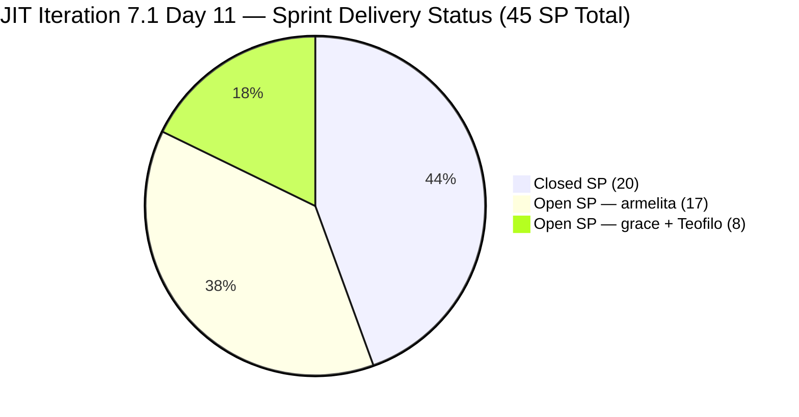
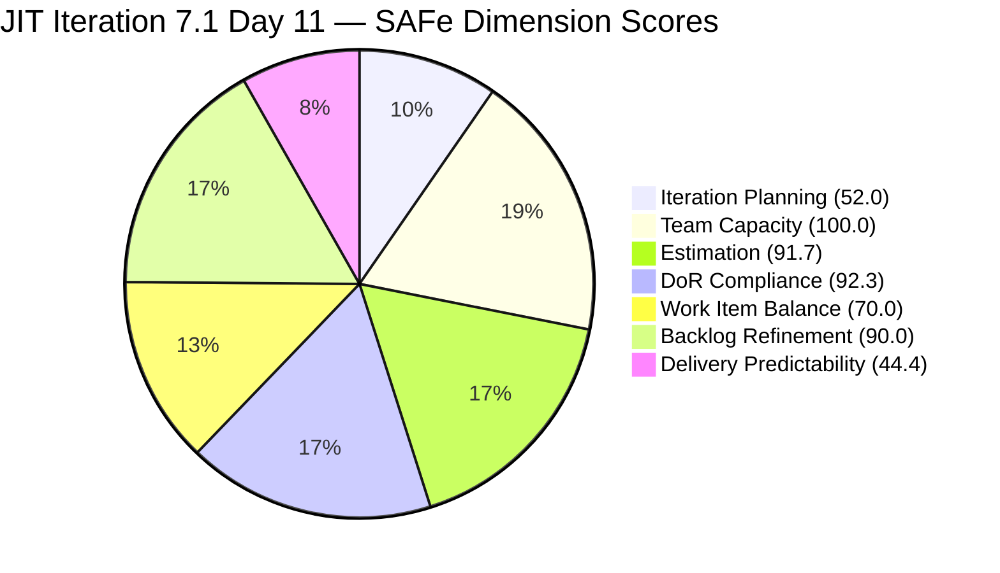
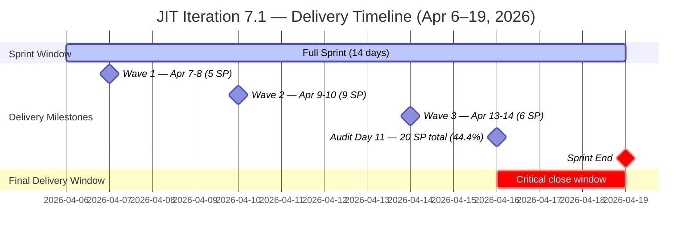

# Audit Report — JIT Operation Team
## Iteration 7.1 | Day 11 of 14 | Final Stretch

---

## 1. Audit Metadata

| Field | Value |
|-------|-------|
| **Audit Number** | #31 (JIT series) |
| **Audit Date** | April 16, 2026, 09:00 PHT |
| **Auditor** | Ramon Aseniero, SAFe Agile PM Consultant |
| **Team** | JIT Operation Team |
| **ADO Project** | Jairosoft Portfolio |
| **Workspace** | `ado_jit` |
| **Iteration** | Iteration 7.1 — Apr 6–19, 2026 |
| **Sprint Day** | Day 11 of 14 (79% elapsed — Final Stretch) |
| **Prior Audit** | AUDIT_20260413_0900.md (Day 8, Score 75.8 Moderate Risk) |
| **Report Path** | `ado_jit/audit/AUDIT_20260416_0900.md` |

---

## 2. Executive Summary

The JIT Operation Team enters Day 11 at **77.2 (Moderate Risk)**, an improvement of **+1.4 points** from the Day 8 score of 75.8. The key driver of improvement is a meaningful reduction in untouched sprint items: two previously stale items were updated since Day 8 — **#200597** (TESDA TVET Forum Registration Fee, updated Apr 14 by armelita) and **#200770** (Cor Jesu Interns Final Demo, updated Apr 16 today by armelita, moved from New to Active). This drops the untouched current items from 5 of 13 (38.5%) to 3 of 13 (23.1%), shifting the Backlog Refinement penalty from -20 to -10 and raising that score from 80.0 to **90.0**.

Delivery is unchanged since Day 8: **14 items / 20 SP closed** from a total commitment of 45 SP (44.4% delivery). No new closures have been recorded since April 14. With 25 SP still open across 13 visible items and approximately 3 working days remaining (Apr 16, 17, 19), the team faces the same delivery challenge: armelita carries 8 of 13 remaining open items (17 SP) and must accelerate closures in the final window.

Item **#202513 (JIT Amended Articles of Incorporation)** remains unestimated and DoR-incomplete — the two fixable gaps carried forward from Day 8 remain unresolved despite activity on the item on Apr 14.

**The sprint enters its final window with improving backlog hygiene and solid structural scores. Delivery must resume immediately. Grace should fix #202513 today (2-minute action). Armelita must close 4–5 items across Days 11–14 to reach an acceptable final delivery rate.**

---

## 3. Previous Audit Delta

| Dimension | Day 8 (Apr 13) | Day 11 (Apr 16) | Change |
|-----------|----------------|-----------------|--------|
| Iteration Planning | 52.0 | 52.0 | 0.0 |
| Team Capacity | 100.0 | 100.0 | 0.0 |
| Estimation | 91.7 | 91.7 | 0.0 |
| DoR Compliance | 92.3 | 92.3 | 0.0 |
| Work Item Balance | 70.0 | 70.0 | 0.0 |
| Backlog Refinement | 80.0 | 90.0 | **+10.0** |
| Delivery Predictability | 44.4 | 44.4 | 0.0 |
| **Overall** | **75.8** | **77.2** | **+1.4** |
| **Risk Band** | Moderate | Moderate | — |

**Key changes since Day 8 (Apr 13):**
- **#200597 updated Apr 14** — TESDA TVET Forum 2026 Registration Fee (armelita) was updated on Apr 14; no longer untouched since sprint start.
- **#200770 updated Apr 16** — Cor Jesu Interns Final Demo (armelita) updated today; moved from New to Active. No longer untouched.
- **Backlog Refinement +10.0** — Untouched current items dropped from 5/13 (38.5%, -20 penalty) to 3/13 (23.1%, -10 penalty). Score rises from 80.0 to 90.0.
- **#202147 progressed to Validation** — Samantha's Social Media Post for Cor Jesu Interns moved to Validation state on Apr 15; near completion.
- **No new closures** — Delivery Predictability unchanged at 44.4. Last closure was Apr 14 (Wave 3).
- **#202513 still unestimated and missing AC** — grace's JIT Amended Articles item carries both gaps forward from Day 8.

---

## 4. Current Iteration Snapshot

| Metric | Value |
|--------|-------|
| Visible Root Backlog Items | 25 |
| Items in Iteration 7.1 (visible in backlog) | 13 |
| Closed Items (removed from backlog) | 14 |
| Total Committed Story Points | 45 SP |
| Closed Story Points | 20 SP (44.4%) |
| Remaining Open Story Points | 25 SP |
| Sprint Elapsed | 79% (Day 11/14) |
| Working Days Remaining | ~3 (Apr 16, 17, 19) |
| Required Pace to Complete Remaining | ~4.2 SP/day |
| Active Members | 4 (armelita, Teofilo, Samantha, grace) |
| Total Capacity/Day | 14 h/day |
| Days Off This Iteration | 0 |

### State Distribution — 13 Visible Current Items

| State | Count | Items |
|-------|-------|-------|
| Active | 11 | 199092, 200597, 200604, 200770, 201433, 201504, 201514, 202206, 202219, 202237, 202385 |
| Validation | 1 | 202147 (Spike — near closure) |
| Active (unestimated) | 1 | 202513 |

### Closed Items — Full Sprint Summary (14 items / 20 SP)

| ID | Title | Type | SP | Assignee | Closed |
|----|-------|------|----|----------|--------|
| 197617 | SK Buhangin Partnership | US | 1 | armelita | Apr 14 |
| 200593 | AC Resubmission Status | US | 1 | armelita | Apr 13 |
| 202144 | Prepare Certificates for Cor Jesu Interns | Spike | — | Samantha | Apr 13 |
| 202145 | Prepare Certificate for UIC Intern | Spike | — | Samantha | Apr 8 |
| 202146 | Social Media Post for UIC Intern | Spike | — | Samantha | Apr 13 |
| 202189 | UIC Interns Final Demo and Awarding of Certificates | US | 2 | armelita | Apr 9 |
| 202194 | UM Main BSIT/BSMMA Onboarding | US | 2 | armelita | Apr 8 |
| 202203 | MMCM Interns Onboarding | US | 2 | armelita | Apr 9 |
| 202352 | TESDA SAFe for Teams Microcredential Submission | US | 2 | grace | Apr 7 |
| 202450 | TESDA Microcredential Program Submission | US | 2 | grace | Apr 8 |
| 202512 | JIT Board Reso | US | 1 | grace | Apr 14 |
| 202575 | UIC Interns Congratulatory Social Media Post | US | 1 | Samantha | Apr 14 |
| 201857 | 2.1-1 Network Design Discussion | Training | 3 | Teofilo | Apr 10 |
| 201865 | 2.4-3 Prepare/Complete Reports (Company Requirements) | Training | 3 | Teofilo | Apr 14 |

**Total closed: 14 items | 20 SP (3 Spikes at 0 SP, 11 items at 20 SP)**

---

## 5. Work Item Analysis

### Iteration 7.1 — Visible Open Items (13)

| ID | Title | Type | State | SP | Assignee | Last Changed | Untouched? |
|----|-------|------|-------|----|----------|-------------|------------|
| 199092 | TESDA Career Guidance Programs Semestral Report | US | Active | 2 | armelita | Apr 9 | No |
| 200597 | TESDA TVET Forum 2026 Registration Fee | US | Active | 2 | armelita | Apr 14 | Resolved ✓ |
| 200604 | Python Inquiries | US | Active | 2 | armelita | Apr 13 | No |
| 200770 | Cor Jesu Interns Final Demo and Awarding of Certificates | US | Active | 2 | armelita | Apr 16 | Resolved ✓ |
| 201433 | T2 MIS Employment Report | US | Active | 2 | armelita | Apr 1 | **YES ⚠** |
| 201504 | School Engagement & Flyering | US | Active | 2 | grace | Apr 3 | **YES ⚠** |
| 201514 | "Free Discovery Day" Event | US | Active | 2 | grace | Apr 3 | **YES ⚠** |
| 202147 | Social Media Post for Cor Jesu Interns | Spike | Validation | — | Samantha | Apr 15 | No |
| 202206 | Additional Trainer — Sam Approval Status | US | Active | 3 | armelita | Apr 14 | No |
| 202219 | Market CSS NC II April 2026 Class | US | Active | 3 | armelita | Apr 8 | No |
| 202237 | Market Bubble MCC April 2026 Class | US | Active | 3 | armelita | Apr 8 | No |
| 202385 | Assessment COC 2 — Setup Computer Network | Training | Active | 2 | Teofilo | Apr 14 | No |
| 202513 | JIT Amended Articles of Incorporation | US | Active | — | grace | Apr 14 | No |

✓ = Updated since Day 8 audit (untouched status resolved)
⚠ = Still untouched since before sprint start (Apr 6)

**Open load by assignee: armelita = 8 items / 17 SP | grace = 3 items / 4 SP + 202513 (unestimated) | Teofilo = 1 item / 2 SP | Samantha = 1 Spike / 0 SP**

### Untouched Items — 3 Remaining (Down from 5 at Day 8)

| ID | Title | Last Changed | Assignee | Days Since Last Update |
|----|-------|-------------|----------|------------------------|
| 201433 | T2 MIS Employment Report | Apr 1 | armelita | 15 days |
| 201504 | School Engagement & Flyering | Apr 3 | grace | 13 days |
| 201514 | "Free Discovery Day" Event | Apr 3 | grace | 13 days |

**Improvement noted:** #200597 (updated Apr 14) and #200770 (updated Apr 16) are no longer untouched — 2 items resolved since Day 8.

### DoR Verification — 13 Visible Current Items

| ID | Title | Desc ≥ 30 | AC ≥ 20 | Result |
|----|-------|-----------|---------|--------|
| 199092 | TESDA Career Guidance Programs Semestral Report | ✓ | ✓ | PASS |
| 200597 | TESDA TVET Forum 2026 Registration Fee | ✓ | ✓ | PASS |
| 200604 | Python Inquiries | ✓ | ✓ | PASS |
| 200770 | Cor Jesu Interns Final Demo and Awarding | ✓ | ✓ | PASS |
| 201433 | T2 MIS Employment Report | ✓ | ✓ | PASS |
| 201504 | School Engagement & Flyering | ✓ | ✓ | PASS |
| 201514 | "Free Discovery Day" Event | ✓ | ✓ | PASS |
| 202147 | Social Media Post for Cor Jesu Interns (Spike) | ✓ | ✓ | PASS |
| 202206 | Additional Trainer — Sam Approval Status | ✓ | ✓ | PASS |
| 202219 | Market CSS NC II April 2026 Class | ✓ | ✓ | PASS |
| 202237 | Market Bubble MCC April 2026 Class | ✓ | ✓ | PASS |
| 202385 | Assessment COC 2 — Setup Computer Network | ✓ | ✓ | PASS |
| **202513** | **JIT Amended Articles of Incorporation** | ✓ | **FAIL (no AC field)** | **FAIL** |

**DoR Compliance: 12/13 (92.3%)** — #202513 is the sole gap; fixable immediately.

---

## 6. SAFe Compliance Scorecard

| Dimension | Score | Evidence | Notes |
|-----------|-------|----------|-------|
| Iteration Planning | 52.0 | 13 of 25 visible items in 7.1 | Stable; natural post-delivery ratio after 14 closures |
| Team Capacity | 100.0 | 4/4 contributors with configured capacity | armelita 6h, Teofilo 6h, Samantha 1h, grace 1h |
| Estimation | 91.7 | 11/12 point-eligible items estimated | #202513 (US, no SP) is sole gap; trivial fix |
| DoR Compliance | 92.3 | 12/13 items pass Desc+AC thresholds | #202513 missing AC; fixable in 2 minutes by grace |
| Work Item Balance | 70.0 | US 11/13 = 84.6% dominant (>60% → -30); Spike 1; Training 1 | Better type diversity than single-type sprints |
| Backlog Refinement | 90.0 | 25/25 fresh; 0 stale; 3/13 untouched (23.1% → -10) | +10.0 from Day 8; two items no longer untouched |
| Delivery Predictability | 44.4 | 20 SP closed / 45 SP committed | No new closures since Apr 14; delivery stalled for 2 days |
| **Overall** | **77.2** | | **Moderate Risk** |

### Score Computation Detail

```
1. Iteration Planning   = round(13 / 25 × 100, 1) = 52.0

2. Team Capacity        = round(4 / 4 × 100, 1)   = 100.0

3. Estimation:
   point_eligible = 12 (11 US visible + 1 Training; Spike 202147 excluded)
   estimated      = 11 (202513 has no SP value)
   = round(11 / 12 × 100, 1) = round(91.667, 1) = 91.7

4. DoR Compliance       = round(12 / 13 × 100, 1) = round(92.308, 1) = 92.3

5. Work Item Balance:
   US share    = 11/13 = 84.6% > 60% → -30
   Spike share =  1/13 =  7.7%, not >40% → no spike penalty
   = 100 - 30 = 70.0

6. Backlog Refinement:
   base                    = round(25/25 × 100, 1) = 100.0
   stale_90 / visible      = 0% → no penalty
   stale_180               = 0  → no penalty
   untouched / current     = 3/13 = 23.1%
                             > 10% but ≤ 30% → -10 (improved from -20 at Day 8)
   = 100.0 - 10 = 90.0

7. Delivery Predictability:
   committed_SP = 25 SP (open visible) + 20 SP (closed/removed) = 45 SP
   closed_SP    = 20 SP
   = round(20 / 45 × 100, 1) = round(44.444, 1) = 44.4

Overall = round((52.0 + 100.0 + 91.7 + 92.3 + 70.0 + 90.0 + 44.4) / 7, 1)
        = round(540.4 / 7, 1)
        = round(77.200, 1)
        = 77.2  →  MODERATE RISK (60–79.9)
```

---

## 7. Dimension Findings

### 7.1 Iteration Planning — 52.0 (Moderate, Stable Post-Delivery)
The ratio of 13/25 (52.0%) is unchanged from Day 8. No new items were added to or removed from the 7.1 visible backlog since Apr 13. The score reflects the healthy post-delivery state: 14 items have been closed and removed from the visible backlog, leaving 25 visible items of which 13 remain in the current sprint. Item 198615 (Awarding of CSS NC II Certificates) was moved to 7.2 and remains in the visible backlog as a correctly forward-planned item. The score drop from the sprint-start level is a natural and expected consequence of delivery, not a planning deficiency.

### 7.2 Team Capacity — 100.0 (Excellent)
All four team members maintain full configured capacity: armelita (6h/day Documentation), Teofilo (6h/day Training), Samantha (1h/day Documentation), grace (1h/day Documentation). No days off are recorded for any member across the sprint. Capacity infrastructure remains optimal. Teofilo has fully utilized his capacity by closing 2 Training modules (6 SP) earlier in the sprint. Grace closed 3 items (5 SP) — her best sprint contribution to date. Samantha has cleared 4 of her 5 sprint items (3 Spikes closed + 1 US closed).

### 7.3 Estimation — 91.7 (Good, One Trivially Fixable Gap)
11 of 12 point-eligible items carry story points. The sole gap remains **#202513 — JIT Amended Articles of Incorporation** (grace), which was updated on Apr 14 but still has no Story Points value. Adding an SP estimate to 202513 is a one-field edit that immediately raises Estimation to 100.0. If fixed today, the Overall score improves by approximately 0.7 points.

### 7.4 DoR Compliance — 92.3 (Good, One Trivially Fixable Gap)
12 of 13 visible items pass DoR. The sole failure is **#202513**, which carries a description meeting the 30 non-whitespace character threshold but has no Acceptance Criteria field populated. Despite the item being updated on Apr 14, the AC field was not completed. Grace must add Acceptance Criteria to 202513 today — this is a 2-minute action. If fixed, DoR compliance reaches 100.0. Combined with the SP fix above, both the Estimation and DoR gaps resolve simultaneously, improving Overall by ~1.4 points.

### 7.5 Work Item Balance — 70.0 (Structural Deficit, Consistent)
Sprint visible composition:
- User Stories: 11 of 13 (84.6%) — dominant, exceeds 60% threshold → -30 penalty
- Spike: 1 of 13 (7.7%, Samantha — 202147) — within normal range, no additional penalty
- Training: 1 of 13 (7.7%, Teofilo — 202385) — adds type diversity

The User Story dominance penalty applies consistently and is a structural characteristic of this team's work mix. The presence of both Training (Teofilo) and Spike (Samantha) types continues to provide better balance than single-type sprints seen in other teams. The -30 cap is the practical penalty ceiling given the current work portfolio.

### 7.6 Backlog Refinement — 90.0 (Good, Improved +10.0 from Day 8)
This is the most significant positive change in the Day 11 audit. Two items transitioned out of "untouched" status since Day 8:

- **#200597 (TESDA TVET Forum 2026 Registration Fee, armelita)**: Updated Apr 14. Previously untouched since before sprint start. Now Active with a recent update.
- **#200770 (Cor Jesu Interns Final Demo and Awarding of Certificates, armelita)**: Updated Apr 16 (today). Moved from New to Active, indicating the event date has been confirmed or preparations have begun.

All 25 visible backlog items remain fresh (changed within 45 days of Apr 16, i.e., after Mar 2). Zero items exceed the 90-day or 180-day stale thresholds.

**Three remaining untouched items (23.1% of 13 current sprint items):**
- 201433 (T2 MIS Employment Report, armelita, last changed Apr 1) — 15 days without update
- 201504 (School Engagement & Flyering, grace, last changed Apr 3) — 13 days without update
- 201514 ("Free Discovery Day" Event, grace, last changed Apr 3) — 13 days without update

If all three are updated today, the untouched ratio drops to 0% → 0 penalty, and Backlog Refinement reaches 100.0, pushing the Overall score to approximately 78.6.

### 7.7 Delivery Predictability — 44.4 (Moderate, Stalled Since Apr 14)
The sprint has delivered 20 SP from 45 committed (44.4%). Three delivery waves occurred in Days 1–9 (Apr 7–14):
- Wave 1 (Apr 7–8): 5 SP — grace closes TESDA submissions
- Wave 2 (Apr 9–10): 9 SP — armelita closes intern onboarding + demos; Teofilo closes Network Design module
- Wave 3 (Apr 13–14): 6 SP — armelita closes AC Resubmission + SK Partnership; Teofilo closes Reports module; Samantha closes Cor Jesu certificates and UIC congratulatory post; grace closes JIT Board Reso

Since Apr 14 — 2 days — no new items have been closed. With 3 working days remaining and 25 SP open, the team needs ~4.2 SP/day to fully deliver. This is achievable in aggregate across the team, but depends on armelita resuming closures.

**Open load by assignee:**

| Assignee | Open Items | Open SP | Note |
|----------|------------|---------|------|
| armelita | 8 | 17 SP | Must close 4+ items to move the needle |
| grace | 3 | 4 SP + 202513 (no SP) | 201504 and 201514 are the most stale |
| Teofilo | 1 | 2 SP | 202385 active since Apr 14; near completion |
| Samantha | 1 Spike | 0 SP | 202147 in Validation; should close today |

If the team closes 10 SP in the final 3 days (a conservative estimate), Delivery Predictability would reach round((20+10)/45×100,1) = 66.7, pushing the Overall score to approximately 80.9 — crossing into Low Risk for the first time this sprint.

---

## 8. Risks and Bottlenecks



| # | Risk | Severity | Status |
|---|------|----------|--------|
| R1 | **Delivery stalled since Apr 14** — No closures in 2 days with 3 working days remaining. 25 SP still open. Requires immediate resumption. | HIGH | Active — urgent |
| R2 | **Armelita overloaded** — 8 of 13 open items (17 SP) assigned to armelita; 3 of her items (201433, 202219, 202237) have been Active for 8–15 days without closure. | HIGH | Active, improving |
| R3 | **#202513 unestimated and missing AC** — grace's JIT Amended Articles item was active Apr 14 but neither SP nor AC were added. Both gaps persist across 3 audits. | MODERATE | Fixable in 2 minutes — escalating |
| R4 | **3 untouched sprint items remain** — 201433 (15 days), 201504 (13 days), 201514 (13 days) have no updates since before sprint start. May be blocked, event-dependent, or deprioritized. | MODERATE | Improving (was 5 at Day 8) |
| R5 | **#202147 Spike in Validation** — Samantha's Social Media Post for Cor Jesu Interns in Validation since Apr 15; awaiting final approval. Near completion but not yet closed. | LOW | Near done |
| R6 | **PI6-path items (202514–202517) in visible backlog** — 4 legacy items inflate backlog count without contributing to sprint delivery. | LOW | Background cleanup needed |
| R7 | **No iteration goal** — Sprint has operated without a defined outcome statement. Impacts retrospective quality and PI-level reporting. | LOW-MODERATE | Persistent, unfixed |

---

## 9. Prioritized Recommendations

| Priority | Action | Owner | Target |
|----------|--------|-------|--------|
| P1 | **grace: Fix #202513 immediately — add SP and AC** — Open the JIT Amended Articles of Incorporation item and (1) add a Story Points estimate (suggest 2 SP) and (2) populate the Acceptance Criteria field (e.g., "Amended Articles of Incorporation include the phrase 'establish TESDA training and assessment center' and are approved by the board"). This 2-minute action fixes both the Estimation gap (91.7 → 100.0) and DoR gap (92.3 → 100.0), improving the Overall score by approximately 1.4 points. | grace | Apr 16 |
| P2 | **Samantha: Close #202147 today** — Social Media Post for Cor Jesu Interns has been in Validation since Apr 15. If the content has been reviewed and approved by the trainer, move to Done/Closed immediately. This clears Samantha's only remaining sprint obligation. | Samantha | Apr 16 |
| P3 | **Teofilo: Close #202385 (Assessment COC 2 — Setup Computer Network)** — This Training item has been Active since Apr 14 with a recent update. If the COC 2 assessment sessions have been conducted, all trainee results documented, and COC paperwork submitted, close this item (2 SP). | Teofilo | Apr 16–17 |
| P4 | **Armelita: Close 199092, 200604, 200770 this week** — TESDA Career Guidance Programs Semestral Report (199092, 2 SP, Active Apr 9), Python Inquiries (200604, 2 SP, Active Apr 13), and Cor Jesu Interns Final Demo (200770, 2 SP, Active Apr 16 today) are all recently touched documentation/coordination stories. If the underlying activities are complete, close all three this week (6 SP combined — raises delivery from 44.4% to 57.8%). | armelita | Apr 16–17 |
| P5 | **Update or re-plan 201433, 201504, 201514** — These three items have been Active with no updates for 13–15 days. Armelita and grace must either (a) update each item with current status and a clear path to closure, or (b) explicitly re-assign to 7.2 if the events/activities (MIS report, Discovery Day, school flyering) cannot conclude by Apr 19. Leaving them untouched wastes sprint scope and degrades the final audit signal. | armelita / grace | Apr 16 |
| P6 | **Armelita: Advance 202206, 202219, 202237** — The three 3-SP marketing items (Additional Trainer Approval, Market CSS NC II, Market Bubble MCC) together represent 9 SP. If any campaign has been executed or any approval has been received, close the corresponding item. Even closing one of these adds 3 SP and meaningfully improves the delivery rate. | armelita | Apr 17–19 |
| P7 | **Define sprint goal for 7.1 close and 7.2 planning** — Document a one-sentence iteration outcome for the 7.1 retrospective: e.g., "Complete TESDA accreditation submissions and intern program documentation cycle, close Assessment Center inspection preparation, and initiate April class marketing campaigns." Use this as the foundation for the 7.2 sprint goal before sprint start on Apr 20. | Ramon | Apr 16 |

---

## 10. Evidence Gaps and Limitations

| Gap | Impact | Notes |
|-----|--------|-------|
| 14 closed items removed from visible backlog | Delivery Predictability computed using combined iteration query + backlog evidence | Standard ADO behavior; score accurately reflects full iteration commitment |
| #202513 no SP and no AC (as of Apr 16 data retrieval) | Estimation (91.7) and DoR (92.3) remain sub-optimal | Both fixable with a 2-minute edit by grace; gap has persisted across 3 audits |
| #202147 in Validation (Spike) | SP = null expected for Spike type; progress near completion | Samantha to close once content approved by trainer |
| No sprint goal defined in ADO | Cannot assess outcome alignment or measure iteration success against a stated objective | Persistent gap across all JIT audits in PI7 |
| PI6-path items (202514–202517) in visible backlog | Backlog count slightly inflated by 4 legacy items not assigned to 7.1 | Should be closed if complete or migrated to current PI path |
| 202547 (Assessment Center Inspection) in PI7 but no iteration assignment | Floating in backlog without sprint context | Needs explicit assignment to 7.1 or 7.2 |
| Courseware items (188995, 193054) in root backlog | Not sprint-assigned; ongoing background work with unclear status | Separate backlog or parking lot structure recommended |
| No intra-sprint burn-down data available via API | Cannot confirm daily velocity trend or identify specific stall dates | State-transition-based evidence only |

---

## 11. Score Trend and Delivery Visualization





### Backlog Refinement Improvement Trend (Iteration 7.1)

| Audit Day | Untouched Items | % of Current Sprint Items | Penalty Applied | Score |
|-----------|-----------------|--------------------------|-----------------|-------|
| Day 7 (Apr 12) | 7 | 35.0% | -20 | 80.0 |
| Day 8 (Apr 13) | 5 | 38.5% | -20 | 80.0 |
| **Day 11 (Apr 16)** | **3** | **23.1%** | **-10** | **90.0** |
| Target (if 3 resolved) | 0 | 0% | 0 | 100.0 |

### Score Trajectory (JIT PI7 Series)

| Date | Score | Band | Sprint Day |
|------|-------|------|------------|
| Apr 6 (7.1 D1) | ~68.0 | Moderate | Day 1 |
| Apr 7 (7.1 D2) | 68.5 | Moderate | Day 2 |
| Apr 12 (7.1 D7) | 71.1 | Moderate | Day 7 |
| Apr 13 (7.1 D8) | 75.8 | Moderate | Day 8 |
| **Apr 16 (7.1 D11)** | **77.2** | **Moderate** | **Day 11** |

---

*Report generated by Claude Code ADO SAFe Audit Agent | Iteration 7.1, Day 11 | Apr 16, 2026 09:00 PHT*
