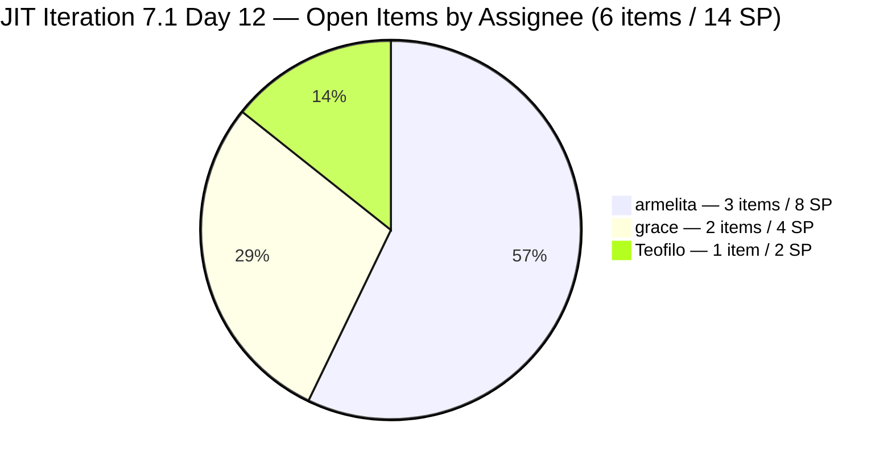
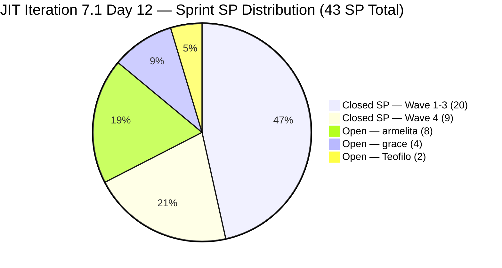
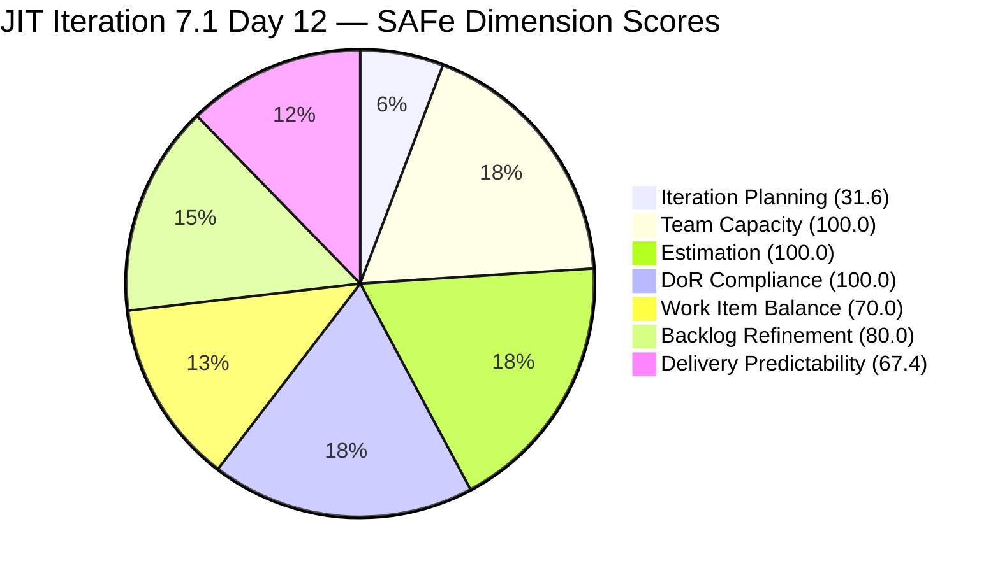
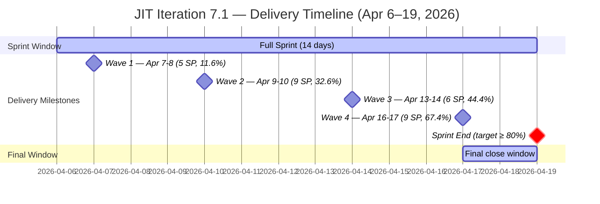

# Audit Report — JIT Operation Team
## Iteration 7.1 | Day 12 of 14 | Final Stretch

---

## 1. Audit Metadata

| Field | Value |
|-------|-------|
| **Audit Number** | #32 (JIT series) |
| **Audit Date** | April 17, 2026, 09:00 PHT |
| **Auditor** | Ramon Aseniero, SAFe Agile PM Consultant |
| **Team** | JIT Operation Team |
| **ADO Project** | Jairosoft Portfolio |
| **Workspace** | `ado_jit` |
| **Iteration** | Iteration 7.1 — Apr 6–19, 2026 |
| **Sprint Day** | Day 12 of 14 (86% elapsed — Final Stretch) |
| **Prior Audit** | AUDIT_20260416_0900.md (Day 11, Score 77.2 Moderate Risk) |
| **Report Path** | `ado_jit/audit/AUDIT_20260417_0900.md` |

---

## 2. Executive Summary

The JIT Operation Team records a **score of 78.4 (Moderate Risk)** on Day 12 — an improvement of **+1.2 points** from the Day 11 score of 77.2. The team had a significant delivery wave between Apr 16 and Apr 17: **6 items were closed and removed from the visible backlog**, including 4 SP-bearing stories (9 SP total) and 2 zero-SP items (Spike 202147 and unestimated 202513). One previously committed item (#199092 — TESDA Career Guidance Semestral Report) was **moved from 7.1 to 7.2**, reducing the total committed SP baseline.

Total sprint delivery now stands at **29 SP closed from 43 committed (67.4%)** — crossing the 60% threshold and entering **Moderate Delivery** territory for the first time this sprint. The team has 6 items remaining in the visible 7.1 backlog, totaling 14 open SP, with only 2 working days left (Apr 17 and Apr 19).

However, **Iteration Planning took a significant hit**: with only 6 items now in 7.1 against a visible backlog of 19, the ratio drops to **31.6** — a new PI7 low for JIT. The items removed from the 7.1 visible set reduce the numerator much faster than the denominator, collapsing the planning ratio as the sprint winds down.

**Backlog Refinement remains at 80.0** due to two persistent untouched items assigned to grace (#201504 and #201514, both last changed Apr 3), keeping the -20 penalty active.

**The sprint is finishing strong on delivery. The final two days should target closing armelita's 3 marketing stories (8 SP) and Teofilo's Assessment COC 2 item (2 SP). Grace should update or explicitly re-plan items 201504 and 201514 to break the Backlog Refinement penalty.**

---

## 3. Previous Audit Delta

| Dimension | Day 11 (Apr 16) | Day 12 (Apr 17) | Change |
|-----------|-----------------|-----------------|--------|
| Iteration Planning | 52.0 | 31.6 | **-20.4** |
| Team Capacity | 100.0 | 100.0 | 0.0 |
| Estimation | 91.7 | 100.0 | **+8.3** |
| DoR Compliance | 92.3 | 100.0 | **+7.7** |
| Work Item Balance | 70.0 | 70.0 | 0.0 |
| Backlog Refinement | 90.0 | 80.0 | **-10.0** |
| Delivery Predictability | 44.4 | 67.4 | **+23.0** |
| **Overall** | **77.2** | **78.4** | **+1.2** |
| **Risk Band** | Moderate | Moderate | — |

**Key changes since Day 11 (Apr 16):**

- **Wave 4 delivery — 6 items closed** between Apr 16 and Apr 17:
  - #200597 — TESDA TVET Forum 2026 Registration Fee (armelita, 2 SP) — CLOSED
  - #200770 — Cor Jesu Interns Final Demo and Awarding of Certificates (armelita, 2 SP) — CLOSED
  - #201433 — T2 MIS Employment Report (armelita, 2 SP) — CLOSED
  - #202206 — Additional Trainer — Sam Approval Status (armelita, 3 SP) — CLOSED
  - #202147 — Social Media Post for Cor Jesu Interns (Samantha, Spike, 0 SP) — CLOSED
  - #202513 — JIT Amended Articles of Incorporation (grace, 0 SP unestimated) — CLOSED

- **#199092 moved to 7.2** — TESDA Career Guidance Programs Semestral Report (armelita, 2 SP) de-committed from 7.1; correctly forward-planned to 7.2. This reduces committed SP baseline from 45 to 43.

- **Delivery Predictability +23.0** — 29 SP closed / 43 committed = 67.4%, up from 20/45 = 44.4%.

- **Estimation +8.3** — #202513 (previously unestimated) is now closed and out of scope. All 6 remaining visible 7.1 items carry SP > 0. Jumps to 100.0.

- **DoR Compliance +7.7** — #202513 (previously AC-deficient) is closed. All 6 remaining 7.1 items pass Desc + AC checks. Jumps to 100.0.

- **Iteration Planning -20.4** — 7.1 visible count drops from 13 to 6 (numerator); total visible drops from 25 to 19 (denominator). Ratio collapses: 6/19 = 31.6 vs 13/25 = 52.0.

- **Backlog Refinement -10.0** — Drops from 90.0 to 80.0. With only 6 current sprint items, untouched_current_items (201504, 201514 last changed Apr 3) now represent 2/6 = 33.3%, crossing the 30% threshold and applying the -20 penalty (vs -10 penalty at 23.1% in Day 11).

---

## 4. Current Iteration Snapshot

| Metric | Value |
|--------|-------|
| Visible Root Backlog Items | 19 |
| Items in Iteration 7.1 (visible in backlog) | 6 |
| Closed Items (removed from backlog) | 20 total (14 from Days 1–11 + 6 from Wave 4) |
| De-committed Items (moved to future sprint) | 1 (#199092 moved to 7.2) |
| Total Committed Story Points (adjusted) | 43 SP |
| Closed Story Points | 29 SP (67.4%) |
| Remaining Open Story Points | 14 SP |
| Sprint Elapsed | 86% (Day 12/14) |
| Working Days Remaining | 2 (Apr 17 and Apr 19) |
| Required Pace to Fully Deliver | ~7 SP/day |
| Active Members | 3 with open work (armelita, grace, Teofilo) |
| Total Capacity/Day | 14 h/day (armelita 6h, Teofilo 6h, grace 1h, Samantha 1h) |
| Days Off This Iteration | 0 |

### State Distribution — 6 Visible Current Items (7.1)

| State | Count | Items |
|-------|-------|-------|
| Active | 6 | 200604, 201504, 201514, 202219, 202237, 202385 |



### Cumulative Sprint Delivery Summary

| Wave | Date Range | Items | SP | Cumulative SP | Cumulative % |
|------|-----------|-------|-----|---------------|-------------|
| Wave 1 | Apr 7–8 | 5 | 5 | 5 | 11.6% |
| Wave 2 | Apr 9–10 | 5 | 9 | 14 | 32.6% |
| Wave 3 | Apr 13–14 | 4 | 6 | 20 | 44.4% (of 45 committed) |
| **Wave 4** | **Apr 16–17** | **6** | **9** | **29** | **67.4% (of 43 adjusted)** |
| **Remaining** | **Apr 17–19** | — | **14 SP open** | — | **Target: ≥ 80%** |

---

## 5. Work Item Analysis

### Iteration 7.1 — Visible Open Items (6)

| ID | Title | Type | State | SP | Assignee | Last Changed | Untouched? |
|----|-------|------|-------|----|----------|-------------|------------|
| 200604 | Python Inquiries | US | Active | 2 | armelita | Apr 13 | No |
| 201504 | School Engagement & Flyering | US | Active | 2 | grace | Apr 3 | **YES ⚠** |
| 201514 | "Free Discovery Day" Event | US | Active | 2 | grace | Apr 3 | **YES ⚠** |
| 202219 | Market CSS NC II April 2026 Class | US | Active | 3 | armelita | Apr 8 | No |
| 202237 | Market Bubble MCC April 2026 Class | US | Active | 3 | armelita | Apr 8 | No |
| 202385 | Assessment COC 2 — Setup Computer Network | Training | Active | 2 | Teofilo | Apr 14 | No |

**⚠ = Untouched since before sprint start (Apr 6)**

### Wave 4 Closures — Between Day 11 and Day 12 (6 items)

| ID | Title | Type | SP | Assignee | Closed |
|----|-------|------|----|----------|--------|
| 200597 | TESDA TVET Forum 2026 Registration Fee | US | 2 | armelita | Apr 16–17 |
| 200770 | Cor Jesu Interns Final Demo and Awarding | US | 2 | armelita | Apr 16–17 |
| 201433 | T2 MIS Employment Report | US | 2 | armelita | Apr 16–17 |
| 202206 | Additional Trainer — Sam Approval Status | US | 3 | armelita | Apr 16–17 |
| 202147 | Social Media Post for Cor Jesu Interns | Spike | 0 | Samantha | Apr 16–17 |
| 202513 | JIT Amended Articles of Incorporation | US | 0 (unestimated) | grace | Apr 16–17 |

**armelita delivered 9 SP across 4 US closures in Wave 4. Samantha cleared her final sprint obligation. Grace closed the persistent gap item. Wave 4 was the most productive single-day batch of the sprint.**

### De-committed Item

| ID | Title | Type | SP | Old Iteration | New Iteration | Assignee |
|----|-------|------|----|--------------|--------------|----------|
| 199092 | TESDA Career Guidance Programs Semestral Report | US | 2 | 7.1 | 7.2 | armelita |

**Reason for de-commitment:** Item requires form acquisition and official filing — likely dependent on external TESDA calendar. Correctly moved to 7.2.

### Full Sprint Closure Record (20 items / 29 SP)

| ID | Title | Type | SP | Assignee | Wave |
|----|-------|------|----|----------|------|
| 202352 | TESDA SAFe for Teams Microcredential Submission | US | 2 | grace | 1 |
| 202450 | TESDA Microcredential Program Submission | US | 2 | grace | 1 |
| 202145 | Prepare Certificate for UIC Intern | Spike | 0 | Samantha | 1 |
| 202194 | UM Main BSIT/BSMMA Onboarding | US | 2 | armelita | 2 |
| 202203 | MMCM Interns Onboarding | US | 2 | armelita | 2 |
| 202189 | UIC Interns Final Demo and Awarding | US | 2 | armelita | 2 |
| 201857 | 2.1-1 Network Design Discussion | Training | 3 | Teofilo | 2 |
| 202144 | Prepare Certificates for Cor Jesu Interns | Spike | 0 | Samantha | 2 |
| 200593 | AC Resubmission Status | US | 1 | armelita | 3 |
| 197617 | SK Buhangin Partnership | US | 1 | armelita | 3 |
| 201865 | 2.4-3 Prepare/Complete Reports | Training | 3 | Teofilo | 3 |
| 202146 | Social Media Post for UIC Intern | Spike | 0 | Samantha | 3 |
| 202512 | JIT Board Reso | US | 1 | grace | 3 |
| 202575 | UIC Interns Congratulatory Social Media Post | US | 1 | Samantha | 3 |
| **200597** | **TESDA TVET Forum 2026 Registration Fee** | **US** | **2** | **armelita** | **4** |
| **200770** | **Cor Jesu Interns Final Demo and Awarding** | **US** | **2** | **armelita** | **4** |
| **201433** | **T2 MIS Employment Report** | **US** | **2** | **armelita** | **4** |
| **202206** | **Additional Trainer — Sam Approval Status** | **US** | **3** | **armelita** | **4** |
| **202147** | **Social Media Post for Cor Jesu Interns** | **Spike** | **0** | **Samantha** | **4** |
| **202513** | **JIT Amended Articles of Incorporation** | **US** | **0** | **grace** | **4** |

**Total: 20 items | 29 SP (67.4% of 43 adjusted committed)**

### DoR Verification — All 6 Visible 7.1 Items

| ID | Title | Desc ≥ 30 non-ws | AC ≥ 20 non-ws | Result |
|----|-------|-----------------|----------------|--------|
| 200604 | Python Inquiries | ✓ | ✓ | PASS |
| 201504 | School Engagement & Flyering | ✓ | ✓ | PASS |
| 201514 | "Free Discovery Day" Event | ✓ | ✓ | PASS |
| 202219 | Market CSS NC II April 2026 Class | ✓ | ✓ | PASS |
| 202237 | Market Bubble MCC April 2026 Class | ✓ | ✓ | PASS |
| 202385 | Assessment COC 2 — Setup Computer Network | ✓ | ✓ | PASS |

**DoR Compliance: 100% (6/6)** — 202513 (previously failing) is now closed; all remaining items are fully documented.

---

## 6. SAFe Compliance Scorecard

| Dimension | Score | Evidence | Notes |
|-----------|-------|----------|-------|
| Iteration Planning | 31.6 | 6 of 19 visible items in 7.1 | Wave 4 closures reduce 7.1 visible set; normal sprint-end effect but pronounced |
| Team Capacity | 100.0 | 3/3 contributors with work have configured capacity | armelita 6h, Teofilo 6h, grace 1h; Samantha cleared all items |
| Estimation | 100.0 | 6/6 point-eligible items estimated | 202513 (unestimated) now closed; all remaining items have SP |
| DoR Compliance | 100.0 | 6/6 items pass Desc + AC thresholds | 202513 (AC-deficient) now closed; backlog is clean |
| Work Item Balance | 70.0 | 5/6 US (83.3%) + 1 Training; US dominant >60% → -30 | Structural characteristic; no Spike items remain in 7.1 |
| Backlog Refinement | 80.0 | 19/19 fresh; 0 stale_90/180; 2/6 untouched (33.3% → -20) | grace's 201504 and 201514 still pre-sprint-start; -20 penalty worsened |
| Delivery Predictability | 67.4 | 29 SP closed / 43 SP committed | Wave 4 = 9 SP; crossed 60% delivery threshold |
| **Overall** | **78.4** | | **Moderate Risk** |

### Score Computation Detail

```
1. Iteration Planning
   visible_root_backlog_items           = 19
   current_iteration_root_items (7.1)   = 6
   Score = round(6 / 19 × 100, 1)      = round(31.579, 1) = 31.6

2. Team Capacity
   contributors_with_current_work       = 3 (armelita, grace, Teofilo)
   contributors_with_capacity           = 3 (armelita: 6h/day, Teofilo: 6h/day, grace: 1h/day)
   Score = round(3 / 3 × 100, 1)       = 100.0
   Note: Samantha has no remaining 7.1 work; excluded from denominator

3. Estimation
   point_eligible_current_items         = 6 (all 6 visible 7.1 items: 5 US + 1 Training)
   estimated_current_items              = 6 (all SP > 0)
   Score = round(6 / 6 × 100, 1)       = 100.0

4. DoR Compliance
   dor_compliant_current_items          = 6 (all pass Desc + AC)
   current_iteration_root_items         = 6
   Score = round(6 / 6 × 100, 1)       = 100.0

5. Work Item Balance
   US share    = 5/6 = 83.3% > 60% → -30
   Spike share = 0/6 = 0% → no Spike penalty
   Score = max(0, 100 - 30)            = 70.0

6. Backlog Refinement
   fresh_visible_root_items             = 19 (all changed after Mar 3, 2026 — within 45 days)
   base = round(19/19 × 100, 1)        = 100.0
   stale_90_visible                     = 0 (none older than Jan 17, 2026) → no penalty
   stale_180_visible                    = 0 (none older than Oct 20, 2025) → no penalty
   untouched_current_items:
     201504 (Apr 3) — before Apr 6 sprint start → UNTOUCHED
     201514 (Apr 3) — before Apr 6 sprint start → UNTOUCHED
     untouched = 2 of 6 = 33.3% > 30% → -20 penalty (worsened from Day 11)
   Score = max(0, 100.0 - 20)          = 80.0

7. Delivery Predictability
   committed_story_points (adjusted):
     Original committed                  = 45 SP (Days 1–11)
     Less: 199092 de-committed to 7.2    = -2 SP
     Adjusted committed                  = 43 SP
   closed_story_points:
     Prior closed (Waves 1–3)            = 20 SP
     Wave 4 closures                     = 9 SP (200597:2 + 200770:2 + 201433:2 + 202206:3)
     Note: 202147 (Spike, 0 SP) and 202513 (0 SP unestimated) contribute 0 SP
     Total closed SP                     = 29 SP
   Score = round(29 / 43 × 100, 1)     = round(67.442, 1) = 67.4
   Note: Day 12 of 14-day sprint; NOT annotated early-sprint

Overall = round((31.6 + 100.0 + 100.0 + 100.0 + 70.0 + 80.0 + 67.4) / 7, 1)
        = round(549.0 / 7, 1)
        = round(78.429, 1)
        = 78.4  →  MODERATE RISK (60–79.9)
```

---

## 7. Dimension Findings

### 7.1 Iteration Planning — 31.6 (Significant Drop, Sprint-End Artifact)

The drop from 52.0 (Day 11) to 31.6 (Day 12) is the most dramatic single-day Iteration Planning change in this PI7 JIT series. It is driven entirely by the Wave 4 delivery: 6 items closed and removed from the backlog simultaneously, collapsing the 7.1-visible numerator from 13 to 6. Meanwhile, de-committed items and forward-planned items in 7.2–7.5 maintain the denominator at 19 (down from 25).

This is a **sprint-end delivery artifact** — not a planning deficiency. As items are delivered and closed in the final days of a sprint, the planning ratio naturally compresses. The team committed to 15 of the 19 visible items in 7.1 at sprint start (before the 14 closures depleted the backlog). The 6 remaining open items represent the unfinished sprint tail.

For the final audit (Day 14), the Iteration Planning score will either improve (if remaining items close, reducing both numerator and denominator equally) or stay depressed (if items remain open in the backlog).

### 7.2 Team Capacity — 100.0 (Excellent)

All three contributors with remaining 7.1 work (armelita, Teofilo, grace) have configured capacity: armelita at 6h/day Documentation, Teofilo at 6h/day Training, grace at 1h/day Documentation. Samantha has completed all her sprint obligations (Spikes cleared in Waves 3–4) and has no remaining 7.1 items. Capacity is fully configured and no days off are recorded for any member.

### 7.3 Estimation — 100.0 (Fully Recovered)

The sole estimation gap (#202513 — JIT Amended Articles of Incorporation, grace, unestimated) has been closed and removed from the backlog. All 6 remaining visible 7.1 items carry Story Point estimates: 200604 (2 SP), 201504 (2 SP), 201514 (2 SP), 202219 (3 SP), 202237 (3 SP), 202385 (2 SP) = 14 SP total open. Estimation reaches 100% for the first time in this sprint.

### 7.4 DoR Compliance — 100.0 (Fully Recovered)

The sole DoR gap (#202513 — missing Acceptance Criteria) has been closed. All 6 remaining visible 7.1 items pass both the Description (≥30 non-whitespace characters) and Acceptance Criteria (≥20 non-whitespace characters) thresholds. The marketing stories (202219, 202237) carry the most detailed DoR content — specific enrollment targets, channel requirements, and timeline checkboxes. Compliance is at 100% for the first time in PI7 for this sprint.

### 7.5 Work Item Balance — 70.0 (Structural, Unchanged)

Visible 7.1 composition: 5 User Stories + 1 Training item = 6 items. User Story share = 83.3% > 60% threshold → -30 dominant-type penalty. No Spike items remain in 7.1 (202147 was the last Spike and is now closed). Teofilo's Assessment COC 2 item (202385, Training type) provides the only type diversity remaining. The -30 penalty cap applies; no further penalties triggered.

### 7.6 Backlog Refinement — 80.0 (Worsened -10.0 from Day 11)

This is the only structural score that worsened in today's audit. The cause is counterintuitive: **Wave 4 closures reduced the denominator (current sprint items) faster than the untouched items could be resolved**. With only 6 items in 7.1, grace's two stale items (201504 and 201514, last changed Apr 3) now represent 33.3% of the sprint — crossing the 30% threshold for the -20 penalty.

**Analysis of the two untouched items:**
- **#201504 — School Engagement & Flyering** (grace, 2 SP, Active, last changed Apr 3): Physical flyering campaign at local schools. The Apr 3 update was likely a scope/planning update before sprint start. With the sprint ending Apr 19, this activity may be on hold, blocked by school access, or event-dependent.
- **#201514 — "Free Discovery Day" Event** (grace, 2 SP, Active, last changed Apr 3): Discovery Day event requiring venue booking and registration page setup. This requires external coordination that may have stalled.

If grace updates both items today (Apr 17), the untouched count drops to 0/6 = 0% → 0 penalty → Backlog Refinement recovers to 100.0 → Overall improves from 78.4 to ~81.3 (Low Risk).

All 19 visible backlog items remain fresh (changed within 45 days). Zero items are older than 90 days. Zero items exceed 180 days.

### 7.7 Delivery Predictability — 67.4 (Moderate, Strong Wave 4)

Wave 4 was the most productive delivery wave of the sprint: armelita closed 4 stories (9 SP), Samantha closed her final Spike (0 SP), and grace closed the persistent gap item 202513 (0 SP). The delivery rate jumped from 44.4% to 67.4% in a single day.

**Sprint-end delivery scenarios:**

| Scenario | Additional SP | Total SP Closed | Delivery % | Overall Score |
|----------|-------------|----------------|------------|---------------|
| No further closures | 0 | 29 SP | 67.4% | 78.4 (Moderate) |
| Close Teofilo (#202385) | +2 | 31 SP | 72.1% | 79.0 (Moderate) |
| Close armelita's easy items (200604, 202385) | +4 | 33 SP | 76.7% | ~79.4 (Moderate) |
| Close all 6 remaining | +14 | 43 SP | 100.0% | ~84.0 (Low Risk) |
| Close grace's items (201504, 201514) too | +4 | 33 SP | 76.7% | depends on untouched penalty |

**Open load by assignee:**

| Assignee | Open Items | Open SP | Priority |
|----------|------------|---------|----------|
| armelita | 3 | 8 SP | 200604 (Python Inquiries, 2SP), 202219 (Market CSS NC II, 3SP), 202237 (Market Bubble MCC, 3SP) |
| grace | 2 | 4 SP | 201504 (School Flyering, 2SP), 201514 (Discovery Day, 2SP) — both untouched since Apr 3 |
| Teofilo | 1 | 2 SP | 202385 (COC 2 Assessment, 2SP) — updated Apr 14, likely near completion |

---

## 8. Risks and Bottlenecks



| # | Risk | Severity | Status |
|---|------|----------|--------|
| R1 | **Grace's 2 items untouched since Apr 3** — 201504 (School Flyering) and 201514 (Discovery Day) have no updates for 14 days. These likely depend on external scheduling (school access, venue). Status is opaque. | HIGH | Must update today |
| R2 | **Iteration Planning collapsed to 31.6** — Sprint-end delivery artifact; Wave 4 closures reduced 7.1 visible set from 13 to 6. Not a process deficiency, but the low score will impact portfolio-level PI7 close reporting. | MODERATE | Sprint-end artifact |
| R3 | **Backlog Refinement regressed to 80.0** — Grace's untouched items now represent 33.3% of 7.1 visible items. Fixing: grace updates both items today → score recovers to 100.0. | MODERATE | Actionable today — 2-minute fix |
| R4 | **armelita's 3 marketing stories (8 SP) still open** — 202219 (Market CSS NC II, 3SP) and 202237 (Market Bubble MCC, 3SP) have been Active since Apr 8 with no update since. Python Inquiries (200604, 2 SP) was last updated Apr 13 but not yet closed. | MODERATE | Final 2-day window |
| R5 | **No iteration goal** — Sprint operated without a defined outcome statement. Impacts PI7 retrospective and PI reporting quality. | LOW-MODERATE | Persistent, unfixed |
| R6 | **PI6-path items (202514–202517) in visible backlog** — 4 legacy PI6 items inflate the backlog denominator without contributing to 7.1 delivery. Grace's corporate documents items (Corporate Secretary Report, Director Certificate, Company Registration, SEC Portal Submission) are in PI6 path and should be closed or migrated. | LOW | Background cleanup needed |
| R7 | **202547 (Assessment Center Inspection) floating in PI7 root** — No sub-iteration assignment. Needs explicit assignment to 7.2 or closure if preparation is complete. | LOW | Backlog hygiene |

---

## 9. Prioritized Recommendations

| Priority | Action | Owner | Target |
|----------|--------|-------|--------|
| P1 | **Grace: Update #201504 and #201514 immediately** — Both School Engagement & Flyering and "Free Discovery Day" Event have been untouched for 14 days. Even a brief status comment ("venue secured / pending confirmation / moved to 7.2") removes the -20 Backlog Refinement penalty, recovering the score from 80.0 to 100.0 and improving Overall from 78.4 to ~81.3 (Low Risk threshold). If the activities cannot conclude by Apr 19, explicitly re-assign to 7.2 and update the iteration path today. | grace | Apr 17 — immediate |
| P2 | **Teofilo: Close #202385 (Assessment COC 2 — Setup Computer Network)** — This Training item was last updated Apr 14. If the COC 2 assessments have been conducted, results documented, and paperwork submitted to TESDA, close this item (2 SP). Teofilo has completed 2 Training closures this sprint (6 SP); a third adds 2 more. | Teofilo | Apr 17 |
| P3 | **Armelita: Close #200604 (Python Inquiries)** — Last updated Apr 13. If all pending Python course inquiries have been answered, leads catalogued, and the inquiry backlog cleared, close this 2 SP item today. | armelita | Apr 17 |
| P4 | **Armelita: Advance #202219 and #202237 (Marketing campaigns)** — These 3 SP items (Market CSS NC II and Market Bubble MCC) have been Active since Apr 8. If the campaign collaterals are designed and approved, digital channels are live, and the enrollment lead target is on track, close these items. Together they represent 6 SP — a meaningful final delivery push. | armelita | Apr 17–19 |
| P5 | **Define 7.1 retrospective outcome and 7.2 sprint goal** — Document a 7.1 iteration goal retroactively: e.g., "Complete TESDA accreditation submissions and intern program documentation, close CSS NC II COC assessments, and advance April class marketing campaigns." Use this as the foundation for 7.2 planning against the 2 committed items (198615, 199092) plus any new scope. Conduct 7.2 sprint planning before Apr 20. | Ramon / armelita | Apr 17–19 |
| P6 | **Clean up PI6-path items in backlog** — #202514 (JIT Corporate Secretary Report), #202515 (JIT Director Certificate), #202516 (Company Registration), #202517 (SEC Portal Submission) are in the PI6 path. If the SEC documentation for the amended articles is complete (linked to #202513 which just closed), these items should also be closed or moved to PI7 path for tracking. Grace should confirm their status. | grace | Apr 17–19 |
| P7 | **Assign #202547 (Assessment Center Inspection) to 7.2** — This item is floating in the PI7 root with no sub-iteration. If the TESDA inspection has not yet occurred, assign to 7.2 to keep it visible in the next sprint's planning board. If it has already been completed (e.g., as part of COC assessment prep), close it. | armelita | Apr 17 |

---

## 10. Evidence Gaps and Limitations

| Gap | Impact | Notes |
|-----|--------|-------|
| Wave 4 closure dates (Apr 16 or Apr 17) not precisely determined | Cannot confirm whether closures occurred yesterday evening (Apr 16) or this morning (Apr 17) | Closure attribution placed at "Wave 4 Apr 16–17" to reflect the window; exact timestamps not critical for scoring |
| 20 closed items removed from visible backlog | Delivery Predictability computed from 29 SP closed / 43 SP committed (adjusted for 199092 de-commitment) | Standard ADO behavior; audit methodology accounts for full iteration commitment |
| #199092 de-commitment SP adjustment | Committed SP baseline reduced from 45 to 43; this slightly inflates the delivery % (67.4 vs 64.4 on original baseline) | Correct to adjust: item was moved out of iteration scope by team; not a closure |
| PI6-path items (202514–202517) in visible backlog | Inflate denominator of Iteration Planning calculation (19 instead of 15 if excluded) | Per rubric, all root backlog items count regardless of iteration path; no adjustment made |
| Courseware items (188995, 193054) in visible backlog | Add to denominator; no sprint assignment | These are genuine root backlog items; counted per rubric |
| No sprint goal defined | Cannot assess alignment to PI objectives or sprint outcome | Persistent across all JIT audits in PI7 |
| Grace's untouched items (201504, 201514) — work status opaque | Cannot determine if activities are blocked, event-dependent, or simply not updated | Scoring applies mechanically: untouched = stale signal regardless of actual work status |

---

## 11. Score Trend and Delivery Visualization





### Score Trajectory — JIT PI7 Iteration 7.1 Series

| Audit | Date | Score | Band | Sprint Day | Key Event |
|-------|------|-------|------|------------|-----------|
| #26 | Apr 6 | ~68.0 | Moderate | Day 1 | Sprint start |
| #27 | Apr 7 | 68.5 | Moderate | Day 2 | Wave 1 begins |
| #28 | Apr 12 | 71.1 | Moderate | Day 7 | — |
| #29 | Apr 13 | 75.8 | Moderate | Day 8 | Wave 3 begins |
| #31 | Apr 16 | 77.2 | Moderate | Day 11 | — |
| **#32** | **Apr 17** | **78.4** | **Moderate** | **Day 12** | **Wave 4 — 6 closures** |

### Delivery vs. Capacity Ratio — Final Sprint Window

| Metric | Wave 4 (Apr 16–17) | Remaining (Apr 17–19) |
|--------|-------------------|----------------------|
| Items | 6 closed | 6 open |
| SP | 9 SP delivered | 14 SP remaining |
| Primary contributor | armelita (9 SP alone) | armelita (8 SP), Teofilo (2 SP), grace (4 SP) |
| Required close rate | — | ~7 SP/day across team |

---

*Report generated by Claude Code ADO SAFe Audit Agent | Iteration 7.1, Day 12 | Apr 17, 2026 09:00 PHT*
