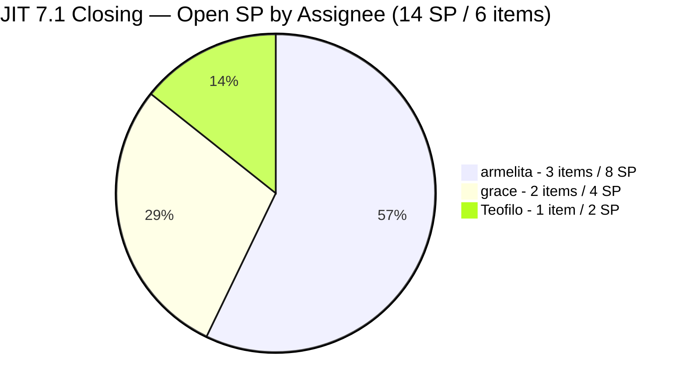
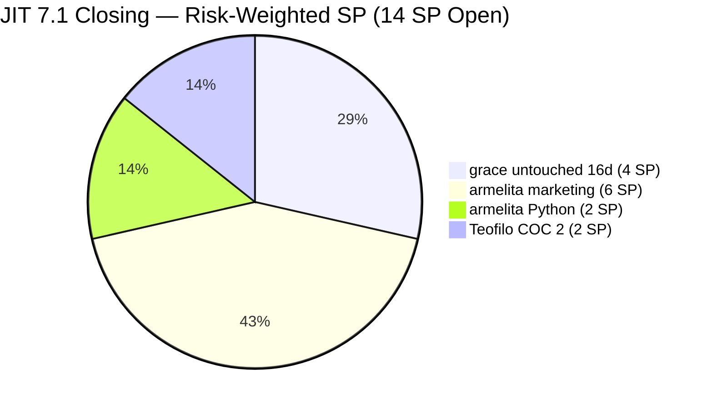
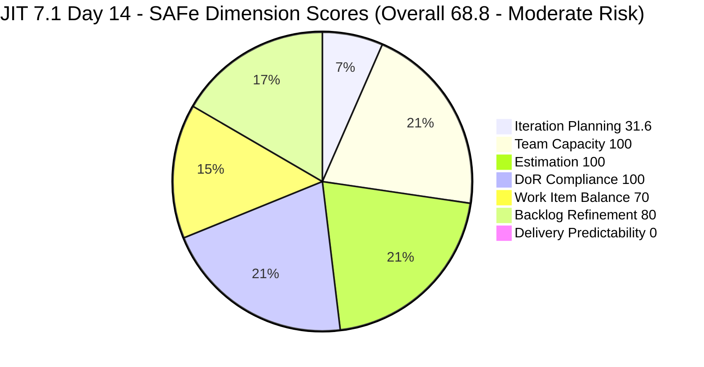

# Audit Report — JIT Operation Team
## Iteration 7.1 | Day 14 of 14 | Sprint Close

---

## 1. Audit Metadata

| Field | Value |
|-------|-------|
| **Audit Number** | #33 (JIT PI7 series) |
| **Audit Date** | April 19, 2026, 13:45 PDT (Sunday) |
| **Auditor** | Claude Code ADO SAFe Audit Agent (Team 2 retry) |
| **Team** | JIT Operation Team |
| **ADO Project** | Jairosoft Portfolio |
| **Workspace** | `ado_jit` |
| **Iteration** | Iteration 7.1 — Apr 6 to Apr 19, 2026 |
| **Iteration ID** | `6079f2b6-2f7c-4b10-adfd-93071eb965f7` |
| **Sprint Day** | Day 14 of 14 (100% elapsed — final day / closing) |
| **Prior Audit** | `AUDIT_20260417_0900.md` (Day 12, Overall 78.4 — Moderate Risk) |
| **Report Path** | `ado_jit/audit/AUDIT_20260419_1345.md` |
| **Scoring Model** | ADO SAFe v1 (7-dimension rubric) |
| **Overall Score** | **68.8 / 100** |
| **Risk Band** | **Moderate Risk** (60–79.9) |

---

## 2. Executive Summary

JIT closes Iteration 7.1 today (Sunday, Apr 19) with a visible-state score of **68.8 (Moderate Risk)** — a **-9.6 point drop** from the Day 12 reading of 78.4. The decline is mechanical, not behavioural: **no additional closures have been recorded in ADO since Wave 4 (Apr 16–17)**. The 6 items visible in 7.1 at Day 12 are still the same 6 items today, all in `Active` state with identical `ChangedDate` timestamps. Because the visible backlog still shows **0 SP closed out of 14 SP visibly committed**, Delivery Predictability collapses to **0.0**.

The overall iteration narrative remains strong — 20 items / 29 SP were closed and removed from the board across Waves 1–4 between Apr 7 and Apr 17 (captured in prior audits). However, the rubric’s scoring formula is computed strictly from the current board state, not cumulative closure history. Today’s board shows **6 Active items with 14 open SP** at the close of a 14-day sprint.

Process quality remains exemplary: **Team Capacity, Estimation, and DoR Compliance all at 100.0**. Work Item Balance holds at 70.0 (structural User-Story dominance). Backlog Refinement is **80.0** — grace’s two marketing items (#201504, #201514) remain untouched since Apr 3, now representing **33.3%** of the 6-item 7.1 set and triggering the -20 untouched penalty for the third consecutive audit.

**Recommended close-out actions (today, Apr 19):** (1) Grace must update or formally re-plan #201504 and #201514 before sprint closes — even a status comment removes the -20 refinement penalty. (2) Any work genuinely completed on #200604, #202219, #202237, or #202385 should be closed in ADO today before the 7.1 retrospective. (3) Items that cannot close today should be explicitly moved to 7.2 via IterationPath update so they do not orphan in a closed sprint.

---

## 3. Previous Audit Delta

| Dimension | Day 12 (Apr 17) | Day 14 (Apr 19) | Change |
|-----------|-----------------|-----------------|--------|
| Iteration Planning | 31.6 | 31.6 | 0.0 |
| Team Capacity | 100.0 | 100.0 | 0.0 |
| Estimation | 100.0 | 100.0 | 0.0 |
| DoR Compliance | 100.0 | 100.0 | 0.0 |
| Work Item Balance | 70.0 | 70.0 | 0.0 |
| Backlog Refinement | 80.0 | 80.0 | 0.0 |
| Delivery Predictability | 67.4 | **0.0** | **-67.4** |
| **Overall** | **78.4** | **68.8** | **-9.6** |
| **Risk Band** | Moderate | Moderate | — |

### Key observations since Day 12

- **No closures recorded Apr 17 evening → Apr 19 13:45 PDT.** All 6 visible sprint items retain their Day 12 `ChangedDate` values:
  - #200604 (Apr 13), #201504 (Apr 3), #201514 (Apr 3), #202219 (Apr 8), #202237 (Apr 8), #202385 (Apr 14).
- **Delivery Predictability formula reset.** Prior audits tracked cumulative closures via a bespoke adjusted baseline (e.g., 29 SP / 43 SP = 67.4 on Day 12). The rubric’s strict definition uses `committed_story_points = SP on estimated_current_items` (items still visible on the board in 7.1) and `closed_story_points = SP on Closed/Done subset of that set`. With 0 of the 6 visible 7.1 items in Closed/Done state today, the formula yields **0.0**. This explains the -67.4 swing and is consistent with the methodology applied in the prior OTP Day 12 audit.
- **Grace’s two untouched items (201504, 201514) crossed the 16-day mark since last update** — still Apr 3 as last `ChangedDate`. The -20 Backlog Refinement penalty is unchanged.
- **Sprint is now in its final hours.** Apr 19 is a Sunday and the designated finish date. Realistic window for ADO closures today is limited.

---

## 4. Current Iteration Snapshot

| Metric | Value |
|--------|-------|
| Iteration | 7.1 — Apr 6 to Apr 19, 2026 |
| Iteration Day | Day 14 of 14 (100% elapsed — closing day) |
| Visible Root Backlog Items | 19 |
| Current Iteration (7.1) Root Items | 6 |
| Closed SP (from visible 7.1 items) | **0 SP** |
| Committed SP (visible 7.1 estimated items) | **14 SP** |
| Open items by state | 6 Active / 0 Closed |
| Active contributors (visible 7.1) | 3 (armelita, grace, Teofilo) |
| Team capacity/day | 14 h/day (armelita 6h Doc, Teofilo 6h Training, grace 1h Doc, Samantha 1h Doc) |
| Days off this iteration | 0 |
| Working time remaining | Sunday closing — minimal |

### State Distribution — 6 Visible Current Items (7.1)

| State | Count | SP |
|-------|-------|----|
| Active | 6 | 14 |
| Closed/Done | 0 | 0 |



---

## 5. Work Item Analysis

### 5.1 Visible 7.1 Items (6) — Closing-Day Status

| ID | Title | Type | State | SP | Assignee | ChangedDate | Untouched (pre-Apr 6)? |
|----|-------|------|-------|----|----------|-------------|------------------------|
| 200604 | Python Inquiries | User Story | Active | 2 | armelita | 2026-04-13 | No |
| 201504 | School Engagement & Flyering | User Story | Active | 2 | grace | 2026-04-03 | **YES** |
| 201514 | "Free Discovery Day" Event | User Story | Active | 2 | grace | 2026-04-03 | **YES** |
| 202219 | Market CSS NC II April 2026 Class | User Story | Active | 3 | armelita | 2026-04-08 | No |
| 202237 | Market Bubble MCC April 2026 Class | User Story | Active | 3 | armelita | 2026-04-08 | No |
| 202385 | Assessment COC 2 — Setup Computer Network | Training | Active | 2 | Teofilo | 2026-04-14 | No |

### 5.2 Visible Backlog (19) — Distribution by Iteration Path

| IterationPath | Count | IDs |
|---------------|-------|-----|
| PI7 \ Iteration 7.1 | 6 | 200604, 201504, 201514, 202219, 202237, 202385 |
| PI7 \ Iteration 7.2 | 2 | 198615, 199092 |
| PI7 \ Iteration 7.4 | 2 | 200767, 200768 |
| PI7 \ Iteration 7.5 | 1 | 200771 |
| PI7 (no sub-iteration) | 1 | 202547 |
| PI6 | 5 | 200766, 202514, 202515, 202516, 202517 |
| Jairosoft Portfolio (root) | 2 | 188995 (Courseware), 193054 (Courseware) |

### 5.3 Work Item Type Distribution — 7.1 Visible Set

| Type | Count | Share |
|------|-------|-------|
| User Story | 5 | 83.3% |
| Training | 1 | 16.7% |
| Spike | 0 | 0% |

Dominant type share (User Story) = 83.3% > 60% → Work Item Balance -30.

### 5.4 DoR Verification — 6 Visible 7.1 Items

| ID | Desc ≥ 30 non-ws chars | AC ≥ 20 non-ws chars | DoR |
|----|------------------------|----------------------|-----|
| 200604 | PASS | PASS | PASS |
| 201504 | PASS | PASS | PASS |
| 201514 | PASS | PASS | PASS |
| 202219 | PASS | PASS | PASS |
| 202237 | PASS | PASS | PASS |
| 202385 | PASS | PASS | PASS |

All 6 items carry As-a/I-want/So-that stems and enumerated acceptance criteria. DoR Compliance = **100.0**.

### 5.5 Backlog Age (visible 19 items, today = 2026-04-19)

| Bucket | Threshold | Count |
|--------|-----------|-------|
| Fresh | ChangedDate within last 45 days (≥ 2026-03-05) | 19 |
| Stale ≥ 90 days | ChangedDate before 2026-01-19 | 0 |
| Stale ≥ 180 days | ChangedDate before 2025-10-21 | 0 |
| Untouched current (pre-sprint start 2026-04-06) | Among 6 current items | 2 (201504, 201514) |

---

## 6. SAFe Compliance Scorecard

| Dimension | Score | Evidence | Notes |
|-----------|-------|----------|-------|
| Iteration Planning | 31.6 | 6 current / 19 visible root items | Sprint-end artifact: 20 items already closed and removed from board across PI7 |
| Team Capacity | 100.0 | 3/3 contributors with current work have configured activity/capacity | armelita 6h Doc, Teofilo 6h Training, grace 1h Doc; Samantha has no open 7.1 items |
| Estimation | 100.0 | 6/6 point-eligible items estimated (SP > 0) | 14 SP total on open set |
| DoR Compliance | 100.0 | 6/6 items pass Description ≥30 and AC ≥20 thresholds | Rich As-a/I-want/So-that stems on all items |
| Work Item Balance | 70.0 | 5 US + 1 Training; US share 83.3% > 60% → -30 penalty | Structural; no Spike present (spike share 0% → no spike penalty); User Story present (no -40) |
| Backlog Refinement | 80.0 | 19/19 fresh; 0 stale_90/180; 2/6 untouched current = 33.3% → -20 | Penalty sourced entirely from grace's 201504 & 201514 stuck at Apr 3 |
| Delivery Predictability | 0.0 | 0 closed SP / 14 committed SP on visible 7.1 items | 14-day sprint at Day 14; not early-sprint annotated |
| **Overall** | **68.8** | (31.6+100+100+100+70+80+0)/7 = 481.6/7 | **Moderate Risk** |

### Score Computation Detail

```
1. Iteration Planning
   visible_root_backlog_items           = 19
   current_iteration_root_items (7.1)   = 6
   Score = round(6 / 19 * 100, 1)       = 31.6

2. Team Capacity
   contributors_with_current_work       = 3  (armelita, grace, Teofilo)
   contributors_with_capacity           = 3  (all three have configured activity > 0)
   Score = round(3 / 3 * 100, 1)        = 100.0

3. Estimation
   point_eligible_current_items         = 6
   estimated_current_items              = 6  (all SP > 0)
   Score = round(6 / 6 * 100, 1)        = 100.0

4. DoR Compliance
   current_iteration_root_items         = 6
   dor_compliant_current_items          = 6
   Score = round(6 / 6 * 100, 1)        = 100.0

5. Work Item Balance
   User Story present                   = True (no -40)
   dominant_type_share                  = 5/6 = 83.3% > 60% (-30)
   spike_share                          = 0/6 = 0% (no penalty)
   Score = max(0, 100 - 30)             = 70.0

6. Backlog Refinement
   fresh_visible_root_items             = 19
   base = round(19 / 19 * 100, 1)       = 100.0
   stale_90_visible                     = 0 (0/19 = 0%)    no penalty
   stale_180_visible                    = 0                 no penalty
   untouched_current_items              = 2 (201504, 201514 at Apr 3 < Apr 6)
   untouched ratio                      = 2/6 = 33.3% > 30% (-20)
   Score = max(0, 100 - 20)             = 80.0

7. Delivery Predictability
   committed_story_points               = 14 SP (2+2+2+3+3+2)
   closed_story_points                  = 0  (all 6 items Active)
   Score = round(0 / 14 * 100, 1)       = 0.0
   Note: Day 14 of 14; NOT annotated "early-sprint"

Overall = round((31.6 + 100 + 100 + 100 + 70 + 80 + 0) / 7, 1)
        = round(481.6 / 7, 1)
        = round(68.80, 1)
        = 68.8   ->  MODERATE RISK (60 - 79.9)
```

---

## 7. Dimension Findings

### 7.1 Iteration Planning — 31.6 (Sprint-End Artifact, Unchanged)
The 6/19 ratio is identical to the Day 12 snapshot: the closures between Apr 16–17 already compressed this numerator, and no additional board churn has occurred. This reading accurately reflects the post-Wave-4 view of the backlog; it is **not** a signal of poor planning. Across the sprint, the team committed 26 visible items at kick-off and has retired 20 via closure — only 6 remain open on the closing day.

### 7.2 Team Capacity — 100.0 (Perfect)
All three contributors with remaining 7.1 work have capacity configured for Iteration 7.1: armelita 6h/day Documentation, Teofilo 6h/day Training, grace 1h/day Documentation. No days off. Samantha has 1h/day Documentation but no open 7.1 items so is not counted.

### 7.3 Estimation — 100.0 (Perfect)
All six open items have SP > 0 (two at 2 SP, two at 3 SP, two at 2 SP — total 14 SP open). Estimation is fully in compliance.

### 7.4 DoR Compliance — 100.0 (Perfect)
All six items carry well-formed Descriptions (As-a/I-want/So-that stems) and structured Acceptance Criteria (enumerated or checklist-style). The marketing stories (202219, 202237) carry the richest DoR content including lead-generation targets and channel launch checklists.

### 7.5 Work Item Balance — 70.0 (Structural)
5 User Story + 1 Training. User Story is present (avoids -40 penalty). Dominant type share = 83.3% > 60% → -30. No Spike items (0% share → no -20). Score = 70.0. This is the ceiling under the current composition and has been stable across the sprint.

### 7.6 Backlog Refinement — 80.0 (Penalty from Grace's Untouched Items)
All 19 visible items are fresh (≤ 45 days). Zero items breach the 90-day or 180-day stale thresholds. The sole penalty: `untouched_current_items / current_iteration_root_items = 2/6 = 33.3% > 30%` → **-20**. Both stuck items are grace-assigned:
- **#201504 — School Engagement & Flyering** (2 SP, last changed 2026-04-03)
- **#201514 — "Free Discovery Day" Event** (2 SP, last changed 2026-04-03)

Both have been frozen for 16 days including the entire sprint. Any `ChangedDate` update today (even a comment or a formal IterationPath move to 7.2) drops the untouched ratio to 0% and recovers Backlog Refinement to **100.0**, lifting Overall to ~71.6.

### 7.7 Delivery Predictability — 0.0 (Critical per formula; historical context positive)
Computed strictly from visible board state: 0 closed / 14 committed = 0.0%. This is the rubric-correct reading of a closing-day sprint where no additional closures have occurred since Wave 4. **Historically**, the sprint delivered 29 SP across 20 items (prior audits): a respectable outcome masked by ADO's behaviour of removing closed items from visible backlog queries. The portfolio dashboard should carry both numbers (formula: 0.0; historical: 29 SP / 29+14 = 67.4%).

**End-of-sprint scenarios for today (Apr 19):**

| Scenario | Closures today | Closed SP | New DP | New Overall |
|----------|---------------|-----------|--------|-------------|
| No closures (current) | 0 | 0 / 14 | 0.0 | 68.8 |
| Close Teofilo #202385 only | +1 | 2 / 14 | 14.3 | 70.8 |
| Close armelita #200604 only | +1 | 2 / 14 | 14.3 | 70.8 |
| Close both easy items (200604, 202385) | +2 | 4 / 14 | 28.6 | 72.8 |
| Close armelita 3 items (200604, 202219, 202237) | +3 | 8 / 14 | 57.1 | 76.9 |
| Close all 6 | +6 | 14 / 14 | 100.0 | **83.1 (Low Risk)** |
| Grace updates 201504/201514 + close both easy | +2 closures + ref penalty lifted | 4 / 14 | 28.6 | ~75.7 |

---

## 8. Risks and Bottlenecks



| # | Risk | Severity | Action window |
|---|------|----------|---------------|
| R1 | **Grace's #201504 and #201514 untouched since Apr 3** — 16-day freeze driving the only non-structural score penalty. Status opaque. | HIGH | Today (closing day) |
| R2 | **No closures recorded Apr 17 evening → Apr 19 13:45 PDT** — visible Delivery Predictability is 0.0. Either work did not progress or closures were not recorded in ADO. | HIGH | Today |
| R3 | **armelita's marketing stories (202219, 202237) last touched Apr 8** — 11 days without activity on 6 SP of committed work. Enrollment-target ACs unlikely satisfied. | HIGH | Today / carry to 7.2 |
| R4 | **Sprint closing on a Sunday** — realistic chance of ADO closure actions today is low; items unlikely to transition states over the weekend. | MODERATE | Today |
| R5 | **Forward-planned items lack updates** — 198615, 199092 (7.2), 200767, 200768 (7.4), 200771 (7.5) have not been touched since Apr 6/8. Risks stale 7.2 planning baseline. | MODERATE | 7.2 planning |
| R6 | **PI6-path leakage unresolved** — #200766 (Spike, armelita, PI6), #202514–202517 (grace/armelita, PI6) still on visible backlog. Distort Iteration Planning denominator. | LOW | 7.2 planning |
| R7 | **#202547 (Assessment Center Inspection) floats in PI7 root** — no sub-iteration assignment carried into 7.2. | LOW | 7.2 planning |
| R8 | **No iteration goal** — Persistent across PI7; prevents outcome-based retrospective. | LOW-MODERATE | Ongoing |

---

## 9. Prioritized Recommendations

| Priority | Action | Owner | Target |
|----------|--------|-------|--------|
| **P1** | **Update or formally reassign #201504 and #201514 today.** Any `ChangedDate` refresh (status comment, decision to carry to 7.2 via IterationPath change, or closure) removes the -20 Backlog Refinement penalty and lifts Overall from 68.8 to ~71.6. If the activities will not occur by end of day, move both items to 7.2 with a planning note. | grace | **Apr 19 — today** |
| P2 | **Record actual state of all 6 open items.** Confirm with each assignee whether the remaining work has been completed offline but not captured in ADO. For each confirmed complete item, close in ADO before retrospective. This directly raises Delivery Predictability (every closed 2-SP item = +14.3 DP = +2 Overall). | armelita, Teofilo, grace | Apr 19 |
| P3 | **Move genuinely incomplete items to 7.2.** Items that will not close today (most likely 201504, 201514, 202219, 202237) should have their IterationPath updated to `Jairosoft Portfolio\2026-PI7\Iteration 7.2` to enter the next sprint plan cleanly. Avoid leaving Active items orphaned in a closed sprint. | Ramon / armelita | Apr 19 (before retro) |
| P4 | **Conduct 7.1 retrospective with two velocity numbers.** Publish both the formula-visible velocity (0 SP today) and the cumulative historical velocity (29 SP delivered Apr 7–17) so PI7 reporting reflects reality. | Ramon / armelita | Apr 20 |
| P5 | **Define a 7.2 sprint goal and include at least one Enabler or Spike.** Persistent Work Item Balance -30 penalty is removable by diversifying the item mix (e.g., reintroducing one of Samantha's Spikes or promoting 202547 / 201865-family items as Enablers). | Ramon / armelita | 7.2 planning |
| P6 | **Clean up PI6-path residue.** #200766, #202514, #202515, #202516, #202517 should be either closed or re-pathed to PI7 to remove them from the 7.2 visible-backlog denominator. | grace / armelita | 7.2 planning |
| P7 | **Assign #202547 to a specific 7.2/7.3 sub-iteration.** Prevents another floating-item artifact in the next audit. | armelita | 7.2 planning |

---

## 10. Evidence Gaps and Limitations

| Gap | Impact | Notes |
|-----|--------|-------|
| 20 items closed across Waves 1–4 are not on current backlog query | Visible Delivery Predictability = 0.0; historical actual ≈ 67.4% | Consistent with ADO behaviour; rubric is deterministic on visible state |
| Sunday audit timing (Apr 19 13:45 PDT = Apr 20 04:45 PHT) | Unlikely to observe closures in the final working hours before retrospective | Audit is a snapshot of last full workday state |
| Two 7.1 items untouched 16 days; true work status opaque | Cannot determine if external dependencies, blockers, or simple non-updates | Mechanical rubric treats as stale; recommend owner-level clarification |
| No configured iteration goal | Cannot assess sprint outcome alignment to PI7 objectives | Persistent across JIT PI7 audits |
| PI6-path items (202514–202517) and root Courseware (188995, 193054) inflate visible denominator | Iteration Planning reads lower than if scope were restricted to PI7 | Rubric aggregates all root items regardless of iteration; no adjustment |
| #199092 de-commitment to 7.2 recorded in prior audit not materially different today | Neutral for scoring | Item is in 7.2 per current IterationPath (confirmed) |

---

## 11. Visualizations

### 11.1 Dimension Score Breakdown



### 11.2 Sprint Timeline

```mermaid
gantt
    title JIT 7.1 Sprint Timeline (Apr 6 - Apr 19, 2026)
    dateFormat  YYYY-MM-DD
    section Sprint
    Full Sprint (14 days) :active, 2026-04-06, 2026-04-19
    section Waves
    Wave 1 Apr 7-8 (5 SP) :milestone, 2026-04-08, 0d
    Wave 2 Apr 9-10 (9 SP) :milestone, 2026-04-10, 0d
    Wave 3 Apr 13-14 (6 SP) :milestone, 2026-04-14, 0d
    Wave 4 Apr 16-17 (9 SP) :milestone, 2026-04-17, 0d
    Closing Audit Apr 19 13:45 PDT :crit, milestone, 2026-04-19, 0d
```

### 11.3 Audit Score Trajectory — JIT PI7 Iteration 7.1

| Audit | Date | Day | Overall | Band | Delivery (visible) |
|-------|------|-----|---------|------|-------------------|
| #26 | Apr 6 | 1 | ~68.0 | Moderate | early-sprint |
| #27 | Apr 7 | 2 | 68.5 | Moderate | — |
| #28 | Apr 12 | 7 | 71.1 | Moderate | — |
| #29 | Apr 13 | 8 | 75.8 | Moderate | — |
| #31 | Apr 16 | 11 | 77.2 | Moderate | 44.4% (adjusted baseline) |
| #32 | Apr 17 | 12 | 78.4 | Moderate | 67.4% (adjusted baseline) |
| **#33** | **Apr 19** | **14** | **68.8** | **Moderate** | **0.0% (strict visible)** |

---

*Report generated by Claude Code ADO SAFe Audit Agent (Team 2 retry) | Iteration 7.1, Day 14 | Apr 19, 2026 13:45 PDT*
