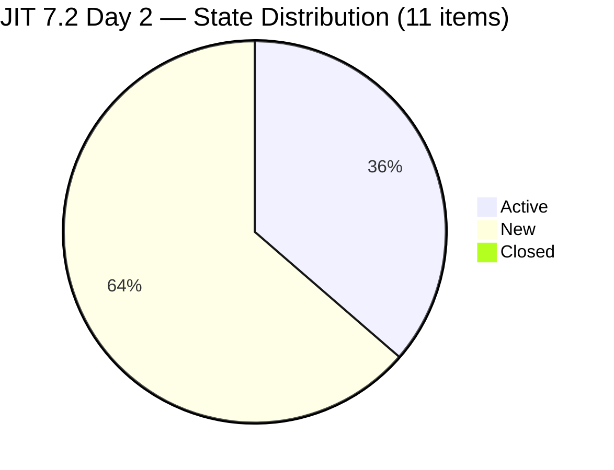
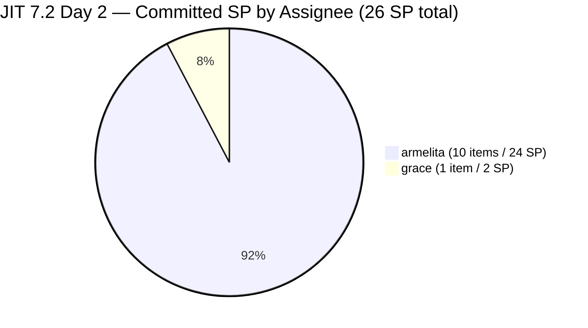
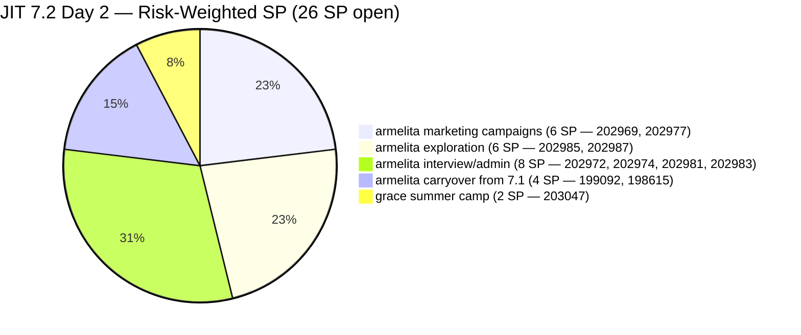
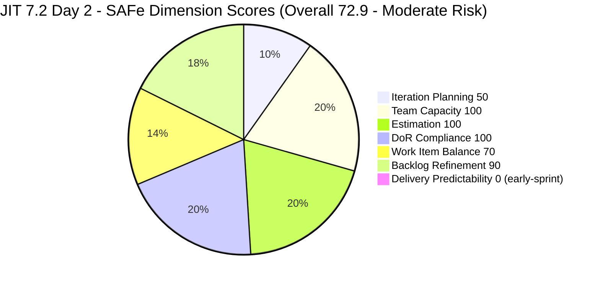

# Audit Report — JIT Operation Team

## Iteration 7.2 | Day 2 of 14 | Sprint Opening

---

## 1. Audit Metadata

| Field | Value |
|-------|-------|
| **Audit Number** | #34 (JIT PI7 series) |
| **Audit Date** | April 21, 2026, 14:00 PDT |
| **Auditor** | Claude Code ADO SAFe Audit Agent (Team A / non-critical tier) |
| **Team** | JIT Operation Team |
| **ADO Project** | Jairosoft Portfolio |
| **Workspace** | `ado_jit` |
| **Iteration** | Iteration 7.2 — Apr 20 to May 3, 2026 |
| **Iteration ID** | `8edbe25f-fa4f-41b2-aaae-f3d5cf0e5b33` |
| **Sprint Day** | Day 2 of 14 (~14% elapsed — early-sprint annotation applies to DP) |
| **Prior Audit** | `AUDIT_20260419_1345.md` (#33, 7.1 sprint close, Overall 68.8 — Moderate Risk) |
| **Report Path** | `ado_jit/audit/AUDIT_20260421_1400.md` |
| **Scoring Model** | ADO SAFe v1 (7-dimension rubric) |
| **Overall Score** | **72.9 / 100** |
| **Risk Band** | **Moderate Risk** (60–79.9) |

---

## 2. Executive Summary

JIT opens Iteration 7.2 at **72.9 (Moderate Risk)** on Day 2 — a **+4.1 improvement over PI7.1's closing score of 68.8**. The lift comes from two sources: (1) Iteration Planning improves from 31.6 to 50.0 as 11 fresh 7.2 items enter a cleaner backlog denominator, and (2) Backlog Refinement rises from 80.0 to 90.0 because Grace's chronic #201504 / #201514 blocker has been **removed from the visible backlog entirely**.

**Grace's chronic blocker resolved (finally):** The most significant finding in this audit. For 3+ consecutive audits, #201504 (School Engagement & Flyering) and #201514 ("Free Discovery Day" Event), both Grace-assigned marketing items untouched since Apr 3, 2026, drove the sole non-structural Backlog Refinement penalty. **Both items are no longer in the team's visible root backlog** as of the 7.2 backlog pull — they were either closed, removed, or re-pathed out of scope. This resolves the chronic-blocker call-out flagged in the batch brief.

**Sprint scope:** 11 root items / 26 SP committed, 90.9% User Story (+1 Training = #203047 Summer Camp Training). All items passed DoR (100%). Two items (#199092 TESDA Career Guidance Report, #198615 CSS NC II Awarding) carried over from 7.1 with ChangedDates of Apr 16 and Apr 14 respectively — these are the "untouched since sprint start" items that trigger a 2/11 = 18.2% penalty (→ Backlog Refinement −10).

**PI7.1 carry-over context:** Audit #33 flagged that PI7.1 closed with 6 Active items / 14 SP on the visible board and DP = 0.0. Of those 6: #199092, #198615, and #202385 appear handled — 199092 and 198615 now in 7.2 (correctly re-pathed); #202385 is not in the 7.2 iteration or in visible backlog. #200604 (Python Inquiries) was reworked as #202974 (Python Marketing Activities IT7.2) in 7.2. #201504 and #201514 removed as noted. Carry-over discipline is better than Audit #33 forecast.

**Delivery Predictability:** 0.0 at Day 2 — rubric early-sprint annotation applies ("early-sprint — low delivery expected"). No formula adjustment.

---

## 3. Previous Audit Delta

| Dimension | Day 14 (Apr 19, 7.1 close) | Day 2 (Apr 21, 7.2 open) | Change |
|-----------|-----------------|-----------------|--------|
| Iteration Planning | 31.6 | **50.0** | **+18.4** |
| Team Capacity | 100.0 | 100.0 | 0.0 |
| Estimation | 100.0 | 100.0 | 0.0 |
| DoR Compliance | 100.0 | 100.0 | 0.0 |
| Work Item Balance | 70.0 | 70.0 | 0.0 |
| Backlog Refinement | 80.0 | **90.0** | **+10.0** (Grace blocker removed; 1 minor penalty remains) |
| Delivery Predictability | 0.0 | 0.0 | 0.0 (early-sprint) |
| **Overall** | **68.8** | **72.9** | **+4.1** |
| **Risk Band** | Moderate | Moderate | — |

### Key observations since Day 14

- **#201504 and #201514 (Grace's chronic blockers) removed from visible backlog.** Persistent across 3+ audits (Apr 16, Apr 17, Apr 19). The −20 Backlog Refinement penalty they drove is gone.
- **Iteration rolled over Apr 20 00:00 UTC.** 11 items now in 7.2 (up from 0 in 7.2 pre-rollover).
- **Heavy sprint-open batch of new items** — 8 items created Apr 20 (#202969, #202972, #202974, #202977, #202981, #202983, #202985, #202987, #203047). All but one (#202972) have Description and Acceptance Criteria.
- **Carry-over from 7.1:** #199092 (TESDA Career Guidance Report) and #198615 (CSS NC II Certificates Awarding) re-pathed from 7.1 to 7.2. Both are Active state. These are the 2/11 untouched-since-Apr-20 items.
- **PI6-path residue items (#202514–202517)** still in visible backlog at PI6 iteration path. No Description, no AC — titles only. These remain an Iteration Planning denominator drag.
- **#200766 (ODOO OpenCat SIS Spike)** still at 2026-PI6 path, not re-pathed to PI7.
- **Samantha Babael** has capacity (1h/day Doc) but no 7.2 assignments (identical to PI7.1 pattern).
- **Grace** has 1h/day capacity but is **off Apr 21–22** (first 2 working days of sprint).

---

## 4. Current Iteration Snapshot

| Metric | Value |
|--------|-------|
| Iteration | 7.2 — Apr 20 to May 3, 2026 |
| Iteration Day | Day 2 of 14 (~14% elapsed) |
| Visible Root Backlog Items | 22 |
| Current Iteration (7.2) Root Items | 11 |
| Committed SP | **26 SP** |
| Closed SP (visible 7.2) | **0 SP** (early-sprint) |
| Open items by state | 4 Active / 7 New / 0 Closed |
| Active contributors (visible 7.2) | 2 (armelita, grace) |
| Team capacity/day (configured) | 12h/day (armelita 6h Doc, Teofilo 4h Training, Samantha 1h Doc, grace 1h Doc) |
| Grace days off | 2 (Apr 21–22) |
| Teofilo 7.2 assignments | 0 (has 4h/day Training but no 7.2 items) |
| Samantha 7.2 assignments | 0 (has 1h/day Doc but no 7.2 items) |

### State Distribution — 11 Current Items (7.2)



### Committed SP by Assignee



---

## 5. Work Item Analysis

### 5.1 Current 7.2 Items (11) — Day 2 Snapshot

| ID | Title | Type | State | SP | Assignee | ChangedDate | Touched after Apr 20? |
|----|-------|------|-------|----|----------|-------------|------------------------|
| 203047 | Summer Camp Training Implementation – 4/25/26 | Training | Ready | 2 | grace | Apr 20 21:52 | Yes |
| 199092 | TESDA Career Guidance Programs Semestral Report CY 2026 | User Story | Active | 2 | armelita | **Apr 16 12:43** | **No (untouched)** |
| 202974 | Python Marketing Activities IT7.2 | User Story | New | 2 | armelita | Apr 20 08:15 | Yes |
| 198615 | Awarding of CSS NC II Certificates | User Story | Active | 2 | armelita | **Apr 14 02:13** | **No (untouched)** |
| 202969 | Market Bubble MCC April 2026 Class Iteration 7.2 | User Story | Active | 3 | armelita | Apr 21 07:23 | Yes |
| 202972 | Request for Additional Bubble Trainer — Sam | User Story | New | 2 | armelita | Apr 20 08:04 | Yes |
| 202977 | Market CSS NC II April 2026 Class Iteration 7.2 | User Story | Active | 3 | armelita | Apr 21 07:22 | Yes |
| 202981 | Interview ADDU Interns | User Story | New | 3 | armelita | Apr 20 08:42 | Yes |
| 202983 | TESDA Forum 2026 | User Story | Active | 1 | armelita | Apr 21 05:50 | Yes |
| 202985 | UIC MCC Exploration | User Story | New | 3 | armelita | Apr 20 10:28 | Yes |
| 202987 | HCDC MCC Exploration | User Story | New | 3 | armelita | Apr 20 10:30 | Yes |

**Total: 11 items / 26 SP / 2 untouched since sprint start**

### 5.2 Visible Backlog (22) — Distribution by Iteration Path

| IterationPath | Count | IDs |
|---------------|-------|-----|
| PI7 \ Iteration 7.2 | 11 | 203047, 199092, 202974, 198615, 202969, 202972, 202977, 202981, 202983, 202985, 202987 |
| PI7 \ Iteration 7.4 | 2 | 200767, 200768 |
| PI7 \ Iteration 7.5 | 1 | 200771 |
| PI7 (no sub-iteration) | 1 | 202547 (Assessment Center Inspection) |
| PI6 | 5 | 200766, 202514, 202515, 202516, 202517 |
| Jairosoft Portfolio (root) | 2 | 188995 (Rust Courseware), 193054 (SAFe RTE MC Courseware) |

### 5.3 Work Item Type Distribution — 7.2 Current Set

| Type | Count | Share |
|------|-------|-------|
| User Story | 10 | 90.9% |
| Training | 1 | 9.1% |
| Spike | 0 | 0% |

Dominant type (User Story) = 90.9% > 60% → Work Item Balance −30.

### 5.4 DoR Verification — 11 Current 7.2 Items

| ID | Desc ≥ 30 nws | AC ≥ 20 nws | DoR |
|----|---------------|-------------|-----|
| 203047 | PASS | PASS | PASS |
| 199092 | PASS | PASS | PASS |
| 202974 | PASS | PASS | PASS |
| 198615 | PASS | PASS | PASS |
| 202969 | PASS | PASS | PASS |
| 202972 | PASS | PASS | PASS |
| 202977 | PASS | PASS | PASS |
| 202981 | PASS | PASS | PASS |
| 202983 | PASS | PASS | PASS |
| 202985 | PASS | PASS | PASS |
| 202987 | PASS | PASS | PASS |

**11/11 pass DoR → Score 100.0.** Bubble MCC and CSS NC II marketing items carry the richest structured AC (enrollment target, response SLA, collateral checklist).

### 5.5 Backlog Age (Visible 22 items, today = 2026-04-21)

| Bucket | Threshold | Count |
|--------|-----------|-------|
| Fresh | ChangedDate within last 45 days (≥ 2026-03-07) | 22 |
| Stale ≥ 90 days | ChangedDate before 2026-01-21 | 0 |
| Stale ≥ 180 days | ChangedDate before 2025-10-23 | 0 |
| Untouched current (ChangedDate < 2026-04-20 sprint start) | Among 11 current items | **2** (#199092, #198615) |

Note: #193054 SAFe RTE MC Courseware at Mar 9 is fresh by only 2 days under the 45-day threshold — flag for refinement attention in next audit.

---

## 6. SAFe Compliance Scorecard

| Dimension | Score | Evidence | Notes |
|-----------|-------|----------|-------|
| Iteration Planning | **50.0** | 11 current / 22 visible root items | PI6 residue + Jairosoft Portfolio root items + 7.4/7.5 future items dilute denominator |
| Team Capacity | **100.0** | 2/2 contributors with current work have configured activity/capacity | armelita 6h Doc, grace 1h Doc (with days off Apr 21–22) |
| Estimation | **100.0** | 11/11 point-eligible items estimated (SP > 0) | Total 26 SP |
| DoR Compliance | **100.0** | 11/11 items pass Description ≥30 nws + AC ≥20 nws | Rich AC across Bubble MCC, CSS NC II, TESDA reports |
| Work Item Balance | **70.0** | 10 US + 1 Training; US share 90.9% > 60% → −30; no Spike (0% → no penalty); has US (no −40) | Structural penalty; +1 Training better than pure US but still dominated |
| Backlog Refinement | **90.0** | fresh=22/22=100%; stale_90=0; stale_180=0; untouched_current=2/11=18.2% (>10%, <30%) → −10 | Penalty sourced from #199092, #198615 (carried from 7.1 without sprint-start refresh) |
| Delivery Predictability | **0.0** | 0 SP closed / 26 committed — *early-sprint — low delivery expected* (Day 2 of 14) | Rubric early-sprint annotation, no formula adjustment |
| **Overall** | **72.9** | (50+100+100+100+70+90+0)/7 = 510/7 = 72.857 → 72.9 | **Moderate Risk** |

### Score Computation Detail

```
1. Iteration Planning
   visible_root_backlog_items           = 22
   current_iteration_root_items (7.2)   = 11
   Score = round(11 / 22 × 100, 1)      = 50.0

2. Team Capacity
   contributors_with_current_work       = 2  (armelita, grace)
   contributors_with_capacity           = 2  (both configured with activity > 0)
   Score = round(2 / 2 × 100, 1)        = 100.0

3. Estimation
   point_eligible_current_items         = 11
   estimated_current_items              = 11  (all SP > 0)
   Score = round(11 / 11 × 100, 1)      = 100.0

4. DoR Compliance
   current_iteration_root_items         = 11
   dor_compliant_current_items          = 11
   Score = round(11 / 11 × 100, 1)      = 100.0

5. Work Item Balance
   User Story present                   = True (no −40)
   dominant_type_share                  = 10/11 = 90.9% > 60% (−30)
   spike_share                          = 0/11 = 0% (no penalty)
   Score = max(0, 100 − 30)             = 70.0

6. Backlog Refinement
   fresh_visible_root_items             = 22
   base = round(22 / 22 × 100, 1)       = 100.0
   stale_90_visible                     = 0 (0%)            no penalty
   stale_180_visible                    = 0                  no penalty
   untouched_current_items              = 2 (199092, 198615)
   untouched ratio                      = 2/11 = 18.2%
   → 10% < 18.2% ≤ 30%                  → −10 penalty
   Score = max(0, 100 − 10)             = 90.0

7. Delivery Predictability
   committed_story_points               = 26 SP
   closed_story_points                  = 0
   Score = round(0 / 26 × 100, 1)       = 0.0
   [Day 2 of 14 → "early-sprint — low delivery expected"]

Overall = round((50 + 100 + 100 + 100 + 70 + 90 + 0) / 7, 1)
        = round(510 / 7, 1)
        = 72.857
        = 72.9   →  MODERATE RISK (60 - 79.9)
```

---

## 7. Dimension Findings

### 7.1 Iteration Planning — 50.0 (Moderate)

11 of 22 visible root items are on Iteration 7.2. The denominator is inflated by:
- **5 PI6-path items** (#200766 ODOO Spike, #202514–517 Grace's JIT corp items) that should have been closed or re-pathed
- **3 future-iteration items** (#200767, #200768 at 7.4; #200771 at 7.5) — legitimate future scope, but still count in visible backlog
- **1 unassigned sub-iteration** (#202547 at PI7 root, no sub-iteration)
- **2 Jairosoft Portfolio root items** (#188995 Rust Courseware, #193054 SAFe RTE MC Courseware) at root path

Cleaning up the 5 PI6 items would raise Iteration Planning from 50.0 to 11/17 ≈ 64.7 with no other change.

### 7.2 Team Capacity — 100.0 (Low Risk)

Both contributors with 7.2 root assignments have configured capacity:
- armelita: 6h/day Documentation (10 items / 24 SP)
- grace: 1h/day Documentation (1 item / 2 SP, #203047 Summer Camp Training)

**Structural notes (not rubric-affecting):**
- grace has 2 days off (Apr 21–22) — the first 2 working days of the sprint. Her single item (#203047 Summer Camp Training, due for the Apr 25 event) has a tight timeline: she returns Apr 23, gives her 2 working days to prepare before Apr 25.
- Teofilo (4h/day Training) has no 7.2 assignments — under-utilized.
- Samantha (1h/day Doc) has no 7.2 assignments — under-utilized.

### 7.3 Estimation — 100.0 (Low Risk)

All 11 items have SP > 0: 1 SP × 1 (#202983), 2 SP × 5 (#203047, #199092, #202974, #198615, #202972), 3 SP × 5 (#202969, #202977, #202981, #202985, #202987). Total 26 SP.

### 7.4 DoR Compliance — 100.0 (Low Risk)

All 11 items pass DoR thresholds. Strongest AC profiles on marketing items (#202969 Bubble MCC, #202977 CSS NC II) with structured enrollment targets, response SLAs, and channel activation checklists. Weakest (still passing) are the exploration items (#202985 UIC, #202987 HCDC) with 3-item AC checklists.

### 7.5 Work Item Balance — 70.0 (Moderate, structural)

10 User Stories + 1 Training. User Story share 90.9% > 60% → −30. No Spike items (0%) → no −20. Has User Story → no −40. The Training item (#203047) keeps the share from reaching 100% but doesn't cross the 60% threshold.

**Improvement path:** Adding 2–3 Spike items (e.g., exploration of UIC/HCDC curricula as Spikes rather than User Stories) would push spike_share toward 40% and drop User Story dominance below 60%. Reclassifying #202985 UIC MCC Exploration and #202987 HCDC MCC Exploration from User Story → Spike is a natural fit and would shift shares to 8 US (72.7%) + 1 Training (9.1%) + 2 Spike (18.2%) — still over the 60% US threshold but closer.

### 7.6 Backlog Refinement — 90.0 (Low Risk)

- fresh_visible (≤45d): 22/22 = 100% → base 100.0
- stale_90: 0/22 → no penalty
- stale_180: 0 → no penalty
- untouched_current (ChangedDate < Apr 20): **2/11 = 18.2%** (>10%, ≤30%) → **−10**

Untouched items:
- **#199092 TESDA Career Guidance Programs Semestral Report CY 2026** — Active, armelita, 2 SP, last changed Apr 16 (5 days before sprint start). Carried from 7.1.
- **#198615 Awarding of CSS NC II Certificates** — Active, armelita, 2 SP, last changed Apr 14 (6 days before sprint start). Also carried from 7.1.

Both are already in Active state and likely in progress. A status comment or minor update would push the untouched ratio below 10% and recover Backlog Refinement to 100.0, lifting Overall from 72.9 to 74.3.

### 7.7 Delivery Predictability — 0.0 (early-sprint — low delivery expected)

0 SP closed / 26 SP committed = 0.0. Day 2 of 14 → rubric early-sprint annotation ("early-sprint — low delivery expected"). No formula adjustment.

**Scope-vs-velocity:** 26 SP commitment vs PI7.1 historical delivery of 29 SP (cumulative across 20 closed items in 7.1 per Audit #33 historical number) or 0 SP (formula-visible at 7.1 close per Audit #33 strict reading). Using the 29 SP empirical baseline, 26 SP commitment is modestly under capacity — healthy. Using Audit #33's strict-visible number (0 SP), any non-zero commitment is aspirational. Recommendation: target ≥3 closures per week to maintain pace.

---

## 8. Risks and Bottlenecks



| # | Risk | Severity | Trend |
|---|------|----------|-------|
| R1 | **#199092 and #198615 carried from 7.1 without sprint-start refresh** — 18.2% untouched ratio drives −10 Backlog Refinement penalty. Both are Active state so likely in progress; a status comment would recover the dimension. | MODERATE | New |
| R2 | **Grace off Apr 21–22** (first 2 working days of sprint) with a single 2 SP Training item (#203047) due Apr 25. After her days off, she has ~2 working days to prepare before the Apr 25 Summer Camp event. Tight timeline. | MODERATE | New |
| R3 | **armelita carries 10 items / 24 SP alone** — 92% of sprint SP on one contributor. Structural ownership concentration. | HIGH | Structural |
| R4 | **Teofilo (4h/day Training) and Samantha (1h/day Doc) have zero 7.2 root-item assignments** — capacity under-utilization. | MODERATE | Recurring |
| R5 | **5 PI6-path items still in visible backlog** (#200766, #202514, #202515, #202516, #202517) — Grace's JIT corp secretary items have no Description/AC (bare titles). Distort Iteration Planning denominator. | MODERATE | Structural from prior audits |
| R6 | **2 Jairosoft Portfolio root Courseware items** (#188995 Rust, #193054 SAFe RTE MC) sit at root without sprint assignment. #193054 ChangedDate Mar 9 — only 2 days from crossing the 45-day fresh threshold. | LOW | Recurring |
| R7 | **#202547 (Assessment Center Inspection)** floats at PI7 root with no sub-iteration since 7.1 — not re-pathed to 7.2 or 7.3. | LOW | Carried from Audit #33 R7 |
| R8 | **No iteration goal** documented in ADO for 7.2 (persistent across PI7) | LOW-MODERATE | Persistent |
| R9 | **#202972 Request for Additional Bubble Trainer — Sam** has shorter AC than other items (2 bullet points vs 5–8) — borderline DoR; passes rubric thresholds but limited definition of done | LOW | New |

### ✅ Resolved Risks

| # | Risk (from prior audits) | Resolution |
|---|--------------------------|------------|
| R-prior | **Grace's #201504 and #201514 untouched 16d** — chronic blocker across 3+ audits | **REMOVED from visible backlog.** Either closed or re-pathed out of Stories & Deliverables scope. |
| R-prior | **No closures recorded Apr 17 → Apr 19** — 0% visible DP at 7.1 close | Rolled over; no longer rubric-relevant. |

---

## 9. Prioritized Recommendations

| Priority | Action | Owner | Target |
|----------|--------|-------|--------|
| **P1** | **Status-comment #199092 and #198615 today.** Both Active, both carried from 7.1. A comment or minor update pushes untouched ratio from 18.2% to 0%, removes the −10 Backlog Refinement penalty, and lifts Overall from 72.9 to 74.3. | armelita | Apr 22 |
| **P2** | **Clarify #203047 Summer Camp Training path while grace is out.** grace is off Apr 21–22; event is Apr 25. Consider delegating prep work to armelita or adjusting the event date. Document decision on the work item. | Ramon / armelita | Apr 22 |
| **P3** | **Prune PI6-path residue.** #200766 (ODOO Spike), #202514, #202515, #202516, #202517 should be either closed or re-pathed to PI7. If Grace's 4 corp-secretary items are still live work, give them Description/AC and assign them to a PI7 iteration. | grace / armelita | Apr 24 |
| **P4** | **Reassign or close #202547 (Assessment Center Inspection).** Either give it a 7.2 or 7.3 sub-iteration path, or close if superseded. | armelita | Apr 24 |
| **P5** | **Distribute work to Teofilo and Samantha.** Both have configured capacity but zero 7.2 root assignments. Consider: Teofilo owns the TESDA Forum 2026 item (#202983, 1 SP); Samantha owns #202974 Python Marketing Activities. This both utilizes capacity and reduces armelita's 24 SP concentration. | Ramon / armelita | Apr 22 |
| **P6** | **Reclassify #202985 UIC MCC Exploration and #202987 HCDC MCC Exploration as Spike items.** They are exploratory research work. Converting both from User Story → Spike would shift type shares and move the team closer to diversified composition. | armelita | Apr 23 |
| **P7** | **Define a 7.2 sprint goal.** Suggested: "By May 3, launch Bubble MCC and CSS NC II April classes with 25+ qualified leads each; award CSS NC II certificates; submit TESDA Career Guidance Report." Capture in iteration description. | Ramon / armelita | Apr 22 |
| **P8** | **Enrich #202972 Request for Additional Bubble Trainer — Sam AC.** Current AC has 2 bullet points (TESDA approval + T2MIS). Expand to cover timeline, contact person, artifact links. | armelita | Apr 24 |

---

## 10. Evidence Gaps and Limitations

| Gap | Impact | Notes |
|-----|--------|-------|
| **#201504 and #201514 disposition** | Unable to confirm whether items were closed, moved to another project, or archived. Items simply do not appear in the current visible root backlog for JIT Operation Team. | Positive outcome — chronic penalty removed. |
| **#202972 brief AC** | Shorter AC (2 bullets) than other items; passes rubric DoR thresholds but borderline | Flagged in recommendations |
| **Grace's non-workday coverage for #203047** | grace off Apr 21–22; Summer Camp event Apr 25. Execution risk during her absence not resolvable from ADO fields alone. | Flagged as R2 |
| **PI6-path items (#202514–517) no content** | Bare titles without Description or AC. Cannot evaluate whether they are live work, placeholders, or abandoned. | Recommend triage with Grace |
| **No iteration goal** | No sprint goal in ADO iteration definition — limits outcome-aligned retrospective | Persistent |
| **Teofilo & Samantha under-utilization** | Both have configured capacity but no 7.2 root assignments. Cannot determine from ADO whether they are working on child tasks, supporting other teams, or actually under-utilized. | Recommend conversation |

---

## 11. Visualizations

### 11.1 Dimension Score Breakdown



### 11.2 Audit Score Trajectory — JIT PI7

| Audit | Date | Day | Sprint | Overall | Band | Key Driver |
|-------|------|-----|--------|---------|------|------------|
| #28 | Apr 12 | 7 | 7.1 | 71.1 | Moderate | — |
| #29 | Apr 13 | 8 | 7.1 | 75.8 | Moderate | — |
| #31 | Apr 16 | 11 | 7.1 | 77.2 | Moderate | Wave 4 closures |
| #32 | Apr 17 | 12 | 7.1 | 78.4 | Moderate | Adjusted DP 67.4% |
| #33 | Apr 19 | 14 | 7.1 close | 68.8 | Moderate | Strict-visible DP 0.0 |
| **#34** | **Apr 21** | **2** | **7.2 open** | **72.9** | **Moderate** | **Grace blocker removed; 7.2 planned** |

---

*Report generated by Claude Code ADO SAFe Audit Agent | Iteration 7.2, Day 2 | Apr 21, 2026 14:00 PDT*
