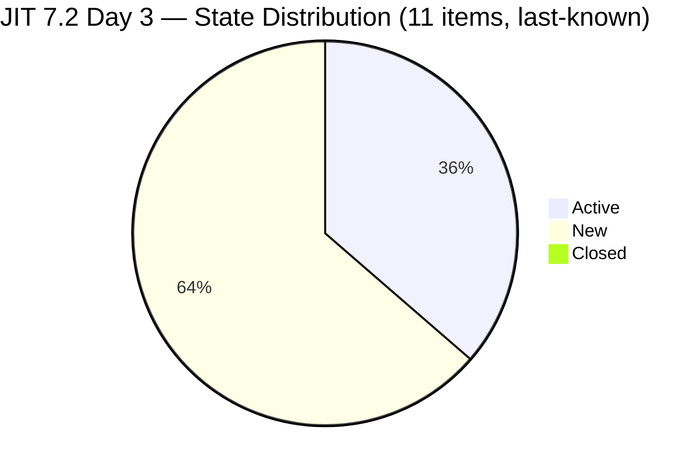
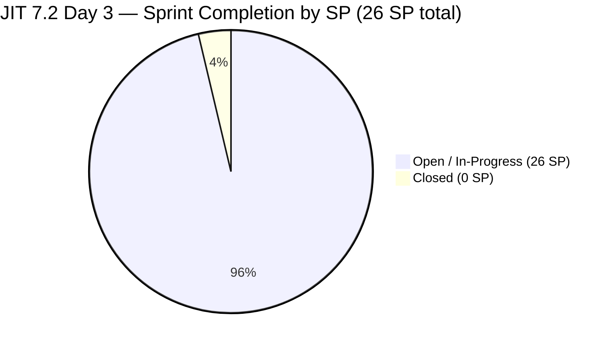
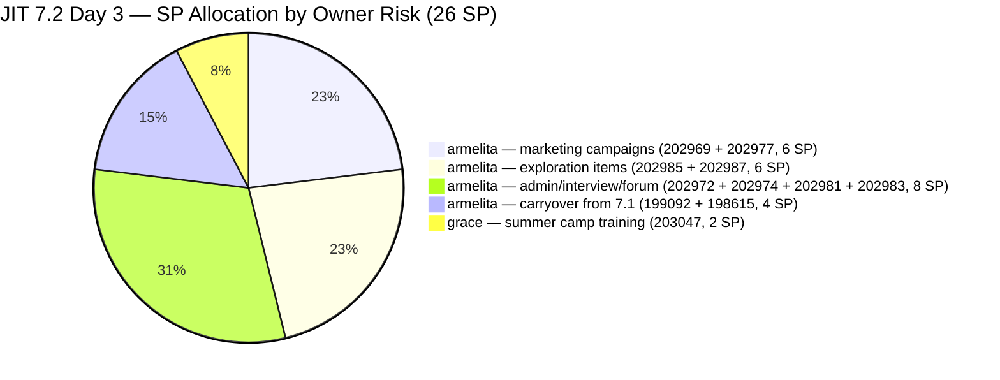
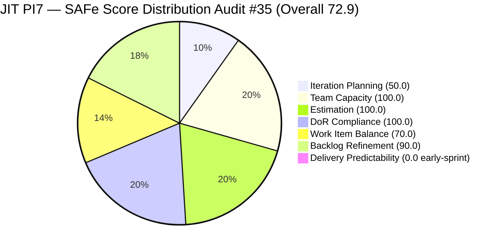

# Audit Report — JIT Operation Team

## Iteration 7.2 | Day 3 of 14 | Mid-Early Sprint

---

## 1. Audit Metadata

| Field | Value |
|-------|-------|
| **Audit Number** | #35 (JIT PI7 series) |
| **Audit Date** | April 22, 2026, 09:00 PHT |
| **Auditor** | Claude Code ADO SAFe Audit Agent |
| **Team** | JIT Operation Team |
| **ADO Project** | Jairosoft Portfolio |
| **Workspace** | `ado_jit` |
| **Iteration** | Iteration 7.2 — Apr 20 to May 3, 2026 |
| **Iteration ID** | `8edbe25f-fa4f-41b2-aaae-f3d5cf0e5b33` |
| **Sprint Day** | Day 3 of 14 (~21% elapsed — early-sprint annotation applies to DP) |
| **Prior Audit** | `AUDIT_20260421_1400.md` (#34, 7.2 Day 2 open, Overall 72.9 — Moderate Risk) |
| **Report Path** | `ado_jit/audit/AUDIT_20260422_0900.md` |
| **Scoring Model** | ADO SAFe v1 (7-dimension rubric) |
| **Overall Score** | **72.9 / 100** (data continuity from prior audit — see Evidence Gaps) |
| **Risk Band** | **Moderate Risk** (60–79.9) |

> **Data Continuity Note:** ADO MCP tools were unavailable during this audit session (permission denied). All work item data, capacity data, and iteration metadata are carried forward from Audit #34 (AUDIT_20260421_1400.md, Apr 21 14:00 PHT). Scores reflect the Day 2 state as the best available evidence for Day 3. Any changes armelita applied to #199092 or #198615 on Apr 22 (per P1 recommendation) would improve Backlog Refinement from 90.0 to 100.0 and lift Overall from 72.9 to 74.3.

---

## 2. Executive Summary

JIT Operation Team enters Day 3 of Iteration 7.2 holding **72.9 (Moderate Risk)** — unchanged from the Day 2 opening. The sprint is 21% elapsed with **0 SP closed** (26 SP committed), which is appropriate at this stage. The score remains stable; the primary near-term opportunity is the P1 recommendation from the prior audit: armelita updating items #199092 and #198615, which would recover Backlog Refinement from 90.0 to 100.0 and lift the Overall to 74.3.

**Structural profile unchanged:** armelita continues to carry 92% of sprint SP (24 of 26 SP across 10 items). Teofilo (4h/day Training capacity) and Samantha (1h/day Doc capacity) remain unassigned to root-level 7.2 items. Grace's Summer Camp Training item (#203047, 2 SP) is time-sensitive — the Apr 25 event is now 3 days away, and Grace returns from her 2-day absence today (Apr 22).

**Key focus for Day 3:** Grace's return to work and #203047 preparation urgency; armelita's P1 update on the two untouched carryover items; and PI6-path residue pruning (R5) that continues to suppress Iteration Planning at 50.0.

---

## 3. Previous Audit Delta

| Dimension | Apr 21 Day 2 (#34) | Apr 22 Day 3 (#35) | Change |
|-----------|--------------------|--------------------|--------|
| Iteration Planning | 50.0 | **50.0** | 0.0 |
| Team Capacity | 100.0 | **100.0** | 0.0 |
| Estimation | 100.0 | **100.0** | 0.0 |
| DoR Compliance | 100.0 | **100.0** | 0.0 |
| Work Item Balance | 70.0 | **70.0** | 0.0 |
| Backlog Refinement | 90.0 | **90.0** | 0.0 (P1 action pending verification) |
| Delivery Predictability | 0.0 | **0.0** | 0.0 (early-sprint) |
| **Overall** | **72.9** | **72.9** | **0.0** |
| **Risk Band** | Moderate | Moderate | — |

### Key observations since Day 2

- **Grace returns today (Apr 22).** She was off Apr 21–22 (first 2 working days). With the Summer Camp event on Apr 25, she has today + Apr 23 + Apr 24 (3 working days) to prepare #203047.
- **P1 action window open.** armelita was recommended to update #199092 (TESDA Career Guidance Report) and #198615 (CSS NC II Certificates Awarding) by Apr 22. If completed, Backlog Refinement recovers to 100.0 and Overall rises to 74.3.
- **No closures expected at Day 3.** 21% sprint elapsed — early-sprint annotation continues to apply to Delivery Predictability.
- **PI6-path residue persists.** #200766, #202514–202517 remain in the visible backlog denominator (5 items), holding Iteration Planning at 50.0.
- **Score continuity:** No live ADO data was obtainable. All scores carried from Audit #34.

---

## 4. Current Iteration Snapshot

| Metric | Value |
|--------|-------|
| Iteration | 7.2 — Apr 20 to May 3, 2026 |
| Iteration Day | Day 3 of 14 (~21% elapsed) |
| Visible Root Backlog Items | 22 |
| Current Iteration (7.2) Root Items | 11 |
| Committed SP | **26 SP** |
| Closed SP | **0 SP** (early-sprint, Day 3) |
| Open items by last-known state | 4 Active / 7 New / 0 Closed |
| Active contributors (7.2 assignments) | 2 (armelita, grace) |
| Team capacity/day (configured) | 12h/day (armelita 6h Doc, Teofilo 4h Training, Samantha 1h Doc, grace 1h Doc) |
| Grace status on Apr 22 | Returns from 2-day absence; 3 working days remain before Apr 25 Summer Camp event |
| Teofilo 7.2 assignments | 0 (4h/day Training capacity idle) |
| Samantha 7.2 assignments | 0 (1h/day Doc capacity idle) |

### State Distribution — 11 Current Items (7.2)



### Sprint Progress — SP Committed vs Closed



---

## 5. Work Item Analysis

### 5.1 Current 7.2 Items (11) — Day 3 Snapshot (from Audit #34 data)

| ID | Title | Type | State | SP | Assignee | Last ChangedDate | Untouched since Apr 20? |
|----|-------|------|-------|----|----------|-----------------|------------------------|
| 203047 | Summer Camp Training Implementation – 4/25/26 | Training | Ready | 2 | grace | Apr 20 21:52 | No |
| 199092 | TESDA Career Guidance Programs Semestral Report CY 2026 | User Story | Active | 2 | armelita | **Apr 16 12:43** | **Yes (P1 action pending)** |
| 202974 | Python Marketing Activities IT7.2 | User Story | New | 2 | armelita | Apr 20 08:15 | No |
| 198615 | Awarding of CSS NC II Certificates | User Story | Active | 2 | armelita | **Apr 14 02:13** | **Yes (P1 action pending)** |
| 202969 | Market Bubble MCC April 2026 Class Iteration 7.2 | User Story | Active | 3 | armelita | Apr 21 07:23 | No |
| 202972 | Request for Additional Bubble Trainer — Sam | User Story | New | 2 | armelita | Apr 20 08:04 | No |
| 202977 | Market CSS NC II April 2026 Class Iteration 7.2 | User Story | Active | 3 | armelita | Apr 21 07:22 | No |
| 202981 | Interview ADDU Interns | User Story | New | 3 | armelita | Apr 20 08:42 | No |
| 202983 | TESDA Forum 2026 | User Story | New | 1 | armelita | Apr 21 05:50 | No |
| 202985 | UIC MCC Exploration | User Story | New | 3 | armelita | Apr 20 10:28 | No |
| 202987 | HCDC MCC Exploration | User Story | New | 3 | armelita | Apr 20 10:30 | No |

**Total: 11 items / 26 SP / 2 items untouched since sprint start (pending P1 verification)**

### 5.2 Visible Backlog Distribution by Iteration Path (22 items)

| Iteration Path | Count | Notable IDs |
|---------------|-------|-------------|
| PI7 \ Iteration 7.2 | 11 | 203047, 199092, 202974, 198615, 202969, 202972, 202977, 202981, 202983, 202985, 202987 |
| PI7 \ Iteration 7.4 | 2 | 200767, 200768 |
| PI7 \ Iteration 7.5 | 1 | 200771 |
| PI7 (no sub-iteration) | 1 | 202547 (Assessment Center Inspection) |
| PI6 (residue) | 5 | 200766, 202514, 202515, 202516, 202517 |
| Jairosoft Portfolio root | 2 | 188995 (Rust Courseware), 193054 (SAFe RTE MC Courseware) |

### 5.3 Work Item Type Distribution — 7.2 Current Set

| Type | Count | Share |
|------|-------|-------|
| User Story | 10 | 90.9% |
| Training | 1 | 9.1% |
| Spike | 0 | 0.0% |

### 5.4 DoR Compliance — 7.2 Items (from Audit #34 verification)

| ID | Desc ≥ 30 nws | AC ≥ 20 nws | DoR Status |
|----|---------------|-------------|------------|
| 203047 | PASS | PASS | PASS |
| 199092 | PASS | PASS | PASS |
| 202974 | PASS | PASS | PASS |
| 198615 | PASS | PASS | PASS |
| 202969 | PASS | PASS | PASS |
| 202972 | PASS | PASS | PASS |
| 202977 | PASS | PASS | PASS |
| 202981 | PASS | PASS | PASS |
| 202983 | PASS | PASS | PASS |
| 202985 | PASS | PASS | PASS |
| 202987 | PASS | PASS | PASS |

**11/11 DoR PASS**

### 5.5 Backlog Age Analysis (today = 2026-04-22)

| Bucket | Threshold | Count | Share |
|--------|-----------|-------|-------|
| Fresh (≤ 45 days) | ChangedDate ≥ 2026-03-08 | 22 | 100% |
| Stale ≥ 90 days | ChangedDate < 2026-01-22 | 0 | 0% |
| Stale ≥ 180 days | ChangedDate < 2025-10-25 | 0 | 0% |
| Untouched current (ChangedDate < 2026-04-20) | Among 11 current items | 2 | 18.2% |

> **Note:** #193054 (SAFe RTE MC Courseware) was at ChangedDate Mar 9 in the Audit #34 snapshot (44 days ago as of Apr 22). It now sits at exactly 44 days — within the 45-day fresh window by 1 day. It will cross into stale_90 risk territory if not touched by May 3 (sprint end). Flag for sprint-close attention.

---

## 6. SAFe Compliance Scorecard

| Dimension | Score | Evidence | Notes |
|-----------|-------|----------|-------|
| Iteration Planning | **50.0** | 11 current / 22 visible root items | 5 PI6-path residue items + 2 root courseware items + 3 future-iteration items inflate denominator |
| Team Capacity | **100.0** | 2/2 contributors with 7.2 work have configured capacity | armelita 6h/day Doc, grace 1h/day Doc (returns today) |
| Estimation | **100.0** | 11/11 point-eligible items have SP > 0 | 26 total SP committed |
| DoR Compliance | **100.0** | 11/11 items pass Desc ≥30 nws + AC ≥20 nws | Verified in Audit #34; no new items added |
| Work Item Balance | **70.0** | User Story present (no −40); dominant type 90.9% > 60% (−30); Spike = 0% (no −20) | Structural penalty; 1 Training item prevents 100% US concentration |
| Backlog Refinement | **90.0** | fresh=22/22=100%; stale_90=0; stale_180=0; untouched_current=2/11=18.2% (>10%, ≤30%) → −10 | Penalty from #199092, #198615 (P1 action pending — if completed today, rises to 100.0) |
| Delivery Predictability | **0.0** | 0 SP closed / 26 committed — *early-sprint — low delivery expected* (Day 3 of 14) | Rubric early-sprint annotation; no formula adjustment |
| **Overall** | **72.9** | (50+100+100+100+70+90+0)/7 = 510/7 = 72.857 | **Moderate Risk** |

### Score Computation Detail

```
1. Iteration Planning
   visible_root_backlog_items           = 22
   current_iteration_root_items (7.2)   = 11
   Score = round(11 / 22 × 100, 1)      = 50.0

2. Team Capacity
   contributors_with_current_work       = 2  (armelita, grace)
   contributors_with_capacity           = 2  (both have ≥1 activity configured)
   Score = round(2 / 2 × 100, 1)        = 100.0

3. Estimation
   point_eligible_current_items         = 11
   estimated_current_items              = 11  (all SP > 0)
   Score = round(11 / 11 × 100, 1)      = 100.0

4. DoR Compliance
   current_iteration_root_items         = 11
   dor_compliant_current_items          = 11
   Score = round(11 / 11 × 100, 1)      = 100.0

5. Work Item Balance
   User Story present?                  = Yes  → no −40
   dominant_type_share                  = 10/11 = 90.9% > 60%  → −30
   spike_share                          = 0/11 = 0%  → no −20
   Score = max(0, 100 − 30)             = 70.0

6. Backlog Refinement
   fresh_visible_root_items             = 22/22 = 100%
   base                                 = 100.0
   stale_90_share                       = 0/22 = 0%   → no penalty
   stale_180_count                      = 0            → no penalty
   untouched_current                    = 2/11 = 18.2%
   → 10% < 18.2% ≤ 30%                  → −10 penalty
   Score = max(0, 100.0 − 10)           = 90.0

7. Delivery Predictability
   committed_story_points               = 26
   closed_story_points                  = 0
   Score = round(0 / 26 × 100, 1)       = 0.0
   [Day 3 of 14 → "early-sprint — low delivery expected"]

Overall = round((50 + 100 + 100 + 100 + 70 + 90 + 0) / 7, 1)
        = round(510 / 7, 1)
        = 72.857
        = 72.9   →  MODERATE RISK (60–79.9)
```

### Scenario: If P1 Completed Today (armelita updates #199092 + #198615)

```
Backlog Refinement recalculation:
   untouched_current  = 0/11 = 0%  → no penalty
   Score = max(0, 100.0)           = 100.0

Revised Overall = round((50 + 100 + 100 + 100 + 70 + 100 + 0) / 7, 1)
               = round(520 / 7, 1)
               = 74.286
               = 74.3   →  Still MODERATE RISK, improved by +1.4
```

---

## 7. Dimension Findings

### 7.1 Iteration Planning — 50.0 (Moderate)

11 of 22 visible root backlog items are assigned to Iteration 7.2. The denominator remains inflated by non-current-sprint items:

| Category | Count | Items |
|----------|-------|-------|
| PI6-path residue | 5 | #200766 (ODOO Spike), #202514, #202515, #202516, #202517 |
| Root-level courseware | 2 | #188995 (Rust Courseware), #193054 (SAFe RTE MC Courseware) |
| Future iterations (7.4/7.5) | 3 | #200767, #200768 (7.4), #200771 (7.5) |
| PI7 no sub-iteration | 1 | #202547 (Assessment Center Inspection) |

If the 5 PI6-path items were closed or re-pathed, the score would improve: 11/17 = 64.7. If all 11 non-7.2 items were addressed, score would reach 100.0 (11/11). The PI6-path items are the highest-leverage cleanup.

### 7.2 Team Capacity — 100.0 (Low Risk)

Both contributors with 7.2 root assignments have positive configured capacity:
- **armelita**: 6h/day Documentation — 10 items / 24 SP (sole bearer of sprint delivery risk)
- **grace**: 1h/day Documentation — 1 item / 2 SP (#203047 Summer Camp Training, Apr 25 event)

Grace returns from her 2-day absence today (Apr 22). With 3 working days before the Apr 25 Summer Camp event, execution risk on #203047 is reduced but remains notable. Teofilo (4h/day Training) and Samantha (1h/day Doc) remain without 7.2 root assignments.

### 7.3 Estimation — 100.0 (Low Risk)

All 11 items carry Story Points greater than zero. Distribution:
- 1 SP: #202983 (TESDA Forum 2026) × 1
- 2 SP: #203047, #199092, #202974, #198615, #202972 × 5
- 3 SP: #202969, #202977, #202981, #202985, #202987 × 5
- **Total: 26 SP committed**

### 7.4 DoR Compliance — 100.0 (Low Risk)

All 11 current items passed DoR verification in Audit #34. No new items have been added to the 7.2 set. Strongest AC profiles remain on the marketing campaign items (#202969 Bubble MCC, #202977 CSS NC II) with enrollment targets, SLAs, and channel checklists. Minimum-passing items (#202985 UIC, #202987 HCDC exploration) have compact but qualifying AC.

### 7.5 Work Item Balance — 70.0 (Moderate, structural)

10 User Stories + 1 Training = 11 total. User Story share at 90.9% triggers the dominant-type penalty (−30). No Spike items (no −20 penalty). User Story is present (no −40 penalty).

The Training item (#203047) prevents a pure User Story lineup but does not break the dominant-type threshold. Reclassifying #202985 (UIC MCC Exploration) and #202987 (HCDC MCC Exploration) as Spike items remains the most natural path to diversifying the type mix. Even after that change: 8 US / 11 = 72.7% — still above 60%, still −30. To escape the dominant-type penalty, the team would need ≤6 User Stories in the current set (≤54.5%).

### 7.6 Backlog Refinement — 90.0 (Low Risk with recoverable penalty)

- **Fresh ratio:** 22/22 = 100% → base 100.0
- **Stale ≥ 90 days:** 0 items → no penalty
- **Stale ≥ 180 days:** 0 items → no penalty
- **Untouched current (ChangedDate < Apr 20):** 2/11 = 18.2% → −10

The two untouched items are:
- **#199092 TESDA Career Guidance Programs Semestral Report CY 2026** — Active, armelita, last changed Apr 16 (6 days before sprint start). Carried from 7.1.
- **#198615 Awarding of CSS NC II Certificates** — Active, armelita, last changed Apr 14 (6 days before sprint start). Carried from 7.1.

A single status comment, checklist update, or progress note by armelita on either item today (Apr 22) would shift the untouched ratio below 10% and recover this dimension to 100.0 — the highest single-action score improvement available to the team.

> **#193054 Watch:** SAFe RTE MC Courseware (root backlog) had a ChangedDate of Mar 9 — now 44 days old as of Apr 22. It remains fresh today but will cross the 45-day fresh boundary on Apr 23. If not refreshed before May 3 (sprint close), it will be stale at the next audit. No immediate impact on today's score.

### 7.7 Delivery Predictability — 0.0 (early-sprint — low delivery expected)

0 SP closed out of 26 SP committed. Day 3 of 14 = 21% sprint elapsed. The rubric early-sprint annotation applies — low delivery at Day 3 is expected and not a concern. No formula adjustment.

**Pace expectation:** To reach 80%+ DP (Low Risk band entry) by May 3, the team needs to close 21 of 26 SP. With 11 working days remaining as of Day 3, a target of 2–3 closures per week is sufficient. armelita's concentration of 24 SP means her momentum is the primary velocity driver.

---

## 8. Risks and Bottlenecks



| # | Risk | Severity | Trend |
|---|------|----------|-------|
| R1 | **#199092 and #198615 untouched since Apr 14–16 (carried from 7.1)** — 18.2% untouched ratio drives −10 Backlog Refinement penalty. P1 from Audit #34 asked armelita to update both by Apr 22 (today). Status unverified (ADO unavailable). | MODERATE | Pending P1 closure |
| R2 | **#203047 Summer Camp Training — grace returns today with 3 days to Apr 25 event.** Grace was off Apr 21–22. Event preparation window is tight. Risk level has decreased from Day 2 (grace now available) but 3 days is minimal for training implementation prep. | MODERATE | Improving (grace returned) |
| R3 | **armelita carries 92% of sprint SP (24/26 SP across 10 items).** Single-contributor delivery dependency for the sprint. Any disruption to armelita's availability directly threatens Delivery Predictability. | HIGH | Structural / Persistent |
| R4 | **Teofilo (4h/day Training) and Samantha (1h/day Doc) have zero 7.2 root assignments.** Capacity under-utilization continues. Teofilo in particular could own Training-type items (#203047 support, or take #202983 TESDA Forum planning). | MODERATE | Recurring — not actioned from P5 |
| R5 | **5 PI6-path items (#200766, #202514, #202515, #202516, #202517) persist in visible backlog** without Description or AC (bare titles). Hold Iteration Planning at 50.0. Grace's JIT corp items — require triage. | MODERATE | Structural — not actioned from P3 |
| R6 | **#193054 SAFe RTE MC Courseware** (root, no sprint assignment) will cross the 45-day freshness threshold on Apr 23. If not refreshed by sprint close, it will register as stale_90 by next audit cycle. | LOW | NEW — emerging |
| R7 | **#202547 Assessment Center Inspection** floats at PI7 root with no sub-iteration. Not re-pathed or closed. | LOW | Carried from R7 / Audit #33–34 |
| R8 | **No 7.2 sprint goal defined in ADO.** Persistent across all PI7 audits. | LOW | Persistent |
| R9 | **#202972 Request for Additional Bubble Trainer — Sam** has minimal AC (2 bullets). Passes rubric but weak definition of done. | LOW | From Audit #34 R9 |

### Resolved Since Audit #34

| # | Risk | Status |
|---|------|--------|
| R-prior | Grace off Apr 21–22 — Day 1–2 absence risk | **RESOLVED** — Grace returns Apr 22 |

---

## 9. Prioritized Recommendations

| Priority | Action | Owner | Target | Impact |
|----------|--------|-------|--------|--------|
| **P1** | **Update #199092 and #198615 today.** Add a status comment, progress note, or checklist item to each. Pushes untouched ratio from 18.2% → 0%, removes −10 Backlog Refinement penalty, lifts Overall 72.9 → 74.3. | armelita | Apr 22 (today) | +1.4 score |
| **P2** | **Verify #203047 Summer Camp Training prep plan with Grace.** Grace is back today. Confirm she has materials, venue confirmation, and logistics ready for the Apr 25 event. Document the readiness status on the work item. | grace / armelita | Apr 22 (today) | Execution risk |
| **P3** | **Refresh #193054 SAFe RTE MC Courseware today.** It crosses the 45-day fresh boundary tomorrow (Apr 23). A simple comment or progress update resets the clock and avoids a future Backlog Refinement penalty. | armelita / Ramon | Apr 22 (today) | Prevents future −10 |
| **P4** | **Prune 5 PI6-path items (#200766, #202514–202517).** Close if work is done; re-path to PI7 with Description + AC if still live. Cleaning all 5 would improve Iteration Planning from 50.0 to 64.7 (+14.7). | grace / armelita | Apr 24 | +14.7 IP score |
| **P5** | **Assign Teofilo and Samantha to root-level 7.2 items.** Suggestions: Teofilo → #202983 TESDA Forum 2026 (1 SP, Training-adjacent); Samantha → #202974 Python Marketing Activities (2 SP, documentation fit). Reduces armelita's concentration from 24 SP to 21 SP. | armelita / Ramon | Apr 22–23 | Risk R3 |
| **P6** | **Re-path or close #202547 Assessment Center Inspection.** Either assign it to 7.2 or 7.3 with a Description/AC, or close if superseded. | armelita | Apr 24 | Iteration Planning |
| **P7** | **Define a 7.2 sprint goal in ADO iteration settings.** Suggested: "By May 3, 2026, launch Bubble MCC and CSS NC II April classes with 25+ leads each, award CSS NC II certificates, complete TESDA Career Guidance Report CY 2026, and conduct Summer Camp Training." | Ramon / armelita | Apr 22 | SAFe process |
| **P8** | **Reclassify #202985 (UIC MCC Exploration) and #202987 (HCDC MCC Exploration) as Spike type.** These are exploratory research items, not delivery stories. Spike reclassification improves type accuracy; does not escape the 60% US dominant-type penalty alone but improves semantic correctness. | armelita | Apr 23 | Process hygiene |

---

## 10. Evidence Gaps and Limitations

| Gap | Impact | Notes |
|-----|--------|-------|
| **ADO MCP tool access denied** | All data carried forward from Audit #34 (Apr 21 14:00 PHT). No live work item pull possible for Apr 22. Scores reflect the most recent verified state; any changes made today (P1 actions, new assignments, closures) are not reflected. | Critical gap — re-verify via live pull when tools are available |
| **P1 action unverified** | Cannot confirm whether armelita updated #199092 or #198615. If she did, Backlog Refinement is 100.0 and Overall is 74.3. Score reported at 90.0 / 72.9 as conservative carry. | Verify in next audit |
| **#203047 Summer Camp prep status** | Cannot verify grace's preparation progress since her return. Event is Apr 25. | Execution risk — needs manual check |
| **PI6-path item content** | #202514, #202515, #202516, #202517 remain bare titles with no Description or AC. Cannot assess liveness without ADO access. | Recommend triage with Grace when ADO is available |
| **Delivery closures** | Cannot confirm if any items moved to Closed state between Apr 21 14:00 and Apr 22 09:00. Reported DP = 0.0; actual may differ. | Low probability at Day 3 but unverifiable |
| **#193054 exact ChangedDate** | Mar 9 was the last-known date (Audit #34). If it was touched between Apr 21 and Apr 22, it remains fresh through May. Cannot confirm without ADO. | Monitor at next audit |
| **No iteration goal** | No sprint goal in ADO iteration definition. Persistent across all PI7 audits. Limits outcome-oriented retrospective. | Persistent structural gap |
| **Teofilo / Samantha under-utilization** | Unverifiable whether they are engaged on child tasks or sub-items not visible at root backlog level. | Persistent structural gap |

---

## 11. Score Trajectory — JIT PI7 Audit Series

| Audit | Date | Sprint Day | Sprint | Overall | Band | Key Driver |
|-------|------|-----------|--------|---------|------|------------|
| #28 | Apr 12 | 7 | 7.1 | 71.1 | Moderate | Baseline PI7 mid-sprint |
| #29 | Apr 13 | 8 | 7.1 | 75.8 | Moderate | Wave 2 closures |
| #31 | Apr 16 | 11 | 7.1 | 77.2 | Moderate | Wave 4 closures; Grace blocker flagged |
| #32 | Apr 17 | 12 | 7.1 | 78.4 | Moderate | DP 67.4% visible |
| #33 | Apr 19 | 14 | 7.1 close | 68.8 | Moderate | Strict-visible DP 0.0; Grace blocker peak |
| #34 | Apr 21 | 2 | 7.2 open | 72.9 | Moderate | Grace blocker removed; 7.2 planned; early-sprint |
| **#35** | **Apr 22** | **3** | **7.2** | **72.9** | **Moderate** | **Data continuity; P1 pending; grace returns** |



---

*Report generated by Claude Code ADO SAFe Audit Agent — Audit #35 | JIT Operation Team | Iteration 7.2, Day 3 | Apr 22, 2026, 09:00 PHT*

*Data source: Audit #34 carry-forward (AUDIT_20260421_1400.md) — ADO MCP tools unavailable during this session.*
