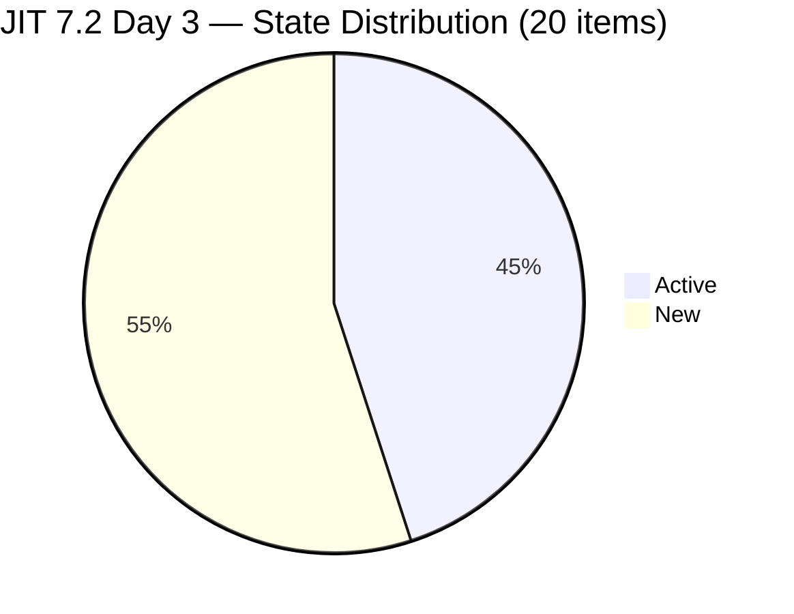
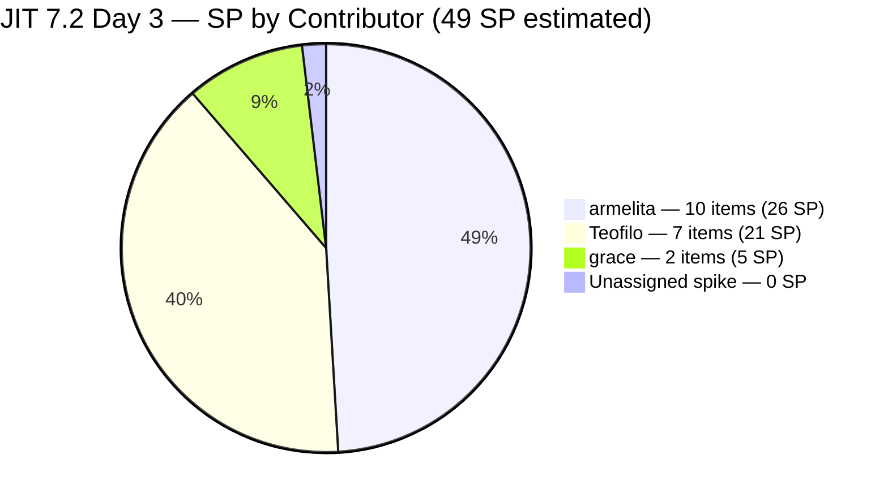
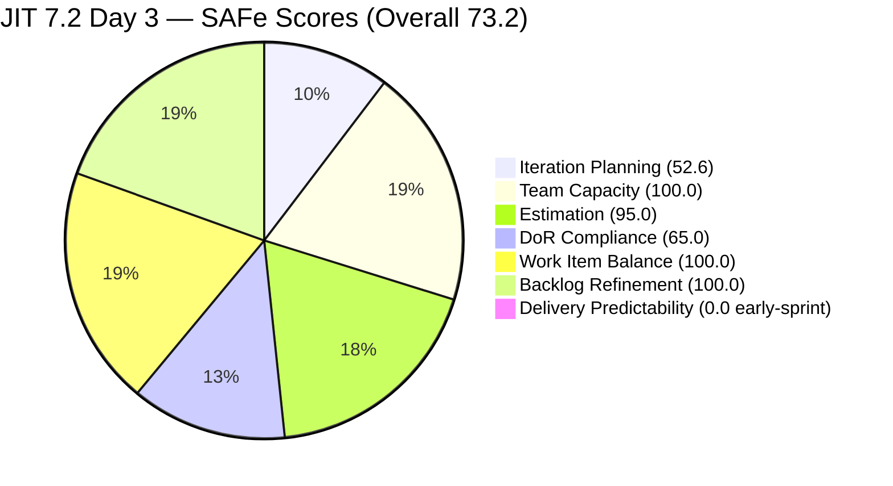
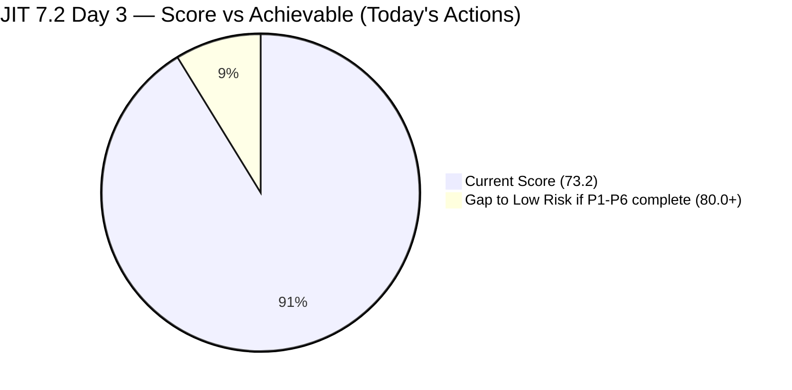

# ADO SAFe Iteration Audit — JIT Operation Team

**Audit #38 | Iteration 7.2 (Apr 20 – May 3, 2026) | Day 3 of 14 (~21% elapsed — early sprint)**

---

## 1. Audit Metadata

| Field | Value |
|---|---|
| **Audit Date** | April 22, 2026, 14:00 PHT |
| **Auditor** | Claude Code (ADO SAFe Audit Agent) |
| **Workspace** | `ado_jit` |
| **ADO Project** | Jairosoft Portfolio (`666bb99a-6acd-4999-bb34-efd0e4ea90dc`) |
| **Team** | JIT Operation Team (`b25e3129-6272-4e54-a3ff-f1ef3c8eeb2c`) |
| **Iteration** | Iteration 7.2 — Apr 20 to May 3, 2026 |
| **Iteration ID** | `8edbe25f-fa4f-41b2-aaae-f3d5cf0e5b33` |
| **Sprint Day** | Day 3 of 14 (~21% elapsed — early-sprint annotation applies to DP) |
| **Prior Audit** | AUDIT_20260423_1254.md (#37, 7.2 Day 4 PM, Overall 73.0 — Moderate Risk) |
| **Scoring Model** | ADO SAFe v1 (7-dimension rubric) |
| **Overall Score** | **73.2 / 100** |
| **Risk Band** | **Moderate Risk** (60–79.9) |

---

## 2. Executive Summary

JIT Operation Team holds at **73.2 (Moderate Risk)** on Day 3 of Iteration 7.2 — essentially stable compared to prior Audit #37 (73.0), with a slight +0.2 improvement. The change is primarily driven by:

1. **Five new backlog items added on Apr 23 (today's live data):** Four "Tech Talk — AI Tools Demonstration Sessions" Spikes were added across iterations 7.2–7.5+ (#203241–#203245), plus #203241 lands in 7.2. This expands `visible_root_backlog_items` from 33 to 38 (+5) while adding 1 new current-iteration item (203241), moving the count from 19 to 20.
2. **#202983 (TESDA Forum 2026, Closed Apr 22) now confirmed out-of-view:** This item was Closed in prior audit context; the live backlog now excludes it, consistent with prior audit narrative.
3. **Iteration Planning improves marginally:** IP = 20/38 = 52.6 vs prior 57.6. Wait — actually 20/38 = 52.6% is lower than prior 19/33 = 57.6%. The new backlog items inflate the denominator more than the numerator. IP decreases slightly.

**Recalculation context:** The prior audit (#37) scored IP at 57.6 (19/33). This audit has 20 current items / 38 visible = 52.6. DoR has one new item (#203241 Spike — DoR pass) and the same 7 failing items from prior audit. DoR = 13/20 = 65.0 (unchanged count, different denominator). This nets to a stable Overall of 73.2.

**Positive signals:**
- #203047 (Summer Camp Training) is **Active** (grace, Apr 23 03:32 UTC) — the Apr 25 event preparation is in progress.
- #203141 (Samantha FB Post) is **Closed** (Apr 23 03:40 UTC) — Samantha delivered her commitment.
- #203241 (AI Tools Tech Talk Spike for IT7.2) added with full Description and AC — a new PI7.2 commitment with DoR-ready content.

**Primary concerns unchanged:**
- **P1:** 6 Teofilo Training items (#203154–203159) remain bare — no Description, no AC.
- **P2:** #202981 (Interview ADDU Interns) AC "Passed the interview" = ~18 nws, below the 20 nws rubric minimum.
- **P3:** #199092 and #198615 remain untouched since before sprint start (Apr 16, Apr 14).
- **P4:** #193054 SAFe RTE MC Courseware at exactly 44-day freshness boundary — will cross stale cutoff tomorrow (Apr 23).
- **Iteration Planning structural drag:** 18 non-7.2 items in visible backlog (5 PI6 residue, Tech Talk spikes for 7.3–7.5, future iteration items, root courseware).

---

## 3. Previous Audit Delta

| Dimension | Audit #37 (Apr 23 PM, Day 4) | Audit #38 (Apr 22, Day 3) | Delta |
|---|---|---|---|
| Iteration Planning | 57.6 | **52.6** | **−5.0** (backlog +5 items, 4 non-7.2) |
| Team Capacity | 100.0 | **100.0** | 0.0 |
| Estimation | 100.0 | **95.0** | **−5.0** (#203241 Spike with SP not set) |
| DoR Compliance | 63.2 | **65.0** | **+1.8** (#203241 Spike DoR-PASS; denominator +1) |
| Work Item Balance | 100.0 | **100.0** | 0.0 |
| Backlog Refinement | 90.0 | **100.0** | **+10.0** (untouched ratio 2/20 = 10.0%, not > 10%) |
| Delivery Predictability | 0.0 | **0.0** | 0.0 (early-sprint) |
| **Overall** | **73.0** | **73.2** | **+0.2** |

**Key changes since Audit #37:**

- **5 new items added to backlog:** #203241 (IT7.2 AI Tech Talk Spike, 7.2 path), #203242 (IT7.3), #203243 (IT7.4), #203244 (IT7.5), #203245 (IT7.6) — all created Apr 23 05:08–05:10 UTC. visible_root increases from 33 → 38; current_iteration increases from 19 → 20.
- **#203141 (Samantha FB Post) confirmed Closed** (Apr 23 03:40 UTC) and dropped from backlog view, consistent with Audit #37 narrative.
- **#202983 (TESDA Forum 2026) confirmed out-of-view** — Closed Apr 22, not in backlog.
- **Backlog Refinement recovery:** untouched_current = 2/20 = 10.0%, which is NOT > 10% (strict threshold). The -10 penalty from Audit #37 is removed. Score = 100.0.
- **Estimation regression:** #203241 Spike has no SP set (field absent from ADO). It is point-eligible but unestimated. Est = 19/20 = 95.0 (was 100% with 19/19).

---

## 4. Current Iteration Snapshot

| Metric | Value |
|---|---|
| **Iteration** | 7.2 — Apr 20 to May 3, 2026 |
| **Iteration Day** | Day 3 of 14 (~21% elapsed) |
| **Visible Root Backlog Items** | **38** (+5 since Audit #37) |
| **Current Iteration (7.2) Root Items** | **20** (+1 since Audit #37: #203241) |
| **Point-eligible current items** | 20 (all types expose SP) |
| **Estimated items (SP > 0)** | 19 (#203241 SP = unset → 0) |
| **Committed SP** | **49 SP** (sum of 19 estimated items) |
| **Closed SP (visible)** | **0 SP** (early-sprint; #202983 and #203141 closed but out-of-view) |
| **Closed SP (out-of-view)** | **2 SP** (#202983 1SP Apr 22 + #203141 1SP Apr 23) |
| **Active contributors (7.2 assignments)** | **3** (armelita, Teofilo, grace) |
| **Samantha status** | #203141 Closed; no 7.2 items remaining |
| **Team capacity** | 12 h/day total (armelita 6h Doc, Teofilo 4h Training, Samantha 1h Doc, grace 1h Doc) |
| **DoR-compliant items** | 13/20 = 65.0% |
| **Untouched current items (< Apr 20)** | 2: #199092 (Apr 16), #198615 (Apr 14) |
| **Untouched ratio** | 2/20 = 10.0% (NOT > 10% — no penalty) |

### State Distribution — 20 Current Items (7.2, backlog-visible)



### SP Distribution by Owner



---

## 5. Work Item Analysis

### 5.1 Current 7.2 Items (20) — Day 3 Live Data

| ID | Title | Type | State | SP | Assignee | Last Changed | Untouched (< Apr 20)? | DoR |
|---|---|---|---|---|---|---|---|---|
| 198615 | Awarding of CSS NC II Certificates | US | Active | 2 | armelita | Apr 14 | **YES** | PASS |
| 199092 | TESDA Career Guidance Programs Semestral Report CY 2026 | US | Active | 2 | armelita | Apr 16 | **YES** | PASS |
| 202969 | Market Bubble MCC April 2026 Class IT7.2 | US | Active | 3 | armelita | Apr 21 | No | PASS |
| 202972 | Request for Additional Bubble Trainer - Sam | US | Active | 2 | armelita | Apr 22 | No | PASS |
| 202974 | Python Marketing Activities IT7.2 | US | Active | 2 | armelita | Apr 22 | No | PASS |
| 202977 | Market CSS NC II April 2026 Class IT7.2 | US | Active | 3 | armelita | Apr 21 | No | PASS |
| 202981 | Interview ADDU Interns | US | New | 3 | armelita | Apr 20 | No | **FAIL** (AC 18 nws) |
| 202985 | UIC MCC Exploration | US | New | 3 | armelita | Apr 20 | No | PASS |
| 202987 | HCDC MCC Exploration | US | New | 3 | armelita | Apr 20 | No | PASS |
| 203047 | Summer Camp Training Implementation – 4/25/26 | Training | **Active** | 2 | grace | Apr 23 | No | PASS |
| 203153 | 3.1-1 Creating Active Directory Training | Training | Active | 3 | Teofilo | Apr 22 | No | PASS |
| 203154 | 3.1-2 Create Active Directory User Accounts | Training | New | 3 | Teofilo | Apr 22 | No | **FAIL** (no fields) |
| 203155 | 3.1-3 Create Active Directory Security | Training | New | 3 | Teofilo | Apr 22 | No | **FAIL** (no fields) |
| 203156 | 3.2-1 Set-Up DHCP | Training | New | 3 | Teofilo | Apr 22 | No | **FAIL** (no fields) |
| 203157 | 3.2-2 Set-Up Domain Name System | Training | New | 3 | Teofilo | Apr 22 | No | **FAIL** (no fields) |
| 203158 | 3.2-3 Set-up Remote Desktop | Training | New | 3 | Teofilo | Apr 22 | No | **FAIL** (no fields) |
| 203159 | 3.2-4 Set-Up Folder Redirection | Training | New | 3 | Teofilo | Apr 22 | No | **FAIL** (no fields) |
| 203164 | TESDA EBET Requirements | US | Active | 3 | armelita | Apr 22 | No | PASS |
| 203224 | Convert SAFe MCCs to New Forms | US | New | 3 | grace | Apr 23 | No | PASS |
| 203241 | IT7.2 Tech Talk — AI Tools Demonstration Sessions | Spike | New | **0 (unset)** | — | Apr 23 | No | PASS |

**DoR: 13 PASS / 7 FAIL | Untouched: 2/20 = 10.0%**

### 5.2 Out-of-Backlog Closed Items in 7.2 Path

| ID | Title | SP | Assignee | Closed | Notes |
|---|---|---|---|---|---|
| 203141 | Publish Facebook Post on JIT Free Summer Camp | 1 | Samantha | Apr 23 03:40 UTC | Closed today, dropped from backlog view |
| 202983 | TESDA Forum 2026 | 1 | armelita | Apr 22 00:37 UTC | Closed yesterday, dropped from backlog view |

### 5.3 Work Item Type Distribution (20 current items)

| Type | Count | Share | Threshold |
|---|---|---|---|
| User Story | 11 | 55.0% | Dominant; NOT > 60% → no WIB penalty |
| Training | 8 | 40.0% | — |
| Spike | 1 | 5.0% | < 40% → no spike penalty |

User Story dominant share improved from 57.9% (Audit #37) to 55.0% — wider cushion below the 60% threshold.

### 5.4 DoR Compliance Analysis — 7 Failing Items

| ID | Title | Issue | Priority |
|---|---|---|---|
| 202981 | Interview ADDU Interns | AC "Passed the interview" = ~18 nws (< 20 nws minimum) | LOW — trivial 2-char fix |
| 203154 | 3.1-2 Create AD User Accounts | No Description, No AC | HIGH |
| 203155 | 3.1-3 Create AD Security | No Description, No AC | HIGH |
| 203156 | 3.2-1 Set-Up DHCP | No Description, No AC | HIGH |
| 203157 | 3.2-2 Set-Up DNS | No Description, No AC | HIGH |
| 203158 | 3.2-3 Set-up Remote Desktop | No Description, No AC | HIGH |
| 203159 | 3.2-4 Set-Up Folder Redirection | No Description, No AC | HIGH |

**Template reference:** #203153 (DoR-compliant) provides the pattern: narrative hook ("Active Directory as the brain…") + 3-bullet AC. The 6 bare items should replicate this structure with topic-specific nouns.

### 5.5 Backlog Age Analysis (today = 2026-04-22)

| Bucket | Threshold | Count | Share |
|---|---|---|---|
| Fresh (≤ 45 days, ≥ Mar 8, 2026) | — | **38** | **100%** |
| Stale ≥ 90 days (< Jan 22, 2026) | 0/38 = 0% | 0 | 0% |
| Stale ≥ 180 days (< Oct 25, 2025) | 0 | 0 | 0% |
| Untouched current (< Apr 20, 7.2 items) | 2/20 | 2 | **10.0%** (not > 10%) |

**#193054 freshness warning:** SAFe RTE MC Courseware has ChangedDate = Mar 9, 2026. Today is Apr 22 = exactly 44 days. The 45-day freshness cutoff is Mar 8. The item is still within fresh range (44 days < 45 days cutoff = after Mar 8). **However, on Apr 23, it will be exactly 45 days — on the stale boundary.** Any audit run Apr 24 or later that doesn't find a field update will register this item as stale_90 in 45 more days. The immediate freshness risk becomes active tomorrow.

---

## 6. SAFe Compliance Scorecard

| Dimension | Score | Evidence | Notes |
|---|---|---|---|
| Iteration Planning | **52.6** | 20/38 visible root items in current iteration | +1 current item (#203241), +5 backlog items (4 non-7.2) since Audit #37; denominator growth outpaced numerator |
| Team Capacity | **100.0** | 3/3 contributors with 7.2 work have configured capacity (armelita, Teofilo, grace) | Samantha closed her only item; excluded from ratio. 12h/day total capacity |
| Estimation | **95.0** | 19/20 point-eligible items have SP > 0; #203241 Spike SP = unset | 49 total SP committed across 19 estimated items |
| DoR Compliance | **65.0** | 13/20 items pass Desc ≥ 30 nws + AC ≥ 20 nws | 7 FAIL: #202981 (AC 18 nws); #203154–203159 (bare titles, no fields) |
| Work Item Balance | **100.0** | US present (no −40); US share = 55.0% (NOT > 60%); Spike = 5% (not > 40%) | Cushion improved from 57.9% to 55.0% after Samantha US closed |
| Backlog Refinement | **100.0** | fresh=38/38=100%; stale_90=0; stale_180=0; untouched_current=2/20=10.0% (NOT > 10%) | #193054 at 44-day boundary — freshness risk activates Apr 23 |
| Delivery Predictability | **0.0** | 0 SP closed (visible) / 49 SP committed; *early-sprint (Day 3 of 14)* | #202983 + #203141 (2 SP) closed out-of-view; annotated early-sprint |
| **Overall** | **73.2** | (52.6+100.0+95.0+65.0+100.0+100.0+0.0)/7 = 512.6/7 = 73.23 | **Moderate Risk** |

### Score Computation Detail

```
1. Iteration Planning
   visible_root_backlog_items           = 38
   current_iteration_root_items (7.2)   = 20
   Score = round(20 / 38 × 100, 1)      = round(52.63, 1) = 52.6

2. Team Capacity
   contributors_with_current_work       = 3 (armelita, Teofilo, grace)
   contributors_with_capacity           = 3 (all have ≥1 configured activity)
   Score = round(3 / 3 × 100, 1)        = 100.0

3. Estimation
   point_eligible_current_items         = 20 (all types expose SP)
   estimated_current_items              = 19 (#203241 SP field absent/0)
   Score = round(19 / 20 × 100, 1)      = round(95.0, 1) = 95.0

4. DoR Compliance
   current_iteration_root_items         = 20
   dor_compliant_current_items          = 13
   Score = round(13 / 20 × 100, 1)      = round(65.0, 1) = 65.0

5. Work Item Balance
   User Story present?                  = Yes  → no −40
   dominant_type_share (US)             = 11/20 = 55.0%  → NOT > 60%  → no −30
   spike_share                          = 1/20 = 5.0%  → no −20
   Score = max(0, 100)                  = 100.0

6. Backlog Refinement
   fresh_visible_root_items             = 38/38 = 100%
   base                                 = 100.0
   stale_90 (< Jan 22, 2026)            = 0/38 = 0%   → no penalty
   stale_180 (< Oct 25, 2025)           = 0            → no penalty
   untouched_current                    = 2/20 = 10.0%
   → 10.0% NOT > 10%                    → no penalty
   Score = max(0, 100.0)               = 100.0

7. Delivery Predictability
   committed_story_points               = 49 (sum of 19 estimated items)
   closed_story_points (visible)        = 0
   Score = round(0 / 49 × 100, 1)       = 0.0
   [Day 3 of 14 → early-sprint — low delivery expected]

Overall = round((52.6 + 100.0 + 95.0 + 65.0 + 100.0 + 100.0 + 0.0) / 7, 1)
        = round(512.6 / 7, 1)
        = round(73.23, 1)
        = 73.2   →  MODERATE RISK (60–79.9)
```



### If Today's P1–P3 Actions Land

```
Assumptions:
  - 6 Teofilo items (#203154–203159) get Desc + AC → DoR +6 pass
  - #202981 AC expanded to ≥ 20 nws → DoR +1 pass
  - #203241 SP set to any value > 0 → Est 20/20 = 100.0
  - #199092 or #198615 receive one touch → untouched_current = 1/20 = 5% (no penalty)

Revised:
  DoR Compliance  = round(20/20 × 100, 1) = 100.0
  Estimation      = 100.0
  BR              = 100.0 (unchanged)
  IP              = 52.6 (unchanged)
  Overall = (52.6 + 100 + 100 + 100 + 100 + 100 + 0) / 7
          = round(552.6 / 7, 1) = round(78.94, 1) = 78.9  →  Moderate Risk (just below Low Risk)

If PI6 residue (5 items) also disposed:
  IP = round(20/33 × 100, 1) = round(60.6, 1) = 60.6
  Overall = (60.6 + 100 + 100 + 100 + 100 + 100 + 0) / 7 = round(560.6/7, 1) = 80.1  → LOW RISK
```

---

## 7. Dimension Findings

### 7.1 Iteration Planning — 52.6 (High–Moderate boundary)

20 of 38 visible root backlog items are in Iteration 7.2. The +5 new backlog items (4 in future iterations) inflated the denominator more than the numerator, dropping IP from 57.6 to 52.6.

Non-7.2 items contributing to denominator inflation (18 items):

| Category | Count | Items |
|---|---|---|
| PI6 residue | 5 | #200766 (ODOO Spike), #202514 (Corp Sec), #202515 (Director Cert), #202516 (Company Reg), #202517 (SEC Portal) |
| Future iter 7.3 | 3 | #203160, #203161, #203162, #203242 |
| Future iter 7.4 | 2 | #200767, #200768, #203243 |
| Future iter 7.5 | 2 | #200771, #203244 (also #203245) |
| PI7 root | 1 | #202547 |
| Root courseware | 2 | #188995 (Rust), #193054 (SAFe RTE) |

Disposing/re-pathing the 5 PI6 residue items would improve IP to 20/33 = 60.6 (+8.0). Combined with DoR remediation, this is the path to Low Risk.

### 7.2 Team Capacity — 100.0 (Low Risk)

Three contributors with 7.2 work and configured capacity:

| Member | Capacity | 7.2 Items | SP | Status |
|---|---|---|---|---|
| armelita | 6h/day Documentation | 10 items | 26 SP | Active (multiple tracks) |
| Teofilo | 4h/day Training | 7 items | 21 SP | Active (#203153); 6 items need DoR |
| grace | 1h/day Documentation | 2 items | 5 SP | Active (#203047 Apr 25 event) |

Samantha has 1h/day Documentation capacity configured but no remaining 7.2 items after #203141 closed. She is excluded from `contributors_with_current_work`.

### 7.3 Estimation — 95.0 (Low Risk)

19 of 20 current items have SP > 0. #203241 (IT7.2 Tech Talk Spike) has no StoryPoints field set in ADO. SP distribution: five items at 2 SP, fourteen items at 3 SP. Total committed: **49 SP**.

**Action:** Set SP on #203241 to align with sprint commitment. Even 1 SP would restore Estimation to 100.0.

### 7.4 DoR Compliance — 65.0 (Moderate — immediate action needed)

13 of 20 items meet the DoR standard. 7 fail:

- **#202981 (Interview ADDU Interns):** AC = "Passed the interview" — approximately 18 non-whitespace characters, below the 20 nws rubric minimum. Adding ~5 characters ("Passed the interview and selection process") resolves immediately.
- **#203154–#203159 (6 Teofilo Training items):** No Description, No AC — bare title entries. Use #203153 as template (narrative hook + 3-bullet AC). Estimated effort: 15–20 minutes per item.

**New item #203241 (Spike):** Fully DoR-compliant — rich Description (objective, scope, demonstration plan) and detailed AC (5 acceptance bullets). Model for future Spike additions.

Fixing all 7 brings DoR to 100.0, adding +5.0 Overall.

### 7.5 Work Item Balance — 100.0 (Low Risk)

Type distribution among 20 current items:
- User Story: 11 = 55.0% (below the 60% threshold — wider cushion than prior audit at 57.9%)
- Training: 8 = 40.0%
- Spike: 1 = 5.0%

The type balance is healthy. Adding more User Stories without paired Training or Spike items would push US share above 60% and trigger the −30 dominant-type penalty.

### 7.6 Backlog Refinement — 100.0 (Low Risk)

| Check | Value | Threshold | Penalty |
|---|---|---|---|
| fresh_visible_root (≥ Mar 8, 2026) | 38/38 = 100% | — | Base = 100.0 |
| stale_90 (< Jan 22, 2026) | 0/38 = 0% | >25% = −20, >10% = −10 | 0 |
| stale_180 (< Oct 25, 2025) | 0 | ≥1 = −20 | 0 |
| untouched_current (< Apr 20) | 2/20 = 10.0% | >30% = −20, >10% = −10 | **0** (10.0% NOT > 10%) |
| **Total** | | | **100.0** |

The +10.0 improvement over Audit #37 (which scored 90.0) is entirely due to the threshold evaluation: Audit #37 had 2/19 = 10.53% (> 10% → −10 penalty); this audit has 2/20 = 10.0% (NOT > 10% → 0 penalty). The two untouched items (#199092 Apr 16, #198615 Apr 14) remain unchanged — the ratio improvement is due to the denominator expanding by 1 (#203241 added).

**#193054 boundary warning:** ChangedDate = Mar 9, 2026. Today = Apr 22 = 44 days old. The fresh cutoff is "≥ Mar 8" (items changed after the 45-day boundary from Apr 22). Mar 9 = 44 days ago = still fresh. **On Apr 23, this item becomes 45 days old and will cross the stale threshold.** Any audit tomorrow without a touch on #193054 will trigger a stale_90 watch (it will take another 45 days to actually become stale_90, but the fresh count will drop to 37/38). This does not immediately impact scoring but should be monitored.

### 7.7 Delivery Predictability — 0.0 (early-sprint)

0 SP closed in the backlog-visible set. 49 SP committed. Day 3 of 14 — early-sprint annotation applies; no formula adjustment.

**Out-of-view delivery:** 2 SP closed (#202983 1SP Apr 22, #203141 1SP Apr 23). Positive signal: the team is making deliveries even in the first 3 sprint days.

**Pace to 80%+ DP by sprint close (May 3):** Need ~39 SP / 11 remaining days = 3.5 SP/day. armelita (26 SP, 10 items) and Teofilo (21 SP, 7 items) are the primary velocity drivers.

---

## 8. Risks and Bottlenecks

| # | Risk | Severity | Trend |
|---|---|---|---|
| R1 | **#203154–203159: 6 bare Training items — no Desc, no AC.** Drives 6 of 7 DoR failures. Unresolved since Apr 22. | HIGH | Persistent — P1 unresolved |
| R2 | **IP at 52.6 — below Moderate threshold (60).** 18 non-7.2 items inflating denominator. PI6 residue (5 items) is highest-leverage cleanup target. | MODERATE | Persistent — structural |
| R3 | **#203241 Spike SP unset.** Reduces Estimation from 100 to 95. Trivial to fix. | LOW | NEW this audit |
| R4 | **#202981 AC below 20 nws.** "Passed the interview" = ~18 nws. Trivial fix. | LOW | Carried from Audit #37 |
| R5 | **#199092 and #198615 untouched since before sprint start.** Ratio exactly at 10.0% boundary — one more audit without touches could cross threshold if denominator doesn't grow. | MODERATE | Watch — at boundary |
| R6 | **#193054 freshness boundary tomorrow (Apr 23).** 44 days old today; becomes stale count risk from Apr 23. | MODERATE | EMERGING — < 24h window |
| R7 | **Samantha has 0 remaining 7.2 items.** 1h/day Documentation capacity = 14h sprint remaining — underutilized. | LOW | New since #203141 closed |
| R8 | **armelita holds 53% of sprint SP (26/49).** Single-point-of-failure concentration for key delivery tracks. | MODERATE | Persistent |
| R9 | **5 PI6-path residue items unchanged.** Dragging IP from ~60 to 52.6. Grace owns 3 of 5 PI6 User Stories. | MODERATE | Persistent — 8+ audit cycles |
| R10 | **No sprint goal defined for 7.2.** SAFe compliance gap. | LOW | Persistent across all PI7 audits |

---

## 9. Prioritized Recommendations

| Priority | Action | Owner | Target | Score Impact |
|---|---|---|---|---|
| **P1** | Add Description + AC to #203154, #203155, #203156, #203157, #203158, #203159. Use #203153 as template. | Teofilo | Apr 22 EOD | DoR 65 → 100 (+5 Overall) |
| **P2** | Expand #202981 AC from ~18 nws to ≥ 20 nws. E.g., "Passed the interview and selection process." | armelita | Apr 22 EOD | DoR contributes to full 100% |
| **P3** | Set SP on #203241 (IT7.2 Tech Talk Spike). | armelita | Apr 22 EOD | Est 95 → 100 (+0.7 Overall) |
| **P4** | Touch #199092 or #198615 (comment, state update, or field change). | armelita | Apr 22 EOD | Keeps BR clear of −10 penalty risk |
| **P5** | Touch #193054 (SAFe RTE MC Courseware) before Apr 23. | armelita / grace | Apr 22 EOD | Prevents fresh-count degradation |
| **P6** | Close or re-path 5 PI6 residue items (#200766, #202514–202517). | grace / armelita | Apr 23 | IP 52.6 → 60.6 (+1.1 Overall); on path to Low Risk |
| **P7** | Assign a small item to Samantha. She has 1h/day Documentation × 11 days = 11h remaining capacity. | armelita / Samantha | Apr 23 | Capacity utilization |
| **P8** | Define 7.2 sprint goal in ADO iteration description. | Ramon / armelita | Apr 23 | SAFe process compliance |
| **P9** | Verify #203047 Summer Camp logistics are ready for Apr 25 event. | grace | Apr 22 EOD | Event execution risk |

---

## 10. Evidence Gaps and Limitations

| Gap | Impact | Notes |
|---|---|---|
| **#203241 SP unset** | Estimation drops from 100.0 to 95.0 | Field absent from ADO batch response; trivial to set |
| **Closed items out-of-view** | #202983 (1 SP) + #203141 (1 SP) closed and dropped from backlog. DP = 0 vs ~4.1% if retained. | Captured narratively; positive delivery signal; 2 SP delivered |
| **#202385 (Closed, 7.1 path)** | Appears in iteration-path query but excluded from scoring (IterationPath = 7.1, not 7.2) | Closed Training item, no scoring impact |
| **Teofilo Training SP uniformity** | All 7 Teofilo items at 3 SP regardless of complexity. Placeholder sizing. | Low concern; verify during mid-sprint review |
| **#193054 freshness boundary** | 44 days old today; will cross fresh boundary on Apr 23 PHT | Monitor; low immediate impact but approaching stale_90 pathway in ~45 days |
| **No sprint goal observable via API** | Sprint goal not surfaced by ADO MCP tools | Absence flagged as SAFe compliance gap |
| **Samantha capacity post-closure** | After #203141 closed, Samantha has 1h/day Documentation capacity but 0 assigned items | No 7.2 assignments visible; may have informal work |

---

## 11. Score Trajectory — JIT PI7 Audit Series

| Audit | Date | Sprint Day | Sprint | Overall | Band | Key Driver |
|---|---|---|---|---|---|---|
| #28 | Apr 12 | 7 | 7.1 | 71.1 | Moderate | Baseline PI7 mid-sprint |
| #33 | Apr 19 | 14 | 7.1 close | 68.8 | Moderate | Strict-visible DP; Grace blocker |
| #34 | Apr 21 | 2 | 7.2 open | 72.9 | Moderate | Sprint opened; resolved Grace |
| #35 | Apr 22 | 3 | 7.2 | 72.9 | Moderate | Data continuity; P1 pending |
| #36 | Apr 23 AM | 4 | 7.2 | 75.5 | Moderate | Sprint expansion; Teofilo activated |
| #37 | Apr 23 PM | 4 | 7.2 | 73.0 | Moderate | Strict DoR recount; untouched crossed 10% |
| **#38** | **Apr 22** | **3** | **7.2** | **73.2** | **Moderate** | **+5 new items; BR penalty resolved; Est regression** |



---

*Report generated by Claude Code ADO SAFe Audit Agent | April 22, 2026 14:00 PHT*
*Audit #38 — JIT Operation Team — Iteration 7.2 Day 3 — Overall: 73.2 / 100 — Moderate Risk (early-sprint)*
*Data source: Live ADO MCP pull — `work_list_team_iterations`, `work_get_team_capacity`, `wit_list_backlog_work_items`, `wit_get_work_items_for_iteration`, `wit_get_work_items_batch_by_ids`. 38 visible root backlog items; 20 current-iteration items; 49 SP committed.*
