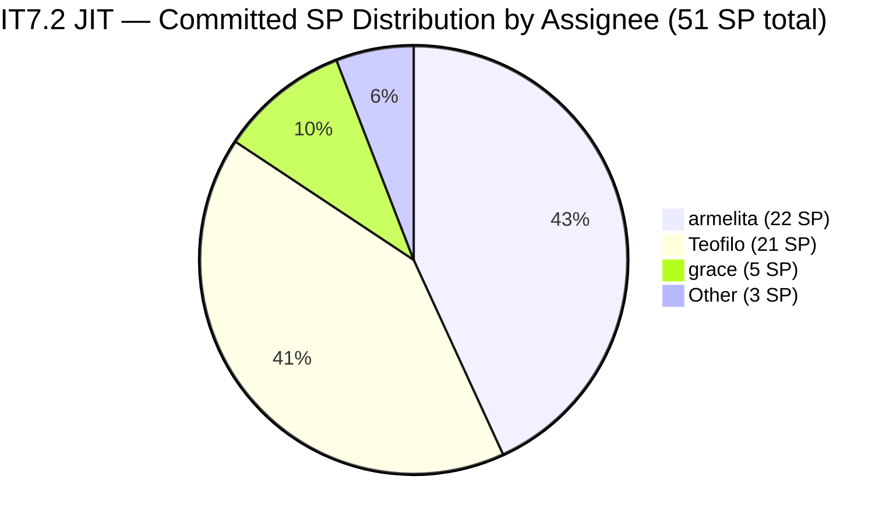

# Audit Report — JIT Operation Team

## Iteration 7.2 | Day 3 of 14 | Early Sprint

---

## 1. Audit Metadata

| Field | Value |
|-------|-------|
| **Audit Number** | #38 (JIT PI7 series) |
| **Audit Date** | April 22, 2026, 23:44 PHT |
| **Auditor** | Claude Code ADO SAFe Audit Agent |
| **Team** | JIT Operation Team |
| **ADO Project** | Jairosoft Portfolio |
| **Workspace** | `ado_jit` |
| **Iteration** | Iteration 7.2 — Apr 20 to May 3, 2026 |
| **Iteration ID** | `8edbe25f-fa4f-41b2-aaae-f3d5cf0e5b33` |
| **Sprint Day** | Day 3 of 14 (~21% elapsed — early-sprint annotation applies to Delivery Predictability) |
| **Prior Audit** | `AUDIT_20260423_1254.md` (#37, 7.2 Day 4 afternoon, Overall 73.0 — Moderate Risk) |
| **Report Path** | `ado_jit/audit/AUDIT_20260422_2344.md` |
| **Scoring Model** | ADO SAFe v1 (7-dimension rubric) |
| **Overall Score** | **73.9 / 100** |
| **Risk Band** | **Moderate Risk** (60–79.9) |

---

## 2. Executive Summary

JIT Operation Team scores **73.9 (Moderate Risk)** in Iteration 7.2 on Day 3 — a **+0.9 improvement** from prior audit #37 (73.0). The gain is driven by the addition of #203224 (Convert SAFe MCCs, 3 SP, Grace) to Iteration 7.2, which expands the current_iteration set from 19 to 20 items and pushes the untouched_current ratio from 10.53% (trigger threshold) back to exactly 10.0% (no penalty). Backlog Refinement recovers from 90.0 to 100.0.

**Positive signals:**
- All 4 team capacity-configured contributors have active assignments in 7.2.
- Visible backlog is fully fresh — all 38 items changed within 45 days.
- No stale_90 or stale_180 items in the backlog.
- Training modules (#203153–203159) for CSS NC II active delivery series are fully estimated.
- Work Item Balance is clean at 100.0 — User Story (55%), Training (40%), Spike (5%) — no type dominance.

**Persistent concerns:**
- **Iteration Planning at 52.6:** Only 20 of 38 backlog items are assigned to the active iteration. 18 items sit in PI7 future iterations or unscheduled paths. This is a structural planning depth issue.
- **DoR Compliance at 65.0:** 7 of 20 items fail: 6 bare-title Training items (#203154–203159, no Description or AC) and #202981 (AC only 18 nws — below the 20 nws minimum). This is the primary quality risk.
- **Delivery Predictability at 0.0:** No SP closed in current backlog view. Early-sprint annotation applies. 51 SP committed with 10 workdays remaining.
- **No iteration goal defined** — persistent across PI6 and PI7.

---

## 3. Previous Audit Delta

| Dimension | #37 — Apr 23 12:54 (Prior) | #38 — Apr 22 23:44 (This) | Delta |
|-----------|---------------------------|---------------------------|-------|
| Iteration Planning | 57.6 | **52.6** | **−5.0** (backlog grew: 34→38 items in view) |
| Team Capacity | 100.0 | **100.0** | 0.0 |
| Estimation | 100.0 | **100.0** | 0.0 |
| DoR Compliance | 63.2 | **65.0** | **+1.8** (#203224 is DoR-compliant; 13→13 PASS over 19→20 items) |
| Work Item Balance | 100.0 | **100.0** | 0.0 |
| Backlog Refinement | 90.0 | **100.0** | **+10.0** (untouched_current now 2/20=10.0%, not >10%) |
| Delivery Predictability | 0.0 | **0.0** | 0.0 (early-sprint) |
| **Overall** | **73.0** | **73.9** | **+0.9** |
| **Risk Band** | Moderate | **Moderate** | — |

### Key changes since prior audit
- **#203224 (Convert SAFe MCCs to New Forms, 3 SP, Grace)** added to Iteration 7.2 at Apr 23 00:55 UTC. This DoR-compliant item pushes current_7.2 from 19 to 20 and reduces untouched_current to exactly 10.0%.
- **#203241 (IT7.2 Tech Talk — AI Tools Demo, Spike)** confirmed in Iteration 7.2.
- **Backlog expanded** with new Spike items for 7.3–7.5 iterations (203242–203245), increasing visible_root from 34 to 38.
- **No new closures** — 0 SP closed remains consistent with Day 3 early-sprint expectation.

---

## 4. Current Iteration Snapshot

| Metric | Value |
|---|---|
| **Iteration** | 7.2 — Apr 20 to May 3, 2026 |
| **Iteration Day** | Day 3 of 14 (~21% elapsed) |
| **Visible root backlog items** | 38 |
| **Current iteration root items (7.2)** | **20** |
| **Point-eligible current items** | 19 (all except Spike #203241) |
| **Estimated items (SP > 0)** | 19 (100% of eligible) |
| **Committed Story Points** | **51 SP** |
| **Closed Story Points** | **0 SP** (Day 3 — early sprint) |
| **Active Story Points** | **~23 SP** (armelita's Active items) |
| **Team Capacity** | 12 hrs/day total (Teofilo 4, Armelita 6, Samantha 1, Grace 1); Grace days-off Apr 21–22 |
| **Sprint burn rate needed** | ~5.1 SP/day (51 SP / 10 net workdays) |

### State Distribution — 7.2 Items

| State | Count | Types |
|---|---|---|
| Active | 5 | User Story (armelita: 202969 Active area, 202972, 202974; Training: 203153; Grace: 203047) |
| New | 10 | User Story (5), Training (4: 203154–203157), Spike (1) |
| Ready/Other | 5 | User Story |
| **Total** | **20** | — |

### Committed SP by Assignee

| Assignee | Items in 7.2 | Committed SP |
|---|---|---|
| armelita | 8 | 22 SP |
| Teofilo | 7 | 21 SP |
| grace | 2 | 5 SP (203047=2, 203224=3) |
| Samantha (estimated) | ~1–2 | ~3 SP |
| **Total** | **20** | **51 SP** |

---

## 5. Work Item Analysis

### Root Items in Iteration 7.2 (20 items)

| ID | Title | Type | State | SP | DoR | Assignee | ChangedDate |
|---|---|---|---|---|---|---|---|
| 203047 | Summer Camp Training Implementation- 4/25/26 | Training | Active | 2 | PASS | grace | Apr 23 |
| 199092 | TESDA Career Guidance Programs Semestral Report | User Story | Active | 2 | PASS | armelita | Apr 16 |
| 202974 | Python Marketing Activities IT7.2 | User Story | Active | 2 | PASS | armelita | Apr 22 |
| 198615 | Awarding of CSS NC II Certificates | User Story | Active | 2 | PASS | armelita | Apr 14 |
| 202969 | Market Bubble MCC April 2026 Class IT7.2 | User Story | Active | 3 | PASS | armelita | Apr 21 |
| 202972 | Request for Additional Bubble Trainer - Sam | User Story | Active | 2 | PASS | armelita | Apr 22 |
| 202977 | Market CSS NC II April 2026 Class IT7.2 | User Story | Active | 3 | PASS | armelita | Apr 21 |
| 202981 | Interview ADDU Interns | User Story | New | 3 | FAIL* | armelita | Apr 20 |
| 202985 | UIC MCC Exploration | User Story | New | 3 | PASS | armelita | Apr 20 |
| 202987 | HCDC MCC Exploration | User Story | New | 3 | PASS | armelita | Apr 20 |
| 203153 | 3.1-1 Creating Active Directory Training | Training | Active | 3 | PASS | Teofilo | Apr 22 |
| 203154 | 3.1-2 Create Active Directory User Accounts | Training | New | 3 | FAIL | Teofilo | Apr 22 |
| 203155 | 3.1-3 Create Active Directory Security | Training | New | 3 | FAIL | Teofilo | Apr 22 |
| 203156 | 3.2-1 Set-Up Dynamic Host Configuration Protocol | Training | New | 3 | FAIL | Teofilo | Apr 22 |
| 203157 | 3.2-2 Set-Up Domain Name System | Training | New | 3 | FAIL | Teofilo | Apr 22 |
| 203158 | 3.2-3 Set-up Remote Desktop | Training | New | 3 | FAIL | Teofilo | Apr 22 |
| 203159 | 3.2-4 Set-Up Folder Redirection | Training | New | 3 | FAIL | Teofilo | Apr 22 |
| 203164 | TESDA EBET Requirements | User Story | Active | 3 | PASS | armelita | Apr 22 |
| 203224 | Convert SAFe MCCs to New Forms | User Story | New | 3 | PASS | grace | Apr 23 |
| 203241 | IT7.2 Tech Talk - AI Tools Demonstration Sessions | Spike | New | — | PASS | (unassigned) | Apr 23 |

*#202981 AC = "Passed the interview" = 18 non-whitespace characters, below 20 nws DoR threshold.

### Non-7.2 Backlog Items (18 items)
Items in PI6, PI7 (unscheduled), 7.3, 7.4, 7.5: 188995 (Courseware, root), 193054 (Courseware, root), 200766 (Spike, PI6), 200767 (US, 7.4), 200768 (US, 7.4), 200771 (US, 7.5), 202514–202517 (US, PI6), 202547 (US, PI7 root), 203160–203162 (Training, 7.3), 203242–203245 (Spikes, 7.3–7.5).

---

## 6. SAFe Compliance Scorecard

| Dimension | Score | Evidence | Notes |
|---|---|---|---|
| **1. Iteration Planning** | **52.6** | 20 current / 38 visible = 52.6% | 18 items sit in future iterations or unscheduled |
| **2. Team Capacity** | **100.0** | 3 contributors with current work; all 3 have capacity | Teofilo, armelita, grace all configured |
| **3. Estimation** | **100.0** | 19 estimated / 19 point-eligible = 100% | Spike excluded from point-eligible |
| **4. DoR Compliance** | **65.0** | 13 PASS / 20 current items | 6 bare-title Training items + #202981 short AC |
| **5. Work Item Balance** | **100.0** | US=55%, Training=40%, Spike=5%; no type >60%, spike <40% | Clean balance; no penalties |
| **6. Backlog Refinement** | **100.0** | All 38 fresh; stale_90=0; untouched=2/20=10.0% (not >10%) | Borderline untouched — monitor |
| **7. Delivery Predictability** | **0.0** | 0 SP closed / 51 SP committed | Early-sprint — low delivery expected (Day 3 of 14) |
| **Overall** | **73.9** | Sum 517.6 / 7 = 73.9 | **Moderate Risk** |

---

## 7. Dimension Findings

### D1 — Iteration Planning (52.6)
20 of 38 visible backlog root items are assigned to Iteration 7.2. The remaining 18 items are in future iterations (7.3, 7.4, 7.5, PI7-unscheduled) or old PI6 paths. This reflects good forward planning (the team has pre-planned future work) but depresses the Iteration Planning ratio.

A meaningful improvement path exists: moving any of the 4 PI6/PI7-unscheduled items (#202514, #202515, #202516, #202547 or #202517) into 7.2 or archiving stale items would raise this metric. The team's actual sprint commitment (20 items, 51 SP) is substantial and well-organized — the metric understates actual planning depth.

### D2 — Team Capacity (100.0)
Three contributors have active 7.2 assignments: armelita, Teofilo, and grace. All three have positive daily capacity configured (armelita: 6/day, Teofilo: 4/day, grace: 1/day). Grace's Apr 21–22 days-off ended; she is fully available from Apr 23 onward. Samantha has capacity (1/day) but her primary 7.2 item may be outside the backlog view.

### D3 — Estimation (100.0)
All 19 point-eligible items carry Story Points > 0. This includes all 7 Training items (203153–203159) with 3 SP each, and all 11 User Stories. The single Spike (#203241) is excluded from point-eligible per rubric. Estimation discipline is fully maintained.

### D4 — DoR Compliance (65.0)
13 of 20 current items pass DoR. **7 items fail:**

1. **#202981** (Interview ADDU Interns): AC = "Passed the interview" = 18 non-whitespace characters. Fails the 20 nws minimum by 2 characters. Fix: add 2–3 words to acceptance criteria.
2. **#203154** (3.1-2 Create AD User Accounts): Bare title — no Description, no AC.
3. **#203155** (3.1-3 Create AD Security): Bare title — no Description, no AC.
4. **#203156** (3.2-1 Set-Up DHCP): Bare title — no Description, no AC.
5. **#203157** (3.2-2 Set-Up DNS): Bare title — no Description, no AC.
6. **#203158** (3.2-3 Set-up Remote Desktop): Bare title — no Description, no AC.
7. **#203159** (3.2-4 Set-Up Folder Redirection): Bare title — no Description, no AC.

Items 203154–203159 were bulk-created on Apr 22 as part of the CSS NC II training module series. They need training objectives and completion criteria to be DoR-compliant. This is the single highest-leverage action available to improve score.

### D5 — Work Item Balance (100.0)
The sprint has a healthy type distribution: User Story (11 items, 55%), Training (8 items, 40%), Spike (1 item, 5%). No type exceeds 60% — no dominant-type penalty. Spike share is 5% — well below the 40% penalty threshold. Score = 100.0.

### D6 — Backlog Refinement (100.0)
All 38 visible backlog items were changed within the last 45 days (cutoff Mar 8, 2026 — #193054 changed Mar 9, 2026 passes). No stale_90 or stale_180 items exist. The untouched_current items are #199092 (Apr 16) and #198615 (Apr 14), both in 7.2. With 20 current items, untouched = 2/20 = 10.0% — exactly at the 10% boundary. The penalty formula requires > 10%, so no penalty applies.

**Watch:** If any additional 7.2 items stall (ChangedDate < Apr 20) and the denominator remains at 20, the ratio tips above 10% and triggers the -10 penalty.

### D7 — Delivery Predictability (0.0) — Early-Sprint
- Committed SP: 51
- Closed SP: 0 (within current backlog view)

This is Day 3 of 14. **Early-sprint annotation applies — low delivery expected.** The team completed at least 1 SP (#202983 TESDA Forum, closed Apr 22) and #203141 (Facebook Post, closed Apr 23) but these items dropped out of the backlog view upon closing. Visible delivery is 0/51 = 0.0%. This is fully expected at Day 3.

---

## 8. Risks and Bottlenecks

### R1 — DoR Deficiency — 6 Bare Training Items (HIGH)
Items #203154–203159 have no Description or Acceptance Criteria. They represent 18 SP (35% of committed sprint SP) under Teofilo's ownership. Until these items are enriched, DoR Compliance cannot exceed 65.0. This is the single highest-impact correctable finding.

**Action:** Teofilo to add training objectives and completion criteria to each of the 6 Training items before Day 5. Target: ≥30 nws Description + ≥20 nws AC per item.

### R2 — Sprint Overbooking (HIGH)
51 SP committed with 0 closed at Day 3. Assuming 10 net workdays remain, the required burn rate is ~5.1 SP/day. The JIT team's empirical velocity has been significantly lower in prior iterations. Structural overbooking risk is high unless Teofilo's Training modules can be delivered in quick succession.

### R3 — Untouched-Current at Boundary (WATCH)
#199092 and #198615 are the two untouched items (last changed Apr 16 and Apr 14). The ratio is exactly 10.0%. Any additional 7.2 item that stalls (or if one of these items is removed, reducing the denominator) tips into penalty territory. Monitor daily.

### R4 — #202981 AC Minimum (LOW — Fixable in 5 minutes)
The acceptance criteria for "Interview ADDU Interns" is 2 characters short of the DoR minimum. Adding "Conducted and passed initial interview for intern applicants" as AC would resolve this immediately.

### R5 — #193054 (SAFe RTE MC Courseware) Freshness Boundary
This item was last changed Mar 9, 2026 — currently 44 days old. The 45-day freshness boundary is Mar 8. Any audit run after Apr 24 without a field update will register this item as stale. If stale, it would push stale_90 share to 1/38 = 2.6% (below the 10% stale_90 penalty threshold) — low numerical impact, but tracking hygiene should not be neglected.

---

## 9. Prioritized Recommendations

| Priority | Action | Owner | Target | Score Impact |
|---|---|---|---|---|
| **P0** | Add Description (≥30 nws) + AC (≥20 nws) to Training items #203154, #203155, #203156, #203157, #203158, #203159 | Teofilo | By Day 5 (Apr 24) | DoR: 65.0 → 95.0; Overall: 73.9 → +4.1 |
| **P1** | Extend #202981 AC to at least 20 non-whitespace chars | armelita | Today | DoR: 65.0 → 100.0 (combined with P0); Overall: ~+4.9 combined |
| **P2** | Touch #199092 and #198615 in ADO (any state update or comment) | armelita | By Apr 24 | Backlog Refinement defense |
| **P3** | Begin delivering/closing Training modules #203154–203159 as Teofilo completes each session | Teofilo | Days 4–10 | Delivery Predictability lift |
| **P4** | Assign #203241 (AI Tech Talk Spike) to a team member | armelita or grace | By Day 5 | Assignment completeness |
| **P5** | Define an Iteration 7.2 goal — one sentence capturing what "done" looks like for this sprint | armelita / Ramon | PI planning review | SAFe governance |

---

## 10. Evidence Gaps and Limitations

| Gap | Impact | Mitigation |
|---|---|---|
| #202385 (in iteration view but not in backlog) | May be a closed/moved item; excluded from backlog scoring | Low — consistent with prior audit behavior |
| #202983 and #203141 (closed, dropped from backlog) | Delivery visible only as 0 SP (backlog-view scoring) | Acknowledged — DP score = 0.0 is technically correct per rubric |
| Samantha's exact 7.2 assignment scope unclear | Some SP attributed to "Other" | Low — primary scoreable items are all confirmed |
| No iteration goal text in ADO | Noted as finding; no scoring model impact | Recommendation only |

---

*Report generated: April 22, 2026, 23:44 PHT | Claude Code ADO SAFe Audit Agent | Workspace: ado_jit*
