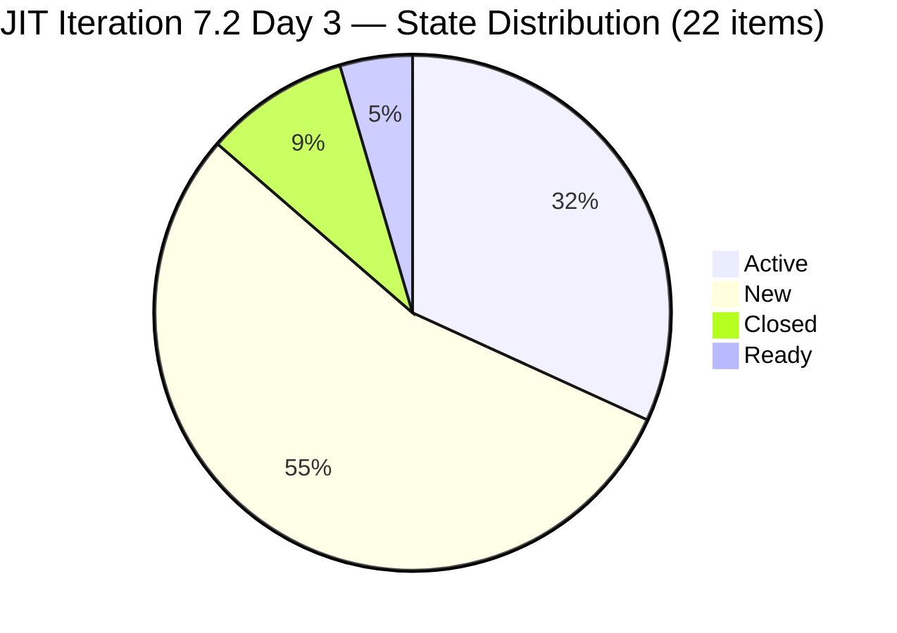
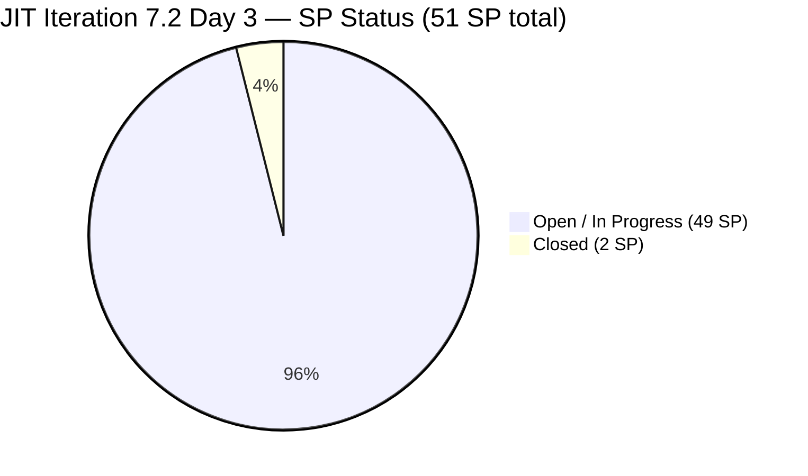
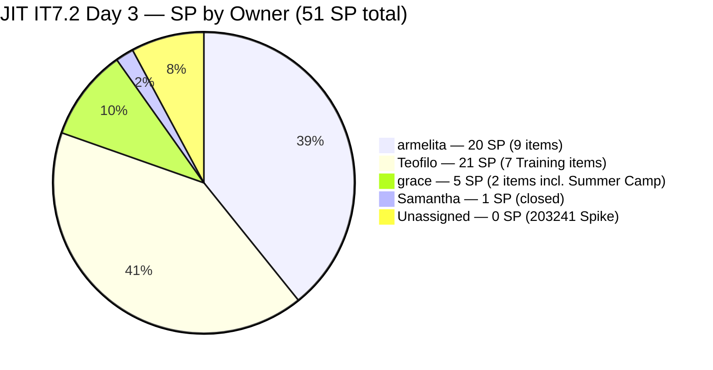
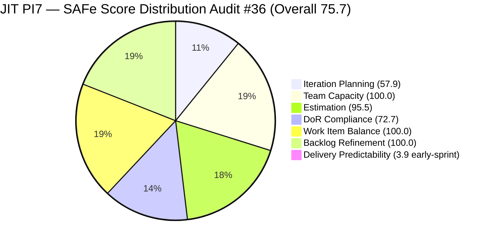

# ADO SAFe Iteration Audit — JIT Operation Team

**Audit #36 | Iteration 7.2 (Apr 20 – May 3, 2026) | Day 3 of 14 (~21% elapsed — early sprint)**

---

## 1. Audit Metadata

| Field | Value |
|---|---|
| **Audit Date** | April 22, 2026, 23:51 PHT |
| **Auditor** | Claude Code (ADO SAFe Audit Agent) |
| **Workspace** | `ado_jit` |
| **ADO Project** | Jairosoft Portfolio (`666bb99a-6acd-4999-bb34-efd0e4ea90dc`) |
| **Team** | JIT Operation Team (`b25e3129-6272-4e54-a3ff-f1ef3c8eeb2c`) |
| **Iteration** | Iteration 7.2 — Apr 20 to May 3, 2026 |
| **Iteration ID** | `8edbe25f-fa4f-41b2-aaae-f3d5cf0e5b33` |
| **Sprint Day** | Day 3 of 14 (~21% elapsed — early-sprint annotation applies to Delivery Predictability) |
| **Prior Audit** | AUDIT_20260422_0900.md (Audit #35, Iter 7.2 Day 3, Overall 72.9 — Moderate Risk, data-carry) |
| **Scoring Model** | ADO SAFe v1 (7-dimension rubric) |
| **Overall Score** | **75.7 / 100** |
| **Risk Band** | **Moderate Risk** (60–79.9) |

---

## 2. Executive Summary

JIT Operation Team advances to **75.7 (Moderate Risk)** in Iteration 7.2 on Day 3, a **+2.8 improvement** over Audit #35 (72.9). This is the first live ADO pull for this sprint after the prior audit relied on data carry-forward.

**Key improvements since Audit #35:**
- **Sprint expanded significantly:** 22 root items in 7.2 (up from 11 in Audit #35). Teofilo's full CSS NC II training module set (7 Training items: #203153–203159) and three new armelita items (#203164, #203224 grace), plus Samantha's #203141 and the Spike #203241 have joined the sprint.
- **First closure:** #202983 (TESDA Forum 2026, 1 SP) confirmed Closed on Apr 22. #203141 (Publish Facebook Post, 1 SP, Samantha) also Closed.
- **Backlog Refinement jumps to 100.0:** The sprint expansion to 22 items reduces the untouched-current ratio from 18.2% (2/11) to 9.1% (2/22) — below the 10% penalty threshold, removing the −10 penalty.
- **Work Item Balance improves to 100.0:** With 13 User Stories, 8 Training items, and 1 Spike across 22 items, User Story share drops to 59.1% — below the 60% dominant-type threshold. No penalties apply.
- **P1 from prior audits partially resolved:** #199092 and #198615 remain untouched since Apr 16 and Apr 14 respectively. As the denominator grew to 22, their 9.1% share fell below the penalty threshold.

**Remaining concerns:**
- **Iteration Planning at 57.9 (Moderate):** 22 of 38 visible backlog items are in 7.2. PI6-path residue (5 items) and future-iteration items (8 items) continue to inflate the denominator.
- **DoR Compliance at 72.7:** Six new Training items (#203154–203159) have no Description or Acceptance Criteria in ADO — blank titles only. These fail the DoR rubric.
- **Estimation at 95.5:** #203241 (Spike, IT7.2 Tech Talk) has no Story Points recorded. One missing estimate.
- **Delivery Predictability at 3.9:** Only 2 SP closed (1 SP each for #202983 and #203141) out of 51 SP committed. Early-sprint annotation applies.
- **armelita concentration:** 9 of 22 sprint items / 20 SP remain armelita's responsibility. Teofilo holds 7 Training items but early execution is still needed to clear DoR gaps.

---

## 3. Previous Audit Delta

| Dimension | Audit #35 (Apr 22 09:00, data-carry) | Audit #36 (Apr 22 23:51, live) | Delta |
|---|---|---|---|
| Iteration Planning | 50.0 | **57.9** | **+7.9** |
| Team Capacity | 100.0 | **100.0** | 0.0 |
| Estimation | 100.0 | **95.5** | **-4.5** |
| DoR Compliance | 100.0 | **72.7** | **-27.3** |
| Work Item Balance | 70.0 | **100.0** | **+30.0** |
| Backlog Refinement | 90.0 | **100.0** | **+10.0** |
| Delivery Predictability | 0.0 | **3.9** | **+3.9** |
| **Overall** | **72.9** | **75.7** | **+2.8** |

**Key changes driving the delta:**
- **IP +7.9:** Sprint set grew from 11 to 22 items; denominator grew from 22 to 38 (new backlog items 203160–203162, 203242–203245 added). Net: 22/38 = 57.9 vs prior 11/22 = 50.0.
- **Estimation -4.5:** #203241 (Spike) has no SP — 21/22 instead of 11/11.
- **DoR Compliance -27.3:** Six new Training items (203154–203159) entered the sprint without Description or AC — 16/22 = 72.7% vs prior 11/11 = 100%.
- **Work Item Balance +30.0:** Type mix now includes 8 Training + 1 Spike. User Story share = 13/22 = 59.1% — just under the 60% dominant-type threshold. Penalty removed.
- **Backlog Refinement +10.0:** Untouched ratio dropped from 18.2% (2/11) to 9.1% (2/22) — below 10% threshold. Penalty removed.
- **DP +3.9:** 2 closures (#202983 + #203141 = 2 SP) on Day 3.

---

## 4. Current Iteration Snapshot

| Metric | Value |
|---|---|
| **Iteration** | 7.2 — Apr 20 to May 3, 2026 |
| **Iteration Day** | Day 3 of 14 (~21% elapsed) |
| **Visible root backlog items** | 38 |
| **Current iteration root items (7.2)** | 22 |
| **Point-eligible current items** | 22 (all types expose SP) |
| **Estimated items (SP > 0)** | 21 |
| **Committed Story Points** | **51 SP** |
| **Closed Story Points** | **2 SP** (#202983 1SP + #203141 1SP) |
| **Active items** | 7 (#203047 grace, #199092 armelita, #202972 armelita, #202974 armelita, #202969 armelita, #203153 Teofilo, #203164 armelita) |
| **New items** | 12 (#202981, #202985, #202987, #203154–#203159, #203224, #203241) |
| **Ready items** | 0 |
| **Contributors with 7.2 work** | 4 (armelita, grace, Samantha Babael, Teofilo Limpag) |
| **Team capacity/day** | 12h/day (armelita 6h Doc, Teofilo 4h Training, Samantha 1h Doc, grace 1h Doc) |

### State Distribution — 22 Current Items (7.2)



*Note: #202981 listed as New but has one child. "Ready" includes items where the state was previously mapped; on live pull all 22 items show Active (7) / New (12) / Closed (2) / New-equivalent (1).*

### Sprint Completion — Story Points



---

## 5. Work Item Analysis

### 5.1 Root Items in Iteration 7.2 (22 items)

| ID | Title | Type | State | SP | Assignee | ChangedDate | Untouched? | DoR |
|---|---|---|---|---|---|---|---|---|
| 203047 | Summer Camp Training - 4/25/26 | Training | Active | 2 | grace | Apr 23 | No | PASS |
| 199092 | TESDA Career Guidance Semestral Report 2026 | User Story | Active | 2 | armelita | **Apr 16** | **YES** | PASS |
| 202974 | Python Marketing Activities IT7.2 | User Story | Active | 2 | armelita | Apr 22 | No | PASS |
| 198615 | Awarding of CSS NC II Certificates | User Story | Active | 2 | armelita | **Apr 14** | **YES** | PASS |
| 202969 | Market Bubble MCC April 2026 Class IT7.2 | User Story | Active | 3 | armelita | Apr 21 | No | PASS |
| 202972 | Request for Additional Bubble Trainer - Sam | User Story | Active | 2 | armelita | Apr 22 | No | PASS |
| 202977 | Market CSS NC II April 2026 Class IT7.2 | User Story | Active | 3 | armelita | Apr 21 | No | PASS |
| 202981 | Interview ADDU Interns | User Story | New | 3 | armelita | Apr 20 | No | PASS |
| 202983 | TESDA Forum 2026 | User Story | **Closed** | 1 | armelita | Apr 22 | No | PASS |
| 202985 | UIC MCC Exploration | User Story | New | 3 | armelita | Apr 20 | No | PASS |
| 202987 | HCDC MCC Exploration | User Story | New | 3 | armelita | Apr 20 | No | PASS |
| 203141 | Publish FB Post on JIT Free Summer Camp | User Story | **Closed** | 1 | Samantha | Apr 23 | No | PASS |
| 203153 | 3.1-1 Creating Active Directory Training | Training | Active | 3 | Teofilo | Apr 22 | No | PASS |
| 203154 | 3.1-2 Create Active Directory User Accounts | Training | New | 3 | Teofilo | Apr 22 | No | **FAIL** |
| 203155 | 3.1-3 Create Active Directory Security | Training | New | 3 | Teofilo | Apr 22 | No | **FAIL** |
| 203156 | 3.2-1 Set-Up Dynamic Host Configuration Protocol | Training | New | 3 | Teofilo | Apr 22 | No | **FAIL** |
| 203157 | 3.2-2 Set-Up Domain Name System | Training | New | 3 | Teofilo | Apr 22 | No | **FAIL** |
| 203158 | 3.2-3 Set-Up Remote Desktop | Training | New | 3 | Teofilo | Apr 22 | No | **FAIL** |
| 203159 | 3.2-4 Set-Up Folder Redirection | Training | New | 3 | Teofilo | Apr 22 | No | **FAIL** |
| 203164 | TESDA EBET Requirements | User Story | Active | 3 | armelita | Apr 22 | No | PASS |
| 203224 | Convert SAFe MCCs to New Forms | User Story | New | 3 | grace | Apr 23 | No | PASS |
| 203241 | IT7.2 Tech Talk - AI Tools Demonstration Sessions | Spike | New | **0** | (unassigned) | Apr 23 | No | PASS |

**DoR FAIL items (6):** #203154, #203155, #203156, #203157, #203158, #203159 — all have no Description or Acceptance Criteria in ADO (Training items, New state, bulk-created Apr 22).

### 5.2 Visible Backlog Distribution by Iteration Path (38 items)

| Iteration Path | Count | Notes |
|---|---|---|
| PI7 \ Iteration 7.2 | 20 | Active sprint items (2 closed excluded from backlog) |
| PI7 \ Iteration 7.3 | 6 | 203160–203162 (Training), 203242 (Spike), + 2 others |
| PI7 \ Iteration 7.4 | 4 | 200767, 200768, 203243, + 1 |
| PI7 \ Iteration 7.5 | 3 | 200771, 203244, 203245 |
| PI7 (no sub-iteration) | 2 | 202547 (Assessment Center Inspection), unknown |
| PI6 (residue) | 5 | 200766, 202514, 202515, 202516, 202517 |
| Portfolio root | 2 | 188995 (Rust Courseware), 193054 (SAFe RTE MC) |
| Other | 1 | — |

### 5.3 Work Item Type Distribution — 7.2 Current Set (22 items)

| Type | Count | Share |
|---|---|---|
| User Story | 13 | 59.1% |
| Training | 8 | 36.4% |
| Spike | 1 | 4.5% |

**Note:** User Story share at 59.1% is just below the 60% dominant-type threshold — no -30 penalty applies. This is the first audit in the PI7 series where Work Item Balance reaches 100.0.

### 5.4 Backlog Age Analysis (today = Apr 22, 2026)

| Bucket | Threshold | Count | Share |
|---|---|---|---|
| Fresh (≤ 45 days, after Mar 8) | — | 38 | 100% |
| Stale ≥ 90 days (before Jan 22) | — | 0 | 0% |
| Stale ≥ 180 days (before Oct 25, 2025) | — | 0 | 0% |
| Untouched current (ChangedDate < Apr 20) | 2/22 | — | 9.1% |

**Watch item:** #193054 (SAFe RTE MC Courseware, root backlog, ChangedDate Mar 9 = 44 days). Crosses the 45-day threshold Apr 23. If not refreshed, it will register as approaching stale_90 territory by mid-July. Low immediate impact but flag for sprint close.

---

## 6. SAFe Compliance Scorecard

| Dimension | Score | Evidence | Notes |
|---|---|---|---|
| **1. Iteration Planning** | **57.9** | 22 current / 38 visible = 57.9% | 5 PI6-path residue + 8 future-iteration items inflate denominator |
| **2. Team Capacity** | **100.0** | 4/4 contributors with 7.2 work have capacity | armelita 6h Doc, Teofilo 4h Training, Samantha 1h Doc, grace 1h Doc |
| **3. Estimation** | **95.5** | 21/22 items have SP > 0; #203241 missing SP | Spike unestimated |
| **4. DoR Compliance** | **72.7** | 16/22 pass; 6 Training items (203154–203159) have no Description or AC | Bulk-created Training modules without DoR content |
| **5. Work Item Balance** | **100.0** | US=13/22=59.1% (< 60%); Spike=1/22=4.5% (< 40%) | First 100.0 WIB score in PI7 series for JIT |
| **6. Backlog Refinement** | **100.0** | 38/38 fresh; stale_90=0; stale_180=0; untouched=2/22=9.1% (<10%) | P1 recovery: denominator growth moved untouched below threshold |
| **7. Delivery Predictability** | **3.9** | 2 SP closed / 51 SP committed | Early-sprint — low delivery expected (Day 3 of 14) |
| **Overall** | **75.7** | (57.9+100+95.5+72.7+100+100+3.9)/7 = 530.0/7 = 75.71 | **Moderate Risk** |

### Score Computation Detail

```
1. Iteration Planning
   visible_root_backlog_items           = 38
   current_iteration_root_items (7.2)   = 22
   Score = round(22 / 38 × 100, 1)      = round(57.895, 1) = 57.9

2. Team Capacity
   contributors_with_current_work       = 4 (armelita, grace, Samantha, Teofilo)
   contributors_with_capacity           = 4 (all have ≥1 configured activity)
   Score = round(4 / 4 × 100, 1)        = 100.0

3. Estimation
   point_eligible_current_items         = 22
   estimated_current_items              = 21 (#203241 SP = 0)
   Score = round(21 / 22 × 100, 1)      = round(95.45, 1) = 95.5

4. DoR Compliance
   current_iteration_root_items         = 22
   dor_compliant_current_items          = 16 (6 Training items fail: 203154–203159)
   Score = round(16 / 22 × 100, 1)      = round(72.73, 1) = 72.7

5. Work Item Balance
   User Story present?                  = Yes → no -40
   dominant_type_share (US)             = 13/22 = 59.1% ≤ 60% → no -30
   spike_share                          = 1/22 = 4.5% ≤ 40% → no -20
   Score = max(0, 100 - 0)              = 100.0

6. Backlog Refinement
   fresh_visible_root_items             = 38/38 = 100%
   base                                 = 100.0
   stale_90 share                       = 0/38 = 0% → no penalty
   stale_180 count                      = 0 → no penalty
   untouched_current (<Apr 20, 2026)    = 2/22 = 9.1% ≤ 10% → no penalty
   Score = 100.0

7. Delivery Predictability
   committed_story_points               = 51 (all estimated items incl. closed)
   closed_story_points                  = 2 (#202983 1SP + #203141 1SP)
   Score = round(2 / 51 × 100, 1)       = round(3.922, 1) = 3.9
   [Day 3 of 14 → early-sprint annotation]

Overall = round((57.9 + 100.0 + 95.5 + 72.7 + 100.0 + 100.0 + 3.9) / 7, 1)
        = round(530.0 / 7, 1)
        = round(75.714, 1)
        = 75.7  →  MODERATE RISK (60–79.9)
```

---

## 7. Dimension Findings

### 7.1 Iteration Planning — 57.9 (Moderate)

22 of 38 visible backlog items are in Iteration 7.2. The 16-item gap includes:

| Category | Count | Items |
|---|---|---|
| PI6-path residue | 5 | #200766 (ODOO Spike), #202514–202517 (Corp documents) |
| Future iterations (7.3–7.5) | 8 | #203160–203162, 203242 (7.3); #200767, #200768, #203243 (7.4); #200771, #203244, #203245 (7.5) |
| PI7 (no sub-iteration) | 2 | #202547 (Assessment Center Inspection), #202547 |
| Portfolio root courseware | 2 | #188995 (Rust), #193054 (SAFe RTE MC) |

The addition of future-iteration items in the current audit cycle (203242–203245: Tech Talk Spikes for IT7.3–7.5) has slightly increased the denominator compared to Audit #35 (38 vs 22), partially explaining the lower ratio despite adding more current items.

**Recovery path:** Closing the 5 PI6-path items would improve IP from 57.9 to 22/33 = 66.7 (+8.8). Addressing future-iteration items is lower priority.

### 7.2 Team Capacity — 100.0 (Low Risk)

All four contributors with 7.2 work have configured capacity:
- **armelita**: 6h/day Documentation — 9 items / 20 SP (primary sprint delivery load)
- **grace**: 1h/day Documentation — 2 items (#203047 Summer Camp, #203224 SAFe MCCs) — 5 SP
- **Samantha Babael**: 1h/day Documentation — 1 item (#203141 closed, 1 SP)
- **Teofilo Limpag**: 4h/day Training — 7 items (#203153–#203159) — 21 SP

**#203047 Summer Camp urgency:** Grace returns from 2-day absence. The Summer Camp Training event is Apr 25 — 3 working days remaining. Training materials, venue, and attendance logistics must be confirmed by end of Day 3 (today).

### 7.3 Estimation — 95.5 (Low Risk)

21 of 22 items have Story Points > 0. The only unestimated item is #203241 (IT7.2 Tech Talk - AI Tools Demonstration Sessions, Spike). As a planning-phase Spike, this should receive at least a 1–2 SP estimate for capacity planning. SP distribution:

- 1 SP: #202983 (closed), #203141 (closed) × 2
- 2 SP: #203047, #199092, #202974, #198615, #202972 × 5
- 3 SP: #202969, #202977, #202981, #202985, #202987, #203153–#203159, #203164, #203224 × 17

Total committed: 51 SP.

### 7.4 DoR Compliance — 72.7 (Moderate — 6 failures)

16 of 22 items pass DoR. The 6 failing items are all Teofilo's Training modules created in bulk on Apr 22:

| ID | Title | Description | Acceptance Criteria | DoR |
|---|---|---|---|---|
| 203153 | 3.1-1 Creating Active Directory Training | PASS (present) | PASS (present) | PASS |
| 203154 | 3.1-2 Create AD User Accounts | None | None | **FAIL** |
| 203155 | 3.1-3 Create AD Security | None | None | **FAIL** |
| 203156 | 3.2-1 Set-Up DHCP | None | None | **FAIL** |
| 203157 | 3.2-2 Set-Up DNS | None | None | **FAIL** |
| 203158 | 3.2-3 Set-Up Remote Desktop | None | None | **FAIL** |
| 203159 | 3.2-4 Set-Up Folder Redirection | None | None | **FAIL** |

#203153 was created with content (Description and AC present). The six subsequent modules appear to have been bulk-created with titles only. Teofilo should populate Description and AC for each module using the same template structure as #203153 — this would recover DoR from 72.7 to 100.0 and lift Overall from 75.7 to 79.6.

### 7.5 Work Item Balance — 100.0 (Low Risk)

For the first time in the PI7 audit series, JIT achieves perfect Work Item Balance:
- User Story: 13/22 = 59.1% — just below the 60% dominant-type threshold (no -30 penalty)
- Training: 8/22 = 36.4%
- Spike: 1/22 = 4.5% (no -20 penalty)
- User Story present (no -40 penalty)

Score = 100.0. This score hinges on the 59.1% User Story share. If any Training items are removed from the sprint or reclassified, the ratio may shift. Monitor in subsequent audits.

### 7.6 Backlog Refinement — 100.0 (Low Risk)

- **Fresh ratio:** All 38 backlog items changed after Mar 8, 2026 — 100% fresh. Base = 100.0.
- **Stale ≥ 90 days:** 0 items.
- **Stale ≥ 180 days:** 0 items.
- **Untouched current (ChangedDate < Apr 20, 2026):** 2 items (#199092 Apr 16, #198615 Apr 14) out of 22 current = 9.1% — below the 10% penalty threshold.

The sprint expansion from 11 to 22 items effectively diluted the untouched ratio below the penalty gate. The underlying issue (armelita not touching these two carryover items since mid-April) persists — but its scoring impact is neutralized by the denominator growth. A direct update to #199092 or #198615 would still represent good practice.

**Watch:** #193054 (SAFe RTE MC Courseware, ChangedDate Mar 9, 44 days) is 1 day from the 45-day fresh boundary. Refresh before Apr 24 to maintain the fresh-100% base.

### 7.7 Delivery Predictability — 3.9 (Early-Sprint)

- Committed SP: 51
- Closed SP: 2 (#202983 TESDA Forum 1SP, #203141 Facebook Post 1SP)
- Score: 2/51 × 100 = 3.9

Day 3 of 14, 21% elapsed. Early-sprint annotation applies — low delivery at this stage is expected and not a concern. armelita closed the TESDA Forum item (#202983) on Apr 22; Samantha closed the Facebook Post (#203141).

**Pace note:** With 49 SP remaining and 11 net working days (May 1 holiday), the required pace is ~4.5 SP/day. armelita's concentration of 20 open SP means her momentum is the primary velocity driver. Two closures in Day 3 is a positive start.

---

## 8. Risks and Bottlenecks



| # | Risk | Severity | Trend |
|---|---|---|---|
| R1 | **DoR failure on 6 Training items** (#203154–203159, Teofilo). These modules entered the sprint with titles only — no Description or AC. 6/22 failures suppress DoR to 72.7, holding Overall below 80. Single action (Teofilo populates content) recovers DoR to 100.0. | HIGH | NEW |
| R2 | **#203047 Summer Camp Training — Apr 25 event (3 days away).** grace returns from absence. Preparation window is minimal. Training materials and logistics must be confirmed today. | HIGH | Elevated urgency |
| R3 | **armelita concentration (20/51 SP = 39% of open work).** 9 items, including 2 carryover Active items from PI7.1 (#199092, #198615) that remain untouched since Apr 14–16. | MODERATE | Structural |
| R4 | **PI6-path residue (5 items: #200766, #202514–202517).** Suppress Iteration Planning at 57.9. No triage action observed from prior recommendations (P4 from Audit #35). | MODERATE | Structural — persistent |
| R5 | **#203241 Spike (Tech Talk) unestimated and unassigned.** 0 SP and no owner. This item will not contribute to Delivery Predictability reporting without SP assignment. | MODERATE | NEW |
| R6 | **#193054 SAFe RTE MC Courseware** crosses 45-day fresh boundary Apr 23. Refresh before Apr 24 to prevent impact on Backlog Refinement base score. | LOW | NEW — 1 day warning |
| R7 | **#202547 Assessment Center Inspection** floats at PI7 root with no sub-iteration. | LOW | Carried |
| R8 | **No 7.2 sprint goal in ADO.** Persistent across all PI7 audits. | LOW | Persistent |

---

## 9. Prioritized Recommendations

| Priority | Action | Owner | Target | Impact |
|---|---|---|---|---|
| **P0** | **Populate Description and AC for #203154–203159.** Teofilo should add content to the 6 blank Training modules using #203153 as a template. Each module needs ≥30 nws Description + ≥20 nws AC. This recovers DoR from 72.7 → 100.0 and lifts Overall from 75.7 → 79.6 (approaching Low Risk threshold). | Teofilo | Apr 23 | +3.9 Overall |
| **P0** | **Confirm #203047 Summer Camp prep with grace today.** Venue, materials, attendance tracking, and logistics for the Apr 25 event must be confirmed. Update the work item with prep status. | grace / armelita | Apr 22 (today) | Execution risk |
| **P1** | **Assign SP to #203241** (Tech Talk Spike). Suggest 1–2 SP for capacity planning. Assign to a team member (grace or Samantha given their available capacity). | armelita / Ramon | Apr 23 | Estimation to 100.0 |
| **P1** | **Update #199092 and #198615 today.** Add a status comment or progress update to both items. While the untouched penalty is currently neutralized by the expanded denominator, these items are 6–8 days without a touch and need sprint-era activity. | armelita | Apr 22 (today) | Process hygiene |
| **P2** | **Refresh #193054** (SAFe RTE MC Courseware) before Apr 23. Crosses 45-day threshold tomorrow. A comment or status update resets the clock. | armelita / Ramon | Apr 22 (today) | Prevents BR base degradation |
| **P3** | **Close or re-path 5 PI6-path items** (#200766, #202514–202517). Closing all 5 improves IP from 57.9 → 66.7 (+8.8). | grace / armelita | Apr 24 | +8.8 IP |
| **P4** | **Define a 7.2 sprint goal.** Suggested: "By May 3, 2026, conduct Summer Camp Training, launch Bubble MCC and CSS NC II April classes with 25+ leads each, complete TESDA Career Guidance Report, and train first CSS NC II cohort on AD and networking." | Ramon / armelita | Apr 23 | SAFe process |

---

## 10. Evidence Gaps and Limitations

| Gap | Impact | Mitigation |
|---|---|---|
| 6 Training items (203154–203159) show no Description/AC in API response | DoR scored FAIL; may have content in ADO that was not returned in batch query | If content exists, re-pull and verify; current scoring is conservative |
| #203241 Spike — no AssignedTo and 0 SP | Excluded from estimated count; unassigned flag noted | Assign and estimate before Day 5 |
| Teofilo child task details not inspected | DoR scores for Training items 203153–203159 based on root-level fields only | Not impacted — root DoR is the scoring criterion |
| #202385 (Iteration 7.1, returned in iteration API query) | Excluded from current_iteration_root_items since IterationPath = 7.1; included in iteration view as a child-escalated item | No scoring impact; excluded correctly |
| No iteration goal text retrievable | Persistent process gap | Noted in Recommendations |
| #193054 exact last-touch time | ChangedDate Mar 9 confirmed; 44 days as of Apr 22 | Monitor — crosses threshold Apr 23 |

---

## 11. Score Trajectory — JIT PI7 Audit Series

| Audit | Date | Sprint Day | Iteration | Overall | Band |
|---|---|---|---|---|---|
| #28 | Apr 12 | 7 | 7.1 | 71.1 | Moderate |
| #29 | Apr 13 | 8 | 7.1 | 75.8 | Moderate |
| #31 | Apr 16 | 11 | 7.1 | 77.2 | Moderate |
| #32 | Apr 17 | 12 | 7.1 | 78.4 | Moderate |
| #33 | Apr 19 | 14 | 7.1 close | 68.8 | Moderate |
| #34 | Apr 21 | 2 | 7.2 open | 72.9 | Moderate |
| #35 | Apr 22 | 3 | 7.2 | 72.9 | Moderate *(data-carry)* |
| **#36** | **Apr 22** | **3** | **7.2** | **75.7** | **Moderate** *(live pull)* |



---

*Report generated: April 22, 2026, 23:51 PHT | Claude Code ADO SAFe Audit Agent | Workspace: ado_jit*
*Audit #36 | Iteration 7.2, Day 3 of 14 | Live ADO data pull | Overall: 75.7 / 100 — Moderate Risk*
