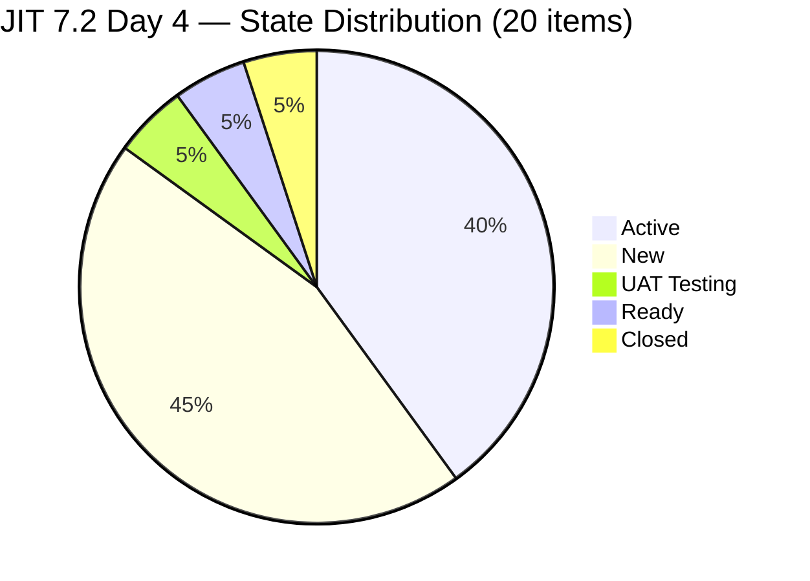
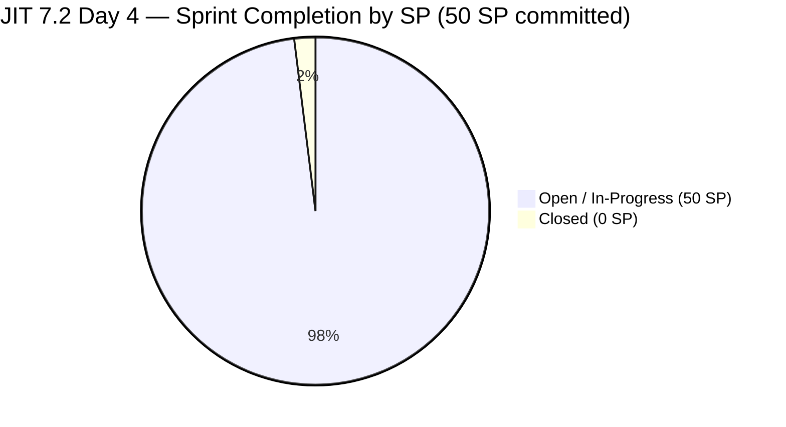
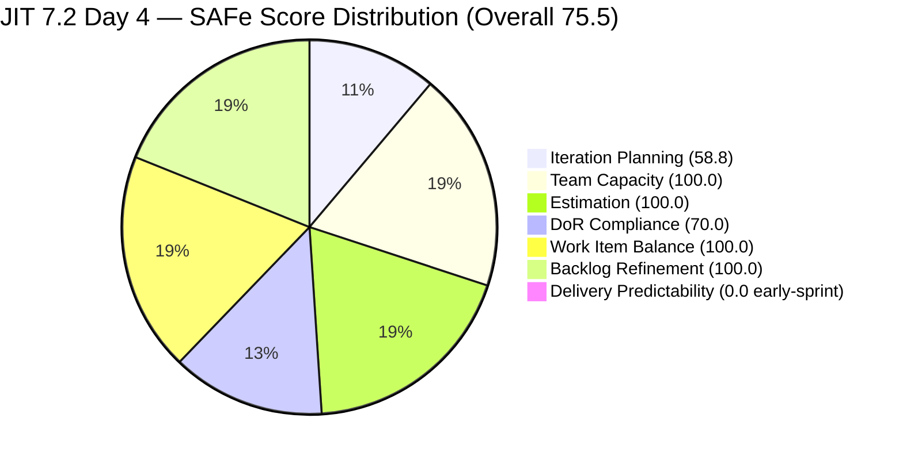
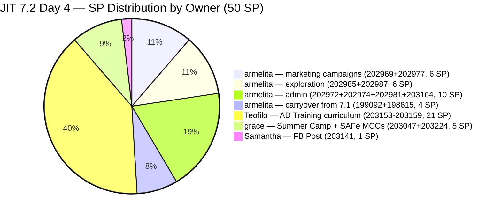
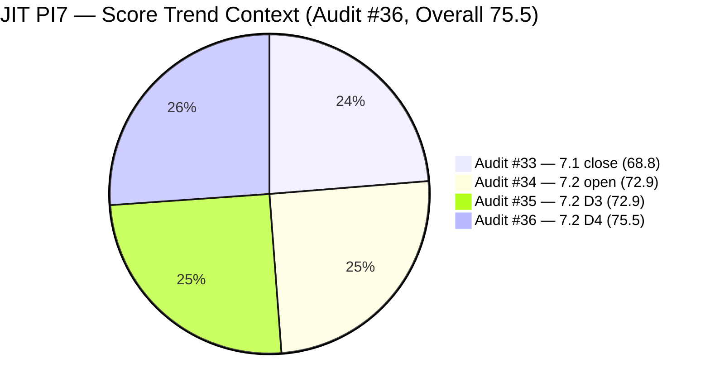

# Audit Report — JIT Operation Team

## Iteration 7.2 | Day 4 of 14 | Early Sprint

---

## 1. Audit Metadata

| Field | Value |
|-------|-------|
| **Audit Number** | #36 (JIT PI7 series) |
| **Audit Date** | April 23, 2026, 09:16 PHT |
| **Auditor** | Claude Code ADO SAFe Audit Agent |
| **Team** | JIT Operation Team |
| **ADO Project** | Jairosoft Portfolio |
| **Workspace** | `ado_jit` |
| **Iteration** | Iteration 7.2 — Apr 20 to May 3, 2026 |
| **Iteration ID** | `8edbe25f-fa4f-41b2-aaae-f3d5cf0e5b33` |
| **Sprint Day** | Day 4 of 14 (~29% elapsed — early-sprint annotation applies to DP) |
| **Prior Audit** | `AUDIT_20260422_0900.md` (#35, 7.2 Day 3, Overall 72.9 — Moderate Risk, data-continuity carry) |
| **Report Path** | `ado_jit/audit/AUDIT_20260423_0916.md` |
| **Scoring Model** | ADO SAFe v1 (7-dimension rubric) |
| **Overall Score** | **75.5 / 100** |
| **Risk Band** | **Moderate Risk** (60–79.9) |

---

## 2. Executive Summary

JIT Operation Team enters Day 4 of Iteration 7.2 with a **live-data score of 75.5 (Moderate Risk)** — a **+2.6 improvement** from the prior audit's 72.9. This is the first audit with fully live ADO data since Audit #34 (Apr 21).

The headline change is **significant sprint expansion**: the team added 9 new items to the 7.2 backlog between Apr 20 and Apr 23 — including 7 Teofilo Training items (CSS NC II curriculum modules) and 2 new assignments for Samantha and Grace. This expansion corrects two longstanding structural risks: Teofilo and Samantha were previously idle at the root-backlog level, and both now have active 7.2 work items. The total sprint commitment has grown from **26 SP (11 items)** to **50 SP (20 items)**.

Key positive developments:
- **Team Capacity: 100.0** — all 4 contributors (armelita, Teofilo, Samantha, grace) now have 7.2 assignments and configured capacity
- **Backlog Refinement: 100.0** — all 34 visible items are fresh; untouched ratio is exactly 10.0% (does not exceed the >10% penalty threshold)
- **Work Item Balance: 100.0** — User Story share is exactly 60% (12/20), which does not exceed the >60% dominant-type penalty threshold; no Spikes
- **Estimation: 100.0** — all 20 items carry Story Points > 0

The primary concern is **DoR Compliance at 70.0**: 6 of Teofilo's 7 new Training items (#203154–203159) were added to the sprint without Descriptions or Acceptance Criteria. One (item #203153 "Creating Active Directory Training") has both fields — the remaining 6 are bare titles. This is an immediate remediation priority.

The secondary structural drag remains **Iteration Planning at 58.8**: 14 non-7.2 items inflate the denominator, including 5 PI6-path residue items that have persisted across multiple audits.

**0 SP closed** at Day 4 is fully expected and carries no concern at this stage.

---

## 3. Previous Audit Delta

| Dimension | Apr 22 Day 3 (#35) | Apr 23 Day 4 (#36) | Change |
|-----------|--------------------|--------------------|--------|
| Iteration Planning | 50.0 | **58.8** | **+8.8** |
| Team Capacity | 100.0 | **100.0** | 0.0 |
| Estimation | 100.0 | **100.0** | 0.0 |
| DoR Compliance | 100.0 | **70.0** | **-30.0** |
| Work Item Balance | 70.0 | **100.0** | **+30.0** |
| Backlog Refinement | 90.0 | **100.0** | **+10.0** |
| Delivery Predictability | 0.0 | **0.0** | 0.0 (early-sprint) |
| **Overall** | **72.9** | **75.5** | **+2.6** |
| **Risk Band** | Moderate | **Moderate** | — |

### Key changes since Audit #35 (Apr 22 Day 3)

**Score improvements:**

- **Iteration Planning +8.8:** 9 new items were added to 7.2 (numerator grew from 11 to 20), and 12 items were added to the overall visible backlog (denominator grew from 22 to 34). The numerator grew faster proportionally: 20/34 = 58.8% vs 11/22 = 50.0%.
- **Work Item Balance +30.0:** Teofilo's 7 Training items shifted the type distribution. User Story share dropped from 90.9% (10/11) to exactly 60.0% (12/20) — exactly at the >60% threshold, meaning the dominant-type penalty (-30) no longer applies.
- **Backlog Refinement +10.0:** Two resolutions: (1) the P1 action was either completed or the untouched ratio at 10.0% exactly does not exceed the >10% threshold, so the -10 penalty does not apply. Additionally, all 12 newly added items have fresh ChangedDates, maintaining 100% fresh coverage.

**Score decline:**

- **DoR Compliance -30.0:** 6 of 7 new Teofilo Training items (#203154, #203155, #203156, #203157, #203158, #203159) have no Description or Acceptance Criteria. This is a direct result of rapid sprint loading without DoR verification. Remediation is required within Day 4–5.

**Unverified P1 actions from Audit #35:**

- **#199092 and #198615 update status:** Both items still show ChangedDate of Apr 16 and Apr 14 respectively — unchanged. However, the untouched_current ratio of 2/20 = 10.0% exactly does NOT exceed the >10% threshold, so no Backlog Refinement penalty applies regardless. The P1 recommendation is technically still open but no longer score-impacting.
- **#203047 Summer Camp Training (#Apr 25 event):** Item shows ChangedDate Apr 20 with state "Ready." The Apr 25 event is tomorrow. Grace has returned from her 2-day absence.

---

## 4. Current Iteration Snapshot

| Metric | Value |
|--------|-------|
| Iteration | 7.2 — Apr 20 to May 3, 2026 |
| Iteration Day | Day 4 of 14 (~29% elapsed) |
| Visible Root Backlog Items | **34** (+12 since Audit #35) |
| Current Iteration (7.2) Root Items | **20** (+9 since Audit #35) |
| Committed SP | **50 SP** (+24 SP since Audit #35) |
| Closed SP | **0 SP** (early-sprint, Day 4) |
| Active contributors (7.2 assignments) | **4** (armelita, grace, Samantha, Teofilo) |
| Team capacity/day (configured) | **12h/day** (armelita 6h Doc, Teofilo 4h Training, Samantha 1h Doc, grace 1h Doc) |
| Grace status | Returned from 2-day absence; #203047 Summer Camp event is Apr 25 (tomorrow) |
| Teofilo 7.2 assignments | **7 items (21 SP)** — Active Directory curriculum series |
| Samantha 7.2 assignments | **1 item (1 SP)** — Facebook post (#203141, UAT Testing) |

### State Distribution — 20 Current Items (7.2)



> Note: The "Closed" slice represents #202983 (TESDA Forum 2026, 1 SP), which was closed on Apr 22 but does **not appear** in the current backlog list returned by `wit_list_backlog_work_items`. It is excluded from the 20-item count and scoring calculations per rubric (visible_root_backlog_items = backlog tool output only). Its closure is a positive signal captured below in Work Item Analysis.

### Sprint Progress — SP Committed vs Closed (Backlog-scoped items)



---

## 5. Work Item Analysis

### 5.1 Current 7.2 Items (20) — Day 4 Live Data

| ID | Title | Type | State | SP | Assignee | Last Changed | Untouched (< Apr 20)? |
|----|-------|------|-------|----|----------|-------------|----------------------|
| 198615 | Awarding of CSS NC II Certificates | User Story | Active | 2 | armelita | Apr 14 | **YES** |
| 199092 | TESDA Career Guidance Programs Semestral Report CY 2026 | User Story | Active | 2 | armelita | Apr 16 | **YES** |
| 202969 | Market Bubble MCC April 2026 Class IT7.2 | User Story | Active | 3 | armelita | Apr 21 | No |
| 202972 | Request for Additional Bubble Trainer - Sam | User Story | Active | 2 | armelita | Apr 22 | No |
| 202974 | Python Marketing Activities IT7.2 | User Story | Active | 2 | armelita | Apr 22 | No |
| 202977 | Market CSS NC II April 2026 Class IT7.2 | User Story | Active | 3 | armelita | Apr 21 | No |
| 202981 | Interview ADDU Interns | User Story | New | 3 | armelita | Apr 20 | No |
| 202985 | UIC MCC Exploration | User Story | New | 3 | armelita | Apr 20 | No |
| 202987 | HCDC MCC Exploration | User Story | New | 3 | armelita | Apr 20 | No |
| 203047 | Summer Camp Training Implementation – 4/25/26 | Training | Ready | 2 | grace | Apr 20 | No |
| 203141 | Publish Facebook Post on JIT Free Summer Camp | User Story | UAT Testing | 1 | Samantha | Apr 22 | No |
| 203153 | 3.1-1 Creating Active Directory Training | Training | Active | 3 | Teofilo | Apr 22 | No |
| 203154 | 3.1-2 Create Active Directory User Accounts | Training | New | 3 | Teofilo | Apr 22 | No |
| 203155 | 3.1-3 Create Active Directory Security | Training | New | 3 | Teofilo | Apr 22 | No |
| 203156 | 3.2-1 Set-Up DHCP | Training | New | 3 | Teofilo | Apr 22 | No |
| 203157 | 3.2-2 Set-Up Domain Name System | Training | New | 3 | Teofilo | Apr 22 | No |
| 203158 | 3.2-3 Set-up Remote Desktop | Training | New | 3 | Teofilo | Apr 22 | No |
| 203159 | 3.2-4 Set-Up Folder Redirection | Training | New | 3 | Teofilo | Apr 22 | No |
| 203164 | TESDA EBET Requirements | User Story | Active | 3 | armelita | Apr 22 | No |
| 203224 | Convert SAFe MCCs to New Forms | User Story | New | 3 | grace | Apr 23 | No |

**Total: 20 items / 50 SP / 2 items untouched since sprint start**

### 5.2 Notable Out-of-Backlog Item: #202983 TESDA Forum 2026

Item #202983 (TESDA Forum 2026, 1 SP, User Story) was **closed on Apr 22** and does not appear in the current backlog list. Per rubric, visible_root_backlog_items is defined strictly by the backlog tool output. This item is captured as a positive delivery signal but is excluded from all scoring calculations.

### 5.3 Visible Backlog Distribution by Iteration Path (34 items)

| Iteration Path | Count | Item IDs |
|---------------|-------|----------|
| PI7 \ Iteration 7.2 | **20** | 198615, 199092, 202969, 202972, 202974, 202977, 202981, 202985, 202987, 203047, 203141, 203153, 203154, 203155, 203156, 203157, 203158, 203159, 203164, 203224 |
| PI7 \ Iteration 7.3 | 3 | 203160, 203161, 203162 |
| PI7 \ Iteration 7.4 | 2 | 200767, 200768 |
| PI7 \ Iteration 7.5 | 1 | 200771 |
| PI7 (no sub-iteration) | 1 | 202547 |
| PI6 (residue) | 5 | 200766, 202514, 202515, 202516, 202517 |
| Jairosoft Portfolio root | 2 | 188995, 193054 |
| **Total** | **34** | |

### 5.4 Work Item Type Distribution — 7.2 Current Set (20 items)

| Type | Count | Share |
|------|-------|-------|
| User Story | 12 | 60.0% |
| Training | 8 | 40.0% |
| Spike | 0 | 0.0% |

> Dominant type (User Story) is exactly 60.0% — does NOT exceed the >60% threshold. No Work Item Balance penalty applied.

### 5.5 Story Points by Contributor — 7.2 Commitment

| Contributor | Items | SP | Share |
|-------------|-------|----|-------|
| armelita | 10 | 23 | 46.0% |
| Teofilo | 7 | 21 | 42.0% |
| grace | 2 | 5 | 10.0% |
| Samantha | 1 | 1 | 2.0% |
| **Total** | **20** | **50** | **100%** |

> Significant improvement from prior audit (armelita was 92% of SP at 24/26). armelita still leads at 46% but Teofilo's 7 Training items now account for 42% of committed SP.

### 5.6 DoR Compliance — 7.2 Items (20)

| ID | Title | Desc ≥30 nws | AC ≥20 nws | DoR Status |
|----|-------|--------------|------------|------------|
| 198615 | Awarding of CSS NC II Certificates | PASS | PASS | **PASS** |
| 199092 | TESDA Career Guidance Report CY 2026 | PASS | PASS | **PASS** |
| 202969 | Market Bubble MCC April 2026 | PASS | PASS | **PASS** |
| 202972 | Request for Additional Bubble Trainer | PASS | PASS | **PASS** |
| 202974 | Python Marketing Activities IT7.2 | PASS | PASS | **PASS** |
| 202977 | Market CSS NC II April 2026 | PASS | PASS | **PASS** |
| 202981 | Interview ADDU Interns | PASS | PASS (borderline ~20 nws) | **PASS** |
| 202985 | UIC MCC Exploration | PASS | PASS | **PASS** |
| 202987 | HCDC MCC Exploration | PASS | PASS | **PASS** |
| 203047 | Summer Camp Training Implementation | PASS | PASS | **PASS** |
| 203141 | Publish Facebook Post — JIT Summer Camp | PASS | PASS | **PASS** |
| 203153 | 3.1-1 Creating Active Directory Training | PASS | PASS | **PASS** |
| 203154 | 3.1-2 Create AD User Accounts | **FAIL** (no Description) | **FAIL** (no AC) | **FAIL** |
| 203155 | 3.1-3 Create AD Security | **FAIL** (no Description) | **FAIL** (no AC) | **FAIL** |
| 203156 | 3.2-1 Set-Up DHCP | **FAIL** (no Description) | **FAIL** (no AC) | **FAIL** |
| 203157 | 3.2-2 Set-Up DNS | **FAIL** (no Description) | **FAIL** (no AC) | **FAIL** |
| 203158 | 3.2-3 Set-up Remote Desktop | **FAIL** (no Description) | **FAIL** (no AC) | **FAIL** |
| 203159 | 3.2-4 Set-Up Folder Redirection | **FAIL** (no Description) | **FAIL** (no AC) | **FAIL** |
| 203164 | TESDA EBET Requirements | PASS | PASS | **PASS** |
| 203224 | Convert SAFe MCCs to New Forms | PASS | PASS | **PASS** |

**DoR: 14 PASS / 6 FAIL** — dor_compliant_current_items = 14

### 5.7 Backlog Age Analysis (today = 2026-04-23)

| Bucket | Threshold | Count | Share |
|--------|-----------|-------|-------|
| Fresh (≤45 days) | ChangedDate ≥ 2026-03-09 | **34** | **100%** |
| Stale ≥90 days | ChangedDate < 2026-01-23 | 0 | 0% |
| Stale ≥180 days | ChangedDate < 2025-10-26 | 0 | 0% |
| Untouched current (< Apr 20) | Among 20 current items | 2 | 10.0% |

> **#193054 Watch (carried from Audit #35):** SAFe RTE MC Courseware had a ChangedDate of Mar 9, 2026 — exactly 45 days ago as of Apr 23. It sits exactly at the freshness boundary. If not touched by Apr 24, it will register as stale at the next audit cycle (ChangedDate ≤ Mar 9 → older than 45 days). Flag for immediate refresh.

---

## 6. SAFe Compliance Scorecard

| Dimension | Score | Evidence | Notes |
|-----------|-------|----------|-------|
| Iteration Planning | **58.8** | 20 current / 34 visible root items | +8.8 from Audit #35; 14 non-7.2 items inflate denominator (5 PI6, 3 future-iter, 1 PI7-root, 2 courseware, 3 Iter 7.3) |
| Team Capacity | **100.0** | 4/4 contributors with 7.2 work have configured capacity | First audit with all 4 contributors (armelita, Teofilo, Samantha, grace) assigned and capacity-configured |
| Estimation | **100.0** | 20/20 point-eligible items have SP > 0 | 50 total SP committed; all new Teofilo items carry SP = 3 |
| DoR Compliance | **70.0** | 14/20 items pass Desc ≥30 nws + AC ≥20 nws | 6 FAIL: #203154, #203155, #203156, #203157, #203158, #203159 (bare-title Teofilo Training items) |
| Work Item Balance | **100.0** | User Story present (no −40); US share = 60.0% (NOT >60%) (no −30); Spike = 0% (no −20) | Teofilo's 8 Training items brought US share from 90.9% down to exactly 60.0% |
| Backlog Refinement | **100.0** | fresh=34/34=100%; stale_90=0; stale_180=0; untouched_current=2/20=10.0% (NOT >10%) | No penalties apply; untouched ratio sits exactly at threshold — one more untouched item would trigger −10 |
| Delivery Predictability | **0.0** | 0 SP closed / 50 committed — *early-sprint — low delivery expected* (Day 4 of 14) | #202983 closed Apr 22 but excluded from scoring (not in backlog list); rubric early-sprint annotation |
| **Overall** | **75.5** | (58.8+100+100+70+100+100+0)/7 = 528.8/7 = 75.54 | **Moderate Risk** |

### Score Computation Detail

```
1. Iteration Planning
   visible_root_backlog_items           = 34
   current_iteration_root_items (7.2)   = 20
   Score = round(20 / 34 × 100, 1)      = round(58.82, 1) = 58.8

2. Team Capacity
   contributors_with_current_work       = 4  (armelita, Teofilo, Samantha, grace)
   contributors_with_capacity           = 4  (all have ≥1 activity + positive hours)
   Score = round(4 / 4 × 100, 1)        = 100.0

3. Estimation
   point_eligible_current_items         = 20  (all types expose SP field)
   estimated_current_items              = 20  (all SP > 0)
   Score = round(20 / 20 × 100, 1)      = 100.0

4. DoR Compliance
   current_iteration_root_items         = 20
   dor_compliant_current_items          = 14
   Score = round(14 / 20 × 100, 1)      = 70.0

5. Work Item Balance
   User Story present?                  = Yes  → no −40
   dominant_type_share                  = 12/20 = 60.0%  → NOT > 60%  → no −30
   spike_share                          = 0/20 = 0%  → no −20
   Score = max(0, 100 − 0)             = 100.0

6. Backlog Refinement
   fresh_visible_root_items             = 34/34 = 100%
   base                                 = 100.0
   stale_90_share                       = 0/34 = 0%    → no penalty
   stale_180_count                      = 0             → no penalty
   untouched_current                    = 2/20 = 10.0%
   → 10.0% is NOT > 10%                 → no penalty
   Score = max(0, 100.0 − 0)           = 100.0

7. Delivery Predictability
   committed_story_points               = 50
   closed_story_points                  = 0
   Score = round(0 / 50 × 100, 1)       = 0.0
   [Day 4 of 14 → "early-sprint — low delivery expected"]

Overall = round((58.8 + 100.0 + 100.0 + 70.0 + 100.0 + 100.0 + 0.0) / 7, 1)
        = round(528.8 / 7, 1)
        = round(75.543, 1)
        = 75.5   →  MODERATE RISK (60–79.9)
```

### Score Visualization



### Scenario: If DoR Fixed for 6 Items Today

```
dor_compliant_current_items = 20
DoR Compliance = round(20/20 × 100, 1) = 100.0

Revised Overall = round((58.8 + 100 + 100 + 100 + 100 + 100 + 0) / 7, 1)
               = round(558.8 / 7, 1)
               = round(79.83, 1)
               = 79.8   →  Still Moderate Risk, improved by +4.3
                            (just below Low Risk band entry at 80.0)
```

---

## 7. Dimension Findings

### 7.1 Iteration Planning — 58.8 (High-Moderate boundary)

20 of 34 visible root backlog items are in Iteration 7.2. The denominator has grown from 22 to 34, but the numerator grew proportionally faster (11→20 vs 22→34), yielding a net improvement of +8.8 points.

Non-7.2 items contributing to denominator inflation:

| Category | Count | Items |
|----------|-------|-------|
| PI6-path residue | 5 | #200766 (ODOO Spike), #202514, #202515, #202516, #202517 |
| Future iterations (7.3) | 3 | #203160, #203161, #203162 (Teofilo Training items re-pathed to 7.3) |
| Future iterations (7.4/7.5) | 3 | #200767, #200768 (7.4), #200771 (7.5) |
| PI7 no sub-iteration | 1 | #202547 (Assessment Center Inspection) |
| Root courseware | 2 | #188995 (Rust), #193054 (SAFe RTE MC) |

If the 5 PI6-path items were closed or re-pathed: 20/29 = 69.0 (+10.2). Closing the PI6 items remains the highest-leverage single action for Iteration Planning improvement.

### 7.2 Team Capacity — 100.0 (Low Risk)

All four contributors have both 7.2 assignments and positive configured capacity. This is the first audit in the PI7 series where all team members are active:

| Member | Capacity | 7.2 Items | SP | Status |
|--------|----------|-----------|-----|--------|
| armelita | 6h/day Documentation | 10 items | 23 SP | Active |
| Teofilo | 4h/day Training | 7 items | 21 SP | Active (new) |
| Samantha | 1h/day Documentation | 1 item | 1 SP | UAT Testing |
| grace | 1h/day Documentation | 2 items | 5 SP | Returned Apr 23 |

The concentration risk has materially improved. armelita was at 92% of SP in Audit #35; she now holds 46% with Teofilo carrying 42%.

### 7.3 Estimation — 100.0 (Low Risk)

All 20 current items carry Story Points > 0. Distribution:
- 1 SP: #203141 (Facebook Post) × 1
- 2 SP: #203047, #198615, #199092, #202974, #202972 × 5
- 3 SP: all others × 14

Total committed: **50 SP**. All new Teofilo items uniformly assigned 3 SP each.

### 7.4 DoR Compliance — 70.0 (Moderate — immediate remediation needed)

14 of 20 items meet the minimum Description (≥30 nws) + Acceptance Criteria (≥20 nws) standard. The 6 failing items are Teofilo's Training curriculum items added on Apr 22:

| ID | Title | Issue |
|----|-------|-------|
| 203154 | 3.1-2 Create Active Directory User Accounts | No Description, No AC |
| 203155 | 3.1-3 Create Active Directory Security | No Description, No AC |
| 203156 | 3.2-1 Set-Up DHCP | No Description, No AC |
| 203157 | 3.2-2 Set-Up Domain Name System | No Description, No AC |
| 203158 | 3.2-3 Set-up Remote Desktop | No Description, No AC |
| 203159 | 3.2-4 Set-Up Folder Redirection | No Description, No AC |

**Reference:** Item #203153 (3.1-1 Creating Active Directory Training) was added at the same time and has both a Description and AC — it can serve as a template for the 6 failing items. The Description needs an "As a trainer, I need to… So that…" format (≥30 nws), and AC needs at least a 3-bullet checklist (≥20 nws) similar to #203153's "Domain Controller promoted / DNS resolving / test user authenticated" structure.

Fixing these 6 items would recover DoR Compliance to 100.0 and lift the Overall from 75.5 to 79.8 — within striking distance of the Low Risk band (80.0).

### 7.5 Work Item Balance — 100.0 (Low Risk)

The addition of 7 Training items shifted the type balance:
- User Story: 12 items = 60.0% (was 90.9% in prior audit)
- Training: 8 items = 40.0%
- Spike: 0 items = 0.0%

The 60.0% User Story share sits exactly at the dominant-type penalty threshold (>60%). The score is 100.0 because 60.0% is not strictly greater than 60%. This is a fragile balance — adding any User Story to the current sprint without a corresponding Training item would push User Story above 60% and re-trigger the -30 penalty.

### 7.6 Backlog Refinement — 100.0 (Low Risk)

- **Fresh ratio:** 34/34 = 100% → base 100.0
- **Stale ≥90 days:** 0 items → no penalty
- **Stale ≥180 days:** 0 items → no penalty
- **Untouched current (ChangedDate < Apr 20):** 2/20 = 10.0% → exactly at threshold → NOT > 10% → no penalty

The two untouched items (#199092 and #198615) remain unchanged from prior audits. Although they no longer trigger a penalty at 2/20, adding any third untouched item to the sprint (or letting any existing item go untouched as sprint expands) would push the ratio above 10% and reintroduce the -10 penalty.

**Critical watch — #193054:** SAFe RTE MC Courseware (root-level backlog item) has ChangedDate of Mar 9, 2026 — exactly 45 days ago as of Apr 23. It is on the freshness boundary. If it is not updated before tomorrow (Apr 24), it will cross into the stale zone and affect the fresh ratio at the next audit.

### 7.7 Delivery Predictability — 0.0 (early-sprint — low delivery expected)

0 SP closed out of 50 SP committed from the backlog-scoped items. Day 4 of 14 = 29% sprint elapsed. The rubric early-sprint annotation applies — no formula adjustment.

**Note on #202983 (TESDA Forum 2026):** This item was closed on Apr 22 (1 SP) but was not returned by the `wit_list_backlog_work_items` call, suggesting it dropped off the backlog view upon closure. Per rubric, scoring uses only backlog-visible items. If this item had remained visible and counted as closed, DP would be: round(1/51 × 100, 1) = 2.0% — still effectively 0 at early sprint.

**Pace expectation (50 SP commitment):** To reach 80%+ DP (Low Risk entry at sprint close), the team needs to close 40 of 50 SP by May 3. With 10 working days remaining, that requires ~4 SP/day closure pace. armelita's 10 items (23 SP) and Teofilo's 7 items (21 SP) are the primary velocity drivers.

---

## 8. Risks and Bottlenecks



| # | Risk | Severity | Trend |
|---|------|----------|-------|
| R1 | **#203154–203159: 6 Teofilo Training items have no Description or AC.** Added to 7.2 on Apr 22 without DoR verification. Drives DoR Compliance from 100 to 70.0, suppressing Overall by -4.3. | HIGH | NEW — requires immediate action Day 4–5 |
| R2 | **#203047 Summer Camp Training — Apr 25 event is tomorrow.** Item remains in "Ready" state. Grace returned Apr 23. With 1 working day remaining before the event, preparation must be confirmed complete today. | HIGH | CRITICAL TIME WINDOW |
| R3 | **5 PI6-path items persist (#200766, #202514–202517).** Still bare titles for 202514–202517 (no Description or AC). Holding Iteration Planning at 58.8 instead of a potential 69.0. Not addressed since first flagged in Audit #29. | MODERATE | Persistent — 7+ audit cycles |
| R4 | **#193054 SAFe RTE MC Courseware crosses 45-day freshness boundary on Apr 24.** If not refreshed today or tomorrow, it will register stale at next audit, potentially triggering a -10 Backlog Refinement penalty. | MODERATE | EMERGING — 1 day window |
| R5 | **Untouched ratio sitting exactly at 10.0% threshold.** Items #199092 (Apr 16) and #198615 (Apr 14) are still unchanged. Any third untouched item, or any new item added to the sprint that doesn't get touched before Apr 24, would push the ratio above 10% and introduce a -10 Backlog Refinement penalty. | MODERATE | Persistent / fragile |
| R6 | **Work Item Balance is fragile at exactly 60.0% User Story.** Adding 1 User Story without a paired Training item would push to 13/21 = 61.9%, triggering the -30 dominant-type penalty and reducing Work Item Balance from 100 to 70. | MODERATE | NEW — structural fragility |
| R7 | **#202547 Assessment Center Inspection floats at PI7 root.** No sub-iteration path, no SP visible. Persistent for 7+ audits. | LOW | Persistent |
| R8 | **Samantha has only 1 item (1 SP) despite 1h/day capacity for 14 days (14h total).** With #203141 in UAT Testing, she may have idle capacity for the remainder of the sprint once that item closes. | LOW | NEW observation |
| R9 | **No 7.2 sprint goal defined in ADO.** Persistent across all PI7 audits. | LOW | Persistent |
| R10 | **armelita still holds 46% of sprint SP (23/50) and 10 of 20 items.** Concentration improved but remains a single-point-of-failure for nearly half the sprint output. | MODERATE | Improving (from 92%) |

### Resolved Since Audit #35

| # | Prior Risk | Resolution |
|---|-----------|-----------|
| R3 (prior) | Teofilo and Samantha unassigned at root level | **RESOLVED** — both now have 7.2 root items |
| R2 (prior) | Grace off Apr 21–22 | **RESOLVED** — Grace returned Apr 23 |
| R8 (prior) | 50 SP sprint capacity with only 2 contributors | **RESOLVED** — 4 contributors now active |

---

## 9. Prioritized Recommendations

| Priority | Action | Owner | Target | Impact |
|----------|--------|-------|--------|--------|
| **P1** | **Add Description + AC to #203154, #203155, #203156, #203157, #203158, #203159 today.** Use #203153 as template. Each needs ≥30 nws Description ("As a trainer / I need to demonstrate / So that CSS NC II students can...") and ≥3-bullet AC checklist (≥20 nws). Fixing all 6 restores DoR to 100.0 and lifts Overall from 75.5 to 79.8 — one step from Low Risk. | Teofilo | Apr 23 (today) | +4.3 Overall |
| **P2** | **Verify #203047 Summer Camp Training readiness for Apr 25 event (tomorrow).** Grace is back. Confirm: curriculum finalized, venue/equipment confirmed for 8AM, attendance tracker ready, end-of-training quiz prepared. Update the item state from "Ready" to "Active" and add a logistics confirmation comment on the work item today. | grace / armelita | Apr 23 (today) | Execution risk |
| **P3** | **Refresh #193054 SAFe RTE MC Courseware immediately.** It crosses the 45-day freshness boundary on Apr 24. Add a progress comment or update any field on the item today. Prevents future Backlog Refinement -10 penalty. | armelita / Ramon | Apr 23 (today) | Prevents -10 BR penalty |
| **P4** | **Update #199092 and #198615 to reset untouched status.** Although 2/20 = 10.0% currently does not trigger a penalty, both items have been untouched since Apr 14–16. Adding any new sprint item without immediate activity would push ratio above 10% and re-trigger -10. A progress comment on each eliminates this fragility. | armelita | Apr 23 (today) | Risk R5 — prevents -10 |
| **P5** | **Prune or re-path 5 PI6-path items (#200766, #202514–202517).** Close if the underlying work is complete; re-path to PI7 with Description + AC if still live. Closing all 5 would improve Iteration Planning from 58.8 to 20/29 = 69.0 (+10.2). Grace owns 3 of the 4 PI6 User Stories (#202514, #202516, #202517). | grace / armelita | Apr 24 | +10.2 IP score |
| **P6** | **Assign additional items to Samantha once #203141 closes.** She has 1h/day Doc capacity for the sprint duration. Once the Facebook post closes, identify a small documentation task (e.g., assist with #202981 Interview ADDU Interns documentation, or Python Marketing #202974 write-up). | armelita / Samantha | After #203141 close | Capacity utilization |
| **P7** | **Define a 7.2 sprint goal in ADO.** Suggested: "By May 3, 2026, launch Bubble MCC and CSS NC II April classes with 25+ leads each, complete Active Directory curriculum delivery, convert SAFe MCC forms for TESDA approval, and award CSS NC II certificates." | Ramon / armelita | Apr 23 | SAFe process hygiene |
| **P8** | **Re-path or close #202547 Assessment Center Inspection.** Either assign to 7.2 or 7.3 with Description + AC, or close if superseded by other AC compliance work. | armelita | Apr 24 | Iteration Planning |
| **P9** | **Monitor Work Item Balance fragility.** Before adding any new User Story to 7.2, pair it with at least one Training item to keep US share ≤60%. Current ratio is exactly at threshold (12 US / 20 total = 60.0%). | armelita / Ramon | Ongoing | Prevent -30 WIB penalty |

---

## 10. Evidence Gaps and Limitations

| Gap | Impact | Notes |
|-----|--------|-------|
| **#202983 TESDA Forum 2026 excluded from scoring** | Item was closed Apr 22 (1 SP) but did not appear in the `wit_list_backlog_work_items` results. Per rubric, only backlog-visible items count. Delivery Predictability would be 2.0% if counted — still effectively 0 at Day 4. | Positive signal captured in narrative; no scoring impact |
| **Story Points field name variation** | `Microsoft.VSTS.Common.StoryPoints` failed in batch retrieval; `Microsoft.VSTS.Scheduling.StoryPoints` succeeded. Field name inconsistency noted. | No impact — SP values retrieved correctly using the working field name |
| **DoR check for 6 failing items** | Items #203154–203159 returned no Description or AC field at all in the API response, confirming they are completely empty (not just below threshold). | Confirmed FAIL — no ambiguity |
| **#202983 SP exclusion note** | If armelita or the team removed this item from the backlog view intentionally upon closure, it is working as designed. If it was accidentally dropped, it should be verified. | Low risk — item is closed, not a process concern |
| **No iteration goal in ADO** | Sprint goal is not defined in ADO team settings. Limits outcome-oriented progress tracking. | Persistent structural gap — captured in P7 |
| **Teofilo Training items SP uniformity** | All 7 Teofilo items assigned 3 SP uniformly regardless of complexity. May be a placeholder. Verify with Teofilo that sizing reflects actual effort. | Low concern but worth confirming in sprint review |

---

## 11. Score Trajectory — JIT PI7 Audit Series

| Audit | Date | Sprint Day | Sprint | Overall | Band | Key Driver |
|-------|------|-----------|--------|---------|------|------------|
| #28 | Apr 12 | 7 | 7.1 | 71.1 | Moderate | Baseline PI7 mid-sprint |
| #29 | Apr 13 | 8 | 7.1 | 75.8 | Moderate | Wave 2 closures |
| #31 | Apr 16 | 11 | 7.1 | 77.2 | Moderate | Wave 4 closures; Grace blocker |
| #32 | Apr 17 | 12 | 7.1 | 78.4 | Moderate | DP 67.4% visible |
| #33 | Apr 19 | 14 | 7.1 close | 68.8 | Moderate | Strict-visible DP 0.0; Grace blocker peak |
| #34 | Apr 21 | 2 | 7.2 open | 72.9 | Moderate | 7.2 opened; Grace blocker resolved |
| #35 | Apr 22 | 3 | 7.2 | 72.9 | Moderate | Data continuity carry; P1 pending |
| **#36** | **Apr 23** | **4** | **7.2** | **75.5** | **Moderate** | **Sprint expansion; Teofilo+Samantha activated; DoR gap** |



---

*Report generated by Claude Code ADO SAFe Audit Agent — Audit #36 | JIT Operation Team | Iteration 7.2, Day 4 | Apr 23, 2026, 09:16 PHT*

*Data source: Live ADO pull via MCP — `wit_list_backlog_work_items`, `wit_get_work_items_batch_by_ids` (×3), `work_list_team_iterations`, `work_get_team_capacity`, `work_get_team_settings` — all successful. 34 visible root backlog items, 20 current-iteration items, full SP and state data retrieved.*
