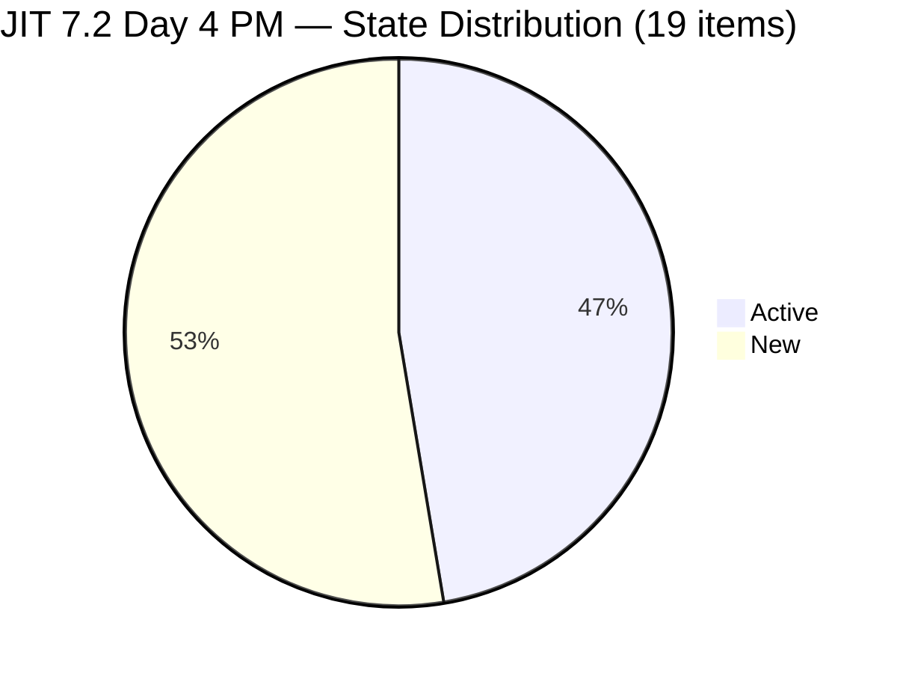
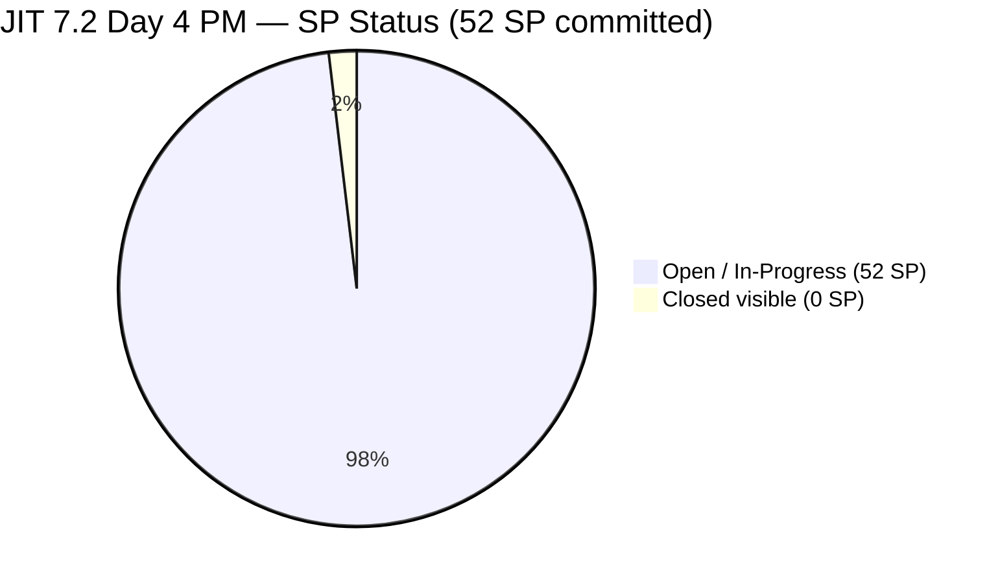
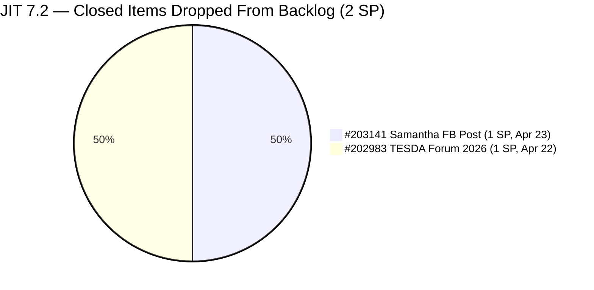
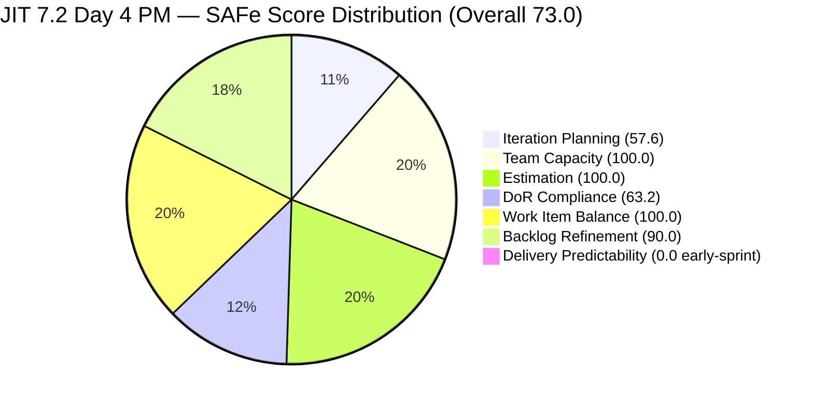
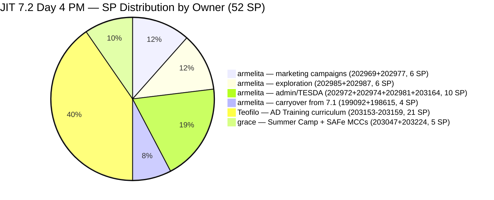
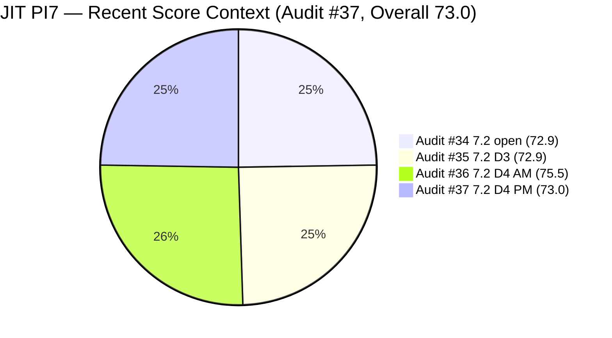
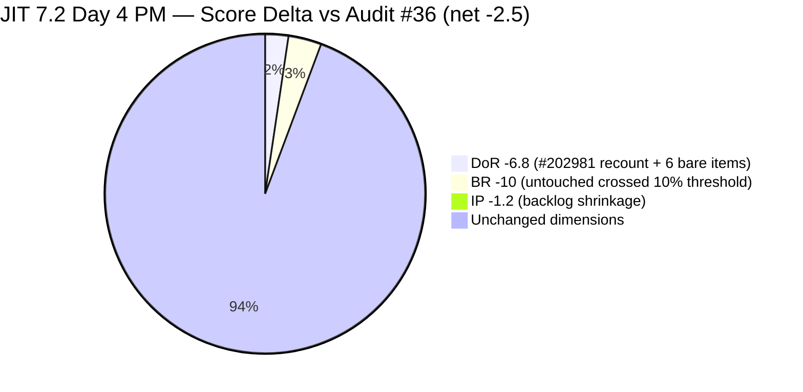

# Audit Report — JIT Operation Team

## Iteration 7.2 | Day 4 of 14 | Early Sprint

---

## 1. Audit Metadata

| Field | Value |
|-------|-------|
| **Audit Number** | #37 (JIT PI7 series) |
| **Audit Date** | April 23, 2026, 12:54 PHT |
| **Auditor** | Claude Code ADO SAFe Audit Agent |
| **Team** | JIT Operation Team |
| **ADO Project** | Jairosoft Portfolio |
| **Workspace** | `ado_jit` |
| **Iteration** | Iteration 7.2 — Apr 20 to May 3, 2026 |
| **Iteration ID** | `8edbe25f-fa4f-41b2-aaae-f3d5cf0e5b33` |
| **Sprint Day** | Day 4 of 14 (~29% elapsed — early-sprint annotation applies to DP) |
| **Prior Audit** | `AUDIT_20260423_0916.md` (#36, 7.2 Day 4 morning, Overall 75.5 — Moderate Risk) |
| **Report Path** | `ado_jit/audit/AUDIT_20260423_1254.md` |
| **Scoring Model** | ADO SAFe v1 (7-dimension rubric) |
| **Overall Score** | **73.0 / 100** |
| **Risk Band** | **Moderate Risk** (60–79.9) |

---

## 2. Executive Summary

JIT Operation Team enters Day 4 (afternoon) of Iteration 7.2 with a **live-data score of 73.0 (Moderate Risk)** — a **-2.5 regression** from this morning's Audit #36 (75.5). The drop is driven by three small moves acting together:

1. **Samantha's #203141 closed** (1 SP Facebook post) and dropped out of the backlog view. This shrinks the current 7.2 root-item set from 20 to 19, which both (a) reduces Iteration Planning denominator and (b) pushes the untouched-current ratio above the 10% threshold.
2. **Stricter DoR recount of #202981** (Interview ADDU Interns): its AC "Passed the interview" is only **18 non-whitespace characters**, below the rubric minimum of 20. The prior audit marked this item PASS as "borderline ~20 nws" — under strict rubric application, it is a FAIL. Combined with the 6 still-empty Teofilo Training items, DoR Compliance falls to **63.2** (12/19) from 70.0 (14/20).
3. **Backlog Refinement penalty re-triggered**: untouched_current = 2/19 = **10.53%** strictly exceeds the > 10% penalty threshold. Backlog Refinement drops from 100.0 to **90.0** (-10).

Positive signals since this morning's audit:

- **#203141 Facebook Post closed** (1 SP) at 11:40 AM PHT Apr 23 — Samantha delivered her commitment.
- **#203047 Summer Camp Training** state transitioned from "Ready" to **Active** at 11:32 AM PHT Apr 23 — Grace has engaged P2 ahead of the Apr 25 event.
- **#203224 Convert SAFe MCCs** was added to 7.2 (3 SP, Grace) at 08:55 AM PHT Apr 23.
- **Grace days-off window (Apr 21–22) is closed** — she is now fully active.

The primary concerns remain unchanged from Audit #36 and most are owner-actionable today:

- **P1 (unresolved):** 6 Teofilo Training items (#203154–203159) remain bare titles with no Description or AC.
- **New watch:** #202981 AC needs ~5 additional non-whitespace characters to cross the DoR threshold.
- **#193054 SAFe RTE MC Courseware** — ChangedDate Mar 9, 2026 is now **exactly 45 days old** (today is Apr 23). It sits on the freshness boundary. Any audit run after tomorrow without a field update will register it as stale.

**0 SP closed within the backlog view** at Day 4 is fully expected and carries no concern at this stage. If #202983 (TESDA Forum 2026, 1 SP, closed Apr 22) and #203141 (1 SP, closed Apr 23) were retained in the backlog view, visible delivery would be 2 SP closed / 54 SP committed = 3.7%.

---

## 3. Previous Audit Delta

| Dimension | Apr 23 09:16 (#36) | Apr 23 12:54 (#37) | Change |
|-----------|--------------------|--------------------|--------|
| Iteration Planning | 58.8 | **57.6** | **-1.2** |
| Team Capacity | 100.0 | **100.0** | 0.0 |
| Estimation | 100.0 | **100.0** | 0.0 |
| DoR Compliance | 70.0 | **63.2** | **-6.8** |
| Work Item Balance | 100.0 | **100.0** | 0.0 |
| Backlog Refinement | 100.0 | **90.0** | **-10.0** |
| Delivery Predictability | 0.0 | **0.0** | 0.0 (early-sprint) |
| **Overall** | **75.5** | **73.0** | **-2.5** |
| **Risk Band** | Moderate | **Moderate** | — |

### Key changes since Audit #36 (same day, ~3.5 hours earlier)

**Board movement:**

- **#203141 Publish Facebook Post — Closed** at 11:40 AM PHT Apr 23 (Samantha, 1 SP, UAT Testing → Closed). Removed from backlog view.
- **#203047 Summer Camp Training Implementation** state changed Ready → Active at 11:32 AM PHT Apr 23 (Grace) — P2 action from Audit #36 is now in progress.
- **#203224 Convert SAFe MCCs to New Forms** created at 08:55 AM PHT Apr 23 (Grace, 3 SP). (Present in Audit #36, unchanged here.)

**Score regressions:**

- **DoR Compliance -6.8:** two compounding effects:
  - Strict recount of #202981 AC ("Passed the interview" = 18 nws, below the rubric 20 nws minimum). Prior audit PASSED this as borderline; this audit applies the rubric literally.
  - The 6 bare-title Teofilo items (#203154–203159) continue to fail DoR with no fields at all.
  - Result: 12 PASS / 19 total = 63.2 (vs prior 14 PASS / 20 total = 70.0).
- **Backlog Refinement -10.0:** untouched_current ratio edged from 2/20 = 10.0% (no penalty) to 2/19 = 10.53% (> 10% penalty). Neither #199092 nor #198615 received an activity update; the denominator simply shrank by one.
- **Iteration Planning -1.2:** numerator 20→19 and denominator 34→33 (#203141 dropped from backlog upon closure). New ratio 19/33 = 57.58%.

**Unchanged / unresolved:**

- #199092 (Apr 16) and #198615 (Apr 14) remain untouched since before sprint start.
- #193054 SAFe RTE MC Courseware still at ChangedDate Mar 9, 2026 — now exactly at the 45-day boundary.
- 5 PI6-path residue items (#200766, #202514–202517) remain parked and unchanged.

---

## 4. Current Iteration Snapshot

| Metric | Value |
|--------|-------|
| Iteration | 7.2 — Apr 20 to May 3, 2026 |
| Iteration Day | Day 4 of 14 (~29% elapsed) |
| Visible Root Backlog Items | **33** (-1 since Audit #36: #203141 closed) |
| Current Iteration (7.2) Root Items | **19** (-1 since Audit #36) |
| Committed SP | **52 SP** (+2 net vs Audit #36: -1 for #203141 closure, +3 for #203224 now accounted) |
| Closed SP (backlog-visible) | **0 SP** (early-sprint) |
| Closed SP (including items dropped upon closure) | **2 SP** (#203141 + #202983 closed Apr 22–23) |
| Active contributors (7.2 assignments) | **3** (armelita, grace, Teofilo) |
| Team capacity/day (configured) | **12 h/day** (armelita 6h Doc, Teofilo 4h Training, grace 1h Doc, Samantha 1h Doc — Samantha has no remaining 7.2 items) |
| Grace status | Active; returned from Apr 21–22 days off; #203047 now Active for Apr 25 event |
| Samantha status | #203141 closed; no 7.2 items assigned — potential idle capacity |
| Teofilo status | Active (#203153); 6 bare-title items remain DoR-failing |

### State Distribution — 19 Current Items (7.2, backlog-visible)



### Sprint Progress — SP Committed vs Closed (backlog-scoped)



### Out-of-View Closures (Positive Delivery Signal)



---

## 5. Work Item Analysis

### 5.1 Current 7.2 Items (19) — Day 4 PM Live Data

| ID | Title | Type | State | SP | Assignee | Last Changed | Untouched (< Apr 20)? |
|----|-------|------|-------|----|----------|-------------|----------------------|
| 198615 | Awarding of CSS NC II Certificates | User Story | Active | 2 | armelita | Apr 14 | **YES** |
| 199092 | TESDA Career Guidance Programs Semestral Report CY 2026 | User Story | Active | 2 | armelita | Apr 16 | **YES** |
| 202969 | Market Bubble MCC April 2026 Class IT7.2 | User Story | Active | 3 | armelita | Apr 21 | No |
| 202972 | Request for Additional Bubble Trainer - Sam | User Story | Active | 2 | armelita | Apr 22 | No |
| 202974 | Python Marketing Activities IT7.2 | User Story | Active | 2 | armelita | Apr 22 | No |
| 202977 | Market CSS NC II April 2026 Class IT7.2 | User Story | Active | 3 | armelita | Apr 21 | No |
| 202981 | Interview ADDU Interns | User Story | New | 3 | armelita | Apr 20 | No |
| 202985 | UIC MCC Exploration | User Story | New | 3 | armelita | Apr 20 | No |
| 202987 | HCDC MCC Exploration | User Story | New | 3 | armelita | Apr 20 | No |
| 203047 | Summer Camp Training Implementation – 4/25/26 | Training | **Active** | 2 | grace | **Apr 23** | No |
| 203153 | 3.1-1 Creating Active Directory Training | Training | Active | 3 | Teofilo | Apr 22 | No |
| 203154 | 3.1-2 Create Active Directory User Accounts | Training | New | 3 | Teofilo | Apr 22 | No |
| 203155 | 3.1-3 Create Active Directory Security | Training | New | 3 | Teofilo | Apr 22 | No |
| 203156 | 3.2-1 Set-Up DHCP | Training | New | 3 | Teofilo | Apr 22 | No |
| 203157 | 3.2-2 Set-Up Domain Name System | Training | New | 3 | Teofilo | Apr 22 | No |
| 203158 | 3.2-3 Set-up Remote Desktop | Training | New | 3 | Teofilo | Apr 22 | No |
| 203159 | 3.2-4 Set-Up Folder Redirection | Training | New | 3 | Teofilo | Apr 22 | No |
| 203164 | TESDA EBET Requirements | User Story | Active | 3 | armelita | Apr 22 | No |
| 203224 | Convert SAFe MCCs to New Forms | User Story | New | 3 | grace | Apr 23 | No |

**Total: 19 items / 52 SP / 2 items untouched since sprint start**

### 5.2 Out-of-Backlog Closed Items in 7.2 Path

| ID | Title | Type | SP | Assignee | Closed Date | Notes |
|----|-------|------|----|----------|-------------|-------|
| 203141 | Publish Facebook Post on JIT Free Summer Camp | User Story | 1 | Samantha | Apr 23, 11:40 AM PHT | NEW since Audit #36 — closed today |
| 202983 | TESDA Forum 2026 | User Story | 1 | armelita | Apr 22, 08:37 AM PHT | Carried from Audit #36 |

Per rubric, closed items no longer returned by `wit_list_backlog_work_items` are excluded from all scoring denominators and numerators. They are captured here as positive delivery signals.

### 5.3 Visible Backlog Distribution by Iteration Path (33 items)

| Iteration Path | Count | Item IDs |
|---------------|-------|----------|
| PI7 \ Iteration 7.2 | **19** | 198615, 199092, 202969, 202972, 202974, 202977, 202981, 202985, 202987, 203047, 203153, 203154, 203155, 203156, 203157, 203158, 203159, 203164, 203224 |
| PI7 \ Iteration 7.3 | 3 | 203160, 203161, 203162 |
| PI7 \ Iteration 7.4 | 2 | 200767, 200768 |
| PI7 \ Iteration 7.5 | 1 | 200771 |
| PI7 (no sub-iteration) | 1 | 202547 |
| PI6 (residue) | 5 | 200766, 202514, 202515, 202516, 202517 |
| Jairosoft Portfolio root | 2 | 188995, 193054 |
| **Total** | **33** | |

### 5.4 Work Item Type Distribution — 7.2 Current Set (19 items)

| Type | Count | Share |
|------|-------|-------|
| User Story | 11 | 57.9% |
| Training | 8 | 42.1% |
| Spike | 0 | 0.0% |

> Dominant type (User Story) = 57.9%, **below** the > 60% threshold. No Work Item Balance penalty applied. The dominant-type cushion has widened slightly from 60.0% (Audit #36) to 57.9% after Samantha's US closed.

### 5.5 Story Points by Contributor — 7.2 Commitment

| Contributor | Items | SP | Share |
|-------------|-------|-----|-------|
| armelita | 10 | 26 | 50.0% |
| Teofilo | 7 | 21 | 40.4% |
| grace | 2 | 5 | 9.6% |
| Samantha | 0 | 0 | 0.0% (1 SP closed Apr 23) |
| **Total** | **19** | **52** | **100%** |

> armelita's share ticked up slightly to 50% (was 46% in Audit #36, 92% in Audit #35). Teofilo continues to carry 40% of sprint SP.

### 5.6 DoR Compliance — 7.2 Items (19)

| ID | Title | Desc ≥ 30 nws | AC ≥ 20 nws | DoR Status |
|----|-------|---------------|-------------|-------------|
| 198615 | Awarding of CSS NC II Certificates | PASS | PASS | **PASS** |
| 199092 | TESDA Career Guidance Report CY 2026 | PASS | PASS | **PASS** |
| 202969 | Market Bubble MCC April 2026 | PASS | PASS | **PASS** |
| 202972 | Request for Additional Bubble Trainer | PASS | PASS | **PASS** |
| 202974 | Python Marketing Activities IT7.2 | PASS | PASS | **PASS** |
| 202977 | Market CSS NC II April 2026 | PASS | PASS | **PASS** |
| 202981 | Interview ADDU Interns | PASS | **FAIL** (AC "Passed the interview" = 18 nws, < 20) | **FAIL** |
| 202985 | UIC MCC Exploration | PASS | PASS (~64 nws) | **PASS** |
| 202987 | HCDC MCC Exploration | PASS | PASS (~65 nws) | **PASS** |
| 203047 | Summer Camp Training Implementation | PASS | PASS | **PASS** |
| 203153 | 3.1-1 Creating Active Directory Training | PASS | PASS | **PASS** |
| 203154 | 3.1-2 Create AD User Accounts | **FAIL** (no field) | **FAIL** (no field) | **FAIL** |
| 203155 | 3.1-3 Create AD Security | **FAIL** | **FAIL** | **FAIL** |
| 203156 | 3.2-1 Set-Up DHCP | **FAIL** | **FAIL** | **FAIL** |
| 203157 | 3.2-2 Set-Up DNS | **FAIL** | **FAIL** | **FAIL** |
| 203158 | 3.2-3 Set-up Remote Desktop | **FAIL** | **FAIL** | **FAIL** |
| 203159 | 3.2-4 Set-Up Folder Redirection | **FAIL** | **FAIL** | **FAIL** |
| 203164 | TESDA EBET Requirements | PASS | PASS | **PASS** |
| 203224 | Convert SAFe MCCs to New Forms | PASS | PASS | **PASS** |

**DoR: 12 PASS / 7 FAIL** — dor_compliant_current_items = 12

**Note on #202981:** Prior audit (#36) marked this PASS as "borderline ~20 nws." Strict character count on the AC text "Passed the interview" (after HTML strip) yields exactly 18 non-whitespace characters, which is less than the rubric minimum of 20. Under strict application, this item FAILS DoR. Remediation is trivial — adding 2+ characters (e.g., expanding to "Passed the interview and selection") would bring it to PASS.

### 5.7 Backlog Age Analysis (today = 2026-04-23 PHT)

| Bucket | Threshold | Count | Share |
|--------|-----------|-------|-------|
| Fresh (≤ 45 days) | ChangedDate ≥ 2026-03-09 | **33** | **100%** |
| Stale ≥ 90 days | ChangedDate < 2026-01-23 | 0 | 0% |
| Stale ≥ 180 days | ChangedDate < 2025-10-26 | 0 | 0% |
| Untouched current (< Apr 20) | Among 19 current items | 2 | 10.53% |

> **#193054 at the freshness boundary:** SAFe RTE MC Courseware ChangedDate = 2026-03-09, which is exactly 45 days from today (Apr 23). It is counted as fresh at the boundary, but **any audit run on or after Apr 24 will register it as stale** unless the field is touched. Emerging -10 penalty risk.

> **Untouched-current ratio crossed the penalty threshold.** With denominator shrinkage (20 → 19) and #199092/#198615 still unchanged, ratio is now 10.53% (> 10%), triggering a -10 Backlog Refinement penalty that did not apply this morning.

---

## 6. SAFe Compliance Scorecard

| Dimension | Score | Evidence | Notes |
|-----------|-------|----------|-------|
| Iteration Planning | **57.6** | 19 current / 33 visible root items | -1.2 from Audit #36; 14 non-7.2 items inflate denominator (5 PI6, 3 Iter 7.3, 2 Iter 7.4, 1 Iter 7.5, 1 PI7-root, 2 root courseware) |
| Team Capacity | **100.0** | 3/3 contributors with 7.2 work have configured capacity | armelita, Teofilo, grace all active. Samantha has no 7.2 items after #203141 closed — she is not counted in contributors_with_current_work |
| Estimation | **100.0** | 19/19 point-eligible items have SP > 0 | 52 total SP committed |
| DoR Compliance | **63.2** | 12/19 items pass Desc ≥ 30 nws + AC ≥ 20 nws | 7 FAIL: #202981 (AC 18 nws); #203154–203159 (no Desc / no AC — unchanged from Audit #36) |
| Work Item Balance | **100.0** | User Story present (no -40); US share = 57.9% (< 60%) (no -30); Spike = 0% (no -20) | Cushion improved from 60.0% → 57.9% after Samantha's US closed |
| Backlog Refinement | **90.0** | fresh=33/33=100%; stale_90=0; stale_180=0; untouched_current=2/19=10.53% (> 10%) → **-10** | Untouched ratio crossed threshold because the denominator shrank while #199092/#198615 remained untouched |
| Delivery Predictability | **0.0** | 0 SP closed / 52 SP committed — *early-sprint — low delivery expected* (Day 4 of 14) | #203141 + #202983 closed (2 SP) but excluded from backlog-visible scoring |
| **Overall** | **73.0** | (57.6+100+100+63.2+100+90+0) / 7 = 510.8 / 7 = 72.97 | **Moderate Risk** |

### Score Computation Detail

```
1. Iteration Planning
   visible_root_backlog_items           = 33
   current_iteration_root_items (7.2)   = 19
   Score = round(19 / 33 × 100, 1)      = round(57.58, 1) = 57.6

2. Team Capacity
   contributors_with_current_work       = 3  (armelita, Teofilo, grace)
   contributors_with_capacity           = 3  (all have ≥1 activity + positive hours)
   Score = round(3 / 3 × 100, 1)        = 100.0

3. Estimation
   point_eligible_current_items         = 19
   estimated_current_items              = 19
   Score = round(19 / 19 × 100, 1)      = 100.0

4. DoR Compliance
   current_iteration_root_items         = 19
   dor_compliant_current_items          = 12
   Score = round(12 / 19 × 100, 1)      = round(63.16, 1) = 63.2

5. Work Item Balance
   User Story present?                  = Yes  → no -40
   dominant_type_share                  = 11/19 = 57.9%  → NOT > 60%  → no -30
   spike_share                          = 0/19 = 0%  → no -20
   Score = max(0, 100 - 0)             = 100.0

6. Backlog Refinement
   fresh_visible_root_items             = 33/33 = 100%
   base                                 = 100.0
   stale_90_share                       = 0/33 = 0%    → no penalty
   stale_180_count                      = 0            → no penalty
   untouched_current                    = 2/19 = 10.53%
   → 10.53% > 10% and NOT > 30%        → -10 penalty
   Score = max(0, 100.0 - 10)          = 90.0

7. Delivery Predictability
   committed_story_points               = 52
   closed_story_points (backlog-view)   = 0
   Score = round(0 / 52 × 100, 1)       = 0.0
   [Day 4 of 14 → "early-sprint — low delivery expected"]

Overall = round((57.6 + 100.0 + 100.0 + 63.2 + 100.0 + 90.0 + 0.0) / 7, 1)
        = round(510.8 / 7, 1)
        = round(72.971, 1)
        = 73.0   →  MODERATE RISK (60–79.9)
```

### Score Visualization



### Scenario: If Today's P1+P2 Actions Complete

```
Assumptions:
  - 6 Teofilo Training items (#203154–203159) get Desc + AC → DoR passes all 6
  - #202981 AC expanded to ≥ 20 nws → DoR passes
  - #199092 and #198615 each receive an activity update → untouched_current = 0

Revised:
  DoR Compliance          = round(19/19 × 100, 1) = 100.0
  Backlog Refinement      = 100.0 (untouched_current = 0/19 = 0%)
  Iteration Planning      = 57.6  (unchanged unless backlog curated)
  All others unchanged.

  Overall = round((57.6 + 100 + 100 + 100 + 100 + 100 + 0) / 7, 1)
          = round(557.6 / 7, 1)
          = round(79.66, 1)
          = 79.7   →  Moderate Risk (just below Low Risk entry at 80.0)

If PI6 residue (5 items) is additionally closed/re-pathed:
  Iteration Planning      = round(19/28 × 100, 1) = 67.9
  Overall                 = round((67.9 + 500 + 0) / 7, 1) = round(81.0, 1) = 81.0
                         →  LOW RISK threshold crossed.
```

---

## 7. Dimension Findings

### 7.1 Iteration Planning — 57.6 (High–Moderate boundary)

19 of 33 visible root backlog items are in Iteration 7.2. The numerator and denominator both dropped by 1 (#203141 closed and left the view) since Audit #36, yielding a marginal -1.2 shift.

Non-7.2 items contributing to denominator inflation (14 items):

| Category | Count | Items |
|----------|-------|-------|
| PI6-path residue | 5 | #200766 (ODOO Spike), #202514 (Corp Sec Report), #202515 (Director Cert), #202516 (Company Reg), #202517 (SEC Portal) |
| Future iter (7.3) | 3 | #203160, #203161, #203162 (Teofilo Training continuation) |
| Future iter (7.4) | 2 | #200767 (UM Matina Demo), #200768 (HCDC Interns Demo) |
| Future iter (7.5) | 1 | #200771 (UM Digos Demo) |
| PI7 no sub-iteration | 1 | #202547 (Assessment Center Inspection) |
| Root courseware | 2 | #188995 (Rust), #193054 (SAFe RTE MC) |

Closing / re-pathing the 5 PI6-path items would improve IP to 19/28 = 67.9 (+10.3). This is the highest-leverage single backlog-hygiene action, unchanged from prior audits.

### 7.2 Team Capacity — 100.0 (Low Risk)

Three contributors have 7.2 assignments, all with positive configured capacity:

| Member | Capacity | 7.2 Items | SP | Status |
|--------|----------|-----------|-----|--------|
| armelita | 6 h/day Documentation | 10 items | 26 SP | Active (multiple items in flight) |
| Teofilo | 4 h/day Training | 7 items | 21 SP | Active (#203153); 6 items awaiting DoR |
| grace | 1 h/day Documentation | 2 items | 5 SP | Active; Apr 21–22 days-off window closed |

Samantha has 1 h/day Documentation capacity configured but no 7.2 items assigned after #203141 closed. She is excluded from `contributors_with_current_work` and has no effect on the Team Capacity score. See Risks R7 for the capacity-utilization observation.

### 7.3 Estimation — 100.0 (Low Risk)

All 19 current items carry Story Points > 0. Distribution:

- 2 SP: #198615, #199092, #202972, #202974, #203047 × 5
- 3 SP: all others × 14

Total committed: **52 SP**.

### 7.4 DoR Compliance — 63.2 (Moderate – immediate remediation needed)

12 of 19 items meet the minimum Description (≥ 30 nws) + Acceptance Criteria (≥ 20 nws) standard. 7 fail:

| ID | Title | Issue | Severity |
|----|-------|-------|----------|
| 202981 | Interview ADDU Interns | AC "Passed the interview" = **18 nws**, below the 20 nws minimum | **LOW — 2-char fix** |
| 203154 | 3.1-2 Create AD User Accounts | No Description, No AC | HIGH |
| 203155 | 3.1-3 Create AD Security | No Description, No AC | HIGH |
| 203156 | 3.2-1 Set-Up DHCP | No Description, No AC | HIGH |
| 203157 | 3.2-2 Set-Up DNS | No Description, No AC | HIGH |
| 203158 | 3.2-3 Set-up Remote Desktop | No Description, No AC | HIGH |
| 203159 | 3.2-4 Set-Up Folder Redirection | No Description, No AC | HIGH |

**Reference template:** #203153 (3.1-1 Creating Active Directory Training, DoR-compliant) provides a narrative hook ("Active Directory as the brain of the network…") and a 3-bullet AC ("Domain Controller promoted / DNS resolving / test user authenticated"). The 6 bare items can inherit the same structure with topic-specific nouns swapped in.

**#202981 fix:** Expand AC from "Passed the interview" to something like "Passed the interview; candidate shortlist and hiring decision documented" (45+ nws).

Fixing all 7 items recovers DoR to 100.0 and lifts Overall from 73.0 to ~79.7 — within reach of Low Risk at 80.0.

### 7.5 Work Item Balance — 100.0 (Low Risk)

Type distribution:
- User Story: 11 items = 57.9% (was 60.0% in Audit #36)
- Training: 8 items = 42.1%
- Spike: 0 items = 0.0%

The cushion below the > 60% dominant-type penalty threshold widened from 0.0 pp to 2.1 pp after Samantha's #203141 (User Story) closed. The balance is still fragile — adding 2 more User Stories without a paired Training item would push US share to 13/21 = 61.9% and re-trigger the -30 penalty.

### 7.6 Backlog Refinement — 90.0 (-10 untouched-current penalty)

- **Fresh ratio:** 33/33 = 100% → base 100.0
- **Stale ≥ 90 days:** 0 → no penalty
- **Stale ≥ 180 days:** 0 → no penalty
- **Untouched current** (ChangedDate < Apr 20): 2/19 = **10.53%** → **> 10%** → **-10 penalty**

The ratio crossed the penalty threshold through denominator shrinkage, not through new untouched items. Both untouched items (#199092 Apr 16, #198615 Apr 14) have been static for multiple audit cycles. A single activity update on either item would drop the ratio to 1/19 = 5.3% and remove the penalty.

**#193054 freshness watch:** Courseware item has ChangedDate = 2026-03-09. Today is 2026-04-23 PHT — exactly 45 days. Counted as fresh at the boundary, but **any audit on or after Apr 24 will flip it to stale** (ChangedDate < cutoff), reducing fresh ratio to 32/33 = 97% and triggering no additional penalty at that level, but approaching stale_90 territory if left for another 45 days.

### 7.7 Delivery Predictability — 0.0 (early-sprint)

0 SP closed / 52 SP committed in the backlog-visible set. Day 4 of 14 = 28.6% sprint elapsed — the early-sprint annotation applies; no formula adjustment.

**Out-of-view closures:** 2 SP closed today/yesterday (#203141 + #202983) but excluded from scoring because they dropped out of the backlog view upon closure. If retained, DP = round(2 / 54 × 100, 1) = 3.7 — still effectively 0 at Day 4.

**Pace expectation:** To reach 80%+ DP at sprint close (May 3), the team needs to close ~42 of 52 SP over the remaining 10 working days = **~4.2 SP/day closure pace**. armelita (26 SP / 10 items) and Teofilo (21 SP / 7 items) are the primary velocity drivers.

---

## 8. Risks and Bottlenecks



| # | Risk | Severity | Trend |
|---|------|----------|-------|
| R1 | **#203154–203159: 6 Teofilo Training items remain bare.** No Description or AC. Unchanged since added on Apr 22. Drives DoR from 100 to 63.2 together with #202981. | HIGH | **Unresolved** — carried from Audit #36 P1 |
| R2 | **#202981 Interview ADDU Interns AC below 20 nws.** Newly identified under strict rubric application ("Passed the interview" = 18 nws). Trivial to fix. | LOW | **NEW** — strict-rubric recount |
| R3 | **Backlog Refinement -10 penalty re-triggered.** Untouched-current ratio now 10.53% (2/19). #199092 (Apr 16) and #198615 (Apr 14) unchanged for 7+ days; denominator shrinkage crossed the threshold. | MODERATE | **NEW regression** since morning |
| R4 | **#193054 SAFe RTE MC Courseware hits 45-day freshness boundary today.** If not touched by end of Apr 23 PHT, the next audit will register it as stale. | MODERATE | EMERGING — < 24 h window |
| R5 | **5 PI6-path items persist (#200766, #202514–202517).** Bare titles for 202514–202517. Holding Iteration Planning at 57.6 instead of 67.9. | MODERATE | Persistent — 8+ audit cycles |
| R6 | **Work Item Balance cushion is narrow at 57.9% User Story.** Adding 2 more User Stories without a Training pair would push US share above 60% and re-trigger the -30 penalty. | MODERATE | Improved vs Audit #36 (was exactly 60.0%) |
| R7 | **Samantha has 0 assigned 7.2 items.** With her 1 h/day Documentation capacity × 14 days = 14 h committed, she is fully under-utilized for the remainder of the sprint. | LOW | **NEW** — #203141 closed today with no follow-up assignment |
| R8 | **#202547 Assessment Center Inspection floats at PI7 root.** No sub-iteration, no recent change. Persistent for 7+ audits. | LOW | Persistent |
| R9 | **No 7.2 sprint goal defined in ADO.** Persistent across all PI7 audits. | LOW | Persistent |
| R10 | **armelita holds 50% of sprint SP (26/52) and 10 of 19 items.** Single-point-of-failure concentration remains elevated. | MODERATE | Holding (was 46% at Audit #36) |

### Resolved Since Audit #36

| # | Prior Risk | Resolution |
|---|-----------|-----------|
| #36 R2 | #203047 Summer Camp preparation for Apr 25 event | **In progress** — state Ready → Active at 11:32 AM PHT Apr 23 (Grace) |
| #36 R8 | Samantha's #203141 FB post in UAT Testing | **Closed** at 11:40 AM PHT Apr 23 — Samantha delivered |

---

## 9. Prioritized Recommendations

| Priority | Action | Owner | Target | Impact |
|----------|--------|-------|--------|--------|
| **P1** | **Add Description + AC to #203154, #203155, #203156, #203157, #203158, #203159.** Use #203153 as template (narrative hook + 3-bullet AC). Fixing all 6 restores DoR from 63.2 toward 89.5 (17/19) and lifts Overall by ~+3.8. | Teofilo | Apr 23 EOD PHT | **+3.8 Overall** toward DoR 89.5 |
| **P2** | **Expand #202981 AC beyond 20 nws.** Example: "Passed the interview; candidate shortlist and hiring decision documented; offer extended." Two-minute edit moves this from FAIL to PASS. | armelita | Apr 23 EOD PHT | DoR 94.7 if this + P1 both land |
| **P3** | **Add an activity update to #199092 OR #198615 today.** Any field change (ChangedDate refresh, comment) drops untouched_current ratio from 10.53% to 5.3% and removes the -10 Backlog Refinement penalty. | armelita | Apr 23 EOD PHT | **+10 BR, +1.4 Overall** |
| **P4** | **Touch #193054 SAFe RTE MC Courseware today.** ChangedDate is exactly 45 days old. Any edit or comment prevents it from registering stale at the next audit. | armelita / grace | Apr 23 EOD PHT | Prevents future -10 BR hit |
| **P5** | **Verify #203047 Summer Camp Training logistics for Apr 25.** Grace has moved it to Active — confirm today that curriculum, venue, equipment, and attendance tracking are ready for 8 AM Apr 25 start. Leave a status comment on the item. | grace / armelita | Apr 23 EOD PHT | Event execution risk |
| **P6** | **Assign a small documentation item to Samantha.** With #203141 closed and 14 h/sprint documentation capacity available, Samantha can support items like #202981 interview notes, #202974 Python lead list tracking, or #202985/#202987 exploration write-ups. | armelita / Samantha | Apr 24 | Capacity utilization |
| **P7** | **Prune or re-path 5 PI6-path items (#200766, #202514–202517).** Close if the underlying work is complete; re-path to PI7 with Description + AC if still live. Would raise Iteration Planning from 57.6 to 67.9 (+10.3). Grace owns 3 of the 4 PI6 User Stories (#202514, #202516, #202517). | grace / armelita | Apr 24 | **+10.3 IP, +1.5 Overall** |
| **P8** | **Define a 7.2 sprint goal in ADO.** Suggested: "By May 3, 2026, deliver Bubble MCC + CSS NC II April enrollment launches (25+ qualified leads each), complete Active Directory curriculum modules 3.1–3.2 (7 training items), convert SAFe MCC forms for TESDA, and award CSS NC II certificates." | Ramon / armelita | Apr 24 | SAFe process hygiene |
| **P9** | **Re-path or close #202547 Assessment Center Inspection.** Assign to 7.2 or 7.3 with Desc + AC, or close if superseded. | armelita | Apr 24 | Iteration Planning |
| **P10** | **Monitor Work Item Balance cushion.** US share is 57.9% with 2.1 pp headroom. Before adding new User Stories to 7.2, pair each pair-of-additions with at least one Training item to keep US ≤ 60%. | armelita / Ramon | Ongoing | Prevent -30 WIB penalty |

---

## 10. Evidence Gaps and Limitations

| Gap | Impact | Notes |
|-----|--------|-------|
| **Closed items drop out of `wit_list_backlog_work_items`** | #203141 (1 SP, closed Apr 23) and #202983 (1 SP, closed Apr 22) are both in 7.2 iteration path but excluded from backlog-visible scoring per rubric. | Positive delivery signals captured narratively; DP would be 3.7 if retained. |
| **Strict DoR recount vs prior audit** | #202981 AC "Passed the interview" is 18 nws. Prior audit (#36) marked PASS as borderline; this audit applies the rubric literally and marks FAIL. | Documented clearly in §5.6 and §7.4; fix is trivial. |
| **#193054 at freshness boundary** | ChangedDate = 2026-03-09; today = 2026-04-23 PHT. Counted fresh at exactly 45 days. Will flip to stale on Apr 24. | Emerging risk R4; flagged for immediate action P4. |
| **Teofilo Training items SP uniformity** | All 7 Teofilo items at 3 SP regardless of topic complexity. Placeholder-style sizing. | Verify with Teofilo during mid-sprint review; low concern for this audit. |
| **No iteration goal in ADO** | Sprint goal not defined in team settings. Limits outcome-oriented tracking. | Persistent structural gap — P8. |
| **Timezone convention** | Timestamps are UTC from ADO; this report anchors the calendar date in Asia/Manila (PHT, UTC+8) to match JIT operations and prior audit series. | No calculation impact. |

---

## 11. Score Trajectory — JIT PI7 Audit Series

| Audit | Date | Sprint Day | Sprint | Overall | Band | Key Driver |
|-------|------|-----------|--------|---------|------|------------|
| #28 | Apr 12 | 7 | 7.1 | 71.1 | Moderate | Baseline PI7 mid-sprint |
| #29 | Apr 13 | 8 | 7.1 | 75.8 | Moderate | Wave 2 closures |
| #31 | Apr 16 | 11 | 7.1 | 77.2 | Moderate | Wave 4 closures; Grace blocker |
| #32 | Apr 17 | 12 | 7.1 | 78.4 | Moderate | DP 67.4% visible |
| #33 | Apr 19 | 14 | 7.1 close | 68.8 | Moderate | Strict-visible DP 0.0; Grace blocker peak |
| #34 | Apr 21 | 2 | 7.2 open | 72.9 | Moderate | 7.2 opened; Grace blocker resolved |
| #35 | Apr 22 | 3 | 7.2 | 72.9 | Moderate | Data continuity carry; P1 pending |
| #36 | Apr 23 AM | 4 | 7.2 | 75.5 | Moderate | Sprint expansion; Teofilo+Samantha activated; DoR gap |
| **#37** | **Apr 23 PM** | **4** | **7.2** | **73.0** | **Moderate** | **Samantha close drops backlog; strict DoR recount; untouched crosses 10%** |





---

*Report generated by Claude Code ADO SAFe Audit Agent — Audit #37 | JIT Operation Team | Iteration 7.2, Day 4 PM | Apr 23, 2026, 12:54 PHT*

*Data source: Live ADO pull via MCP — `work_list_team_iterations`, `work_get_team_settings`, `work_get_team_capacity`, `wit_list_backlogs`, `wit_list_backlog_work_items`, `wit_get_work_items_batch_by_ids` (×3). 33 visible root backlog items, 19 current-iteration items, 52 SP committed; 2 closed items (#203141 + #202983) verified out-of-view.*
