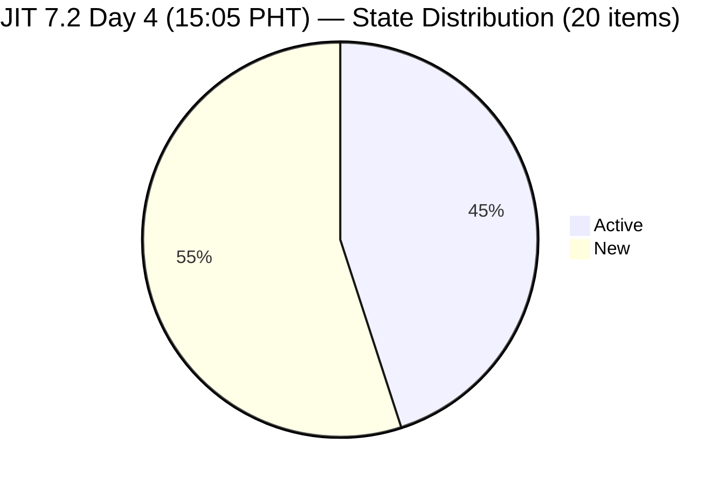
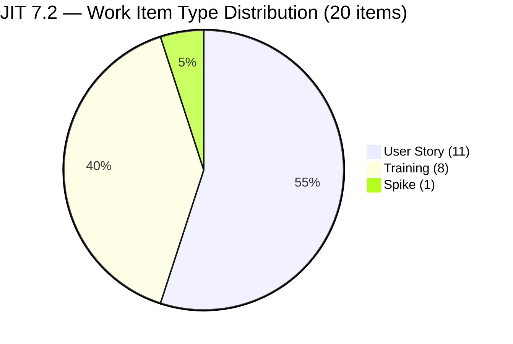
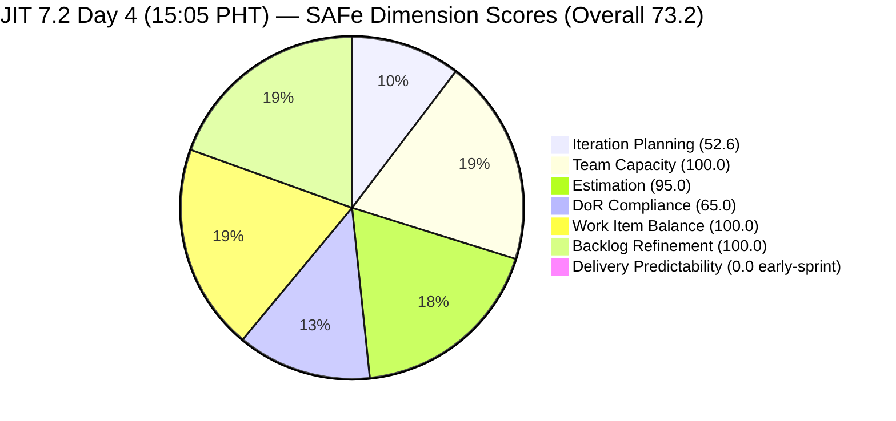
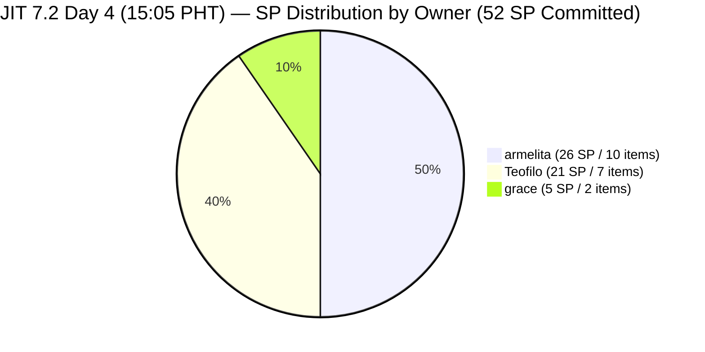
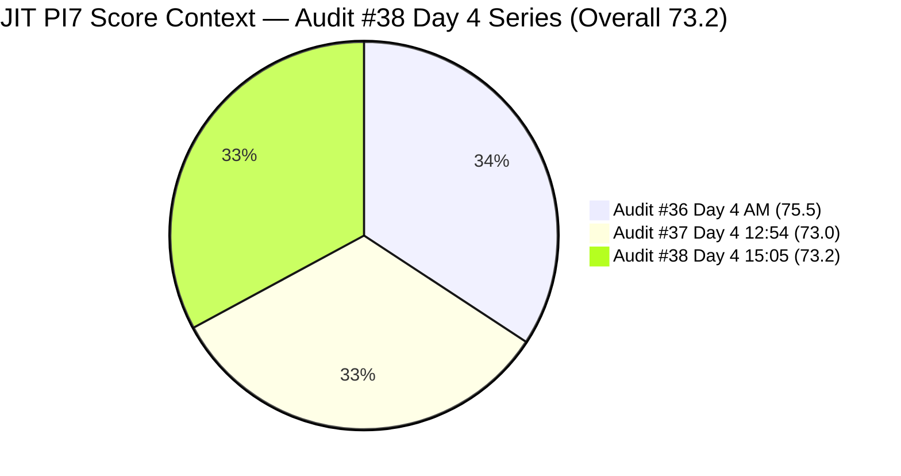
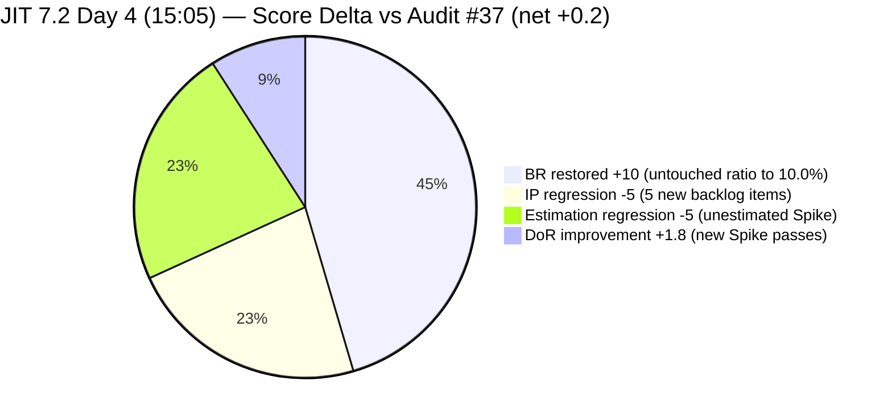

# Audit Report — JIT Operation Team

## Iteration 7.2 | Day 4 of 14 | Early Sprint

---

## 1. Audit Metadata

| Field | Value |
|-------|-------|
| **Audit Number** | #38 (JIT PI7 series) |
| **Audit Date** | April 23, 2026, 15:05 PHT |
| **Auditor** | Claude Code ADO SAFe Audit Agent |
| **Team** | JIT Operation Team |
| **ADO Project** | Jairosoft Portfolio |
| **Workspace** | `ado_jit` |
| **Iteration** | Iteration 7.2 — Apr 20 to May 3, 2026 |
| **Iteration ID** | `8edbe25f-fa4f-41b2-aaae-f3d5cf0e5b33` |
| **Sprint Day** | Day 4 of 14 (~29% elapsed — early-sprint annotation applies to DP) |
| **Prior Audit** | `AUDIT_20260423_1254.md` (Audit #37, 7.2 Day 4 12:54 PHT, Overall 73.0 — Moderate Risk) |
| **Report Path** | `ado_jit/audit/AUDIT_20260423_1505.md` |
| **Scoring Model** | ADO SAFe v1 (7-dimension rubric) |
| **Overall Score** | **73.2 / 100** |
| **Risk Band** | **Moderate Risk** (60–79.9) |

---

## 2. Executive Summary

JIT Operation Team registers **73.2 (Moderate Risk)** at Day 4 afternoon — a marginal **+0.2 improvement** from Audit #37 (73.0). Two opposing forces largely cancel each other out:

**Positive developments since Audit #37 (12:54 PHT):**

- **Backlog Refinement rebounds to 100.0 (+10.0):** The addition of a new item (#203241, Spike, 7.2) expanded the current iteration count from 19 to 20. The untouched-current ratio dropped from 10.53% (2/19) to exactly 10.0% (2/20), which is NOT strictly greater than 10% — the -10 penalty no longer applies.
- **DoR improves to 65.0 (+1.8):** #203241 has a substantive Description and AC and passes DoR, bringing the compliant count from 12/19 to 13/20.
- **#202985 (UIC MCC Exploration)** received an activity update at Apr 23 06:51 UTC — now confirmed Active.

**Regressions since Audit #37:**

- **Iteration Planning drops to 52.6 (-5.0):** Five new items (203241–203245) were added to the backlog, expanding visible_root from 33 to 38. Only one (203241) is in 7.2; the other four are spread across 7.3, 7.4, and 7.5. This inflates the denominator while the numerator grows by only 1.
- **Estimation drops to 95.0 (-5.0):** #203241 (Spike) was added to 7.2 with no Story Points set — this is the first unestimated item in the current iteration, breaking the previous 100% estimation streak.

**Persistent concerns unchanged from Audit #37:**
- Six Teofilo Training items (#203154–203159) remain bare titles with no Description or AC — the single largest DoR gap.
- #202981 (Interview ADDU Interns) AC remains at 18 nws — 2 characters below the rubric minimum.
- #199092 and #198615 remain untouched since Apr 16 and Apr 14 respectively — they sit at exactly the 10.0% threshold. Adding any single item to 7.2 without touching these would keep the ratio at ≤ 10%; removing any 7.2 item would re-trigger the penalty.
- Delivery Predictability = 0.0 (early-sprint; no SP closed in backlog-visible scope since Audit #37).

---

## 3. Previous Audit Delta

| Dimension | Audit #37 (Apr 23, 12:54 PHT) | Audit #38 (Apr 23, 15:05 PHT) | Change |
|-----------|-------------------------------|-------------------------------|--------|
| Iteration Planning | 57.6 | **52.6** | **-5.0** (5 new items in backlog; only 1 in 7.2) |
| Team Capacity | 100.0 | **100.0** | 0.0 |
| Estimation | 100.0 | **95.0** | **-5.0** (#203241 added to 7.2 with no SP) |
| DoR Compliance | 63.2 | **65.0** | **+1.8** (#203241 passes DoR; denominator +1) |
| Work Item Balance | 100.0 | **100.0** | 0.0 |
| Backlog Refinement | 90.0 | **100.0** | **+10.0** (untouched ratio dropped from 10.53% to 10.0%) |
| Delivery Predictability | 0.0 | **0.0** | 0.0 (early-sprint; no new closures) |
| **Overall** | **73.0** | **73.2** | **+0.2** |
| **Risk Band** | Moderate | **Moderate** | — |

### Key Changes Since Audit #37 (2h11m elapsed)

**New items added:**
- **#203241 IT7.2 Tech Talk — AI Tools Demonstration** — Spike, Iteration 7.2, no assignee, no SP, ChangedDate Apr 23 05:08 UTC. Has Description and AC (DoR-compliant).
- **#203242 IT7.3 Tech Talk** — Spike, Iteration 7.3 (not current)
- **#203243 IT7.4 Tech Talk** — Spike, Iteration 7.4 (not current)
- **#203244 IT7.5 Tech Talk** — Spike, Iteration 7.5 (not current)
- **#203245 IT7.6 Tech Talk** — Spike, Iteration 7.5 (not current)

**State changes:**
- **#202985 (UIC MCC Exploration)** — ChangedDate updated to Apr 23 06:51 UTC; confirmed Active.

**No closures** since Audit #37. Backlog-visible closed SP remains at 0.

---

## 4. Current Iteration Snapshot

| Metric | Value |
|--------|-------|
| Iteration | 7.2 — Apr 20 to May 3, 2026 |
| Iteration Day | Day 4 of 14 (~29% elapsed) |
| Visible Root Backlog Items | **38** (+5 since Audit #37: #203241–203245 added) |
| Current Iteration (7.2) Root Items | **20** (+1: #203241) |
| Committed SP (estimated 7.2 items) | **52 SP** (unchanged; #203241 has no SP) |
| Closed SP (backlog-visible) | **0 SP** (early-sprint) |
| Closed SP (including items dropped on closure) | **2 SP** (#203141 Apr 23 + #202983 Apr 22) |
| Point-eligible current items | **20** (all with SP field exposed) |
| Estimated items (SP > 0) | **19** (#203241 has SP = null) |
| Contributors with current work (7.2 items with assignee) | **3** (armelita, Teofilo, grace) |
| Team capacity/day (configured) | **12 h/day** (armelita 6h, Teofilo 4h, grace 1h, Samantha 1h) |
| Samantha status | No 7.2 items — idle capacity after #203141 closed |
| Grace status | Active; #203047 Summer Camp (Apr 25 event) in flight |
| Teofilo status | Active (#203153); 6 bare-title items still DoR-failing |
| Untouched current items (ChangedDate < Apr 20) | **2** (#199092 Apr 16, #198615 Apr 14) = 10.0% of 20 |
| Working days remaining | 10 (Apr 24 – May 3, including May 1 holiday context TBD) |

### State Distribution — 20 Current Items (7.2)



### Work Item Type Distribution — 20 Current Items (7.2)



---

## 5. Work Item Analysis

### 5.1 Current 7.2 Items (20) — Day 4 15:05 PHT Live Data

| ID | Title | Type | State | SP | Assignee | Last Changed | Untouched (<Apr 20)? |
|----|-------|------|-------|----|----------|-------------|----------------------|
| 198615 | Awarding of CSS NC II Certificates | US | Active | 2 | armelita | Apr 14 | **YES** |
| 199092 | TESDA Career Guidance Programs Semestral Report CY 2026 | US | Active | 2 | armelita | Apr 16 | **YES** |
| 202969 | Market Bubble MCC April 2026 Class IT7.2 | US | Active | 3 | armelita | Apr 21 | No |
| 202972 | Request for Additional Bubble Trainer - Sam | US | Active | 2 | armelita | Apr 22 | No |
| 202974 | Python Marketing Activities IT7.2 | US | Active | 2 | armelita | Apr 22 | No |
| 202977 | Market CSS NC II April 2026 Class IT7.2 | US | Active | 3 | armelita | Apr 21 | No |
| 202981 | Interview ADDU Interns | US | New | 3 | armelita | Apr 20 | No |
| 202985 | UIC MCC Exploration | US | Active | 3 | armelita | **Apr 23 06:51** | No |
| 202987 | HCDC MCC Exploration | US | New | 3 | armelita | Apr 20 | No |
| 203047 | Summer Camp Training Implementation – 4/25/26 | Training | Active | 2 | grace | Apr 23 03:32 | No |
| 203153 | 3.1-1 Creating Active Directory Training | Training | Active | 3 | Teofilo | Apr 22 | No |
| 203154 | 3.1-2 Create Active Directory User Accounts | Training | New | 3 | Teofilo | Apr 22 | No |
| 203155 | 3.1-3 Create Active Directory Security | Training | New | 3 | Teofilo | Apr 22 | No |
| 203156 | 3.2-1 Set-Up DHCP | Training | New | 3 | Teofilo | Apr 22 | No |
| 203157 | 3.2-2 Set-Up Domain Name System | Training | New | 3 | Teofilo | Apr 22 | No |
| 203158 | 3.2-3 Set-up Remote Desktop | Training | New | 3 | Teofilo | Apr 22 | No |
| 203159 | 3.2-4 Set-Up Folder Redirection | Training | New | 3 | Teofilo | Apr 22 | No |
| 203164 | TESDA EBET Requirements | US | Active | 3 | armelita | Apr 22 | No |
| 203224 | Convert SAFe MCCs to New Forms | US | New | 3 | grace | Apr 23 00:55 | No |
| **203241** | **IT7.2 Tech Talk — AI Tools Demonstration Sessions** | **Spike** | **New** | **—** | **Unassigned** | **Apr 23 05:08** | No |

**Total: 20 items / 52 SP committed (19 estimated) / 2 items untouched since sprint start**

### 5.2 Out-of-Backlog Closed Items in 7.2 Path (Positive Delivery Signals)

| ID | Title | Type | SP | Assignee | Closed Date |
|----|-------|------|----|----------|-------------|
| 203141 | Publish Facebook Post on JIT Free Summer Camp | US | 1 | Samantha | Apr 23, 11:40 AM PHT |
| 202983 | TESDA Forum 2026 | US | 1 | armelita | Apr 22, 08:37 AM PHT |

### 5.3 Visible Backlog Distribution by Iteration Path (38 items)

| Iteration Path | Count | Notes |
|---------------|-------|-------|
| PI7 \ Iteration 7.2 | **20** | Includes new #203241 (Spike, unassigned) |
| PI7 \ Iteration 7.3 | 4 | Includes #203242 (Spike, new today) |
| PI7 \ Iteration 7.4 | 3 | Includes #203243 (Spike, new today) |
| PI7 \ Iteration 7.5 | 3 | Includes #203244 and #203245 (Spikes, new today) |
| PI7 (no sub-iteration) | 1 | #202547 (Assessment Center Inspection) |
| PI6 (residue) | 5 | #200766, #202514–202517 — unchanged |
| Jairosoft Portfolio root | 2 | #188995 (Rust courseware), #193054 (SAFe RTE MC) |
| **Total** | **38** | |

### 5.4 DoR Compliance — 7.2 Items (20)

| ID | Title | Desc ≥ 30 nws | AC ≥ 20 nws | DoR |
|----|-------|---------------|-------------|-----|
| 198615 | Awarding of CSS NC II Certificates | PASS | PASS | **PASS** |
| 199092 | TESDA Career Guidance Report CY 2026 | PASS | PASS | **PASS** |
| 202969 | Market Bubble MCC April 2026 | PASS | PASS | **PASS** |
| 202972 | Request for Additional Bubble Trainer | PASS | PASS | **PASS** |
| 202974 | Python Marketing Activities IT7.2 | PASS | PASS | **PASS** |
| 202977 | Market CSS NC II April 2026 | PASS | PASS | **PASS** |
| 202981 | Interview ADDU Interns | PASS | **FAIL** (AC = 18 nws, < 20 minimum) | **FAIL** |
| 202985 | UIC MCC Exploration | PASS | PASS | **PASS** |
| 202987 | HCDC MCC Exploration | PASS | PASS | **PASS** |
| 203047 | Summer Camp Training Implementation | PASS | PASS | **PASS** |
| 203153 | 3.1-1 Creating Active Directory Training | PASS | PASS | **PASS** |
| 203154 | 3.1-2 Create AD User Accounts | **FAIL** (no Desc) | **FAIL** (no AC) | **FAIL** |
| 203155 | 3.1-3 Create AD Security | **FAIL** | **FAIL** | **FAIL** |
| 203156 | 3.2-1 Set-Up DHCP | **FAIL** | **FAIL** | **FAIL** |
| 203157 | 3.2-2 Set-Up DNS | **FAIL** | **FAIL** | **FAIL** |
| 203158 | 3.2-3 Set-up Remote Desktop | **FAIL** | **FAIL** | **FAIL** |
| 203159 | 3.2-4 Set-Up Folder Redirection | **FAIL** | **FAIL** | **FAIL** |
| 203164 | TESDA EBET Requirements | PASS | PASS | **PASS** |
| 203224 | Convert SAFe MCCs to New Forms | PASS | PASS | **PASS** |
| **203241** | **IT7.2 Tech Talk — AI Tools Demo** | **PASS** | **PASS** | **PASS** |

**DoR: 13 PASS / 7 FAIL** | Score = round(13/20 × 100, 1) = **65.0**

---

## 6. SAFe Compliance Scorecard

| Dimension | Score | Evidence | Notes |
|-----------|-------|----------|-------|
| Iteration Planning | **52.6** | 20 current / 38 visible root items | 5 new items added (203241–203245) inflated denominator by 5; only 1 entered 7.2 |
| Team Capacity | **100.0** | 3/3 contributors with 7.2 assignments have configured capacity | #203241 unassigned — not counted in contributors_with_current_work |
| Estimation | **95.0** | 19/20 point-eligible items have SP > 0; #203241 (Spike) has no SP set | First unestimated item in 7.2 sprint; 52 SP committed on estimated items |
| DoR Compliance | **65.0** | 13/20 items pass Desc ≥ 30 nws + AC ≥ 20 nws | 7 FAIL unchanged: #202981 (AC 18 nws) + 6 bare Teofilo items; #203241 PASS |
| Work Item Balance | **100.0** | US present; US = 55.0% (< 60%); Spike = 5.0% (< 40%) | Spike cushion: 5.0% well below 40% penalty threshold |
| Backlog Refinement | **100.0** | fresh=38/38=100%; stale_90=0; stale_180=0; untouched_current=2/20=10.0% (NOT > 10%) | Penalty removed vs Audit #37 — ratio dropped to exactly 10.0% through denominator expansion |
| Delivery Predictability | **0.0** | 0 SP closed / 52 SP committed — *early-sprint — low delivery expected* (Day 4 of 14) | 2 SP closed out-of-view (#203141 + #202983); not counted per rubric |
| **Overall** | **73.2** | (52.6+100.0+95.0+65.0+100.0+100.0+0.0) / 7 = 512.6 / 7 | **Moderate Risk** (60–79.9) |

### Score Computation Detail

```
1. Iteration Planning
   visible_root_backlog_items           = 38
   current_iteration_root_items (7.2)   = 20
   Score = round(20 / 38 × 100, 1)      = round(52.632, 1) = 52.6

2. Team Capacity
   contributors_with_current_work       = 3  (armelita, Teofilo, grace)
   [#203241 unassigned — not counted]
   contributors_with_capacity           = 3
   Score = round(3 / 3 × 100, 1)        = 100.0

3. Estimation
   point_eligible_current_items         = 20  (all 20 have SP field exposed)
   estimated_current_items              = 19  (#203241 SP = null/0)
   Score = round(19 / 20 × 100, 1)      = 95.0

4. DoR Compliance
   current_iteration_root_items         = 20
   dor_compliant_current_items          = 13  (12 prior + #203241)
   Score = round(13 / 20 × 100, 1)      = 65.0

5. Work Item Balance
   User Story present?                  = Yes  → no -40
   dominant_type_share                  = 11/20 = 55.0%  → NOT > 60%  → no -30
   spike_share                          = 1/20 = 5.0%   → NOT > 40%  → no -20
   Score = max(0, 100 - 0)             = 100.0

6. Backlog Refinement
   fresh_visible_root_items             = 38/38 = 100%
   base                                 = 100.0
   stale_90_share                       = 0/38 = 0%    → no penalty
   stale_180_count                      = 0            → no penalty
   untouched_current                    = 2/20 = 10.0%
   → 10.0% is NOT > 10%               → no penalty
   Score = max(0, 100.0 - 0)          = 100.0

7. Delivery Predictability
   committed_story_points               = 52  (19 estimated items)
   closed_story_points                  = 0  (backlog-visible)
   Score = round(0 / 52 × 100, 1)       = 0.0
   [Day 4 of 14 → "early-sprint — low delivery expected"]

Overall = round((52.6 + 100.0 + 95.0 + 65.0 + 100.0 + 100.0 + 0.0) / 7, 1)
        = round(512.6 / 7, 1)
        = round(73.229, 1)
        = 73.2   →  MODERATE RISK (60–79.9)
```

### Score Visualization



### Remediation Scenario — If P1 + P2 Actions Land Today

```
Assumptions:
  - 6 Teofilo items (#203154–203159) get Desc + AC → DoR passes all 6
  - #202981 AC expanded to ≥ 20 nws → DoR passes
  - #203241 (Spike) gets SP assigned → Estimation back to 100

Revised:
  DoR Compliance   = round(20/20 × 100, 1) = 100.0
  Estimation       = round(20/20 × 100, 1) = 100.0
  Overall = round((52.6 + 100 + 100 + 100 + 100 + 100 + 0) / 7, 1)
          = round(552.6 / 7, 1)
          = round(78.943, 1)
          = 78.9  →  still Moderate Risk, but approaching Low Risk (80.0)

If additionally PI6 residue (5 items) is closed/re-pathed:
  visible_root     = 33  (38 - 5 PI6 items)
  current_7.2      = 20
  IP               = round(20/33 × 100, 1) = 60.6  (+8.0 vs current)
  Overall          = round((60.6 + 100 + 100 + 100 + 100 + 100 + 0) / 7, 1)
                   = round(560.6 / 7, 1)  = 80.1  →  LOW RISK threshold crossed
```

---

## 7. Dimension Findings

### 7.1 Iteration Planning — 52.6 (High–Moderate boundary, regression)

20 of 38 visible root backlog items are in Iteration 7.2. The denominator expanded from 33 to 38 (+5) with the addition of five Tech Talk Spike items (203241–203245), while only one (#203241) entered the 7.2 current set. This compressed the ratio from 57.6% to 52.6%.

**Non-7.2 items contributing to denominator inflation (18 items):**

| Category | Count | Key Items |
|----------|-------|-----------|
| PI6-path residue | 5 | #200766 (ODOO Spike), #202514–202517 (bare Corp Sec items) |
| Future iter 7.3 | 4 | #203160–162 (Teofilo Training), #203242 (Tech Talk Spike) |
| Future iter 7.4 | 3 | #200767 (UM Matina Demo), #200768 (HCDC Demo), #203243 (Tech Talk Spike) |
| Future iter 7.5 | 3 | #200771 (UM Digos Demo), #203244, #203245 (Tech Talk Spikes) |
| PI7 no sub-iteration | 1 | #202547 (Assessment Center Inspection) |
| Root courseware | 2 | #188995 (Rust), #193054 (SAFe RTE MC) |

The fastest path to IP improvement is closing / re-pathing the 5 PI6-path items: IP would rise to 20/33 = 60.6 (+8.0). Closing the 2 root courseware items would add another +2.0.

### 7.2 Team Capacity — 100.0 (Low Risk)

Three contributors are active in the sprint:

| Member | Capacity/day | 7.2 Items | SP | Status |
|--------|-------------|-----------|-----|--------|
| armelita | 6 h Documentation | 10 items | 26 SP | Active — multiple items in flight; #202985 updated today |
| Teofilo | 4 h Training | 7 items | 21 SP | Active (#203153); 6 items still awaiting DoR |
| grace | 1 h Documentation | 2 items | 5 SP | Active; #203047 Summer Camp on Apr 25 |

**#203241 (Tech Talk Spike) is unassigned.** No contributor is counted for it. Assigning it to a team member would not change the Team Capacity score (3/3 = 100%) but would bring the Spike into the workload and activate estimation accountability.

Samantha retains 1 h/day Documentation capacity with no 7.2 items — idle for the remainder of the sprint unless re-assigned.

### 7.3 Estimation — 95.0 (Low Risk, minor gap)

19 of 20 current items are estimated (SP > 0). The single gap is #203241 (IT7.2 Tech Talk — AI Tools Demo) which was added to 7.2 without a Story Points value. This is a trivial fix — assigning SP restores Estimation to 100.0.

The 19 estimated items carry **52 SP** committed for the sprint.

### 7.4 DoR Compliance — 65.0 (Moderate, primary improvement lever)

13 of 20 items pass the DoR rubric (Description ≥ 30 nws + AC ≥ 20 nws). Seven fail:

| ID | Title | Issue |
|----|-------|-------|
| 202981 | Interview ADDU Interns | AC "Passed the interview" = **18 nws** (need ≥ 20) |
| 203154 | 3.1-2 Create AD User Accounts | No Description, No AC |
| 203155 | 3.1-3 Create AD Security | No Description, No AC |
| 203156 | 3.2-1 Set-Up DHCP | No Description, No AC |
| 203157 | 3.2-2 Set-Up DNS | No Description, No AC |
| 203158 | 3.2-3 Set-up Remote Desktop | No Description, No AC |
| 203159 | 3.2-4 Set-Up Folder Redirection | No Description, No AC |

**Template reference:** #203153 (3.1-1 Creating Active Directory Training) is DoR-compliant and provides a model for the 6 bare items. Its Description uses a narrative metaphor ("Active Directory as the brain of the network") and its AC lists three clear completion checkboxes. The six bare items can replicate this pattern with module-specific nouns.

**#203241 passes DoR** despite having no SP — a meaningful improvement over the Teofilo pattern.

### 7.5 Work Item Balance — 100.0 (Low Risk)

Type distribution across 20 current items:

| Type | Count | Share |
|------|-------|-------|
| User Story | 11 | 55.0% |
| Training | 8 | 40.0% |
| Spike | 1 | 5.0% |

All three penalty checks pass:
- User Story present: Yes → no -40
- Dominant type (US) = 55.0% — NOT > 60% → no -30
- Spike share = 5.0% — NOT > 40% → no -20

The US share dropped from 57.9% (Audit #37) to 55.0% with the addition of the one Spike item, providing slightly more headroom before the -30 penalty threshold. However, adding 2+ User Stories without a paired Training or Spike item would push US share above 60% (13/22 = 59.1% with 2 USes — still OK, but 13/21 = 61.9% if 1 US added — would trigger -30).

### 7.6 Backlog Refinement — 100.0 (restored from Audit #37's 90.0)

| Check | Value | Threshold | Penalty |
|-------|-------|-----------|---------|
| fresh_visible (ChangedDate ≥ Mar 9, 2026) | 38/38 = 100% | n/a | Base = 100.0 |
| stale_90 (< Jan 23, 2026) | 0/38 = 0% | >25% = -20, >10% = -10 | 0 |
| stale_180 (< Oct 26, 2025) | 0 | ≥1 = -20 | 0 |
| untouched_current (< Apr 20) | 2/20 = **10.0%** | **> 30% = -20, > 10% = -10** | **0** (10.0% is NOT > 10%) |
| **Total** | | | **100.0** |

The penalty that triggered in Audit #37 (10.53% = 2/19) is now absent because the denominator expanded to 20. The ratio sits at exactly 10.0% — at the knife's edge. Any reduction in 7.2 current items (e.g., a closure that drops out of the backlog view) would push 2/19 = 10.53% back above the threshold. Conversely, any touch on #199092 or #198615 would drop the untouched count to 1, giving a comfortable ratio of 1/20 = 5.0%.

**#193054 SAFe RTE MC Courseware — freshness boundary passed:** ChangedDate = 2026-03-09. Today is 2026-04-23 PHT — exactly 45 days. It is counted as fresh at the boundary (≥ 2026-03-09). However, **any audit run on or after Apr 24 PHT will cross the 45-day cutoff**, registering this item as stale and slightly reducing the fresh ratio. At 1 stale item out of 38 (2.6%), no immediate penalty would trigger (stale_90 threshold requires > 10% share or stale_180 requires ≥ 1 item for the -20 penalty). However, this item will enter the stale_90 bucket after 90 days (Jul 7, 2026) if not touched.

### 7.7 Delivery Predictability — 0.0 (early-sprint)

0 SP closed in the backlog-visible scope / 52 SP committed. Day 4 of 14 (28.6% elapsed) — early-sprint annotation applies; no formula adjustment.

**Out-of-view closures remain at 2 SP** (#203141 Samantha Apr 23, #202983 armelita Apr 22). These represent real delivery and are captured as positive signals outside the rubric.

**Required pace to reach Low Risk DP at sprint close (≥ 80% = 41.6 SP):** The team would need to close 41.6 SP over 10 working days = **~4.2 SP/day closure pace**. armelita has 26 SP across 10 items (the largest delivery risk); Teofilo's 7 Training items (21 SP) depend on getting 6 of them past the DoR gate first.

---

## 8. Risks and Bottlenecks



| # | Risk | Severity | Trend |
|---|------|----------|-------|
| R1 | **6 Teofilo Training items (#203154–203159) bare — no Desc, no AC.** Unchanged since added Apr 22. 6 × 3 SP = 18 SP at risk of inability to close without DoR remediation. | **HIGH** | Unresolved — 3rd consecutive audit |
| R2 | **Untouched-current ratio at knife's edge (10.0%).** #199092 (Apr 16) and #198615 (Apr 14) one item-closure away from re-triggering the -10 BR penalty. | **HIGH** | Marginally better from Audit #37 but fragile |
| R3 | **#203241 (Spike) unassigned and unestimated.** Tech Talk Spike in 7.2 has no owner and no SP — will not progress without assignment and sizing. | **MEDIUM** | New this audit |
| R4 | **Iteration Planning at 52.6 — degraded by 5 new Spikes in future iterations.** 5 Tech Talk Spikes added today (203241–203245) further inflate the backlog without proportional 7.2 scope. | **MEDIUM** | Degrading from prior audits; new items adding denominator pressure |
| R5 | **5 PI6-path residue items (#200766, #202514–202517) persist.** No changes since Audit #37. Holding IP down by ~8 points vs if resolved. | **MODERATE** | Persistent — 8+ audit cycles |
| R6 | **#202981 Interview ADDU Interns AC = 18 nws (below 20 nws minimum).** 2-character fix still unresolved since Audit #37. | **LOW** | Unresolved 3rd consecutive audit |
| R7 | **Samantha has 0 assigned 7.2 items.** 1 h/day Documentation capacity × remaining sprint = idle. | **LOW** | Unresolved from Audit #37 |
| R8 | **Work Item Balance cushion at 55% US share.** Narrow headroom before -30 penalty if US items expand faster than Training. | **LOW** | Stable; slightly improved vs Audit #37 (57.9%) |
| R9 | **armelita owns 50% of sprint SP (26/52 SP).** Single-point concentration for delivery; 10 items in flight simultaneously. | **MODERATE** | Unchanged |
| R10 | **No 7.2 sprint goal defined in ADO.** Persistent across all PI7 audits. | **LOW** | Persistent |
| R11 | **#193054 SAFe RTE MC Courseware at 45-day freshness boundary.** Next audit will register it as stale unless touched. | **LOW** | Emerging — 24h window remaining |

---

## 9. Prioritized Recommendations

| Priority | Action | Owner | Target | Impact |
|----------|--------|-------|--------|--------|
| **P1** | **Add Description + AC to #203154–203159.** Use #203153 as template (narrative hook + 3-bullet AC). Resolves the largest DoR gap. | Teofilo | Apr 23 EOD PHT | DoR: 65.0 → 96.0 (+31); Overall +4.4 |
| **P2** | **Expand #202981 AC to ≥ 20 nws.** Example: "Passed the interview screening; candidates shortlisted for offer." 2-minute edit. | armelita | Apr 23 EOD PHT | DoR: 96.0 → 100.0 if combined with P1; Overall +0.6 |
| **P3** | **Assign and estimate #203241 (Tech Talk Spike).** Add an assignee and Story Points. Removes Estimation gap and makes the Spike accountable. | Ramon / armelita | Apr 23 EOD PHT | Estimation: 95.0 → 100.0; +0.7 Overall |
| **P4** | **Touch #199092 OR #198615 with an activity update.** Any field change drops untouched_current to 1/20 = 5.0% — providing buffer against denominator contraction. | armelita | Apr 23 EOD PHT | Maintains BR at 100.0; prevents -10 regression |
| **P5** | **Touch #193054 SAFe RTE MC Courseware.** ChangedDate is exactly 45 days old. Any edit or comment prevents stale registration on Apr 24. | grace / armelita | Apr 23 EOD PHT | Prevents emerging stale penalty |
| **P6** | **Verify Summer Camp logistics (#203047) for Apr 25 readiness.** Grace has moved it to Active — confirm curriculum, venue, equipment, and attendance tracking are ready. Leave a status comment on the item. | grace | Apr 23 EOD PHT | Event execution risk |
| **P7** | **Assign a small item to Samantha.** With #203141 closed and ~13 h remaining sprint capacity, Samantha can support documentation tasks: #202981 interview notes, #202974 Python follow-up tracking, or writing up #202985 UIC exploration findings. | armelita / Samantha | Apr 24 | Capacity utilization |
| **P8** | **Prune or re-path 5 PI6-path items (#200766, #202514–202517).** Close if work is complete; re-path to PI7 with Desc + AC if still live. Raises IP by +8.0. | grace / armelita | Apr 24 | IP: 52.6 → 60.6 (+8.0); Overall +1.1 |
| **P9** | **Define a 7.2 sprint goal in ADO.** Suggested: "By May 3, 2026, deliver Bubble MCC + CSS NC II April enrollment launches (≥25 leads each), complete Active Directory curriculum modules 3.1–3.2, convert SAFe MCC forms for TESDA, and demonstrate AI Tools in a Tech Talk session." | Ramon / armelita | Apr 24 | SAFe process hygiene |
| **P10** | **Monitor Work Item Balance cushion.** US share at 55% with 5.0pp headroom below -30 threshold. Before adding User Stories, pair each with a Training item to maintain balance. | Ramon / armelita | Ongoing | Prevent -30 WIB regression |

---

## 10. Evidence Gaps and Limitations

| Gap | Impact | Notes |
|-----|--------|-------|
| **Closed items drop out of `wit_list_backlog_work_items`** | #203141 (1 SP, Apr 23) and #202983 (1 SP, Apr 22) excluded from scoring per rubric | 2 SP delivery captured narratively; DP = 3.7 if these were retained |
| **#203241 no assignee in ADO** | Spike is unaccountable — no owner to drive it forward | Recommendation P3: assign and estimate |
| **#202981 AC strict character count** | 18 nws counted literally from "Passed the interview"; rubric minimum is 20 | Consistent with Audit #37 — fix is trivial |
| **Teofilo SP uniformity (all at 3 SP)** | All 7 Teofilo Training items sized at 3 SP regardless of module complexity | Placeholder sizing suspected; review with Teofilo in mid-sprint |
| **#193054 freshness boundary** | ChangedDate Mar 9, 2026 = exactly 45 days from Apr 23. Counted as fresh at boundary; will flip stale on Apr 24 if untouched | Risk R11; action P5 |
| **No iteration goal in ADO** | Limits outcome-oriented sprint tracking | Persistent — see P9 |
| **Timezone convention** | ADO timestamps in UTC; report anchors dates to PHT (UTC+8) for JIT context | No scoring impact |

---

## 11. Score Trajectory — JIT PI7 Audit Series

| Audit | Date / Time | Day | Overall | Band | Key Driver |
|-------|------------|-----|---------|------|------------|
| #28 | Apr 12 | 7.1 D7 | 71.1 | Moderate | Baseline PI7 mid-sprint |
| #29 | Apr 13 | 7.1 D8 | 75.8 | Moderate | Wave 2 closures |
| #31 | Apr 16 | 7.1 D11 | 77.2 | Moderate | Wave 4 closures |
| #32 | Apr 17 | 7.1 D12 | 78.4 | Moderate | DP 67.4% visible |
| #33 | Apr 19 | 7.1 D14 | 68.8 | Moderate | Strict-visible DP 0.0; Grace blocker peak |
| #34 | Apr 21 | 7.2 D2 | 72.9 | Moderate | 7.2 open; Grace blocker resolved |
| #35 | Apr 22 | 7.2 D3 | 72.9 | Moderate | Stable; P1 pending |
| #36 | Apr 23 AM | 7.2 D4 | 75.5 | Moderate | Sprint expansion; Samantha activated |
| #37 | Apr 23 12:54 | 7.2 D4 | 73.0 | Moderate | Samantha close drops backlog; strict DoR recount; untouched crossed 10% |
| **#38** | **Apr 23 15:05** | **7.2 D4** | **73.2** | **Moderate** | **5 new Spikes inflate denominator; BR restored; Estimation -5** |





---

*Report generated by Claude Code ADO SAFe Audit Agent — Audit #38 | JIT Operation Team | Iteration 7.2, Day 4 (15:05 PHT) | Apr 23, 2026*

*Data source: Live ADO pull via MCP — `work_list_team_iterations`, `work_get_team_capacity`, `wit_list_backlog_work_items`, `wit_get_work_items_batch_by_ids`. 38 visible root backlog items, 20 current-iteration items, 52 SP committed (19 estimated); 2 closed items (#203141 + #202983) verified out-of-view.*
