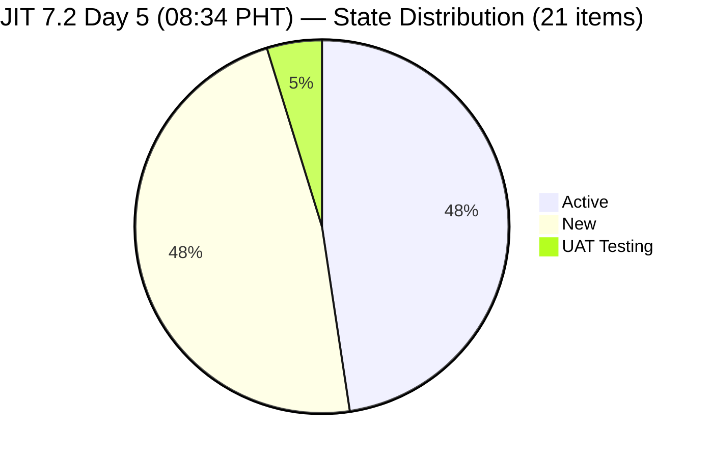
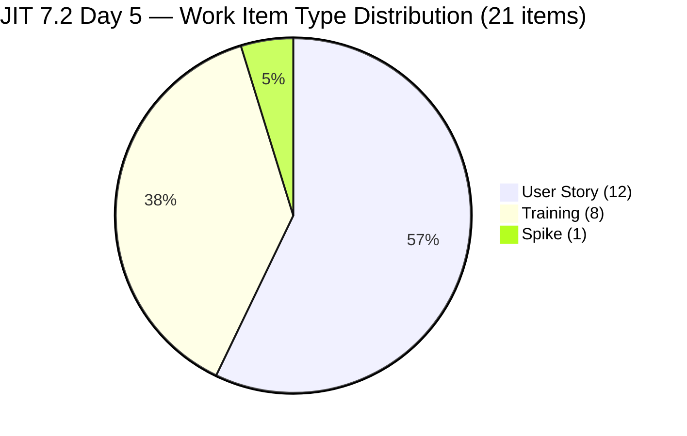
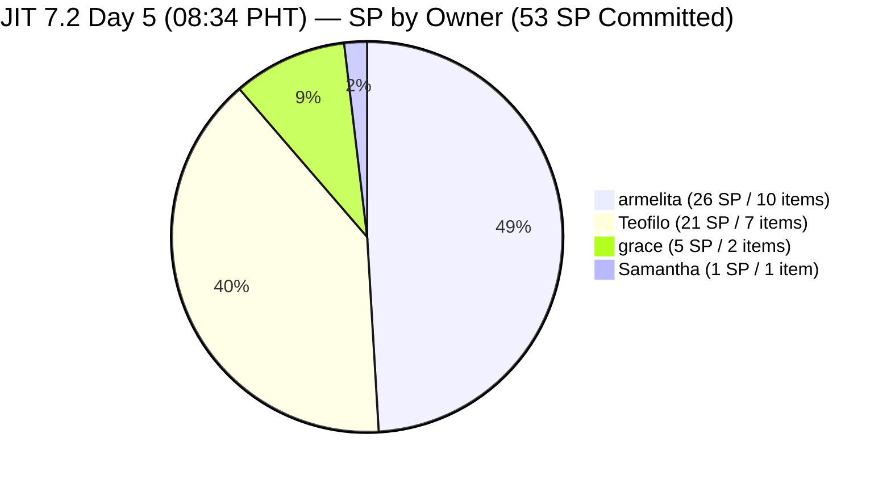
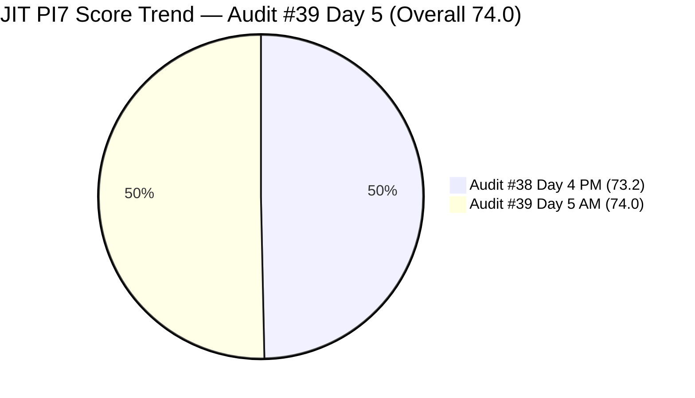

# Audit Report — JIT Operation Team

## Iteration 7.2 | Day 5 of 14 | Early Sprint

---

## 1. Audit Metadata

| Field | Value |
|-------|-------|
| **Audit Number** | #39 (JIT PI7 series) |
| **Audit Date** | April 24, 2026, 08:34 PHT |
| **Auditor** | Claude Code ADO SAFe Audit Agent |
| **Team** | JIT Operation Team |
| **ADO Project** | Jairosoft Portfolio |
| **Workspace** | `ado_jit` |
| **Iteration** | Iteration 7.2 — Apr 20 to May 3, 2026 |
| **Iteration ID** | `8edbe25f-fa4f-41b2-aaae-f3d5cf0e5b33` |
| **Sprint Day** | Day 5 of 14 (~36% elapsed — early-sprint annotation applies to DP) |
| **Prior Audit** | `AUDIT_20260423_1505.md` (Audit #38, 7.2 Day 4 15:05 PHT, Overall 73.2 — Moderate Risk) |
| **Report Path** | `ado_jit/audit/AUDIT_20260424_0834.md` |
| **Scoring Model** | ADO SAFe v1 (7-dimension rubric) |
| **Overall Score** | **74.0 / 100** |
| **Risk Band** | **Moderate Risk** (60–79.9) |

---

## 2. Executive Summary

JIT Operation Team improves to **74.0 (Moderate Risk)** at Day 5 — a **+0.8 gain** from Audit #38 (73.2). The improvement is driven by three positive developments:

**Positive changes since Audit #38 (17h29m elapsed):**

- **#203154 (3.1-2 Create AD User Accounts) now DoR-compliant:** Full Description and Acceptance Criteria added at Apr 24 01:05 UTC, bringing DoR from 13/20=65.0 to **15/21=71.4** — see below.
- **#203268 (Prepare Presentation for Bubble.io) added to 7.2:** New User Story added by Samantha Babael, UAT Testing state, 1 SP, full DoR fields present. This expands visible backlog to 39 and current sprint to 21 items.
- **Backlog Refinement improves to 97.4:** #193054 (SAFe RTE MC Courseware) crossed the 45-day freshness boundary as of today (ChangedDate Mar 9 = 46 days from Apr 24) and now registers as stale. However, the overall fresh ratio remains 38/39 = 97.4% — a small drop from 100% but no penalty triggers.
- **Untouched-current ratio drops to 9.5% (2/21):** With #203268 added (Day 5, touched today), the untouched ratio drops from 10.0% (2/20) to 9.5% (2/21) — safely below the 10% penalty trigger.

**Regressions / unchanged concerns:**
- **Iteration Planning slips to 53.8 (-1.2):** New item (#203268) adds +1 to both numerator and denominator (21/39 vs 20/38), slightly compressing the ratio.
- **5 Teofilo Training items (#203155–203159) remain bare** — no Description, no Acceptance Criteria. This is the 4th consecutive audit without remediation on these items.
- **#203241 (Tech Talk Spike) still unassigned and unestimated** — 2nd consecutive audit with no action.
- **#202981 (Interview ADDU Interns) AC still 18 nws** (threshold = 20 nws).
- **Delivery Predictability = 0.0** (early-sprint; no backlog-visible SP closed).

---

## 3. Previous Audit Delta

| Dimension | Audit #38 (Apr 23, 15:05 PHT) | Audit #39 (Apr 24, 08:34 PHT) | Change |
|-----------|-------------------------------|-------------------------------|--------|
| Iteration Planning | 52.6 | **53.8** | **+1.2** (21/39 vs 20/38; new item adds to both) |
| Team Capacity | 100.0 | **100.0** | 0.0 |
| Estimation | 95.0 | **95.2** | **+0.2** (20/21 vs 19/20) |
| DoR Compliance | 65.0 | **71.4** | **+6.4** (#203154 now PASS; #203268 PASS; denominator +1) |
| Work Item Balance | 100.0 | **100.0** | 0.0 |
| Backlog Refinement | 100.0 | **97.4** | **-2.6** (#193054 crossed stale boundary; fresh = 38/39) |
| Delivery Predictability | 0.0 | **0.0** | 0.0 (early-sprint; no new closures) |
| **Overall** | **73.2** | **74.0** | **+0.8** |
| **Risk Band** | Moderate | **Moderate** | — |

### Key Changes Since Audit #38 (17h29m elapsed)

| Item | Change | Timestamp |
|------|--------|-----------|
| **#203154** | Description + AC added — DoR now PASS | Apr 24 01:05 UTC |
| **#203268** | **NEW** — User Story "Prepare Presentation for Bubble.io" added to 7.2; Samantha; 1 SP; UAT Testing | Apr 24 01:46 / updated Apr 24 08:57 |
| **#193054** | Crossed 45-day freshness boundary (ChangedDate Mar 9 = 46 days) — now stale | n/a (calendar crossing) |

---

## 4. Current Iteration Snapshot

| Metric | Value |
|--------|-------|
| Iteration | 7.2 — Apr 20 to May 3, 2026 |
| Iteration Day | Day 5 of 14 (~36% elapsed) |
| Visible Root Backlog Items | **39** (+1 vs Audit #38: #203268 added) |
| Current Iteration (7.2) Root Items | **21** (+1: #203268) |
| Committed SP (estimated 7.2 items) | **53 SP** (+1: #203268 adds 1SP; #203241 still no SP) |
| Estimated items (SP > 0) | **20** (#203241 still no SP) |
| Closed SP (backlog-visible) | **0 SP** (early-sprint) |
| Closed SP (items dropped from view) | **2 SP** (#203141 Apr 23 + #202983 Apr 22) — for context |
| Contributors with current work (7.2 items assigned) | **4** (armelita, Teofilo, grace, Samantha) |
| Team capacity/day | **12 h/day** (armelita 6h, Teofilo 4h, grace 1h, Samantha 1h) |
| Untouched current items (< Apr 20) | **2** (#199092 Apr 16, #198615 Apr 14) = 2/21 = **9.5%** |
| Working days remaining | 9 (Apr 25 – May 3) |

### State Distribution — 21 Current Items (7.2)



### Work Item Type Distribution — 21 Current Items (7.2)



---

## 5. Work Item Analysis

### 5.1 Current 7.2 Items (21) — Day 5 08:34 PHT Live Data

| ID | Title | Type | State | SP | Assignee | Last Changed | Untouched? |
|----|-------|------|-------|----|----------|-------------|------------|
| 198615 | Awarding of CSS NC II Certificates | US | Active | 2 | armelita | Apr 14 | **YES** |
| 199092 | TESDA Career Guidance Programs Semestral Report CY 2026 | US | Active | 2 | armelita | Apr 16 | **YES** |
| 202969 | Market Bubble MCC April 2026 Class IT7.2 | US | Active | 3 | armelita | Apr 21 | No |
| 202972 | Request for Additional Bubble Trainer - Sam | US | Active | 2 | armelita | Apr 22 | No |
| 202974 | Python Marketing Activities IT7.2 | US | Active | 2 | armelita | Apr 22 | No |
| 202977 | Market CSS NC II April 2026 Class IT7.2 | US | Active | 3 | armelita | Apr 21 | No |
| 202981 | Interview ADDU Interns | US | New | 3 | armelita | Apr 20 | No |
| 202985 | UIC MCC Exploration | US | Active | 3 | armelita | Apr 23 | No |
| 202987 | HCDC MCC Exploration | US | New | 3 | armelita | Apr 20 | No |
| 203047 | Summer Camp Training Implementation – 4/25/26 | Training | Active | 2 | grace | Apr 23 | No |
| 203153 | 3.1-1 Creating Active Directory Training | Training | Active | 3 | Teofilo | Apr 22 | No |
| **203154** | **3.1-2 Create Active Directory User Accounts** | **Training** | **Active** | 3 | Teofilo | **Apr 24 01:05** | **No — DoR FIXED** |
| 203155 | 3.1-3 Create Active Directory Security | Training | New | 3 | Teofilo | Apr 22 | No |
| 203156 | 3.2-1 Set-Up DHCP | Training | New | 3 | Teofilo | Apr 22 | No |
| 203157 | 3.2-2 Set-Up Domain Name System | Training | New | 3 | Teofilo | Apr 22 | No |
| 203158 | 3.2-3 Set-up Remote Desktop | Training | New | 3 | Teofilo | Apr 22 | No |
| 203159 | 3.2-4 Set-Up Folder Redirection | Training | New | 3 | Teofilo | Apr 22 | No |
| 203164 | TESDA EBET Requirements | US | Active | 3 | armelita | Apr 22 | No |
| 203224 | Convert SAFe MCCs to New Forms | US | New | 3 | grace | Apr 23 | No |
| 203241 | IT7.2 Tech Talk — AI Tools Demonstration Sessions | Spike | New | **—** | **Unassigned** | Apr 23 | No |
| **203268** | **Prepare Presentation for Bubble.io** | **US** | **UAT Testing** | 1 | Samantha | **Apr 24** | **NEW** |

**Total: 21 items / 53 SP committed (20 estimated) / 2 items untouched since sprint start**

### 5.2 DoR Assessment — 21 Current Items

| ID | Title | Desc >= 30 nws | AC >= 20 nws | DoR |
|----|-------|----------------|-------------|-----|
| 198615 | Awarding of CSS NC II Certificates | PASS | PASS | **PASS** |
| 199092 | TESDA Career Guidance Report | PASS | PASS | **PASS** |
| 202969 | Market Bubble MCC April 2026 | PASS | PASS | **PASS** |
| 202972 | Request for Additional Bubble Trainer | PASS | PASS | **PASS** |
| 202974 | Python Marketing Activities IT7.2 | PASS | PASS | **PASS** |
| 202977 | Market CSS NC II April 2026 | PASS | PASS | **PASS** |
| 202981 | Interview ADDU Interns | PASS | **FAIL** (AC "Passed the interview" = 18 nws) | **FAIL** |
| 202985 | UIC MCC Exploration | PASS | PASS | **PASS** |
| 202987 | HCDC MCC Exploration | PASS | PASS | **PASS** |
| 203047 | Summer Camp Training Implementation | PASS | PASS | **PASS** |
| 203153 | 3.1-1 Creating Active Directory Training | PASS | PASS | **PASS** |
| **203154** | **3.1-2 Create AD User Accounts** | **PASS** | **PASS** | **PASS** (fixed Apr 24) |
| 203155 | 3.1-3 Create AD Security | **FAIL** (no Desc) | **FAIL** (no AC) | **FAIL** |
| 203156 | 3.2-1 Set-Up DHCP | **FAIL** | **FAIL** | **FAIL** |
| 203157 | 3.2-2 Set-Up DNS | **FAIL** | **FAIL** | **FAIL** |
| 203158 | 3.2-3 Set-up Remote Desktop | **FAIL** | **FAIL** | **FAIL** |
| 203159 | 3.2-4 Set-Up Folder Redirection | **FAIL** | **FAIL** | **FAIL** |
| 203164 | TESDA EBET Requirements | PASS | PASS | **PASS** |
| 203224 | Convert SAFe MCCs to New Forms | PASS | PASS | **PASS** |
| 203241 | IT7.2 Tech Talk — AI Tools Demo | PASS | PASS | **PASS** |
| **203268** | **Prepare Presentation for Bubble.io** | **PASS** | **PASS** | **PASS** |

**DoR: 15 PASS / 6 FAIL** | Score = round(15/21 × 100, 1) = **71.4**

---

## 6. SAFe Compliance Scorecard

| Dimension | Score | Evidence | Notes |
|-----------|-------|----------|-------|
| Iteration Planning | **53.8** | 21/39 visible root items in 7.2 | +1.2 vs Audit #38; denominator grew to 39 with #203268 |
| Team Capacity | **100.0** | 4/4 contributors with 7.2 assignments have configured capacity | armelita 6h, Teofilo 4h, grace 1h, Samantha 1h |
| Estimation | **95.2** | 20/21 point-eligible items have SP > 0; #203241 (Spike) still no SP | +0.2 vs Audit #38; 53 SP committed |
| DoR Compliance | **71.4** | 15/21 items pass Desc >= 30 nws + AC >= 20 nws | +6.4 vs Audit #38; #203154 fixed; #203268 new PASS; 6 still FAIL |
| Work Item Balance | **100.0** | US=12 (57.1% < 60%); Training=8; Spike=1 (4.8%); all thresholds safe | Stable; US headroom at 60% threshold: 2.9pp |
| Backlog Refinement | **97.4** | fresh=38/39=97.4%; stale_90=0; stale_180=0; untouched_current=2/21=9.5% (<10%) | -2.6 vs Audit #38; #193054 crossed 45-day boundary |
| Delivery Predictability | **0.0** | 0 SP closed / 53 SP committed — *early-sprint — low delivery expected* (Day 5) | Unchanged; 2 SP out-of-view (#203141 + #202983) captured narratively |
| **Overall** | **74.0** | (53.8+100.0+95.2+71.4+100.0+97.4+0.0) / 7 = 517.8 / 7 | **Moderate Risk** (60–79.9) |

### Score Computation Detail

```
1. Iteration Planning
   visible_root_backlog_items           = 39  (+1: #203268)
   current_iteration_root_items (7.2)   = 21  (+1: #203268)
   Score = round(21 / 39 × 100, 1)      = round(53.846, 1) = 53.8

2. Team Capacity
   contributors_with_current_work       = 4  (armelita, Teofilo, grace, Samantha)
   contributors_with_capacity           = 4  (all configured in 7.2 iteration)
   Score = round(4 / 4 × 100, 1)        = 100.0

3. Estimation
   point_eligible_current_items         = 21
   estimated_current_items              = 20  (#203241 SP = null)
   Score = round(20 / 21 × 100, 1)      = round(95.238, 1) = 95.2

4. DoR Compliance
   current_iteration_root_items         = 21
   dor_compliant_current_items          = 15
   Score = round(15 / 21 × 100, 1)      = round(71.429, 1) = 71.4

5. Work Item Balance
   User Story present?                  = Yes (#203268 + 11 others)  → no -40
   dominant_type_share (US)             = 12/21 = 57.1%  → NOT > 60%  → no -30
   spike_share                          = 1/21 = 4.8%   → NOT > 40%  → no -20
   Score = max(0, 100 - 0)             = 100.0

6. Backlog Refinement
   fresh (ChangedDate >= 2026-03-10)    = 38/39 = 97.4%
   [#193054 ChangedDate = Mar 9 = 46 days from Apr 24 → stale — NOT >= Mar 10]
   base                                 = 97.4
   stale_90 (< Jan 24, 2026)           = 0/39 = 0%    → no penalty
   stale_180 (< Oct 27, 2025)          = 0            → no penalty
   untouched_current (< Apr 20)        = 2/21 = 9.5%
   → 9.5% is NOT > 10%               → no penalty
   Score = max(0, 97.4 - 0)           = 97.4

7. Delivery Predictability
   committed_story_points               = 53  (20 estimated items)
   closed_story_points                  = 0  (backlog-visible)
   Score = round(0 / 53 × 100, 1)       = 0.0
   [Day 5 of 14; start + 4 = Apr 24 >= Apr 24 → early-sprint annotated]

Overall = round((53.8 + 100.0 + 95.2 + 71.4 + 100.0 + 97.4 + 0.0) / 7, 1)
        = round(517.8 / 7, 1)
        = round(73.971, 1)
        = 74.0  →  MODERATE RISK (60–79.9)
```

### Remediation Scenario — If P1 Actions Land Today

```
Assumptions:
  - 5 Teofilo items (#203155–203159) get Desc + AC → DoR PASS all 5
  - #202981 AC expanded to >= 20 nws → DoR PASS
  - #203241 (Spike) gets SP assigned → Estimation = 100

Revised:
  DoR Compliance   = round(21/21 × 100, 1) = 100.0  (+28.6)
  Estimation       = round(21/21 × 100, 1) = 100.0  (+4.8)
  Overall = round((53.8 + 100.0 + 100.0 + 100.0 + 100.0 + 97.4 + 0.0) / 7, 1)
          = round(551.2 / 7, 1) = round(78.743, 1) = 78.7  → Moderate Risk

If additionally PI6 residue (5 items) re-pathed + #193054 touched:
  visible_root     = 33  (39 - 5 PI6 - 1 root courseware item touched → fresh)
  current_7.2      = 21
  IP               = round(21/34 × 100, 1) = 61.8  (+8.0 vs current; note: denominator would be 34 if #193054 touched)
  BR fresh         = 34/34 = 100% → base 100.0
  Overall          = round((61.8 + 100 + 100 + 100 + 100 + 100 + 0) / 7, 1) = 80.3  → LOW RISK
```

---

## 7. Dimension Findings

### 7.1 Iteration Planning — 53.8 (High–Moderate, marginal improvement)

21 of 39 visible root backlog items are in Iteration 7.2. The ratio improved marginally from 52.6% (20/38) to 53.8% (21/39) because both the numerator and denominator grew by 1 with #203268's addition to 7.2.

**Non-7.2 items driving denominator inflation (18 items):**

| Category | Count | Notes |
|----------|-------|-------|
| PI6-path residue | 5 | #200766, #202514–202517 — unchanged |
| PI7 no sub-iteration | 1 | #202547 (Assessment Center Inspection) |
| PI7 future iterations (7.3–7.5) | 6 | #203160–162 (Teofilo Training), #203242–245 (Tech Talk Spikes) |
| Root courseware | 2 | #188995 (Rust), #193054 (SAFe RTE MC — now stale) |
| PI7 7.4 items | 2 | #200767 (UM Matina Demo), #200768 (HCDC Demo) |
| PI7 7.5 items | 2 | #200771 (UM Digos Demo), duplicate Spike |

Fastest path: close/re-path the 5 PI6-path items → IP rises to 21/34 = 61.8 (+8.0).

### 7.2 Team Capacity — 100.0 (Low Risk)

All 4 contributors active in 7.2 have configured capacity:

| Member | Capacity/day | 7.2 Items | SP | Status |
|--------|-------------|-----------|-----|--------|
| armelita | 6 h Documentation | 10 items | 26 SP | Active on multiple items |
| Teofilo | 4 h Training | 7 items | 21 SP | Active (#203153, #203154); 5 still awaiting DoR |
| grace | 1 h Documentation | 2 items | 5 SP | Active (#203047 Summer Camp Apr 25) |
| Samantha | 1 h Documentation | 1 item | 1 SP | #203268 in UAT Testing |

Score: 4/4 = 100.0.

### 7.3 Estimation — 95.2 (Low Risk)

20 of 21 current items have SP > 0. The single gap remains #203241 (IT7.2 Tech Talk — AI Tools Demonstration) which was added Apr 23 without Story Points and remains unestimated. Assigning any SP value restores Estimation to 100.0.

Committed SP across 20 estimated items: **53 SP**.

### 7.4 DoR Compliance — 71.4 (Moderate, improved +6.4)

15 of 21 items pass the DoR rubric. Notable changes:

**Fixed today:**
- **#203154 (3.1-2 Create AD User Accounts)** — Full Description (As a / I want to / So that structure + 5 AC checklist items) added at Apr 24 01:05 UTC. Now PASS.

**New PASS:**
- **#203268 (Prepare Presentation for Bubble.io)** — Added with complete Description and rich Acceptance Criteria. PASS.

**Still failing (6 items):**

| ID | Issue |
|----|-------|
| 202981 | AC "Passed the interview" = 18 nws (need >= 20; fix: add 2+ words) |
| 203155 | No Description, No AC |
| 203156 | No Description, No AC |
| 203157 | No Description, No AC |
| 203158 | No Description, No AC |
| 203159 | No Description, No AC |

**Pattern of fix:** Teofilo fixed #203154 overnight using the same structured format as #203153. The same template can be applied to #203155–203159 with module-specific nouns.

### 7.5 Work Item Balance — 100.0 (Low Risk)

With #203268 (User Story) added, the type distribution is:

| Type | Count | Share |
|------|-------|-------|
| User Story | 12 | 57.1% |
| Training | 8 | 38.1% |
| Spike | 1 | 4.8% |

All three penalty checks pass. US share at 57.1% remains safely below the 60% threshold — 2.9 percentage points of headroom. Adding one more User Story without a balancing item would push US to 13/22 = 59.1% (still safe); adding 2 more without balance would push to 14/23 = 60.9% (triggers -30 penalty).

### 7.6 Backlog Refinement — 97.4 (Low Risk, minor decline)

| Gate | Value | Threshold | Penalty |
|------|-------|-----------|---------|
| fresh_visible (>= Mar 10, 2026) | 38/39 = 97.4% | n/a | Base = 97.4 |
| stale_90 (< Jan 24, 2026) | 0/39 = 0% | > 25% = -20 | 0 |
| stale_180 (< Oct 27, 2025) | 0 | >= 1 = -20 | 0 |
| untouched_current (< Apr 20) | 2/21 = 9.5% | > 10% = -10 | 0 |
| **Total** | | | **97.4** |

**#193054 (SAFe RTE MC Courseware) crossed the freshness boundary today.** ChangedDate = Mar 9, 2026 = 46 calendar days from Apr 24. This item is now stale (does not meet the >= Mar 10 threshold). At 1 stale item of 39 visible, the fresh ratio drops to 97.4% — no penalty, but the base score is 97.4 instead of 100. Touching this item with any edit or comment resets its freshness and restores the base to 100%.

**Untouched-current safely below threshold:** 2/21 = 9.5% (was 10.0% = 2/20 in Audit #38). The denominator expansion via #203268 provides the safety margin. Still, touching #199092 or #198615 would reduce the count to 1/21 = 4.8% and provide further buffer.

### 7.7 Delivery Predictability — 0.0 (early-sprint)

0 SP closed in backlog-visible scope / 53 SP committed. Day 5 is still within the early-sprint window (start Apr 20 + 4 days = Apr 24 >= Apr 24 today). No formula adjustment.

**#203268 is in UAT Testing** — this is Samantha's first 7.2 item and it is already in the final pre-close state. If this item closes today, it contributes 1 SP to DP (1/53 = 1.9% — a small but positive signal at Day 5).

**Delivery pace needed for Low Risk DP at sprint close:** round(80% × 53 SP) = ~42.4 SP. The team needs to close 42+ SP in 9 working days (Apr 25 – May 3) = 4.7 SP/day. armelita owns 26 SP across 10 items — her closure pace is the primary delivery lever.

---

## 8. Risks and Bottlenecks



| # | Risk | Severity | Trend |
|---|------|----------|-------|
| R1 | **5 Teofilo Training items (#203155–203159) still bare** — no Desc, no AC. 15 SP at risk. #203154 fixed today; 5 remain. 4th consecutive audit. | **HIGH** | Partially resolved — 1 of 6 fixed |
| R2 | **armelita owns 26 SP / 10 items (49% of sprint).** Single-person concentration for delivery. | **HIGH** | Unchanged |
| R3 | **#203241 (Tech Talk Spike) unassigned + unestimated.** 3rd consecutive audit. | **MEDIUM** | Unresolved |
| R4 | **Summer Camp (grace/#203047) scheduled for Apr 25 — tomorrow.** Grace confirmed Active but any logistics gap (curriculum, venue, equipment) creates event risk. | **MEDIUM** | Tomorrow event |
| R5 | **#202981 Interview ADDU Interns AC = 18 nws.** 2-character fix persists for 4th consecutive audit. | **MEDIUM** | Unresolved |
| R6 | **5 PI6-path residue items (#200766, #202514–202517) still inflate IP denominator.** -8.0 IP impact. | **MODERATE** | Persistent — 9+ audit cycles |
| R7 | **#193054 freshness boundary crossed.** Now stale (46 days from Apr 24). Any touch restores freshness. | **MODERATE** | New today |
| R8 | **Untouched-current at 9.5% (2/21).** Safety margin is thin — if denominator contracts (item closes), may re-cross 10% threshold. | **LOW** | Better than Audit #38 (10.0%) |
| R9 | **Work Item Balance US share at 57.1%.** 2.9pp headroom before -30 penalty. Monitor before adding User Stories. | **LOW** | Stable |
| R10 | **No sprint goal defined in ADO for 7.2.** | **LOW** | Persistent |

---

## 9. Prioritized Recommendations

| Priority | Action | Owner | Target | Impact |
|----------|--------|-------|--------|--------|
| **P0** | **Add Desc + AC to #203155–203159.** Use #203154 (now DoR-compliant) as template. 5 items × ~5 minutes each = 25 minutes of effort. | Teofilo | Apr 24 AM | DoR: 71.4 → 95.2 (+23.8); Overall +3.4 |
| **P0** | **Verify Summer Camp (#203047) logistics for Apr 25.** Grace must confirm venue, curriculum, equipment, and check-in system ready by EOD Apr 24. Leave a status comment on the item. | grace | Apr 24 EOD | Operational delivery — event tomorrow |
| **P1** | **Expand #202981 AC to >= 20 nws.** Add 2 words: "Passed the interview screening with eligible candidates identified." | armelita | Apr 24 AM | DoR: toward 100% |
| **P1** | **Assign and estimate #203241 (Tech Talk Spike).** Assign to any team member and set SP (suggest 1–2). | Ramon / armelita | Apr 24 | Estimation: 95.2 → 100.0; Overall +0.7 |
| **P1** | **Touch #193054 (SAFe RTE MC Courseware).** Any field edit or comment resets freshness and restores BR base to 100%. | grace / armelita | Apr 24 | BR: 97.4 → 100.0 base; Overall +0.4 |
| **P1** | **Touch #199092 or #198615 with an activity update.** Drops untouched_current from 2/21 (9.5%) to 1/21 (4.8%) — provides buffer. | armelita | Apr 24 | Maintains BR at 100.0 if fixed |
| **P2** | **Close or re-path 5 PI6 items (#200766, #202514–202517).** If work is complete, close; if still live, re-path to PI7 with Desc + AC. Raises IP by ~8.0. | grace / armelita | Apr 24–25 | IP: 53.8 → 61.8 (+8.0); Overall +1.1 |
| **P2** | **Assign work to Samantha post-#203268.** If #203268 closes today (1 SP, UAT), Samantha is again idle. Assign a follow-on item from the Teofilo queue or a new marketing task. | armelita | Apr 25 | Capacity utilization |
| **P3** | **Define 7.2 sprint goal in ADO.** Suggested: "By May 3, 2026, close Bubble MCC + CSS NC II marketing campaigns (>= 25 qualified leads each), complete Active Directory modules 3.1–3.2 (Teofilo), run AI Tools Tech Talk, and complete TESDA form conversions." | Ramon / armelita | Apr 24–25 | SAFe process hygiene |

---

## 10. Evidence Gaps and Limitations

| Gap | Impact | Notes |
|-----|--------|-------|
| **Closed items drop from backlog view** | #203141 (1 SP) and #202983 (1 SP) excluded per rubric — captured narratively | 2 SP real delivery |
| **#203241 unassigned / no SP** | Spike unaccountable; Estimation gap persists | Recommendation P1 |
| **#202981 AC literal count** | 18 nws for "Passed the interview"; threshold = 20; 2-word fix | Recommendation P1 |
| **Teofilo SP uniformity (all 3 SP)** | All 7 Training items sized at 3 SP regardless of module complexity | Suspected placeholder sizing |
| **#193054 freshness boundary** | Mar 9 = 46 days from Apr 24; now stale | Recommendation P1: touch today |
| **No sprint goal in ADO** | Limits outcome-oriented sprint tracking | Recommendation P3 |
| **Timezone** | ADO timestamps UTC; PHT = UTC+8 | No scoring impact |

---

## 11. Score Trajectory — JIT PI7 Audit Series

| Audit | Date / Time | Day | Overall | Band | Key Driver |
|-------|------------|-----|---------|------|------------|
| #32 | Apr 17 | 7.1 D12 | 78.4 | Moderate | DP 67.4% visible |
| #33 | Apr 19 | 7.1 D14 | 68.8 | Moderate | Sprint close; strict DP 0.0 |
| #34 | Apr 21 | 7.2 D2 | 72.9 | Moderate | 7.2 open |
| #35 | Apr 22 | 7.2 D3 | 72.9 | Moderate | Stable |
| #36 | Apr 23 AM | 7.2 D4 | 75.5 | Moderate | Samantha activated |
| #37 | Apr 23 12:54 | 7.2 D4 | 73.0 | Moderate | Strict DoR recount; untouched crossed 10% |
| #38 | Apr 23 15:05 | 7.2 D4 | 73.2 | Moderate | 5 new Spikes; BR restored; Estimation -5 |
| **#39** | **Apr 24 08:34** | **7.2 D5** | **74.0** | **Moderate** | **#203154 DoR fixed; #203268 new; #193054 stale** |



**Low Risk path:** Full P0 + P1 remediation today lifts Overall to ~78.7 (Moderate, approaching Low Risk). Adding PI6 cleanup raises IP enough to break 80 (Low Risk). The team is 2–3 tactical actions away from crossing the 80-point threshold for the first time in PI7.

---

*Report generated by Claude Code ADO SAFe Audit Agent — Audit #39 | JIT Operation Team | Iteration 7.2, Day 5 (08:34 PHT) | Apr 24, 2026*

*Data source: Live ADO pull via MCP — `wit_list_backlog_work_items`, `work_get_team_capacity`, `wit_get_work_items_batch_by_ids`. 39 visible root backlog items, 21 current-iteration items, 53 SP committed (20 estimated).*
