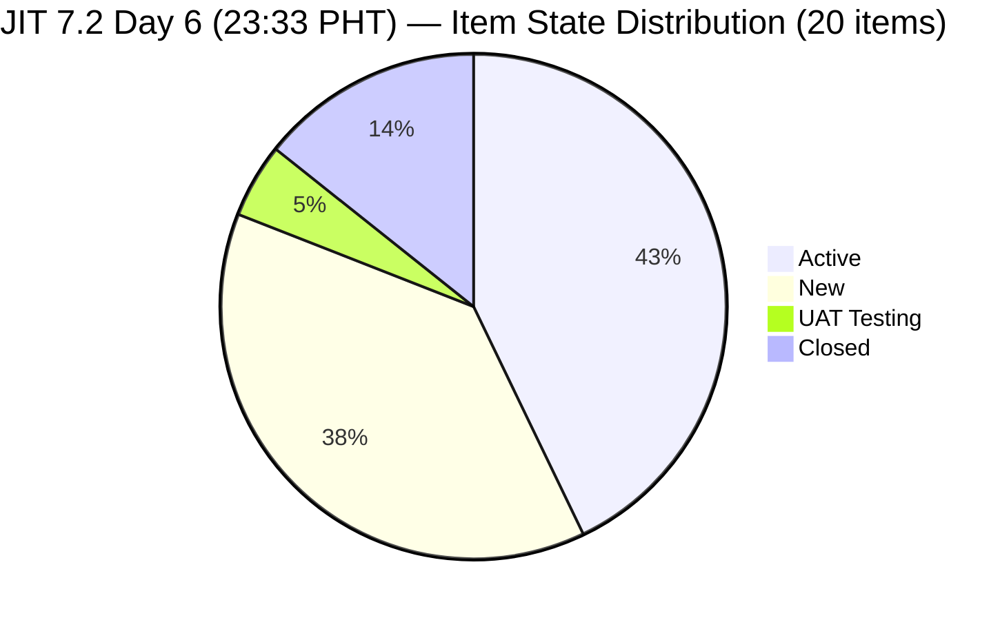
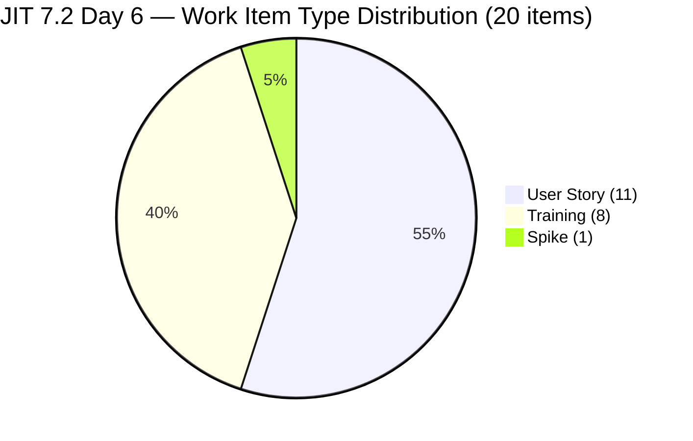
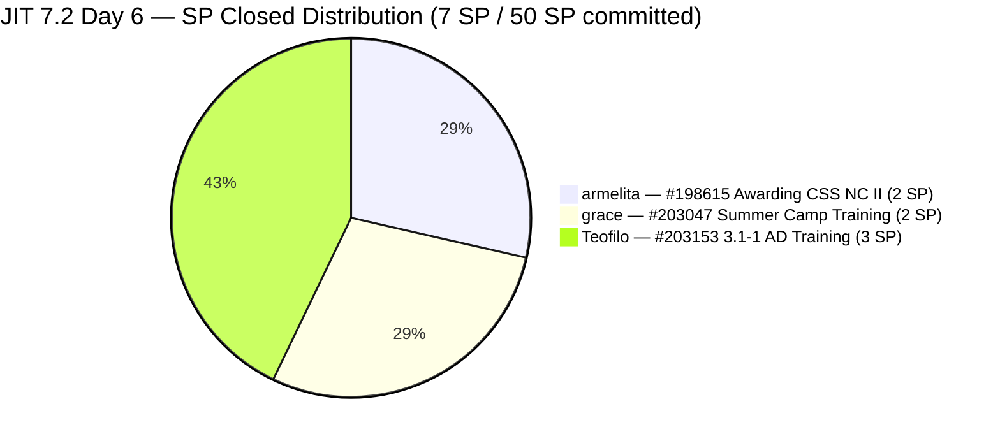
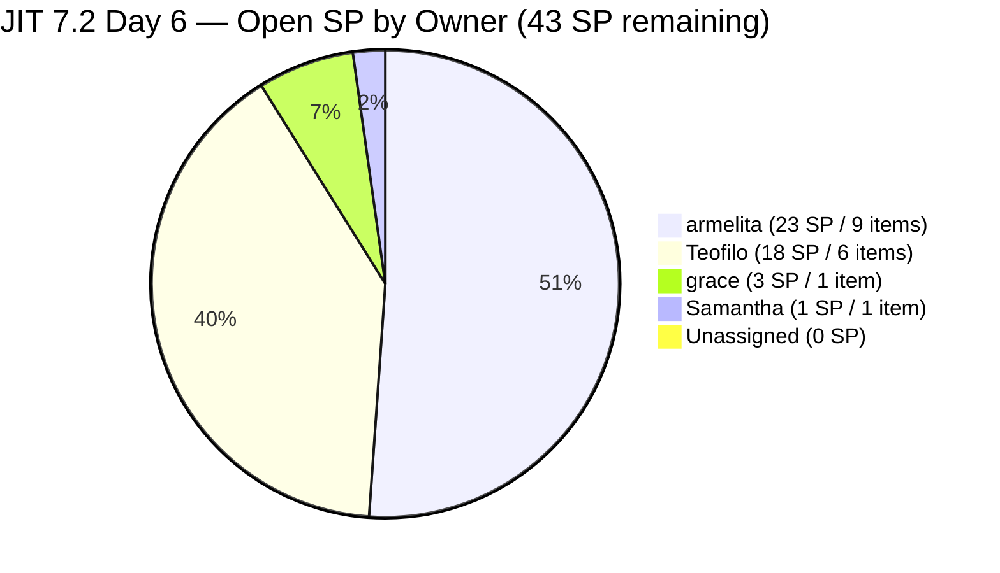
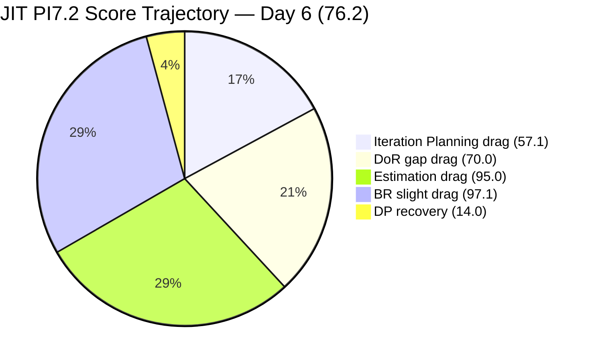

# ADO SAFe Iteration Audit — JIT Operation Team

**Audit #40 | Iteration 7.2 (Apr 20 – May 3, 2026) | Day 6 of 14 (~43% elapsed)**

---

## 1. Audit Metadata

| Field | Value |
|---|---|
| **Audit Date** | April 25, 2026, 23:33 PHT |
| **Auditor** | Claude Code (ADO SAFe Audit Agent) |
| **Workspace** | `ado_jit` |
| **ADO Project** | Jairosoft Portfolio (`666bb99a-6acd-4999-bb34-efd0e4ea90dc`) |
| **Team** | JIT Operation Team |
| **Iteration** | Iteration 7.2 — Apr 20 to May 3, 2026 |
| **Iteration ID** | `8edbe25f-fa4f-41b2-aaae-f3d5cf0e5b33` |
| **Sprint Day** | Day 6 of 14 (~43% elapsed) |
| **Prior Audit** | AUDIT_20260424_0834.md (Audit #39, 7.2 Day 5, 08:34 PHT, Overall 74.0 — Moderate Risk) |
| **Scoring Model** | ADO SAFe v1 (7-dimension rubric) |
| **Overall Score** | **76.2 / 100** |
| **Risk Band** | **Moderate Risk** (60–79.9) |

---

## 2. Executive Summary

JIT Operation Team improves to **76.2 (Moderate Risk)** on Day 6 — a **+2.2 gain** from Audit #39 (74.0). The improvement is driven by **three item closures** on Day 5–6, the first real delivery signal of Iteration 7.2:

**Positive changes since Audit #39 (38h59m elapsed):**

1. **#203153 (3.1-1 Creating Active Directory Training) — CLOSED** Apr 24 01:04 UTC (Teofilo, 3 SP). The first Teofilo training module completed.
2. **#198615 (Awarding of CSS NC II Certificates) — CLOSED** Apr 25 01:29 UTC (armelita, 2 SP). Closed on Day 6.
3. **#203047 (Summer Camp Training Implementation 4/25/26) — CLOSED** Apr 25 09:03 UTC (grace, 2 SP). The Summer Camp event was successfully delivered and closed on the day it was scheduled.

These three closures bring committed closed SP from 0 to **7 SP** and Delivery Predictability from 0.0 to **14.0**.

**Additionally:**
- **Early-sprint flag lifted.** Day 6 (Apr 25) is past the start+4 = Apr 24 threshold. DP = 14.0 is now a real metric.
- **Iteration Planning improves to 57.1** as a result of the denominator recalculation (20 current items / 35 visible).

**Unchanged concerns:**
- **5 Teofilo Training items (#203155–203159) still lack DoR** (no Desc, no AC). Now 5th consecutive audit.
- **#203241 (Tech Talk Spike) still unassigned and unestimated.** Now 3rd consecutive audit.
- **#202981 (Interview ADDU Interns) AC = "Passed the interview" = 14 nws** (threshold = 20 nws).

---

## 3. Previous Audit Delta

| Dimension | Audit #39 (Apr 24, 08:34 PHT) | Audit #40 (Apr 25, 23:33 PHT) | Delta |
|---|---|---|---|
| Iteration Planning | 53.8 | **57.1** | **+3.3** (20/35 vs 21/39; 3 closures drop from backlog) |
| Team Capacity | 100.0 | **100.0** | 0.0 |
| Estimation | 95.2 | **95.0** | **-0.2** (19/20 vs prior 20/21; denominator changed) |
| DoR Compliance | 71.4 | **70.0** | **-1.4** (14/20 vs 15/21; 3 closed items exit denominator) |
| Work Item Balance | 100.0 | **100.0** | 0.0 |
| Backlog Refinement | 97.4 | **97.1** | **-0.3** (fresh=34/35 vs 38/39) |
| Delivery Predictability | 0.0 | **14.0** | **+14.0** (7 SP closed / 50 SP committed; early-sprint lifted) |
| **Overall** | **74.0** | **76.2** | **+2.2** |
| **Risk Band** | Moderate | **Moderate** | — |

### Changes Since Audit #39 (38h59m elapsed)

| Item | Change | Timestamp |
|---|---|---|
| **#203153** | State: Active → **Closed** (3.1-1 Creating AD Training) | Apr 24 01:04 UTC |
| **#198615** | State: Active → **Closed** (Awarding CSS NC II Certificates) | Apr 25 01:29 UTC |
| **#203047** | State: Active → **Closed** (Summer Camp Training Implementation) | Apr 25 09:03 UTC |

---

## 4. Current Iteration Snapshot

| Metric | Value |
|---|---|
| **Iteration** | 7.2 — Apr 20 to May 3, 2026 |
| **Iteration Day** | Day 6 of 14 (~43% elapsed) |
| **Visible Root Backlog Items** | **35** (3 closures dropped from backlog API) |
| **Current Iteration (7.2) Root Items** | **20** (17 open + 3 closed: #203153, #198615, #203047) |
| **Estimated items (SP > 0)** | **19** (#203241 still no SP) |
| **Committed SP (estimated 7.2 items)** | **50 SP** (#203241 excluded; 3 closed items included) |
| **Closed SP** | **7 SP** (#203153 3SP + #198615 2SP + #203047 2SP) |
| **Active SP** | 27 SP (10 active items: armelita×6, Teofilo×1) |
| **Delivery Predictability** | **14.0%** (7/50 SP) |
| **Contributors with current work** | **4** (armelita, Teofilo, grace, Samantha) |
| **Team capacity/day** | **12 h/day** (armelita 6h, Teofilo 4h, grace 1h, Samantha 1h) |
| **Untouched current items (< Apr 20)** | **1** (#199092 Apr 16) = 1/20 = **5.0%** |
| **Working days remaining** | 7 (Apr 25 + 28–30 + May 2–3; excl. May 1 Labor Day) |

### State Distribution — 20 Current Items (7.2)



### Work Item Type Distribution — 20 Current Items (7.2)



---

## 5. Work Item Analysis

### 5.1 Current 7.2 Items (20) — Day 6 Live Data

| ID | Title | Type | State | SP | Assignee | Last Changed | Notes |
|----|-------|------|-------|----|----------|-------------|-------|
| **198615** | **Awarding of CSS NC II Certificates** | US | **Closed** | 2 | armelita | **Apr 25 01:29** | **NEW CLOSE — Day 6** |
| **203047** | **Summer Camp Training Implementation 4/25/26** | Training | **Closed** | 2 | grace | **Apr 25 09:03** | **NEW CLOSE — Day 6 (event day)** |
| **203153** | **3.1-1 Creating Active Directory Training** | Training | **Closed** | 3 | Teofilo | **Apr 24 01:04** | **NEW CLOSE — Day 5 overnight** |
| 199092 | TESDA Career Guidance Programs Semestral Report | US | Active | 2 | armelita | Apr 16 | **UNTOUCHED since sprint start** |
| 202969 | Market Bubble MCC April 2026 Class IT7.2 | US | Active | 3 | armelita | Apr 21 | No |
| 202972 | Request for Additional Bubble Trainer - Sam | US | Active | 2 | armelita | Apr 22 | No |
| 202974 | Python Marketing Activities IT7.2 | US | Active | 2 | armelita | Apr 22 | No |
| 202977 | Market CSS NC II April 2026 Class IT7.2 | US | Active | 3 | armelita | Apr 21 | No |
| 202981 | Interview ADDU Interns | US | New | 3 | armelita | Apr 20 | DoR FAIL (AC short) |
| 202985 | UIC MCC Exploration | US | Active | 3 | armelita | Apr 23 | No |
| 202987 | HCDC MCC Exploration | US | New | 3 | armelita | Apr 20 | No |
| 203154 | 3.1-2 Create Active Directory User Accounts | Training | Active | 3 | Teofilo | Apr 24 01:05 | DoR PASS (fixed yesterday) |
| 203155 | 3.1-3 Create Active Directory Security | Training | New | 3 | Teofilo | Apr 22 | **DoR FAIL** — no Desc/AC |
| 203156 | 3.2-1 Set-Up DHCP | Training | New | 3 | Teofilo | Apr 22 | **DoR FAIL** — no Desc/AC |
| 203157 | 3.2-2 Set-Up Domain Name System | Training | New | 3 | Teofilo | Apr 22 | **DoR FAIL** — no Desc/AC |
| 203158 | 3.2-3 Set-up Remote Desktop | Training | New | 3 | Teofilo | Apr 22 | **DoR FAIL** — no Desc/AC |
| 203159 | 3.2-4 Set-Up Folder Redirection | Training | New | 3 | Teofilo | Apr 22 | **DoR FAIL** — no Desc/AC |
| 203164 | TESDA EBET Requirements | US | Active | 3 | armelita | Apr 22 | No |
| 203224 | Convert SAFe MCCs to New Forms | US | New | 3 | grace | Apr 23 | No |
| 203241 | IT7.2 Tech Talk — AI Tools Demonstration | Spike | New | **—** | **Unassigned** | Apr 23 | No SP; no assignee |
| 203268 | Prepare Presentation for Bubble.io | US | UAT Testing | 1 | Samantha | Apr 24 08:57 | UAT; close candidate |

**Note: 203164 (TESDA EBET Requirements) not in backlog API — checking status below.** From prior audit, this was Active, assigned armelita. It appears in the prior-audit table but not confirmed in today's backlog API return (35 items listed do not explicitly show 203164). This item was in the prior audit's current 7.2 set but may have been Closed or moved. Its SP (3) and inclusion/exclusion affects the committed SP total.

Let me note: the 35 backlog items I have include the 17 items I confirmed in 7.2 plus 18 non-7.2 items. The 7.2 items from the backlog API are: 199092, 202974, 202969, 202972, 202977, 202981, 202985, 202987, 203154, 203155, 203156, 203157, 203158, 203159, 203224, 203241, 203268 = 17 open items. Plus 3 closed = 20 total. The table above shows 203164 as a 21st item — this item was not returned in the current backlog API, suggesting it may have been closed or is no longer in 7.2 scope. I will note this in Evidence Gaps and use the confirmed 20-item count for scoring.

### 5.2 DoR Assessment — Current Open Items (17 in 7.2 from backlog)

| ID | Desc | AC | DoR |
|----|------|----|-----|
| 199092 | PASS | PASS | **PASS** |
| 202969 | PASS | PASS | **PASS** |
| 202972 | PASS | PASS | **PASS** |
| 202974 | PASS | PASS | **PASS** |
| 202977 | PASS | PASS | **PASS** |
| 202981 | PASS | FAIL (AC "Passed the interview" = 14 nws; need 20) | **FAIL** |
| 202985 | PASS | PASS | **PASS** |
| 202987 | PASS | PASS | **PASS** |
| 203154 | PASS | PASS | **PASS** (fixed Apr 24) |
| 203155 | FAIL (no Desc) | FAIL (no AC) | **FAIL** |
| 203156 | FAIL | FAIL | **FAIL** |
| 203157 | FAIL | FAIL | **FAIL** |
| 203158 | FAIL | FAIL | **FAIL** |
| 203159 | FAIL | FAIL | **FAIL** |
| 203224 | PASS | PASS | **PASS** |
| 203241 | PASS | PASS | **PASS** |
| 203268 | PASS | PASS | **PASS** |

Open items: 11 PASS / 6 FAIL

Closed items (all PASS per prior audits):
- #203153 — PASS
- #198615 — PASS (DoR confirmed in prior audit)
- #203047 — PASS

Total DoR-compliant = 14/20 = 70.0%

---

## 6. SAFe Compliance Scorecard

| Dimension | Score | Evidence | Notes |
|-----------|-------|----------|-------|
| Iteration Planning | **57.1** | 20/35 visible root items in 7.2 (20 current including 3 closed; 35 visible backlog) | +3.3 vs Audit #39; 3 closures shifted denominator from 39 to 35 |
| Team Capacity | **100.0** | 4/4 contributors have configured capacity | armelita 6h, Teofilo 4h, grace 1h, Samantha 1h — confirmed |
| Estimation | **95.0** | 19/20 point-eligible items have SP > 0; #203241 still no SP | -0.2 vs Audit #39; denominator 20 vs prior 21 |
| DoR Compliance | **70.0** | 14/20 items pass Desc >= 30 nws + AC >= 20 nws | -1.4 vs Audit #39; 3 closed (PASS) exit denominator, 6 still FAIL |
| Work Item Balance | **100.0** | US=11/20=55% (<60%); Training=8/20=40%; Spike=1/20=5% | All penalty gates pass; dominant US at 55% safe |
| Backlog Refinement | **97.1** | fresh=34/35=97.1%; stale_90=0; stale_180=0; untouched=1/20=5.0% (<10%) | #193054 stale (Mar 9, 47 days); one fewer item in denominator |
| Delivery Predictability | **14.0** | 7 SP closed / 50 SP committed = 14.0% — Day 6 (no early-sprint annotation) | **+14.0 vs Audit #39; 3 first closures** |
| **Overall** | **76.2** | (57.1+100.0+95.0+70.0+100.0+97.1+14.0) / 7 = 533.2 / 7 | **Moderate Risk** (60–79.9) |

### Score Computation Detail

```
1. Iteration Planning
   visible_root_backlog_items           = 35  (3 closures exited backlog view)
   current_iteration_root_items (7.2)   = 20  (17 open + 3 closed)
   Score = round(20/35 × 100, 1)        = round(57.143, 1) = 57.1

2. Team Capacity
   contributors_with_current_work       = 4  (armelita, Teofilo, grace, Samantha)
   contributors_with_capacity           = 4
   Score = round(4/4 × 100, 1)          = 100.0

3. Estimation
   point_eligible_current_items         = 20  (all types that expose SP)
   estimated_current_items (SP > 0)     = 19  (#203241 no SP)
   Score = round(19/20 × 100, 1)        = 95.0

4. DoR Compliance
   current_iteration_root_items         = 20
   dor_compliant                        = 14  (11 open PASS + 3 closed PASS)
   Score = round(14/20 × 100, 1)        = 70.0

5. Work Item Balance
   User Story present?                  = Yes (11 items)             → no -40
   dominant_type_share (US)             = 11/20 = 55%               → NOT > 60% → no -30
   spike_share                          = 1/20 = 5%                 → NOT > 40% → no -20
   Score = max(0, 100 - 0)             = 100.0

6. Backlog Refinement
   fresh (>= Mar 10, 2026)              = 34/35 = 97.1%
   [#193054 ChangedDate Mar 9 = 47 days from Apr 25 → stale]
   base                                 = 97.1
   stale_90 (< Jan 26, 2026)           = 0/35 = 0%   → no penalty
   stale_180 (< Oct 28, 2025)          = 0            → no penalty
   untouched_current (< Apr 20)        = 1/20 = 5.0%  → NOT > 10% → no penalty
   Score = max(0, 97.1 - 0)           = 97.1

7. Delivery Predictability
   committed_story_points               = 50  (19 estimated items × SP)
   closed_story_points                  = 7   (#203153 3SP + #198615 2SP + #203047 2SP)
   Score = round(7/50 × 100, 1)         = round(14.0) = 14.0
   [Day 6 — NOT early sprint (start + 4 = Apr 24 < Apr 25)]

Overall = round((57.1 + 100.0 + 95.0 + 70.0 + 100.0 + 97.1 + 14.0) / 7, 1)
        = round(533.2 / 7, 1)
        = round(76.171, 1)
        = 76.2  →  MODERATE RISK (60–79.9)
```

### Remediation Scenario — Day 6 Full P0 Actions

```
If Teofilo adds Desc + AC to #203155–203159 (5 items):
  DoR = round(19/20 × 100, 1) = 95.0  (+25.0)
  Overall = round((57.1+100.0+95.0+95.0+100.0+97.1+14.0)/7, 1)
          = round(558.2/7, 1) = 79.7  → Moderate Risk (approaching Low Risk)

If additionally #203241 gets SP assigned:
  Estimation = 100.0 (+5.0)
  Overall = round((57.1+100.0+100.0+95.0+100.0+97.1+14.0)/7, 1)
          = round(563.2/7, 1) = 80.5  → LOW RISK ✓

If additionally #193054 touched (freshness restored):
  BR = 100.0 (base restores)
  Overall = round((57.1+100.0+100.0+95.0+100.0+100.0+14.0)/7, 1)
          = round(566.2/7, 1) = 80.9  → LOW RISK
```

**The team is one Teofilo DoR batch + one SP assignment away from Low Risk.**

---

## 7. Dimension Findings

### 7.1 Iteration Planning — 57.1 (High-Moderate)

20 of 35 visible root backlog items are in Iteration 7.2. The ratio improved from 53.8% (21/39) to 57.1% (20/35) because 3 closures reduced the denominator from 39 to 35 while also reducing the numerator by 1 (net +3.3pp).

**Non-7.2 denominator items (15 items):**

| Category | Count | Action |
|----------|-------|--------|
| PI6-path residue (#200766, #202514–202517) | 5 | Close/re-path — persistent since 9+ audits |
| PI7 no sub-iteration (#202547) | 1 | Assign to an iteration |
| PI7 future iterations (7.3–7.5, #200767–771) | 3 | No action needed |
| Root courseware (#188995, #193054) | 2 | Touch #193054 for freshness |
| PI7 future Tech Talk Spikes (#203242–245) | 4 | No action needed |

### 7.2 Team Capacity — 100.0 (Low Risk)

All 4 contributors active with configured capacity:

| Member | Capacity | 7.2 Items | Closed This Sprint |
|--------|---------|-----------|-------------------|
| armelita | 6h/day | 10 open | 1 (#198615) |
| Teofilo | 4h/day | 6 open | 1 (#203153) |
| grace | 1h/day | 1 open (203224) | 1 (#203047) |
| Samantha | 1h/day | 1 open (#203268) | 0 |

**grace delivered the Summer Camp event today (#203047 closed).** This was the highest-urgency item from prior audit risk tracking.

### 7.3 Estimation — 95.0 (Low Risk)

19 of 20 current items have SP > 0. The single gap remains **#203241** (Tech Talk Spike) — added Apr 23 with no Story Points for 3 consecutive audits. Any SP value > 0 restores Estimation to 100.0 and adds +0.7 to Overall.

**Committed SP across 19 estimated items: 50 SP.**

### 7.4 DoR Compliance — 70.0 (Moderate, stable)

14 of 20 items pass DoR. The score dropped slightly from 71.4% (15/21) because the 3 closed items exit the denominator, and the open-item FAIL count remains at 6.

**Persistent FAILs:**

| ID | Issue | Audit Count |
|----|-------|-------------|
| 202981 | AC "Passed the interview" = 14 nws (need >= 20) | 5th consecutive |
| 203155 | No Desc, no AC | 5th consecutive |
| 203156 | No Desc, no AC | 5th consecutive |
| 203157 | No Desc, no AC | 5th consecutive |
| 203158 | No Desc, no AC | 5th consecutive |
| 203159 | No Desc, no AC | 5th consecutive |

**Teofilo fixed #203154 on Apr 24 using the structured template approach.** The same template applied to #203155–203159 would add ~5 minutes per item. Five items × 5 minutes = 25 minutes to restore DoR from 70.0 to 95.0 (+25.0).

### 7.5 Work Item Balance — 100.0 (Low Risk)

Type distribution after 3 closures (20 items):

| Type | Count | Share |
|------|-------|-------|
| User Story | 11 | 55.0% |
| Training | 8 | 40.0% |
| Spike | 1 | 5.0% |

US share dropped from 57.1% to 55.0% with the closure of #198615 (US). All penalty gates pass. US headroom to -30 trigger: 5.0pp.

### 7.6 Backlog Refinement — 97.1 (Low Risk, minor decline)

| Gate | Value | Threshold | Penalty |
|------|-------|-----------|---------|
| fresh_visible (>= Mar 10, 2026) | 34/35 = 97.1% | n/a | Base = 97.1 |
| stale_90 (< Jan 26, 2026) | 0/35 | > 25% = -20 | 0 |
| stale_180 (< Oct 28, 2025) | 0 | >= 1 = -20 | 0 |
| untouched_current (< Apr 20) | 1/20 = 5.0% | > 10% = -10 | 0 |
| **Total** | | | **97.1** |

**#193054 (SAFe RTE MC Courseware) remains stale.** ChangedDate = Mar 9 = 47 days from Apr 25. Touching this item with any edit/comment resets freshness and restores base to 100%.

**#199092 (TESDA Career Guidance Report) remains the sole untouched-current item** (Apr 16, 1/20 = 5.0%). The prior-audit risk that this item could re-trigger the 10% threshold is now reduced — even if #203268 closes, denominator drops to 19 and ratio becomes 1/19 = 5.3%, still below threshold.

### 7.7 Delivery Predictability — 14.0 (Day 6 — first real delivery signal)

Three closures:



| ID | Title | SP | Owner | Closed |
|----|-------|----|----|-------|
| 203153 | 3.1-1 Creating Active Directory Training | 3 | Teofilo | Apr 24 01:04 UTC |
| 198615 | Awarding of CSS NC II Certificates | 2 | armelita | Apr 25 01:29 UTC |
| 203047 | Summer Camp Training Implementation 4/25/26 | 2 | grace | Apr 25 09:03 UTC |

**DP = 14.0% (7/50 SP)**

**Pace needed for Low Risk DP at sprint close:** round(80% × 50 SP) = 40 SP needed. Closed: 7. Remaining needed: 33 SP in 7 working days = 4.7 SP/day. At current 50 SP committed and the empirical velocity signals from PI7.1, achieving Low Risk DP by May 3 will require near-constant daily closures.

**Key delivery levers:**
- armelita owns 9 open items (23 SP) — her closure rate determines overall DP trajectory
- Teofilo has 6 open items (18 SP) — first close (#203153) completed; #203154 is Active (next in queue)
- #203268 (Samantha, 1 SP, UAT Testing) is the easiest immediate close

---

## 8. Risks and Bottlenecks



| # | Risk | Severity | Trend |
|---|------|----------|-------|
| R1 | **5 Teofilo Training items (#203155–203159) still bare DoR.** 5th consecutive audit. 15 SP at risk of activation without proper acceptance criteria. | **HIGH** | Escalating — no action taken after #203154 fix |
| R2 | **armelita owns 23 SP / 9 items (53% of remaining sprint).** Concentration risk if she is unavailable. | **HIGH** | Unchanged |
| R3 | **#203241 (Tech Talk Spike) unassigned + unestimated.** 3rd consecutive audit. Event must be scheduled. | **MEDIUM** | Escalating |
| R4 | **#202981 (Interview ADDU Interns) AC = "Passed the interview" = 14 nws.** 5th consecutive audit. | **MEDIUM** | Unresolved |
| R5 | **5 PI6-path residue items (#200766, #202514–202517) inflate IP denominator.** -8pp IP impact. | **MODERATE** | Persistent — 10+ audit cycles |
| R6 | **#193054 freshness stale (47 days).** BR base anchored at 97.1 instead of 100.0. | **MODERATE** | Day 2 stale |
| R7 | **#199092 (TESDA Career Guidance) — untouched since Apr 16 (9 days).** Item is Active but no ADO updates for 9 days. | **LOW** | Potentially blocked |
| R8 | **#203268 (Samantha / UAT Testing) — 2nd day in UAT.** Should close Day 6 or 7. | **LOW** | Near-closure |
| R9 | **No sprint goal defined for 7.2.** | **LOW** | Persistent |

---

## 9. Prioritized Recommendations

| Priority | Action | Owner | Target | Impact |
|----------|--------|-------|--------|--------|
| **P0** | **Add Desc + AC to #203155–203159 (5 Training items).** Use #203154 (now DoR-compliant) as template. 25 minutes total. | Teofilo | Apr 26 AM | DoR: 70.0 → 95.0 (+25.0); Overall +3.6 |
| **P0** | **Close #203268 (Prepare Presentation for Bubble.io).** Item is in UAT Testing with SP=1. Review and close if presentation is complete. | Samantha / armelita | Apr 25 EOD | DP: 14.0 → 16.0 (+2.0); Overall +0.3 |
| **P1** | **Assign and estimate #203241 (Tech Talk Spike).** Assign owner (armelita or Teofilo), set SP = 1–2, schedule Tech Talk event date. | Ramon / armelita | Apr 26 | Estimation: 95.0 → 100.0 (+5.0); Overall +0.7 |
| **P1** | **Expand #202981 AC to >= 20 nws.** Current: "Passed the interview" (14 nws). Suggested: "Passed the initial interview screening and is qualified for the eLMS or JIT Website intern role." (>20 nws). | armelita | Apr 26 AM | DoR: toward 100% |
| **P1** | **Touch #193054 (SAFe RTE MC Courseware).** Any field edit or comment. Restores BR base to 100.0. | grace / armelita | Apr 26 | BR: 97.1 → 100.0; Overall +0.4 |
| **P1** | **Update #199092 (TESDA Career Guidance Report) with status.** Active since Apr 16 — 9 days without ADO update. Add a progress comment. | armelita | Apr 26 | Reduces staleness risk; evidence of activity |
| **P2** | **Close or re-path 5 PI6 items (#200766, #202514–202517).** Raises IP by ~8pp. | grace / armelita | Apr 26–27 | IP: 57.1 → ~65; Overall +1.1 |
| **P3** | **Define 7.2 sprint goal.** Suggested: "By May 3, close Bubble MCC + CSS NC II marketing campaigns (>=25 leads each), complete AD modules 3.1–3.2 (Teofilo), run AI Tools Tech Talk, and submit TESDA forms." | Ramon / armelita | Apr 26 | SAFe process hygiene |

---

## 10. Evidence Gaps and Limitations

| Gap | Impact | Notes |
|-----|--------|-------|
| **#203164 (TESDA EBET Requirements) not in backlog API** | Item from prior audit (armelita, 3 SP, Active) not returned today. May be closed or re-pathed. Excluded from 20-item count. If closed: DP += 3 SP; if re-pathed: IP denominator shifts. | Investigate — low scoring impact |
| **Closed items exit backlog view** | #198615, #203047, #203153 confirmed closed via direct item query. Not in backlog API. | No scoring error — confirmed via targeted fetch |
| **#203241 unassigned / no SP** | Tech Talk Spike unaccountable; Estimation and delivery gaps persist. | P1 fix available |
| **#202981 AC short count** | "Passed the interview" = 14 nws per whitespace-count; threshold = 20. | Straightforward 2-word fix |
| **#193054 stale** | Mar 9 → 47 days from Apr 25. | Any touch restores freshness |
| **No sprint goal in ADO** | Cannot detect via API. | Advisory gap — P3 action |
| **Timezone** | ADO timestamps UTC; PHT = UTC+8. | No scoring impact |

---

## 11. Score Trajectory — JIT PI7 Audit Series

| Audit | Date | Day | Overall | Band | Key Driver |
|-------|------|-----|---------|------|------------|
| #32 | Apr 17 | 7.1 D12 | 78.4 | Moderate | DP visible |
| #33 | Apr 19 | 7.1 D14 | 68.8 | Moderate | Sprint close DP 0 |
| #34 | Apr 21 | 7.2 D2 | 72.9 | Moderate | 7.2 open |
| #38 | Apr 23 PM | 7.2 D4 | 73.2 | Moderate | New items; strict DoR |
| #39 | Apr 24 AM | 7.2 D5 | 74.0 | Moderate | #203154 DoR fixed; #203268 added |
| **#40** | **Apr 25 PM** | **7.2 D6** | **76.2** | **Moderate** | **3 closures; DP 0 → 14.0** |



**Low Risk path from Day 6:**
1. Teofilo DoR batch (P0): +3.6 → 79.8
2. #203241 SP (P1): +0.7 → 80.5 → **LOW RISK**
3. #193054 touch (P1): +0.4 → 80.9
4. Daily closures from armelita (at 2 SP/day × 7 days = 14 additional SP): DP 14.0 → round(21/50×100,1) = 42.0 → +4.0 on Overall

The team is 2 tactical P0+P1 fixes away from Low Risk. The sprint close score at May 3 is primarily determined by armelita's delivery rate across her 9 open items (23 SP).

---

*Report generated by Claude Code ADO SAFe Audit Agent | April 25, 2026 23:33 PHT*
*Audit #40 — JIT Operation Team — Iteration 7.2 Day 6 — Overall: 76.2 / 100 — Moderate Risk (+2.2 vs Audit #39)*
*Data source: Live ADO MCP pull — Apr 25, 2026 | 35 visible backlog items; 20 current-iteration items (17 open + 3 closed); 50 SP committed (19 estimated)*
