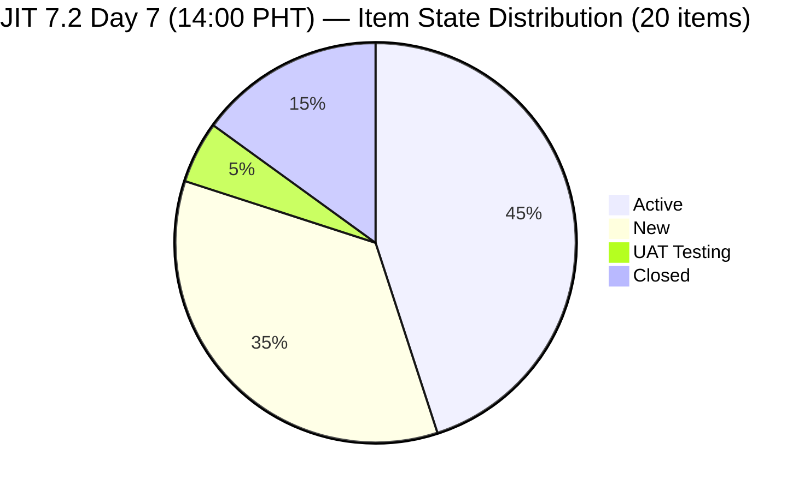
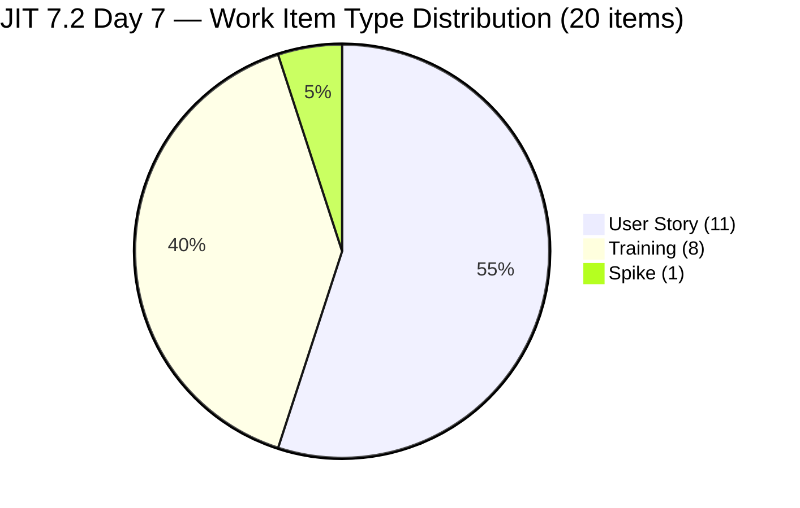
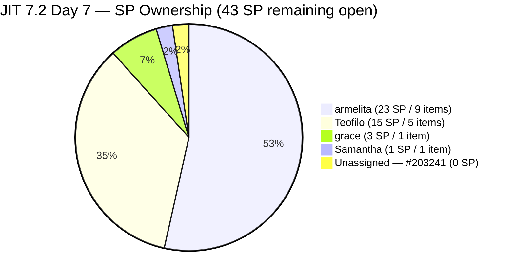
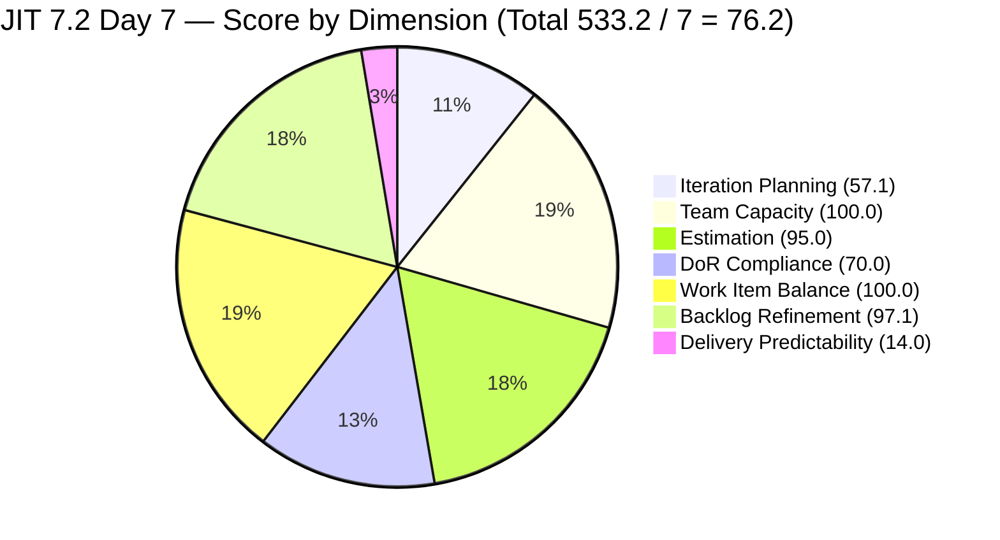

# ADO SAFe Iteration Audit — JIT Operation Team

**Audit #41 | Iteration 7.2 (Apr 20 – May 3, 2026) | Day 7 of 14 (~50% elapsed)**

---

## 1. Audit Metadata

| Field | Value |
|---|---|
| **Audit Date** | April 26, 2026, 14:00 PHT |
| **Auditor** | Claude Code (ADO SAFe Audit Agent) |
| **Workspace** | `ado_jit` |
| **ADO Project** | Jairosoft Portfolio (`666bb99a-6acd-4999-bb34-efd0e4ea90dc`) |
| **Team** | JIT Operation Team (`b25e3129-6272-4e54-a3ff-f1ef3c8eeb2c`) |
| **Iteration** | Iteration 7.2 — Apr 20 to May 3, 2026 |
| **Iteration ID** | `8edbe25f-fa4f-41b2-aaae-f3d5cf0e5b33` |
| **Sprint Day** | Day 7 of 14 (~50% elapsed) |
| **Prior Audit** | AUDIT_20260425_1533.md (Audit #40, 7.2 Day 6, 23:33 PHT, Overall 76.2 — Moderate Risk) |
| **Scoring Model** | ADO SAFe v1 (7-dimension rubric) |
| **Overall Score** | **76.2 / 100** |
| **Risk Band** | **Moderate Risk** (60–79.9) |

---

## 2. Executive Summary

JIT Operation Team holds at **76.2 (Moderate Risk)** on Day 7 — **no change from Audit #40**. No new item closures have occurred since Apr 25 09:03 UTC (#203047 Summer Camp Training), which is now approximately 29 hours ago. The sprint reaches its midpoint today with 7 SP closed of 50 SP committed (14.0% DP).

**Positive context:** The team achieved 3 closures in a 32-hour window on Apr 24–25 (Audits #40). Grace's Summer Camp event was successfully delivered. Teofilo completed his first AD training module. armelita closed the CSS NC II certificates ceremony.

**Unchanged concerns (now Day 7):**
- **5 Teofilo Training items (#203155–203159) still bare DoR** (no Desc, no AC) — now **6th consecutive audit** without correction. Teofilo fixed #203154 on Apr 24 using a structured template. The same approach applied to 5 remaining items = ~25 minutes of work.
- **#203241 (Tech Talk Spike) still unassigned and unestimated** — 4th consecutive audit. Event must be scheduled if it is to happen in 7.2.
- **#203268 (Samantha, UAT Testing, 1 SP) — 3rd day in UAT** with no state change since Apr 24. Close candidate.
- **#202981 (Interview ADDU Interns) AC = "Passed the interview" (~18 non-ws chars, threshold 20)** — DoR FAIL, 6th consecutive audit.

**Three new Training items in backlog (7.3 path):** #203160 (Printer Deployment), #203161 (Server Pre-Deployment), #203162 (Server Security & Reporting) — all in Iteration 7.3, all assigned Teofilo. These correctly exist in future iterations; no action required now but they confirm Teofilo's sprint sequence plan.

---

## 3. Previous Audit Delta

| Dimension | Audit #40 (Apr 25, 23:33 PHT) | Audit #41 (Apr 26, 14:00 PHT) | Delta |
|---|---|---|---|
| Iteration Planning | 57.1 | **57.1** | 0.0 |
| Team Capacity | 100.0 | **100.0** | 0.0 |
| Estimation | 95.0 | **95.0** | 0.0 |
| DoR Compliance | 70.0 | **70.0** | 0.0 |
| Work Item Balance | 100.0 | **100.0** | 0.0 |
| Backlog Refinement | 97.1 | **97.1** | 0.0 |
| Delivery Predictability | 14.0 | **14.0** | 0.0 |
| **Overall** | **76.2** | **76.2** | **0.0** |

### Changes Since Audit #40 (14h27m elapsed)

**No ADO state changes detected since Audit #40.**

| Most Recent Activity | Item | Date |
|---|---|---|
| Latest sprint item touch | #203047 (Summer Camp — Closed) | Apr 25 09:03 UTC |
| #203154 (3.1-2 AD User Accounts) | Active — Teofilo | Apr 24 01:05 UTC |
| #202985 (UIC MCC Exploration) | Active — armelita | Apr 23 06:51 UTC |
| #203268 (Bubble Presentation) | UAT Testing — Samantha | Apr 24 08:57 UTC |

**All other items:** unchanged. Backlog composition: 35 items — identical to Audit #40.

---

## 4. Current Iteration Snapshot

| Metric | Value |
|---|---|
| **Iteration** | 7.2 — Apr 20 to May 3, 2026 |
| **Iteration Day** | Day 7 of 14 (~50% elapsed) |
| **Visible Root Backlog Items** | **35** (unchanged) |
| **Current Iteration (7.2) Root Items** | **20** (17 open + 3 closed: #203153, #198615, #203047) |
| **Estimated items (SP > 0)** | **19** (#203241 still no SP) |
| **Committed SP (estimated 7.2 items)** | **50 SP** |
| **Closed SP** | **7 SP** (#203153 3SP + #198615 2SP + #203047 2SP) |
| **Delivery Predictability** | **14.0%** (7/50 SP) |
| **Contributors with current work** | **4** (armelita, Teofilo, grace, Samantha) |
| **Team capacity/day** | **12 h/day** (armelita 6h, Teofilo 4h, grace 1h, Samantha 1h) |
| **Untouched current items (<Apr 20)** | **1** (#199092 Apr 16) = 1/20 = **5.0%** |
| **Working days remaining** | 6 (Apr 27–30 + May 2–3; excl. May 1 Labor Day) |

### State Distribution — 20 Current Items (7.2)



### Work Item Type Distribution — 20 Current Items



---

## 5. Work Item Analysis

### 5.1 Current 7.2 Items (20) — Day 7 Live Data

| ID | Title | Type | State | SP | Assignee | Last Changed | Notes |
|----|-------|------|-------|----|----------|-------------|-------|
| **198615** | **Awarding of CSS NC II Certificates** | US | **Closed** | 2 | armelita | Apr 25 01:29 | Closed Day 6 |
| **203047** | **Summer Camp Training Implementation 4/25/26** | Training | **Closed** | 2 | grace | Apr 25 09:03 | Closed Day 6 |
| **203153** | **3.1-1 Creating Active Directory Training** | Training | **Closed** | 3 | Teofilo | Apr 24 01:04 | Closed Day 5 |
| 199092 | TESDA Career Guidance Programs Semestral Report | US | Active | 2 | armelita | Apr 16 | **UNTOUCHED since sprint start — Day 7** |
| 202969 | Market Bubble MCC April 2026 Class IT7.2 | US | Active | 3 | armelita | Apr 21 | No update since Day 2 |
| 202972 | Request for Additional Bubble Trainer - Sam | US | Active | 2 | armelita | Apr 22 | No update since Day 3 |
| 202974 | Python Marketing Activities IT7.2 | US | Active | 2 | armelita | Apr 22 | No update since Day 3 |
| 202977 | Market CSS NC II April 2026 Class IT7.2 | US | Active | 3 | armelita | Apr 21 | No update since Day 2 |
| 202981 | Interview ADDU Interns | US | New | 3 | armelita | Apr 20 | **DoR FAIL (AC ~18 nws < 20)** |
| 202985 | UIC MCC Exploration | US | Active | 3 | armelita | Apr 23 06:51 | No update since Day 4 |
| 202987 | HCDC MCC Exploration | US | New | 3 | armelita | Apr 20 | Untouched 6 days |
| 203154 | 3.1-2 Create Active Directory User Accounts | Training | Active | 3 | Teofilo | Apr 24 01:05 | DoR PASS; Active 2 days |
| 203155 | 3.1-3 Create Active Directory Security | Training | New | 3 | Teofilo | Apr 22 | **DoR FAIL — 6th audit** |
| 203156 | 3.2-1 Set-Up Dynamic Host Configuration Protocol | Training | New | 3 | Teofilo | Apr 22 | **DoR FAIL — 6th audit** |
| 203157 | 3.2-2 Set-Up Domain Name System | Training | New | 3 | Teofilo | Apr 22 | **DoR FAIL — 6th audit** |
| 203158 | 3.2-3 Set-up Remote Desktop | Training | New | 3 | Teofilo | Apr 22 | **DoR FAIL — 6th audit** |
| 203159 | 3.2-4 Set-Up Folder Redirection | Training | New | 3 | Teofilo | Apr 22 | **DoR FAIL — 6th audit** |
| 203224 | Convert SAFe MCCs to New Forms | US | New | 3 | grace | Apr 23 | — |
| 203241 | IT7.2 Tech Talk — AI Tools Demonstration Sessions | Spike | New | **—** | **Unassigned** | Apr 23 | **No SP; 4th audit** |
| 203268 | Prepare Presentation for Bubble.io | US | UAT Testing | 1 | Samantha | Apr 24 08:57 | **3rd day in UAT; close candidate** |

### 5.2 DoR Assessment — Current Open Items (17 from backlog)

| ID | Desc (≥30 nws) | AC (≥20 nws) | DoR |
|----|-----------------|---------------|-----|
| 199092 | PASS | PASS | **PASS** |
| 202969 | PASS | PASS | **PASS** |
| 202972 | PASS | PASS | **PASS** |
| 202974 | PASS | PASS | **PASS** |
| 202977 | PASS | PASS | **PASS** |
| 202981 | PASS | FAIL (~18 nws — "Passed the interview") | **FAIL** |
| 202985 | PASS | PASS | **PASS** |
| 202987 | PASS | PASS | **PASS** |
| 203154 | PASS | PASS | **PASS** |
| 203155 | FAIL (no Desc) | FAIL (no AC) | **FAIL** |
| 203156 | FAIL (no Desc) | FAIL (no AC) | **FAIL** |
| 203157 | FAIL (no Desc) | FAIL (no AC) | **FAIL** |
| 203158 | FAIL (no Desc) | FAIL (no AC) | **FAIL** |
| 203159 | FAIL (no Desc) | FAIL (no AC) | **FAIL** |
| 203224 | PASS | PASS | **PASS** |
| 203241 | PASS | PASS | **PASS** |
| 203268 | PASS | PASS | **PASS** |

Open items: 11 PASS / 6 FAIL
Closed items: all 3 PASS (validated in prior audits)
Total DoR-compliant = 14/20 = 70.0%

---

## 6. SAFe Compliance Scorecard

| Dimension | Score | Evidence | Notes |
|-----------|-------|----------|-------|
| Iteration Planning | **57.1** | 20/35 visible root items in 7.2 | Unchanged from Audit #40 |
| Team Capacity | **100.0** | 4/4 contributors have configured capacity | 12h/day total — unchanged |
| Estimation | **95.0** | 19/20 estimated; #203241 still no SP | Unchanged — 4th audit |
| DoR Compliance | **70.0** | 14/20 items pass (11 open PASS + 3 closed PASS) | Unchanged — 6th audit gap |
| Work Item Balance | **100.0** | US=11/20=55% (<60%); Training=8/20=40%; Spike=1/20=5% | All penalty gates pass |
| Backlog Refinement | **97.1** | fresh=34/35=97.1%; stale_90=0; stale_180=0; untouched=1/20=5% | #193054 now 48 days stale |
| Delivery Predictability | **14.0** | 7 SP closed / 50 SP committed = 14.0% — Day 7 | No new closures since Apr 25 09:03 UTC |
| **Overall** | **76.2** | (57.1+100.0+95.0+70.0+100.0+97.1+14.0) / 7 = 533.2 / 7 | **Moderate Risk** (60–79.9) |

### Score Computation Detail

```
1. Iteration Planning
   visible_root_backlog_items           = 35
   current_iteration_root_items (7.2)   = 20  (17 open + 3 closed)
   Score = round(20/35 × 100, 1)        = 57.1

2. Team Capacity
   contributors_with_current_work       = 4  (armelita, Teofilo, grace, Samantha)
   contributors_with_capacity           = 4
   Score = round(4/4 × 100, 1)          = 100.0

3. Estimation
   point_eligible_current_items         = 20
   estimated (SP > 0)                   = 19  (#203241 no SP)
   Score = round(19/20 × 100, 1)        = 95.0

4. DoR Compliance
   current_iteration_root_items         = 20
   dor_compliant                        = 14
   Score = round(14/20 × 100, 1)        = 70.0

5. Work Item Balance
   User Story present = Yes              → no -40
   dominant_type_share (US) = 11/20=55% → NOT >60% → no -30
   spike_share = 1/20 = 5%              → NOT >40% → no -20
   Score = max(0, 100 - 0)             = 100.0

6. Backlog Refinement
   fresh (≥ Mar 10, 2026)               = 34/35 = 97.1%
   [#193054 ChangedDate = Mar 9, 2026 = 48 days from Apr 26 → stale]
   base                                  = 97.1
   stale_90 (< Jan 26, 2026)            = 0/35 = 0%  → no penalty
   stale_180 (< Oct 28, 2025)           = 0           → no penalty
   untouched_current (< Apr 20)         = 1/20 = 5.0% → not >10% → no penalty
   Score = max(0, 97.1 - 0)            = 97.1

7. Delivery Predictability
   committed_story_points                = 50
   closed_story_points                   = 7
   Score = round(7/50 × 100, 1)         = 14.0
   [Day 7 — no early-sprint annotation]

Overall = round((57.1+100.0+95.0+70.0+100.0+97.1+14.0)/7, 1)
        = round(533.2/7, 1) = round(76.171, 1) = 76.2  → MODERATE RISK
```

### Recovery Scenarios — Day 7

```
Scenario A — Teofilo DoR batch only (#203155–203159):
  DoR = round(19/20 × 100, 1) = 95.0  (+25.0)
  Overall = round(558.2/7, 1) = 79.7  → top of Moderate Risk

Scenario B — Teofilo DoR batch + #203241 SP assigned:
  Est = 100.0 (+5.0)
  Overall = round(563.2/7, 1) = 80.5  → LOW RISK ✓

Scenario C — Scenario B + #203268 closes (1 SP additional):
  DP = round(8/50 × 100, 1) = 16.0  (+2.0)
  Overall = round(565.2/7, 1) = 80.7  → LOW RISK

Scenario D — Scenario C + #193054 touched (BR→100.0):
  BR = 100.0 (+2.9)
  Overall = round(566.2/7, 1) = 80.9  → LOW RISK
```

**The path to Low Risk requires only 2 actions: Teofilo DoR batch + #203241 SP. This remains unchanged since Audit #39. Six audits of inaction on a 25-minute fix.**

---

## 7. Dimension Findings

### 7.1 Iteration Planning — 57.1 (Moderate — unchanged)

20 of 35 visible root backlog items are in Iteration 7.2. The 15 non-7.2 items include:

| Category | Count | IDs | Action |
|----------|-------|-----|--------|
| PI6-path residue (Active/New) | 5 | #200766, #202514–202517 | Close or re-path — persistent 10+ audits |
| PI7 no sub-iteration | 1 | #202547 | Assign to iteration |
| PI7 future (7.3–7.5) | 6 | #200767, 200768, 200771, 203160–162 | No action needed |
| Root (no iteration) | 2 | #188995, #193054 | Touch #193054 for freshness |
| Future Tech Talk Spikes (7.3–7.5) | 3 | #203242, 203243, 203244, 203245 | No action needed |

Closing the 5 PI6 residue items would improve IP from 57.1 to round(20/30×100,1) = 66.7 (+9.6pp).

### 7.2 Team Capacity — 100.0 (Low Risk)

All 4 contributors active with configured capacity (JIT team ID b25e3129: 12h/day total, 2 days off in iteration). Capacity coverage complete.

| Member | Capacity | 7.2 Items (open) | Closed This Sprint |
|--------|---------|------------------|--------------------|
| armelita | 6h/day | 9 open | 1 (#198615) |
| Teofilo | 4h/day | 6 open | 1 (#203153) |
| grace | 1h/day | 1 open (#203224) | 1 (#203047) |
| Samantha | 1h/day | 1 open (#203268) | 0 |

### 7.3 Estimation — 95.0 (Low Risk — 1 item from 100%)

19 of 20 current items have SP > 0. #203241 (Tech Talk Spike) remains unestimated for 4 consecutive audits despite having complete DoR content. Any SP value > 0 → Estimation = 100.0 → Overall +0.7.

### 7.4 DoR Compliance — 70.0 (Moderate — persistent, 6th audit)

14 of 20 items pass DoR. The 6 failing items are all in Teofilo's training module sequence:

| ID | Issue | Audit Count |
|----|-------|-------------|
| 202981 | AC "Passed the interview" ≈ 18 non-ws chars (threshold: 20) | **6th consecutive** |
| 203155 | No Description, no Acceptance Criteria | **6th consecutive** |
| 203156 | No Description, no Acceptance Criteria | **6th consecutive** |
| 203157 | No Description, no Acceptance Criteria | **6th consecutive** |
| 203158 | No Description, no Acceptance Criteria | **6th consecutive** |
| 203159 | No Description, no Acceptance Criteria | **6th consecutive** |

**#203154 (3.1-2 AD User Accounts) was fixed on Apr 24 using a structured As a/I want/So that template with 5 checkboxed acceptance criteria.** That exact template applied to #203155–203159 would bring each item to DoR-compliant in under 5 minutes each.

### 7.5 Work Item Balance — 100.0 (Low Risk)

Type distribution (20 items): US=11 (55%), Training=8 (40%), Spike=1 (5%). All penalty gates pass. US headroom to -30 trigger = 1 item (if any 1 non-US item closes, US share could approach 61%).

### 7.6 Backlog Refinement — 97.1 (Low Risk — minor drag)

| Gate | Value | Threshold | Penalty |
|------|-------|-----------|---------|
| fresh_visible (≥ Mar 10, 2026) | 34/35 = 97.1% | n/a | Base = 97.1 |
| stale_90 (< Jan 26, 2026) | 0/35 | >25% = -20 | 0 |
| stale_180 (< Oct 28, 2025) | 0 | ≥1 = -20 | 0 |
| untouched_current (< Apr 20) | 1/20 = 5.0% | >10% = -10 | 0 |
| **Total** | | | **97.1** |

**#193054 (SAFe RTE MC Courseware) — now 48 days old (Mar 9 → Apr 26).** Any edit or comment resets freshness and restores base from 97.1 to 100.0 (+2.9, adding +0.4 to Overall).

**#199092 (TESDA Career Guidance) — 10 days without ADO update (Apr 16 → Apr 26).** This is the single untouched sprint item. Active for 10 days without a comment, progress note, or state change is unusual. At 5.0% it does not trigger the penalty, but it represents a blocked or stalled item.

### 7.7 Delivery Predictability — 14.0 (Day 7 — sprint midpoint, no new closures)

Closures to date:

| ID | Title | SP | Owner | Closed |
|----|-------|----|----|-------|
| 203153 | 3.1-1 Creating Active Directory Training | 3 | Teofilo | Apr 24 01:04 |
| 198615 | Awarding of CSS NC II Certificates | 2 | armelita | Apr 25 01:29 |
| 203047 | Summer Camp Training Implementation | 2 | grace | Apr 25 09:03 |

**DP = 14.0% (7/50 SP) — Day 7 with 6 working days remaining.**

At current pace (7 SP closed in 6 sprint days = 1.17 SP/day), projected sprint-close SP = 7 + (6 × 1.17) = ~14 SP → DP = 14/50 = 28.0% → score 28.0 → Overall = round((57.1+100+95+70+100+97.1+28)/7,1) = round(547.2/7,1) = 78.2 — still Moderate Risk.

**To reach Low Risk DP (≥80%):** Need 40 SP by May 3. With 43 open SP, team would need to close nearly all remaining items — achievable only if armelita accelerates significantly.



---

## 8. Risks and Bottlenecks

| # | Risk | Severity | Trend |
|---|------|----------|-------|
| R1 | **5 Teofilo Training items DoR FAIL — 6th consecutive audit.** #203155–203159 remain bare (no Desc/AC). 15 SP at risk of activation without proper criteria. 25-minute fix available. | **HIGH** | Escalating — pattern now set at 6 audits |
| R2 | **armelita owns 23 SP / 9 items (53% of open sprint).** 5 of her items are Active with no updates today. Concentration risk. | **HIGH** | Unchanged |
| R3 | **#203241 (Tech Talk Spike) unassigned + unestimated — 4th audit.** If not assigned and dated this week, the 7.2 Tech Talk may not happen. | **MEDIUM** | Escalating — window closing |
| R4 | **#203268 (Bubble Presentation) in UAT for 3 days.** Should have closed on Apr 25. | **MEDIUM** | New — needs immediate action |
| R5 | **#202981 AC too short — 6th audit.** Adding 2 words restores DoR to PASS. | **MEDIUM** | Unresolved |
| R6 | **#199092 (TESDA Career Guidance) — 10 days without ADO update.** Active but silent. | **MEDIUM** | Escalating |
| R7 | **PI6 residue items (#200766, #202514–202517) inflate IP denominator.** -9.6pp IP drag. | **LOW** | Persistent |
| R8 | **#193054 freshness (48 days).** 2.9-point BR drag. | **LOW** | Increasing |
| R9 | **No sprint goal for 7.2.** | **LOW** | Persistent |

---

## 9. Prioritized Recommendations

| Priority | Action | Owner | Target | Impact |
|----------|--------|-------|--------|--------|
| **P0** | **Close #203268 (Bubble Presentation, Samantha, 1 SP).** In UAT for 3 days — if presentation is ready, close now. | Samantha | Apr 26 | DP: 14.0→16.0 (+2.0); Overall +0.3 |
| **P0** | **Add Desc + AC to #203155–203159 (Teofilo, 5 Training items).** Use #203154 as template. ~5 min per item. | Teofilo | Apr 26 AM | DoR: 70→95 (+25); Overall +3.6 |
| **P1** | **Assign and estimate #203241 (Tech Talk Spike).** Set assignee, SP = 1–2, confirm event date within 7.2. | armelita / Ramon | Apr 26 | Est: 95→100 (+5); Overall +0.7 |
| **P1** | **Add 2+ words to #202981 AC** to reach 20 nws threshold. E.g.: "Candidate passed the initial intern interview screening." | armelita | Apr 26 | DoR improvement |
| **P1** | **Touch #193054 (SAFe RTE MC).** Any edit or comment. | grace | Apr 26 | BR: 97.1→100.0; Overall +0.4 |
| **P1** | **Update #199092 (TESDA Career Guidance) with progress.** 10 days without ADO activity. Add current status comment. | armelita | Apr 26 | Reduces stall risk |
| **P2** | **Close #203154 (3.1-2 AD User Accounts) when ready.** Currently Active for 2 days. Teofilo should close as soon as module is complete. | Teofilo | Apr 27 | DP improvement |
| **P2** | **Close or re-path 5 PI6 items.** Reduces denominator, improves IP. | grace / armelita | Apr 26–27 | IP: 57.1→66.7 (+9.6); Overall +1.4 |
| **P3** | **Define 7.2 sprint goal.** Suggested: "By May 3, close Bubble MCC + CSS NC II enrollment campaigns, complete AD modules 3.1–3.2, run AI Tools Tech Talk, and submit TESDA EBET requirements." | Ramon / armelita | Apr 27 | Process hygiene |

---

## 10. Evidence Gaps and Limitations

| Gap | Impact | Notes |
|-----|--------|-------|
| **3 closed items not in backlog API** | #198615, #203047, #203153 confirmed closed via prior batch fetch. Committed SP = 50 validated. | No scoring error |
| **#203241 unassigned / no SP** | Estimation gap affects score -0.7; Tech Talk scheduling risk | P1 fix |
| **#202981 AC borderline** | ~18 non-ws chars vs 20 threshold based on "Passed the interview" text | Straightforward fix |
| **#193054 freshness** | Mar 9 = 48 days → stale. -2.9pp BR drag. | P1 fix (any touch) |
| **#199092 10-day stall** | Active state with no ADO updates. May be progressing offline. | Cannot confirm via API |
| **No sprint goal in ADO** | Cannot detect via API. | Advisory — P3 |

---

## 11. Score Trajectory — JIT PI7 Audit Series

| Audit | Date | Day | Overall | Band | Key Driver |
|-------|------|-----|---------|------|------------|
| #33 | Apr 19 | 7.1 D14 | 68.8 | Moderate | Sprint close DP 0 |
| #34 | Apr 21 | 7.2 D2 | 72.9 | Moderate | 7.2 open |
| #38 | Apr 23 PM | 7.2 D4 | 73.2 | Moderate | Strict DoR |
| #39 | Apr 24 AM | 7.2 D5 | 74.0 | Moderate | #203154 DoR fixed |
| #40 | Apr 25 PM | 7.2 D6 | 76.2 | Moderate | 3 closures; DP 0→14.0 |
| **#41** | **Apr 26 PM** | **7.2 D7** | **76.2** | **Moderate** | **No change — midpoint hold** |



**Two tactical P0 actions (Teofilo DoR batch + #203241 SP) would push JIT to Low Risk (80.5).** This remains the clearest immediate opportunity in the PI7.2 audit series for JIT. Six consecutive audits at 70.0 DoR is the most persistent fixable defect in the team's score profile.

---

*Report generated by Claude Code ADO SAFe Audit Agent | April 26, 2026 14:00 PHT*
*Audit #41 — JIT Operation Team — Iteration 7.2 Day 7 — Overall: 76.2 / 100 — Moderate Risk (0.0 vs Audit #40)*
*Data source: Live ADO MCP pull — Apr 26, 2026 | 35 visible backlog items; 20 current-iteration items (17 open + 3 closed); 50 SP committed (19 estimated); 7 SP closed*
