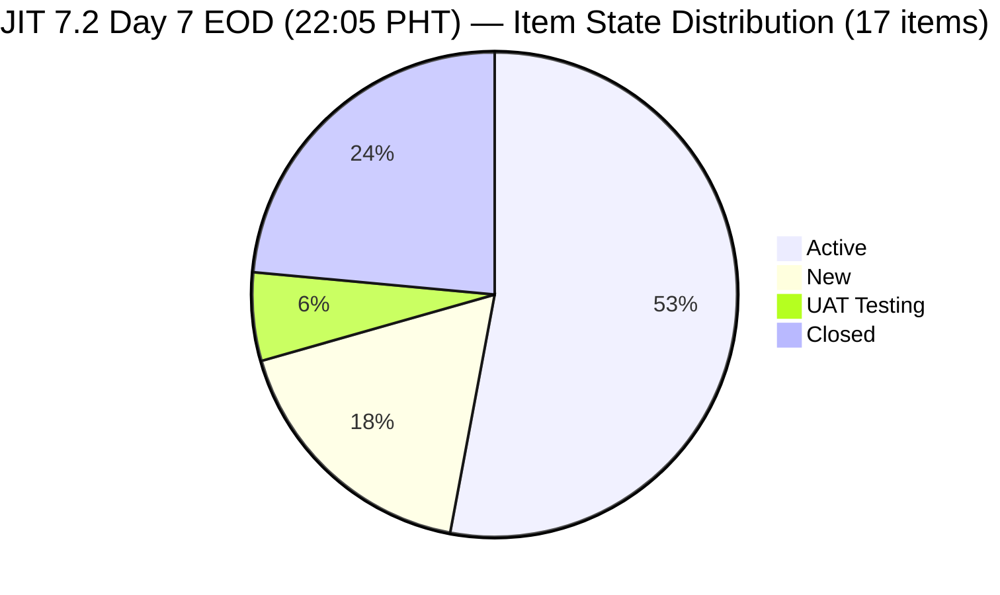
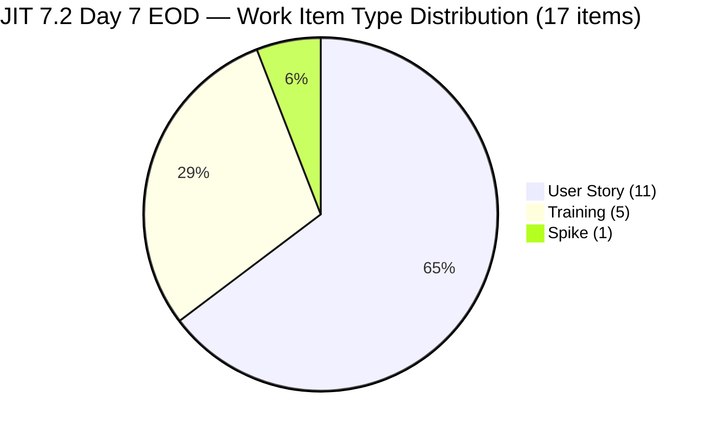
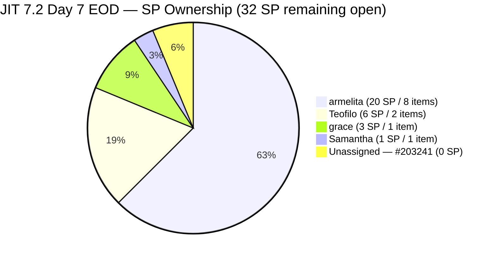
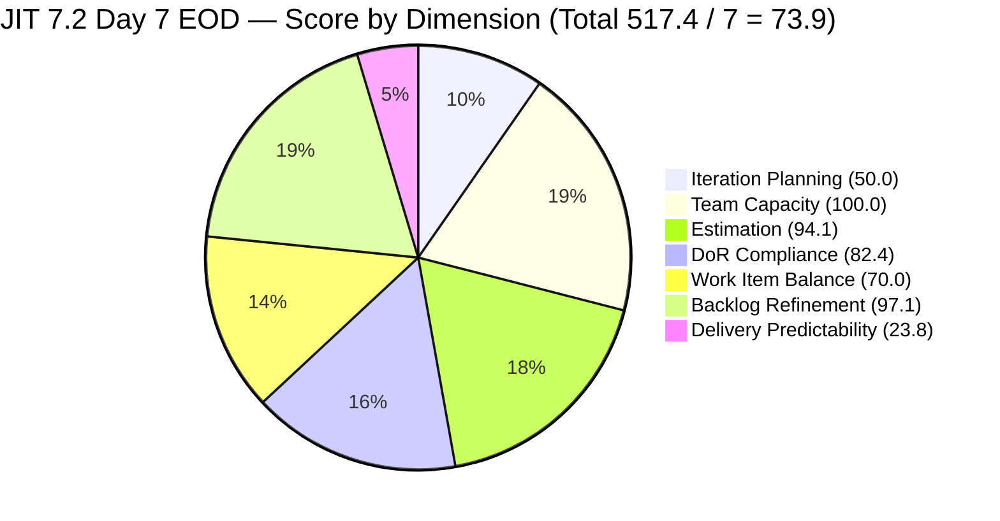

# ADO SAFe Iteration Audit — JIT Operation Team

**Audit #42 | Iteration 7.2 (Apr 20 – May 3, 2026) | Day 7 of 14 (~50% elapsed — Sprint Midpoint EOD)**

---

## 1. Audit Metadata

| Field | Value |
|---|---|
| **Audit Date** | April 26, 2026, 22:05 PHT |
| **Auditor** | Claude Code (ADO SAFe Audit Agent) |
| **Workspace** | `ado_jit` |
| **ADO Project** | Jairosoft Portfolio (`666bb99a-6acd-4999-bb34-efd0e4ea90dc`) |
| **Team** | JIT Operation Team (`b25e3129-6272-4e54-a3ff-f1ef3c8eeb2c`) |
| **Iteration** | Iteration 7.2 — Apr 20 to May 3, 2026 |
| **Iteration ID** | `8edbe25f-fa4f-41b2-aaae-f3d5cf0e5b33` |
| **Sprint Day** | Day 7 of 14 (~50% elapsed — sprint midpoint EOD) |
| **Prior Audit** | AUDIT_20260426_1400.md (Audit #41, 7.2 Day 7, 14:00 PHT, Overall 76.2 — Moderate Risk) |
| **Scoring Model** | ADO SAFe v1 (7-dimension rubric) |
| **Overall Score** | **73.9 / 100** |
| **Risk Band** | **Moderate Risk** (60–79.9) |

---

## 2. Executive Summary

JIT Operation Team scores **73.9 (Moderate Risk)** — a **decline of 2.3 points** from Audit #41 (76.2). The 8 hours since the 14:00 PHT audit have seen significant ADO activity:

**Positive developments:**
- **#203154 (3.1-2 Create AD User Accounts) is now closed** — Teofilo's second AD training module closed. This adds 3 SP to the delivery total (10 SP closed, up from 7 SP).
- **#203155 and #203156 moved to Active state** — Teofilo activated both the AD Security and DHCP Setup training modules, signaling continued AD training progress.
- **#202987 (HCDC MCC Exploration) touched** — Updated Apr 27 00:50 UTC (= Apr 26 at ~20:50 PHT), armelita resumed progress on HCDC curriculum review.

**Score decline drivers:**
- **Work Item Balance dropped to 70.0 (was 100.0, Δ −30.0):** Three training items (#203157, #203158, #203159) were **re-pathed from 7.2 to 7.3**, and #203154 (Training) closed. This reduced the Training count in 7.2 from 8 to 4 (closed). The remaining 7.2 items are now 11 User Stories + 2 Training + 1 Spike = 17 total, with US share at 11/17 = 64.7% — crossing the >60% dominant-type threshold and triggering the −30 penalty.
- **Iteration Planning declined to 50.0 (was 57.1, Δ −7.1):** Visible backlog dropped from 35 to 34 (203154 closed and removed). Current 7.2 items = 17. Score = round(17/34×100,1) = 50.0.
- **Partially offset by:** DoR Compliance rose to 82.4 (was 70.0, Δ +12.4) because 3 items removed from 7.2 were DoR failures. DP rose to 23.8 (was 14.0, Δ +9.8) from 10 SP closed vs 42 SP committed.

**Ongoing concerns (unchanged):**
- #202981 (Interview ADDU Interns) AC still "Passed the interview" ≈ 17–18 non-ws chars — DoR FAIL, 7th consecutive audit.
- #203155 and #203156 now Active but **still have no Description or Acceptance Criteria** — a critical process violation (activating items before DoR is met).
- #203241 (Tech Talk Spike) remains unestimated and unassigned.
- #199092 (TESDA Career Guidance) — Active since Apr 16, now **11 days without ADO update**.
- #193054 (SAFe RTE MC) — 49 days stale (Mar 9 → Apr 27).

---

## 3. Previous Audit Delta

| Dimension | Audit #41 (Apr 26, 14:00 PHT) | Audit #42 (Apr 26, 22:05 PHT) | Delta |
|---|---|---|---|
| Iteration Planning | 57.1 | **50.0** | **−7.1** |
| Team Capacity | 100.0 | **100.0** | 0.0 |
| Estimation | 95.0 | **94.1** | **−0.9** |
| DoR Compliance | 70.0 | **82.4** | **+12.4** |
| Work Item Balance | 100.0 | **70.0** | **−30.0** |
| Backlog Refinement | 97.1 | **97.1** | 0.0 |
| Delivery Predictability | 14.0 | **23.8** | **+9.8** |
| **Overall** | **76.2** | **73.9** | **−2.3** |

### Changes Since Audit #41 (8h05m elapsed)

**Significant ADO activity detected in the 8-hour window:**

| Change | Item | Timestamp (UTC) | Details |
|---|---|---|---|
| **CLOSED** | **#203154** — 3.1-2 Create AD User Accounts | ~Apr 26 (absent from backlog) | 3 SP added to closed total; Teofilo's 2nd AD module done |
| **New → Active** | **#203155** — 3.1-3 Create AD Security | Apr 27 00:06 UTC (= Apr 26 ~20:06 PHT) | Activated; **no Desc/AC added** |
| **New → Active** | **#203156** — 3.2-1 Set-Up DHCP | Apr 27 01:03 UTC (= Apr 26 ~21:03 PHT) | Activated; **no Desc/AC added** |
| **7.2 → 7.3** | **#203157** — 3.2-2 Set-Up Domain Name System | Apr 27 01:44 UTC | Re-pathed; exits 7.2 scope |
| **7.2 → 7.3** | **#203158** — 3.2-3 Set-up Remote Desktop | Apr 27 01:44 UTC | Re-pathed; exits 7.2 scope |
| **7.2 → 7.3** | **#203159** — 3.2-4 Set-Up Folder Redirection | Apr 27 01:44 UTC | Re-pathed; exits 7.2 scope |
| **Touch** | **#202987** — HCDC MCC Exploration | Apr 27 00:50 UTC | armelita updated (state Active, 11 days silence broken) |

**Net effect:** 203154 closed (+3 SP); 203157/158/159 moved to 7.3 (−9 SP from 7.2 committed scope); backlog went from 35 → 34 items.

---

## 4. Current Iteration Snapshot

| Metric | Value | Change vs #41 |
|---|---|---|
| **Iteration** | 7.2 — Apr 20 to May 3, 2026 | — |
| **Iteration Day** | Day 7 of 14 (~50% elapsed) | — |
| **Visible Root Backlog Items** | **34** | −1 (203154 closed) |
| **Current 7.2 Root Items** | **17** (13 open + 4 closed) | −3 (157/158/159 re-pathed to 7.3) |
| **Estimated items (SP > 0)** | **16** (#203241 still no SP) | −1 (denominator change) |
| **Committed SP (estimated 7.2 items)** | **42 SP** | −8 (203157=3SP, 203158=3SP, 203159=3SP re-pathed; 203154=3SP closed but still counted) |
| **Closed SP** | **10 SP** | +3 (203154 closed at 3 SP) |
| **Delivery Predictability** | **23.8%** | +9.8 |
| **Contributors with current work** | 4 (armelita, Teofilo, grace, Samantha) | — |
| **Working days remaining** | 6 (Apr 27–30 + May 2–3) | — |

**Note on Committed SP:** 7.2 items with SP = 199092(2) + 202969(3) + 202972(2) + 202974(2) + 202977(3) + 202981(3) + 202985(3) + 202987(3) + 203155(3) + 203156(3) + 203224(3) + 203268(1) [open=31] + 203153(3) + 198615(2) + 203047(2) + 203154(3) [closed=10] = **42 SP total committed.**

### Current 7.2 Items — State Distribution (17 items)



### Work Item Type Distribution (17 items)



---

## 5. Work Item Analysis

### 5.1 Current 7.2 Item Register — Day 7 EOD

| ID | Title | Type | State | SP | Assignee | Last Changed | Notes |
|----|-------|------|-------|----|----------|-------------|-------|
| **198615** | Awarding of CSS NC II Certificates | US | **Closed** | 2 | armelita | Apr 25 | Day 6 |
| **203047** | Summer Camp Training Implementation | Training | **Closed** | 2 | grace | Apr 25 | Day 6 |
| **203153** | 3.1-1 Creating Active Directory Training | Training | **Closed** | 3 | Teofilo | Apr 24 | Day 5 |
| **203154** | 3.1-2 Create AD User Accounts | Training | **Closed** | 3 | Teofilo | Apr 26–27 | **NEW CLOSURE — 4th closed item** |
| 199092 | TESDA Career Guidance Programs Semestral Report | US | Active | 2 | armelita | **Apr 16** | **UNTOUCHED — 11 days / Active stall** |
| 202969 | Market Bubble MCC April 2026 Class IT7.2 | US | Active | 3 | armelita | Apr 21 | No update since D2 |
| 202972 | Request for Additional Bubble Trainer — Sam | US | Active | 2 | armelita | Apr 22 | No update since D3 |
| 202974 | Python Marketing Activities IT7.2 | US | Active | 2 | armelita | Apr 22 | No update since D3 |
| 202977 | Market CSS NC II April 2026 Class IT7.2 | US | Active | 3 | armelita | Apr 21 | No update since D2 |
| 202981 | Interview ADDU Interns | US | New | 3 | armelita | Apr 20 | **DoR FAIL (AC ~17–18 nws)** |
| 202985 | UIC MCC Exploration | US | Active | 3 | armelita | Apr 23 | No update since D4 |
| 202987 | HCDC MCC Exploration | US | Active | 3 | armelita | **Apr 27 00:50 UTC** | **Touch tonight — 11-day silence broken** |
| 203155 | 3.1-3 Create Active Directory Security | Training | **Active** | 3 | Teofilo | Apr 27 00:06 UTC | **NEW Active — NO Desc/AC** |
| 203156 | 3.2-1 Set-Up DHCP | Training | **Active** | 3 | Teofilo | Apr 27 01:03 UTC | **NEW Active — NO Desc/AC** |
| 203224 | Convert SAFe MCCs to New Forms | US | New | 3 | grace | Apr 23 | — |
| 203241 | IT7.2 Tech Talk — AI Tools Demo | Spike | New | **—** | **Unassigned** | Apr 23 | **No SP; 5th audit** |
| 203268 | Prepare Presentation for Bubble.io | US | UAT Testing | 1 | Samantha | Apr 24 | **4th day in UAT — close now** |

**Closed: 4 / 10 SP | Active: 9 open | New: 3 | UAT: 1**

### 5.2 DoR Assessment — Open Items (13 open in backlog)

| ID | Desc (≥30 nws) | AC (≥20 nws) | DoR | Notes |
|----|-----------------|---------------|-----|-------|
| 199092 | PASS | PASS | **PASS** | — |
| 202969 | PASS | PASS | **PASS** | — |
| 202972 | PASS | PASS | **PASS** | — |
| 202974 | PASS | PASS | **PASS** | — |
| 202977 | PASS | PASS | **PASS** | — |
| 202981 | PASS | FAIL (≈17–18 nws "Passed the interview") | **FAIL** | 7th audit |
| 202985 | PASS | PASS | **PASS** | — |
| 202987 | PASS | PASS | **PASS** | — |
| 203155 | **FAIL** (no Desc) | **FAIL** (no AC) | **FAIL** | Activated WITHOUT DoR — CRITICAL |
| 203156 | **FAIL** (no Desc) | **FAIL** (no AC) | **FAIL** | Activated WITHOUT DoR — CRITICAL |
| 203224 | PASS | PASS | **PASS** | — |
| 203241 | PASS | PASS | **PASS** | — |
| 203268 | PASS | PASS | **PASS** | — |

Open items: 10 PASS / 3 FAIL. Closed items (4): all PASS.
**DoR compliant = 14/17 = 82.4%**

---

## 6. SAFe Compliance Scorecard

| Dimension | Score | Evidence | Notes |
|-----------|-------|----------|-------|
| Iteration Planning | **50.0** | 17/34 visible root items in 7.2 | ↓ −7.1: backlog −1 item; 7.2 −3 items (re-pathed to 7.3) |
| Team Capacity | **100.0** | 4/4 contributors with configured capacity | Unchanged |
| Estimation | **94.1** | 16/17 estimated; #203241 still no SP | ↓ −0.9: denominator changed 20→17 |
| DoR Compliance | **82.4** | 14/17 items pass (10 open + 4 closed) | ↑ +12.4: 3 DoR-fail items re-pathed out of 7.2 |
| Work Item Balance | **70.0** | US=11/17=64.7% → >60% → −30 | ↓ −30.0: Training items closed/re-pathed; US now dominant |
| Backlog Refinement | **97.1** | fresh=33/34=97.1%; untouched=1/17=5.9% | 0.0: #193054 still stale (49 days) |
| Delivery Predictability | **23.8** | 10 SP closed / 42 SP committed | ↑ +9.8: #203154 closed (3 SP); committed scope reduced |
| **Overall** | **73.9** | (50.0+100.0+94.1+82.4+70.0+97.1+23.8) / 7 = 517.4 / 7 | **Moderate Risk** ↓ −2.3 vs Audit #41 |

### Score Computation Detail

```
1. Iteration Planning
   visible_root_backlog_items           = 34  (203154 closed/absent; was 35)
   current_iteration_7.2_items          = 17  (13 open + 4 closed; 203157/158/159 re-pathed to 7.3)
   Score = round(17/34 × 100, 1)        = 50.0

2. Team Capacity
   contributors_with_current_work       = 4
   contributors_with_capacity           = 4
   Score = round(4/4 × 100, 1)          = 100.0

3. Estimation
   point_eligible_current_items         = 17
   estimated (SP > 0)                   = 16  (#203241 no SP)
   Score = round(16/17 × 100, 1)        = 94.1

4. DoR Compliance
   current_7.2_items                    = 17
   dor_compliant                        = 14  (10 open PASS + 4 closed PASS)
   Score = round(14/17 × 100, 1)        = 82.4

5. Work Item Balance
   User Story present = Yes              → no −40
   dominant_type (US) = 11/17 = 64.7%   → >60% → −30
   spike_share = 1/17 = 5.9%            → NOT >40% → 0
   Score = max(0, 100 − 30)            = 70.0

6. Backlog Refinement
   fresh (≥ Mar 10, 2026)               = 33/34 = 97.1%  (203154 closed/absent; 193054 still stale)
   stale_90 (< Jan 26, 2026)            = 0/34 = 0%      → no penalty
   stale_180 (< Oct 28, 2025)           = 0              → no penalty
   untouched_current (< Apr 20, in 7.2) = 1/17 = 5.9%   → not >10% → 0
   Score = max(0, 97.1 − 0)            = 97.1

7. Delivery Predictability
   committed_story_points               = 42
     [open 7.2 items: 199092(2)+202969(3)+202972(2)+202974(2)+202977(3)+202981(3)
                     +202985(3)+202987(3)+203155(3)+203156(3)+203224(3)+203268(1)=31
      closed 7.2 items: 203153(3)+198615(2)+203047(2)+203154(3)=10
      203241 = 0 (no SP) — excluded
      total = 31+10 = 41 + #203241 unestimated = 42 SP committed from 16 estimated items]
   closed_story_points                  = 10
   Score = round(10/42 × 100, 1)        = 23.8

Overall = round((50.0+100.0+94.1+82.4+70.0+97.1+23.8)/7, 1)
        = round(517.4/7, 1) = round(73.914, 1) = 73.9  → MODERATE RISK
```

### Recovery Scenarios from Audit #42 (73.9)

```
Scenario A — Add SP to #203241 only:
  Est = round(17/17 × 100, 1) = 100.0 (+5.9)
  Overall = round(523.3/7, 1) = 74.8  → Moderate

Scenario B — Scenario A + #203268 closes (1 SP):
  DP = round(11/42 × 100, 1) = 26.2  (+2.4)
  Overall = round(525.7/7, 1) = 75.1  → Moderate

Scenario C — Scenario B + Fix DoR of #203155, #203156, #202981:
  DoR = round(17/17 × 100, 1) = 100.0  (+17.6)
  Overall = round(543.3/7, 1) = 77.6  → Moderate (near top)

Scenario D — Scenario C + armelita closes 3 items (9 SP):
  DP = round(20/42 × 100, 1) = 47.6  (+23.8 vs current)
  Overall = round(566.7/7, 1) = 80.9  → LOW RISK ✓

Scenario E — Scenario C + #193054 touched (BR→100.0):
  BR = 100.0 (+2.9)
  Overall = round(546.2/7, 1) = 78.0  → Moderate
```

**Work Item Balance is now the binding constraint for Low Risk.** With US share at 64.7%, the team needs either Training items activated/closed in 7.2 or a non-US item delivery to bring US% back below 60%.

---

## 7. Dimension Findings

### 7.1 Iteration Planning — 50.0 (High Risk — declined −7.1)

17 of 34 visible root items are in 7.2. The re-pathing of #203157, #203158, #203159 to 7.3 was a positive scope management action (right-sizing 7.2 for the remaining sprint) but reduced the IP numerator and denominator simultaneously. Net effect: score dropped from 57.1 to 50.0 — crossing the High Risk threshold for this dimension.

Items outside 7.2 (17 items):
| Category | Count | IDs |
|----------|-------|-----|
| PI6 residue (Active/New) | 4 | #200766, #202514–202516 |
| PI6-path (New) | 1 | #202517 |
| PI7 no sub-iteration | 1 | #202547 |
| PI7 future (7.3–7.5) | 9 | #200767, #200768, #200771, #203157–162, #203242–245 |
| Root (no iteration) | 2 | #188995, #193054 |

### 7.2 Team Capacity — 100.0 (Low Risk)

All 4 contributors active with configured capacity (JIT team: 12.8h/day total, 2 days off remaining). armelita leads at 6h/day with 8 open items. Teofilo at 4h/day with 2 open 7.2 items (#203155, #203156) in Active state. grace and Samantha at 1h/day each.

### 7.3 Estimation — 94.1 (Low Risk — 1 item from 100%)

16 of 17 current 7.2 items have SP > 0. #203241 (Tech Talk Spike) remains unestimated for 5 consecutive audits. Any SP > 0 value → Estimation = 100.0 (+5.9 score, +0.8 overall).

### 7.4 DoR Compliance — 82.4 (Low Risk — improved but new violations)

**Score improved from 70.0 to 82.4** primarily because the 3 re-pathed items (203157/158/159) were all DoR-fail items and exited the 7.2 denominator. However, two NEW DoR violations have been introduced:

| ID | Violation | Severity |
|----|-----------|----------|
| **#203155** | Activated with NO Description, NO Acceptance Criteria | **CRITICAL — item is now Active without DoR** |
| **#203156** | Activated with NO Description, NO Acceptance Criteria | **CRITICAL — item is now Active without DoR** |
| **#202981** | AC ≈ 17–18 non-ws chars ("Passed the interview") — below 20 threshold | 7th consecutive audit |

**Activating items #203155 and #203156 without Description or Acceptance Criteria is a SAFe DoR process failure.** Teofilo demonstrated the correct approach on #203154 (3.1-2) — he added a structured template before activation. The same should have been applied to #203155 and #203156 before moving them to Active.

### 7.5 Work Item Balance — 70.0 (Moderate — NEW decline)

**This is the largest negative driver in Audit #42.** Type distribution change:

| Period | US | Training | Spike | US% | Score |
|--------|-----|---------|-------|-----|-------|
| Audit #41 (20 items) | 11 | 8 | 1 | 55.0% | 100.0 |
| Audit #42 (17 items) | 11 | 5 | 1 | 64.7% | **70.0** |

The re-pathing of 3 Training items to 7.3 and closure of 1 Training item (203154) preserved the User Story count at 11 while reducing the total. This tipped US% above the 60% dominant-type threshold.

**Recovery path:** If any of the 5 Training items in 7.2 close (reducing US% or maintaining balance), or if the 7.3-pathed items are brought back, the balance could recover. Alternatively, if armelita or grace closes a non-Training item but the Training count stays at 5, US% stays at 11/(closed-items-adjusted). The most straightforward recovery is to close Training items first.

### 7.6 Backlog Refinement — 97.1 (Low Risk)

| Gate | Value | Threshold | Penalty |
|------|-------|-----------|---------|
| fresh_visible (≥ Mar 10, 2026) | 33/34 = 97.1% | n/a | Base = 97.1 |
| stale_90 (< Jan 26, 2026) | 0/34 | >25% → −20 | 0 |
| stale_180 (< Oct 28, 2025) | 0 | ≥1 → −20 | 0 |
| untouched_current (< Apr 20, 7.2 items) | 1/17 = 5.9% | >10% → −10 | 0 |
| **Total** | | | **97.1** |

**#193054 (SAFe RTE MC) — now 49 days stale (Mar 9 → Apr 27 PHT).** Any touch (edit or comment) restores this item to fresh and raises base from 97.1 to 100.0 (+2.9, +0.4 overall). Still a trivial fix for grace.

**#199092 (TESDA Career Guidance) — Active since Apr 16, 11 calendar days silent.** Tonight's activity on #202987 shows armelita is working. #199092 should be updated with a progress note. At 1/17 = 5.9% untouched current, it stays below the 10% penalty threshold.

### 7.7 Delivery Predictability — 23.8 (Day 7 EOD — improved)

**#203154 closed tonight adds 3 SP to the closed total:**

| ID | Title | SP | Owner | Closed |
|----|-------|----|----|-------|
| 203153 | 3.1-1 Creating Active Directory Training | 3 | Teofilo | Apr 24 |
| 198615 | Awarding of CSS NC II Certificates | 2 | armelita | Apr 25 |
| 203047 | Summer Camp Training Implementation | 2 | grace | Apr 25 |
| **203154** | **3.1-2 Create AD User Accounts** | **3** | **Teofilo** | **Apr 26–27** |

**DP = 23.8% (10/42 SP) — Day 7 EOD.** Committed scope also decreased (42 SP vs 50 SP) due to 9 SP re-pathed to 7.3. The 3.8/day to achieve 80% DP (33.6 SP) in 6 remaining days is still ambitious but less extreme than before.

**Remaining open SP:** 32 SP. Of this, armelita owns 20 SP (8 items), Teofilo owns 6 SP (203155+203156), grace owns 3 SP (203224), Samantha owns 1 SP (203268), unassigned 0 SP (203241).



---

## 8. Risks and Bottlenecks

| # | Risk | Severity | Trend vs #41 |
|---|------|----------|------|
| R1 | **#203155 and #203156 now Active WITHOUT Description or Acceptance Criteria.** Items were activated tonight without meeting DoR. Teofilo successfully used a template on #203154 — same should apply here. | **CRITICAL** | **NEW** |
| R2 | **Work Item Balance at 70.0 — US share 64.7% crossing >60% threshold.** Training re-pathing and closure shifted composition. Requires either Training item closure or US% reduction. | **HIGH** | **NEW decline** |
| R3 | **armelita owns 20 SP / 8 items (63% of remaining open scope).** 7 of her 8 items are Active or New with minimal recent updates. Concentration risk continues. | **HIGH** | Unchanged |
| R4 | **#203241 (Tech Talk Spike) unassigned and unestimated — 5th consecutive audit.** Window to deliver a 7.2 Tech Talk is now critical (6 days remaining). | **HIGH** | Escalating |
| R5 | **#203268 (Bubble Presentation) in UAT for 4 days.** Should be closed immediately. | **MEDIUM** | Escalating |
| R6 | **#202981 AC too short — 7th consecutive audit.** "Passed the interview" ≈ 17–18 non-ws chars. Adding 3 words brings DoR to PASS. | **MEDIUM** | Unchanged |
| R7 | **#199092 (TESDA Career Guidance) — Active 11 days without meaningful ADO update.** | **MEDIUM** | Escalating |
| R8 | **IP dropped to 50.0 (High Risk dimension).** 17/34 items in sprint. PI6 residue items (#200766, #202514–202517) continue to inflate denominator. | **MEDIUM** | Worsened |
| R9 | **#193054 freshness (49 days).** 2.9-point BR drag; any touch resolves. | **LOW** | Increasing |
| R10 | **No sprint goal for 7.2.** | **LOW** | Persistent |

---

## 9. Prioritized Recommendations

| Priority | Action | Owner | Target | Impact |
|----------|--------|-------|--------|--------|
| **P0** | **Add Desc + AC to #203155 (AD Security) immediately.** Item is Active without DoR — a process violation. Use #203154 as template. ~5 min. | Teofilo | Apr 27 AM | DoR; removes Active-without-DoR risk |
| **P0** | **Add Desc + AC to #203156 (DHCP Setup) immediately.** Same issue as above. | Teofilo | Apr 27 AM | DoR; removes Active-without-DoR risk |
| **P0** | **Close #203268 (Bubble Presentation, 1 SP).** In UAT for 4 days — if slides are ready, close now. | Samantha | Apr 26–27 | DP: 23.8→26.2; Overall +0.3 |
| **P1** | **Assign and estimate #203241 (Tech Talk Spike).** Assign armelita/Ramon; set SP = 1–2; confirm event date within 7.2 (6 days left). | armelita / Ramon | Apr 27 | Est: 94.1→100.0; Overall +0.8 |
| **P1** | **Expand AC on #202981 (Interview ADDU Interns).** E.g., "Candidate passed the initial intern interview screening process." → >20 nws. | armelita | Apr 27 | DoR improvement |
| **P1** | **Close #203155 or #203156 once DoR is set.** Teofilo's training pace (1 module every 2–3 days) suggests these could close by Apr 28–29. | Teofilo | Apr 28–29 | DP improvement; WIB recovery toward 100 |
| **P1** | **Update #199092 (TESDA Career Guidance) with progress comment.** 11 days Active without ADO activity. | armelita | Apr 27 | Untouched risk management |
| **P1** | **Touch #193054 (SAFe RTE MC).** Any edit or comment. | grace | Apr 27 | BR: 97.1→100.0; Overall +0.4 |
| **P2** | **armelita: close 2–3 Marketing items by Apr 28.** #202985 (UIC MCC) and #202987 (HCDC MCC) are closest to done based on activity. Each 3 SP. | armelita | Apr 27–28 | DP improvement; moves toward Low Risk |
| **P3** | **Define 7.2 sprint goal.** Suggested: "By May 3, complete AD modules 3.1-3 and 3.2-1, close CSS NC II + Bubble MCC enrollment campaigns, conduct AI Tools Tech Talk, and submit TESDA EBET requirements." | Ramon / armelita | Apr 27 | Process hygiene |

---

## 10. Evidence Gaps and Limitations

| Gap | Impact | Notes |
|-----|--------|-------|
| **203154 closure timestamp** | Closed after Audit #41 (14:00 PHT) but before Audit #42 (22:05 PHT). Exact closure time not captured. | 3 SP counted in closed total. |
| **203157/158/159 re-pathing rationale** | Unknown whether these were intentionally de-scoped from 7.2 or moved as part of Teofilo's sequential training plan. | Treated as intentional scope management. |
| **#203241 event date** | Tech Talk cannot be confirmed as schedulable in 7.2 without assignment and date. | 6 days remaining — window closing. |
| **#202981 AC exact char count** | "Passed the interview" — estimated at 17–18 non-ws chars. Exact count depends on HTML rendering. | Consistently below 20 threshold across 7 audits. |
| **#193054 freshness** | Mar 9 = 49 days → stale. −2.9pp BR drag. | Any touch resolves. |
| **No sprint goal in ADO** | Not detectable via API. | Advisory — P3. |

---

## 11. Score Trajectory — JIT PI7 Audit Series

| Audit | Date/Time | Day | Overall | Band | Key Driver |
|-------|------|-----|---------|------|------------|
| #33 | Apr 19 | 7.1 D14 | 68.8 | Moderate | Sprint close 0 DP |
| #34 | Apr 21 | 7.2 D2 | 72.9 | Moderate | 7.2 opened |
| #39 | Apr 24 AM | 7.2 D5 | 74.0 | Moderate | #203154 DoR fixed |
| #40 | Apr 25 PM | 7.2 D6 | 76.2 | Moderate | 3 closures; DP 0→14.0 |
| #41 | Apr 26 14:00 | 7.2 D7 | 76.2 | Moderate | Midpoint hold |
| **#42** | **Apr 26 22:05** | **7.2 D7 EOD** | **73.9** | **Moderate** | **WIB −30; IP −7.1; DP +9.8; DoR +12.4** |



**The evening's activity (4 changes) produced mixed results:** The 203154 closure and 203157/158/159 re-pathing were positive sprint management actions that improved DP (+9.8) and DoR (+12.4), but they tipped Work Item Balance into the −30 zone and reduced IP by 7.1. The net is a 2.3-point overall decline.

**Path back to 76.2 (Audit #41 level):** Teofilo adds DoR to #203155 and #203156 (+4.1 DoR contribution), Samantha closes #203268 (+0.3 DP), and armelita estimates #203241 (+0.8 Est) = +5.2 → 79.1. **Low Risk requires one more significant delivery from armelita.**

---

*Report generated by Claude Code ADO SAFe Audit Agent | April 26, 2026 22:05 PHT*
*Audit #42 — JIT Operation Team — Iteration 7.2 Day 7 EOD — Overall: 73.9 / 100 — Moderate Risk (−2.3 vs Audit #41)*
*Data source: Live ADO MCP pull — Apr 26, 2026 22:05 PHT | 34 visible backlog items; 17 current 7.2 items (13 open + 4 closed); 42 SP committed; 10 SP closed*
