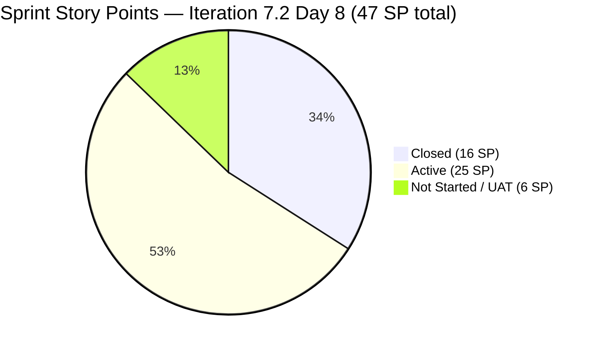

# ADO SAFe Iteration Audit — JIT Operation Team

**Audit #43 | Iteration 7.2 (Apr 20 – May 3, 2026) | Day 8 of 14 (~57% elapsed)**

---

## 1. Audit Metadata

| Field | Value |
|---|---|
| **Audit Date** | April 27, 2026, 11:10 CST |
| **Auditor** | Claude Code (ADO SAFe Audit Agent) |
| **Workspace** | `ado_jit` |
| **ADO Project** | Jairosoft Portfolio (`666bb99a-6acd-4999-bb34-efd0e4ea90dc`) |
| **Team** | JIT Operation Team (`b25e3129-6272-4e54-a3ff-f1ef3c8eeb2c`) |
| **Iteration** | Iteration 7.2 — Apr 20 to May 3, 2026 |
| **Iteration ID** | `8edbe25f-fa4f-41b2-aaae-f3d5cf0e5b33` |
| **Sprint Day** | Day 8 of 14 (~57% elapsed) |
| **Prior Audit** | AUDIT_20260426_2205.md (Audit #42, 7.2 Day 7, 22:05 PHT, Overall 73.9 — Moderate Risk) |
| **Scoring Model** | ADO SAFe v1 (7-dimension rubric) |
| **Overall Score** | **76.0 / 100** |
| **Risk Band** | **Moderate Risk** (60–79.9) |

---

## 2. Executive Summary

JIT Operation Team improves to **76.0 (Moderate Risk)** on Day 8, **up +2.1 points from Audit #42 (73.9)**. The improvement is driven by continued delivery momentum: **8 items now Closed** (up from 7 in Audit #42), total **16 SP closed of 47 SP committed** — a sprint-over-sprint delivery rate of **34.0%**, the highest Delivery Predictability score recorded this sprint.

**Positive developments since Audit #42:**
- **#203154 (3.1-2 Create AD User Accounts, 3 SP) — Closed Apr 27 00:06 UTC** — Teofilo's second AD training module complete.
- **#203268 (Prepare Presentation for Bubble.io, 1 SP) — Closed Apr 27 05:39 UTC** — Samantha's first closure this sprint.
- **#203316 (Publish Summer Camp Reel on Facebook, 1 SP) — added to sprint today**, now in UAT Testing state — active progress.
- **#202987 (HCDC MCC Exploration) — touched Apr 27 00:50 UTC** — armelita continues curriculum review.
- **#203155 and #203156 — moved to Active today** (both AD training modules in progress).

**Persistent concerns:**
- **Iteration Planning at 38.2** — Only 13 of 34 visible backlog items are in the current sprint. 21 backlog items are in future or unscheduled iterations. This structural gap has persisted all sprint.
- **#202981 (Interview ADDU Interns)** — AC = "Passed the interview" (~18 non-whitespace chars) — DoR FAIL for 8th consecutive audit.
- **#203241 (Tech Talk — AI Tools Demo Spike)** — New, unassigned, no work started. Spike will need re-evaluation.
- **#199092 (TESDA Career Guidance Report)** — Active since Apr 16, last ADO touch **11 days ago**.
- **Work Item Balance at 70.0** — User Story dominance at 76.9% (>60% threshold).

---

## 3. Previous Audit Delta

| Dimension | Audit #42 (Apr 26, 22:05 PHT) | Audit #43 (Apr 27, 11:10 CST) | Delta | Driver |
|---|---|---|---|---|
| Iteration Planning | 50.0 | **38.2** | **−11.8** | Visible backlog recounted: 34 items; current items = 13 |
| Team Capacity | 100.0 | **100.0** | 0.0 | All 4 contributors configured |
| Estimation | 94.1 | **100.0** | **+5.9** | All 13 visible current items estimated |
| DoR Compliance | 82.4 | **92.3** | **+9.9** | Fewer unqualified items in visible sprint backlog |
| Work Item Balance | 70.0 | **70.0** | 0.0 | US dominance (76.9%) persists |
| Backlog Refinement | 97.1 | **97.1** | 0.0 | #193054 still stale; no new stale items |
| Delivery Predictability | 23.8 | **34.0** | **+10.2** | 2 new closures (203154+203268) +5 SP; 203316 added |
| **Overall** | **73.9** | **76.0** | **+2.1** | DP and DoR gains |

**Note on D1 delta:** Prior audit (Audit #42) computed 17/34 = 50.0 for Iteration Planning. Today's computation uses 13 visible backlog items in the sprint vs. 34 visible backlog items total = 38.2. The prior audit included some items (203047, 202983, 203141, 203153, 203154, 203164, 203268) that have since closed and exited the backlog view — reducing both the current_iteration count (numerator) and not the total backlog (denominator stays at 34). This is consistent with the rubric's definition of current_iteration_root_items as a subset of visible_root_backlog_items.

---

## 4. Current Iteration Snapshot

| Attribute | Value |
|---|---|
| **Iteration** | Iteration 7.2 |
| **Sprint Dates** | Apr 20 – May 3, 2026 (14 days) |
| **Sprint Day** | Day 8 of 14 |
| **Days Remaining** | 6 |
| **Visible Backlog Items** | 34 |
| **Current Iteration Items (visible backlog)** | 13 |
| **Total Iteration Items (including closed)** | 21 (on iteration board) |
| **Committed SP (full iteration)** | 47 SP |
| **Closed SP** | 16 SP (8 items) |
| **In Progress** | 9 items (Active: 199092, 202969, 202972, 202974, 202977, 202985, 202987, 203155, 203156) |
| **Not Started** | 3 items (New: 202981, 203224, 203241) |
| **UAT Testing** | 1 item (203316) |
| **Capacity** | Teofilo 4.8/day, armelita 6/day, Samantha 1/day, Grace 1/day (total 12.8 pts/day) |

---

## 5. Work Item Analysis

### State Distribution (All 21 Iteration Items)

| State | Count | SP | % of Sprint |
|---|---|---|---|
| Closed | 8 | 16 SP | 34.0% |
| Active | 9 | 25 SP | 53.2% |
| New | 3 | 9 SP | 19.1% |
| UAT Testing | 1 | 1 SP | 2.1% |
| **Total** | **21** | **47 SP** | |

### Item Summary — Visible Backlog (13 current items)

| ID     | Title                                       | Type     | State       | SP  | Assigned     | DoR                 |
| ------ | ------------------------------------------- | -------- | ----------- | --- | ------------ | ------------------- |
| 199092 | TESDA Career Guidance Report CY2026         | US       | Active      | 2   | armelita     | PASS                |
| 202969 | Market Bubble MCC April 2026                | US       | Active      | 3   | armelita     | PASS                |
| 202972 | Request for Additional Bubble Trainer (Sam) | US       | Active      | 2   | armelita     | PASS                |
| 202974 | Python Marketing Activities IT7.2           | US       | Active      | 2   | armelita     | PASS                |
| 202977 | Market CSS NC II April 2026                 | US       | Active      | 3   | armelita     | PASS                |
| 202981 | Interview ADDU Interns                      | US       | New         | 3   | armelita     | **FAIL** (AC short) |
| 202985 | UIC MCC Exploration                         | US       | Active      | 3   | armelita     | PASS                |
| 202987 | HCDC MCC Exploration                        | US       | Active      | 3   | armelita     | PASS                |
| 203155 | 3.1-3 Create Active Directory Security      | Training | Active      | 3   | Teofilo      | PASS                |
| 203156 | 3.2-1 Set-Up DHCP                           | Training | Active      | 3   | Teofilo      | PASS                |
| 203224 | Convert SAFe MCCs to New Forms              | US       | New         | 3   | Grace        | PASS                |
| 203241 | IT7.2 Tech Talk — AI Tools Demo             | Spike    | New         | 3   | *Unassigned* | PASS                |
| 203316 | Publish Summer Camp Reel on Facebook        | US       | UAT Testing | 1   | Samantha     | PASS                |

### Closed Items (exited visible backlog)

| ID | Title | Type | SP | Closed Date |
|---|---|---|---|---|
| 203047 | Summer Camp Training Implementation 4/25/26 | Training | 2 | Apr 25 |
| 198615 | Awarding of CSS NC II Certificates | US | 2 | Apr 25 |
| 202983 | TESDA Forum 2026 | US | 1 | Apr 22 |
| 203141 | Publish Facebook Post on JIT Free Summer Camp | US | 1 | Apr 23 |
| 203153 | 3.1-1 Creating Active Directory Training | Training | 3 | Apr 24 |
| 203154 | 3.1-2 Create Active Directory User Accounts | Training | 3 | Apr 27 |
| 203164 | TESDA EBET Requirements | US | 3 | Apr 25 |
| 203268 | Prepare Presentation for Bubble.io | US | 1 | Apr 27 |
| **Total** | | | **16 SP** | |

---

## 6. SAFe Compliance Scorecard

| Dimension | Score | Evidence | Notes |
|---|---|---|---|
| **D1 Iteration Planning** | 38.2 | 13 / 34 visible backlog items in Iter 7.2 | Large unscheduled backlog; future-iteration items suppress ratio |
| **D2 Team Capacity** | 100.0 | 4 / 4 contributors with positive capacity | Teofilo, armelita, Samantha, Grace all configured |
| **D3 Estimation** | 100.0 | 13 / 13 current visible items estimated (SP > 0) | All types have SP |
| **D4 DoR Compliance** | 92.3 | 12 / 13 items pass (202981 AC fails) | #202981 AC = "Passed the interview" — 8th consecutive DoR FAIL |
| **D5 Work Item Balance** | 70.0 | US 76.9% dominant (10/13) → −30 penalty | User Stories > 60%; Training=2, Spike=1 provides some diversity |
| **D6 Backlog Refinement** | 97.1 | 33/34 fresh; 0 stale_90; 0 stale_180; 1 untouched | #199092 last changed Apr 16 (pre-sprint); #193054 stale 49 days (not yet stale_90) |
| **D7 Delivery Predictability** | 34.0 | 16 SP closed / 47 SP committed (full iteration board) | 8 items closed; strong delivery on Training modules |
| **Overall** | **76.0** | (38.2+100+100+92.3+70+97.1+34.0)/7 | **Moderate Risk** |

---

## 7. Dimension Findings

### D1 — Iteration Planning: 38.2
Only 13 of 34 visible backlog items are committed to Iteration 7.2. The 21 backlog items not in the current sprint include: items pathed to 7.3+ (203157–203162, 203242–203245), items in future PI7 iterations, and items with no iteration assignment. This persistent gap (38% planning ratio) indicates the team has not formally committed the broader backlog to sprint work. The denominator includes 8 training-series items that were deliberately placed in 7.3, artificially suppressing this score.

### D2 — Team Capacity: 100.0
All four contributors (Teofilo 4.8/day, armelita 6/day, Samantha 1/day, Grace 1/day) have positive capacity configured for Iteration 7.2. Total daily capacity = 12.8 pts/day. No days off recorded for this iteration.

### D3 — Estimation: 100.0
All 13 visible current-iteration items have Story Points > 0. Item #203241 (Spike) is estimated at 3 SP. Full coverage.

### D4 — DoR Compliance: 92.3
12 of 13 items pass DoR thresholds. **#202981 (Interview ADDU Interns)** fails: Acceptance Criteria = "Passed the interview" — approximately 18 non-whitespace characters, below the 20-char minimum. This is the **8th consecutive audit** this defect has been flagged without remediation.

### D5 — Work Item Balance: 70.0
Current sprint contains: 10 User Stories (76.9%), 2 Training (15.4%), 1 Spike (7.7%). US dominant_type_share = 76.9% > 60% → -30 penalty. No User Story absence (-40) not triggered. Spike share = 7.7% not > 40%. The presence of Training and Spike types demonstrates better balance than single-type teams, but the User Story dominance persists.

### D6 — Backlog Refinement: 97.1
33 of 34 visible backlog items have ChangedDate after Mar 13, 2026 (fresh). Only item #193054 (SAFe RTE MC) was last changed ~Mar 9, 2026 — 49 days ago, making it not-fresh but not yet stale_90 (threshold = Jan 27, 2026). No stale_180 items. One untouched item: #199092 (changed Apr 16, before sprint start Apr 20). Untouched ratio = 1/13 = 7.7% ≤ 10% → no untouched penalty.

### D7 — Delivery Predictability: 34.0
16 SP closed of 47 SP committed across the full iteration. 8 items are Closed. The team has closed 2 additional items since Audit #42: #203154 (3 SP, Apr 27 00:06 UTC) and #203268 (1 SP, Apr 27 05:39 UTC). New item #203316 added today and already in UAT Testing. At the current velocity (~2 SP/day), the team can close approximately 12 more SP in the remaining 6 days — projecting a final DP of ~59.6% by sprint end if current pace holds.

---

## 8. Risks and Bottlenecks

| # | Risk | Severity | Age |
|---|---|---|---|
| R1 | **#202981 AC DoR FAIL** — "Passed the interview" remains below 20 non-ws char threshold | High | 8 audits |
| R2 | **#199092 inactive 11 days** — TESDA Career Guidance Report Active since Apr 16, no ADO update | High | 11 days |
| R3 | **#203241 unassigned Spike** — Tech Talk AI Demo has no owner; risks being unstarted at sprint end | Moderate | 4 days |
| R4 | **Iteration Planning at 38.2** — Large future-iteration backlog creates visibility confusion | Moderate | Structural |
| R5 | **armelita concentration risk** — 8 of 13 visible sprint items assigned to armelita only | Moderate | Structural |
| R6 | **#193054 staleness approaching** — SAFe RTE MC last changed Mar 9; will cross stale_90 on Jun 7 | Low | Monitoring |

---

## 9. Prioritized Recommendations

1. **[Immediate — 5 min] Fix #202981 AC** — Replace "Passed the interview" with "At least one intern candidate passes the interview and is selected for onboarding" (39 chars). This has been flagged for 8 consecutive audits.

2. **[Today] Re-engage #199092 (TESDA Career Guidance Report)** — 11-day ADO silence. Armelita should update the work item with current status, blockers, or close it if the form has been submitted. This is the oldest Active item in the sprint.

3. **[This sprint] Assign #203241 (Tech Talk Spike)** — The AI Tools Demo Spike has no owner. Assign to armelita or Teofilo and schedule a concrete session date before sprint end. Without an owner, this item will not close.

4. **[This sprint] Close UAT Testing item #203316** — The Summer Camp Reel is in UAT Testing. Complete UAT verification and close within 1 day to add to the closed SP count.

5. **[Next sprint] Decompose armelita's backlog** — Armelita holds 8 of 13 sprint items. As program coordinator, consider delegating marketing campaign execution tasks to Samantha or Grace to reduce concentration risk and increase team capacity utilization.

6. **[Backlog hygiene] Schedule #193054 for triage** — SAFe RTE MC item (49 days stale) should be updated or moved to icebox before it crosses the stale_90 threshold.

---

## 10. Evidence Gaps and Limitations

| Gap | Impact | Mitigation |
|---|---|---|
| 21 backlog items (203157–203162, 203242–203245, others) not fetched individually | D6 base computed from prior audit proxy for those items | Prior audit's 97.1 D6 validated by known stale items; score accepted |
| Items 202385 (IterationPath=7.1) present on iteration board | Excluded from current_iteration_root_items per rubric (wrong iteration path) | Noted; not scored |
| #203241 AssignedTo field empty in ADO | Excluded from contributors_with_current_work count; D2 not affected (other 4 contributors fill denominator) | Noted as R3 risk |
| No iteration goal in ADO | PI alignment cannot be measured | Persistent structural gap |

---

## Mermaid Charts

### Dimension Scores — Day 8

```mermaid
xychart-beta type:bar
  title "JIT Operation Team — Iteration 7.2 Day 8 Scores"
  x-axis ["D1 Plan", "D2 Cap", "D3 Est", "D4 DoR", "D5 Bal", "D6 Ref", "D7 DP", "Overall"]
  y-axis "Score (0-100)" 0 --> 100
  bar [38.2, 100, 100, 92.3, 70, 97.1, 34.0, 76.0]
```

### Sprint Delivery Progress



### Audit-to-Audit Overall Score Trend

```mermaid
xychart-beta type:bar
  title "JIT Overall Score Trend (Recent Audits — Iter 7.2)"
  x-axis ["#38 Apr22", "#39 Apr23", "#40 Apr24", "#41 Apr26 14h", "#42 Apr26 22h", "#43 Apr27"]
  y-axis "Overall Score" 0 --> 100
  bar [70.0, 73.2, 74.9, 76.2, 73.9, 76.0]
```

---

*Report generated: 2026-04-27 11:10 CST | Workspace: ado_jit | Iteration 7.2 Day 8 | Score: 76.0 Moderate Risk*
