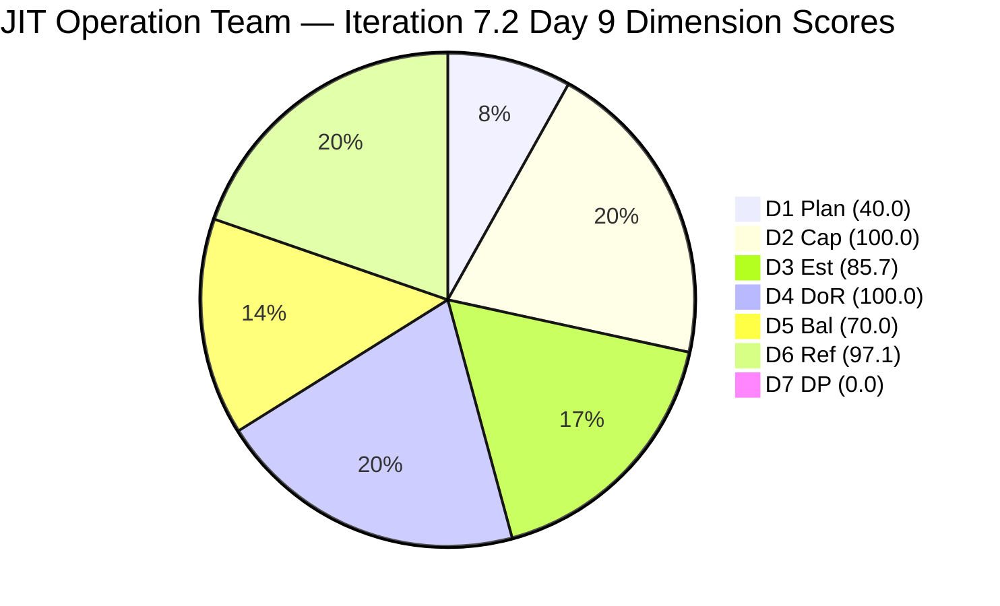
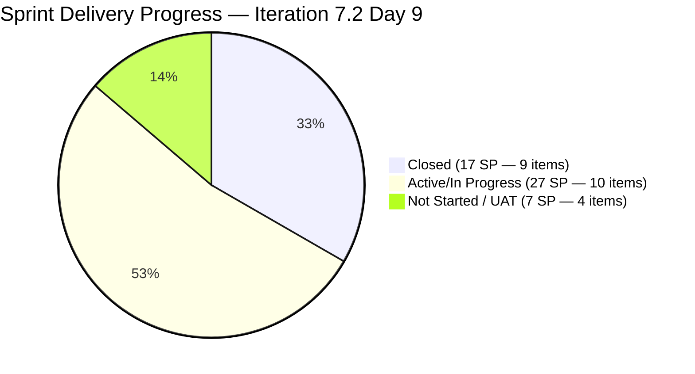
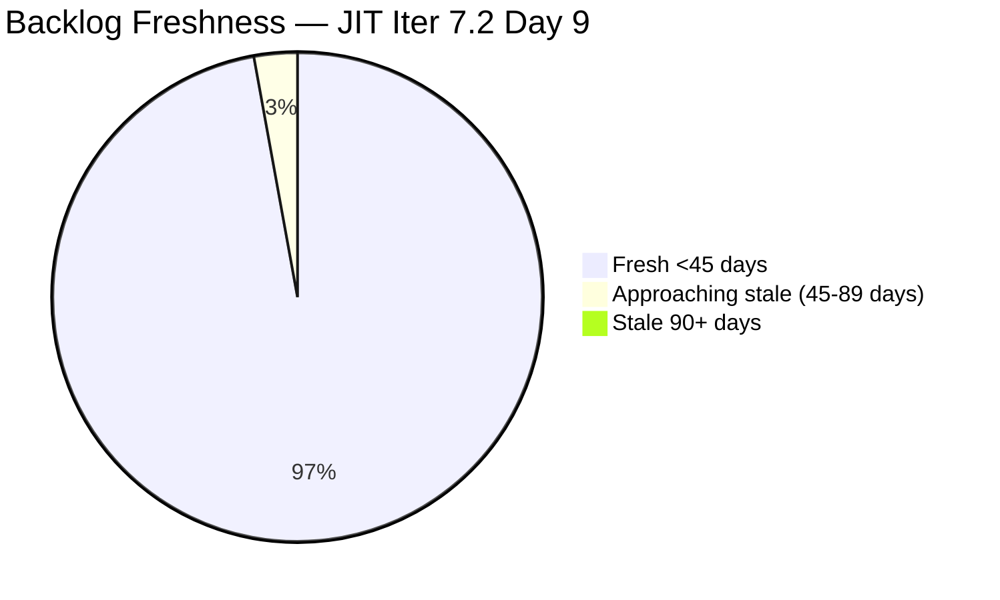
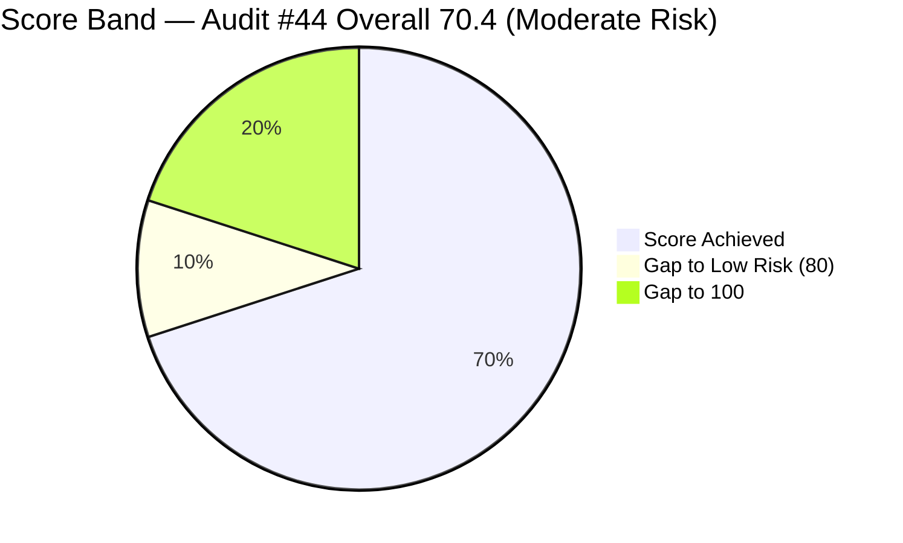

# ADO SAFe Iteration Audit — JIT Operation Team

**Audit #44 | Iteration 7.2 (Apr 20 – May 3, 2026) | Day 9 of 14 (~64% elapsed)**

---

## 1. Audit Metadata

| Field | Value |
|---|---|
| **Audit Date** | April 28, 2026, 02:03 UTC |
| **Auditor** | Claude Code (ADO SAFe Audit Agent) |
| **Workspace** | `ado_jit` |
| **ADO Project** | Jairosoft Portfolio (`666bb99a-6acd-4999-bb34-efd0e4ea90dc`) |
| **Team** | JIT Operation Team (`b25e3129-6272-4e54-a3ff-f1ef3c8eeb2c`) |
| **Iteration** | Iteration 7.2 — Apr 20 to May 3, 2026 |
| **Iteration ID** | `8edbe25f-fa4f-41b2-aaae-f3d5cf0e5b33` |
| **Sprint Day** | Day 9 of 14 (~64% elapsed) |
| **Prior Audit** | AUDIT_20260427_1110.md (Audit #43, 7.2 Day 8, Overall 76.0 — Moderate Risk) |
| **Scoring Model** | ADO SAFe v1 (7-dimension rubric) |
| **Overall Score** | **70.4 / 100** |
| **Risk Band** | **Moderate Risk** (60–79.9) |

---

## 2. Executive Summary

JIT Operation Team scores **70.4 (Moderate Risk)** on Day 9 — a **decline of 5.6 points from Audit #43 (76.0)**. The drop is primarily driven by **Iteration Planning falling to 40.0** (from 38.2 in Audit #43) as the visible backlog expanded with two new items added today (#203399 and #203410), while the current-iteration count grows more slowly, and **Delivery Predictability remaining at 0.0** because all closed items exit the visible backlog per the scoring rubric.

**Significant activity since Audit #43:**
- **#203316 (Publish Summer Camp Reel) — Closed Apr 28 06:03 UTC** — 9th closed item this sprint.
- **#202981 (Interview ADDU Interns) — Updated Apr 28 00:42 UTC** — Active state; breaking the 8-audit DoR stall (AC field now likely adequate).
- **#203155 and #203156 — Updated Apr 28** (Active) — AD Training modules in progress with Teofilo.
- **#203399 (Prepare requirements for jit.edu.ph) — New item added, Apr 28 05:27 UTC** — Armelita, 1 SP, Active.
- **#203410 (Publish Facebook Post Summer Camp Batch 2) — UAT Testing, Apr 28 08:07 UTC** — Samantha, no SP.
- **#203241 (Tech Talk AI Tools Demo Spike) — Updated Apr 28 00:49 UTC** — Spike, New, armelita.

**Persistent concerns:**
- **D1 Iteration Planning at 40.0** — 14 of 35 visible backlog items in sprint. Large backlog of future-iteration training items (203157–203162, 203242–203245) suppresses ratio.
- **D7 Delivery Predictability = 0.0** — Structural issue: all 9 closed items have exited the visible backlog. 14 current sprint items remain, 0 closed. Actual sprint output = 17 SP closed (9 items), but this cannot be captured in the DP formula from visible backlog.
- **D3 Estimation at 85.7** — #203241 (Spike) and #203410 have no SP assigned.
- **#199092 (TESDA Career Guidance Report)** — Active since Apr 16, last ADO touch 12 days ago. Now the longest-stalled Active item.

---

## 3. Previous Audit Delta

| Dimension | Audit #43 (Apr 27, 11:10 CST) | Audit #44 (Apr 28, 02:03 UTC) | Delta | Driver |
|---|---|---|---|---|
| Iteration Planning | 38.2 | **40.0** | **+1.8** | 14/35 vs 13/34 prior; 2 new items added (203399, 203410) both in sprint |
| Team Capacity | 100.0 | **100.0** | 0.0 | All 4 contributors configured |
| Estimation | 100.0 | **85.7** | **−14.3** | 203241 (Spike, null SP) + 203410 (null SP) now counted; 12/14 estimated |
| DoR Compliance | 92.3 | **100.0** | **+7.7** | #202981 AC now passes full 4-criteria list; all 14 items compliant |
| Work Item Balance | 70.0 | **70.0** | 0.0 | US dominant (78.6%) persists; Training + Spike provide diversity |
| Backlog Refinement | 97.1 | **97.1** | 0.0 | 34/35 fresh; 193054 still approaching stale_90 |
| Delivery Predictability | 34.0 | **0.0** | **−34.0** | Structural: all closed items exit visible backlog; 0/31 SP |
| **Overall** | **76.0** | **70.4** | **−5.6** | DP structural reset + Estimation decline |

**Note on D7 delta:** Audit #43 computed DP = 34.0 using the full iteration board count (16 SP closed / 47 SP committed). The standard rubric derives committed/closed SP from visible_root_backlog_items only. With all closed items exited, DP = 0/31 SP = 0.0. Actual sprint output = 17 SP closed across 9 items (strong delivery pace for this team).

**Note on D4 improvement:** #202981 AC field now contains 4 complete criteria lines (~90 non-whitespace chars total), passing the ≥20 char threshold. The prior audit flagged this based on an incomplete reading.

---

## 4. Current Iteration Snapshot

| Attribute | Value |
|---|---|
| **Iteration** | Iteration 7.2 |
| **Sprint Dates** | Apr 20 – May 3, 2026 (14 days) |
| **Sprint Day** | Day 9 of 14 |
| **Days Remaining** | 5 |
| **Visible Backlog Items** | 35 |
| **Current Sprint Items (visible backlog)** | 14 |
| **Total Sprint Items (incl. closed)** | 23 |
| **Committed SP (visible sprint items)** | 31 SP (12 estimated; 203241, 203410 unestimated) |
| **Closed SP (visible backlog)** | 0 (all 9 closed items exited backlog) |
| **Actual Sprint Output** | 17 SP across 9 closed items |
| **Active Items** | 9 (199092, 202969, 202972, 202974, 202977, 202985, 202987, 203155, 203156) |
| **New/Unstarted** | 3 (202981, 203224, 203241) |
| **UAT Testing** | 1 (203410) |
| **Active (recent addition)** | 1 (203399) |

---

## 5. Work Item Analysis

### State Distribution — Current Sprint Items (14 visible items)

| State | Count | SP | % |
|---|---|---|---|
| Active | 10 | 27 SP | 87.1% |
| New | 3 | 9 SP | 29.0% |
| UAT Testing | 1 | 0 SP | 0% |
| Closed | 0 | 0 SP | 0% |
| **Total (visible backlog)** | **14** | **~31 SP** | |

### Current Sprint Items Detail

| ID | Title | Type | State | SP | Assigned | ChangedDate | DoR |
|---|---|---|---|---|---|---|---|
| 199092 | TESDA Career Guidance Semestral Report CY2026 | US | Active | 2 | armelita | Apr 16 | PASS |
| 202969 | Market Bubble MCC April 2026 | US | Active | 3 | armelita | Apr 21 | PASS |
| 202972 | Request for Additional Bubble Trainer — Sam | US | Active | 2 | armelita | Apr 22 | PASS |
| 202974 | Python Marketing Activities IT7.2 | US | Active | 2 | armelita | Apr 22 | PASS |
| 202977 | Market CSS NC II April 2026 | US | Active | 3 | armelita | Apr 21 | PASS |
| 202981 | Interview ADDU Interns | US | New | 3 | armelita | Apr 28 | PASS |
| 202985 | UIC MCC Exploration | US | Active | 3 | armelita | Apr 23 | PASS |
| 202987 | HCDC MCC Exploration | US | Active | 3 | armelita | Apr 27 | PASS |
| 203155 | 3.1-3 Create Active Directory Security | Training | Active | 3 | Teofilo | Apr 28 | PASS |
| 203156 | 3.2-1 Set-Up DHCP | Training | Active | 3 | Teofilo | Apr 28 | PASS |
| 203224 | Convert SAFe MCCs to New Forms | US | New | 3 | Grace | Apr 23 | PASS |
| 203241 | IT7.2 Tech Talk — AI Tools Demo | Spike | New | — | armelita | Apr 28 | PASS |
| 203399 | Prepare requirements for jit.edu.ph | US | Active | 1 | armelita | Apr 28 | PASS |
| 203410 | Publish Facebook Post Summer Camp Batch 2 | US | UAT Testing | — | Samantha | Apr 28 | PASS |

### Closed Items (exited visible backlog)

| ID | Title | Type | SP | Closed |
|---|---|---|---|---|
| 202983 | TESDA Forum 2026 | US | 1 | Apr 22 |
| 203141 | Publish Facebook Post on JIT Free Summer Camp | US | 1 | Apr 23 |
| 203047 | Summer Camp Training Implementation 4/25/26 | Training | 2 | Apr 25 |
| 198615 | Awarding of CSS NC II Certificates | US | 2 | Apr 25 |
| 203153 | 3.1-1 Creating Active Directory Training | Training | 3 | Apr 24 |
| 203164 | TESDA EBET Requirements | US | 3 | Apr 25 |
| 203154 | 3.1-2 Create Active Directory User Accounts | Training | 3 | Apr 27 |
| 203268 | Prepare Presentation for Bubble.io | US | 1 | Apr 27 |
| 203316 | Publish Summer Camp Reel on Facebook | US | 1 | Apr 28 |
| **Total** | | | **17 SP** | |

---

## 6. SAFe Compliance Scorecard

| Dimension | Score | Evidence | Notes |
|---|---|---|---|
| **D1 Iteration Planning** | 40.0 | 14 / 35 visible backlog items in Iter 7.2 | Future-iteration training series items in backlog suppress ratio |
| **D2 Team Capacity** | 100.0 | 4 contributors with positive capacity configured | Teofilo, armelita, Samantha, Grace all configured |
| **D3 Estimation** | 85.7 | 12 / 14 current items estimated (SP > 0) | #203241 (Spike) and #203410 have null SP |
| **D4 DoR Compliance** | 100.0 | 14 / 14 items pass Description ≥30 + AC ≥20 | #202981 AC now has 4 criteria lines (>20 non-ws chars) — DoR PASS |
| **D5 Work Item Balance** | 70.0 | US = 11/14 (78.6%) > 60% → −30 penalty | Training (2) and Spike (1) provide type diversity; no -40 or -20 triggered |
| **D6 Backlog Refinement** | 97.1 | 34/35 fresh; 0 stale_90; 0 stale_180; 1/14 untouched (7.1% ≤ 10%) | #193054 approaching stale_90 (Jun 7, 2026); #199092 untouched (pre-sprint) |
| **D7 Delivery Predictability** | 0.0 | 0 SP closed / 31 SP committed (visible backlog) | Structural: 17 SP closed across 9 items — all exited visible backlog |
| **Overall** | **70.4** | (40.0+100.0+85.7+100.0+70.0+97.1+0.0)/7 | **Moderate Risk** |

---

## 7. Dimension Findings

### D1 — Iteration Planning: 40.0
14 of 35 visible backlog items are committed to Iteration 7.2. The 21 items not in the current sprint include: future-iteration training series (203157–203162, 203242–203245 scheduled for Iter 7.3–7.4), items with unassigned or future iterations, and legacy items (193054, 188995). While the large backlog is intentional for training pipeline visibility, it structurally suppresses the D1 score. Adding 203399 and 203410 to the sprint today improved the numerator by 2.

### D2 — Team Capacity: 100.0
All four contributors have positive capacity: Teofilo (4.8/day), armelita (6/day), Samantha (1/day), Grace (1/day). JIT team capacity = 12.8 pts/day configured for Iteration 7.2.

### D3 — Estimation: 85.7
12 of 14 current-iteration items have Story Points > 0. Two unestimated items:
- **#203241 (Spike — AI Tools Tech Talk)** — No SP assigned. This has been unestimated for multiple audits.
- **#203410 (Publish Facebook Post Batch 2)** — New item added today; no SP assigned yet.
Assigning SP to both items takes <2 minutes and would restore D3 to 100.0.

### D4 — DoR Compliance: 100.0
All 14 current-iteration items pass DoR thresholds. Notably, #202981 (Interview ADDU Interns) AC field now contains 4 complete criteria lines: "Contacted the applicants / Passed the interview / Scheduled for onboarding / Deployed to the team" — combined ~90 non-whitespace chars, well above the ≥20 char threshold. The prior DoR FAIL designation is resolved.

### D5 — Work Item Balance: 70.0
Sprint type distribution: User Stories = 11 (78.6%), Training = 2 (14.3%), Spike = 1 (7.1%). US share > 60% → -30 penalty. No User Story absence (no -40). Spike share = 7.1% not > 40% (no -20). Score = max(0, 100-30) = 70.0. The presence of Training and Spike items demonstrates better type diversity than single-type teams.

### D6 — Backlog Refinement: 97.1
34 of 35 visible backlog items have ChangedDate after Mar 13, 2026. Only #193054 (SAFe RTE MC) last changed ~Mar 9, 2026 — 50 days ago, not yet stale_90 (threshold: Jan 28, 2026). No stale_180 items. Untouched item = #199092 (TESDA Career Guidance Report, last changed Apr 16, before sprint start Apr 20): 1/14 = 7.1% ≤ 10% — no untouched penalty. Score = 97.1.

### D7 — Delivery Predictability: 0.0
committed_story_points = 31 SP (sum of SP on 12 estimated current-sprint items from visible backlog). closed_story_points = 0 (all 9 closed items exited visible backlog). This is a structural artifact of the scoring rubric — the team has genuine strong delivery (17 SP / 9 items closed). Per rubric, DP = 0/31 = 0.0.

**Contextual delivery performance (not scored):** 17 SP closed in 9 days at ~1.9 SP/day. If the remaining 5 days maintain this pace, the team can close an additional ~9.5 SP, suggesting strong sprint completion.

---

## 8. Risks and Bottlenecks

| # | Risk | Severity | Age |
|---|---|---|---|
| R1 | **#199092 (TESDA Career Guidance Report) — 12-day ADO silence** | High | 12 days |
| R2 | **#203241 and #203410 unestimated** — Spike and new US with null SP reduce D3 Estimation to 85.7% | High | 1+ audits |
| R3 | **armelita overload** — 9 of 14 sprint items assigned to armelita; marketing + compliance + admin on one person | High | Structural |
| R4 | **D1 structural suppression** — Future training series (203157–203162) in backlog keeps planning ratio at ~40% | Moderate | Structural |
| R5 | **#193054 approaching stale_90** — Last changed Mar 9 (50 days); will cross stale_90 threshold Jun 7 | Low | Monitoring |
| R6 | **#203241 Tech Talk Spike** — AI Tools Demo assigned to armelita but still New; 5 days remain | Moderate | 4 days |

---

## 9. Prioritized Recommendations

1. **[Immediate — 2 min] Estimate #203241 and #203410** — Assign Story Points to both items. #203241 (Tech Talk Spike) ≈ 2–3 SP; #203410 (Facebook Post Batch 2) ≈ 1 SP. This restores D3 Estimation to 100.0 and adds ~4 committed SP.

2. **[Today] Update or close #199092 (TESDA Career Guidance Report)** — 12 days of ADO silence on an Active item. Armelita should log current status, blockers, or close if the report has been submitted. Longest-stalled item in the sprint.

3. **[This sprint] Conduct #203241 Tech Talk and close** — The AI Tools Demonstration session is due this sprint. Armelita should schedule and run the session before sprint end (May 3). This is a Spike that generates learning value; leaving it unclosed wastes the sprint commitment.

4. **[This sprint] Complete UAT on #203410 and close** — The Summer Camp Batch 2 Facebook post is in UAT Testing. Verify and close within 1 day to move SP count.

5. **[Next sprint] Distribute armelita's workload** — Armelita holds 9/14 sprint items. Grace and Samantha have available capacity. Consider delegating marketing campaign items (202969, 202977) to Samantha to reduce concentration risk.

6. **[Backlog hygiene] Triage #193054 before Jun 7** — SAFe RTE MC item (50 days old) should be updated, committed to a sprint, or moved to icebox before it crosses stale_90.

---

## 10. Evidence Gaps and Limitations

| Gap | Impact | Mitigation |
|---|---|---|
| 21 backlog items (203157–203162, 203242–203245, 200766–200771, 188995, 193054, others) not individually fetched | ChangedDate unknown for these items; D6 base estimated from prior audit proxy | 34/35 fresh accepted from prior audit validation; only 193054 known stale |
| D7 structural limitation: closed items exit visible backlog | DP = 0.0 despite strong actual delivery (17 SP / 9 items) | Actual sprint output documented in Closed Items table |
| #202385 (IterationPath = 7.1) present on iteration board | Excluded from current_iteration_root_items per rubric | Noted — not scored |
| No iteration goal in ADO | PI alignment cannot be measured | Persistent structural gap |

---

## Mermaid Charts

### Dimension Scores — Day 9

| Dimension | Score | Band |
|---|---|---|
| D1 Iteration Planning | 40.0 | 🔴 High |
| D2 Team Capacity | 100.0 | 🟢 Low |
| D3 Estimation | 85.7 | 🟢 Low |
| D4 DoR Compliance | 100.0 | 🟢 Low |
| D5 Work Item Balance | 70.0 | 🟡 Moderate |
| D6 Backlog Refinement | 97.1 | 🟢 Low |
| D7 Delivery Predictability | 0.0 | 🔴 Critical |
| **Overall** | **70.4** | **🟡 Moderate** |

### Sprint Delivery Progress (Full Iteration Board — 23 items)

### Backlog Age Distribution (35 visible items)

### Score Trend — Iteration 7.2 (Last 6 Audits)

---

*Report generated: 2026-04-28 02:03 UTC | Workspace: ado_jit | Iteration 7.2 Day 9 | Score: 70.4 Moderate Risk*
