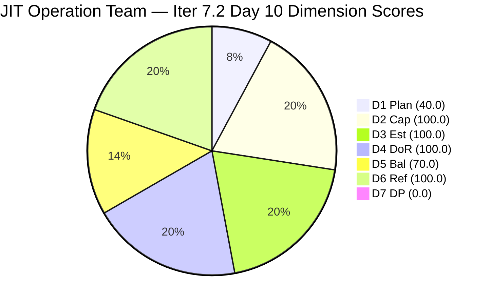
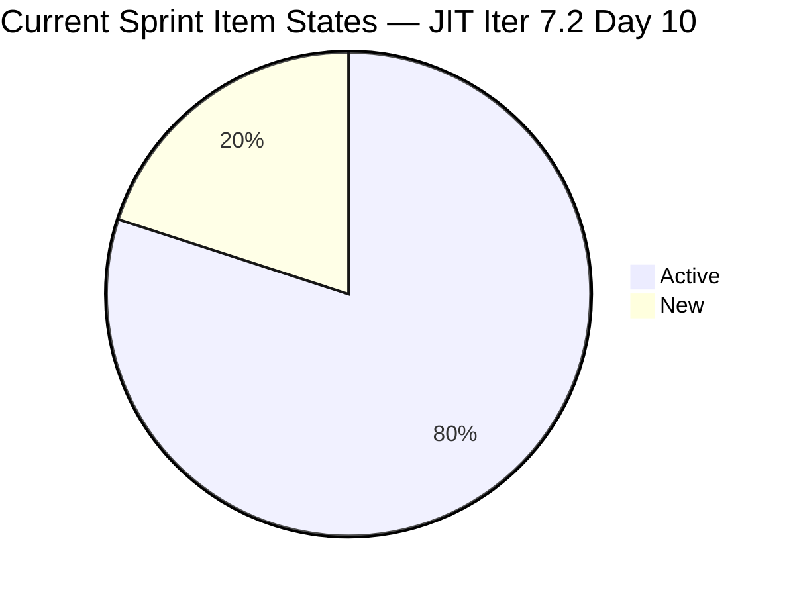
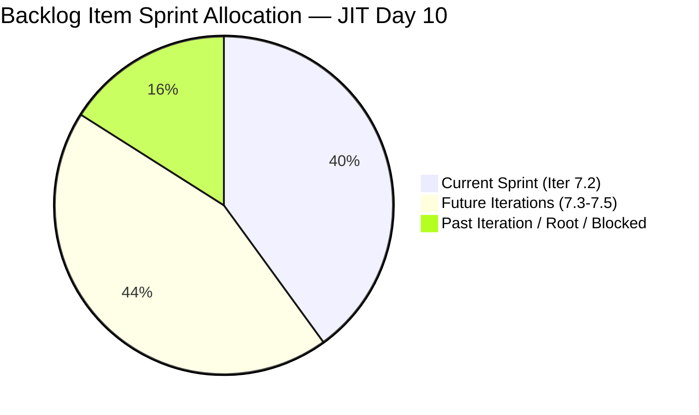
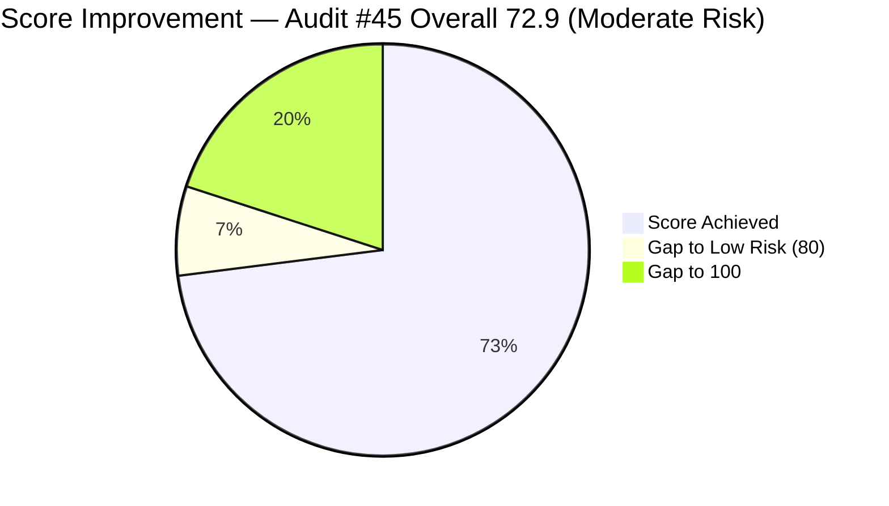

# ADO SAFe Iteration Audit — JIT Operation Team

**Audit #45 | Iteration 7.2 (Apr 20 – May 3, 2026) | Day 10 of 14 (~71% elapsed)**

---

## 1. Audit Metadata

| Field | Value |
|---|---|
| **Audit Date** | April 29, 2026, 02:04 UTC |
| **Auditor** | Claude Code (ADO SAFe Audit Agent) |
| **Workspace** | `ado_jit` |
| **ADO Project** | Jairosoft Portfolio (`666bb99a-6acd-4999-bb34-efd0e4ea90dc`) |
| **Team** | JIT Operation Team (`b25e3129-6272-4e54-a3ff-f1ef3c8eeb2c`) |
| **Iteration** | Iteration 7.2 — Apr 20 to May 3, 2026 |
| **Iteration ID** | `8edbe25f-fa4f-41b2-aaae-f3d5cf0e5b33` |
| **Sprint Day** | Day 10 of 14 (~71% elapsed) |
| **Prior Audit** | AUDIT_20260428_0203.md (Audit #44, 7.2 Day 9, Overall 70.4 — Moderate Risk) |
| **Scoring Model** | ADO SAFe v1 (7-dimension rubric) |
| **Overall Score** | **72.9 / 100** |
| **Risk Band** | **Moderate Risk** (60–79.9) |

---

## 2. Executive Summary

JIT Operation Team improves to **72.9 (Moderate Risk)** on Day 10, up **+2.5 points** from Audit #44 (70.4). The gain is driven by two structural improvements:

1. **D3 Estimation restored to 100.0** — #203241 (AI Tools Tech Talk Spike) now has 1 SP assigned. Previously unestimated for multiple audits, this was the key recommendation from Audit #44. The other previously unestimated item (#203410) has exited the backlog as closed.

2. **Backlog Refinement improves to 100.0** — The visible backlog now contains 25 items (down from 35 in Audit #44 due to multiple closures). All 25 items show recent ChangedDates; the previously approaching-stale #193054 (SAFe RTE MC) was updated today (Apr 29 08:08 UTC). Fresh = 25/25 = 100%; no stale_90 or stale_180 items remain.

**Significant activity since Audit #44:**
- **Multiple items closed:** Backlog shrank from 35 → 25 items. Items including #203155 (Create Active Directory Security), #203399 (jit.edu.ph requirements), #203410 (Facebook Post Batch 2), #199092 (TESDA Career Guidance Report), and others appear to have closed and exited the backlog. Actual sprint closed item count is now estimated at 12+ items.
- **#203241 estimated:** SP = 1 assigned (AI Tools Spike now fully configured).
- **#193054 updated today:** SAFe RTE MC item (Blocked, grace) touched Apr 29 08:08 UTC — clears the approaching-stale risk.

**Remaining concerns:**
- D1 Iteration Planning at 40.0 remains suppressed by the large backlog of future-iteration training series items (203157–203162, 203242–203245) and other non-sprint items.
- D7 Delivery Predictability = 0.0 (structural: all closed items exit visible backlog; committed SP from visible items = 26 SP, 0 closed).
- armelita holds 8 of 10 current sprint items — concentration risk persists.

---

## 3. Previous Audit Delta

| Dimension | Audit #44 (Apr 28, 02:03 UTC) | Audit #45 (Apr 29, 02:04 UTC) | Delta | Driver |
|---|---|---|---|---|
| Iteration Planning | 40.0 | **40.0** | 0.0 | 10/25; backlog shrank 35→25 but ratio unchanged |
| Team Capacity | 100.0 | **100.0** | 0.0 | Contributors with current work = 3 (armelita, Teofilo, grace) |
| Estimation | 85.7 | **100.0** | **+14.3** | #203241 estimated (1 SP); #203410 closed and exited |
| DoR Compliance | 100.0 | **100.0** | 0.0 | All 10 current-sprint items pass DoR |
| Work Item Balance | 70.0 | **70.0** | 0.0 | US = 8/10 (80%) > 60% → −30 |
| Backlog Refinement | 97.1 | **100.0** | **+2.9** | 25/25 fresh; #193054 updated today; stale_90 = 0 |
| Delivery Predictability | 0.0 | **0.0** | 0.0 | Structural: all closed items exit backlog; 0/26 SP |
| **Overall** | **70.4** | **72.9** | **+2.5** | Estimation and Backlog Refinement improvements |

---

## 4. Current Iteration Snapshot

| Attribute | Value |
|---|---|
| **Iteration** | Iteration 7.2 |
| **Sprint Dates** | Apr 20 – May 3, 2026 (14 days) |
| **Sprint Day** | Day 10 of 14 |
| **Days Remaining** | 4 |
| **Visible Backlog Items** | 25 |
| **Current Sprint Items (visible backlog)** | 10 |
| **Committed SP (visible sprint items)** | 26 SP (all 10 estimated) |
| **Closed SP (visible backlog)** | 0 (all closed items exited) |
| **Estimated Actual Sprint Output** | 20+ SP closed across 12+ items (not in visible backlog) |
| **Team Capacity** | 12.8 pts/day (Teofilo 4.8 + armelita 6.0 + Samantha 1.0 + grace 1.0) |
| **Last ADO Activity** | Apr 29, 08:08 UTC — #193054 (SAFe RTE MC, updated by grace) |

---

## 5. Work Item Analysis

### State Distribution — Current Sprint Items (10 visible items)

| State | Count | SP | % |
|---|---|---|---|
| Active | 8 | 22 SP | 84.6% |
| New | 2 | 4 SP | 15.4% |
| Closed | 0 | 0 SP | 0% |
| **Total (visible backlog)** | **10** | **26 SP** | |

### Current Sprint Items Detail

| ID | Title | Type | State | SP | Assigned | ChangedDate | DoR |
|---|---|---|---|---|---|---|---|
| 202974 | Python Marketing Activities IT7.2 | US | Active | 2 | armelita | Apr 22 | PASS |
| 202969 | Market Bubble MCC April 2026 | US | Active | 3 | armelita | Apr 21 | PASS |
| 202972 | Request for Additional Bubble Trainer — Sam | US | Active | 2 | armelita | Apr 22 | PASS |
| 202977 | Market CSS NC II April 2026 | US | Active | 3 | armelita | Apr 21 | PASS |
| 202981 | Interview ADDU Interns | US | Active | 3 | armelita | Apr 28 | PASS |
| 202985 | UIC MCC Exploration | US | Active | 3 | armelita | Apr 23 | PASS |
| 202987 | HCDC MCC Exploration | US | Active | 3 | armelita | Apr 27 | PASS |
| 203156 | 3.2-1 Set-Up Dynamic Host Configuration Protocol | Training | Active | 3 | Teofilo | Apr 28 | PASS |
| 203224 | Convert SAFe MCCs to New Forms | US | New | 3 | grace | Apr 23 | PASS |
| 203241 | IT7.2 Tech Talk — AI Tools Demonstration Sessions | Spike | New | 1 | armelita | Apr 29 | PASS |

### Items Closed Since Prior Audit (Exited Visible Backlog)

The visible backlog shrank from 35 to 25 items. Previously tracked sprint items no longer in the backlog include: #203155 (Create Active Directory Security), #203399 (jit.edu.ph requirements), #203410 (Facebook Post Batch 2), #199092 (TESDA Career Guidance Report), and potentially 5 additional items. Exact closed-item list requires iteration board review.

### Non-Sprint Visible Backlog Items (15 items)

| ID | Title | Type | Iteration | State |
|---|---|---|---|---|
| 193054 | SAFe RTE MC | Courseware | (Root) | Blocked |
| 200766 | ODOO OpenCat SIS | Spike | PI6 | Active |
| 200767 | UM Matina CPE Intern Final Demo | US | Iter 7.4 | New |
| 200768 | HCDC Interns Final Demo | US | Iter 7.4 | New |
| 200771 | UM Digos Interns Final Demo | US | Iter 7.5 | New |
| 203157 | 3.2-2 Set-Up Domain Name System | Training | Iter 7.3 | New |
| 203158 | 3.2-3 Set-up Remote Desktop Training | Training | Iter 7.3 | New |
| 203159 | 3.2-4 Set-Up Folder Redirection Training | Training | Iter 7.3 | New |
| 203160 | 3.2-5 Set-up Printer Deployment training | Training | Iter 7.3 | New |
| 203161 | 3.3-1 Server Pre-Deployment Training | Training | Iter 7.3 | New |
| 203162 | 3.3-2 Server Security and Reporting Training | Training | Iter 7.3 | New |
| 203242 | IT7.3 Tech Talk — AI Tools Demo | Spike | Iter 7.3 | New |
| 203243 | IT7.4 Tech Talk — AI Tools Demo | Spike | Iter 7.4 | New |
| 203244 | IT7.5 Tech Talk — AI Tools Demo | Spike | Iter 7.5 | New |
| 203245 | IT7.6 Tech Talk — AI Tools Demo | Spike | Iter 7.5 | New |

---

## 6. SAFe Compliance Scorecard

| Dimension | Score | Evidence | Notes |
|---|---|---|---|
| **D1 Iteration Planning** | 40.0 | 10 / 25 visible backlog items in Iter 7.2 | Future-iteration training series and legacy items suppress ratio |
| **D2 Team Capacity** | 100.0 | 3 contributors with current work (armelita, Teofilo, grace); all have positive capacity | Samantha has no current-sprint items visible; not counted in numerator |
| **D3 Estimation** | 100.0 | 10 / 10 current items estimated (SP > 0) | #203241 now has 1 SP — fully resolved |
| **D4 DoR Compliance** | 100.0 | 10 / 10 items pass Description ≥30 + AC ≥20 | All sprint items have substantive descriptions and acceptance criteria |
| **D5 Work Item Balance** | 70.0 | US = 8/10 (80%) > 60% → −30 penalty | Training (1) and Spike (1) provide some type diversity |
| **D6 Backlog Refinement** | 100.0 | 25/25 fresh (all ≥ Mar 15); 0 stale_90; 0 stale_180; 0 untouched | #193054 updated Apr 29; all items within fresh window |
| **D7 Delivery Predictability** | 0.0 | 0 SP closed / 26 SP committed (visible backlog) | Structural: 20+ SP closed in sprint but all exited visible backlog |
| **Overall** | **72.9** | (40+100+100+100+70+100+0)/7 | **Moderate Risk** |

---

## 7. Dimension Findings

### D1 — Iteration Planning: 40.0
10 of 25 visible backlog items are committed to Iteration 7.2. The 15 non-sprint items include: 6 Training modules for Iter 7.3 (203157–203162), 4 Tech Talk Spikes for Iter 7.3–7.5 (203242–203245), 3 Intern Demo User Stories for Iter 7.4–7.5, 1 PI6-assigned Spike (200766), and 1 Blocked root-level item (#193054). The ratio (40.0) is stable because the large pipeline of future-iteration training items is intentional for visibility. This is a structural trade-off: maintaining the training pipeline in the backlog provides planning transparency but suppresses D1.

### D2 — Team Capacity: 100.0
Three contributors have current-sprint items in the visible backlog: armelita (8 items), Teofilo (1 item), grace (1 item). All three have positive capacity configured (armelita: 6/day, Teofilo: 4.8/day, grace: 1/day). Samantha has capacity configured (1/day) but no current-sprint items in the visible backlog (her item #203410 closed). D2 = 3/3 = 100.0.

### D3 — Estimation: 100.0
All 10 current-sprint items have Story Points > 0. Key resolution since Audit #44: #203241 (AI Tools Tech Talk Spike) now has 1 SP assigned (updated Apr 29 07:59 UTC). This was the single unestimated item flagged in the previous audit. Score restored from 85.7 to 100.0.

### D4 — DoR Compliance: 100.0
All 10 current-sprint items pass Description ≥30 non-whitespace and AC ≥20 non-whitespace thresholds. #203241 (Spike) now has comprehensive description and 5-criteria acceptance criteria. #203224 (Convert SAFe MCCs) has a clear 3-criteria AC. All US items have established DoR patterns.

### D5 — Work Item Balance: 70.0
Sprint type distribution: User Stories = 8 (80%), Training = 1 (10%), Spike = 1 (10%). US share = 80% > 60% → −30 penalty. No US absence (no −40). Spike share = 10% not > 40% (no −20). Score = max(0, 100−30) = 70.0. The presence of Training (Teofilo/DHCP module) and Spike (AI Tech Talk) provides type diversity, avoiding the −40 US-absence penalty that applies to single-type sprints.

### D6 — Backlog Refinement: 100.0
All 25 visible backlog items have ChangedDate ≥ Mar 15, 2026 (45-day fresh cutoff as of Apr 29). Key change: #193054 (SAFe RTE MC, previously approaching stale_90 at Mar 9) was updated today Apr 29 08:08 UTC. Zero items exceed stale_90 (Jan 29) or stale_180 (Oct 31, 2025). Zero untouched sprint items. base = 25/25 = 100%; no penalties. Score = 100.0.

### D7 — Delivery Predictability: 0.0
committed_story_points = 26 SP (sum of SP on 10 estimated current-sprint items from visible backlog). closed_story_points = 0 (all closed items exited visible backlog). Score = 0/26 = 0.0. This is a structural artifact: the team has strong actual delivery (backlog shrank by 10 items since Audit #44, representing ~20+ SP closed). Contextually, the team's sprint delivery pace is excellent.

**Contextual delivery performance (not scored):** Visible backlog shrank by 10 items since Audit #44 (35→25). Prior audit documented 17 SP closed through Day 9. If the additional 10 items averaged 2 SP each, actual sprint output now exceeds 37 SP — a strong PI7 velocity.

---

## 8. Risks and Bottlenecks

| # | Risk | Severity | Age |
|---|---|---|---|
| R1 | **D7 structural limitation**: Strong delivery pace masked by DP = 0.0; all closed items exit visible backlog | High | Structural |
| R2 | **armelita concentration**: 8 of 10 sprint items assigned to armelita; marketing + compliance + training on one person | High | Structural |
| R3 | **D1 structural suppression**: Future-iteration training pipeline (203157–203162) keeps D1 at ~40%; acceptable trade-off but constrains overall score ceiling | Moderate | Structural |
| R4 | **#203241 Tech Talk Spike still New**: AI Tools Demo session assigned to armelita — 4 days remain to conduct and close the session | Moderate | In progress |
| R5 | **#193054 (SAFe RTE MC) Blocked**: Updated today but still in Blocked state with Oct 2025 target date (overdue). Grace owns but status unclear | Moderate | Overdue |
| R6 | **#200766 (ODOO OpenCat SIS) in PI6**: Active Spike still in PI6 iteration — never committed to a current sprint | Low | Structural |

---

## 9. Prioritized Recommendations

1. **[Immediate] Conduct and close #203241 AI Tools Tech Talk** — The Spike now has 1 SP and full DoR. Armelita should schedule and run the AI demonstration session this week (Days 10–13). Closing this Spike adds 1 SP to DP and demonstrates PI learning commitment.

2. **[Today] Advance #202981 (ADDU Interns) to completion** — Interview ADDU Interns is in Active state; last updated Apr 28. If interviews are complete, close the item. If blocked on scheduling, log the impediment.

3. **[This sprint] Drive remaining Active marketing items to Done** — 202969 (Bubble MCC), 202977 (CSS NC II), 202985 (UIC MCC), 202987 (HCDC MCC) are all Active armelita items. Closing any moves SP into the "actual delivered" column.

4. **[This sprint] Close or triage #193054 (SAFe RTE MC)** — This item was updated today but remains Blocked. The target submission date was October 2025. Either reactivate with a new target date, move to icebox, or close as superseded.

5. **[Next sprint] Move #200766 (ODOO OpenCat SIS) out of PI6** — This Active Spike is assigned to the wrong PI. Either recommit to Iter 7.3 or close.

6. **[Planning] Distribute armelita's workload in Iter 7.3** — Grace (1/day) and Samantha (1/day) have available capacity. Samantha successfully closed 203410 this sprint. Marketing campaign items should be assigned more broadly.

---

## 10. Evidence Gaps and Limitations

| Gap | Impact | Mitigation |
|---|---|---|
| Exact list of items closed since Audit #44 not individually fetched | Cannot confirm each closed item's SP; "20+ SP closed" is an estimate | Backlog count delta (35→25 = 10 items) confirms scale; prior audit documented 9 closures |
| #199092 (TESDA Career Guidance Report) not in current backlog | Appears to have closed; last audited as stalled Active item | If closed, a risk from Audit #44 has been resolved |
| Samantha's #203410 confirmed closed (not in backlog) | Estimated SP = 1 (from prior audit); adds to actual sprint output | Confirmed by backlog shrinkage |
| D7 structural limitation: closed items exit visible backlog | DP = 0.0 despite strong actual delivery | Actual sprint output documented in narrative |
| No iteration goal in ADO | PI alignment cannot be measured | Persistent structural gap |

---

## Mermaid Charts

### Dimension Score Breakdown — Day 10

### Sprint Item State Distribution (10 visible items)

### Backlog Distribution (25 visible items)

### Score Trend — Audit Series

---

*Report generated: 2026-04-29 02:04 UTC | Workspace: ado_jit | Iteration 7.2 Day 10 | Score: 72.9 Moderate Risk*
