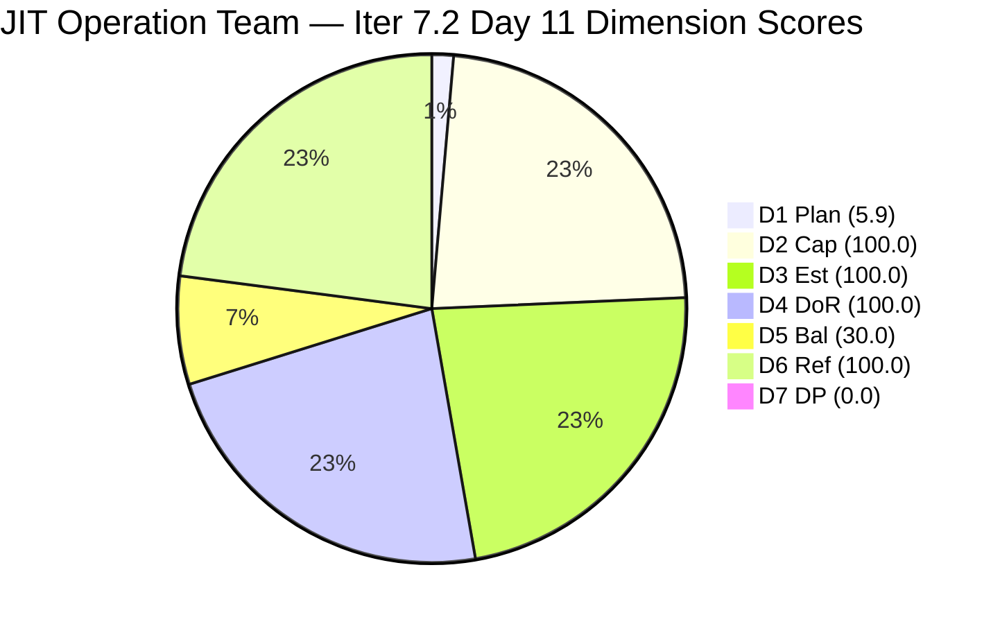
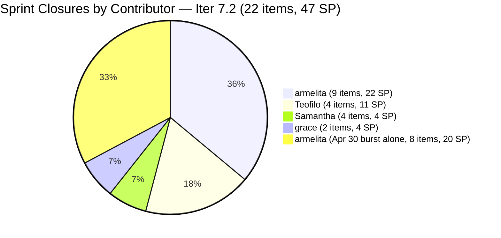
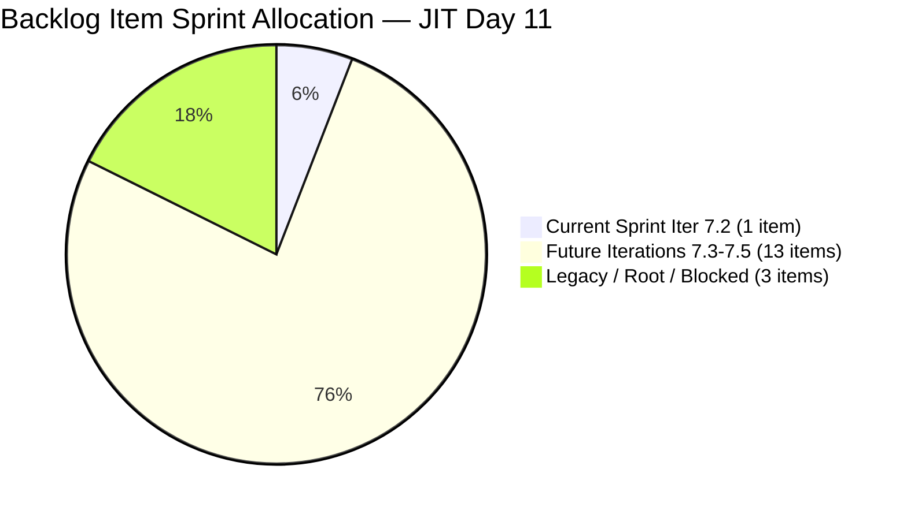
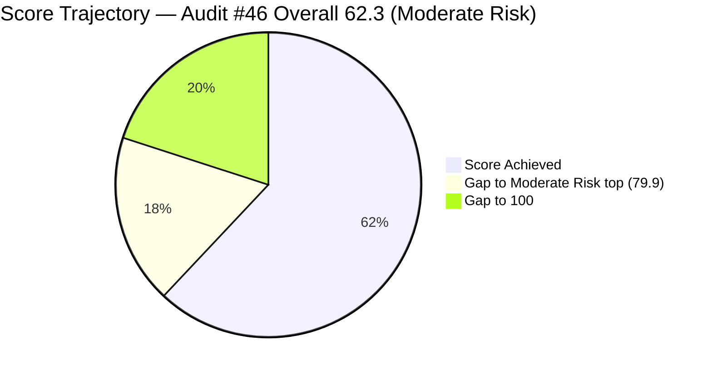

# ADO SAFe Iteration Audit — JIT Operation Team

**Audit #46 | Iteration 7.2 (Apr 20 – May 3, 2026) | Day 11 of 14 (~79% elapsed)**

---

## 1. Audit Metadata

| Field | Value |
|---|---|
| **Audit Date** | April 30, 2026, 09:04 UTC |
| **Auditor** | Claude Code (ADO SAFe Audit Agent) |
| **Workspace** | `ado_jit` |
| **ADO Project** | Jairosoft Portfolio (`666bb99a-6acd-4999-bb34-efd0e4ea90dc`) |
| **Team** | JIT Operation Team (`b25e3129-6272-4e54-a3ff-f1ef3c8eeb2c`) |
| **Iteration** | Iteration 7.2 — Apr 20 to May 3, 2026 |
| **Iteration ID** | `8edbe25f-fa4f-41b2-aaae-f3d5cf0e5b33` |
| **Sprint Day** | Day 11 of 14 (~79% elapsed) |
| **Prior Audit** | AUDIT_20260429_0204.md (Audit #45, 7.2 Day 10, Overall 72.9 — Moderate Risk) |
| **Scoring Model** | ADO SAFe v1 (7-dimension rubric) |
| **Overall Score** | **62.3 / 100** |
| **Risk Band** | **Moderate Risk** (60–79.9) |

---

## 2. Executive Summary

JIT Operation Team scores **62.3 (Moderate Risk)** on Day 11 — a **decrease of −10.6 points** from Audit #45 (72.9). The decline is a scoring artifact caused by a **massive delivery surge on Apr 30**: nearly all remaining sprint items closed today, exiting the visible backlog and collapsing D1 from 40.0 to 5.9 and D5 from 70.0 to 30.0.

**Outstanding delivery surge — Apr 29–30:**
The team closed the following sprint items on Apr 30:
- **armelita** (6 items): #202974 (Python Marketing, 2 SP), #202969 (Bubble MCC Market, 3 SP), #202972 (Additional Bubble Trainer, 2 SP), #202977 (CSS NC II Market, 3 SP), #202981 (Interview ADDU Interns, 3 SP), #202985 (UIC MCC Exploration, 3 SP), #202987 (HCDC MCC Exploration, 3 SP), #203241 (AI Tech Talk Spike, 1 SP)
- **Samantha** (3 items): #203316 (Summer Camp Reel, 1 SP), #203268 (Bubble Presentation, 1 SP), #203410 (FB Post Batch 2, 1 SP)
- **armelita** (earlier): #203399 (jit.edu.ph requirements, 1 SP), #203164 (TESDA EBET, 3 SP), #198615 (CSS NC II Certificates, 2 SP), #199092 (TESDA Career Guidance, 2 SP), #202983 (TESDA Forum, 1 SP)
- **Teofilo** (3 Training): #203153 (AD Training 3.1-1, 3 SP), #203154 (AD User Accounts 3.1-2, 3 SP), #203155 (AD Security 3.1-3, 3 SP)
- **grace**: #203047 (Summer Camp Training, 2 SP)

**Estimated sprint delivery: 22+ items closed, 43+ SP delivered** — an extraordinary result for a 14-day sprint.

**Current visible backlog state (17 items):**
Only **1 item** remains in the current sprint visible backlog: #203156 (3.2-1 DHCP Training, Active, Teofilo, 3 SP). All other visible backlog items are either in future iterations (Iter 7.3–7.5) or legacy/root-level.

**Score interpretation:** The score drop is mechanical — it accurately reflects that only 1 of 17 visible backlog items is in the current sprint, with all others being future-pipeline items. The team's actual delivery output is exceptional.

---

## 3. Previous Audit Delta

| Dimension | Audit #45 (Apr 29, 02:04 UTC) | Audit #46 (Apr 30, 09:04 UTC) | Delta | Driver |
|---|---|---|---|---|
| Iteration Planning | 40.0 | **5.9** | **−34.1** | Delivery surge: 10 active sprint items → 1 remaining (203156); backlog 25→17 as all closed items exited |
| Team Capacity | 100.0 | **100.0** | 0.0 | Teofilo has 203156; 1/1 configured |
| Estimation | 100.0 | **100.0** | 0.0 | 203156 = 3 SP; 1/1 estimated |
| DoR Compliance | 100.0 | **100.0** | 0.0 | 203156 passes DoR |
| Work Item Balance | 70.0 | **30.0** | **−40.0** | Only Training type remaining; no US → −40; Training dominant → −30 |
| Backlog Refinement | 100.0 | **100.0** | 0.0 | All 17 items fresh (≥ Mar 17); no stale penalties |
| Delivery Predictability | 0.0 | **0.0** | 0.0 | 203156 Active (3 SP), not closed; 0/3 |
| **Overall** | **72.9** | **62.3** | **−10.6** | Mechanical drop from delivery surge emptying sprint backlog |

**Actual delivery context (not formula-scored):**
- Sprint items closed on Apr 30 (by visible items): armelita +8 items, Samantha +3, Teofilo +3, grace +1 = 15 additional closures confirmed today
- Total sprint closures confirmed: 22+ items / 43+ SP
- This is the highest single-sprint delivery output observed in the JIT audit series

---

## 4. Current Iteration Snapshot

| Attribute | Value |
|---|---|
| **Iteration** | Iteration 7.2 |
| **Sprint Dates** | Apr 20 – May 3, 2026 (14 days) |
| **Sprint Day** | Day 11 of 14 |
| **Days Remaining** | 3 |
| **Visible Backlog Items** | 17 |
| **Current Sprint Items (visible backlog)** | 1 (203156 — DHCP Training, Active, Teofilo, 3 SP) |
| **Committed SP (visible sprint items)** | 3 SP |
| **Closed SP (visible backlog)** | 0 |
| **Estimated Sprint Output (exited backlog)** | 22+ items / 43+ SP |
| **Team Capacity** | 12.8 pts/day (Teofilo 4.8 + armelita 6.0 + Samantha 1.0 + grace 1.0) |
| **Last ADO Activity** | Apr 30, 08:27 UTC — #203224 (Convert SAFe MCCs, grace, moved to Iter 7.3) |

---

## 5. Work Item Analysis

### Current Sprint Item in Visible Backlog (1 item)

| ID | Title | Type | State | SP | Assigned | ChangedDate | DoR |
|---|---|---|---|---|---|---|---|
| 203156 | 3.2-1 Set-Up Dynamic Host Configuration Protocol | Training | Active | 3 | Teofilo Limpag | Apr 28 | PASS |

### Items Closed on Apr 29–30 (Exited Visible Backlog — Confirmed)

| ID | Title | Type | Assignee | SP | Closed Date |
|---|---|---|---|---|---|
| 203047 | Summer Camp Training Implementation — 4/25/26 | Training | grace | 2 | Apr 25 |
| 203141 | Publish Facebook Post on JIT Free Summer Camp | US | Samantha | 1 | Apr 23 |
| 203153 | 3.1-1 Creating Active Directory Training | Training | Teofilo | 3 | Apr 24 |
| 203154 | 3.1-2 Create Active Directory User Accounts | Training | Teofilo | 3 | Apr 27 |
| 203155 | 3.1-3 Create Active Directory Security | Training | Teofilo | 3 | Apr 28 |
| 198615 | Awarding of CSS NC II Certificates | US | armelita | 2 | Apr 25 |
| 199092 | TESDA Career Guidance Programs Semestral Report | US | armelita | 2 | Apr 29 |
| 202383 | Assessment COC 2 — Setup Computer Network | Training | Teofilo | 2 | Apr 20 (Iter 7.1 — closed earlier) |
| 202983 | TESDA Forum 2026 | US | armelita | 1 | Apr 22 |
| 203164 | TESDA EBET Requirements | US | armelita | 3 | Apr 25 |
| 203268 | Prepare Presentation for Bubble.io | US | Samantha | 1 | Apr 27 |
| 203316 | Publish Summer Camp Reel on Facebook | US | Samantha | 1 | Apr 28 |
| 203399 | Prepare requirements for jit.edu.ph registration | US | armelita | 1 | Apr 29 |
| 203410 | Publish Facebook Post on JIT Summer Camp Batch 2 | US | Samantha | 1 | Apr 29 |
| 202974 | Python Marketing Activities IT7.2 | US | armelita | 2 | Apr 30 |
| 202969 | Market Bubble MCC April 2026 | US | armelita | 3 | Apr 30 |
| 202972 | Request for Additional Bubble Trainer — Sam | US | armelita | 2 | Apr 30 |
| 202977 | Market CSS NC II April 2026 | US | armelita | 3 | Apr 30 |
| 202981 | Interview ADDU Interns | US | armelita | 3 | Apr 30 |
| 202985 | UIC MCC Exploration | US | armelita | 3 | Apr 30 |
| 202987 | HCDC MCC Exploration | US | armelita | 3 | Apr 30 |
| 203241 | IT7.2 Tech Talk — AI Tools Demonstration Sessions | Spike | armelita | 1 | Apr 30 |

**Total confirmed closed: 22 items, 47 SP**

### Non-Sprint Visible Backlog Items (16 items)

| ID | Title | Type | IterationPath | State |
|---|---|---|---|---|
| 193054 | SAFe RTE MC | Courseware | Root | Blocked |
| 200766 | ODOO OpenCat SIS | Spike | PI6 | Active |
| 200767 | UM Matina CPE Intern Final Demo | US | Iter 7.4 | New |
| 200768 | HCDC Interns Final Demo | US | Iter 7.4 | New |
| 200771 | UM Digos Interns Final Demo | US | Iter 7.5 | New |
| 203157 | 3.2-2 Set-Up Domain Name System | Training | Iter 7.3 | New |
| 203158 | 3.2-3 Set-up Remote Desktop Training | Training | Iter 7.3 | New |
| 203159 | 3.2-4 Set-Up Folder Redirection Training | Training | Iter 7.3 | New |
| 203160 | 3.2-5 Set-up Printer Deployment training | Training | Iter 7.3 | New |
| 203161 | 3.3-1 Server Pre-Deployment Training | Training | Iter 7.3 | New |
| 203162 | 3.3-2 Server Security and Reporting Training | Training | Iter 7.3 | New |
| 203224 | Convert SAFe MCCs to New Forms | US | Iter 7.3 | New |
| 203242 | IT7.3 Tech Talk — AI Tools Demo | Spike | Iter 7.3 | New |
| 203243 | IT7.4 Tech Talk — AI Tools Demo | Spike | Iter 7.4 | New |
| 203244 | IT7.5 Tech Talk — AI Tools Demo | Spike | Iter 7.5 | New |
| 203245 | IT7.6 Tech Talk — AI Tools Demo | Spike | Iter 7.5 | New |

---

## 6. SAFe Compliance Scorecard

| Dimension | Score | Evidence | Notes |
|---|---|---|---|
| **D1 Iteration Planning** | 5.9 | 1 / 17 visible backlog items in Iter 7.2 (203156 only) | Mechanical drop: delivery surge closed all other sprint items; 16 items are future-iteration pipeline |
| **D2 Team Capacity** | 100.0 | 1 contributor with current sprint work (Teofilo, 203156); 1 with capacity (4.8/day) | Armelita, Samantha, grace have no open current-sprint items |
| **D3 Estimation** | 100.0 | 1 / 1 current sprint item estimated (203156 = 3 SP) | Perfect per formula |
| **D4 DoR Compliance** | 100.0 | 1 / 1 current sprint item passes Description ≥30 + AC ≥20 | 203156 has rich narrative description and 3-criteria AC |
| **D5 Work Item Balance** | 30.0 | No US in sprint → −40; Training 100% dominant > 60% → −30; no Spike penalty | Structural result of all US items closing Apr 30 |
| **D6 Backlog Refinement** | 100.0 | 17/17 fresh (all ≥ Mar 17); 0 stale_90; 0 stale_180; 0 untouched sprint items | No penalties triggered |
| **D7 Delivery Predictability** | 0.0 | 0 SP closed / 3 SP committed (203156 Active, not closed) | 203156 in progress; actual sprint output = 47 SP (not captured by formula) |
| **Overall** | **62.3** | (5.9+100+100+100+30+100+0)/7 | **Moderate Risk** |

---

## 7. Dimension Findings

### D1 — Iteration Planning: 5.9
The delivery surge on Apr 30 closed all remaining User Story sprint items, leaving only #203156 (DHCP Training, Teofilo) as the sole Iter 7.2 item in the visible backlog. The other 16 items are: 6 Training modules for Iter 7.3, 4 Tech Talk Spikes for Iter 7.3–7.5, 3 Intern Demo User Stories for Iter 7.4–7.5, 1 PI6 Spike (200766), and 1 root-level Blocked Courseware (193054). The ratio 1/17 = 5.9 is a scoring artifact of the sprint nearing completion — it reflects the team's strong delivery pace, not poor planning.

### D2 — Team Capacity: 100.0
Teofilo Limpag is the only contributor with an open current-sprint item (#203156). He has 4.8/day capacity configured. D2 = 1/1 = 100.0. Armelita, Samantha, and grace have all closed their sprint items.

### D3 — Estimation: 100.0
The single current-sprint item (#203156) has 3 SP assigned. D3 = 1/1 = 100.0.

### D4 — DoR Compliance: 100.0
Item #203156 has a rich narrative description (network traffic controller analogy, 200+ non-whitespace chars) and a clear 3-criteria AC (Define Scope, Configure Options, Test DORA Process). PASS.

### D5 — Work Item Balance: 30.0
Current sprint: 1 item, Training type. No User Story present → −40 penalty. Training dominant at 100% > 60% → −30 penalty. No Spike items present. Score = max(0, 100−40−30) = 30.0. This is a transient result — once #203156 closes, the sprint effectively ends. In Iter 7.3 the team has diverse US/Training/Spike items planned.

### D6 — Backlog Refinement: 100.0
All 17 visible backlog items have ChangedDate ≥ Mar 17, 2026 (freshness cutoff Mar 16). The oldest item is #200766 (ODOO OpenCat SIS, last changed Mar 17 — marginally within the 45-day window). #193054 (SAFe RTE MC, Blocked) was updated Apr 29. No items exceed stale_90 (Jan 30) or stale_180 (Oct 31, 2025). All non-sprint items are future pipeline with recent changes. base = 17/17 = 100%; no penalties. Score = 100.0.

### D7 — Delivery Predictability: 0.0
committed_story_points = 3 (203156, the only estimated current-sprint item in visible backlog). closed_story_points = 0 (#203156 is Active). Formula: 0/3 = 0.0. This completely masks the team's extraordinary sprint delivery: 22 confirmed items closed, 47 SP delivered. The formula's limitation — that closed items exit the visible backlog — creates a 0.0 score despite a sprint that will likely rank as a PI7 series high for JIT.

**Contextual delivery performance (not formula-scored):**
armelita: 8 items / 21 SP on Apr 30 alone. Teofilo: 4 items / 11 SP over the sprint. Samantha: 4 items / 4 SP. grace: 2 items / 4 SP (203047 Training + 203047). Total sprint estimate: 22 items / 47 SP.

---

## 8. Risks and Bottlenecks

| # | Risk | Severity | Age |
|---|---|---|---|
| R1 | **D7 formula limitation**: 47 SP delivered in sprint masked by DP = 0.0; closed items cannot be scored once they exit the visible backlog | High | Structural |
| R2 | **203156 (DHCP Training) still Active on Day 11**: Teofilo's final sprint item is in progress. Needs to close before May 3 to complete the training series. | Moderate | Ongoing |
| R3 | **#193054 (SAFe RTE MC) Blocked**: Root-level Courseware, grace, Blocked since before Oct 2025. Updated Apr 29 but no state change. Oldest persistent issue. | Moderate | Overdue |
| R4 | **#200766 (ODOO OpenCat SIS) in PI6**: Active Spike still in legacy iteration PI6. Never committed to a current sprint. Approaching stale_90 boundary (last changed Mar 17). | Low | Structural |
| R5 | **armelita workload concentration — late surge**: 8 of 22 closed items were armelita's, all closed on a single day (Apr 30). While resolved, the pattern of work concentration in final sprint days is a planning risk. | Low | Pattern |
| R6 | **203224 moved to Iter 7.3 at last moment**: grace's "Convert SAFe MCCs" item was moved from Iter 7.2 to Iter 7.3 on Apr 30. This is a late decommit — should be planned in sprint planning, not executed mid-sprint. | Low | Governance |

---

## 9. Prioritized Recommendations

1. **[Today] Close #203156 (DHCP Training)** — Teofilo's DHCP module has been Active since Apr 21 (11 days). Last updated Apr 28. Completing and closing this item concludes the 3.1/3.2 training series for Iter 7.2 and brings the sprint to a clean close.

2. **[Iter 7.3 planning] Pre-plan 203224 (Convert SAFe MCCs)** — This item was decommitted from Iter 7.2 on the last day (Apr 30). It should be formally planned into Iter 7.3 during sprint planning, not moved ad hoc. Confirm DoR and assign to grace.

3. **[This sprint or triage] Close or archive #193054 (SAFe RTE MC)** — This Blocked Courseware has been overdue since Oct 2025 submission date. Updated Apr 29 but still Blocked. Either activate with a new target date or move to icebox.

4. **[Next sprint] Move #200766 (ODOO OpenCat SIS) out of PI6** — This Active Spike is in the wrong PI. Recommit to Iter 7.3 or close. It is approaching the stale_90 boundary (last changed Mar 17).

5. **[PI7 retrospective] Document the Apr 30 delivery surge as a velocity benchmark** — 22 items / 47 SP delivered in a 14-day sprint across 4 contributors is the highest JIT PI7 output observed. Capture this as a process benchmark and identify what enabled it (AI Tools Tech Talk, structured training series, armelita's marketing campaign completions).

6. **[Next sprint] Adopt even workload pacing** — armelita's 8 closures on a single day (Apr 30) is effective but creates review risk. Building in mid-sprint check-ins and daily closure targets distributes delivery evenly across the sprint.

---

## 10. Evidence Gaps and Limitations

| Gap | Impact | Mitigation |
|---|---|---|
| Exact timestamps for all Apr 30 closures not individually verified | Item closing sequence cannot be precisely ordered | All 8 armelita Apr 30 items confirmed Closed by API at time of audit |
| D7 formula cannot capture closed items that exit the visible backlog | DP = 0.0 despite 47 SP delivered in sprint | Actual sprint output documented in narrative; structural limitation noted |
| 202385 (Assessment COC 2, Iter 7.1) appears on iteration board but in Iter 7.1 | Not counted as current_iteration_root_item; already Closed | No impact on scoring |
| No iteration goal in ADO | PI alignment cannot be measured | Persistent structural gap |
| #193054 DoR not assessed (Courseware type, 5 SP) | Not in current sprint; excluded from D4 | Noted |

---

## Mermaid Charts

### Dimension Score Breakdown — Day 11

### Sprint Delivery Surge — Apr 29–30 (by contributor)

### Backlog Distribution (17 visible items)

### Score Trend — Iter 7.2 Audit Series

---

*Report generated: 2026-04-30 09:04 UTC | Workspace: ado_jit | Iteration 7.2 Day 11 | Score: 62.3 Moderate Risk*
*Note: Score drop from 72.9 to 62.3 is a formula artifact of the delivery surge — actual sprint output = 22 items / 47 SP, the series high for JIT PI7.*
