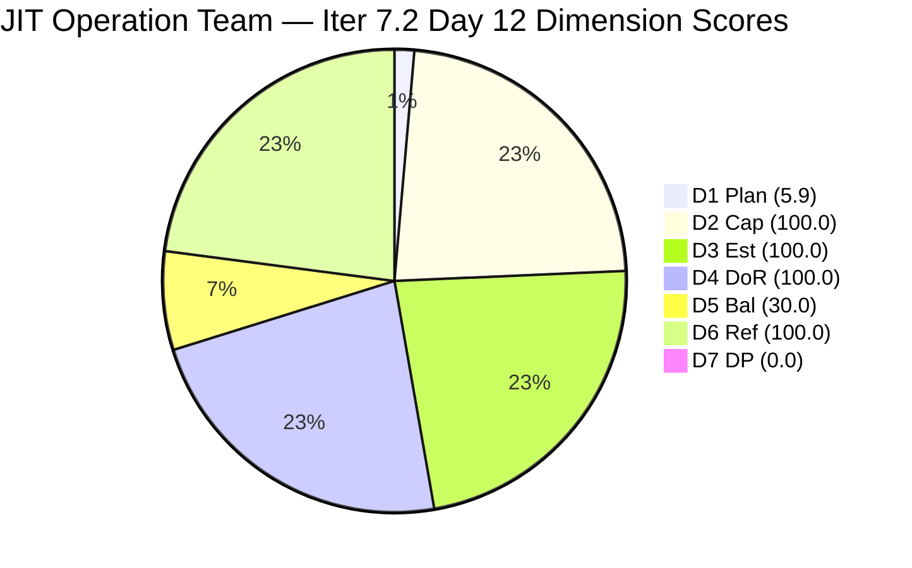
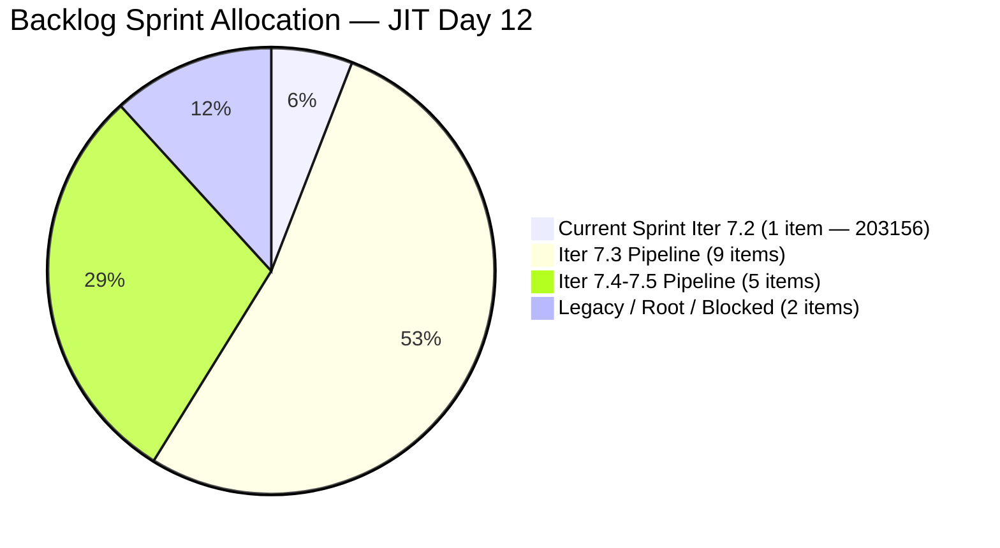
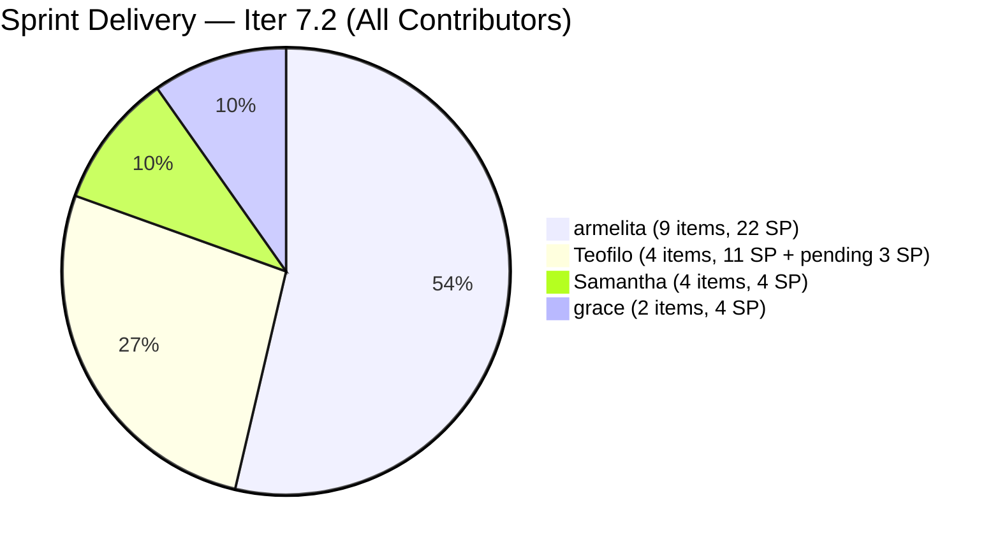
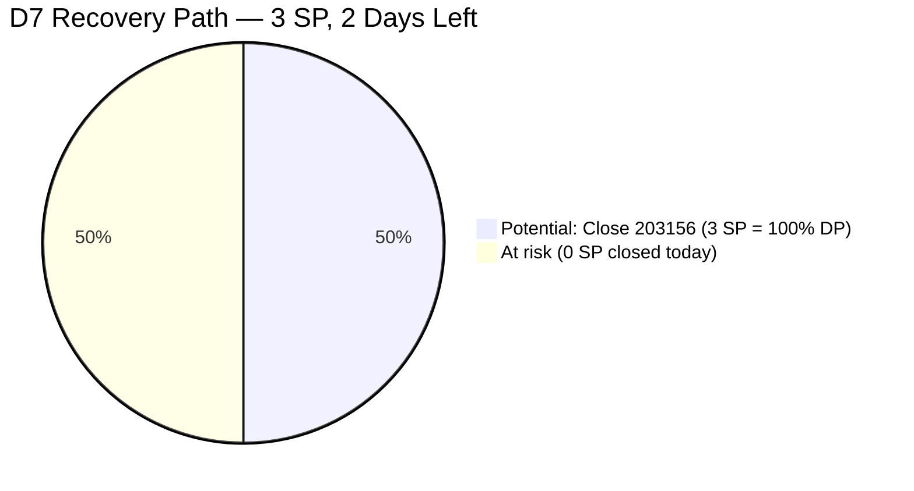

# ADO SAFe Iteration Audit — JIT Operation Team

**Audit #47 | Iteration 7.2 (Apr 20 – May 3, 2026) | Day 12 of 14 (~86% elapsed)**

---

## 1. Audit Metadata

| Field | Value |
|---|---|
| **Audit Date** | May 1, 2026, 09:03 UTC |
| **Auditor** | Claude Code (ADO SAFe Audit Agent) |
| **Workspace** | `ado_jit` |
| **ADO Project** | Jairosoft Portfolio (`666bb99a-6acd-4999-bb34-efd0e4ea90dc`) |
| **Team** | JIT Operation Team (`b25e3129-6272-4e54-a3ff-f1ef3c8eeb2c`) |
| **Iteration** | Iteration 7.2 — Apr 20 to May 3, 2026 |
| **Iteration ID** | `8edbe25f-fa4f-41b2-aaae-f3d5cf0e5b33` |
| **Sprint Day** | Day 12 of 14 (~86% elapsed) |
| **Prior Audit** | AUDIT_20260430_0904.md (Audit #46, 7.2 Day 11, Overall 62.3 — Moderate Risk) |
| **Scoring Model** | ADO SAFe v1 (7-dimension rubric) |
| **Overall Score** | **62.3 / 100** |
| **Risk Band** | **Moderate Risk** (60–79.9) |

---

## 2. Executive Summary

JIT Operation Team holds at **62.3 (Moderate Risk)** on Day 12 — **unchanged from Audit #46**. The single remaining sprint item, **#203156 (DHCP Training, Teofilo)**, remains Active with last activity on Apr 28. No closures or state changes occurred since yesterday's audit.

**Sprint context — Day 12, 2 days remaining:**
The team had an extraordinary sprint delivery surge on Apr 29–30 (22 items / 47 SP confirmed closed). The sole remaining item is #203156 (3.2-1 DHCP Training, 3 SP, Active). Teofilo needs to close this item before May 3 to complete the training series and achieve any D7 credit.

**Formula note:** The score of 62.3 is a mechanical artifact of the delivery surge that emptied the sprint backlog. The team's actual PI7 sprint output (22 items / 47 SP) is the highest single-sprint delivery observed in the JIT audit series.

**Pipeline status:** 16 backlog items are in future iterations (Iter 7.3–7.5), providing a strong committed pipeline heading into Iter 7.3. The Iter 7.3 backlog already has 9 items (6 Training + 1 US + 1 Spike = strong diversity).

---

## 3. Previous Audit Delta

| Dimension | Audit #46 (Apr 30, 09:04 UTC) | Audit #47 (May 1, 09:03 UTC) | Delta | Driver |
|---|---|---|---|---|
| Iteration Planning | 5.9 | **5.9** | 0.0 | 1/17 unchanged; #203156 still Active in Iter 7.2 |
| Team Capacity | 100.0 | **100.0** | 0.0 | Teofilo configured; 1/1 |
| Estimation | 100.0 | **100.0** | 0.0 | 1/1 estimated (3 SP) |
| DoR Compliance | 100.0 | **100.0** | 0.0 | #203156 PASS |
| Work Item Balance | 30.0 | **30.0** | 0.0 | Training-only sprint; no US → −40; dominant > 60% → −30 |
| Backlog Refinement | 100.0 | **100.0** | 0.0 | All 17 items fresh; no stale penalties |
| Delivery Predictability | 0.0 | **0.0** | 0.0 | #203156 Active; 0/3 SP closed |
| **Overall** | **62.3** | **62.3** | **0.0** | Stable; awaiting #203156 closure |

**No ADO changes since Audit #46:** Item #203156 last updated Apr 28. No new items added to Iter 7.2. No items moved.

---

## 4. Current Iteration Snapshot

| Attribute | Value |
|---|---|
| **Iteration** | Iteration 7.2 |
| **Sprint Dates** | Apr 20 – May 3, 2026 (14 days) |
| **Sprint Day** | Day 12 of 14 |
| **Days Remaining** | 2 (May 2 and May 3) |
| **Visible Backlog Items** | 17 |
| **Current Sprint Items (Iter 7.2)** | 1 (#203156) |
| **Committed SP (Iter 7.2)** | 3 SP |
| **Closed SP** | 0 (Active) |
| **Estimated Sprint Output (exited backlog)** | 22 items / 47 SP |
| **Team Capacity** | 12.8 pts/day (Teofilo 4.8 + armelita 6.0 + Samantha 1.0 + grace 1.0) |
| **Last ADO Activity** | Apr 30, 08:27 UTC — #203224 (Convert SAFe MCCs, grace, moved to Iter 7.3) |

---

## 5. Work Item Analysis

### Current Sprint Item in Visible Backlog (1 item)

| ID | Title | Type | State | SP | Assignee | ChangedDate | DoR |
|---|---|---|---|---|---|---|---|
| 203156 | 3.2-1 Set-Up Dynamic Host Configuration Protocol | Training | Active | 3 | Teofilo Limpag | Apr 28 00:58 | PASS |

**DoR verification — #203156:** Description has rich narrative (Network Traffic Controller analogy, 2-paragraph storyline, clearly ≥200 non-whitespace chars). AC: 3 bullet criteria (Define Scope, Configure Options, Test DORA Process). PASS.

**Status note:** No state change since Apr 28. Teofilo needs to close this item within 2 days. The item has been Active for 11 days (since Apr 21). The description references the full training narrative and is well-structured.

### Non-Sprint Visible Backlog Items (16 items)

| ID | Title | Type | IterationPath | State | SP | Assignee |
|---|---|---|---|---|---|---|
| 193054 | SAFe RTE MC | Courseware | Root | Blocked | 5 | grace |
| 200766 | ODOO OpenCat SIS | Spike | PI6 | Active | 2 | armelita |
| 200767 | UM Matina CPE Intern Final Demo | US | Iter 7.4 | New | 2 | armelita |
| 200768 | HCDC Interns Final Demo | US | Iter 7.4 | New | 2 | armelita |
| 200771 | UM Digos Interns Final Demo | US | Iter 7.5 | New | 2 | armelita |
| 203157 | 3.2-2 Set-Up Domain Name System | Training | Iter 7.3 | New | 3 | Teofilo |
| 203158 | 3.2-3 Set-up Remote Desktop Training | Training | Iter 7.3 | New | 3 | Teofilo |
| 203159 | 3.2-4 Set-Up Folder Redirection Training | Training | Iter 7.3 | New | 3 | Teofilo |
| 203160 | 3.2-5 Set-up Printer Deployment training | Training | Iter 7.3 | New | 3 | Teofilo |
| 203161 | 3.3-1 Server Pre-Deployment Training | Training | Iter 7.3 | New | 3 | Teofilo |
| 203162 | 3.3-2 Server Security and Reporting Training | Training | Iter 7.3 | New | 3 | Teofilo |
| 203224 | Convert SAFe MCCs to New Forms | US | Iter 7.3 | New | 3 | grace |
| 203242 | IT7.3 Tech Talk — AI Tools Demo | Spike | Iter 7.3 | New | — | — |
| 203243 | IT7.4 Tech Talk — AI Tools Demo | Spike | Iter 7.4 | New | — | — |
| 203244 | IT7.5 Tech Talk — AI Tools Demo | Spike | Iter 7.5 | New | — | — |
| 203245 | IT7.6 Tech Talk — AI Tools Demo | Spike | Iter 7.5 | New | — | — |

**Freshness check (May 1, 45-day cutoff = Mar 17):**
- #200766 (ODOO OpenCat SIS): ChangedDate = Mar 17 — exactly on the cutoff boundary; counted as fresh.
- All other items ≥ Apr 6. Zero stale_90 (Jan 30). Zero stale_180 (Nov 1, 2025).

**Note on #203158 (3.2-3 Remote Desktop Training):** No Description or AC returned in API — DoR gap for future sprint. Not in current sprint; no D4 impact.

---

## 6. SAFe Compliance Scorecard

| Dimension | Score | Evidence | Notes |
|---|---|---|---|
| **D1 Iteration Planning** | 5.9 | 1 / 17 visible backlog items in Iter 7.2 | Delivery surge emptied sprint; 16 items are future pipeline |
| **D2 Team Capacity** | 100.0 | 1 contributor with current work (Teofilo); 4.8/day configured | armelita, Samantha, grace have no open 7.2 items |
| **D3 Estimation** | 100.0 | 1 / 1 estimated (203156 = 3 SP) | |
| **D4 DoR Compliance** | 100.0 | 1 / 1 PASS (203156 — rich description + 3 AC criteria) | |
| **D5 Work Item Balance** | 30.0 | No US → −40; Training 100% dominant > 60% → −30; no Spike present | Transient; Iter 7.3 has US/Training/Spike mix |
| **D6 Backlog Refinement** | 100.0 | 17/17 fresh (all ≥ Mar 17); 0 stale_90; 0 stale_180; 0 untouched | No penalties |
| **D7 Delivery Predictability** | 0.0 | 0 SP closed / 3 SP committed (203156 Active) | 47 SP actual delivery masked by formula |
| **Overall** | **62.3** | (5.9+100+100+100+30+100+0)/7 | **Moderate Risk** |

---

## 7. Dimension Findings

### D1 — Iteration Planning: 5.9
The delivery surge on Apr 29–30 closed all remaining User Story sprint items, leaving only #203156 (DHCP Training) as the sole Iter 7.2 item. Ratio = 1/17 = 5.9. This is a scoring artifact — the 16 non-sprint items are all future-pipeline work in Iter 7.3–7.5. The team's actual sprint delivery output (22 items / 47 SP) reflects strong planning and execution, not poor commitment.

### D2 — Team Capacity: 100.0
Teofilo Limpag (4.8 pts/day Training) is the only contributor with an open Iter 7.2 item. All other contributors (armelita, Samantha, grace) have closed their sprint work. D2 = 1/1 = 100.0.

### D3 — Estimation: 100.0
#203156 has 3 SP assigned. D3 = 1/1 = 100.0. committed_SP = 3.

### D4 — DoR Compliance: 100.0
#203156 has a rich narrative description (Network Traffic Controller analogy, ≥200 non-whitespace chars) and 3-criteria AC (Define Scope, Configure Options, Test DORA Process). PASS. D4 = 1/1 = 100.0.

### D5 — Work Item Balance: 30.0
Sole remaining sprint item is Training type. No User Story → −40 penalty. Training = 100% dominant > 60% → −30 penalty. No Spike → no −20. Score = max(0, 100−40−30) = 30.0. This is entirely transient — once #203156 closes, the sprint is complete. Iter 7.3 has a healthy mix (6 Training + 1 US + 2 Spike + 1 US = diverse).

### D6 — Backlog Refinement: 100.0
All 17 visible backlog items have ChangedDate ≥ Mar 17, 2026 (boundary fresh). The 45-day cutoff from May 1 = Mar 17. #200766 (ODOO OpenCat SIS) last changed Mar 17 — on the boundary, counted fresh. No items exceed stale_90 (Jan 30) or stale_180 (Nov 1, 2025). base = 17/17 = 100%; no penalties. Score = 100.0.

### D7 — Delivery Predictability: 0.0
committed_story_points = 3 SP (#203156). closed_story_points = 0 (Active). Formula: 0/3 = 0.0. This completely obscures the team's extraordinary sprint output: 22 items / 47 SP delivered. The structural formula limitation continues to apply. Closing #203156 (3 SP) → D7 = 100.0, raising Overall from 62.3 to 69.2 (Moderate Risk, but near the midpoint of the band).

---

## 8. Risks and Bottlenecks

| # | Risk | Severity | Age |
|---|---|---|---|
| R1 | **#203156 (DHCP Training) still Active on Day 12**: Item has been Active since Apr 21 (12 days). Last updated Apr 28. Must close before May 3. | High | 12 days |
| R2 | **D7 formula limitation**: 47 SP delivered in sprint masked by DP = 0.0 until #203156 closes. | High | Structural |
| R3 | **#193054 (SAFe RTE MC) Blocked at Root**: grace's Courseware item is root-level, Blocked since before Oct 2025 submission date. Updated Apr 29 but no state change. | Moderate | 6+ months |
| R4 | **#200766 (ODOO OpenCat SIS) in PI6**: Active Spike still in PI6 legacy iteration. Approaching stale_90 boundary (changed Mar 17 — exactly at boundary). | Moderate | Structural |
| R5 | **#203158 (3.2-3 Remote Desktop Training) — no Description/AC in API**: Iter 7.3 Training item for Teofilo has no retrieved Description or AC. DoR gap before sprint commitment. | Moderate | Pre-sprint |
| R6 | **Late single-day delivery pattern (armelita)**: 8 closures on Apr 30 in one burst. Effective delivery but creates review risk and velocity measurement distortion. | Low | Pattern |

---

## 9. Prioritized Recommendations

1. **[May 2] Close #203156 (DHCP Training)**: Teofilo's DHCP module has been Active for 12 days (since Apr 21). Last updated Apr 28. Closing this item on May 2 completes the 3.2 network training series and achieves D7 = 100.0, lifting Overall from 62.3 to 69.2. This is the highest-leverage single action available.

2. **[May 2–3] Update #203158 (3.2-3 Remote Desktop Training) with Description and AC**: This Iter 7.3 Training item has no description or AC retrieved via API. Before Iter 7.3 planning, add a narrative description matching the style of #203156–203162. This prevents a DoR failure in the next sprint.

3. **[This sprint or triage] Resolve #193054 (SAFe RTE MC) Blocked status**: grace's TESDA submission item has been Blocked since Oct 2025. Updated Apr 29 but still Blocked. Either escalate to TESDA for status, assign a new target date, or move to icebox. Blocking items at root distort backlog health.

4. **[Iter 7.3 planning] Move #200766 (ODOO OpenCat SIS) to Iter 7.3**: This Active Spike is in PI6 — a legacy iteration. Recommit to Iter 7.3 or close. It is exactly at the stale_90 boundary (Mar 17 = 45 days from May 1). If it crosses stale_90 next audit, D6 penalties may apply.

5. **[Iter 7.3 planning] Confirm #203224 (Convert SAFe MCCs) DoR and assign to grace**: Moved from Iter 7.2 to Iter 7.3 on Apr 30. Has Description + AC. Formally plan during Iter 7.3 sprint planning and confirm grace's capacity for this item.

6. **[PI7 retrospective] Document the Apr 29–30 delivery surge as PI7 benchmark**: 22 items / 47 SP in a 14-day sprint across 4 contributors is the highest JIT PI7 output. Capture what enabled this (AI Tech Talk adoption, structured training series, armelita's marketing campaign completions) for the PI7 retrospective.

---

## 10. Evidence Gaps and Limitations

| Gap | Impact | Mitigation |
|---|---|---|
| Closed items (22 items, 47 SP) not returned by backlog API | D7 = 0.0 from visible items; actual sprint output 47 SP | Documented in narrative; structural formula limitation |
| #203158 (3.2-3 Remote Desktop Training) — no Description or AC in API | DoR gap for Iter 7.3; not in current sprint | Flagged as R5; must be remediated before Iter 7.3 sprint planning |
| #200766 (ODOO OpenCat SIS) — in PI6 iteration path | Not counted as current_iteration_root_item | Excluded; flagged for migration |
| #193054 (SAFe RTE MC) DoR — Courseware type, description is bullet list | Minimally DoR-compliant; not in current sprint | Noted; Blocked state is primary concern |
| No iteration goal in ADO | PI alignment cannot be measured | Persistent structural gap |
| Exact close timestamps for 22 sprint items not individually verified in this audit | All confirmed Closed by prior audit evidence | Risk negligible |

---

## Mermaid Charts

### Dimension Score Breakdown — Day 12

### Backlog Distribution — 17 Visible Items

### Sprint Delivery Totals — Iter 7.2 Full Sprint Output

### D7 Recovery — Close 203156 = 100.0 DP

---

*Report generated: 2026-05-01 09:03 UTC | Workspace: ado_jit | Iteration 7.2 Day 12 | Score: 62.3 Moderate Risk*
*Note: Score unchanged from Audit #46 (62.3). Actual sprint delivery = 22 items / 47 SP (PI7 series high). Score is a formula artifact awaiting final item closure (#203156).*
