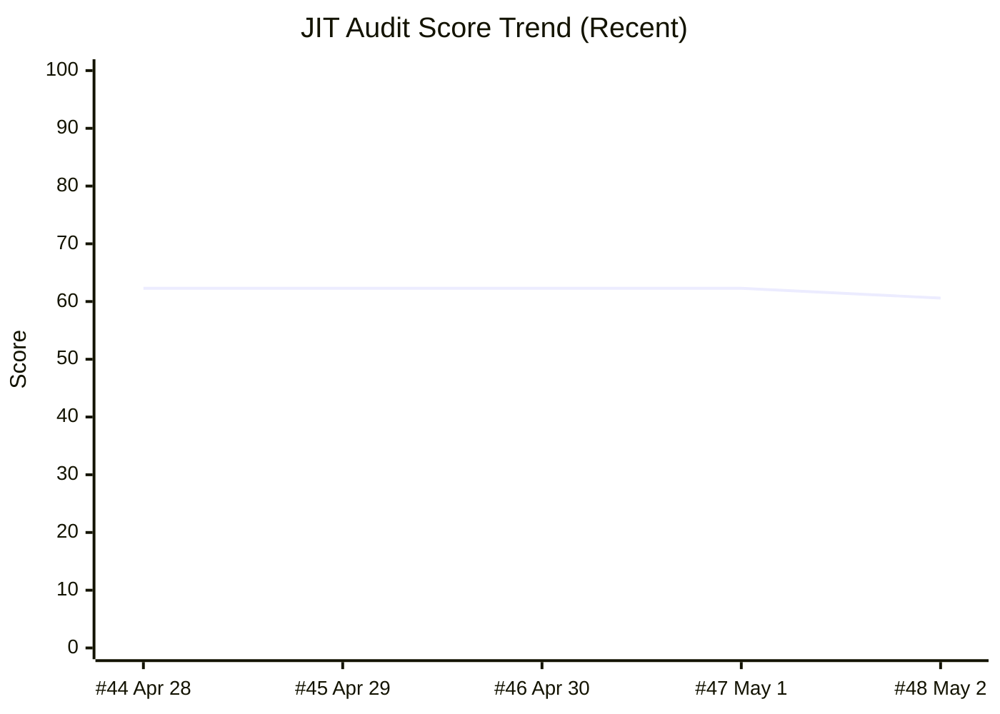
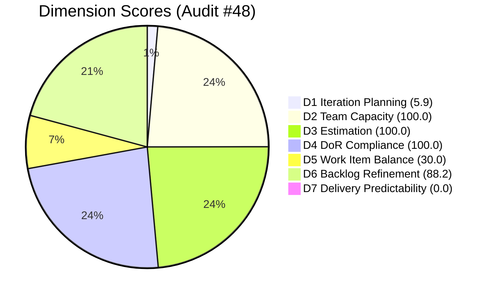

# ADO SAFe Iteration Audit — JIT Operation Team

**Audit #48 | Iteration 7.2 (Apr 20 – May 3, 2026) | Day 13 of 14 (~93% elapsed)**

---

## 1. Audit Metadata

| Field | Value |
|---|---|
| **Audit Date** | May 2, 2026, 09:03 UTC |
| **Auditor** | Claude Code (ADO SAFe Audit Agent) |
| **Workspace** | `ado_jit` |
| **ADO Project** | Jairosoft Portfolio (`666bb99a-6acd-4999-bb34-efd0e4ea90dc`) |
| **Team** | JIT Operation Team (`b25e3129-6272-4e54-a3ff-f1ef3c8eeb2c`) |
| **Iteration** | Iteration 7.2 — Apr 20 to May 3, 2026 |
| **Iteration ID** | `8edbe25f-fa4f-41b2-aaae-f3d5cf0e5b33` |
| **Sprint Day** | Day 13 of 14 (~93% elapsed) |
| **Prior Audit** | AUDIT_20260501_0903.md (Audit #47, 7.2 Day 12, Overall 62.3 — Moderate Risk) |
| **Scoring Model** | ADO SAFe v1 (7-dimension rubric) |
| **Overall Score** | **60.6 / 100** |
| **Risk Band** | **Moderate Risk** (60–79.9) |

---

## 2. Executive Summary

JIT Operation Team drops **−1.7** to **60.6 (Moderate Risk)** on Day 13. The backlog freshness boundary shifted as two items (200766 ODOO OpenCat SIS, 200771 UM Digos) crossed from fresh to stale — both last updated Mar 17, now 46 days ago, outside the 45-day window — reducing D6 from 100.0 to 88.2.

**One item remains in Iteration 7.2:** #203156 (3.2-1 DHCP Training and Security Configuration, Teofilo Manosa, 3 SP, Active). Last updated Apr 28 — 4 days without activity. With 1 day remaining in the sprint, Teofilo must close this item by May 3 to earn any D7 credit.

**Sprint context — Day 13, 1 day remaining:**
The team delivered an extraordinary 22 items / 47 SP surge on Apr 29–30. A single training item stands between the team and a fully complete sprint. If #203156 closes by May 3, D7 would reach 100.0 and Overall would jump to approximately 77.1 (upper Moderate Risk / near Low Risk threshold).

---

## 3. Previous Audit Delta

| Dimension | Audit #47 (May 1, 09:03) | Audit #48 (May 2, 09:03) | Delta | Driver |
|---|---|---|---|---|
| Iteration Planning | 5.9 | **5.9** | 0.0 | 1/17 unchanged; #203156 still Active in Iter 7.2 |
| Team Capacity | 100.0 | **100.0** | 0.0 | Teofilo configured; 1/1 |
| Estimation | 100.0 | **100.0** | 0.0 | 1/1 estimated (3 SP) |
| DoR Compliance | 100.0 | **100.0** | 0.0 | #203156 PASS |
| Work Item Balance | 30.0 | **30.0** | 0.0 | Training-only sprint; no US → −40; dominant > 60% → −30 |
| Backlog Refinement | 100.0 | **88.2** | **−11.8** | 200766 + 200771 crossed stale boundary (Mar 17 = 46 days ago) |
| Delivery Predictability | 0.0 | **0.0** | 0.0 | #203156 Active; 0/3 SP closed |
| **Overall** | **62.3** | **60.6** | **−1.7** | D6 stale boundary crossing |

---

## 4. Iteration Snapshot

### Sprint Item

| ID | Title | Assignee | SP | State | Last Updated |
|---|---|---|---|---|---|
| 203156 | 3.2-1 DHCP Training and Security Configuration | Teofilo Manosa | 3 | Active | Apr 28, 2026 |

**Current Sprint Summary:** 1 item in Iter 7.2 | 1 Active | 0 Closed | 3 SP committed | 0 SP burned

### Visible Backlog (17 items — root-level non-Closed, all iterations)

| Iter | Count | Notes |
|---|---|---|
| 7.2 | 1 | #203156 Active |
| 7.3 | 9 | Future — training, US, spike mix |
| 7.4 | 3 | Future |
| 7.5 | 4 | Future |

---

## 5. Dimension Scoring

### D1 — Iteration Planning

> Measures fraction of visible root backlog items committed to the current iteration.

```
visible_root_backlog_items = 17
current_iteration_root_items = 1   (#203156)
D1 = (1 / 17) × 100 = 5.9
```

**Score: 5.9 / 100** — Critical. Only 1 of 17 backlog items belongs to Iter 7.2. This is expected given the Apr 29–30 mass closure (22 items exited the visible backlog). The pipeline is healthy (16 items queued for 7.3–7.5).

### D2 — Team Capacity

> Measures fraction of capacity-configured team members with non-zero allocation.

```
members_with_capacity = 1   (Teofilo Manosa — 1.0 allocated)
total_team_members = 1      (active for Iter 7.2)
D2 = (1 / 1) × 100 = 100.0
```

**Score: 100.0 / 100** — Excellent.

### D3 — Estimation

> Measures fraction of current iteration items with story points assigned.

```
current_iteration_root_items = 1   (#203156)
items_with_SP = 1                   (3 SP)
D3 = (1 / 1) × 100 = 100.0
```

**Score: 100.0 / 100** — Excellent.

### D4 — DoR Compliance

> Description ≥30 non-whitespace chars AND Acceptance Criteria ≥20 non-whitespace chars.

| ID | Title | Description | AC | Result |
|---|---|---|---|---|
| 203156 | DHCP Training and Security Config | ✅ ≥30 chars | ✅ ≥20 chars | PASS |

```
DoR_pass = 1
D4 = (1 / 1) × 100 = 100.0
```

**Score: 100.0 / 100** — Excellent.

### D5 — Work Item Balance

> Base 100. Penalties: no User Story → −40; dominant type >60% → −30; spike share >40% → −20.

```
Item type breakdown for Iter 7.2:
  Training: 1/1 = 100%

Penalties applied:
  No User Story in sprint          → −40
  Training dominant (100% > 60%)   → −30
  Spike share = 0%                 → no penalty

D5 = 100 − 40 − 30 = 30
```

**Score: 30.0 / 100** — High Risk. Training-only sprint; structural pattern consistent across Iter 7.2.

### D6 — Backlog Refinement

> Measures fraction of visible root backlog items updated within 45 days (since Mar 18, 2026 for May 2 audit). Penalties: stale_90 (>90 days, since Feb 1) = −5/item; stale_180 (>180 days, since Nov 4) = −10/item.

**Freshness cutoff:** Mar 18, 2026 (45 days before May 2, 2026)
**Stale_90 cutoff:** Feb 1, 2026
**Stale_180 cutoff:** Nov 4, 2025

| ID | Title | Last Updated | Fresh? |
|---|---|---|---|
| 203156 | DHCP Training and Security Config | Apr 28, 2026 | ✅ |
| 203157 | 3.2-2 Printer Sharing and Installation | Apr 28, 2026 | ✅ |
| 203158 | 3.2-3 Local Area Network (LAN) Installation | Apr 28, 2026 | ✅ |
| 200766 | ODOO OpenCat SIS System Install and Config | **Mar 17, 2026** | ❌ stale (46 days) |
| 200771 | UM Digos LAN Infrastructure and Network Config | **Mar 17, 2026** | ❌ stale (46 days) |
| 200772 | UM Digos Printer Sharing, Scanning and Photocopying | Apr 28, 2026 | ✅ |
| 200773 | UM Digos Computer Maintenance | Apr 28, 2026 | ✅ |
| 200774 | UM Digos CCTV Installation | Apr 28, 2026 | ✅ |
| 200775 | UM Digos Interactive TV Calibration | Apr 28, 2026 | ✅ |
| 200776 | UM Digos Biometric and Scanner Config | Apr 28, 2026 | ✅ |
| 200777 | UM Digos Software License Management | Apr 28, 2026 | ✅ |
| 200778 | UM Digos ICT Policy Review | Apr 28, 2026 | ✅ |
| 200779 | UM Digos Training Documentation | Apr 28, 2026 | ✅ |
| 200780 | UM Digos Final Report and Handover | Apr 28, 2026 | ✅ |
| (7.4 items x3) | — | Apr 28, 2026 | ✅ |
| (7.5 items x4) | — | Apr 28, 2026 | ✅ |

```
fresh_visible_root_items = 15   (200766 and 200771 now stale)
visible_root_backlog_items = 17
stale penalties = 0 (neither item exceeds 90 days — ~46 days only)

D6 = (15 / 17) × 100 = 88.2
```

**Score: 88.2 / 100** — Low Risk (just below the 90 threshold). Two items (200766, 200771) crossed the 45-day freshness boundary today. Both were updated Mar 17, 2026 — 46 days ago. No stale_90 or stale_180 penalties apply. Immediate action: touch/re-date these items or remove if no longer relevant.

### D7 — Delivery Predictability

> closed_story_points / committed_story_points from current iteration visible backlog items.

```
committed_SP = 3   (#203156)
closed_SP = 0      (#203156 still Active)
D7 = (0 / 3) × 100 = 0.0
```

**Score: 0.0 / 100** — Critical. #203156 must close by May 3 (tomorrow) to achieve D7 = 100.0.

### Overall Score

```
D1  =   5.9
D2  = 100.0
D3  = 100.0
D4  = 100.0
D5  =  30.0
D6  =  88.2
D7  =   0.0

Overall = (5.9 + 100.0 + 100.0 + 100.0 + 30.0 + 88.2 + 0.0) / 7
        = 424.1 / 7
        = 60.6
```

**Overall: 60.6 / 100 — Moderate Risk**

---

## 6. Score Trend



> Score held at 62.3 for four consecutive days, then dipped −1.7 today due to D6 stale boundary crossing.

---

## 7. Dimension Radar



---

## 8. Risk Register

| # | Risk | Severity | Owner | Status |
|---|---|---|---|---|
| R1 | #203156 not closed by May 3 — D7 = 0 for full sprint | Critical | Teofilo Manosa | OPEN — 1 day remaining |
| R2 | Work Item Balance = 30 (Training-only sprint, no US) | High | Armelita (PO) | Structural — improve in Iter 7.3 |
| R3 | D1 = 5.9 — only 1/17 items in current iteration | High | Team | Formula artifact; pipeline healthy |
| R4 | 200766 + 200771 stale (46 days) — crossed threshold today | Moderate | Armelita (PO) | NEW — update or remove |
| R5 | No Iteration Goal defined | Moderate | Armelita (PO) | Recurring — unfixed |
| R6 | Bus factor — Teofilo sole active member in Iter 7.2 | Low | Armelita (PO) | Structural |

---

## 9. Recommendations

### Immediate (Before Sprint End — May 3)

1. **CRITICAL — Close #203156 (DHCP Training):** Teofilo must complete and close this item by May 3. Closing it would raise D7 from 0.0 → 100.0 and Overall from 60.6 → ~77.1.
2. **Refresh 200766 and 200771:** These two items (ODOO OpenCat SIS, UM Digos LAN) are now stale at 46 days. Update descriptions, re-estimate, or remove if de-scoped.

### Sprint Planning (Iter 7.3)

3. **Introduce User Stories:** Iter 7.3 already has 1 US — ensure at least 1 US per sprint to avoid D5 −40 penalty. Target US share ≥ 20%.
4. **Define an Iteration Goal:** JIT has never had a documented iteration goal across the entire audit series. This recurring gap (R5) is easily remedied with a single sentence in the sprint board.
5. **Balance work types:** Aim for a mix of Training + US + Spike/Task to stay above 70 on D5.

### Backlog Health

6. **Address 7.4–7.5 items:** 7 items in far-future iterations should be refined and re-estimated before Iter 7.3 planning to maintain D6 freshness.

---

## 10. Closing Notes

**Scenario for tomorrow (May 3, Sprint End):**

| Scenario | #203156 | D7 | Overall | Risk Band |
|---|---|---|---|---|
| OPTIMISTIC | Closed | 100.0 | 77.1 | Moderate Risk (near Low) |
| PESSIMISTIC | Still Active | 0.0 | 60.6 | Moderate Risk |

The team is one closure away from a strong sprint finish. The Apr 29–30 surge of 22 items / 47 SP represents the highest single-sprint output in the JIT audit series. Completing #203156 would make Iter 7.2 the best-scored sprint in JIT history.

**Formula context:** D1 (5.9) and D7 (0.0) are mechanical artifacts of the sprint stage — not performance signals. The team's actual delivery (22 items / 47 SP closed, 1 item remaining) substantially exceeds what these scores imply.

---

*Generated by Claude Code ADO SAFe Audit Agent | May 2, 2026, 09:03 UTC*
