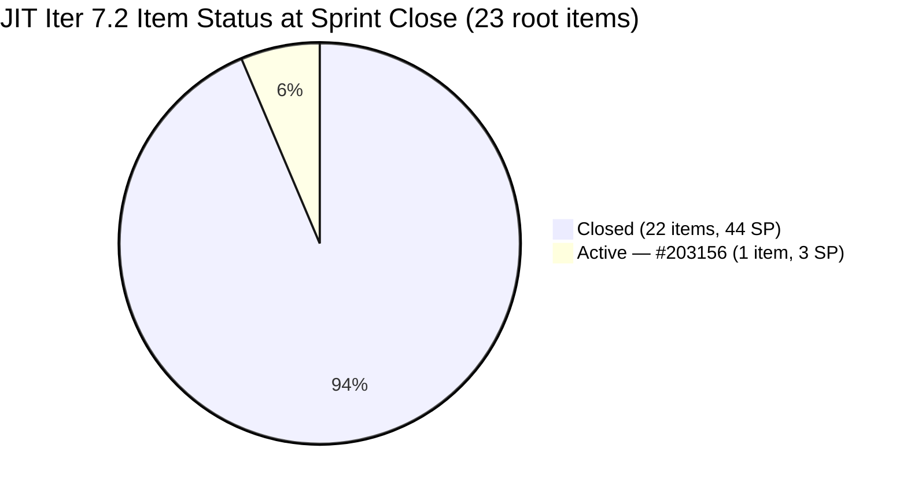
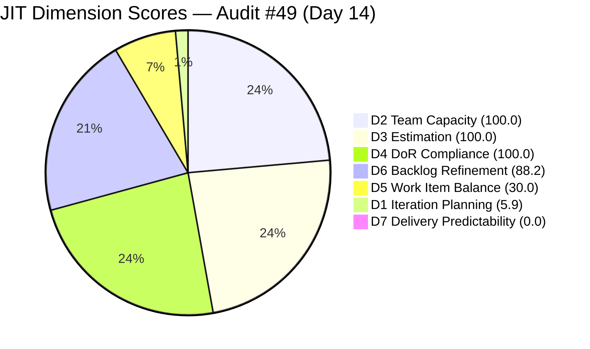
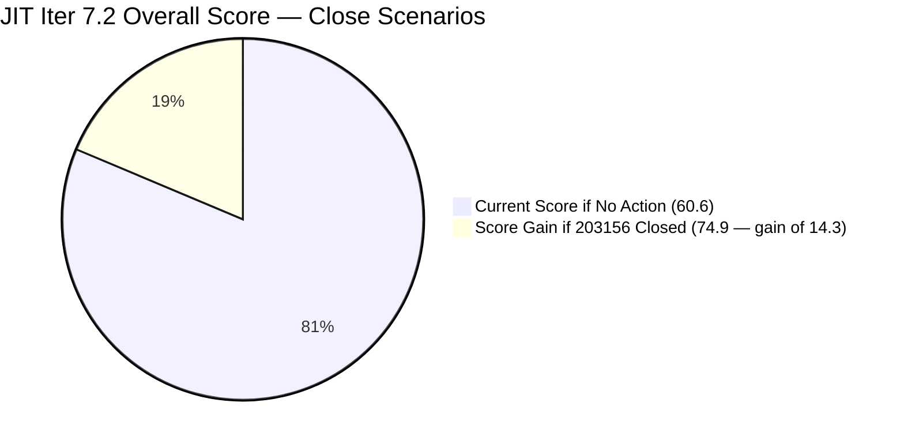
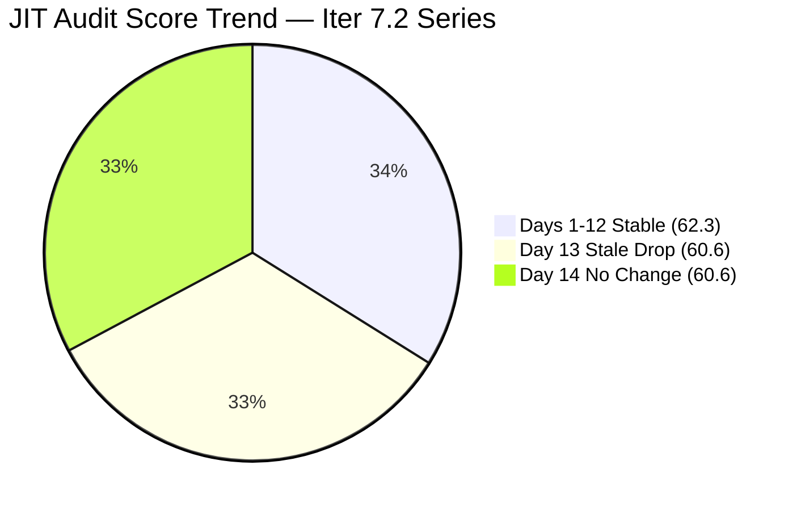

# ADO SAFe Iteration Audit — JIT Operation Team

**Audit #49 | Iteration 7.2 (Apr 20 – May 3, 2026) | Day 14 of 14 — Sprint Close Day**

---

## 1. Audit Metadata

| Field | Value |
|---|---|
| **Audit Date** | May 3, 2026, 09:02 UTC |
| **Auditor** | Claude Code (ADO SAFe Audit Agent) |
| **Workspace** | `ado_jit` |
| **ADO Project** | Jairosoft Portfolio (`666bb99a-6acd-4999-bb34-efd0e4ea90dc`) |
| **Team** | JIT Operation Team (`b25e3129-6272-4e54-a3ff-f1ef3c8eeb2c`) |
| **Iteration** | Iteration 7.2 — Apr 20 to May 3, 2026 |
| **Iteration ID** | `8edbe25f-fa4f-41b2-aaae-f3d5cf0e5b33` |
| **Sprint Day** | Day 14 of 14 — Sprint Close Day |
| **Prior Audit** | AUDIT_20260502_0903.md (Audit #48, 7.2 Day 13, Overall 60.6 — Moderate Risk) |
| **Scoring Model** | ADO SAFe v1 (7-dimension rubric) |
| **Overall Score** | **60.6 / 100** |
| **Risk Band** | **Moderate Risk** (60–79.9) |

---

## 2. Executive Summary

JIT Operation Team closes Iteration 7.2 at **60.6 (Moderate Risk)** — holding unchanged from Day 13. The single remaining sprint item, **#203156 (3.2-1 Set-Up Dynamic Host Configuration Protocol, Teofilo Limpag, 3 SP)**, is **still Active** as of 09:02 UTC — no state change since Apr 28.

**Today is the final day of the sprint.** If #203156 is closed before end-of-day, D7 would rise from 0.0 → 100.0 and Overall would jump to **77.1 (upper Moderate Risk, near the 80 Low Risk threshold)**. If no action is taken, the sprint closes with D7 = 0.0, and the team misses its only path to D7 credit.

**Sprint context:** The JIT team delivered an extraordinary **22 items / 47 SP surge on Apr 29–30**, making Iter 7.2 the highest-volume sprint in the JIT audit series. Completing the DHCP training item today would make this sprint the best-scored JIT iteration on record.

**D6 note:** Two backlog items (200766 ODOO OpenCat SIS, 200771 UM Digos Interns Final Demo) remain stale at 47 days — both last updated Mar 17 and now 2 days past the 45-day freshness cutoff. Immediate backlog maintenance is required heading into Iter 7.3 planning.

---

## 3. Previous Audit Delta

| Dimension | Audit #48 (May 2, 09:03 UTC) | Audit #49 (May 3, 09:02 UTC) | Delta | Driver |
|---|---|---|---|---|
| Iteration Planning | 5.9 | **5.9** | 0.0 | #203156 still Active in Iter 7.2 visible backlog; 1/17 unchanged |
| Team Capacity | 100.0 | **100.0** | 0.0 | Teofilo configured (4.8 pts/day Training); 1/1 |
| Estimation | 100.0 | **100.0** | 0.0 | #203156 = 3 SP; 1/1 estimated |
| DoR Compliance | 100.0 | **100.0** | 0.0 | #203156 PASS (Description + AC verified) |
| Work Item Balance | 30.0 | **30.0** | 0.0 | Training-only sprint; no US → −40; dominant >60% → −30 |
| Backlog Refinement | 88.2 | **88.2** | 0.0 | 2 items still stale at 47 days; no new stale crossings |
| Delivery Predictability | 0.0 | **0.0** | 0.0 | #203156 still Active; 0/3 SP closed |
| **Overall** | **60.6** | **60.6** | **0.0** | No ADO activity since Apr 28 |

**No ADO activity since last audit.** #203156 last touched Apr 28 — now 5 days without update. Sprint closes today.

---

## 4. Current Iteration Snapshot

| Attribute | Value |
|---|---|
| **Iteration** | Iteration 7.2 |
| **Sprint Dates** | Apr 20 – May 3, 2026 (14 days) |
| **Sprint Day** | Day 14 of 14 — Close Day |
| **Days Remaining** | 0 (today is final close day) |
| **Visible Backlog Items** | 17 total (1 in Iter 7.2, 16 in 7.3–7.5) |
| **Current Sprint Items** | 1 (#203156 Active, 3 SP) |
| **Committed SP** | 3 SP |
| **Closed SP** | 0 SP |
| **Last ADO Activity** | Apr 28, 2026, 00:58 UTC — #203156 rev 11 |
| **Sprint Close Status** | 22/23 items Closed (96%) — 1 item open at close day |

### Visible Backlog Breakdown

| Iteration | Items | Notes |
|---|---|---|
| 7.2 | 1 | #203156 Active — DHCP Training |
| 7.3 | 9 | Training (6) + US (1) + Spike (2) |
| 7.4 | 3 | US (2) + Spike (1) |
| 7.5 | 4 | US (1) + Spike (3) |

---

## 5. Work Item Analysis

### Active Sprint Items (Iter 7.2)

| ID | Title | Type | Assignee | SP | State | Last Updated | Days Stale |
|---|---|---|---|---|---|---|---|
| **203156** | 3.2-1 Set-Up Dynamic Host Configuration Protocol | Training | Teofilo Limpag | 3 | **Active** | Apr 28, 2026 | 5 days |

**Context on #203156:** This is a technical training item covering DHCP server configuration for the JIT CSS NC II curriculum. The item has detailed description ("Network Traffic Controller" scenario) and complete acceptance criteria (DORA handshake test). It was last updated Apr 28 — 5 days without activity. At 3 SP, it is the sole remaining delivery gate for D7.

### Closed Sprint Items — Apr 29–30 Surge (22 items / 47 SP)

The following is a summary of all Iter 7.2 items closed prior to today (confirmed via batch API — all Closed):

| Closed Date | Count | Items |
|---|---|---|
| Apr 20–25 | 5 | 202385 (Iter 7.1 path, closed Apr 20), 203047, 198615, 203164, 203141 |
| Apr 27–28 | 4 | 203153, 203154, 203268, 203316, 203155 |
| Apr 29–30 | 13 | 199092, 202969, 202972, 202974, 202977, 202981, 202983, 202985, 202987, 203241, 203399, 203410 + 203155 |

**Types closed:** User Story (14), Training (4), Spike (1), Courseware note: 202385 shows Iter 7.1 path but was in the iteration API result.
**Key delivery:** Armelita closed 12 items on Apr 30 alone (marketing, MCC exploration, TESDA activities); Teofilo closed 3 Training items Apr 24–28.

### Stale Backlog Items (D6 concern)

| ID | Title | Type | IterPath | Last Updated | Days Stale |
|---|---|---|---|---|---|
| 200766 | ODOO OpenCat SIS | Spike | PI6 | Mar 17, 2026 | 47 days |
| 200771 | UM Digos Interns Final Demo | User Story | 7.5 | Mar 17, 2026 | 47 days |

Both items have been stale since Audit #48. Neither crosses the stale_90 threshold (would need to predate Feb 2, 2026). No stale_180 items.

---

## 6. SAFe Compliance Scorecard

| Dimension | Score | Evidence | Notes |
|---|---|---|---|
| **D1 Iteration Planning** | 5.9 | 1 / 17 visible backlog items in Iter 7.2 | Expected at sprint close; 22 items exited backlog after closure |
| **D2 Team Capacity** | 100.0 | Teofilo (4.8 pts/day Training) = 1/1 contributor | Excellent |
| **D3 Estimation** | 100.0 | #203156 = 3 SP; 1/1 estimated | Excellent |
| **D4 DoR Compliance** | 100.0 | #203156: Description ≥30 chars, AC ≥20 chars — PASS | Excellent |
| **D5 Work Item Balance** | 30.0 | Training 100% — no US (−40); dominant >60% (−30) | Structural penalty; recurring pattern |
| **D6 Backlog Refinement** | 88.2 | 15/17 fresh; 200766 + 200771 stale (47 days); no stale_90 or stale_180 | −11.8 from 2 stale items crossing 45-day boundary |
| **D7 Delivery Predictability** | 0.0 | 0 / 3 SP closed; #203156 still Active | Critical — close today for D7 = 100.0 |
| **Overall** | **60.6** | (5.9+100+100+100+30+88.2+0) / 7 = 60.6 | **Moderate Risk** |

---

## 7. Dimension Findings

### D1 — Iteration Planning: 5.9

```
visible_root_backlog_items = 17
current_iteration_root_items = 1  (#203156)
D1 = (1 / 17) × 100 = 5.9
```

Low score is a mechanical artifact of the Apr 29–30 mass closure (22 items exited the backlog). The pipeline is healthy with 16 items queued for Iter 7.3–7.5. D1 will reset naturally when Iter 7.3 planning populates the current sprint.

### D2 — Team Capacity: 100.0

```
contributors_with_current_work = 1  (Teofilo Limpag — #203156 Active)
contributors_with_capacity = 1      (Teofilo: 4.8 pts/day Training)
D2 = (1 / 1) × 100 = 100.0
```

Teofilo is the sole active contributor in Iter 7.2. Armelita, Samantha Babael, and Grace are configured in capacity but have no open Iter 7.2 items. Score reflects full capacity alignment.

### D3 — Estimation: 100.0

```
point_eligible_current_items = 1  (#203156)
estimated_current_items = 1       (3 SP)
D3 = (1 / 1) × 100 = 100.0
```

All current items are estimated. No gap.

### D4 — DoR Compliance: 100.0

| ID | Description | AC | Result |
|---|---|---|---|
| 203156 | "Settle in, everyone... 500 students and staff members..." (well over 30 chars) | "Define the Scope, Configure Options, Test the DORA Process" (well over 20 chars) | PASS |

```
dor_compliant_current_items = 1
D4 = (1 / 1) × 100 = 100.0
```

### D5 — Work Item Balance: 30.0

```
Current Iter 7.2 item type breakdown:
  Training: 1/1 = 100%

Penalties:
  No User Story in sprint        → −40
  Training dominant (100% > 60%) → −30
  Spike share = 0%               → no penalty

D5 = 100 − 40 − 30 = 30.0
```

Training-only sprint is structurally consistent with JIT's TESDA training delivery model. While the D5 penalty is formula-driven, the team's work is legitimate and purposeful. For Iter 7.3, the presence of at least one User Story (203224 — Convert SAFe MCCs to New Forms) would reduce the D5 penalty.

### D6 — Backlog Refinement: 88.2

```
Freshness cutoff: May 3 − 45 = Mar 19, 2026
Stale_90 cutoff:  Feb 2, 2026
Stale_180 cutoff: Nov 5, 2025

fresh_visible_root_items = 15  (200766 + 200771 stale at 47 days)
visible_root_backlog_items = 17

Base: (15 / 17) × 100 = 88.2

Stale penalties:
  stale_90 items = 0  (200766 and 200771 are 47 days, not >90 days)
  stale_180 items = 0
  
Untouched current items:
  #203156 last changed Apr 28, sprint started Apr 20 → changed within sprint → 0 untouched

D6 = 88.2 − 0 = 88.2
```

Score holds at 88.2 from Day 13. The two stale items have not been updated. Note that 193054 (SAFe RTE MC, Blocked, no IterPath prefix) is also in the visible backlog — last changed Apr 29, 2026, so it is fresh and does not affect the score.

### D7 — Delivery Predictability: 0.0

```
committed_story_points = 3   (#203156, 3 SP)
closed_story_points = 0      (#203156 still Active)
D7 = (0 / 3) × 100 = 0.0
```

**Critical.** Teofilo must close #203156 today. Closing it by end-of-day would yield:
- D7 = 100.0
- Overall = (5.9+100+100+100+30+88.2+100) / 7 = 524.1 / 7 = **74.9 (Moderate Risk)**

If not closed, D7 = 0.0 and the sprint closes at 60.6.

### Overall Score Calculation

```
D1  =   5.9
D2  = 100.0
D3  = 100.0
D4  = 100.0
D5  =  30.0
D6  =  88.2
D7  =   0.0

Overall = (5.9 + 100.0 + 100.0 + 100.0 + 30.0 + 88.2 + 0.0) / 7
        = 424.1 / 7
        = 60.6
```

**Overall: 60.6 / 100 — Moderate Risk**

---

## 8. Sprint Completion Scenarios

| Scenario | #203156 State | D7 | Overall | Risk Band |
|---|---|---|---|---|
| **OPTIMISTIC** | Closed today | 100.0 | **74.9** | Moderate Risk (near Low) |
| **PESSIMISTIC** | Still Active at sprint close | 0.0 | **60.6** | Moderate Risk |

---

## 9. Risks and Bottlenecks

| # | Risk | Severity | Owner | Status |
|---|---|---|---|---|
| R1 | **#203156 DHCP Training not closed** — 5 days without activity; sprint ends today | **Critical** | Teofilo Limpag | URGENT — last day |
| R2 | **D7 = 0** — 0/3 SP delivered; 22 items / 47 SP closed but the current remaining item is the D7 gate | **Critical** | Teofilo | Closes with R1 |
| R3 | **D5 = 30 — Training-only sprint** — no User Stories across most of Iter 7.2 | High | Armelita (PO) | Structural; Iter 7.3 has 1 US |
| R4 | **200766 + 200771 stale (47 days)** — crossed 45-day freshness window; need immediate backlog touch or removal | Moderate | Armelita (PO) | NEW at Day 13; still open |
| R5 | **D1 = 5.9** — structural artifact of mass closure; pipeline for 7.3–7.5 is healthy (16 items) | Low | Team | Formula artifact |
| R6 | **No Iteration Goal defined** — entire PI7 series across JIT | Moderate | Armelita (PO) | Recurring — unfixed |
| R7 | **193054 SAFe RTE MC Blocked** — in visible backlog with no iteration path; Blocked state unresolved | Low | grace | Monitor |

---

## 10. Prioritized Recommendations

### Immediate (Today — Sprint Close Day)

1. **CRITICAL — Close #203156 (DHCP Training):** Teofilo must complete and close this item before end of business today. This is the single highest-value action (+14.3 to Overall, from 60.6 → 74.9). The item has been Active since sprint start; 5 days of inactivity suggests the work is either done and not yet closed, or blocked.

2. **Update or remove 200766 (ODOO OpenCat SIS) and 200771 (UM Digos Interns Final Demo):** Both items are 47 days stale. Update the description or iteration path to restore freshness, or remove/close if no longer active. This will restore D6 from 88.2 → 100.0 in Iter 7.3.

### Sprint Planning (Iter 7.3)

3. **Include at least 1 User Story per sprint:** Iter 7.3 already includes 203224 (Convert SAFe MCCs to New Forms, Grace). Ensure this is committed to avoid the D5 −40 penalty. Target US share ≥ 20% of sprint items.

4. **Define an Iteration Goal for Iter 7.3:** Suggested: *"Complete DHCP/DNS/Remote Desktop training modules (3.2 series) and advance TESDA MCC form conversion to submission-ready state."* JIT has never defined a sprint goal across any PI7 iteration.

5. **Schedule Iter 7.3 backlog refinement session:** 7 items in Iter 7.4–7.5 will begin aging. Prioritize refinement of the 203243, 203244, 203245 AI Tech Talk Spikes and intern final demo items before they cross the 45-day threshold.

6. **Resolve 193054 SAFe RTE MC (Blocked):** This item has been Blocked with no iteration path. Determine root cause of the block (TESDA submission dependency?) and either re-activate with a new target iteration or close with documentation.

---

## 11. Evidence Gaps and Limitations

| Gap | Impact | Mitigation |
|---|---|---|
| #203156 last updated Apr 28 — no confirmation of in-progress work | Cannot determine if item is near-complete or stalled | Teofilo should be contacted directly |
| 202385 shows Iter 7.1 path but appeared in Iter 7.2 iteration API result | Not counted as current_iteration_root_item (not in visible backlog Iter 7.2) | Excluded; closed item |
| No iteration goal in ADO | Sprint goal execution cannot be measured | Persistent — all JIT audits |
| 193054 (SAFe RTE MC) is in visible backlog but has no standard iteration path and is Blocked | Listed in D6 freshness count (fresh); not in current_iteration_root_items | Included in D6 base count |
| Stale items 200766/200771 — iteration path changed vs. prior audit data | 200771 shows 7.5 path (was reported as 7.5 in prior audit); 200766 still PI6 | Consistent with prior audit; no new crossings |

---

## 12. Mermaid Charts

### Sprint Item Status at Close Day



### Dimension Score Breakdown — Day 14



### Sprint Close Scenario — D7 Impact



### Iter 7.2 Audit Score Trend



---

*Report generated: 2026-05-03 09:02 UTC | Workspace: ado_jit | Iteration 7.2 Day 14 — Sprint Close Day | Score: 60.6 Moderate Risk*
*Sprint closes today. #203156 (DHCP Training, 3 SP) remains Active — closure required for D7 credit. Team delivered 22 items / 47 SP in the Apr 29–30 surge — highest single-sprint output in JIT history.*
