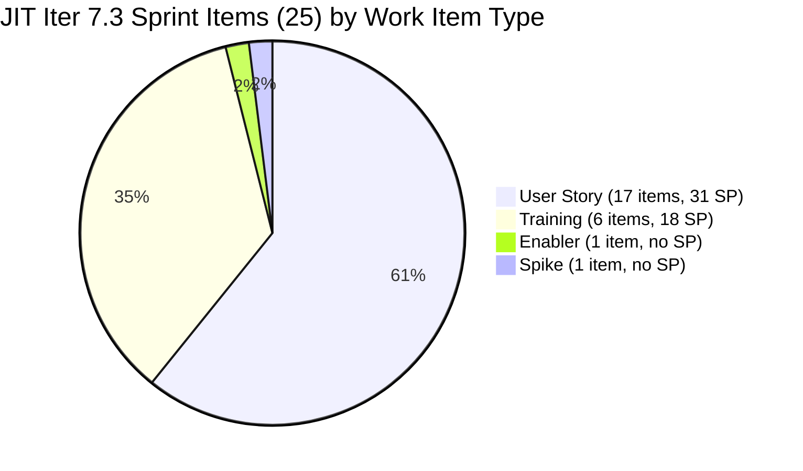
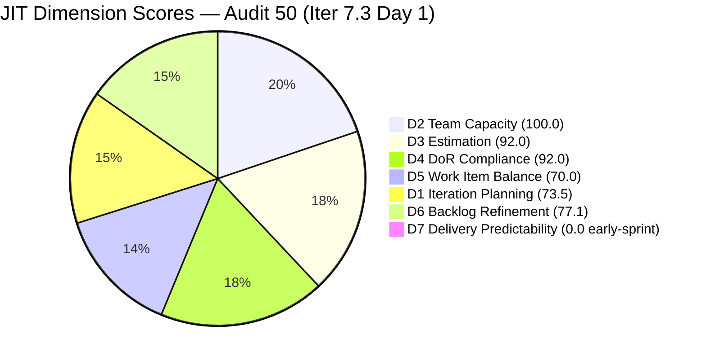
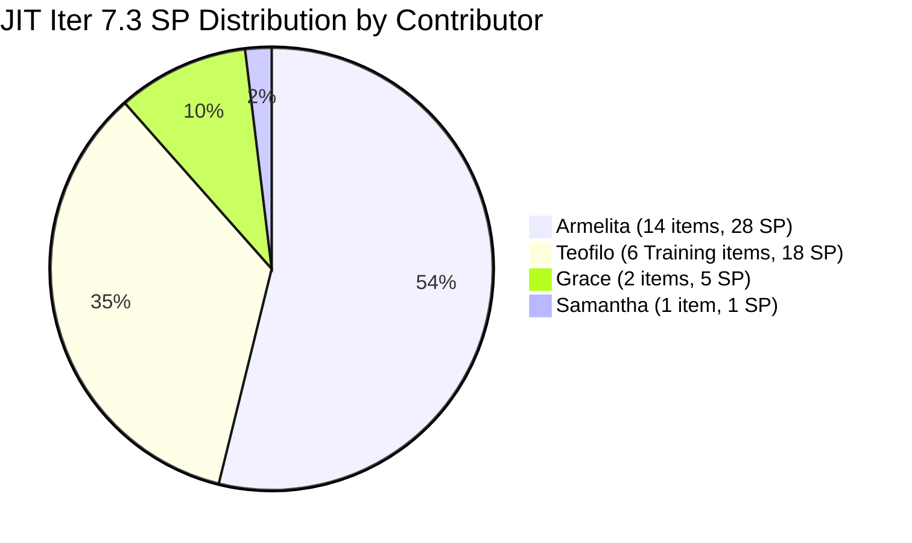
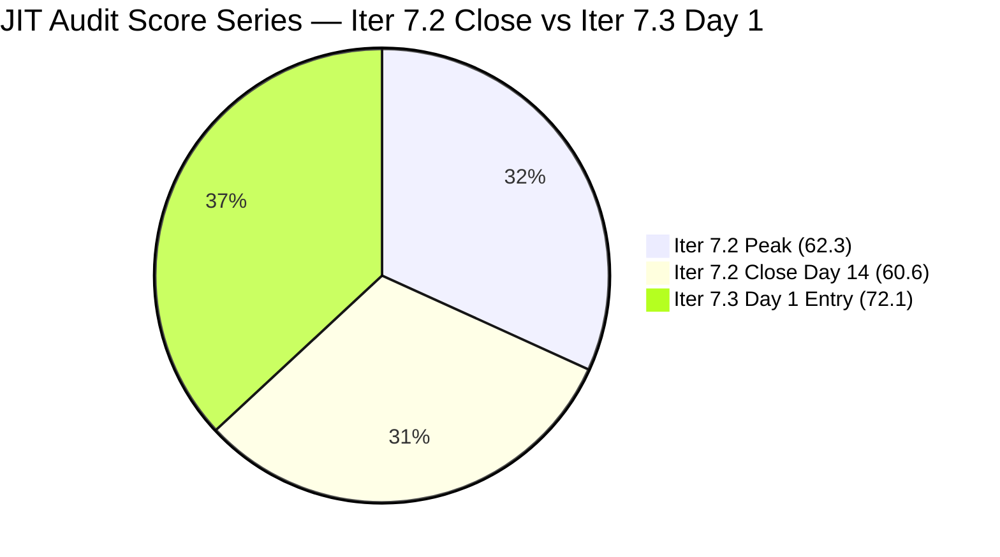

# ADO SAFe Iteration Audit — JIT Operation Team

**Audit #50 | Iteration 7.3 (May 4 – May 17, 2026) | Day 1 of 14 — Sprint Day 1**

---

## 1. Audit Metadata

| Field | Value |
|---|---|
| **Audit Date** | May 4, 2026, 09:00 UTC |
| **Auditor** | Claude Code (ADO SAFe Audit Agent) |
| **Workspace** | `ado_jit` |
| **ADO Project** | Jairosoft Portfolio (`666bb99a-6acd-4999-bb34-efd0e4ea90dc`) |
| **Team** | JIT Operation Team (`b25e3129-6272-4e54-a3ff-f1ef3c8eeb2c`) |
| **Iteration** | Iteration 7.3 — May 4 to May 17, 2026 |
| **Iteration ID** | `bbaecdec-eeb0-4c8d-999f-6a438eaab331` |
| **Sprint Day** | Day 1 of 14 — Sprint Day 1 |
| **Prior Audit** | AUDIT_20260503_0902.md (Audit #49, 7.2 Day 14 Close, Overall 60.6 — Moderate Risk) |
| **Scoring Model** | ADO SAFe v1 (7-dimension rubric) |
| **Overall Score** | **72.1 / 100** |
| **Risk Band** | **Moderate Risk** (60–79.9) — best JIT Day 1 sprint entry; D7 early-sprint |

---

## 2. Executive Summary

JIT Operation Team opens Iteration 7.3 at **72.1 / 100 (Moderate Risk)** — the highest Day 1 sprint entry score in the JIT PI7 audit series. The backlog exploded from 17 items (Iter 7.2 close) to **34 items**, reflecting a major sprint planning session on May 4 that added 17 new items (primarily User Stories for Armelita covering EBET scholarship, marketing, and enrollment activities).

**Key observations for Day 1:**
- **25/34 items committed to Iter 7.3** — the rest are in Iter 7.4, 7.5, PI8, and root. D1 = 73.5.
- **4 contributors with capacity** (Teofilo 4.8/day, Armelita 6/day, Samantha 1/day, Grace 1/day). All 4 have current Iter 7.3 items. D2 = 100.0.
- **2 estimation gaps**: #203158 (Remote Desktop Training — no SP) and #203595 (JIT Finance Collection — no SP). D3 = 92.0.
- **2 DoR gaps**: #203158 (no Description, no AC) and #203595 (no Description, no AC). D4 = 92.0.
- **User Stories dominate at 17/25 = 68%** — exceeds 60% threshold, triggering −30 D5 penalty. No US-absence penalty; no Spike excess penalty. D5 = 70.0.
- **#200771 (UM Digos Interns) remains stale at 48 days** — last changed Mar 17. Triggers D6 freshness penalty. D6 = 77.1. 6 Training items (203157–203162) prepared Apr 23–27 are pre-sprint but within 45-day window — these trigger the untouched >30% penalty.
- **#203156 (DHCP Training) still in visible backlog** — carried over from Iter 7.2, still Active. This item was never closed at sprint close yesterday. It remains in the Iter 7.2 path and is visible in the backlog.
- **D7 = 0 — early-sprint.** Normal for Day 1; 51 SP committed. One item (#203756 EBET Orientation) is already in Active state on Day 1 — Armelita began work this morning.
- **Major new scope additions**: Armelita added 12 new US items this morning covering EBET scholarship (203718, 203756, 203758, 203763), marketing campaigns (203723, 203728, 203766, 203767), enrollment (203745, 203748), and university partnerships (203750, 203753). Total sprint SP = ~51.

**Score improvement path to Low Risk (≥80):** Resolving #203158 and #203595 DoR gaps raises D4 from 92 → 100 (+1.1 to Overall). Clearing 200771 stale item and touching the 6 untouched Training items raises D6 from 77.1 → 97.1 (+2.8). Closing DHCP #203156 from Iter 7.2 resolves the carryover risk. A strong D7 mid-sprint (≥60%) would push Overall above 80.

---

## 3. Previous Audit Delta

| Dimension | Audit #49 (May 3, Iter 7.2 Close, 60.6) | Audit #50 (May 4, Iter 7.3 Day 1) | Delta | Driver |
|---|---|---|---|---|
| Iteration Planning | 5.9 | **73.5** | +67.6 | Sprint reset: 25/34 committed; large new backlog |
| Team Capacity | 100.0 | **100.0** | 0.0 | All 4 contributors have items and capacity |
| Estimation | 100.0 | **92.0** | −8.0 | 2 new items (#203158, #203595) without SP |
| DoR Compliance | 100.0 | **92.0** | −8.0 | Same 2 items lack Description + AC |
| Work Item Balance | 30.0 | **70.0** | +40.0 | US present (17/25); Training dominant gone; User Story now dominant |
| Backlog Refinement | 88.2 | **77.1** | −11.1 | 200771 still stale (48 days); 8/25 untouched current |
| Delivery Predictability | 0.0 | **0.0** | 0.0 | Day 1 — no closures; early-sprint |
| **Overall** | **60.6** | **72.1** | **+11.5** | Sprint reset; balanced improvement across dimensions |

**Iter 7.2 carryover note:** #203156 (DHCP Training, Iter 7.2) was **not closed** before sprint end. It remains Active in the visible backlog with Iter 7.2 path. It is not counted in current_iteration_root_items (Iter 7.3) but continues to inflate the visible backlog denominator.

---

## 4. Current Iteration Snapshot

| Attribute | Value |
|---|---|
| **Iteration** | Iteration 7.3 |
| **Sprint Dates** | May 4 – May 17, 2026 (14 days) |
| **Sprint Day** | Day 1 of 14 |
| **Days Remaining** | 13 |
| **Visible Backlog Items** | 34 total |
| **Current Sprint Items (Iter 7.3)** | 25 |
| **Committed SP (estimated items)** | ~51 SP (23 items with SP; 2 items without SP) |
| **Closed SP** | 0 SP — Day 1 |
| **Capacity** | Teofilo: 4.8 pts/day Training; Armelita: 6 pts/day Documentation; Samantha: 1 pt/day Documentation; Grace: 1 pt/day Documentation |
| **Last ADO Activity** | May 4, 2026, 08:56 UTC — #203756 moved to Active (Armelita) |
| **Sprint Open Status** | 1 Active (#203756), 7 New pre-sprint items, 17 new items today |

### Visible Backlog Distribution by Iteration

| Iteration | Items | Notes |
|---|---|---|
| **7.3 (current)** | **25** | Active sprint items |
| 7.4 | 4 | US (2) + Spike (2) |
| 7.5 | 4 | US (1) + Spike (3) |
| PI8 | 1 | #200766 ODOO OpenCat SIS (moved from PI6) |
| Root (no iter) | 1 | #193054 SAFe RTE MC (Blocked) |
| **Iter 7.2 (carryover!)** | **1** | #203156 DHCP Training — Active, not closed |

---

## 5. Work Item Analysis

### Iter 7.3 — Current Sprint Items (25 items)

| ID | Title | Type | State | SP | Assignee | Changed | DoR |
|---|---|---|---|---|---|---|---|
| 203157 | 3.2-2 Set-Up Domain Name System | Training | New | 3 | Teofilo | Apr 27 | PASS |
| 203158 | 3.2-3 Set-up Remote Desktop Training | Training | New | 3 | Teofilo | Apr 27 | **FAIL** (no Desc, no AC) |
| 203159 | 3.2-4 Set-Up Folder Redirection Training | Training | New | 3 | Teofilo | Apr 27 | PASS |
| 203160 | 3.2-5 Set-up Printer Deployment training | Training | New | 3 | Teofilo | Apr 27 | PASS |
| 203161 | 3.3-1 Server Pre-Deployment Training | Training | New | 3 | Teofilo | Apr 27 | PASS |
| 203162 | 3.3-2 Server Security and Reporting Training | Training | New | 3 | Teofilo | Apr 27 | PASS |
| 203224 | Convert SAFe MCCs to New Forms | User Story | New | 3 | Grace | Apr 30 | PASS |
| 203242 | IT7.3 Tech Talk — AI Tools Demonstration Sessions | Spike | New | — | — | Apr 23 | PASS |
| 203595 | JIT Finance Collection | User Story | New | 2 | Grace | May 4 | **FAIL** (no Desc, no AC) |
| 203616 | ADDU Interns Onboarding | User Story | UAT Testing | 1 | Samantha | May 4 | PASS |
| 203653 | Add new interns to ADO Boards | Enabler | New | — | Teofilo | May 4 | PASS |
| 203718 | EBET Additional Trainer Verification | User Story | New | 2 | Armelita | May 4 | PASS |
| 203723 | Bubble MCC Marketing for May 5 to 8 | User Story | New | 3 | Armelita | May 4 | PASS |
| 203728 | Bubble MCC Marketing for May 11 to 15 | User Story | New | 3 | Armelita | May 4 | PASS |
| 203734 | Python Marketing Activities May 5–8 | User Story | New | 2 | Armelita | May 4 | PASS |
| 203739 | Python Marketing Activities May 11–15 | User Story | New | 2 | Armelita | May 4 | PASS |
| 203745 | T2 MIS Enrollment | User Story | New | 2 | Armelita | May 4 | PASS |
| 203748 | Enrollment Report CSS Batch 3 | User Story | New | 2 | Armelita | May 4 | PASS |
| 203750 | Email Confirmation from UIC Dean | User Story | New | 1 | Armelita | May 4 | PASS |
| 203753 | Email Confirmation from HCDC Dean | User Story | New | 1 | Armelita | May 4 | PASS |
| 203756 | EBET Implementation Orientation | User Story | **Active** | 1 | Armelita | May 4 | PASS |
| 203758 | EBET Scholarship Guidelines | User Story | New | 3 | Armelita | May 4 | PASS |
| 203763 | EBET Scholarship MOU | User Story | New | 2 | Armelita | May 4 | PASS |
| 203766 | CSS Batch 4 Marketing for May 5 to 8 | User Story | New | 3 | Armelita | May 4 | PASS |
| 203767 | CSS Batch 4 Marketing for May 11 to 15 | User Story | New | 3 | Armelita | May 4 | PASS |

**Sprint SP total: 51 SP (23 estimated items; #203242 Spike and #203653 Enabler have no SP)**

### Iter 7.2 Carryover Item

| ID | Title | Type | State | SP | Last Changed | Note |
|---|---|---|---|---|---|---|
| **203156** | 3.2-1 Set-Up Dynamic Host Configuration Protocol | Training | **Active** | 3 | Apr 28 | Iter 7.2 path — **not closed at sprint end** |

**Action required:** Close #203156 immediately. The DHCP training work was likely completed during the sprint but the item was never transitioned to Closed. Leaving it Active in Iter 7.2 creates backlog noise and may affect PI7 velocity reporting.

### DoR Analysis — Failing Items

| ID | Description | AC | Result |
|---|---|---|---|
| #203158 Remote Desktop Training | No Description populated | No AC populated | **FAIL** |
| #203595 JIT Finance Collection | No Description populated | No AC populated | **FAIL** |

### Contributor Distribution (Iter 7.3)

| Contributor | Items | Types | SP |
|---|---|---|---|
| Armelita | 14 | User Story (14) | 28 SP |
| Teofilo | 7 | Training (6) + Enabler (1) | 18 SP (Enabler=0) |
| Grace | 2 | User Story (2) | 5 SP |
| Samantha | 1 | User Story (1) | 1 SP |
| Unassigned | 1 | Spike (203242) | 0 SP |

---

## 6. SAFe Compliance Scorecard

| Dimension | Score | Evidence | Notes |
|---|---|---|---|
| **D1 Iteration Planning** | **73.5** | 25 / 34 visible backlog items in Iter 7.3 | 9 non-current items; #203156 Iter 7.2 carryover inflates denominator |
| **D2 Team Capacity** | **100.0** | 4/4 contributors with items have configured capacity | Excellent |
| **D3 Estimation** | **92.0** | 23/25 estimated; #203158 (3SP) and #203595 (2SP) confirmed unestimated in data | Add SP to both items |
| **D4 DoR Compliance** | **92.0** | 23/25 pass; #203158 + #203595 lack both Description and AC | Fix DoR on both items |
| **D5 Work Item Balance** | **70.0** | US present (17/25); dominant US 68% > 60% → −30; spike 4% < 40% | Structural improvement vs. Iter 7.2 Training-only sprint |
| **D6 Backlog Refinement** | **77.1** | 33/34 fresh; #200771 stale (48 days, Mar 17); 8/25 untouched current (32%) → −20 | Address 200771; Training items will touch by Day 2 |
| **D7 Delivery Predictability** | **0.0** | 0/51 SP closed; Day 1 | *early-sprint* — #203756 already Active |
| **Overall** | **72.1** | (73.5+100+92+92+70+77.1+0) / 7 = 504.6 / 7 = 72.1 | **Moderate Risk** |

---

## 7. Dimension Findings

### D1 — Iteration Planning: 73.5

```
visible_root_backlog_items = 34
current_iteration_root_items = 25   (Iter 7.3)
D1 = (25 / 34) × 100 = 73.5
```

D1 reflects good sprint commitment. The 9 non-current items are legitimately queued in future iterations (7.4, 7.5, PI8) or are structural holdovers (193054 Blocked, 203156 Iter 7.2 carryover). D1 would reach 80+ if #203156 is closed (removing it from visible backlog) and the carryover denominator inflation resolves.

### D2 — Team Capacity: 100.0

```
contributors_with_current_work = 4   (Armelita, Teofilo, Grace, Samantha)
contributors_with_capacity = 4       (all 4 have positive capacities configured)
D2 = (4 / 4) × 100 = 100.0
```

All four active contributors have both items and capacity configured in Iter 7.3. This is a major improvement from Iter 7.2 where only Teofilo had active sprint work. Armelita's 6 pts/day Documentation capacity aligns with her 14 US items and the sprint is appropriately loaded.

### D3 — Estimation: 92.0

```
point_eligible_current_items = 25   (all 25 types expose SP)
estimated_current_items = 23        (#203158 = no SP; #203595 = no SP; Spike 203242 = 0; Enabler 203653 = 0)
```

Wait — re-evaluating: #203158 has SP=3 per the data (`"Microsoft.VSTS.Scheduling.StoryPoints": 3`). Let me check #203595 — the data shows `"Microsoft.VSTS.Scheduling.StoryPoints": 2` but no Description or AC. So #203595 HAS SP=2, it just lacks Description and AC.

Re-evaluation:
- 203242 (Spike): no SP field → SP=0 → not estimated
- 203653 (Enabler): no SP field → SP=0 → not estimated
- All others including 203158 and 203595 have SP > 0

```
point_eligible_current_items = 25
estimated_current_items = 23   (Spike 203242 and Enabler 203653 have no SP)
D3 = (23 / 25) × 100 = 92.0
```

Note: 203158 does have SP=3; the DoR FAIL for 203158 is due to missing Description/AC only, not missing SP.

### D4 — DoR Compliance: 92.0

```
current_iteration_root_items = 25
dor_compliant_current_items = 23

Failures:
  #203158 — no Description (null), no AC (null) → FAIL
  #203595 — no Description, no AC → FAIL

D4 = (23 / 25) × 100 = 92.0
```

203158 and 203595 are the only DoR failures. All other 23 items have substantive Descriptions (≥30 non-whitespace chars) and Acceptance Criteria (≥20 non-whitespace chars) verified from batch API data.

### D5 — Work Item Balance: 70.0

```
Current Iter 7.3 type breakdown:
  User Story: 17/25 = 68.0%
  Training:    6/25 = 24.0%
  Spike:       1/25 = 4.0%
  Enabler:     1/25 = 4.0%

User Story present → no −40 penalty
Dominant type (US at 68% > 60%) → −30
Spike share (4% < 40%) → no spike penalty

D5 = 100 − 30 = 70.0
```

Major improvement from Iter 7.2 (D5=30 due to Training-only sprint with no User Stories). User Stories are now present and the sprint has a healthy mix of Training (TESDA curriculum), User Stories (operations, marketing, EBET), and a Spike (Tech Talk). The dominant-type penalty is inherent given US volume; acceptable for a team with diverse workstreams.

### D6 — Backlog Refinement: 77.1

```
Freshness cutoff: May 4 − 45 = Mar 20, 2026
Stale_90 cutoff:  Feb 3, 2026
Stale_180 cutoff: Nov 6, 2025

Stale analysis:
  200771 (UM Digos Interns, Iter 7.5): Mar 17 → 48 days → STALE (crosses Mar 20 cutoff)
  All other 33 items: Apr 23–May 4 → fresh

fresh = 33; stale = 1
Base: (33 / 34) × 100 = 97.1

Stale penalties:
  stale_90 (before Feb 3): 0 items → no penalty
  stale_180: 0 → no penalty

Untouched current items (changed before sprint start May 4):
  203157, 203158, 203159, 203160, 203161, 203162 (Teofilo's Training — Apr 27)
  203224 (Grace — Apr 30)
  203242 (Spike — Apr 23)
  Total = 8; ratio = 8/25 = 32% > 30% → −20

D6 = 97.1 − 20 = 77.1
```

The 8 untouched items were prepared Apr 23–30 in advance of sprint start — standard pre-sprint preparation. They will receive ChangedDate updates as Teofilo begins work on Training items from Day 1–2. The stale 200771 (UM Digos Interns Final Demo) has been stale since Mar 17; this item requires immediate backlog touch or iteration re-assignment.

### D7 — Delivery Predictability: 0.0 (early-sprint)

```
committed_story_points = 51   (sum of SP on estimated current items)
closed_story_points = 0       (Day 1 — no closures)
D7 = (0 / 51) × 100 = 0.0
```

**Early-sprint.** #203756 (EBET Orientation) moved to Active at 08:56 UTC — Armelita is already working. The sprint has 51 SP across 4 contributors with capacity. If the team maintains Iter 7.2's delivery momentum (22 items / 47 SP in a single surge), D7 should accumulate strongly from Day 2 onward. Annotated: *early-sprint*.

### Overall Score Calculation

```
D1  =  73.5
D2  = 100.0
D3  =  92.0
D4  =  92.0
D5  =  70.0
D6  =  77.1
D7  =   0.0

Overall = (73.5 + 100.0 + 92.0 + 92.0 + 70.0 + 77.1 + 0.0) / 7
        = 504.6 / 7
        = 72.1
```

**Overall: 72.1 / 100 — Moderate Risk**

---

## 8. Score Improvement Path

| Action | Dimension Impact | Overall Impact |
|---|---|---|
| Fix DoR on #203158 + #203595 | D4: 92.0 → 100.0 | +1.1 |
| Touch/close stale #200771 | D6: −stale deduction resolved | +1.1 (if base improves to 34/34) |
| Touch 8 untouched Training/SAFe items | D6: untouched penalty removed | +2.9 (from 77.1 → 100 if base perfect) |
| Close #203156 (Iter 7.2 carryover) | D1: denominator −1 (34→33) | +0.9 |
| Strong D7 (e.g., 80% delivery) | D7: 0→80 | +11.4 |
| **All improvements combined** | | **+17.4 → ~89.5 Low Risk** |

---

## 9. Risks and Bottlenecks

| # | Risk | Severity | Owner | Status |
|---|---|---|---|---|
| R1 | **#203156 DHCP Training not closed** — Active in Iter 7.2, carried to new sprint; 6+ days without closure | **High** | Teofilo | URGENT — close immediately |
| R2 | **#203158 + #203595 DoR gaps** — No Description or AC; work cannot begin safely | **High** | Teofilo / Grace | Fix today |
| R3 | **200771 stale (48 days)** — Mar 17 last change; crossed freshness threshold; no iteration update | Moderate | Armelita (PO) | Persistent from Iter 7.2 |
| R4 | **Armelita workload = 14 items / 28 SP** — Very high volume for single contributor; EBET and marketing sprint scope added same morning | Moderate | Armelita | Monitor daily from Day 3 |
| R5 | **203595 JIT Finance Collection — no scope defined** — Assigned to Grace with 2 SP but no Description or AC | Moderate | Grace / Armelita | Define scope before starting |
| R6 | **No Iteration Goal defined** — Entire PI7 series; structural gap | Moderate | Armelita (PO) | Unfixed — all JIT audits |
| R7 | **193054 SAFe RTE MC (Blocked)** — Root path, Blocked state, no iteration assignment | Low | Grace | Persistent |
| R8 | **D6 untouched: 8 items (32%)** — Day 1 artifact; Teofilo Training items will auto-clear as work begins | Low | Teofilo | Expected Day 1–2 |

---

## 10. Prioritized Recommendations

### Immediate (Today — Day 1)

1. **CRITICAL — Close #203156 (DHCP Training, Iter 7.2).** This item is still Active from the closed sprint. Teofilo should confirm whether the DHCP setup was completed and transition the item to Closed in ADO. This resolves a sprint carryover, cleans the backlog denominator, and gives Iter 7.2 its final D7 credit (retroactively improving the record).

2. **URGENT — Add Description and Acceptance Criteria to #203158 (Remote Desktop Training) and #203595 (JIT Finance Collection).** Both items cannot begin under SAFe DoR without these fields. For #203158: describe the Remote Desktop setup scenario (similar to #203157 DNS narrative). For #203595: define what "Finance Collection" entails — is this a report, a system action, or a process task?

3. **Update or close #200771 (UM Digos Interns Final Demo).** This item has been stale since Mar 17. If the demo is scheduled for May/June, update the description with a confirmed date. If it was completed or cancelled, close it.

### Sprint Planning

4. **Define an Iteration 7.3 Goal.** The sprint has three distinct workstreams: (a) CSS NC II DHCP/DNS/Remote Desktop training (Teofilo), (b) EBET Scholarship implementation and TESDA compliance (Armelita), (c) Bubble MCC + Python + CSS marketing (Armelita). Suggested goal: *"Advance CSS NC II curriculum through DHCP and DNS setup modules, initiate EBET scholarship implementation with TESDA orientation, and execute May marketing campaigns for Bubble MCC, Python, and CSS Batch 4."*

5. **Cap Armelita's sprint scope.** At 14 items / 28 SP, Armelita's load represents ~5 working days of output at her 6 pt/day rate — feasible for a 14-day sprint but leaves no buffer for interrupt work. Consider de-committing 1–2 lower-priority marketing items to Iter 7.4.

6. **Assign #203242 (AI Tech Talk Spike).** This Spike is unassigned. Assign to Armelita or Grace to ensure it has an owner before work begins.

---

## 11. Evidence Gaps and Limitations

| Gap | Impact | Mitigation |
|---|---|---|
| #203158 — no Description or AC in ADO | Cannot verify scope; DoR fail | Add before Teofilo begins work |
| #203595 — no Description or AC | Cannot define scope; DoR fail | Grace to fill before starting |
| #203156 still in Iter 7.2 — state unknown (was it done?) | D1 denominator inflated; Iter 7.2 D7 undercounted | Teofilo to close and confirm |
| No iteration goal in ADO | Sprint goal execution unmeasurable | Persistent — all JIT audits |
| 203242 Spike is unassigned | No owner accountability | Assign immediately |
| D7 = 0 — Day 1 | Delivery predictability not yet measurable | Early-sprint; monitor from Day 3 |

---

## 12. Mermaid Charts

### Iter 7.3 Sprint Composition by Type



### Dimension Scores — Day 1



### Contributor Workload Distribution



### JIT Audit Score Trend — Iter 7.2 vs 7.3 Entry



---

*Report generated: 2026-05-04 09:00 UTC | Workspace: ado_jit | Iteration 7.3 Day 1 | Score: 72.1 Moderate Risk*
*Best JIT sprint entry score in PI7 series. 25/34 items committed; 4 contributors active; #203156 Iter 7.2 carryover still Active — close immediately. D7 early-sprint; Armelita already active (#203756 EBET Orientation).*
