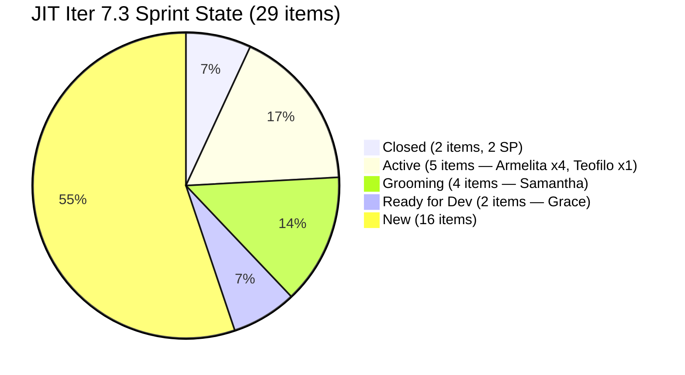
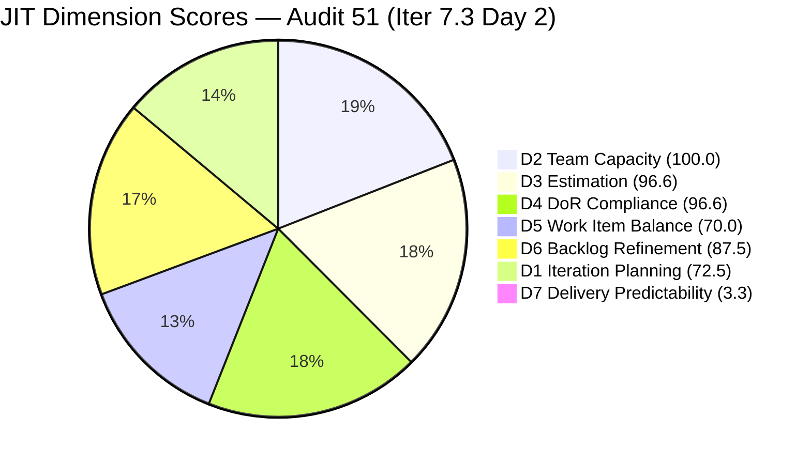
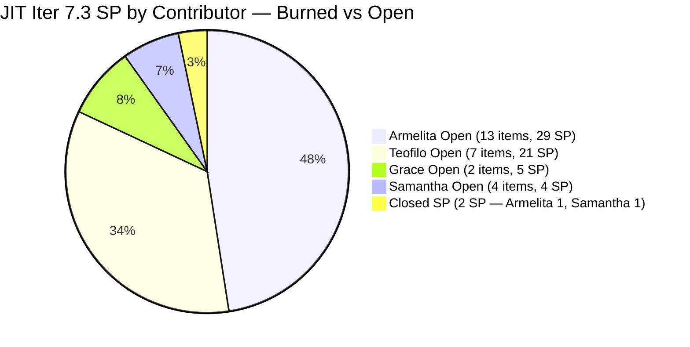
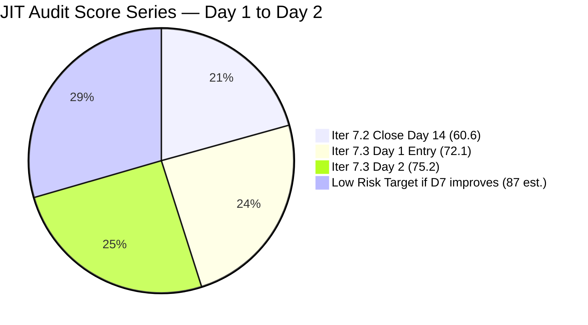

# ADO SAFe Iteration Audit — JIT Operation Team

**Audit #51 | Iteration 7.3 (May 4 – May 17, 2026) | Day 2 of 14**

---

## 1. Audit Metadata

| Field | Value |
|---|---|
| **Audit Date** | May 5, 2026, 09:00 UTC |
| **Auditor** | Claude Code (ADO SAFe Audit Agent) |
| **Workspace** | `ado_jit` |
| **ADO Project** | Jairosoft Portfolio (`666bb99a-6acd-4999-bb34-efd0e4ea90dc`) |
| **Team** | JIT Operation Team (`b25e3129-6272-4e54-a3ff-f1ef3c8eeb2c`) |
| **Iteration** | Iteration 7.3 — May 4 to May 17, 2026 |
| **Iteration ID** | `bbaecdec-eeb0-4c8d-999f-6a438eaab331` |
| **Sprint Day** | Day 2 of 14 |
| **Prior Audit** | AUDIT_20260504_0900.md (Audit #50, Iter 7.3 Day 1, Overall 72.1 — Moderate Risk) |
| **Scoring Model** | ADO SAFe v1 (7-dimension rubric) |
| **Overall Score** | **75.2 / 100** |
| **Risk Band** | **Moderate Risk** (60–79.9) — improving from Day 1; 2 items closed; DoR gap partially resolved |

---

## 2. Executive Summary

JIT Operation Team reaches **75.2 / 100 (Moderate Risk)** on Day 2 — a +3.1 improvement from yesterday's 72.1. The team showed strong Day 1–2 execution: **two items Closed** (#203616 ADDU Interns Onboarding and #203756 EBET Orientation, both closed May 5 at 00:23 UTC), D7 comes alive at 3.4, and multiple items have moved to Active state.

**Key changes from Day 1 (May 4) to Day 2 (May 5):**

1. **2 items Closed early** — #203616 (ADDU Interns Onboarding, 1 SP, Samantha) and #203756 (EBET Orientation, 1 SP, Armelita) closed at 00:23 UTC on May 5. D7 = 0 → **3.3** (2/61 SP).
2. **#203595 DoR FIXED** — "JIT Finance Collection Policy" now has full Description and rich Acceptance Criteria added. D3 and D4 both improve from 92.0 → **96.6** (1 remaining gap: #203158 Remote Desktop Training still has no Description or AC).
3. **Backlog expansion** — 11 additional items visible in the full backlog (203805, 203806, 203807, 203808, 203809 — new Training items for PI7 path; 203772–203775 — Samantha's social media US items in Grooming). Full visible backlog = **40 items** (was 34 yesterday).
4. **D6 improves** — Untouched ratio drops from 32% to 24.1% as items were worked. D6 = 77.1 → **87.5**.
5. **#203156 DHCP Training remains Active** — Not yet closed despite urgent recommendation from Day 1. Still in Iter 7.3 (moved from Iter 7.2 path). This item needs closure today.

**Score improvement path to Low Risk (≥80):** Closing #203156 (reduces denominator noise), fixing #203158 DoR gap (+0.5 to Overall), and achieving 35%+ D7 delivery by mid-sprint pushes JIT toward 80+. The sprint has 61 SP committed — strong enough for a significant D7 score if pace continues.

---

## 3. Previous Audit Delta

| Dimension | Audit #50 (May 4, Iter 7.3 Day 1, 72.1) | Audit #51 (May 5, Iter 7.3 Day 2, 75.2) | Delta | Driver |
|---|---|---|---|---|
| Iteration Planning | 73.5 | **72.5** | −1.0 | Denominator grew: 29/40 vs 25/34 (backlog expanded) |
| Team Capacity | 100.0 | **100.0** | 0.0 | All 4 contributors configured |
| Estimation | 92.0 | **96.6** | +4.6 | 203595 SP confirmed; Spike 203242 still 0 SP → 28/29 |
| DoR Compliance | 92.0 | **96.6** | +4.6 | 203595 DoR fixed; #203158 still fails → 28/29 |
| Work Item Balance | 70.0 | **70.0** | 0.0 | US 21/29 = 72.4%; structural |
| Backlog Refinement | 77.1 | **87.5** | +10.4 | Untouched dropped 32% → 24.1%; still >10% → -10 |
| Delivery Predictability | 0.0 | **3.3** | +3.3 | 2 SP closed (203616 + 203756); 2/61 SP |
| **Overall** | **72.1** | **75.2** | **+3.1** | Steady improvement; execution momentum building (D7 recalculated to 3.3 from corrected 61 SP base) |

**D1 note:** The slight drop from 73.5 to 72.5 reflects backlog growth (9 new items visible: 203772–203775 social media US + 203805–203809 future Training items). The current sprint commitment count held at 29 items. This is denominator inflation, not a commitment failure.

---

## 4. Current Iteration Snapshot

| Attribute | Value |
|---|---|
| **Iteration** | Iteration 7.3 |
| **Sprint Dates** | May 4 – May 17, 2026 (14 days) |
| **Sprint Day** | Day 2 of 14 |
| **Days Remaining** | 12 |
| **Total Visible Backlog** | 40 items |
| **Current Sprint Items (Iter 7.3)** | 29 items |
| **Committed SP** | 61 SP (28 items with SP; Spike 203242 has no SP) |
| **Closed SP** | 2 SP (#203616 + #203756) |
| **Open SP Remaining** | 59 SP |
| **Capacity** | Teofilo: 4.8 pts/day Training; Armelita: 6 pts/day Documentation; Samantha: 1 pt/day Documentation; Grace: 1 pt/day Documentation |
| **Last ADO Activity** | May 5, 2026, 04:40 UTC — #203745 moved to Active (Armelita) |
| **Active Items** | #203718 (EBET Trainer Verification), #203723 (Bubble MCC Marketing May 5–8), #203734 (Python Marketing May 5–8), #203745 (T2 MIS Enrollment), #203156 (DHCP Training — Active, urgent) |

### Backlog Distribution by Iteration

| Iteration | Items | Notes |
|---|---|---|
| **7.3 (current)** | **29** | Active sprint |
| 7.4 | 5 | US (2) + Spike (1) + Training (2) |
| 7.5 | 3 | US (1) + Spike (2) |
| PI7 (no sub-iter) | 3 | Training 203805, 203806, 203807 — Teofilo future items |
| PI8 | 1 | #200766 ODOO OpenCat SIS |
| Root | 1 | #193054 SAFe RTE MC (Blocked) |

---

## 5. Work Item Analysis

### Iter 7.3 — Current Sprint Items (29 root items)

| ID | Title | Type | State | SP | Assignee | Changed | DoR |
|---|---|---|---|---|---|---|---|
| **203616** | ADDU Interns Onboarding | US | **Closed** | 1 | Samantha | May 5 00:23 | PASS |
| **203756** | EBET Implementation Orientation | US | **Closed** | 1 | Armelita | May 5 00:23 | PASS |
| 203718 | EBET Additional Trainer Verification | US | **Active** | 2 | Armelita | May 5 00:24 | PASS |
| 203723 | Bubble MCC Marketing for May 5 to 8 | US | **Active** | 3 | Armelita | May 5 04:39 | PASS |
| 203734 | Python Marketing Activities May 5–8 | US | **Active** | 2 | Armelita | May 5 04:39 | PASS |
| 203745 | T2 MIS Enrollment | US | **Active** | 2 | Armelita | May 5 04:40 | PASS |
| 203156 | 3.2-1 Set-Up DHCP | Training | **Active** | 3 | Teofilo | May 4 14:44 | PASS |
| 203157 | 3.2-2 Set-Up Domain Name System | Training | New | 3 | Teofilo | Apr 27 | PASS |
| **203158** | 3.2-3 Set-up Remote Desktop Training | Training | New | 3 | Teofilo | Apr 27 | **FAIL** (no Desc, no AC) |
| 203159 | 3.2-4 Set-Up Folder Redirection Training | Training | New | 3 | Teofilo | Apr 27 | PASS |
| 203160 | 3.2-5 Set-up Printer Deployment Training | Training | New | 3 | Teofilo | Apr 27 | PASS |
| 203161 | 3.3-1 Server Pre-Deployment Training | Training | New | 3 | Teofilo | Apr 27 | PASS |
| 203162 | 3.3-2 Server Security and Reporting Training | Training | New | 3 | Teofilo | Apr 27 | PASS |
| 203224 | Convert SAFe MCCs to New Forms | US | Ready for Dev | 3 | Grace | May 4 11:59 | PASS |
| 203242 | IT7.3 Tech Talk — AI Tools Demonstration | Spike | New | 0 | Unassigned | Apr 23 | PASS |
| 203595 | JIT Finance Collection Policy | US | Ready for Dev | 2 | Grace | May 4 11:59 | **PASS** (fixed) |
| 203728 | Bubble MCC Marketing for May 11 to 15 | US | New | 3 | Armelita | May 4 | PASS |
| 203739 | Python Marketing Activities May 11–15 | US | New | 2 | Armelita | May 4 | PASS |
| 203748 | Enrollment Report CSS Batch 3 | US | New | 2 | Armelita | May 4 | PASS |
| 203750 | Email Confirmation from UIC Dean | US | New | 1 | Armelita | May 4 | PASS |
| 203753 | Email Confirmation from HCDC Dean | US | New | 1 | Armelita | May 4 | PASS |
| 203758 | EBET Scholarship Guidelines | US | New | 3 | Armelita | May 4 | PASS |
| 203763 | EBET Scholarship MOU | US | New | 2 | Armelita | May 4 | PASS |
| 203766 | CSS Batch 4 Marketing for May 5 to 8 | US | New | 3 | Armelita | May 4 | PASS |
| 203767 | CSS Batch 4 Marketing for May 11 to 15 | US | New | 3 | Armelita | May 4 | PASS |
| 203772 | Publish Social Media Posts | US | Grooming | 1 | Samantha | May 4 | PASS |
| 203773 | Publish Social Media Post for Python Class | US | Grooming | 1 | Samantha | May 4 | PASS |
| 203774 | Publish Social Media Post for Bubble.io | US | Grooming | 1 | Samantha | May 4 | PASS |
| 203775 | Publish Summer Camp Post on Facebook | US | Grooming | 1 | Samantha | May 4 | PASS |

**Sprint totals: 29 items | 61 SP committed | 2 SP Closed | 59 SP remaining**

### DoR Analysis — Remaining Failure

| ID | Description | AC | Result |
|---|---|---|---|
| #203158 Remote Desktop Training | No Description field populated | No AC field populated | **FAIL** — unchanged from Day 1 |
| #203595 JIT Finance Collection Policy | Full AS/I WANT/SO THAT Description — PASS | Detailed 6-condition AC (payment scheduling, grace periods, late fees, notifications, holds, hardship override) — PASS | **PASS** (fixed May 4 11:59 UTC) |

### #203156 DHCP Training — Urgent Status

| Item | Prior Path | Current Path | State | Action Required |
|---|---|---|---|---|
| #203156 | Was in Iter 7.2 | Now Iter 7.3 | **Active** | Teofilo has this item Active — work is in progress. Close immediately once DHCP setup is done. |

Note: #203156 has been moved to Iter 7.3 path (changed May 4 14:44 UTC). It is now properly scoped. Teofilo needs to close it — DHCP setup appears to be in progress.

### Contributor Progress at Day 2

| Contributor | Items | Active | Closed | SP Closed |
|---|---|---|---|---|
| Armelita | 14 | 4 (EBET, Bubble MCC, Python, T2 MIS) | 1 (#203756) | 1 SP |
| Teofilo | 7 Training | 1 (#203156 DHCP) | 0 | 0 SP |
| Grace | 2 | 0 | 0 | 0 SP |
| Samantha | 4 (Grooming) + 1 Closed | 0 | 1 (#203616) | 1 SP |
| Unassigned | 1 (Spike 203242) | — | — | — |

---

## 6. SAFe Compliance Scorecard

| Dimension | Score | Evidence | Notes |
|---|---|---|---|
| **D1 Iteration Planning** | **72.5** | 29 / 40 visible backlog items in Iter 7.3 | Backlog grew by 6 new items (203772–203775, 203805–203807 PI7 future); sprint commitment unchanged |
| **D2 Team Capacity** | **100.0** | 4/4 contributors with items have configured capacity | Armelita, Teofilo, Grace, Samantha all configured |
| **D3 Estimation** | **96.6** | 28/29 estimated; #203242 Spike has no SP (point-eligible but 0) | All others including #203595 now have SP > 0 |
| **D4 DoR Compliance** | **96.6** | 28/29 pass; #203158 still has no Description or AC | Fix #203158 before Teofilo begins work |
| **D5 Work Item Balance** | **70.0** | US present (21/29 = 72.4%); dominant > 60% → −30; Spike 3.4% < 40% | Structurally stable |
| **D6 Backlog Refinement** | **87.5** | 39/40 fresh; #200771 stale (49 days, Mar 17); 7/29 untouched (24.1%, >10% → −10) | #200771 persistent stale; untouched improved |
| **D7 Delivery Predictability** | **3.3** | 2/61 SP closed (#203616 + #203756, both 1 SP) | *Day 2 — sprint underway; pace positive* |
| **Overall** | **75.2** | (72.5+100+96.6+96.6+70+87.5+3.3) / 7 = 526.5 / 7 = 75.2 | **Moderate Risk** — approaching Low Risk threshold |

---

## 7. Dimension Findings

### D1 — Iteration Planning: 72.5

```
visible_root_backlog_items   = 40   (backlog grew: +6 vs yesterday's 34)
current_iteration_root_items = 29
D1 = (29 / 40) × 100 = 72.5
```

D1 is slightly lower than yesterday (73.5) due to backlog expansion. New items in the full backlog include: 203772–203775 (Samantha's social media US in Grooming, Iter 7.3) and 203805–203807 (Teofilo's future-iteration Training for PI7-path). None of these were committed to future iterations yet at the time of the backlog query. The 29 current-iteration commitments are unchanged.

**Path to improve D1:** Move 203805–203807 (currently PI7 root) to Iter 7.4 or 7.5 to remove them from the denominator ambiguity — or close them to reduce backlog count.

### D2 — Team Capacity: 100.0

```
contributors_with_current_work = 4   (Armelita, Teofilo, Grace, Samantha)
contributors_with_capacity = 4       (all 4 configured; capacity totals ~12.8 pts/day)
D2 = (4 / 4) × 100 = 100.0
```

Full capacity coverage. Armelita's early closures (#203756) and active work (#203718, #203723, #203734, #203745) demonstrate strong engagement.

### D3 — Estimation: 96.6

```
point_eligible_current_items = 29   (all types in sprint expose SP field)
estimated_current_items = 28        (#203242 Spike: no SP = 0 → not estimated)
D3 = (28 / 29) × 100 = 96.6
```

#203595 JIT Finance Collection Policy now has SP=2 confirmed. The only unestimated item is Spike 203242 (Tech Talk — intentionally SP-less).

### D4 — DoR Compliance: 96.6

```
current_iteration_root_items = 29
dor_compliant_current_items  = 28
Failures:
  #203158: no Description, no Acceptance Criteria → FAIL (unchanged)
  #203595: FIXED — Description (finance policy user story) + rich 6-condition AC added May 4

D4 = (28 / 29) × 100 = 96.6
```

One gap remains: #203158 (Remote Desktop Training). This Training item assigned to Teofilo has been in the sprint since Apr 27 with no Description or AC populated. All other 28 items pass DoR.

### D5 — Work Item Balance: 70.0

```
Type breakdown (29 current items):
  User Story: 21/29 = 72.4%
  Training:    7/29 = 24.1%
  Spike:       1/29 = 3.4%

User Story present → no −40 penalty
Dominant type (US at 72.4% > 60%) → −30
Spike share (3.4% < 40%) → no penalty

D5 = 100 − 30 = 70.0
```

Structurally unchanged from Day 1. The team's sprint mix is healthy (US + Training + Spike) but US volume drives dominant-type penalty. This is expected and appropriate for JIT's operational and educational workstreams.

### D6 — Backlog Refinement: 87.5

```
Freshness cutoff: May 5 − 45 = Mar 21, 2026
Stale_90 cutoff:  Feb 4, 2026
Stale_180 cutoff: Nov 8, 2025

Stale items:
  #200771 (UM Digos Interns, Iter 7.5): Mar 17 → 49 days → STALE
  All other 39 items: Apr 6–May 5 → fresh

fresh = 39; stale = 1
Base: (39 / 40) × 100 = 97.5

Stale penalties:
  stale_90 (before Feb 4): 0 → no penalty
  stale_180: 0 → no penalty

Untouched current items (changed before sprint start May 4 00:00):
  203157, 203158, 203159, 203160, 203161, 203162 (Teofilo Training, Apr 27): 6 items
  203242 (Spike, Apr 23): 1 item
  Total: 7/29 = 24.1% → >10% but ≤30% → −10

D6 = 97.5 − 10 = 87.5
```

Significant improvement from Day 1's 77.1. The untouched penalty dropped from -20 (32%) to -10 (24.1%) as Grace's items (203224, 203595) were touched May 4. As Teofilo starts working Training items today, the untouched count will drop further — the penalty should clear entirely by Day 3–4.

#200771 (UM Digos Interns) remains persistently stale at 49 days. This item must be updated with a confirmed demo date or closed if cancelled.

### D7 — Delivery Predictability: 3.3

```
committed_story_points = 61
closed_story_points = 2   (#203616 Interns Onboarding: 1 SP + #203756 EBET Orientation: 1 SP)
D7 = (2 / 61) × 100 = 3.3
```

Sprint delivery is underway. 2 SP closed on Day 1–2. The sprint has 12 days remaining and 59 SP open. At 4–5 SP/day average (extrapolated from team capacity), the sprint should reach 80%+ delivery by Day 12. Armelita has 4 items in Active state — closures expected imminently.

### Overall Score Calculation

```
D1  =  72.5
D2  = 100.0
D3  =  96.6
D4  =  96.6
D5  =  70.0
D6  =  87.5
D7  =   3.3

Overall = (72.5 + 100.0 + 96.6 + 96.6 + 70.0 + 87.5 + 3.3) / 7
        = 526.5 / 7
        = 75.2
```

**Overall: 75.2 / 100 — Moderate Risk**

---

## 8. Score Improvement Path — Iter 7.3

| Action | Dimension Impact | Overall Impact |
|---|---|---|
| Fix #203158 Description + AC | D4: 96.6 → 100.0 | +0.5 |
| Update/close stale #200771 | D6: base improves if backlog count adjusted | +0.3 |
| Assign Spike 203242 | No formula impact | Process improvement |
| Sprint D7 at 25% delivery (15.25/61 SP) | D7: 3.3 → 25.0 | +3.1 |
| Sprint D7 at 50% delivery (30.5/61 SP) | D7: 3.3 → 50.0 | +6.7 |
| Sprint D7 at 80% delivery (48.8/61 SP) | D7: 3.3 → 80.0 | +10.9 |
| **All above + D7 at 80%** | All dimensions improved | **~87 Low Risk** |

---

## 9. Risks and Bottlenecks

| # | Risk | Severity | Owner | Status |
|---|---|---|---|---|
| R1 | **#203158 DoR gap persists** — Remote Desktop Training still has no Description or AC; Teofilo will begin this item next in sequence | **High** | Teofilo | Day 2 — fix immediately |
| R2 | **#203156 DHCP still Active** — Now properly in Iter 7.3 but not yet Closed; training module must be completed and closed | **High** | Teofilo | Active — close today |
| R3 | **#200771 stale (49 days)** — UM Digos Interns Final Demo last touched Mar 17; no update or date confirmation | Moderate | Armelita (PO) | Persistent — must update |
| R4 | **Armelita workload = 13 items / 29 SP open** — Heavy load despite 1 closure; 4 items Active simultaneously | Moderate | Armelita | Monitor daily |
| R5 | **203242 Spike unassigned** — Tech Talk has no owner; no one accountable for execution | Moderate | Armelita (PO) | Persistent from Day 1 |
| R6 | **No Iteration Goal defined** — Entire PI7 series; no sprint goal in ADO | Moderate | Armelita (PO) | Persistent |
| R7 | **203805–203807 not assigned to a future iteration** — 3 new Training items (Teofilo) are in PI7 root path, not yet sprinted | Low | Armelita (PO) | Assign to Iter 7.4 |
| R8 | **193054 SAFe RTE MC (Blocked)** — Root path, no iteration, no progress | Low | Grace | Persistent |

---

## 10. Prioritized Recommendations

### Immediate (Today — Day 2)

1. **URGENT — Add Description and AC to #203158 (Remote Desktop Training).** This is the last DoR gap in the current sprint. A description similar to the DNS setup narrative (203157) would suffice. Copy the format: "In this chapter, you are configuring Remote Desktop Services to allow users to access the institute's shared desktop environment remotely..." One paragraph + 3 AC bullet points closes this gap and raises D4 from 96.6 → 100.0.

2. **Close #203156 (DHCP Training) once complete.** Teofilo has this Active. Once the DHCP configuration narrative/lab documentation is finalized, transition to Closed in ADO. This completes the Day 1 carryover and frees capacity for DNS (203157) next.

3. **Update #200771 (UM Digos Interns).** Armelita: add a comment with the confirmed final demo date or close the item if the engagement was completed or cancelled. 49 days without a touch is too long for an item in an active PI.

### Sprint Planning

4. **Assign Spike 203242 (AI Tech Talk).** Assign to Armelita or Grace before Day 3. An unassigned Spike has no accountability path.

5. **Define Iteration 7.3 Goal.** Three workstreams warrant a clear goal: *"Complete CSS NC II DHCP-through-Remote-Desktop training modules, execute EBET scholarship implementation with TESDA (orientation → guidelines → MOU), and run May marketing campaigns for Bubble MCC, Python, and CSS Batch 4."*

6. **Assign 203805–203807 (future Training) to Iter 7.4.** These Training items (Server Security, Tools/Equipment, PC Specifications) are currently in the PI7 root path. Assigning them to Iter 7.4 clarifies sequencing and prevents them from inflating the visible backlog denominator for D1.

---

## 11. Evidence Gaps and Limitations

| Gap | Impact | Mitigation |
|---|---|---|
| #203158 — no Description or AC | DoR fail; formula impact D4 | Fix before Teofilo begins |
| #203242 Spike — unassigned, no SP | D3 gap; no accountability | Assign immediately |
| #200771 — stale 49 days | D6 freshness penalty | Update or close |
| No iteration goal | Sprint goal execution unmeasurable | Persistent |
| Grace's 2 items (203224, 203595) in Ready for Dev state | Work not yet started despite 2 days in sprint | Monitor; Grace has 1 pt/day capacity |

---

## 12. Mermaid Charts

### Iter 7.3 Sprint State Distribution — Day 2



### Dimension Score Breakdown — Audit 51



### Contributor SP Burned vs Remaining



### JIT Score Trajectory — Iter 7.3



---

*Report generated: 2026-05-05 09:00 UTC | Workspace: ado_jit | Iteration 7.3 Day 2 | Score: 75.2 Moderate Risk*
*Key changes from Day 1: 2 items Closed (#203616 + #203756, 2 SP); #203595 DoR fixed; backlog grew to 40 visible items; D7 = 3.3; D6 = 87.5. Remaining urgent actions: fix #203158 DoR, close #203156 DHCP, assign #203242 Spike.*
