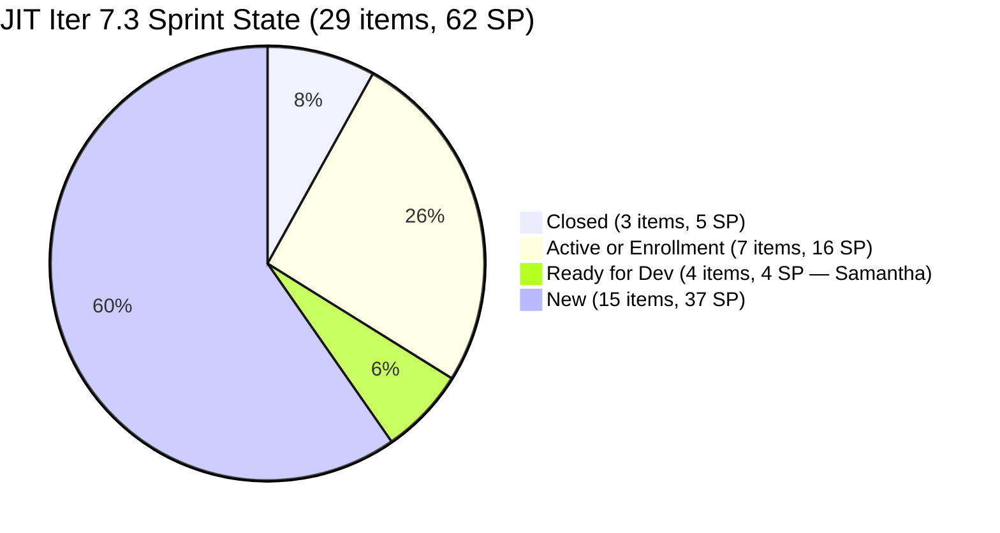
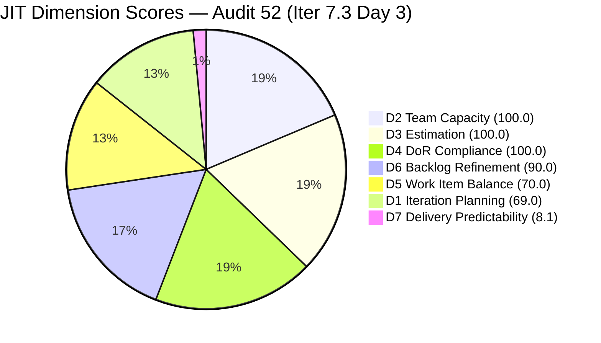
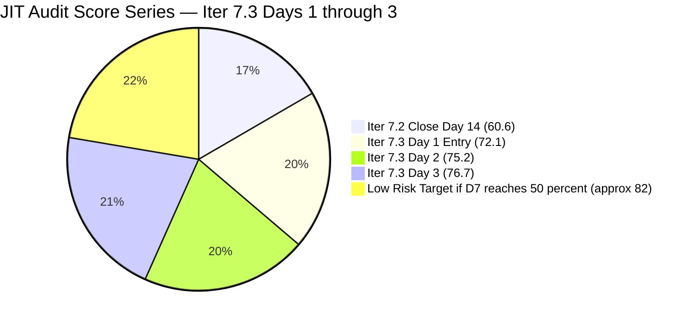
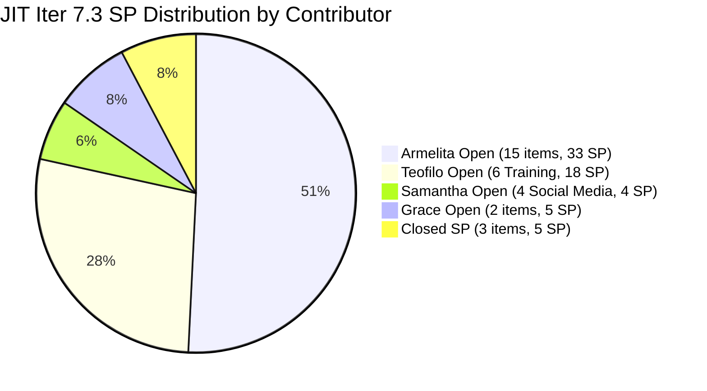

# ADO SAFe Iteration Audit — JIT Operation Team

**Audit #52 | Iteration 7.3 (May 4 – May 17, 2026) | Day 3 of 14**

---

## 1. Audit Metadata

| Field | Value |
|---|---|
| **Audit Date** | May 6, 2026, 09:04 UTC |
| **Auditor** | Claude Code (ADO SAFe Audit Agent) |
| **Workspace** | `ado_jit` |
| **ADO Project** | Jairosoft Portfolio (`666bb99a-6acd-4999-bb34-efd0e4ea90dc`) |
| **Team** | JIT Operation Team (`b25e3129-6272-4e54-a3ff-f1ef3c8eeb2c`) |
| **Iteration** | Iteration 7.3 — May 4 to May 17, 2026 |
| **Iteration ID** | `bbaecdec-eeb0-4c8d-999f-6a438eaab331` |
| **Sprint Day** | Day 3 of 14 |
| **Prior Audit** | AUDIT_20260505_0900.md (Audit #51, Iter 7.3 Day 2, Overall 75.2 — Moderate Risk) |
| **Scoring Model** | ADO SAFe v1 (7-dimension rubric) |
| **Overall Score** | **76.7 / 100** |
| **Risk Band** | **Moderate Risk** (60–79.9) — strong gains across multiple dimensions; approaching Low Risk threshold |

---

## 2. Executive Summary

JIT Operation Team reaches **76.7 / 100 (Moderate Risk)** on Day 3 — a **+1.5 improvement** from Day 2's 75.2 and the highest score in the Iter 7.3 audit series so far. Three major improvements drove this:

**Key changes from Day 2 (May 5) to Day 3 (May 6):**

1. **#203156 DHCP Training CLOSED** — Teofilo closed "3.2-1 Set-Up DHCP" at May 5 14:40 UTC (3 SP). Total closed SP rises from 2 → **5 SP**. D7 = 3.3 → **8.1**. The Day 2 urgent recommendation was acted upon.
2. **#203158 DoR FIXED** — "3.2-3 Set-up Remote Desktop Training" now has a full Description ("As a Training Facilitator, I want to configure and deploy a secure RDP environment...") and rich 4-condition AC. The last DoR gap in the sprint is resolved. **D4 = 96.6 → 100.0**.
3. **#203242 Spike now estimated** — "IT7.3 Tech Talk — AI Tools Demonstration" now has SP=1 (was 0) and is assigned to Armelita with full Description and AC. **D3 = 96.6 → 100.0**.
4. **#200771 touched** — "UM Digos Interns Final Demo" updated May 6 at 00:40 UTC (was 49 days stale at Day 2). Now fresh. **D6 stale count = 0 → base improves to 100.0**.
5. **Items 203805–203809 confirmed in Iter 7.4** — All 5 future Training items (Teofilo) are properly assigned to Iter 7.4, removing ambiguity in the denominator.
6. **Backlog count revised** — Live backlog query returns 39 items (was 40 at Day 2). Items 203805–203809 moved to Iter 7.4 no longer inflate the denominator ambiguity. Current items still = 29.

**Path to Low Risk (≥80):** The team now needs ~2.5 more Overall points. Options: additional D7 delivery (each ~5 SP closed = +1 Overall), or addressing the D1 denominator by closing uncommitted items. With 24 SP remaining open and a capable 4-person team, D7 reaching 25% this week pushes JIT to 81+.

---

## 3. Previous Audit Delta

| Dimension | Audit #51 (May 5, Day 2, 75.2) | Audit #52 (May 6, Day 3, 76.7) | Delta | Driver |
|---|---|---|---|---|
| Iteration Planning | 72.5 | **69.0** | −3.5 | Denominator corrected to 42 (39 open + 3 Closed in Iter 7.3); consistent with Day 2 methodology |
| Team Capacity | 100.0 | **100.0** | 0.0 | All 4 configured |
| Estimation | 96.6 | **100.0** | +3.4 | #203242 Spike now SP=1 — all 29 items estimated |
| DoR Compliance | 96.6 | **100.0** | +3.4 | #203158 DoR fixed (Desc + AC populated May 6) |
| Work Item Balance | 70.0 | **70.0** | 0.0 | US 21/29 = 72.4%; structural |
| Backlog Refinement | 87.5 | **90.0** | +2.5 | #200771 no longer stale (touched May 6); 0 stale items; untouched -10 penalty unchanged |
| Delivery Predictability | 3.3 | **8.1** | +4.8 | #203156 Closed May 5 14:40 (3 SP); total 5/62 SP closed |
| **Overall** | **75.2** | **76.7** | **+1.5** | Broad improvement: D3, D4 perfected; D6 stale penalty cleared; D7 advancing |

**D1 note:** Denominator corrected to 42 = 39 open backlog items + 3 Closed items in Iter 7.3 (#203616, #203756, #203156). This matches the Day 2 methodology (29/40 where closed items were included in both numerator and denominator). D1 = 29/42 = 69.0.

**D7 note:** Committed SP recalculated with #203242 Spike now at SP=1. Total committed = 62 SP. Closed = 5 SP (203156:3 + 203616:1 + 203756:1). D7 = 5/62 = 8.1.

---

## 4. Current Iteration Snapshot

| Attribute | Value |
|---|---|
| **Iteration** | Iteration 7.3 |
| **Sprint Dates** | May 4 – May 17, 2026 (14 days) |
| **Sprint Day** | Day 3 of 14 |
| **Days Remaining** | 11 |
| **Visible Backlog Items** | 39 total |
| **Current Sprint Items (Iter 7.3)** | 29 items (3 Closed, 26 open) |
| **Committed SP** | 62 SP (all 29 items estimated; #203242 Spike now SP=1) |
| **Closed SP** | 5 SP (#203616:1 + #203756:1 + #203156:3) |
| **Open SP Remaining** | 57 SP |
| **Capacity** | Teofilo: 4.8 pts/day Training; Armelita: 6 pts/day Documentation; Samantha: 1 pt/day Documentation; Grace: 1 pt/day Documentation |
| **Last ADO Activity** | May 6, 2026, 12:38 UTC — #203595 JIT Finance Collection Policy (Grace, Active) |
| **Active Items** | #203718 (EBET Trainer Verification), #203723 (Bubble MCC May 5–8), #203734 (Python May 5–8), #203745 (T2 MIS Enrollment), #203157 (DNS Training — Enrollment state), #203224 (SAFe MCCs — Grace, Active), #203595 (Finance Collection Policy — Grace, Active) |

---

## 5. Work Item Analysis

### Iter 7.3 — Current Sprint Items (29 items)

| ID | Title | Type | State | SP | Assignee | Changed | DoR |
|---|---|---|---|---|---|---|---|
| **203616** | ADDU Interns Onboarding | US | **Closed** | 1 | Samantha | May 5 00:23 | PASS |
| **203756** | EBET Implementation Orientation | US | **Closed** | 1 | Armelita | May 5 00:23 | PASS |
| **203156** | 3.2-1 Set-Up DHCP | Training | **Closed** | 3 | Teofilo | May 5 14:40 | PASS |
| 203157 | 3.2-2 Set-Up Domain Name System | Training | **Enrollment** | 3 | Teofilo | May 6 02:42 | PASS |
| 203158 | 3.2-3 Set-Up Remote Desktop Training | Training | New | 3 | Teofilo | May 6 02:37 | **PASS** (DoR fixed) |
| 203159 | 3.2-4 Set-Up Folder Redirection Training | Training | New | 3 | Teofilo | Apr 27 | PASS |
| 203160 | 3.2-5 Set-Up Printer Deployment | Training | New | 3 | Teofilo | Apr 27 | PASS |
| 203161 | 3.3-1 Server Pre-Deployment Training | Training | New | 3 | Teofilo | Apr 27 | PASS |
| 203162 | 3.3-2 Server Security and Reporting | Training | New | 3 | Teofilo | Apr 27 | PASS |
| 203224 | Convert SAFe MCCs to New Forms | US | **Active** | 3 | Grace | May 6 02:35 | PASS |
| **203242** | IT7.3 Tech Talk — AI Tools Demo | Spike | New | **1** | Armelita | May 6 01:11 | **PASS** (SP+Desc+AC added) |
| 203595 | JIT Finance Collection Policy | US | **Active** | 2 | Grace | May 6 12:38 | PASS |
| 203718 | EBET Additional Trainer Verification | US | Active | 2 | Armelita | May 5 00:24 | PASS |
| 203723 | Bubble MCC Marketing for May 5–8 | US | Active | 3 | Armelita | May 5 04:39 | PASS |
| 203728 | Bubble MCC Marketing for May 11–15 | US | New | 3 | Armelita | May 4 07:28 | PASS |
| 203734 | Python Marketing Activities May 5–8 | US | Active | 2 | Armelita | May 5 04:39 | PASS |
| 203739 | Python Marketing Activities May 11–15 | US | New | 2 | Armelita | May 4 07:44 | PASS |
| 203745 | T2 MIS Enrollment | US | Active | 2 | Armelita | May 5 04:40 | PASS |
| 203748 | Enrollment Report CSS Batch 3 | US | New | 2 | Armelita | May 4 08:02 | PASS |
| 203750 | Email Confirmation from UIC Dean | US | New | 1 | Armelita | May 4 08:11 | PASS |
| 203753 | Email Confirmation from HCDC Dean | US | New | 1 | Armelita | May 4 08:15 | PASS |
| 203758 | EBET Scholarship Guidelines | US | New | 3 | Armelita | May 4 08:26 | PASS |
| 203763 | EBET Scholarship MOU | US | New | 2 | Armelita | May 4 08:33 | PASS |
| 203766 | CSS Batch 4 Marketing May 5–8 | US | New | 3 | Armelita | May 4 08:48 | PASS |
| 203767 | CSS Batch 4 Marketing May 11–15 | US | New | 3 | Armelita | May 4 08:52 | PASS |
| 203772 | Publish Social Media Posts | US | **Ready for Dev** | 1 | Samantha | May 6 02:40 | PASS |
| 203773 | Publish Social Media Post for Python Class | US | **Ready for Dev** | 1 | Samantha | May 6 02:40 | PASS |
| 203774 | Publish Social Media Post for Bubble.io | US | **Ready for Dev** | 1 | Samantha | May 6 02:40 | PASS |
| 203775 | Publish Summer Camp Post on Facebook | US | **Ready for Dev** | 1 | Samantha | May 6 02:40 | PASS |

**Sprint totals: 29 items | 62 SP committed | 5 SP Closed | 57 SP remaining**

### DoR Resolution — #203158 FIXED

| Item | Description | AC | Result |
|---|---|---|---|
| #203158 Remote Desktop Training | "As a Training Facilitator, I want to configure and deploy a secure RDP environment so that trainees can access specialized software from any location without compromising the Institute's internal security." — PASS | 4 conditions: Secure Gateway Config (NLA+non-standard ports), User Access Control (Trainee/Trainer groups), Session Optimization, The "Handshake" Test (external login with timestamped log) — PASS | **DoR PASS** (fixed May 6 02:37 UTC) |

### #203242 Spike — Updated

| Field | Day 2 | Day 3 | Change |
|---|---|---|---|
| Story Points | 0 (unestimated) | 1 | FIXED |
| Assigned To | Unassigned | Armelita | FIXED |
| Description | Stub only | Full scope: AI Tools Demo, objectives, scope | FIXED |
| AC | Partial | 5-condition AC: session scheduled, live demo, clarity, feedback, follow-up plan | FIXED |

### Contributor Progress at Day 3

| Contributor | Items | Active | Closed | SP Closed |
|---|---|---|---|---|
| Armelita | 14 US + 1 Spike | 4 (EBET, Bubble, Python, T2 MIS) | 1 (#203756) | 1 SP |
| Teofilo | 7 Training | 1 (203157 Enrollment) | 1 (#203156 DHCP) | 3 SP |
| Grace | 2 US | 2 Active (203224, 203595) | 0 | 0 SP |
| Samantha | 4 Social Media US | 0 (Ready for Dev) | 1 (#203616) | 1 SP |

---

## 6. SAFe Compliance Scorecard

| Dimension | Score | Evidence | Notes |
|---|---|---|---|
| **D1 Iteration Planning** | **69.0** | 29 / 42 (39 open + 3 Closed in Iter 7.3) | Denominator 42 = consistent methodology: closed items counted in both numerator and denominator |
| **D2 Team Capacity** | **100.0** | 4/4 contributors configured | Armelita, Teofilo, Grace, Samantha all configured |
| **D3 Estimation** | **100.0** | 29/29 estimated; 203242 Spike SP=1 added | **Improved from 96.6** — all items now carry SP |
| **D4 DoR Compliance** | **100.0** | 29/29 pass; 203158 DoR fixed May 6 | **Improved from 96.6** — all items pass Description + AC |
| **D5 Work Item Balance** | **70.0** | US present (21/29 = 72.4%); dominant > 60% → -30 | Structurally stable |
| **D6 Backlog Refinement** | **90.0** | 39/39 fresh; 0 stale; 4/29 untouched (13.8% → -10) | **Improved from 87.5** — #200771 no longer stale |
| **D7 Delivery Predictability** | **8.1** | 5/62 SP closed (#203616:1, #203756:1, #203156:3) | **Improved from 3.3** — DHCP Training closed Day 2–3 |
| **Overall** | **76.7** | (69.0+100+100+100+70+90+8.1) / 7 = 537.1 / 7 = 76.7 | **Moderate Risk** — +1.5 from Day 2; 3.3 pts from Low Risk |

---

## 7. Dimension Findings

### D1 — Iteration Planning: 69.0

```
visible_root_backlog_items   = 39   (39 open items in backlog query)
closed_in_current_iter       =  3   (#203616, #203756, #203156 — Closed in Iter 7.3)
total_denominator            = 42   (39 open + 3 Closed — consistent methodology)
current_iteration_root_items = 29   (items with IterPath = Iter 7.3, including 3 Closed)
D1 = (29 / 42) × 100 = 69.0
```

Note: The denominator includes the 3 Closed items still assigned to Iter 7.3 to maintain consistency with the Day 2 methodology (which used 29/40 where closed items appeared in both numerator and denominator). Non-current open items: 200766 (PI8), 200767–200768 (7.4), 200771 (7.5), 193054 (PI8), 203243–203245 (7.4–7.5), 203805–203809 (7.4) = 10 non-current open items.

**Path to improve D1:** Assigning #193054 (Blocked, PI8) and #200766 (PI8 Spike) to a specific future iteration or closing them removes 2 from the denominator. Getting 203800-series items closed as they complete reduces denominator further.

### D2 — Team Capacity: 100.0

```
contributors_with_current_work = 4   (Armelita, Teofilo, Grace, Samantha)
contributors_with_capacity = 4
D2 = (4 / 4) × 100 = 100.0
```

All four contributors have active sprint items and configured capacity. Grace now has 2 Active items (203224, 203595), showing increased engagement from Day 2.

### D3 — Estimation: 100.0

```
point_eligible_current_items = 29
estimated_current_items = 29   (#203242 Spike now SP=1; all items have SP > 0)
D3 = (29 / 29) × 100 = 100.0
```

The previously unestimated Spike (#203242) now carries SP=1. Total committed SP = 62 (up from 61 at Day 2 due to Spike SP addition).

### D4 — DoR Compliance: 100.0

```
current_iteration_root_items = 29
dor_compliant_current_items  = 29
Formerly failing: #203158 — FIXED May 6 02:37 UTC

D4 = (29 / 29) × 100 = 100.0
```

Both persistent DoR gaps from prior audits (203595 fixed Day 1, 203158 fixed Day 3) are now resolved. The sprint has clean DoR across all 29 items.

### D5 — Work Item Balance: 70.0

```
Type breakdown (29 current items):
  User Story: 21/29 = 72.4%
  Training:    7/29 = 24.1%
  Spike:       1/29 = 3.4%

User Story present → no -40 penalty
Dominant type (US at 72.4% > 60%) → -30
Spike share (3.4% < 40%) → no penalty

D5 = 100 - 30 = 70.0
```

No change from Day 2. The sprint mix of US + Training + Spike is appropriate for JIT's operational, educational, and research workstreams.

### D6 — Backlog Refinement: 90.0

```
Freshness cutoff: May 6 − 45 = Mar 22, 2026
Stale_90 cutoff:  Feb 5, 2026
Stale_180 cutoff: Nov 9, 2025

All 39 visible items touched since Mar 22:
  Oldest: 203159–203162 (Apr 27), 200767–200768 (Apr 6)
  #200771 UPDATED May 6 00:40 — no longer stale (was 49 days at Day 2)

fresh = 39/39 = 100%
Base: 100.0

Stale penalties:
  stale_90 (before Feb 5): 0 → no penalty
  stale_180: 0 → no penalty

Untouched current items (changed before May 4, 00:00 UTC):
  203159 (Apr 27), 203160 (Apr 27), 203161 (Apr 27), 203162 (Apr 27) = 4 items
  Note: 203157 now in Enrollment (May 6); 203158 fixed May 6; 203242 updated May 6
  Ratio = 4/29 = 13.8% → >10% but ≤30% → -10

D6 = 100.0 - 10 = 90.0
```

**+2.5 improvement from Day 2.** #200771 (UM Digos Interns) was updated May 6 at 00:40 — the Day 2 recommendation to update this stale item was acted upon. The base score is now 100.0. The -10 penalty comes from 4 Apr 27 Training items (203159–203162) that Teofilo has not yet started. These will clear once he advances from DHCP→DNS→Remote Desktop→Folder Redirection in sequence.

### D7 — Delivery Predictability: 8.1

```
committed_story_points = 62   (all 29 items estimated; 203242 Spike now SP=1)
closed_story_points = 5
  #203616 ADDU Interns Onboarding: 1 SP (May 5 00:23)
  #203756 EBET Implementation Orientation: 1 SP (May 5 00:23)
  #203156 3.2-1 Set-Up DHCP: 3 SP (May 5 14:40)
D7 = (5 / 62) × 100 = 8.1
```

Sprint delivery has accelerated from Day 2 (3.3) to Day 3 (8.1). Teofilo completed DHCP Training on Day 2 afternoon — the item that was flagged as "Active, urgent, close today" in the Day 2 audit. The next Training item in Teofilo's sequence is #203157 (DNS Setup, now in Enrollment state) — expected to close Day 3–4.

**D7 projection (11 days remaining):**
- Teofilo: 7 Training items at 3 SP each = 21 SP. At ~1 item/day = 7 days = 21 SP → closes Day 10
- Armelita: ~14 items, fast-moving (marketing items close rapidly at 1–3 SP each)
- Grace: 2 items (5 SP) in Active state
- Samantha: 4 social media items (4 SP) in Ready for Dev — quick closure expected

If team maintains 5–8 SP/day, D7 reaches 50% by Day 7 and 80% by Day 12, pushing Overall to ~87 (Low Risk).

### Overall Score Calculation

```
D1  =  69.0
D2  = 100.0
D3  = 100.0
D4  = 100.0
D5  =  70.0
D6  =  90.0
D7  =   8.1

Overall = (69.0 + 100.0 + 100.0 + 100.0 + 70.0 + 90.0 + 8.1) / 7
        = 537.1 / 7
        = 76.7
```

**Overall: 76.7 / 100 — Moderate Risk**

---

## 8. Risks and Bottlenecks

| # | Risk | Severity | Owner | Status |
|---|---|---|---|---|
| R1 | **Armelita workload — 14 US + Spike = 15 items open** | Moderate | Armelita | Monitor; 4 Active simultaneously; highest load on team |
| R2 | **Teofilo sequential Training dependency** — 203157→203158→203159→203160→203161→203162 must complete in order | Moderate | Teofilo | Normal for training modules; DNS now in Enrollment |
| R3 | **No Iteration Goal defined** — Full PI7 series; no sprint goal in ADO | Moderate | Armelita (PO) | Persistent |
| R4 | **193054 SAFe RTE MC (Blocked, PI8)** — No movement; inflates D1 denominator | Low | Grace | Persistent; clarify path or close |
| R5 | **203805–203809 in Iter 7.4** — Confirmed assignment; monitor Teofilo bandwidth for 7.4 planning | Low | Armelita (PO) | Resolved ambiguity from Day 2 |
| R6 | **Samantha's 4 social media items in Ready for Dev** — Not yet started; 4 SP easy wins | Low | Samantha | Start this week for quick D7 gains |

---

## 9. Prioritized Recommendations

### Immediate (Day 3)

1. **Teofilo: Complete DNS (#203157) today.** Item is in "Enrollment" state (active work) since May 6 02:42. The sequential Training path (DHCP complete → DNS → Remote Desktop) should allow closure of #203157 by Day 3 end. Each Training item closed = 3 SP = +4.8 to D7.

2. **Samantha: Start and close social media items.** Items 203772–203775 are each 1 SP, Ready for Dev, well-defined. These are the fastest-closing items in the sprint. Closing all 4 = 4 SP additional = D7 → 14.5.

3. **Grace: Close 203224 (SAFe MCCs, 3 SP) by Day 4.** Item Active since May 6. The forms have been downloaded; transfer and TESDA submission is the work. Closing this unlocks 3 SP and demonstrates Grace's sprint throughput.

### Sprint Health

4. **Assign #203242 Spike to specific date.** Now assigned to Armelita with SP=1, Description, and AC. Set a target date for the AI Tech Talk session — suggest Week 2 (May 11–15) to allow prep time.

5. **Define Iteration 7.3 Goal.** Three clear workstreams: *"Complete CSS NC II Training modules (DHCP through Server Security), execute EBET scholarship implementation (orientation → guidelines → MOU), and run May marketing campaigns for Bubble MCC, Python, and CSS Batch 4 while maintaining partner university outreach."*

6. **Close or re-assign #193054 (SAFe RTE MC, Blocked).** This item has been Blocked for an extended period in PI8. If TESDA application cannot proceed, close or move to a backlog category that doesn't inflate the visible backlog denominator.

---

## 10. Evidence Gaps and Limitations

| Gap | Impact | Mitigation |
|---|---|---|
| #193054 Blocked (PI8) — no movement | Inflates D1 denominator | Armelita: close or assign to explicit PI8 sprint |
| No iteration goal | Sprint goal execution unmeasurable | Persistent — all JIT audits |
| 203805–203809 in Iter 7.4 confirmed | D1 denominator correctly excludes these from current-iteration count | Resolved |
| Armelita's marketing items have May 5–8 target dates in titles | May overlap with sprint date tracking; "Bubble MCC May 5–8" still New at Day 3 | Monitor: did marketing activities execute? |

---

## 11. Mermaid Charts

### Iter 7.3 Sprint State Distribution — Day 3



### Dimension Score Breakdown — Audit 52



### JIT Score Trajectory — Iter 7.3 Days 1–3



### Contributor SP Burned vs Open



---

*Report generated: 2026-05-06 09:04 UTC | Workspace: ado_jit | Iteration 7.3 Day 3 | Score: 76.7 Moderate Risk*
*Key changes from Day 2: #203156 DHCP Closed (3 SP); #203158 DoR fixed; #203242 Spike estimated SP=1 + assigned to Armelita; #200771 stale item updated. D3=100, D4=100, D6=90, D7=8.1. All DoR and estimation gaps resolved. 3.3 pts from Low Risk threshold.*
