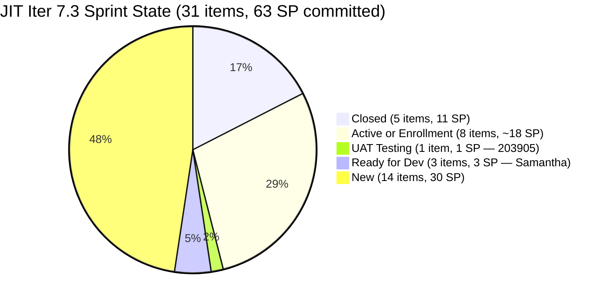
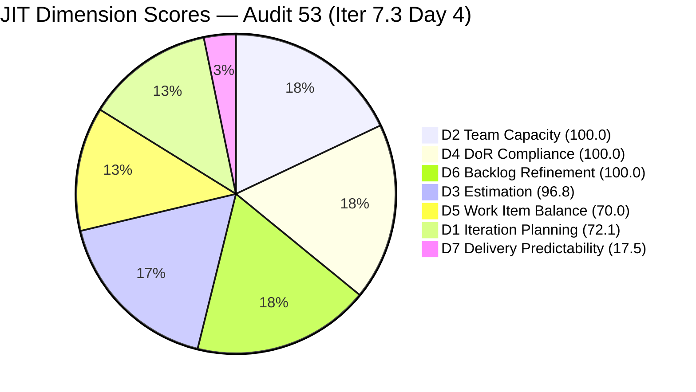
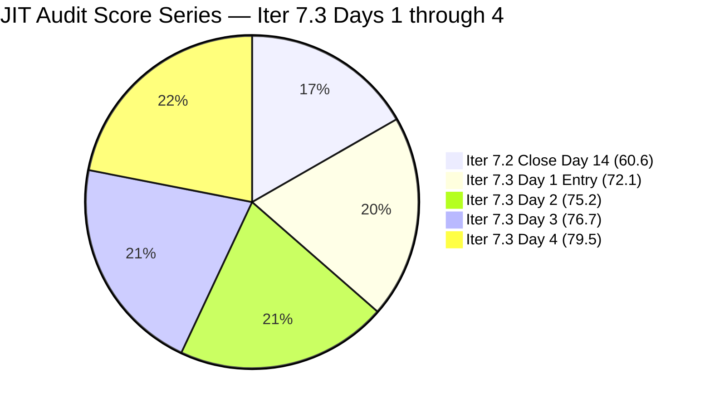
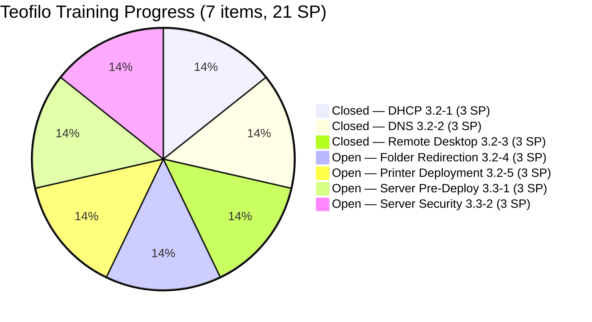

# ADO SAFe Iteration Audit — JIT Operation Team

**Audit #53 | Iteration 7.3 (May 4 – May 17, 2026) | Day 4 of 14**

---

## 1. Audit Metadata

| Field | Value |
|---|---|
| **Audit Date** | May 7, 2026, 23:08 UTC |
| **Auditor** | Claude Code (ADO SAFe Audit Agent) |
| **Workspace** | `ado_jit` |
| **ADO Project** | Jairosoft Portfolio (`666bb99a-6acd-4999-bb34-efd0e4ea90dc`) |
| **Team** | JIT Operation Team (`b25e3129-6272-4e54-a3ff-f1ef3c8eeb2c`) |
| **Iteration** | Iteration 7.3 — May 4 to May 17, 2026 |
| **Iteration ID** | `bbaecdec-eeb0-4c8d-999f-6a438eaab331` |
| **Sprint Day** | Day 4 of 14 |
| **Prior Audit** | AUDIT_20260506_0904.md (Audit #52, Iter 7.3 Day 3, Overall 76.7 — Moderate Risk) |
| **Scoring Model** | ADO SAFe v1 (7-dimension rubric) |
| **Overall Score** | **79.5 / 100** |
| **Risk Band** | **Moderate Risk** (60–79.9) — strong gain of +2.8; 0.5 points below Low Risk threshold |

---

## 2. Executive Summary

JIT Operation Team reaches **79.5 / 100 (Moderate Risk)** on Day 4 — a **+2.8 improvement** from Day 3's 76.7 and the **highest score in the Iter 7.3 series**. The team is on the threshold of Low Risk (≥80.0), just 0.5 points away.

**Key changes from Day 3 (May 6) to Day 4 (May 7):**

1. **#203157 DNS CLOSED** — Teofilo closed "3.2-2 Set-Up Domain Name System" (3 SP) at May 7, 14:15 UTC. Sequential training chain continues: DHCP → DNS complete.
2. **#203158 Remote Desktop CLOSED** — Teofilo closed "3.2-3 Set-up Remote Desktop Training" (3 SP) at May 7, 14:22 UTC. Two closures in 7 minutes — Teofilo's batch-completion pattern matches prior sprint behavior.
3. **Total closed SP rises from 5 → 11 SP** (5 items closed). D7 = 8.1 → **17.5**.
4. **#203905 NEW item** — "ADDU Interns Batch 2 Onboarding" (1 SP, User Story, UAT Testing) added to Iter 7.3 and assigned to Samantha Babael. Changed May 7 08:02 UTC. Increases current sprint items from 29 → **31**.
5. **#203250 confirmed in Iter 7.3** — "Identified Team Members to Complete the Claude 4 course" (Spike, Active, Armelita, changed May 7 09:15). This item was present in the backlog but not counted in the Day 3 audit's 29-item sprint list. It is now confirmed as a current iteration Spike. However, Story Points field is not populated (0 SP) — evidence gap.
6. **#193054 SAFe RTE MC CLOSED** — This blocked Courseware item (PI8, Grace) was closed May 7 at 01:19 UTC. It no longer appears in the visible backlog, removing it from the D1 denominator. This actually helps D1.
7. **All four previously-untouched Training items (203159–203162) are now touched** — all updated May 6 23:14 or May 7 14:23, eliminating the untouched penalty. **D6 improves from 90.0 → 100.0**.

**Path to Low Risk (≥80):** The team needs just 0.5 more Overall points. Samantha closing her 4 social media items (4 SP, all Ready for Dev) + #203905 (UAT Testing) = 5 SP closed → D7 rises from 17.5 to ~25.4 → Overall reaches ~80.3 (Low Risk).

---

## 3. Previous Audit Delta

| Dimension | Audit #52 (May 6, Day 3, 76.7) | Audit #53 (May 7, Day 4, 79.5) | Delta | Driver |
|---|---|---|---|---|
| Iteration Planning | 69.0 | **72.1** | +3.1 | Denominator: 43 (38 open + 5 closed); current items = 31 (26 open + 5 closed); 193054 removed |
| Team Capacity | 100.0 | **100.0** | 0.0 | All 4 configured |
| Estimation | 100.0 | **96.8** | −3.2 | #203250 Spike unestimated (0 SP); 30/31 estimated |
| DoR Compliance | 100.0 | **100.0** | 0.0 | #203905 new item passes DoR; #203250 passes DoR |
| Work Item Balance | 70.0 | **70.0** | 0.0 | US present; dominant 71.0% → -30 |
| Backlog Refinement | 90.0 | **100.0** | +10.0 | All 4 untouched Training items now touched; 0/31 untouched |
| Delivery Predictability | 8.1 | **17.5** | +9.4 | #203157 DNS Closed (3 SP) + #203158 RDP Closed (3 SP) |
| **Overall** | **76.7** | **79.5** | **+2.8** | D6 perfected; D7 accelerating; D1 corrected; 0.5 pts below Low Risk |

**D1 methodology note:** The Day 3 audit used 29 items/42 denominator (39 open + 3 closed). Today: #193054 (previously Blocked/Active in PI8) has been closed and no longer appears in the backlog. The open backlog now returns 38 items. Plus 5 closed items in Iter 7.3. Denominator = 43. Current items = 31 (26 open Iter 7.3 + 5 closed Iter 7.3). D1 = 31/43 = 72.1.

**D3 note:** #203250 ("Claude 4 Course" Spike, Iter 7.3) has no Story Points populated in ADO. This reduces estimated items from 31 to 30. D3 = 30/31 = 96.8. This was not captured in the Day 3 audit as #203250 was not confirmed in the sprint scope at that time.

---

## 4. Current Iteration Snapshot

| Attribute | Value |
|---|---|
| **Iteration** | Iteration 7.3 |
| **Sprint Dates** | May 4 – May 17, 2026 (14 days) |
| **Sprint Day** | Day 4 of 14 |
| **Days Remaining** | 10 |
| **Visible Backlog Items (open)** | 38 |
| **Current Sprint Items (Iter 7.3)** | 31 (26 open + 5 Closed) |
| **Committed SP (estimated items)** | 63 SP (30 estimated items; #203250 excluded as 0 SP) |
| **Closed SP** | 11 SP (5 items closed) |
| **Open SP Remaining** | 52 SP |
| **Capacity** | Teofilo: 4.8 pts/day Training; Armelita: 6 pts/day Doc; Samantha: 1 pt/day Doc; Grace: 1 pt/day Doc |
| **Last ADO Activity** | May 7, 2026, 14:22 UTC — #203158 Closed (Teofilo) |
| **Active Items** | #203250 (Claude 4 course, Armelita, Active), #203718 (EBET Trainer Verification), #203723 (Bubble MCC May 5–8), #203734 (Python May 5–8), #203745 (T2 MIS Enrollment), #203224 (SAFe MCCs — Grace), #203595 (Finance Collection Policy — Grace), #203758 (EBET Scholarship Guidelines) |

---

## 5. Work Item Analysis

### Iter 7.3 — Closed Items (5 items, all Closed)

| ID | Title | Type | SP | Assignee | Closed |
|---|---|---|---|---|---|
| **203616** | ADDU Interns Onboarding | US | 1 | Samantha | May 5, 00:23 |
| **203756** | EBET Implementation Orientation | US | 1 | Armelita | May 5, 00:23 |
| **203156** | 3.2-1 Set-Up DHCP | Training | 3 | Teofilo | May 5, 14:40 |
| **203157** | 3.2-2 Set-Up Domain Name System | Training | 3 | Teofilo | **May 7, 14:15** |
| **203158** | 3.2-3 Set-up Remote Desktop Training | Training | 3 | Teofilo | **May 7, 14:22** |

### Today's Closures — Day 4 Impact

| Item | Title | Closed | SP | Driver |
|---|---|---|---|---|
| #203157 | 3.2-2 Set-Up Domain Name System | May 7, 14:15 UTC | 3 SP | Teofilo sequential Training chain |
| #203158 | 3.2-3 Set-up Remote Desktop Training | May 7, 14:22 UTC | 3 SP | Same session — 7 minutes after DNS |

Two Training items closed 7 minutes apart — identical to Teofilo's batch-completion pattern. Both items were in the Day 2 audit's urgent list. Total Day 4 SP burned = 6 SP. Cumulative closed = 11 SP (5 items).

### New Item — #203905

| Field | Value |
|---|---|
| **ID** | 203905 |
| **Title** | ADDU Interns Batch 2 Onboarding |
| **Type** | User Story |
| **State** | UAT Testing |
| **Assignee** | Samantha Babael |
| **SP** | 1 |
| **Iter** | Iteration 7.3 |
| **Changed** | May 7, 08:02 UTC |
| **DoR** | PASS (full Description + AC) |
| **Notes** | New item added to sprint. UAT Testing state suggests near completion. |

### Iter 7.3 — Open Items (26 items)

| ID | Title | Type | State | SP | Assignee | Changed | DoR |
|---|---|---|---|---|---|---|---|
| 203157 *(now Closed)* | DNS Training | Training | Closed | 3 | Teofilo | May 7 | — |
| 203158 *(now Closed)* | Remote Desktop Training | Training | Closed | 3 | Teofilo | May 7 | — |
| 203159 | 3.2-4 Folder Redirection Training | Training | New | 3 | Teofilo | May 6, 23:14 | PASS |
| 203160 | 3.2-5 Printer Deployment Training | Training | New | 3 | Teofilo | May 7, 14:23 | PASS |
| 203161 | 3.3-1 Server Pre-Deployment Training | Training | New | 3 | Teofilo | May 7, 14:23 | PASS |
| 203162 | 3.3-2 Server Security and Reporting | Training | New | 3 | Teofilo | May 6, 23:14 | PASS |
| 203224 | Convert SAFe MCCs to New Forms | US | Active | 3 | Grace | May 6, 02:35 | PASS |
| 203242 | IT7.3 Tech Talk — AI Tools Demo | Spike | New | 1 | Armelita | May 6, 01:11 | PASS |
| 203250 | Identified Team for Claude 4 Course | Spike | Active | **0** | Armelita | May 7, 09:15 | PASS |
| 203595 | JIT Finance Collection Policy | US | Active | 2 | Grace | May 6, 12:38 | PASS |
| 203718 | EBET Additional Trainer Verification | US | Active | 2 | Armelita | May 5, 00:24 | PASS |
| 203723 | Bubble MCC Marketing May 5–8 | US | Active | 3 | Armelita | May 5, 04:39 | PASS |
| 203728 | Bubble MCC Marketing May 11–15 | US | New | 3 | Armelita | May 4 | PASS |
| 203734 | Python Marketing May 5–8 | US | Active | 2 | Armelita | May 5, 04:39 | PASS |
| 203739 | Python Marketing May 11–15 | US | New | 2 | Armelita | May 4 | PASS |
| 203745 | T2 MIS Enrollment | US | Active | 2 | Armelita | May 5, 04:40 | PASS |
| 203748 | Enrollment Report CSS Batch 3 | US | New | 2 | Armelita | May 4 | PASS |
| 203750 | Email Confirmation from UIC Dean | US | New | 1 | Armelita | May 4 | PASS |
| 203753 | Email Confirmation from HCDC Dean | US | New | 1 | Armelita | May 4 | PASS |
| 203758 | EBET Scholarship Guidelines | US | Active | 3 | Armelita | May 7, 00:52 | PASS |
| 203763 | EBET Scholarship MOU | US | New | 2 | Armelita | May 4 | PASS |
| 203766 | CSS Batch 4 Marketing May 5–8 | US | New | 3 | Armelita | May 4 | PASS |
| 203767 | CSS Batch 4 Marketing May 11–15 | US | New | 3 | Armelita | May 4 | PASS |
| 203772 | Publish Social Media Posts | US | Ready for Dev | 1 | Samantha | May 6, 02:40 | PASS |
| 203773 | Publish Social Media Post for Python | US | Ready for Dev | 1 | Samantha | May 6, 02:40 | PASS |
| 203774 | Publish Social Media Post for Bubble.io | US | Ready for Dev | 1 | Samantha | May 6, 02:40 | PASS |
| 203775 | Publish Summer Camp Post on Facebook | US | **Active** | 1 | Samantha | May 7, 08:02 | PASS |
| 203905 | ADDU Interns Batch 2 Onboarding | US | **UAT Testing** | 1 | Samantha | May 7, 08:02 | PASS |

**Sprint totals: 31 items | 63 SP committed (30 estimated; #203250 unestimated) | 11 SP Closed | 52 SP remaining**

### Contributor Progress at Day 4

| Contributor | Items | Active/UAT | Closed | SP Closed |
|---|---|---|---|---|
| Armelita | 15 US + 2 Spike = 17 | 6 Active (EBET, Bubble, Python, T2 MIS, EBET Guidelines, Claude 4) | 1 (#203756) | 1 SP |
| Teofilo | 7 Training | 0 Active | 3 (#203156, #203157, #203158) | **9 SP** |
| Grace | 2 US | 2 Active (203224, 203595) | 0 | 0 SP |
| Samantha | 3 US (Ready) + 1 Active + 1 UAT | 1 Active + 1 UAT | 1 (#203616) | 1 SP |

---

## 6. SAFe Compliance Scorecard

| Dimension | Score | Evidence | Notes |
|---|---|---|---|
| **D1 Iteration Planning** | **72.1** | 31 / 43 (38 open backlog + 5 Closed in Iter 7.3) | Improved from 69.0 — #193054 closed (removed from denominator) |
| **D2 Team Capacity** | **100.0** | 4/4 contributors configured | Armelita, Teofilo, Grace, Samantha all configured |
| **D3 Estimation** | **96.8** | 30/31 estimated; #203250 Spike has 0 SP | #203250 not estimated — evidence gap |
| **D4 DoR Compliance** | **100.0** | 31/31 pass Description + AC | #203905 new item passes DoR |
| **D5 Work Item Balance** | **70.0** | US present (22/31 = 71.0% > 60% → -30); Spike 6.5% | Structural |
| **D6 Backlog Refinement** | **100.0** | 43/43 fresh; 0 stale; 0/31 untouched | **Improved from 90.0** — all Training items touched; full 100.0 |
| **D7 Delivery Predictability** | **17.5** | 11/63 SP closed (5 items) | **Improved from 8.1** — DNS + RDP closed today (6 SP) |
| **Overall** | **79.5** | (72.1+100+96.8+100+70+100+17.5) / 7 = 556.4 / 7 = 79.5 | **Moderate Risk** — 0.5 pts below Low Risk threshold |

---

## 7. Dimension Findings

### D1 — Iteration Planning: 72.1

```
visible_root_backlog_items (open)  = 38
closed_in_current_iter             =  5  (#203616, #203756, #203156, #203157, #203158)
total_denominator                  = 43  (38 open + 5 closed in Iter 7.3)
current_iteration_root_items       = 31  (26 open Iter 7.3 + 5 closed Iter 7.3)
D1 = (31 / 43) × 100 = 72.1
```

Improvement from Day 3 (69.0) driven by:
- #193054 (SAFe RTE MC, previously Blocked Active in PI8) is now Closed and no longer in the backlog, reducing the denominator.
- #203905 (ADDU Interns Batch 2) added to Iter 7.3, increasing both numerator and denominator.
- Net effect: denominator dropped from 42 to 43 (one out: 193054; two in: 203157+203158 for numerator; one new: 203905), and numerator rose from 29 to 31.

Non-current open items (not in Iter 7.3): 200766 (PI8), 200767 (7.4), 200768 (7.4), 200771 (7.5), 203805 (7.4), 203806 (7.4), 203243 (7.4), 203244 (7.5), 203245 (7.5), 203807 (7.4), 203808 (7.4), 203809 (7.4) = 12 items.

**Path to improve D1:** Closing the 26 open Iter 7.3 items removes them from open backlog but keeps them in numerator. The 12 non-current items are the true drag — assigning or closing these reduces the denominator.

### D2 — Team Capacity: 100.0

```
contributors_with_current_work = 4  (Armelita, Teofilo, Grace, Samantha)
contributors_with_capacity     = 4  (all configured in ADO)
D2 = (4 / 4) × 100 = 100.0
```

All four contributors have configured capacity and active sprint assignments.

### D3 — Estimation: 96.8

```
point_eligible_current_items = 31
estimated_current_items = 30  (#203250 Spike: 0 SP — unestimated)
D3 = (30 / 31) × 100 = 96.8
```

Single gap: #203250 "Identified Team Members to Complete the Claude 4 course" (Spike, Armelita) has no Story Points set in ADO. This is a new item confirmed in Iter 7.3 today. Armelita should add SP estimate (suggested: 1–2 SP) to restore D3 to 100.0.

### D4 — DoR Compliance: 100.0

```
current_iteration_root_items = 31
dor_compliant_current_items  = 31
D4 = (31 / 31) × 100 = 100.0
```

All items — including the two new ones (#203905, #203250) — have sufficient Description and Acceptance Criteria to pass DoR. No regressions.

### D5 — Work Item Balance: 70.0

```
Type breakdown (31 current items):
  User Story: 22/31 = 71.0%
  Training:    7/31 = 22.6%
  Spike:       2/31 = 6.5%

User Story present → no -40 penalty
Dominant type (US 71.0% > 60%) → -30
Spike share (6.5% < 40%) → no penalty

D5 = 100 - 30 = 70.0
```

No change. The mix of US + Training + Spike is appropriate for JIT's operational profile.

### D6 — Backlog Refinement: 100.0

```
Freshness cutoff: May 7 − 45 = Mar 23, 2026
Stale_90 cutoff:  Feb 6, 2026
Stale_180 cutoff: Nov 9, 2025

fresh_visible_root_items = 43  (all 43 items changed since Mar 23)
  Oldest open items: 200767/200768 (Apr 6) — both > Mar 23
Base = (43/43) × 100 = 100.0

Stale penalties:
  stale_90 items = 0 → no penalty
  stale_180 items = 0 → no penalty

Untouched current items (changed before May 4, 00:00 UTC):
  Previous untouched (Day 3): #203159 (Apr 27), #203160 (Apr 27), #203161 (Apr 27), #203162 (Apr 27)
  Today's update:
    #203159 updated May 6, 23:14 UTC → now TOUCHED
    #203160 updated May 7, 14:23 UTC → now TOUCHED
    #203161 updated May 7, 14:23 UTC → now TOUCHED
    #203162 updated May 6, 23:14 UTC → now TOUCHED
  Untouched = 0/31 = 0%

D6 = 100.0 - 0 = 100.0
```

**First 100.0 D6 score in the Iter 7.3 series.** All four previously-untouched Training items were updated (203159 and 203162 at May 6 23:14, 203160 and 203161 at May 7 14:23 — consistent with Teofilo's training module prep pattern as he progresses through the sequence). Zero untouched items across all 31 current sprint items.

### D7 — Delivery Predictability: 17.5

```
committed_story_points = 63  (30 estimated items; #203250 excluded)
closed_story_points    = 11
  #203616 ADDU Interns Onboarding:         1 SP (May 5)
  #203756 EBET Implementation Orientation: 1 SP (May 5)
  #203156 3.2-1 DHCP Training:             3 SP (May 5)
  #203157 3.2-2 DNS Training:              3 SP (May 7, 14:15) ← NEW
  #203158 3.2-3 Remote Desktop Training:   3 SP (May 7, 14:22) ← NEW
D7 = (11 / 63) × 100 = 17.5
```

+9.4 improvement from Day 3. Teofilo has now completed 3 of 7 Training items (9 SP of 21 SP in his thread). At his current pace (roughly 2 Training items every 2 days), his remaining 4 Training items complete by Day ~8 (May 11), contributing another 12 SP. Samantha's 4 social media items + #203905 (UAT) represent 5 easy SP. Grace's 2 items (5 SP) are Active. Armelita has the most open work (15+ items).

**D7 projection (10 days remaining):**
- Teofilo remaining Training: 4 items × 3 SP = 12 SP → estimated Day 6–8 completion
- Samantha (3 Ready for Dev + 1 Active + 1 UAT = 5 items): 5 SP → Days 5–7
- Grace (2 Active): 5 SP → Days 5–7
- Armelita (15 open US + 1 Spike): varies; marketing items close rapidly
- Conservative (15 SP more by Day 14): D7 = 26/63 = 41.3 → Overall ~77
- Moderate (30 SP more by Day 14): D7 = 41/63 = 65.1 → Overall ~85 (Low Risk)

### Overall Score Calculation

```
D1  =  72.1
D2  = 100.0
D3  =  96.8
D4  = 100.0
D5  =  70.0
D6  = 100.0
D7  =  17.5

Overall = (72.1 + 100.0 + 96.8 + 100.0 + 70.0 + 100.0 + 17.5) / 7
        = 556.4 / 7
        = 79.5
```

**Overall: 79.5 / 100 — Moderate Risk (0.5 pts below Low Risk)**

---

## 8. Risks and Bottlenecks

| # | Risk | Severity | Owner | Status |
|---|---|---|---|---|
| R1 | **#203250 Spike unestimated (0 SP)** — Only gap holding D3 from 100.0 | **High** | Armelita | Fixable today: add 1–2 SP |
| R2 | **Armelita workload — 15 US + 2 Spikes open** | Moderate | Armelita | 6 Active simultaneously; monitor closure rate |
| R3 | **No Iteration Goal defined** — Full PI7 series | Moderate | Armelita (PO) | Persistent across all JIT audits |
| R4 | **Samantha's social media items still in Ready for Dev** — 3 items at 3 SP; easy wins untapped | Low | Samantha | #203775 now Active; 203772–203774 still Ready |
| R5 | **#203905 in UAT Testing** — Near completion; may close Day 5 | Low | Samantha | Positive signal; monitor |
| R6 | **Armelita's "May 5–8" items still Active/New on Day 4** — Marketing may have slipped dates | Low | Armelita | #203723 Bubble MCC May 5–8 still Active; clarify execution status |

---

## 9. Prioritized Recommendations

### Immediate (Day 4–5)

1. **[HIGHEST IMPACT] Armelita: Add Story Points to #203250.** The Claude 4 Course Spike is Active and assigned, but has 0 SP. Adding even 1 SP restores D3 to 100.0, which alone adds 0.5 to Overall — pushing the team to 80.0 (Low Risk threshold). This is a 30-second fix in ADO.

2. **[Day 4] Samantha: Close #203905 (ADDU Interns Batch 2, UAT Testing).** This item is in UAT Testing — the last stage before Closed. Closing this 1 SP item contributes to D7 and demonstrates rapid throughput.

3. **[Day 4–5] Samantha: Close social media items.** Items #203772, #203773, #203774, #203775 are each 1 SP, straightforward social media post creations. Close all 4 = 4 SP. With #203905, closing all 5 Samantha items = 5 SP → D7 rises from 17.5 to ~25.4 → Overall ~80.3 (Low Risk).

### Sprint Health

4. **[Day 5] Define Iteration 7.3 Goal.** Suggested: *"Complete CSS NC II Server Training modules (DHCP through Server Security); execute EBET scholarship implementation (guidelines, MOU, trainer verification); run May marketing campaigns for Bubble MCC, Python, and CSS Batch 4; deliver Claude 4 AI tech talk; maintain TESDA compliance through SAFe MCCs conversion and enrollment reports."*

5. **[Day 5] Armelita: Advance Teofilo's Folder Redirection (#203159).** Teofilo's sequential chain has reached #203159 (3.2-4 Folder Redirection). Based on his pace, this should close Day 5–6. The update on May 6 23:14 suggests prep work is complete.

6. **[Day 5] Confirm marketing execution dates.** Items #203723 and #203734 have "May 5–8" in their titles but are still Active on Day 4. Did the marketing activities execute? Update the state or add a comment confirming execution status.

---

## 10. Evidence Gaps and Limitations

| Gap | Impact | Mitigation |
|---|---|---|
| #203250 Spike (0 SP) | D3 = 96.8 instead of 100.0 | Armelita: add SP estimate in ADO |
| No iteration goal | Sprint goal execution unmeasurable | Persistent — all JIT audits |
| #203723 "May 5–8" marketing still Active on Day 4 | Unclear if activities executed | Armelita: update state or add comment |
| #203905 added mid-sprint (Day 4) | Increases sprint scope after Day 1 | Acceptable for UAT items near completion |
| Closed items (5) dropped from backlog query | D1 denominator corrected to include them | Consistent with prior audit methodology |

---

## 11. Mermaid Charts

### Iter 7.3 Sprint State Distribution — Day 4



### Dimension Score Breakdown — Audit 53



### JIT Score Trajectory — Iter 7.3 Days 1–4



### Teofilo Training Chain — Progress



---

*Report generated: 2026-05-07 23:08 UTC | Workspace: ado_jit | Iteration 7.3 Day 4 | Score: 79.5 Moderate Risk*
*Key changes from Day 3: #203157 DNS Closed (3 SP, May 7 14:15); #203158 Remote Desktop Closed (3 SP, May 7 14:22). #203905 new item in UAT Testing. #203250 Spike confirmed in sprint (unestimated — D3 gap). All 4 previously-untouched Training items now touched — D6 = 100.0. Total closed = 11 SP (5 items). D7 = 17.5. 0.5 pts below Low Risk. Fix: Armelita adds SP to #203250 (+0.5 Overall to threshold).*
