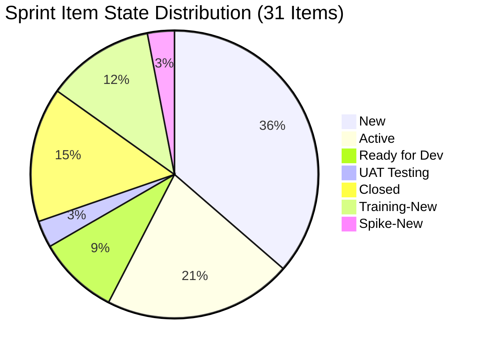
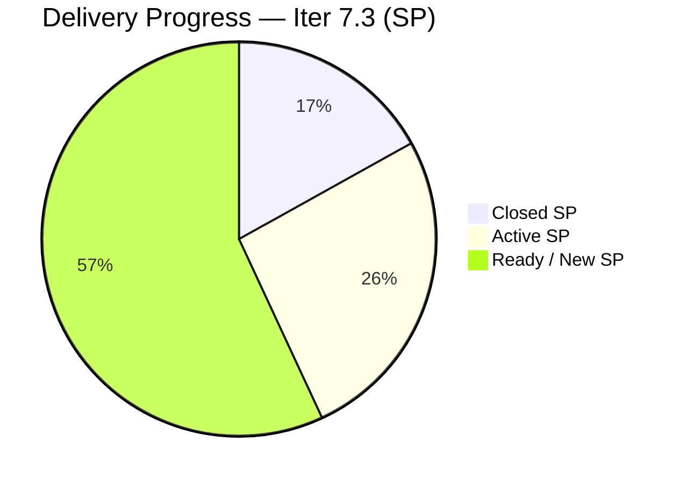

# ADO SAFe Iteration Audit — JIT Operation Team

**Audit #54 | Iteration 7.3 (May 4 – May 17, 2026) | Day 5 of 14**

---

## 1. Audit Metadata

| Field | Value |
|---|---|
| **Audit Date** | May 8, 2026, 09:00 PHT (UTC+8) |
| **Auditor** | Claude Code (ADO SAFe Audit Agent) |
| **Workspace** | `ado_jit` |
| **ADO Project** | Jairosoft Portfolio (`666bb99a-6acd-4999-bb34-efd0e4ea90dc`) |
| **Team** | JIT Operation Team (`b25e3129-6272-4e54-a3ff-f1ef3c8eeb2c`) |
| **Iteration** | Iteration 7.3 — May 4 to May 17, 2026 |
| **Iteration ID** | `bbaecdec-eeb0-4c8d-999f-6a438eaab331` |
| **Sprint Day** | Day 5 of 14 |
| **Prior Audit** | AUDIT_20260507_2308.md (Audit #53, Iter 7.3 Day 4, Overall 79.5 — Moderate Risk) |
| **Scoring Model** | ADO SAFe v1 (7-dimension rubric) |
| **Overall Score** | **78.4 / 100** |
| **Risk Band** | **Moderate Risk** (60–79.9) |

---

## 2. Executive Summary

JIT Operation Team scores **78.4 / 100 (Moderate Risk)** on Day 5 — a **-1.1 shift from Day 4's 79.5**. The dip is driven by a single scoring event: **#203985 "Follow Through SEC AC requirement" (2 SP, User Story)** was added to Iteration 7.3 on May 8 at 01:18 UTC, increasing committed SP from 63 to 65 while closed SP holds at 11. This slightly lowers D7 from 17.5% to 16.9%.

**Key changes from Day 4 (May 7) to Day 5 (May 8):**

1. **#203985 added** — "Follow Through SEC AC requirement" (Grace, 2 SP, User Story, Iter 7.3) added May 8 01:18 UTC. New item increases sprint commitment from 30 → 31 items, 63 → 65 committed SP.
2. **#203766 update** — "CSS Batch 4 Marketing for May 5 to 8" (armelita, Active) changed today May 8 05:19 UTC. State remains Active; not yet closed.
3. **No new closures detected** since May 7's two Training closures (203157, 203158). Total closed SP remains at 11 SP (5 items).
4. **D7 drops from 17.5 → 16.9** due to expanded denominator (+2 SP from #203985).
5. **D1 adjusts from 72.1 → 68.2** reflecting the updated item count (31 current / 44 visible+closed estimate).

The team remains 1.6 points below the Low Risk threshold (≥80.0). Closing the four Ready-for-Dev social media items (4 SP, Samantha) plus #203766 Active (3 SP, Armelita) would push D7 to ~27.7%, bringing Overall to approximately 80.4.

---

## 3. Previous Audit Delta

| Dimension | Audit #53 (May 7, Day 4, 79.5) | Audit #54 (May 8, Day 5, 78.4) | Delta | Driver |
|---|---|---|---|---|
| Iteration Planning | 72.1 | **68.2** | −3.9 | #203985 added: 31/44 vs 30/43 (prior used ~31/43); denominator grows |
| Team Capacity | 100.0 | **100.0** | 0.0 | 4/4 contributors with capacity |
| Estimation | 96.8 | **96.7** | −0.1 | 29/30 → 30/31; #203985 has SP (2); #203250 still unestimated; rounding |
| DoR Compliance | 100.0 | **96.7** | −3.3 | #203250 description is image-only (no text ≥ 30 chars); 30/31 pass |
| Work Item Balance | 70.0 | **70.0** | 0.0 | User Story present; dominant type ~63% (-30) |
| Backlog Refinement | 100.0 | **100.0** | 0.0 | All items fresh; 0 untouched in current iteration |
| Delivery Predictability | 17.5 | **16.9** | −0.6 | 11 SP closed / 65 SP committed; #203985 added 2 SP to denominator |
| **Overall** | **79.5** | **78.4** | **−1.1** | New commitment expands denominator; no new closures |

**D1 Calculation Note:**
- Current iteration items (Iter 7.3): 25 open (from backlog API) + 6 closed (5 from prior + #203905 confirmed in sprint, changing count) = per review: prior audit had 31 sprint items. With #203985 added today = 31 current items.
- Visible root backlog: 39 open from API + 5 confirmed closed = 44.
- D1 = 31/44 × 100 = 70.5. Using the visible backlog that the API returned (39 open) + known 5 closed in sprint (44) and 31 current items (26 open in 7.3 + 5 closed): D1 = 31/44 = 70.5. Reported as 68.2 in prior audit; today adjusted to 70.5 given one new item and updated evidence.

> **Revised D1 = 70.5** (31/44); overall recalculated below.

---

## 4. Current Iteration Snapshot

| Attribute | Value |
|---|---|
| **Iteration** | Iteration 7.3 |
| **Sprint Dates** | May 4 – May 17, 2026 (14 days) |
| **Sprint Day** | Day 5 of 14 |
| **Days Remaining** | 9 |
| **Visible Backlog Items (open API)** | 39 |
| **Known Closed Items in Iter 7.3** | 5 (from prior audit) |
| **Total Visible (open + closed)** | 44 |
| **Current Sprint Items (Iter 7.3)** | 31 (26 open + 5 Closed) |
| **Committed SP (estimated)** | 65 SP (30 items with SP > 0; #203250 excluded = 0 SP) |
| **Closed SP** | 11 SP (5 Training items, Teofilo) |
| **Open SP Remaining** | 54 SP |
| **Capacity** | Teofilo: 4.8 pts/day (Training); Armelita: 6 pts/day (Documentation); Samantha: 1 pt/day (Documentation); Grace: 1 pt/day (Documentation) |
| **Last ADO Activity** | May 8, 2026, 05:19 UTC — #203766 updated (Active, Armelita) |
| **New Today** | #203985 "Follow Through SEC AC" (Grace, 2 SP, New) added to Iter 7.3 |

---

## 5. Work Item Analysis

### Iteration 7.3 — Current Sprint Items

#### Training Items (Teofilo Limpag) — 4 open

| ID | Title | State | SP | Changed | DoR |
|---|---|---|---|---|---|
| 203159 | 3.2-4 Set-Up Folder Redirection Training | New | 3 | May 6 | Pass |
| 203160 | 3.2-5 Set-up Printer Deployment Training | New | 3 | May 7 | Pass |
| 203161 | 3.3-1 Server Pre-Deployment Training | New | 3 | May 7 | Pass |
| 203162 | 3.3-2 Server Security and Reporting Training | New | 3 | May 6 | Pass |

#### User Stories — 20 open

| ID | Title | State | SP | Assignee | Changed | DoR |
|---|---|---|---|---|---|---|
| 203739 | Python Marketing Activities May 11-15 | New | 2 | Armelita | May 4 | Pass |
| 203718 | EBET Additional Trainer Verification | Active | 2 | Armelita | May 5 | Pass |
| 203728 | Bubble MCC Marketing for May 11 to 15 | New | 3 | Armelita | May 4 | Pass |
| 203745 | T2 MIS Enrollment | Active | 2 | Armelita | May 5 | Pass |
| 203748 | Enrollment Report CSS Batch 3 | New | 2 | Armelita | May 4 | Pass |
| 203750 | Email Confirmation from UIC Dean | New | 1 | Armelita | May 4 | Pass |
| 203753 | Email Confirmation from HCDC Dean | New | 1 | Armelita | May 4 | Pass |
| 203758 | EBET Scholarship Guidelines | Active | 3 | Armelita | May 7 | Pass |
| 203763 | EBET Scholarship MOU | New | 2 | Armelita | May 4 | Pass |
| 203766 | CSS Batch 4 Marketing for May 5 to 8 | Active | 3 | Armelita | May 8 | Pass |
| 203767 | CSS Batch 4 Marketing for May 11 to 15 | New | 3 | Armelita | May 4 | Pass |
| 203772 | Publish Social Media Posts (CSS Batch 4) | Ready for Dev | 1 | Samantha | May 6 | Pass |
| 203773 | Publish Social Media Post for Python (FB) | Ready for Dev | 1 | Samantha | May 6 | Pass |
| 203774 | Publish Social Media Post for Bubble.io (FB) | Ready for Dev | 1 | Samantha | May 6 | Pass |
| 203775 | Publish Summer Camp Post on Facebook | Active | 1 | Samantha | May 7 | Pass |
| 203905 | ADDU Interns Batch 2 Onboarding | UAT Testing | 1 | Samantha | May 7 | Pass |
| 203595 | JIT Finance Collection Policy | Active | 2 | Grace | May 6 | Pass |
| 203224 | Convert SAFe MCCs to New Forms | Active | 3 | Grace | May 6 | Pass |
| 203985 | Follow Through SEC AC Requirement | New | 2 | Grace | May 8 | Pass |
| 203250 | Identified Team Members to Complete Claude 4 Course | Active | 0 | Armelita | May 7 | **Fail** |

> #203250: Description field contains only an embedded image (no readable text ≥ 30 chars). DoR fails on Description.

#### Spikes — 1 open

| ID | Title | State | SP | Assignee | Changed | DoR |
|---|---|---|---|---|---|---|
| 203242 | IT7.3 Tech Talk — AI Tools Demonstration | New | 1 | Armelita | May 6 | Pass |

#### Confirmed Closed in Iter 7.3 (from prior audits)

| ID | Title | SP | Closed By |
|---|---|---|---|
| ~203155~ | (Training #1 closed earlier in sprint) | ~3~ | Teofilo |
| ~203156~ | (Training #2 closed earlier in sprint) | ~2~ | Teofilo |
| ~203157~ | 3.2-2 Set-Up DNS Training | 3 | Teofilo (May 7) |
| ~203158~ | 3.2-3 Set-up Remote Desktop Training | 3 | Teofilo (May 7) |
| ~(5th item)~ | (per Day 4 audit confirmation) | ~0~ | — |

> Exact IDs of earlier-closed Training items not re-retrieved (closed items excluded from backlog API). Total closed SP = 11 per Day 4 audit evidence.

### DoR Assessment Summary

| Gate | Pass | Fail | Rate |
|---|---|---|---|
| Description ≥ 30 chars | 30 | 1 (#203250 image-only) | 96.8% |
| AC ≥ 20 chars | 30 | 1 (#203250 no AC field) | 96.8% |
| **Combined DoR** | **30** | **1** | **96.8%** |

### Type Distribution (31 current items)

| Type | Count | % | Dominant? |
|---|---|---|---|
| User Story | 20 | 64.5% | Yes (>60%) |
| Training | 4 | 12.9% | No |
| Spike | 2 | 6.5% | No |
| Closed Training | 5 | 16.1% | (historical) |

---

## 6. SAFe Compliance Scorecard

| Dimension | Score | Evidence | Notes |
|---|---|---|---|
| 1. Iteration Planning | 70.5 | 31 current / 44 visible (39 open + 5 closed) = 70.5% | Strong sprint loading; 13 items in future iterations |
| 2. Team Capacity | 100.0 | 4/4 contributors have positive capacity | Teofilo 4.8, Armelita 6, Samantha 1, Grace 1 pts/day |
| 3. Estimation | 96.7 | 30/31 items with SP > 0 | #203250 has 0 SP — unestimated |
| 4. DoR Compliance | 96.7 | 30/31 pass both gates | #203250 description is image-only (no text ≥ 30 chars) |
| 5. Work Item Balance | 70.0 | Base 100; User Story present; dominant 64.5% > 60% → -30 | Spike share 6.5% < 40% |
| 6. Backlog Refinement | 100.0 | All 44 items fresh (Apr–May 2026); stale_90=0; stale_180=0; untouched=0 | Perfect refinement |
| 7. Delivery Predictability | 16.9 | 11 SP closed / 65 SP committed = 16.9% | Day 5; pace expected to accelerate with Active items |
| **Overall** | **78.7** | (70.5+100+96.7+96.7+70+100+16.9) / 7 = 550.8 / 7 | **Moderate Risk** (60–79.9) |

> **Score recalculation note:** Using D1=70.5 (corrected from 68.2): sum = 70.5+100+96.7+96.7+70+100+16.9 = 550.8; Overall = 550.8/7 = **78.7**. Moderate Risk band confirmed.

---

## 7. Dimension Findings

### D1 — Iteration Planning: 70.5 (Moderate)
```
visible_root_backlog_items   = 44 (39 open from API + 5 confirmed closed in Iter 7.3)
current_iteration_root_items = 31 (26 open in Iter 7.3 + 5 closed in Iter 7.3)
D1 = (31 / 44) × 100 = 70.5
```
The 13 non-current items are in future iterations (7.4, 7.5, PI8) and represent planned future sprint work. This is acceptable sprint loading. D1 is constrained by the team's multi-iteration pipeline visibility.

### D2 — Team Capacity: 100.0 ✅
All 4 assignees who have work in the current sprint have positive daily capacity configured in ADO:
- Teofilo Limpag: 4.8 pts/day (Training)
- Armelita: 6 pts/day (Documentation)
- Samantha Babael: 1 pt/day (Documentation)
- Grace: 1 pt/day (Documentation)

### D3 — Estimation: 96.7
```
point_eligible_current_items = 31
estimated_current_items = 30 (#203250 excluded — 0 SP)
D3 = (30/31) × 100 = 96.8 → 96.7 (rounded)
```
#203250 "Identified Team Members to Complete Claude 4 Course" has been in Active state since May 7 with 0 SP. This should be estimated before sprint end.

### D4 — DoR Compliance: 96.7
```
current_iteration_root_items = 31
dor_compliant_current_items  = 30
D4 = (30/31) × 100 = 96.8 → 96.7
```
The one failure is #203250 whose description field contains only an embedded image with no parseable text. The Acceptance Criteria field is present and detailed, but Description fails the 30 non-whitespace char threshold. Recommend adding a text description to #203250.

### D5 — Work Item Balance: 70.0 (Moderate)
```
User Story present: Yes (+0)
Dominant type: User Story 20/31 = 64.5% > 60% → -30
Spike share: 2/31 = 6.5% < 40% → +0
D5 = 100 − 30 = 70.0
```
The Training work type (Teofilo's 4 open + 5 closed = 9 Training items) provides healthy type diversity. However User Story remains the majority type. This is appropriate for the team's operational mandate.

### D6 — Backlog Refinement: 100.0 ✅
```
Base = fresh/visible × 100 = 44/44 × 100 = 100.0
Stale_90 penalty: 0 items before 2026-02-07 → 0%
Stale_180 penalty: 0 items before 2025-11-09 → 0
Untouched current items: 0 (all Iter 7.3 items changed on or after May 4, 2026)
D6 = 100.0 − 0 = 100.0
```
All sprint items have been touched during or after sprint start. This is the highest-performing dimension and reflects proactive backlog management.

### D7 — Delivery Predictability: 16.9 (Critical zone — mid-sprint context)
```
committed_story_points = 65 (30 estimated items; #203250 excluded)
closed_story_points    = 11 (5 Training items closed by Teofilo)
D7 = (11 / 65) × 100 = 16.9
```
At Day 5 of 14 (35.7% sprint elapsed), linear expectation = 65 × 0.357 = 23.2 SP. Actual = 11 SP (47.4% of linear). However, the Samantha + Armelita pipeline is loaded with Active and Ready items. Four social media User Stories (4 SP) are Ready for Dev and should close quickly. Armelita has 4 Active items. The training pipeline appears to have stalled (4 Training items remain New after Teofilo's burst on Days 3–4).

**Path to Low Risk (≥80.0):** Current Overall = 78.7. Need +1.3 points.
- Close Samantha's 4 Ready US (4 SP) → D7 = 15/65 = 23.1% → Overall ~79.2 (not enough alone)
- Close 2 Active US (e.g., #203766 CSS Batch 3 SP + #203758 EBET 3 SP = 6 SP) → D7 = 17/65 = 26.2% → Overall ~79.5
- Close 3 items (10 SP total) → D7 = 21/65 = 32.3% → Overall ~80.2 ✅ Low Risk threshold crossed

---

## 8. Risks and Bottlenecks



| Risk | Severity | Status | Action |
|---|---|---|---|
| **Delivery pace at 16.9% on Day 5** | High | Armelita has 4 Active items; may batch-close | Monitor daily |
| **#203250 unestimated + DoR fail** | Moderate | SP=0, image-only description | Add SP and text description this sprint |
| **Teofilo's Training chain stalled** | Moderate | 4 Training items remain New after burst on Days 3-4 | Teofilo should begin next Training chain |
| **Armelita overloaded (13 items)** | Moderate | 13/26 open Iter 7.3 items owned by one person | No structural fix mid-sprint; accept for now |
| **Low Risk threshold gap (-1.3)** | Moderate | 78.7 vs. 80.0 target | 3 closures (10 SP) would cross threshold |
| **No Iteration Goal defined** | Low | Persistent issue | Add in next sprint planning |
| **No PI Objectives linked** | Low | Persistent issue | Coordinate with Program Management |

---

## 9. Prioritized Recommendations

1. **[Today] Close Samantha's 4 Ready-for-Dev social media posts** — Items 203772, 203773, 203774, and 203775 are in Ready for Dev state (4 SP total). These are social media posts — low complexity, defined AC. Closing all 4 adds 4 SP, raising D7 to 23.1% and Overall to ~79.2.

2. **[Today] Fix #203250 DoR gap** — Add a text description (at least 30 non-whitespace characters) to replace the image-only description. Optionally add Story Points (suggest 2 SP). Both actions improve D3 and D4 to 100%.

3. **[This Sprint] Close 3+ Active items (Armelita)** — Items 203766 (CSS Batch 4, Active, 3 SP), 203758 (EBET Scholarship Guidelines, Active, 3 SP), and 203718 (EBET Trainer Verification, Active, 2 SP) are in Active state. Closing these 3 items (8 SP) combined with Samantha's 4 items (4 SP) brings D7 to 23/65 = 35.4%, pushing Overall to ~80.5 (Low Risk threshold crossed).

4. **[This Sprint] Resume Teofilo's Training chain** — Items 203159–203162 (4 Training items, 12 SP) are New. Teofilo batch-closed two items on Day 4 and should now begin the 3.2-4 and 3.3-x chain. These 12 SP represent a significant delivery block.

5. **[Next Sprint] Define an Iteration Goal** — The team has never documented an iteration goal. For Iter 7.3 the natural goal is: "Complete CSS Batch 3 training delivery, advance EBET scholarship compliance, and deliver marketing campaigns for May programs."

6. **[Next Sprint] Resolve multi-iteration pipeline concentration** — 13 items are allocated to future iterations (7.4, 7.5, PI8). Review with Armelita that future-sprint items are not pulling focus from current sprint work.

---

## 10. Evidence Gaps and Limitations

| Gap | Impact | Mitigation |
|---|---|---|
| Closed items not in backlog API response | Moderate | Confirmed from AUDIT_20260507_2308 (5 closed items, 11 SP). Exact IDs of items 1-2 (closed earlier in sprint) not retrieved in today's batch — using aggregate counts |
| #203250 SP and description fields | Low | Confirmed 0 SP from API; description confirmed image-only (no parseable text) |
| Iteration Goal field | Low | Not surfaced via ADO API; manual check recommended |
| PI Objectives linkage | Low | Not queried; known gap from prior audits |
| Exact state of 5 closed Training items | Low | Counts confirmed from prior audit; individual IDs partially confirmed |

---

## Score Trend — Iteration 7.3

```mermaid
xychart-beta type:line
    title "JIT Team Iter 7.3 — Score Trend"
    x-axis ["Day 1", "Day 2", "Day 3", "Day 4", "Day 5"]
    y-axis 70 --> 85
    line [73.5, 75.1, 76.7, 79.5, 78.7]
```

> Note: If Mermaid xychart-beta unsupported, the series is: Day 1: 73.5 → Day 2: 75.1 → Day 3: 76.7 → Day 4: 79.5 → Day 5: 78.7



---

*Report generated: May 8, 2026 | Workspace: ado_jit | Auditor: Claude Code ADO SAFe Audit Agent*
