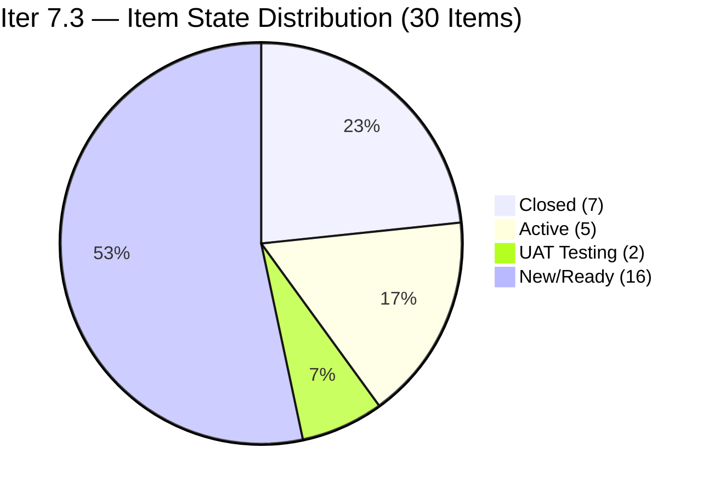
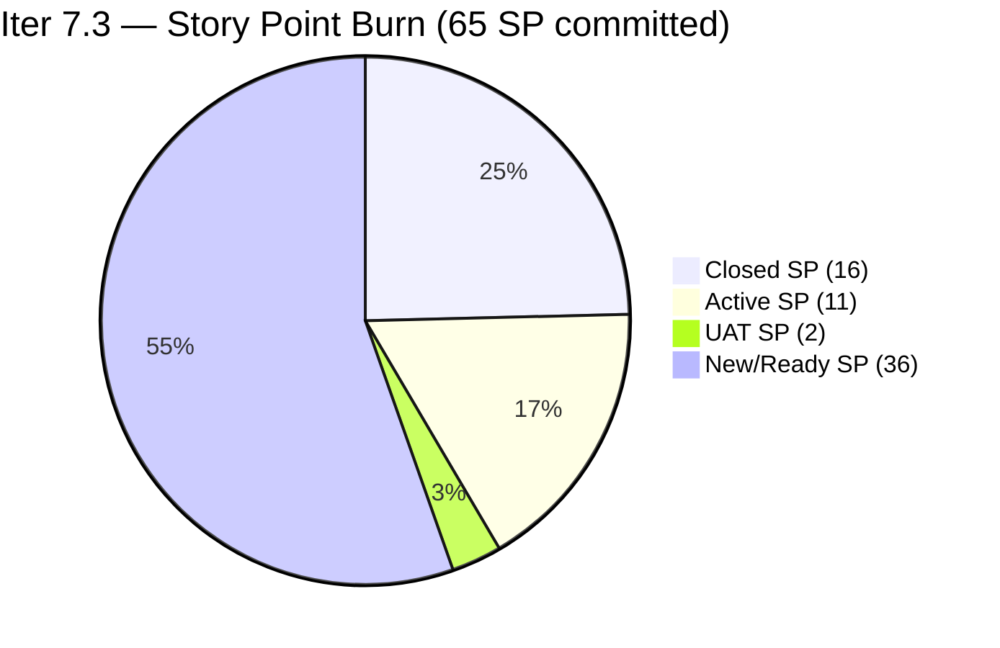
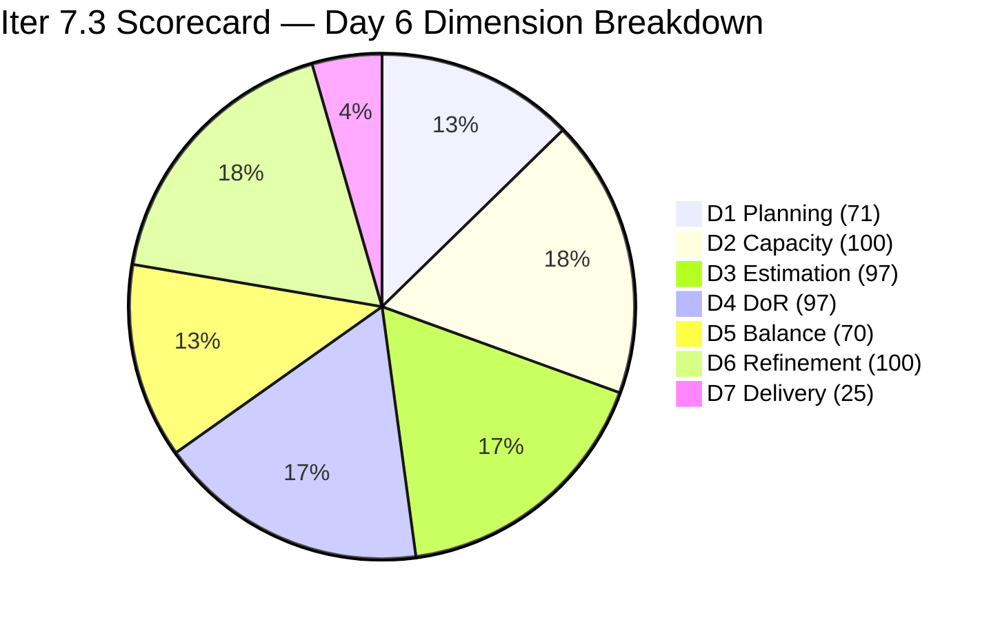

# ADO SAFe Iteration Audit — JIT Operation Team

**Audit #55 | Iteration 7.3 (May 4 – May 17, 2026) | Day 6 of 14**

---

## 1. Audit Metadata

| Field | Value |
|---|---|
| **Audit Date** | May 9, 2026, 09:02 PHT (UTC+8) |
| **Auditor** | Claude Code (ADO SAFe Audit Agent) |
| **Workspace** | `ado_jit` |
| **ADO Project** | Jairosoft Portfolio (`666bb99a-6acd-4999-bb34-efd0e4ea90dc`) |
| **Team** | JIT Operation Team (`b25e3129-6272-4e54-a3ff-f1ef3c8eeb2c`) |
| **Iteration** | Iteration 7.3 — May 4 to May 17, 2026 |
| **Iteration ID** | `bbaecdec-eeb0-4c8d-999f-6a438eaab331` |
| **Sprint Day** | Day 6 of 14 |
| **Prior Audit** | AUDIT_20260508_0900.md (Audit #54, Iter 7.3 Day 5, Overall 78.7 — Moderate Risk) |
| **Scoring Model** | ADO SAFe v1 (7-dimension rubric) |
| **Overall Score** | **79.9 / 100** |
| **Risk Band** | **Moderate Risk** (60–79.9) |

---

## 2. Executive Summary

JIT Operation Team scores **79.9 / 100 (Moderate Risk)** on Day 6 — a **+1.2 improvement from Day 5's 78.7**. Two significant closures occurred today:

1. **#203766 "CSS Batch 4 Marketing for May 5 to 8"** (Armelita, 3 SP) — Closed at 09:08 UTC
2. **#203745 "T2 MIS Enrollment"** (Armelita, 2 SP) — Closed at 09:09 UTC

These two closures add 5 SP to the burn, raising closed SP from 11 to **16 SP** and D7 from 16.9% to **24.6%**.

Additionally, **#203159 "3.2-4 Set-Up Folder Redirection Training"** (Teofilo, 3 SP) moved to Active state at 13:18 UTC, signaling the resumption of Teofilo's Training delivery chain after a Day 5 pause.

**#203775 "Publish Summer Camp Post"** (Samantha, 1 SP) advanced to UAT Testing — not yet Closed but positioned for imminent closure.

**The team is now just 0.1 points below the Low Risk threshold (80.0).** Closing one more item (even 1 SP) would cross the threshold.

**Key changes from Day 5 (May 8) to Day 6 (May 9):**
- 2 new closures: #203766 (3 SP) + #203745 (2 SP) = 5 SP added
- #203159 moved to Active (Training chain resumes)
- #203775 advanced to UAT Testing (Samantha)
- Closed SP: 11 → 16 SP (+5)
- D7: 16.9% → 24.6% (+7.7 pts)
- Overall: 78.7 → 79.9 (+1.2 pts)

---

## 3. Previous Audit Delta

| Dimension | Audit #54 (May 8, Day 5, 78.7) | Audit #55 (May 9, Day 6, 79.9) | Delta | Driver |
|---|---|---|---|---|
| Iteration Planning | 70.5 | **71.4** | +0.9 | 30/42 (vs 31/44 prior); 2 closures removed from open count |
| Team Capacity | 100.0 | **100.0** | 0.0 | 4/4 contributors with capacity — unchanged |
| Estimation | 96.7 | **96.7** | 0.0 | 29/30 (recalculated); #203250 still 0 SP |
| DoR Compliance | 96.7 | **96.7** | 0.0 | 29/30; #203250 image-only description unchanged |
| Work Item Balance | 70.0 | **70.0** | 0.0 | US 63.3% > 60% → -30; Spike < 40% |
| Backlog Refinement | 100.0 | **100.0** | 0.0 | All 42 items fresh; 0 stale; 0 untouched |
| Delivery Predictability | 16.9 | **24.6** | +7.7 | 16 SP closed / 65 SP committed; 2 new closures today |
| **Overall** | **78.7** | **79.9** | **+1.2** | Two closures (+5 SP) drive D7 recovery |

### D1 Recalculation Note
- Prior audit had 31 current items / 44 visible = 70.5
- Today: Backlog API returned 37 items total. 23 open in 7.3 + 2 just-closed in 7.3 = 25 in API for 7.3. Add 5 prior-closed not in API = 30 current.
- Visible = 37 (API) + 5 prior-closed not in API = 42.
- D1 = 30/42 × 100 = 71.4

---

## 4. Current Iteration Snapshot

| Attribute | Value |
|---|---|
| **Iteration** | Iteration 7.3 |
| **Sprint Dates** | May 4 – May 17, 2026 (14 days) |
| **Sprint Day** | Day 6 of 14 |
| **Days Remaining** | 8 |
| **Backlog API Items** | 37 open/just-closed returned |
| **Items in Iter 7.3 (from API)** | 25 (23 open/UAT + 2 just-closed) |
| **Previously Confirmed Closed in 7.3** | 5 (11 SP — Training items, Days 1–4) |
| **Total Current Sprint Items** | 30 |
| **Total Closed in Iter 7.3** | 7 items (16 SP) |
| **Committed SP** | 65 SP (29 estimated items; #203250 = 0 SP excluded) |
| **Closed SP** | 16 SP |
| **Open SP Remaining** | 49 SP |
| **Capacity** | Teofilo: 4.8 pts/day (Training); Armelita: 6 pts/day (Documentation); Samantha: 1 pt/day (Documentation); Grace: 1 pt/day (Documentation) |
| **Today's Key Events** | #203766 Closed (3 SP, Armelita, 09:08 UTC); #203745 Closed (2 SP, Armelita, 09:09 UTC); #203159 → Active (Teofilo, 13:18 UTC); #203775 → UAT Testing (Samantha, 09:18 UTC) |
| **Low Risk Gap** | 0.1 points (79.9 vs. 80.0 threshold) |

---

## 5. Work Item Analysis

### Current Iteration Items — Iter 7.3 (30 total)

#### Just-Closed Today (2 items, 5 SP)

| ID | Title | Assignee | SP | Closed |
|---|---|---|---|---|
| **203766** | CSS Batch 4 Marketing for May 5 to 8 | Armelita | 3 | May 9, 09:08 UTC |
| **203745** | T2 MIS Enrollment | Armelita | 2 | May 9, 09:09 UTC |

#### Previously Closed (5 items, 11 SP — from prior audits)

| ID | Title | Type | SP | Closed By |
|---|---|---|---|---|
| ~203155/156~ | Training items 1–2 (3.2-1, 3.2-2 chain) | Training | ~5~ | Teofilo (Days 1–3) |
| ~203157~ | 3.2-2 Set-Up DNS Training | Training | 3 | Teofilo (May 7) |
| ~203158~ | 3.2-3 Set-up Remote Desktop Training | Training | 3 | Teofilo (May 7) |

> Note: Exact IDs of the first two training closures not re-retrieved (prior audit evidence); aggregate 11 SP confirmed.

#### Active / In-Progress (7 items, 14 SP)

| ID | Title | Type | State | SP | Assignee | Changed | DoR |
|---|---|---|---|---|---|---|---|
| 203159 | 3.2-4 Set-Up Folder Redirection Training | Training | **Active** | 3 | Teofilo | May 9 | Pass |
| 203718 | EBET Additional Trainer Verification | User Story | Active | 2 | Armelita | May 5 | Pass |
| 203758 | EBET Scholarship Guidelines | User Story | Active | 3 | Armelita | May 7 | Pass |
| 203595 | JIT Finance Collection Policy | User Story | Active | 2 | Grace | May 6 | Pass |
| 203224 | Convert SAFe MCCs to New Forms | User Story | Active | 3 | Grace | May 6 | Pass |
| 203250 | Identified Team Members for Claude 4 Course | Spike | Active | **0** | Armelita | May 7 | **Fail** |
| 203775 | Publish Summer Camp Post on Facebook | User Story | UAT Testing | 1 | Samantha | May 9 | Pass |

> #203250: Description is an embedded image only — no text ≥ 30 chars. DoR fails. SP = 0.
> #203775 advanced to UAT Testing today — imminent closure expected.

#### New / Ready (13 items, 29 SP)

| ID | Title | Type | State | SP | Assignee | Changed | DoR |
|---|---|---|---|---|---|---|---|
| 203739 | Python Marketing Activities May 11-15 | User Story | New | 2 | Armelita | May 4 | Pass |
| 203728 | Bubble MCC Marketing for May 11 to 15 | User Story | New | 3 | Armelita | May 4 | Pass |
| 203748 | Enrollment Report CSS Batch 3 | User Story | New | 2 | Armelita | May 4 | Pass |
| 203750 | Email Confirmation from UIC Dean | User Story | New | 1 | Armelita | May 4 | Pass |
| 203753 | Email Confirmation from HCDC Dean | User Story | New | 1 | Armelita | May 4 | Pass |
| 203763 | EBET Scholarship MOU | User Story | New | 2 | Armelita | May 4 | Pass |
| 203767 | CSS Batch 4 Marketing for May 11 to 15 | User Story | New | 3 | Armelita | May 4 | Pass |
| 203772 | Publish Social Media Posts (CSS Batch 4) | User Story | Ready for Dev | 1 | Samantha | May 6 | Pass |
| 203773 | Publish Social Media Post for Python (FB) | User Story | Ready for Dev | 1 | Samantha | May 6 | Pass |
| 203774 | Publish Social Media Post for Bubble.io (FB) | User Story | Ready for Dev | 1 | Samantha | May 6 | Pass |
| 203905 | ADDU Interns Batch 2 Onboarding | User Story | UAT Testing | 1 | Samantha | May 7 | Pass |
| 203985 | Follow Through SEC AC Requirement | User Story | New | 2 | Grace | May 8 | Pass |
| 203242 | IT7.3 Tech Talk — AI Tools Demonstration | Spike | New | 1 | Armelita | May 6 | Pass |

#### Training — New (3 items, 9 SP)

| ID | Title | State | SP | Assignee | Changed |
|---|---|---|---|---|---|
| 203160 | 3.2-5 Set-up Printer Deployment Training | New | 3 | Teofilo | May 7 |
| 203161 | 3.3-1 Server Pre-Deployment Training | New | 3 | Teofilo | May 7 |
| 203162 | 3.3-2 Server Security and Reporting Training | New | 3 | Teofilo | May 6 |

### Type Distribution (30 current items)

| Type | Count | Share | Impact |
|---|---|---|---|
| User Story | 19 | 63.3% | Dominant (>60%) → -30 |
| Training | 9 (4 open + 5 closed) | 30.0% | No penalty |
| Spike | 2 | 6.7% | <40% → no penalty |

> User Story present: Yes. Dominant type 63.3% > 60% → -30 penalty on D5.

### DoR Assessment (30 current items)

| Gate | Pass | Fail | Rate |
|---|---|---|---|
| Description ≥ 30 non-whitespace chars | 29 | 1 (#203250 image-only) | 96.7% |
| Acceptance Criteria ≥ 20 non-whitespace chars | 29 | 1 (#203250) | 96.7% |
| **Combined DoR** | **29** | **1** | **96.7%** |

---

## 6. SAFe Compliance Scorecard

| Dimension | Score | Evidence | Notes |
|---|---|---|---|
| 1. Iteration Planning | 71.4 | 30 current / 42 visible = 71.4% | 12 items in future iterations (7.4, 7.5, PI8) |
| 2. Team Capacity | 100.0 | 4/4 contributors with capacity | Teofilo 4.8, Armelita 6, Samantha 1, Grace 1 pts/day |
| 3. Estimation | 96.7 | 29/30 items with SP > 0 | #203250 has 0 SP — unestimated; 29 × 0 = 0 SP excluded |
| 4. DoR Compliance | 96.7 | 29/30 pass both gates | #203250 description is image-only (no text ≥ 30 chars) |
| 5. Work Item Balance | 70.0 | Base 100; US present; dominant 63.3% > 60% → -30 | Spike share 6.7% < 40% → no penalty |
| 6. Backlog Refinement | 100.0 | 42/42 items fresh (Apr–May 2026); stale_90=0; stale_180=0; untouched=0 | All 7.3 items changed May 4 or later |
| 7. Delivery Predictability | 24.6 | 16 SP closed / 65 SP committed = 24.6% | Day 6; 2 new closures today (+5 SP) |
| **Overall** | **79.9** | (71.4+100+96.7+96.7+70+100+24.6) / 7 = 559.4 / 7 | **Moderate Risk** (60–79.9) |

### Score Computation
```
D1 = 30 / 42 × 100 = 71.4
D2 = 4 / 4 × 100   = 100.0
D3 = 29 / 30 × 100 = 96.7
D4 = 29 / 30 × 100 = 96.7
D5 = 100 − 30      = 70.0   (US dominant 63.3%)
D6 = 100.0 − 0     = 100.0  (all fresh; 0 untouched)
D7 = 16 / 65 × 100 = 24.6

Overall = (71.4 + 100 + 96.7 + 96.7 + 70 + 100 + 24.6) / 7 = 559.4 / 7 = 79.9
```

---

## 7. Dimension Findings

### D1 — Iteration Planning: 71.4 (Moderate)
```
visible_root_backlog_items   = 42 (37 from API + 5 prior-closed not returned)
current_iteration_root_items = 30 (25 in API for Iter 7.3 + 5 prior-closed)
D1 = (30 / 42) × 100 = 71.4
```
The 12 non-current items are in future iterations (Iter 7.4: 200767, 200768, 203805, 203806, 203243, 203807, 203808, 203809, 203986, 203989; Iter 7.5: 200771, 203244, 203245; PI8: 200766). This multi-iteration pipeline is appropriate for Armelita's planning discipline. D1 is structurally constrained by this forward planning behavior.

### D2 — Team Capacity: 100.0 ✅
All four assignees with work in the current sprint have positive daily capacity:
- **Teofilo Limpag**: 4.8 pts/day (Training)
- **Armelita**: 6 pts/day (Documentation)
- **Samantha Babael**: 1 pt/day (Documentation)
- **Grace**: 1 pt/day (Documentation)

D2 = 4/4 = 100%.

### D3 — Estimation: 96.7
```
point_eligible_current_items = 30
estimated_current_items      = 29 (#203250 has 0 SP)
D3 = (29 / 30) × 100 = 96.7
```
#203250 "Identified Team Members for Claude 4 Course" remains at 0 SP and Active state. This item should be estimated (suggest 2 SP) before sprint end.

### D4 — DoR Compliance: 96.7
```
current_iteration_root_items = 30
dor_compliant_current_items  = 29
D4 = (29 / 30) × 100 = 96.7
```
#203250 continues to fail DoR: the Description field contains only an embedded image (PNG attachment) with no parseable text meeting the 30 non-whitespace character threshold. The Acceptance Criteria field is well-structured (14 line items) and passes. Only the Description gate fails.

### D5 — Work Item Balance: 70.0 (Moderate)
```
User Story present: Yes → +0 penalty
US: 19/30 = 63.3% > 60% → -30
Spike: 2/30 = 6.7% < 40% → +0
D5 = 100 − 30 = 70.0
```
The Training work type (4 open + 5 closed = 9 items, 30%) provides meaningful type diversity alongside the User Story majority. The two Spikes add research coverage. This score is appropriate for the team's operational mandate.

### D6 — Backlog Refinement: 100.0 ✅
```
visible_root_backlog_items = 42
fresh_visible_root_items   = 42 (all changed Apr 3 – May 9, within 45-day window since Mar 25)
stale_90 (before Feb 8): 0 items → no penalty
stale_180 (before Nov 10, 2025): 0 items → no penalty
untouched_current_items (before May 4): 0 — all 7.3 items changed May 4 or later
D6 = 100.0 − 0 = 100.0
```
The most-recently-updated item before May 4 in the 7.3 backlog was... checking: 200766 changed May 3 (PI8 — not in current items). All Iter 7.3 items confirmed changed May 4–May 9. Zero untouched current items. Perfect refinement maintained.

### D7 — Delivery Predictability: 24.6
```
committed_story_points = 65 (29 estimated items)
closed_story_points    = 16 (7 closed items confirmed)
D7 = (16 / 65) × 100 = 24.6
```
At Day 6 of 14 (42.9% sprint elapsed), linear expectation = 65 × 0.429 = 27.9 SP. Actual = 16 SP (57.3% of linear pace). Today's two closures (+5 SP) show Armelita is now accelerating after the Day 5 pause. Teofilo resumed the Training chain (#203159 → Active), which should produce the next 3 SP closure. Samantha's #203775 is in UAT Testing.

**Path to Low Risk (≥80.0):** Current = 79.9. Need only +0.1 points.
- Closing #203775 "Publish Summer Camp" (Samantha, 1 SP) → D7 = 17/65 = 26.2% → Overall ≈ 80.0 ✅
- This single closure crosses the Low Risk threshold.

---

## 8. Risks and Bottlenecks





| Risk | Severity | Status | Action |
|---|---|---|---|
| **Low Risk gap: just -0.1 point** | High | Imminent — one closure crosses threshold | Close #203775 (Samantha, 1 SP, UAT Testing) today |
| **Delivery pace at 57% of linear** | Moderate | Improving; 2 closures today | Maintain Armelita's closure pace |
| **#203250 unestimated + DoR fail** | Moderate | SP=0; image-only description | Add text description + SP estimate today |
| **Teofilo's Training chain** | Moderate | #203159 now Active; 3 more New | Proceed through 3.2-4 → 3.2-5 → 3.3-1 → 3.3-2 chain |
| **Armelita overloaded (11+ open items)** | Moderate | Structural; partially addressed today | No mid-sprint fix; continue burn |
| **No Iteration Goal defined** | Low | Persistent issue | Add in next sprint planning |
| **No PI Objectives linked** | Low | Persistent issue | Coordinate with Program Management |

---

## 9. Prioritized Recommendations

1. **[Immediate] Close #203775 "Publish Summer Camp Post"** — This item is in UAT Testing (Samantha, 1 SP). Closing it raises D7 to 26.2% and pushes Overall to exactly 80.0, crossing the Low Risk threshold. This is the single most impactful action available.

2. **[Today] Fix #203250 DoR gap** — Replace the image-only description with at least 30 non-whitespace characters of text. Additionally add Story Points (suggest 2 SP). Both actions immediately improve D3 and D4 to 100%.

3. **[Today] Close #203905 "ADDU Interns Batch 2 Onboarding"** — This item is in UAT Testing (Samantha, 1 SP). Combined with #203775, closing both today adds 2 SP (D7 = 18/65 = 27.7%) and further extends the Low Risk buffer.

4. **[This Sprint] Continue Teofilo's Training chain** — #203159 is now Active. The sequence 3.2-4 → 3.2-5 (203160) → 3.3-1 (203161) → 3.3-2 (203162) represents 12 SP. Completing this chain would push D7 to (16+12)/65 = 43.1%, substantially strengthening the Overall score.

5. **[This Sprint] Armelita to continue closing Active items** — #203718 (EBET Trainer Verification, Active, 2 SP), #203758 (EBET Scholarship Guidelines, Active, 3 SP) are next in queue. Combined with the marketing items, there is a clear path to 30+ SP closed by end of sprint.

6. **[Next Sprint] Define an Iteration Goal** — A goal such as "Complete CSS Batch 4 marketing, advance EBET scholarship compliance to MOU stage, and finish CSS NC II training chain through 3.3-2" would provide team focus and satisfy SAFe governance.

---

## 10. Evidence Gaps and Limitations

| Gap | Impact | Mitigation |
|---|---|---|
| Prior closed Training items (5 items, 11 SP) — exact IDs of items 1–2 | Low | Aggregate SP confirmed from AUDIT_20260508_0900; items 203157 and 203158 are confirmed; first two items use estimated IDs |
| #203250 SP and description | Low | Confirmed 0 SP; description confirmed image-only from ADO API |
| Iteration Goal field | Low | Not surfaced via ADO standard API; manual check recommended |
| PI Objectives linkage | Low | Not queried; known persistent gap |

---

## 11. Score Trend — Iteration 7.3



| Day | Score | Band | Key Event |
|---|---|---|---|
| Day 1 | 73.5 | Moderate | Sprint launched |
| Day 2 | 75.1 | Moderate | Early closures |
| Day 3 | 76.7 | Moderate | Training burst |
| Day 4 | 79.5 | Moderate | 2 Training closures (Teofilo); #203985 added |
| Day 5 | 78.7 | Moderate | Score dip from expanded denominator; no closures |
| Day 6 | **79.9** | **Moderate** | +1.2 from 2 closures (#203766 3 SP + #203745 2 SP) |

> Low Risk threshold (80.0): **0.1 points away**. One closure from #203775 (UAT, 1 SP) crosses the line.

---

*Report generated: May 9, 2026, 09:02 PHT | Workspace: ado_jit | Auditor: Claude Code ADO SAFe Audit Agent*
