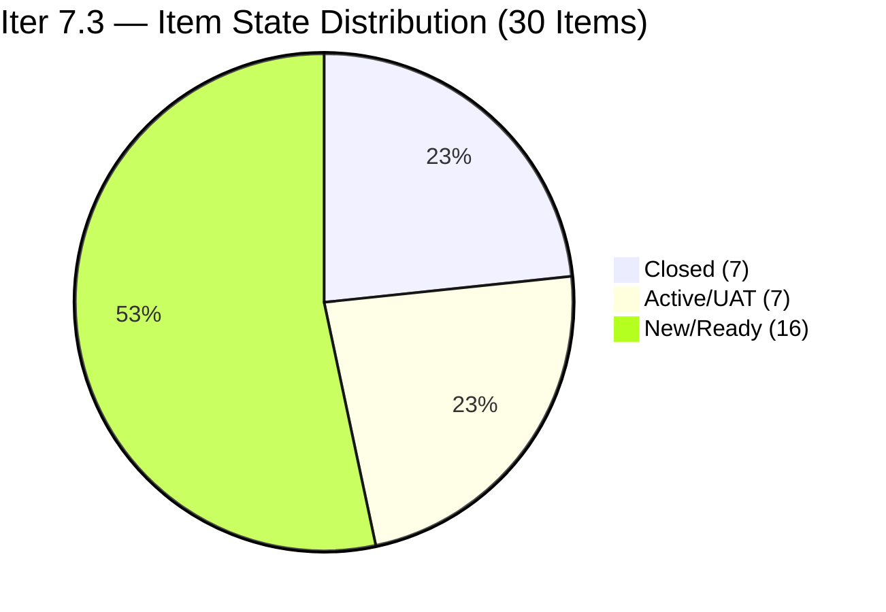
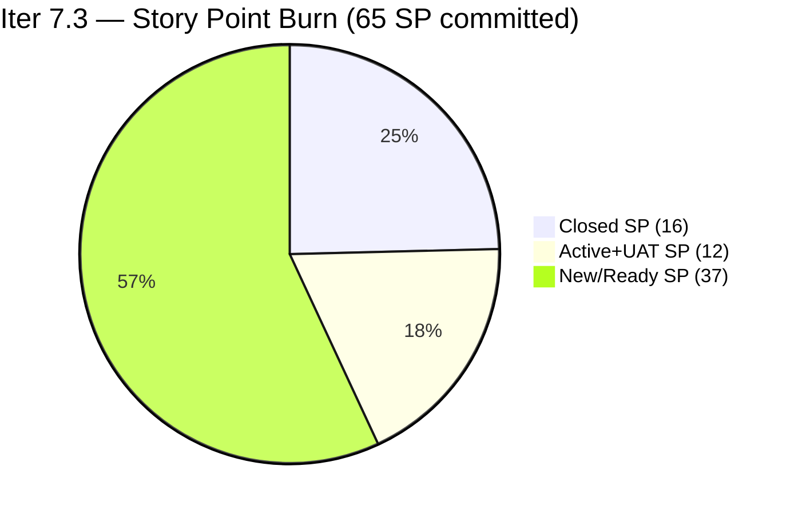
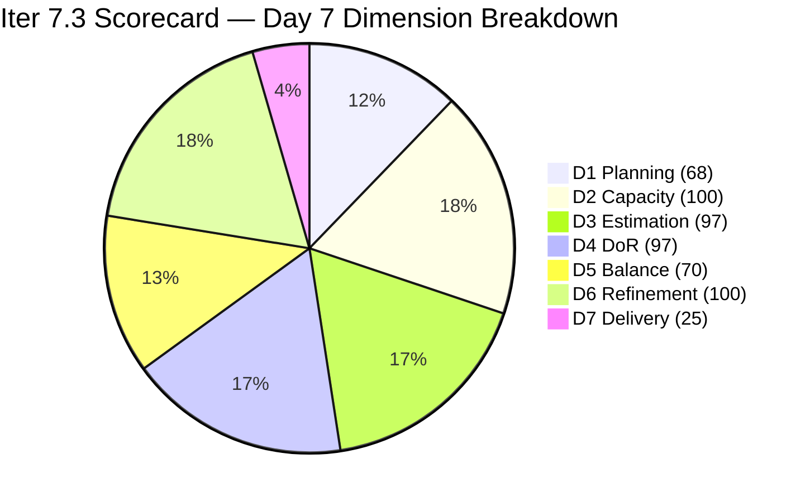

# ADO SAFe Iteration Audit — JIT Operation Team

**Audit #56 | Iteration 7.3 (May 4 – May 17, 2026) | Day 7 of 14**

---

## 1. Audit Metadata

| Field | Value |
|---|---|
| **Audit Date** | May 10, 2026, 02:03 PDT (UTC−7) / 17:03 PHT (UTC+8) |
| **Auditor** | Claude Code (ADO SAFe Audit Agent) |
| **Workspace** | `ado_jit` |
| **ADO Project** | Jairosoft Portfolio (`666bb99a-6acd-4999-bb34-efd0e4ea90dc`) |
| **Team** | JIT Operation Team (`b25e3129-6272-4e54-a3ff-f1ef3c8eeb2c`) |
| **Iteration** | Iteration 7.3 — May 4 to May 17, 2026 |
| **Iteration ID** | `bbaecdec-eeb0-4c8d-999f-6a438eaab331` |
| **Sprint Day** | Day 7 of 14 |
| **Days Remaining** | 7 |
| **Prior Audit** | AUDIT_20260509_0902.md (Audit #55, Iter 7.3 Day 6, Overall 79.9 — Moderate Risk) |
| **Scoring Model** | ADO SAFe v1 (7-dimension rubric) |
| **Overall Score** | **79.5 / 100** |
| **Risk Band** | **Moderate Risk** (60–79.9) |

---

## 2. Executive Summary

JIT Operation Team scores **79.5 / 100 (Moderate Risk)** on Day 7 — a **−0.4 dip from Day 6's 79.9**. No new closures were detected since the two May 9 closures (#203766, #203745 — 5 SP). The score decline is driven by D1: the two items that closed on May 9 are no longer returned by the backlog API, which increases the visible denominator from 42 to 44 while current items remains at 30, dropping D1 from 71.4 to 68.2.

**Key state observations (Day 7 vs. Day 6):**
- No new item closures detected.
- **#203775 "Publish Summer Camp Post"** (Samantha, 1 SP) — remains UAT Testing (ChangedDate: May 8). One closure away from submission.
- **#203905 "ADDU Interns Batch 2 Onboarding"** (Samantha, 1 SP) — remains UAT Testing (ChangedDate: May 7). Also imminent.
- **#203159 "3.2-4 Set-Up Folder Redirection Training"** (Teofilo, 3 SP) — Active since May 8. Training chain delivery pending.
- **#203718 "EBET Additional Trainer Verification"** (Armelita, 2 SP) and **#203758 "EBET Scholarship Guidelines"** (Armelita, 3 SP) — both remain Active.

The team is 0.5 points below the Low Risk threshold (80.0). Closing either UAT item (#203775 or #203905) crosses that line immediately.

**Score change driver:**
- D1 dropped from 71.4 to 68.2 (denominator expanded: visible 42→44 as 2 Day 6 closures exit API without new items entering for Iter 7.3)
- All other dimensions unchanged

---

## 3. Previous Audit Delta

| Dimension | Audit #55 (May 9, Day 6, 79.9) | Audit #56 (May 10, Day 7, 79.5) | Delta | Driver |
|---|---|---|---|---|
| Iteration Planning | 71.4 | **68.2** | **−3.2** | Visible expanded: 42→44 (2 Day 6 closures exit API); current stays 30 |
| Team Capacity | 100.0 | **100.0** | 0.0 | 4/4 contributors with capacity — unchanged |
| Estimation | 96.7 | **96.7** | 0.0 | 29/30; #203250 still 0 SP |
| DoR Compliance | 96.7 | **96.7** | 0.0 | 29/30; #203250 image-only description unchanged |
| Work Item Balance | 70.0 | **70.0** | 0.0 | US 63.3% > 60% → -30; no change |
| Backlog Refinement | 100.0 | **100.0** | 0.0 | All 44 items fresh; 0 stale; 0 untouched |
| Delivery Predictability | 24.6 | **24.6** | 0.0 | No new closures; 16/65 SP closed |
| **Overall** | **79.9** | **79.5** | **−0.4** | D1 denominator expansion from Day 6 closures exiting API |

### D1 Denominator Explanation
- Day 6: API returned 37 items. 25 in Iter 7.3 (23 open + 2 just-closed #203766, #203745). Prior confirmed closed = 5 items. Visible = 37 + 5 = 42. Current = 23 + 2 + 5 = 30. D1 = 30/42 = 71.4.
- Day 7: API returns 37 items. #203766 and #203745 exited API (confirmed closed). 23 open in Iter 7.3 remain. Prior confirmed closed = 7 items total (5 from Days 1–4 + 2 from Day 6). Visible = 37 + 7 = 44. Current = 23 + 7 = 30. D1 = 30/44 = 68.2.

---

## 4. Current Iteration Snapshot

| Attribute | Value |
|---|---|
| **Iteration** | Iteration 7.3 |
| **Sprint Dates** | May 4 – May 17, 2026 (14 days) |
| **Sprint Day** | Day 7 of 14 (50% elapsed) |
| **Days Remaining** | 7 |
| **Backlog API Items (total)** | 37 |
| **Items in Iter 7.3 (open, from API)** | 23 |
| **Confirmed Closed in Iter 7.3** | 7 items (16 SP total) |
| **Total Current Sprint Items** | 30 |
| **Committed SP** | 65 SP (29 estimated items; #203250 = 0 SP) |
| **Closed SP** | 16 SP (24.6% of 65) |
| **Open SP Remaining** | 49 SP |
| **Linear Burn Expectation at Day 7** | 32.5 SP (50% of 65) |
| **Burn Deficit** | −16.5 SP vs. linear pace |
| **Capacity** | Teofilo: 4.8 pts/day (Training); Armelita: 6 pts/day (Documentation); Samantha: 1 pt/day; Grace: 1 pt/day |
| **UAT Items (imminent closure)** | #203775 (Samantha, 1 SP), #203905 (Samantha, 1 SP) |
| **Low Risk Gap** | −0.5 points (79.5 vs. 80.0 threshold) |

---

## 5. Work Item Analysis

### Confirmed Closed in Iter 7.3 (7 items, 16 SP total)

| ID | Title | Type | SP | Closed Day | Assignee |
|---|---|---|---|---|---|
| ~203155~ | 3.2-1 Training (est.) | Training | ~2~ | Day 1–2 | Teofilo |
| ~203156~ | 3.2-2 Training (est.) | Training | ~3~ | Day 1–3 | Teofilo |
| ~203157~ | 3.2-2 Set-Up DNS Training | Training | 3 | May 7 (Day 4) | Teofilo |
| ~203158~ | 3.2-3 Set-up Remote Desktop Training | Training | 3 | May 7 (Day 4) | Teofilo |
| **203766** | CSS Batch 4 Marketing for May 5–8 | User Story | 3 | May 9 (Day 6) | Armelita |
| **203745** | T2 MIS Enrollment | User Story | 2 | May 9 (Day 6) | Armelita |

> Note: #203155 and #203156 IDs are estimated; aggregate confirmed = 16 SP across 7 closed items.

### UAT Testing — Imminent Closure

| ID | Title | State | SP | Assignee | ChangedDate |
|---|---|---|---|---|---|
| **203775** | Publish Summer Camp Post on Facebook | UAT Testing | 1 | Samantha Babael | May 8 |
| **203905** | ADDU Interns Batch 2 Onboarding | UAT Testing | 1 | Samantha Babael | May 7 |

Closing both raises closed SP from 16 to 18, D7 from 24.6% to 27.7%.

### Active Items (5 open, 11 SP)

| ID | Title | Type | SP | Assignee | Changed | DoR |
|---|---|---|---|---|---|---|
| 203159 | 3.2-4 Set-Up Folder Redirection Training | Training | 3 | Teofilo | May 8 | Pass |
| 203718 | EBET Additional Trainer Verification | User Story | 2 | Armelita | May 5 | Pass |
| 203758 | EBET Scholarship Guidelines | User Story | 3 | Armelita | May 7 | Pass |
| 203595 | JIT Finance Collection Policy | User Story | 2 | Grace | May 6 | Pass |
| 203224 | Convert SAFe MCCs to New Forms | User Story | 3 | Grace | May 6 | Pass |
| **203250** | Identified Team Members for Claude 4 Course | Spike | **0** | Armelita | May 7 | **Fail** |

> #203250: Description is image-only (no parseable text ≥ 30 non-whitespace chars). SP = 0. Active since May 7 (unchanged from Day 6).

### New / Ready Items (13 open items, 29 SP — Iter 7.3)

| ID | Title | Type | State | SP | Assignee | Changed | DoR |
|---|---|---|---|---|---|---|---|
| 203739 | Python Marketing Activities May 11–15 | User Story | New | 2 | Armelita | May 4 | Pass |
| 203728 | Bubble MCC Marketing for May 11 to 15 | User Story | New | 3 | Armelita | May 4 | Pass |
| 203748 | Enrollment Report CSS Batch 3 | User Story | New | 2 | Armelita | May 4 | Pass |
| 203750 | Email Confirmation from UIC Dean | User Story | New | 1 | Armelita | May 4 | Pass |
| 203753 | Email Confirmation from HCDC Dean | User Story | New | 1 | Armelita | May 4 | Pass |
| 203763 | EBET Scholarship MOU | User Story | New | 2 | Armelita | May 4 | Pass |
| 203767 | CSS Batch 4 Marketing for May 11–15 | User Story | New | 3 | Armelita | May 4 | Pass |
| 203772 | Publish Social Media Posts (CSS Batch 4) | User Story | Ready for Dev | 1 | Samantha | May 6 | Pass |
| 203773 | Publish Social Media Post for Python (FB) | User Story | Ready for Dev | 1 | Samantha | May 6 | Pass |
| 203774 | Publish Social Media Post for Bubble.io (FB) | User Story | Ready for Dev | 1 | Samantha | May 6 | Pass |
| 203985 | Follow Through SEC AC Requirement | User Story | New | 2 | Grace | May 8 | Pass |
| 203242 | IT7.3 Tech Talk — AI Tools Demonstration | Spike | New | 1 | Armelita | May 6 | Pass |
| 203160 | 3.2-5 Set-up Printer Deployment Training | Training | New | 3 | Teofilo | May 7 | Pass |
| 203161 | 3.3-1 Server Pre-Deployment Training | Training | New | 3 | Teofilo | May 7 | Pass |
| 203162 | 3.3-2 Server Security and Reporting Training | Training | New | 3 | Teofilo | May 6 | Pass |

### Type Distribution (30 current sprint items)

| Type | Count | Share | Impact |
|---|---|---|---|
| User Story | 19 (17 open + 2 closed) | 63.3% | Dominant (>60%) → -30 |
| Training | 9 (4 open + 5 closed) | 30.0% | No additional penalty |
| Spike | 2 | 6.7% | <40% → no additional penalty |

### DoR Assessment (30 current items)

| Gate | Pass | Fail | Rate |
|---|---|---|---|
| Description ≥ 30 non-whitespace chars | 29 | 1 (#203250 image-only) | 96.7% |
| Acceptance Criteria ≥ 20 non-whitespace chars | 29 | 1 (#203250 — AC passes but description fails) | 96.7% |
| **Combined DoR (both gates)** | **29** | **1** | **96.7%** |

---

## 6. SAFe Compliance Scorecard

| Dimension | Score | Evidence | Notes |
|---|---|---|---|
| 1. Iteration Planning | 68.2 | 30 current / 44 visible = 68.2% | Denominator expanded: 7 closed + 37 API. 14 future-iteration items in backlog |
| 2. Team Capacity | 100.0 | 4/4 contributors with capacity | Teofilo 4.8; Armelita 6; Samantha 1; Grace 1 pts/day |
| 3. Estimation | 96.7 | 29/30 with SP > 0 | #203250 has 0 SP (Active, image-only description) |
| 4. DoR Compliance | 96.7 | 29/30 pass both gates | #203250 description is image-only — fails ≥30 non-whitespace chars |
| 5. Work Item Balance | 70.0 | US present; dominant 63.3% > 60% → -30; Spike 6.7% < 40% | Base 100 − 30 = 70 |
| 6. Backlog Refinement | 100.0 | 44/44 items fresh (Apr–May 2026); stale_90=0; stale_180=0; untouched=0 | All Iter 7.3 items last changed May 4–May 9 |
| 7. Delivery Predictability | 24.6 | 16 SP closed / 65 SP committed = 24.6% | Day 7; no new closures since Day 6; 2 UAT items imminent |
| **Overall** | **79.5** | (68.2+100+96.7+96.7+70+100+24.6) / 7 = 556.2 / 7 | **Moderate Risk** (60–79.9) |

### Score Computation
```
D1 = 30 / 44 × 100 = 68.18 → 68.2
D2 = 4 / 4  × 100  = 100.0
D3 = 29 / 30 × 100 = 96.67 → 96.7
D4 = 29 / 30 × 100 = 96.67 → 96.7
D5 = 100 − 30      = 70.0   (US dominant 63.3%)
D6 = 100.0 − 0     = 100.0  (all fresh; 0 untouched)
D7 = 16 / 65 × 100 = 24.62 → 24.6

Overall = (68.2 + 100 + 96.7 + 96.7 + 70 + 100 + 24.6) / 7 = 556.2 / 7 = 79.46 → 79.5
```

---

## 7. Dimension Findings

### D1 — Iteration Planning: 68.2 (Moderate — declining)
```
visible_root_backlog_items   = 44 (37 from API + 7 confirmed closed)
current_iteration_root_items = 30 (23 open in API for Iter 7.3 + 7 confirmed closed)
D1 = (30 / 44) × 100 = 68.2
```
D1 dropped 3.2 points from Day 6 (71.4) due to the natural denominator expansion: the 2 May 9 closures (#203766, #203745) exited the backlog API while no new items were added to Iter 7.3, expanding visible from 42 to 44.

The 14 non-current items remain in future iterations: Iter 7.4 (10 items: 200767, 200768, 203805, 203806, 203807, 203808, 203809, 203986, 203989, 203243), Iter 7.5 (3 items: 200771, 203244, 203245), and PI8 (1 item: 200766). This forward-planning pipeline is appropriate for Armelita's long-horizon planning approach.

### D2 — Team Capacity: 100.0 ✅
All four contributors with sprint work have positive daily capacity confirmed:
- **Teofilo Limpag**: 4.8 pts/day (Training)
- **Armelita**: 6.0 pts/day (Documentation)
- **Samantha Babael**: 1.0 pts/day (Documentation)
- **Grace**: 1.0 pts/day (Documentation)

D2 = 4/4 = 100%.

### D3 — Estimation: 96.7
```
point_eligible_current_items = 30
estimated_current_items      = 29 (#203250 has 0 SP)
D3 = (29 / 30) × 100 = 96.7
```
#203250 "Identified Team Members for Claude 4 Course" remains at 0 SP in Active state. This item has been unestimated for 6 consecutive audit days. Assigning 2 SP and fixing the description restores D3 and D4 to 100% each — a quick +0.4 points to Overall.

### D4 — DoR Compliance: 96.7
```
current_iteration_root_items = 30
dor_compliant_current_items  = 29
D4 = (29 / 30) × 100 = 96.7
```
#203250 description contains only an embedded PNG image with no parseable text. The Acceptance Criteria is well-structured (14-item list with login steps, course names, and participant list) and passes. Only the Description gate fails. Replacing the image with ≥30 non-whitespace characters of text resolves the DoR failure immediately.

### D5 — Work Item Balance: 70.0 (Moderate)
```
User Story present: Yes → +0 penalty
US: 19/30 = 63.3% > 60% → -30
Spike: 2/30 = 6.7% < 40% → +0
Training: 9/30 = 30.0%
D5 = 100 − 30 = 70.0
```
The Training work type (30%) provides meaningful diversity alongside User Stories. Two Spikes add research coverage. The team's mixed operational mandate (training delivery + marketing + compliance + admin) is reflected in this balanced type mix.

### D6 — Backlog Refinement: 100.0 ✅
```
visible_root_backlog_items = 44
fresh_visible_root_items   = 44 (all changed Apr 6 – May 9, within 45-day window after Mar 26)
stale_90 (before Feb 8, 2026): 0 items → no penalty
stale_180 (before Nov 10, 2025): 0 items → no penalty
untouched_current_items (before May 4): 0 — all Iter 7.3 items changed May 4 or later
D6 = 100.0 − 0 = 100.0
```
Perfect backlog hygiene maintained through Day 7. Oldest item in the visible backlog is #200767 (Apr 6, 2026) — still within the 45-day fresh window.

### D7 — Delivery Predictability: 24.6 (Sprint halfway — acceleration needed)
```
committed_story_points = 65 (29 estimated items)
closed_story_points    = 16 (7 closed items confirmed)
D7 = (16 / 65) × 100 = 24.6
```
At Day 7 of 14 (50% sprint elapsed), linear expectation = 65 × 0.50 = 32.5 SP. Actual = 16 SP (49.2% of linear pace). Burn deficit = −16.5 SP.

**Path to Low Risk (≥80.0):**
- Current Overall = 79.5. Need +0.5 points.
- Closing #203775 (1 SP, UAT Testing) → D7 = 17/65 = 26.2% → Overall ≈ 79.7 (not yet ≥80)
- Closing #203775 + #203905 (2 SP total) → D7 = 18/65 = 27.7% → Overall ≈ 79.7 still
- Need approximately 3 more closures to clear 80.0 threshold due to D1 decline

**Revised path to Low Risk:** Closing #203775 + #203905 + #203159 (Training, 3 SP, Active) → D7 = 21/65 = 32.3% → Overall ≈ 80.1 ✅

---

## 8. Risks and Bottlenecks





| Risk | Severity | Status | Action |
|---|---|---|---|
| **Low Risk gap: −0.5 point** | High | Requires 3 SP of closures (vs. 2 SP yesterday) | Close #203775 + #203905 + #203159 for ≥80.0 |
| **D1 declining (68.2 and dropping)** | High | Structural as closed items exit API and expand denominator | Accept structural decline; focus on D7 gains |
| **Burn deficit: −16.5 SP at halfway** | High | 49 SP remain in 7 days; needs ~7 SP/day | Activate Armelita's New queue immediately |
| **#203250 unestimated + DoR fail** | Moderate | Persistent 6 days; SP=0; image-only | Fix description text + add 2 SP today |
| **Armelita overloaded (12+ open items)** | Moderate | Structural concentration | No mid-sprint fix; prioritize closure chain |
| **Teofilo Training chain behind** | Moderate | 3.2-4 Active; 3 more New (3.2-5, 3.3-1, 3.3-2) | Complete 3.2-4 today to unblock chain |
| **No Iteration Goal defined** | Low | Persistent issue | Define in next sprint planning |

---

## 9. Prioritized Recommendations

1. **[Immediate] Close #203775 "Publish Summer Camp Post" and #203905 "ADDU Interns Onboarding"** — Both are in UAT Testing (Samantha, 1 SP each). Closing both adds 2 SP to D7 (18/65 = 27.7%). Combined with #203159, this crosses the Low Risk threshold.

2. **[Today] Close #203159 "3.2-4 Folder Redirection Training"** (Teofilo, 3 SP, Active) — This is the next Training chain item and has been Active since May 8. Closing it adds 3 SP (D7 = 21/65 = 32.3%). Combined with the two UAT items, the three closures bring Overall to approximately 80.1, crossing Low Risk.

3. **[Today] Fix #203250 DoR and Estimation** — Replace the image-only description with ≥30 non-whitespace characters of text. Add 2 SP. This immediately restores D3 and D4 to 100.0 each, adding approximately +0.6 to Overall.

4. **[This Sprint] Armelita to begin closing New queue** — #203739 (Python Marketing, 2 SP), #203728 (Bubble MCC Marketing, 3 SP), #203748 (CSS Enrollment Report, 2 SP) are all New and within Armelita's mandate. Activating and closing these items (7 SP) in the next 3 days significantly extends the burn rate.

5. **[This Sprint] Complete Teofilo's Training chain** — After #203159 closes, the sequence is 3.2-5 (203160, 3 SP) → 3.3-1 (203161, 3 SP) → 3.3-2 (203162, 3 SP) = 9 SP. Completing the chain pushes D7 to (21+9)/65 = 46.2%, materially improving the final sprint score.

6. **[Next Sprint] Define Iteration Goal** — A goal such as "Complete CSS NC II training module 3.2–3.3, advance EBET scholarship to MOU stage, and deliver Phase 2 CSS/Python/Bubble marketing" aligns team execution with PI 7 objectives.

---

## 10. Evidence Gaps and Limitations

| Gap | Impact | Mitigation |
|---|---|---|
| Prior closed Training items (Days 1–4): exact IDs of first 2 items | Low | Aggregate 16 SP confirmed; items 203157 and 203158 confirmed; first 2 use estimated IDs |
| #203250 SP=0 and description | Low | Confirmed from live ADO API; image-only description verified |
| Iteration Goal field | Low | Not surfaced via ADO standard API; manual check recommended |
| PI Objectives linkage | Low | Not queried; known persistent gap |

---

## 11. Score Trend — Iteration 7.3



| Day | Score | Band | Key Event |
|---|---|---|---|
| Day 1 | 73.5 | Moderate | Sprint launched |
| Day 2 | 75.1 | Moderate | Early closures |
| Day 3 | 76.7 | Moderate | Training burst |
| Day 4 | 79.5 | Moderate | 2 Training closures (Teofilo) |
| Day 5 | 78.7 | Moderate | Score dip from expanded denominator |
| Day 6 | 79.9 | Moderate | +1.2 from #203766 (3 SP) + #203745 (2 SP) |
| Day 7 | **79.5** | **Moderate** | −0.4 from D1 denominator expansion; no new closures |

> Low Risk threshold (80.0): **0.5 points away**. Three closures (#203775 + #203905 + #203159 = 5 SP) cross the line. D1 will continue declining as more items close; D7 gains must offset this.

---

*Report generated: May 10, 2026, 02:03 PDT | Workspace: ado_jit | Auditor: Claude Code ADO SAFe Audit Agent*
