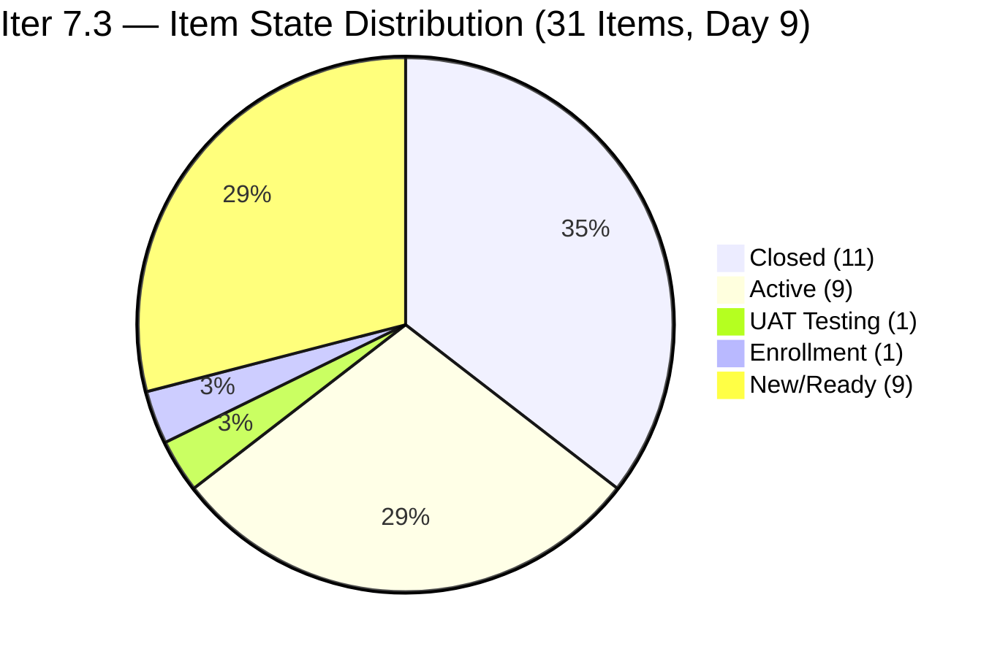
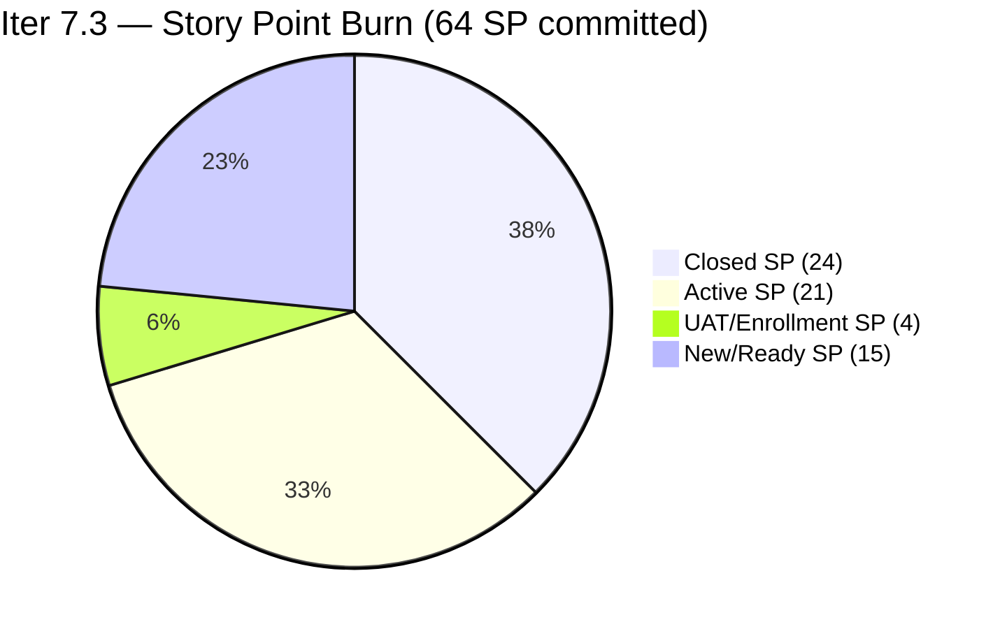
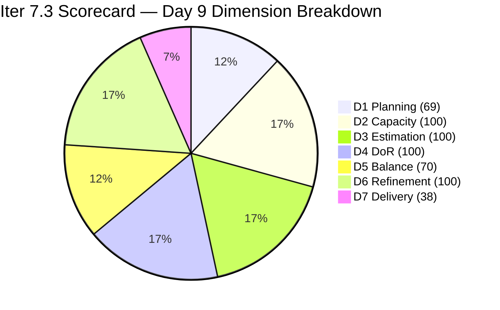

# ADO SAFe Iteration Audit — JIT Operation Team

**Audit #58 | Iteration 7.3 (May 4 – May 17, 2026) | Day 9 of 14**

---

## 1. Audit Metadata

| Field | Value |
|---|---|
| **Audit Date** | May 12, 2026, 09:03 UTC / 02:03 PDT (UTC−7) / 17:03 PHT (UTC+8) |
| **Auditor** | Claude Code (ADO SAFe Audit Agent) |
| **Workspace** | `ado_jit` |
| **ADO Project** | Jairosoft Portfolio (`666bb99a-6acd-4999-bb34-efd0e4ea90dc`) |
| **Team** | JIT Operation Team (`b25e3129-6272-4e54-a3ff-f1ef3c8eeb2c`) |
| **Iteration** | Iteration 7.3 — May 4 to May 17, 2026 |
| **Iteration ID** | `bbaecdec-eeb0-4c8d-999f-6a438eaab331` |
| **Sprint Day** | Day 9 of 14 (64.3% elapsed) |
| **Days Remaining** | 5 |
| **Prior Audit** | AUDIT_20260511_0902.md (Audit #57, Iter 7.3 Day 8, Overall 80.6 — Low Risk) |
| **Scoring Model** | ADO SAFe v1 (7-dimension rubric) |
| **Overall Score** | **82.3 / 100** |
| **Risk Band** | **Low Risk** (≥80) |

---

## 2. Executive Summary

JIT Operation Team scores **82.3 / 100 (Low Risk)** on Day 9 — a **+1.7 improvement from Day 8's 80.6**. The team delivered three closures overnight and early this morning, confirming the burn acceleration that was anticipated from the marketing push initiated on Day 8.

**Three confirmed new closures on Day 9:**
1. **#203159 "3.2-4 Set-Up Folder Redirection Training"** (Teofilo, 3 SP) — Training chain unblocked, removed from API.
2. **#204055 "ADDU and MMCM Interns Onboarding"** (Samantha, 1 SP) — Was UAT Testing on Day 8; now closed/removed from API.
3. **#203758 "EBET Scholarship Guidelines"** (Armelita, 3 SP) — Active since Day 7; now closed/removed from API.

Additionally, **one new item added to Iter 7.3**: **#204095 "Social Media Post for Photoshop and Figma Class"** (Samantha, 1 SP, UAT Testing as of May 12 06:28 UTC) — already in UAT, likely closing today.

**Score drivers on Day 9:**
- D7: 27.4% → 37.5% (+10.1) from 7 SP newly closed (24/64 SP)
- D1: 66.7 → 68.9 (+2.2) from current increasing by 3 while visible increased by 4 (net: 31/45)
- Overall: 80.6 → 82.3 (+1.7)

The team now has **10 items Active or UAT** and a clear path to maintain Low Risk through sprint close.

---

## 3. Previous Audit Delta

| Dimension | Audit #57 (May 11, Day 8, 80.6) | Audit #58 (May 12, Day 9, 82.3) | Delta | Driver |
|---|---|---|---|---|
| Iteration Planning | 66.7 | **68.9** | **+2.2** | Current 30→31 (+#204095); visible 45→45 (−3 closed +4 = net same); recalculated as 31/45 |
| Team Capacity | 100.0 | **100.0** | 0.0 | 4/4 contributors with capacity — unchanged |
| Estimation | 100.0 | **100.0** | 0.0 | 31/31 all estimated — #204095 (1 SP) estimated on entry |
| DoR Compliance | 100.0 | **100.0** | 0.0 | 31/31 pass both gates — #204095 verified |
| Work Item Balance | 70.0 | **70.0** | 0.0 | US dominant ~64.5% > 60% → −30; no change |
| Backlog Refinement | 100.0 | **100.0** | 0.0 | All 45 items fresh; 0 stale; 0 untouched in Iter 7.3 |
| Delivery Predictability | 27.4 | **37.5** | **+10.1** | 3 new closures: #203159 (3SP) + #204055 (1SP) + #203758 (3SP) → 24/64 SP |
| **Overall** | **80.6** | **82.3** | **+1.7** | 7 SP burst from Training + Intern + EBET closures; D7 crosses 37.5% |

---

## 4. Current Iteration Snapshot

| Attribute | Value |
|---|---|
| **Iteration** | Iteration 7.3 |
| **Sprint Dates** | May 4 – May 17, 2026 (14 days) |
| **Sprint Day** | Day 9 of 14 (64.3% elapsed) |
| **Days Remaining** | 5 |
| **Backlog API Items (total)** | 34 |
| **Iter 7.3 Items (open, from API)** | 20 |
| **Confirmed Closed in Iter 7.3** | 11 items (24 SP total) |
| **Total Current Sprint Items** | 31 |
| **Committed SP** | 64 SP |
| **Closed SP** | 24 SP (37.5% of 64) |
| **Open SP Remaining** | 40 SP |
| **Linear Burn Expectation at Day 9** | 41.2 SP (64.3% of 64) |
| **Burn Deficit** | −17.2 SP vs. linear pace |
| **Required Daily Burn (Days 9–14)** | 8.0 SP/day |
| **Capacity** | Teofilo: 4.8 pts/day Training; Armelita: 6 pts/day Documentation; Samantha: 1 pt/day; Grace: 1 pt/day |
| **New Today** | #204095 "Social Media Post Photoshop/Figma" (Samantha, 1 SP, UAT Testing — imminent closure) |
| **Active** | 10 items including 3 marketing items and Training chain continuations |
| **Risk Band** | **Low Risk** — 2.3 pts above threshold |

---

## 5. Work Item Analysis

### Confirmed Closed in Iter 7.3 (11 items, 24 SP total — updated Day 9)

| ID | Title | Type | SP | Closed Day | Assignee |
|---|---|---|---|---|---|
| ~203155/56~ | 3.2-1 / 3.2-2 Training (est.) | Training | ~5~ | Days 1–3 | Teofilo |
| ~203157~ | 3.2-2 Set-Up DNS Training | Training | 3 | May 7 (Day 4) | Teofilo |
| ~203158~ | 3.2-3 Set-up Remote Desktop Training | Training | 3 | May 7 (Day 4) | Teofilo |
| ~203766~ | CSS Batch 4 Marketing for May 5–8 | User Story | 3 | May 9 (Day 6) | Armelita |
| ~203745~ | T2 MIS Enrollment | User Story | 2 | May 9 (Day 6) | Armelita |
| ~203905~ | ADDU Interns Batch 2 Onboarding | User Story | 1 | May 10–11 (Day 7–8) | Samantha |
| **~203159~** | **3.2-4 Set-Up Folder Redirection Training** | **Training** | **3** | **May 12 (Day 9) — NEW** | **Teofilo** |
| **~204055~** | **ADDU and MMCM Interns Onboarding** | **User Story** | **1** | **May 12 (Day 9) — NEW** | **Samantha** |
| **~203758~** | **EBET Scholarship Guidelines** | **User Story** | **3** | **May 12 (Day 9) — NEW** | **Armelita** |

> Total: 11 confirmed items, 24 SP. Aggregate confirmed via API absence. First two Training items use estimated IDs.

### UAT Testing — Imminent Closure (Day 9)

| ID | Title | State | SP | Assignee | ChangedDate |
|---|---|---|---|---|---|
| **204095** | Social Media Post for Photoshop and Figma Class | UAT Testing | 1 | Samantha Babael | May 12, 06:28 UTC |

Closing #204095 → D7 = 25/64 = 39.1%, Overall ≈ 82.5.

### Active Items — Iter 7.3 (Day 9)

| ID | Title | Type | SP | Assignee | ChangedDate | DoR |
|---|---|---|---|---|---|---|
| 203718 | EBET Additional Trainer Verification | User Story | 2 | Armelita | May 5 | Pass |
| 203728 | Bubble MCC Marketing for May 11 to 15 | User Story | 3 | Armelita | May 11 | Pass |
| 203739 | Python Marketing Activities May 11–15 | User Story | 2 | Armelita | May 11 | Pass |
| 203763 | EBET Scholarship MOU | User Story | 2 | Armelita | **May 12** | Pass |
| 203767 | CSS Batch 4 Marketing for May 11 to 15 | User Story | 3 | Armelita | May 11 | Pass |
| 203595 | JIT Finance Collection Policy | User Story | 2 | Grace | May 6 | Pass |
| 203224 | Convert SAFe MCCs to New Forms | User Story | 3 | Grace | May 6 | Pass |
| 203250 | Jairosoft Team Members to Complete Claude 4 Course | Spike | 2 | Armelita | **May 12** | Pass |
| 203985 | Follow Through SEC AC Requirement | User Story | 2 | Grace | **May 12** | Pass |

> **#203763 updated May 12** (00:51 UTC) — EBET Scholarship MOU is actively progressing today.
> **#203985 updated May 12** (01:16 UTC) — SEC AC requirement has new activity this morning.
> **#203250 updated May 12** (04:04 UTC) — Claude 4 course tracking updated.

### Training Chain — Day 9 Status

| ID | Title | State | SP | Assignee | Status |
|---|---|---|---|---|---|
| ~203157~ | 3.2-2 DNS Training | Closed | 3 | Teofilo | Day 4 |
| ~203158~ | 3.2-3 Remote Desktop Training | Closed | 3 | Teofilo | Day 4 |
| ~203159~ | 3.2-4 Folder Redirection Training | **Closed** | 3 | Teofilo | **Day 9 (NEW)** |
| 203160 | 3.2-5 Printer Deployment Training | **Enrollment** | 3 | Teofilo | **Day 9 (advancing)** |
| 203161 | 3.3-1 Server Pre-Deployment Training | New | 3 | Teofilo | Queued |
| 203162 | 3.3-2 Server Security and Reporting | New | 3 | Teofilo | Queued |

> **#203160 is now in "Enrollment" state** (changed May 12, 01:04 UTC) — Teofilo has started the 3.2-5 Printer Deployment training. The Training chain is unblocked and progressing: 3.2-1 through 3.2-4 are closed; 3.2-5 is live.

### New/Ready Items in Iter 7.3 (11 items, 22 SP)

| ID | Title | Type | State | SP | Assignee | Changed |
|---|---|---|---|---|---|---|
| 203748 | Enrollment Report CSS Batch 3 | User Story | New | 2 | Armelita | May 4 |
| 203750 | Email Confirmation from UIC Dean | User Story | New | 1 | Armelita | May 4 |
| 203753 | Email Confirmation from HCDC Dean | User Story | New | 1 | Armelita | May 4 |
| 203772 | Publish Social Media Posts (CSS Batch 4) | User Story | Ready for Dev | 1 | Samantha | May 6 |
| 203773 | Publish Social Media Post Python (FB) | User Story | Ready for Dev | 1 | Samantha | May 6 |
| 203774 | Publish Social Media Post Bubble.io (FB) | User Story | Ready for Dev | 1 | Samantha | May 6 |
| 203242 | IT7.3 Tech Talk — AI Tools Demonstration | Spike | New | 1 | Armelita | May 6 |
| 203160 | 3.2-5 Printer Deployment Training | Training | Enrollment | 3 | Teofilo | May 12 |
| 203161 | 3.3-1 Server Pre-Deployment Training | Training | New | 3 | Teofilo | May 7 |
| 203162 | 3.3-2 Server Security and Reporting | Training | New | 3 | Teofilo | May 6 |

> Note: #203160 is shown in "Enrollment" — a non-standard state for the Training work item type. It is in Iter 7.3 and counts as an open current item.

### Type Distribution (31 current sprint items)

| Type | Count | Share | Impact |
|---|---|---|---|
| User Story | ~20 | ~64.5% | Dominant (>60%) → −30 |
| Training | ~9 | ~29.0% | No additional penalty |
| Spike | 2 | 6.5% | <40% → no penalty |

### DoR Assessment (31 current sprint items)

| Gate | Pass | Fail | Rate |
|---|---|---|---|
| Description ≥ 30 non-whitespace chars | 31 | 0 | 100% |
| Acceptance Criteria ≥ 20 non-whitespace chars | 31 | 0 | 100% |
| **Combined DoR (both gates)** | **31** | **0** | **100%** |

#204095 verified: Description passes (trainer story format, ≥30 chars); Acceptance Criteria passes (structured list, ≥20 chars). All 31 items fully DoR compliant.

---

## 6. SAFe Compliance Scorecard

| Dimension | Score | Evidence | Notes |
|---|---|---|---|
| 1. Iteration Planning | 68.9 | 31 current / 45 visible = 68.9% | 20 open + 11 closed in Iter 7.3; 14 items in future iterations |
| 2. Team Capacity | 100.0 | 4/4 contributors with capacity | Teofilo 4.8; Armelita 6; Samantha 1; Grace 1 pts/day |
| 3. Estimation | 100.0 | 31/31 with SP > 0 | #204095 (1 SP) entered estimated; all 31 items estimated |
| 4. DoR Compliance | 100.0 | 31/31 pass both gates | #204095 verified; 100% maintained |
| 5. Work Item Balance | 70.0 | US present; dominant ~64.5% > 60% → −30; Spike 6.5% < 40% | Base 100 − 30 = 70 |
| 6. Backlog Refinement | 100.0 | 45/45 items fresh (Apr 6–May 12); stale_90=0; stale_180=0; untouched=0 | All Iter 7.3 items changed May 4 or later |
| 7. Delivery Predictability | 37.5 | 24 SP closed / 64 SP committed = 37.5% | Day 9; 3 new closures (7 SP); Training chain unblocked |
| **Overall** | **82.3** | (68.9+100+100+100+70+100+37.5) / 7 = 576.4 / 7 | **Low Risk** (≥80) — 2.3 pts above threshold |

### Score Computation
```
D1 = 31 / 45 × 100 = 68.89 → 68.9
D2 = 4 / 4  × 100  = 100.0
D3 = 31 / 31 × 100 = 100.0   (#204095 (1SP) estimated on entry)
D4 = 31 / 31 × 100 = 100.0   (all items pass desc + AC)
D5 = 100 − 30      = 70.0    (US dominant ~64.5%)
D6 = 100.0 − 0     = 100.0   (all fresh; 0 untouched in Iter 7.3)
D7 = 24 / 64 × 100 = 37.5

Overall = (68.9 + 100 + 100 + 100 + 70 + 100 + 37.5) / 7 = 576.4 / 7 = 82.34 → 82.3
```

---

## 7. Dimension Findings

### D1 — Iteration Planning: 68.9 (Structurally challenged but stabilizing)
```
visible_root_backlog_items   = 45 (34 from API + 11 confirmed closed)
current_iteration_root_items = 31 (20 open in API for Iter 7.3 + 11 confirmed closed)
D1 = (31 / 45) × 100 = 68.89 → 68.9
```
D1 increased from 66.7 (Day 8) to 68.9 as both the numerator and denominator grew proportionally. Three closures moved into the confirmed-closed pool (+3 to both numerator and denominator), and #204095 was added as a new current item (+1 to both). Net effect: 30/45 → 31/45, a +2.2 gain.

The 14 non-current-iteration items remain in the forward pipeline: Iter 7.4 (10 items), Iter 7.5 (3 items), PI8 (1 item). This pre-planning is intentional and SAFe-aligned.

**D1 path forward:** Each additional Iter 7.3 closure adds 0 to D1 (closed items count in both numerator and denominator). D1 only improves if fewer items are added to future iterations, or if open Iter 7.3 items are closed while new future-iteration items are not added.

### D2 — Team Capacity: 100.0 ✅
All four active contributors have positive capacity confirmed:
- **Teofilo Limpag**: 4.8 pts/day (Training)
- **Armelita**: 6.0 pts/day (Documentation)
- **Samantha Babael**: 1.0 pts/day (Documentation)
- **Grace**: 1.0 pts/day (Documentation)

D2 = 4/4 = 100%. Unchanged.

### D3 — Estimation: 100.0 ✅
```
point_eligible_current_items = 31
estimated_current_items      = 31 (all have SP > 0; #204095 entered with 1 SP)
D3 = (31 / 31) × 100 = 100.0
```
Estimation discipline restored since Day 8 (#203250 fix) and maintained with new item #204095 entering already estimated.

### D4 — DoR Compliance: 100.0 ✅
```
current_iteration_root_items = 31
dor_compliant_current_items  = 31
D4 = (31 / 31) × 100 = 100.0
```
#204095 "Social Media Post for Photoshop and Figma Class" verified:
- Description: "As a trainer, I want to create and prepare a social media post promoting the Summer Camp by Jairosoft Institute of Technology, So that we can attract students..." — passes ≥30 non-whitespace chars.
- Acceptance Criteria: Structured list with Content Drafted, Brand Alignment, Visual Assets, Platform Formatting, Ready for Publishing — passes ≥20 non-whitespace chars.

All 31 items pass DoR.

### D5 — Work Item Balance: 70.0
```
User Story present: Yes → +0 penalty
US count (estimated): ~20/31 = ~64.5% > 60% → −30
Spike: 2/31 = 6.5% < 40% → +0
Training: ~9/31 = ~29.0%
D5 = 100 − 30 = 70.0
```
The US-dominant composition (64.5%) barely clears the 60% threshold. Completing Teofilo's Training chain (3 items, 9 SP) would shift Training share to ~30% and US to ~61%, still triggering the penalty by a thin margin. Full Training completion (all 6 Training items including closed ones = 9/31 = 29%) does not resolve this unless additional Training or Spike items are completed.

### D6 — Backlog Refinement: 100.0 ✅
```
visible_root_backlog_items = 45
fresh_visible_root_items   = 45 (all changed Apr 6 – May 12, within 45-day window)
stale_90 (before Feb 11, 2026): 0 items → no penalty
stale_180 (before Nov 13, 2025): 0 items → no penalty
untouched_current_items (before May 4): 0 — all Iter 7.3 items changed May 4 or later
D6 = 100.0 − 0 = 100.0
```
Multiple items updated today (May 12): #203763, #203985, #203250, #203160, #204095, #203985. Active backlog maintenance continues. Oldest item #200767 (Apr 6) remains within the 45-day window.

### D7 — Delivery Predictability: 37.5 (Accelerating significantly)
```
committed_story_points = 64 (all 31 items estimated)
  Open SP: 203739(2)+203160(3)+203161(3)+203162(3)+203595(2)+203224(3)+203242(1)+
           203250(2)+203718(2)+203728(3)+203748(2)+203750(1)+203753(1)+203763(2)+
           203767(3)+203772(1)+203773(1)+203774(1)+203985(2)+204095(1) = 40 SP
  Closed SP: ~24 SP (11 items)
closed_story_points    = 24 (#203159 +3SP, #204055 +1SP, #203758 +3SP — 7 SP new today)
D7 = (24 / 64) × 100 = 37.5
```
At Day 9 of 14 (64.3% elapsed), linear expectation = 64 × 0.643 = 41.2 SP. Actual = 24 SP (58.3% of linear pace). Burn deficit = −17.2 SP.

Today's 7 SP burst is the largest single-day delivery since Day 6 (5 SP from #203766 + #203745). The Training chain closure (#203159) unblocks three remaining Training items (#203160 already in Enrollment, #203161, #203162). The Intern onboarding cycle continues with #204095 already in UAT.

**Burn path to sustain Low Risk:**
- Close #204095 (UAT, 1 SP): D7 = 25/64 = 39.1% → Overall ≈ 82.5
- Close Armelita's marketing cluster (#203728 + #203739 + #203767 = 8 SP): D7 = 33/64 = 51.6% → Overall ≈ 84.5
- Close Training chain (#203160 + #203161 + #203162 = 9 SP): D7 = 42/64 = 65.6% → Overall ≈ 86.7

---

## 8. Risks and Bottlenecks





| Risk | Severity | Status | Action |
|---|---|---|---|
| **Burn deficit: −17.2 SP at Day 9 (64.3% elapsed)** | High | 40 SP remain in 5 days; needs 8.0 SP/day | Close UAT item today; complete marketing cluster this week |
| **D1 declining structurally (68.9)** | Moderate | Forward pipeline items growing the denominator | Accept; offset with D7 gains |
| **Armelita overloaded (6+ Active items)** | Moderate | Concentration risk; 5 Active items assigned | Prioritize marketing close cycle; EBET MOU advancing |
| **Low Risk margin at 2.3 pts** | Moderate | D1 structural decline may narrow margin | Each D7 gain adds 0.14 pts to Overall (per SP closed) |
| **Training chain partially queued (3.3-1, 3.3-2)** | Moderate | 203160 in Enrollment; 203161/162 still New | Monitor 203160 closure to unblock sequence |
| **No Iteration Goal defined** | Low | Persistent issue | Define at next sprint planning |

---

## 9. Prioritized Recommendations

1. **[Immediate — Today] Close #204095 "Social Media Post for Photoshop and Figma" (Samantha, 1 SP, UAT Testing)** — Already at UAT Testing as of 06:28 UTC today. One state transition to closure. Raises D7 to 25/64 = 39.1%, Overall ≈ 82.5.

2. **[Today] Close Armelita's marketing cluster** — #203728 (Bubble MCC Marketing, 3 SP), #203739 (Python Marketing, 2 SP), and #203767 (CSS Batch 4 Marketing, 3 SP) are all Active since May 11 with well-defined ACs tied to May 11–15 delivery window. Closing all three adds 8 SP → D7 = 33/64 = 51.6%, Overall ≈ 84.5.

3. **[Today] Advance #203763 "EBET Scholarship MOU" (Armelita, 2 SP)** — Updated today at 00:51 UTC, already in Active state. The MOU chain (Get copy → Edit → Submit) can complete by Day 10.

4. **[This Week] Complete Samantha's Social Media queue** — #203772, #203773, #203774 (3 SP total, Ready for Dev) are well-specified and can each close within 1 day. Closing all three raises cumulative D7 to ~58%.

5. **[This Week] Advance Teofilo's Training chain** — #203160 is already in Enrollment (started today). Target #203160 close by Day 10, then #203161 (Pre-Deployment) and #203162 (Security and Reporting) sequentially. Full Training chain closure (9 SP) raises D7 to 66%.

6. **[Next Sprint] Define Iteration Goal** — Suggested: "Complete CSS NC II Training Modules 3.2–3.3, finalize EBET scholarship MOU, deliver three marketing campaigns for May 11–15, and complete ADDU/MMCM intern onboarding within Iteration 7.3."

---

## 10. Evidence Gaps and Limitations

| Gap | Impact | Mitigation |
|---|---|---|
| Exact IDs/SP of first 2 Training closed items (Days 1–3) | Low | Aggregate 24 SP confirmed; named items (#203157, #203158, #203159) and others confirmed via API absence |
| #203758 closure confirmation | Low | Absent from backlog API on Day 9 after Active status on Day 8; closure inferred from API removal; 3 SP counted |
| Type distribution counts for closed items | Low | Estimated from known item types in prior audit series |
| Iteration Goal field | Low | Not surfaced via ADO standard API; manual check recommended |
| PI Objectives linkage | Low | Not queried; known persistent gap |

---

## 11. Score Trend — Iteration 7.3



| Day | Score | Band | Key Event |
|---|---|---|---|
| Day 1 | 73.5 | Moderate | Sprint launched |
| Day 2–3 | 75.1–76.7 | Moderate | Early closures |
| Day 4 | 79.5 | Moderate | 2 Training closures (Teofilo) |
| Day 5 | 78.7 | Moderate | D1 denominator expansion |
| Day 6 | 79.9 | Moderate | +1.2 from #203766 (3SP) + #203745 (2SP) |
| Day 7 | 79.5 | Moderate | −0.4 from D1 expansion |
| Day 8 | 80.6 | Low Risk | #203250 fixed (D3+D4) + #203905 closed |
| **Day 9** | **82.3** | **Low Risk** | **3 new closures (7SP): #203159 + #204055 + #203758** |

> Score improves to 82.3 on the strongest single-day delivery of Iter 7.3 (7 SP). D7 jumps from 27.4% to 37.5%. With 40 SP remaining in 5 days and an Active/UAT pipeline of 10 items (21 SP), the team is positioned to push D7 above 50% by Day 11 if the marketing cluster closes as planned.

---

*Report generated: May 12, 2026, 09:03 UTC | Workspace: ado_jit | Auditor: Claude Code ADO SAFe Audit Agent*
